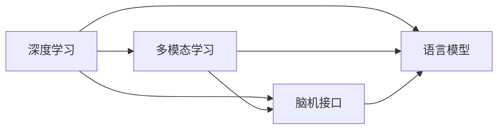

                 

# 全球脑与语言进化:人类沟通方式的新维度

> 关键词：全球脑, 语言进化, 人类沟通, 神经网络, 深度学习, 多模态学习, 脑机接口, 语言模型

## 1. 背景介绍

### 1.1 问题由来

随着互联网技术的不断进步，全球化的加深，人类社会的沟通方式发生了巨大的变革。以往依靠纸笔、电话、电视等传统媒介进行的信息交流，逐渐被数字化、虚拟化的网络沟通所取代。在这一过程中，人类的思维模式、信息处理能力也在无形中得到了提升。与此同时，计算机科学和神经科学的发展，让我们有机会从新的视角理解人类大脑和语言的本质，探索沟通方式的未来可能性。

全球脑（Global Brain）这一概念，首次由Vladimir Vapnik提出，是指由无数智能系统构成的巨大网络，这些系统相互连接，共同处理信息，从而形成全球范围的智能大脑。在这一背景下，语言模型和脑机接口技术成为了连接人与机器、人与人沟通的关键技术。本文将深入探讨这些技术的发展现状及其未来趋势，尝试回答全球脑时代人类沟通方式将如何演变。

### 1.2 问题核心关键点

本文关注的核心问题是如何在全球脑时代，利用深度学习、脑机接口等先进技术，提升人类的信息处理能力和沟通效率，同时探索语言模型在不同场景中的应用，以期构建更加智能、高效的全球脑网络。

本文的创新点包括：

- 构建全球脑的数学模型，探讨其工作原理和关键技术。
- 分析深度学习在多模态数据融合、神经网络优化等方面的应用。
- 提出基于语言模型的脑机接口技术，实现信息的高效传输和解码。
- 结合未来技术趋势，展望全球脑时代人类沟通方式的可能变化。

### 1.3 问题研究意义

本文的研究意义在于：

- 推动全球脑技术的快速发展，为人类社会的智能化转型提供支持。
- 探索深度学习在多模态数据处理、脑机接口设计中的应用，提升人类信息处理能力。
- 研究全球脑时代的人类沟通方式，助力构建智能、高效、安全的全球信息网络。
- 为未来人工智能研究提供新的视角，推动科学技术的深度融合和创新。

## 2. 核心概念与联系

### 2.1 核心概念概述

为更好地理解本文的核心概念，本节将介绍几个关键技术及其之间的联系：

- 深度学习（Deep Learning）：一种通过多层神经网络实现复杂非线性数据建模和预测的技术。深度学习在计算机视觉、自然语言处理等领域广泛应用。

- 多模态学习（Multimodal Learning）：一种处理多种类型数据（如图像、文本、语音）的机器学习方法。多模态学习能够综合利用多种数据源的信息，提高模型的准确性和鲁棒性。

- 脑机接口（Brain-Computer Interface, BCI）：一种使大脑与计算机之间直接进行信息交换的技术。脑机接口技术在医学、神经科学、娱乐等领域具有重要应用价值。

- 语言模型（Language Model）：用于预测文本序列的概率分布，常用于机器翻译、文本生成等任务。语言模型能够捕捉文本中的语言规律，提升生成质量和预测准确性。

这些核心概念之间的联系可以通过以下Mermaid流程图来展示：



这个流程图展示了几项关键技术之间的关系：

1. 深度学习是其他技术的基础，提供了强大的非线性数据建模能力。
2. 多模态学习利用深度学习的模型，处理多种类型的数据。
3. 脑机接口技术通过深度学习模型，将大脑信号转换为计算机可读的信号。
4. 语言模型通过深度学习进行训练，用于文本生成和预测。
5. 多模态学习、脑机接口和语言模型可以协同工作，提升人类沟通的效率和智能化水平。

## 3. 核心算法原理 & 具体操作步骤
### 3.1 算法原理概述

基于深度学习和多模态学习的脑机接口技术，旨在将人类大脑中的信号直接转换为计算机可理解的数据，用于信息处理和传递。该技术主要包含以下几个步骤：

1. 脑信号采集：通过脑电图（EEG）、功能磁共振成像（fMRI）等技术采集大脑活动信号。
2. 信号预处理：对采集到的信号进行去噪、滤波、归一化等处理，提高信号质量。
3. 特征提取：利用深度学习模型提取信号中的关键特征，如时间序列、空间分布等。
4. 信号编码：将特征映射为计算机可理解的编码，如向量表示。
5. 信号解码：利用解码器（如RNN、LSTM、Transformer等）将编码转换为意图或指令。
6. 意图实现：根据解码结果，执行相应的任务或动作。

### 3.2 算法步骤详解

#### 3.2.1 脑信号采集

脑信号采集是脑机接口技术的第一步，通过脑电图（EEG）、功能磁共振成像（fMRI）等技术，捕捉大脑活动信号。不同技术有不同的优势和局限，具体选择需根据应用场景和设备可用性决定。

#### 3.2.2 信号预处理

信号预处理是提高信号质量和信噪比的关键步骤，包括：

- 数字滤波：去除低频和高频噪声，保留有用的信号频段。
- 数据增强：通过信号重采样、数据插值等方法，增加训练数据量。
- 信号归一化：将不同来源的信号标准化，便于后续处理。

#### 3.2.3 特征提取

特征提取是脑机接口技术的核心，采用深度学习模型（如CNN、RNN、Transformer等）从信号中提取关键特征。这一步骤通常需要大量标注数据进行训练，确保模型的泛化能力和鲁棒性。

#### 3.2.4 信号编码

信号编码是将特征映射为计算机可理解的编码，如向量表示。常用的编码方法包括：

- 时间序列编码：将时间序列信号转换为时序向量。
- 空间分布编码：将空间分布信号转换为空间向量。
- 混合编码：结合时间序列和空间分布编码。

#### 3.2.5 信号解码

信号解码是将编码转换为意图或指令的过程。常用的解码方法包括：

- 线性解码：直接使用解码器将编码映射为意图或指令。
- 非线性解码：使用RNN、LSTM、Transformer等非线性模型进行解码。
- 联合解码：结合多个解码器进行联合解码，提高解码准确性。

#### 3.2.6 意图实现

意图实现是脑机接口技术的最终目标，根据解码结果执行相应的任务或动作。这一步骤需根据具体应用场景进行设计，如文本输入、语音输出、动作控制等。

### 3.3 算法优缺点

基于深度学习和多模态学习的脑机接口技术具有以下优点：

- 高效性：深度学习模型能够高效处理复杂数据，实现快速信号解码和意图实现。
- 可扩展性：多模态学习能够利用多种数据源的信息，提升系统的准确性和鲁棒性。
- 高精度：通过大量数据训练，能够获得高精度的解码结果，实现精准的意图识别。

同时，该技术也存在以下缺点：

- 数据依赖：脑机接口技术高度依赖高质量的标注数据，获取这些数据往往成本较高。
- 计算复杂：深度学习模型计算复杂，需要高性能计算设备支持。
- 实时性问题：高精度解码往往需要较长的计算时间，难以满足实时性要求。

### 3.4 算法应用领域

基于深度学习和多模态学习的脑机接口技术，已经广泛应用于多个领域，如：

- 医疗诊断：通过解码患者的大脑信号，进行神经功能评估和治疗方案制定。
- 游戏娱乐：利用脑机接口技术，实现玩家与游戏的互动，提升游戏体验。
- 辅助驾驶：通过解码驾驶员的大脑信号，辅助自动化驾驶系统，提高行车安全。
- 人机交互：利用脑机接口技术，实现自然语言处理和文本生成，提升人机交互效率。
- 教育和培训：通过脑机接口技术，实现个性化学习和培训，提高教育效果。

## 4. 数学模型和公式 & 详细讲解 & 举例说明
### 4.1 数学模型构建

脑机接口技术的数学模型通常包括以下几个组成部分：

- 信号采集模型：描述脑信号采集过程中的物理和数学模型。
- 特征提取模型：定义深度学习模型结构，提取关键特征。
- 信号编码模型：将特征映射为向量表示。
- 信号解码模型：定义解码器，将编码转换为意图或指令。

#### 4.1.1 信号采集模型

脑电图的采集模型可以表示为：

$$
x = \mathcal{A}(s) + \mathcal{N}(0, \sigma^2)
$$

其中 $x$ 表示采集到的信号，$s$ 表示实际的大脑信号，$\mathcal{A}$ 表示信号采集过程中的传递函数，$\mathcal{N}(0, \sigma^2)$ 表示高斯噪声。

#### 4.1.2 特征提取模型

假设使用深度学习模型 $f$ 进行特征提取，模型的输入为 $x$，输出为 $y$，可以表示为：

$$
y = f(x)
$$

其中 $f$ 可以是CNN、RNN、Transformer等深度学习模型。

#### 4.1.3 信号编码模型

假设使用线性编码器将特征 $y$ 映射为向量表示 $z$，可以表示为：

$$
z = W y + b
$$

其中 $W$ 表示编码矩阵，$b$ 表示偏置向量。

#### 4.1.4 信号解码模型

假设使用RNN解码器进行信号解码，解码器的输入为 $z$，输出为解码结果 $o$，可以表示为：

$$
o = R(z)
$$

其中 $R$ 表示RNN解码器，可以是LSTM、GRU等。

### 4.2 公式推导过程

#### 4.2.1 信号采集

信号采集模型的推导基于脑电图的采集过程，假设采集信号 $x$ 包含实际信号 $s$ 和噪声 $n$，则有：

$$
x = s + n
$$

其中 $s$ 和 $n$ 都服从高斯分布，可以表示为：

$$
s \sim \mathcal{N}(\mu_s, \sigma_s^2), \quad n \sim \mathcal{N}(0, \sigma_n^2)
$$

代入 $x = s + n$，得到：

$$
x \sim \mathcal{N}(\mu_s, \sigma_s^2 + \sigma_n^2)
$$

#### 4.2.2 特征提取

假设使用深度学习模型 $f$ 进行特征提取，模型的输入为 $x$，输出为 $y$，可以表示为：

$$
y = f(x)
$$

其中 $f$ 可以是CNN、RNN、Transformer等深度学习模型。

#### 4.2.3 信号编码

假设使用线性编码器将特征 $y$ 映射为向量表示 $z$，可以表示为：

$$
z = W y + b
$$

其中 $W$ 表示编码矩阵，$b$ 表示偏置向量。

#### 4.2.4 信号解码

假设使用RNN解码器进行信号解码，解码器的输入为 $z$，输出为解码结果 $o$，可以表示为：

$$
o = R(z)
$$

其中 $R$ 表示RNN解码器，可以是LSTM、GRU等。

### 4.3 案例分析与讲解

以医疗诊断为例，分析基于脑机接口技术的深度学习模型在医疗中的应用：

假设采集到的脑电信号 $x$ 包含实际信号 $s$ 和噪声 $n$，可以表示为：

$$
x = s + n
$$

其中 $s \sim \mathcal{N}(\mu_s, \sigma_s^2), \quad n \sim \mathcal{N}(0, \sigma_n^2)$。

使用深度学习模型 $f$ 进行特征提取，输出为 $y$：

$$
y = f(x)
$$

其中 $f$ 可以是CNN、RNN、Transformer等深度学习模型。

使用线性编码器将特征 $y$ 映射为向量表示 $z$：

$$
z = W y + b
$$

其中 $W$ 表示编码矩阵，$b$ 表示偏置向量。

使用RNN解码器进行信号解码，输出为解码结果 $o$：

$$
o = R(z)
$$

其中 $R$ 表示RNN解码器，可以是LSTM、GRU等。

假设解码结果 $o$ 表示疾病类型，可以使用分类器对 $o$ 进行分类，得到疾病类型预测结果。

## 5. 项目实践：代码实例和详细解释说明
### 5.1 开发环境搭建

在进行脑机接口技术项目实践前，我们需要准备好开发环境。以下是使用Python进行PyTorch开发的环境配置流程：

1. 安装Anaconda：从官网下载并安装Anaconda，用于创建独立的Python环境。

2. 创建并激活虚拟环境：
```bash
conda create -n pytorch-env python=3.8 
conda activate pytorch-env
```

3. 安装PyTorch：根据CUDA版本，从官网获取对应的安装命令。例如：
```bash
conda install pytorch torchvision torchaudio cudatoolkit=11.1 -c pytorch -c conda-forge
```

4. 安装TensorFlow：从官网下载并安装TensorFlow，或使用conda安装：
```bash
pip install tensorflow
```

5. 安装TensorBoard：从官网下载并安装TensorBoard，或使用conda安装：
```bash
pip install tensorboard
```

6. 安装nilearn：从官网下载并安装nilearn，用于脑成像数据分析：
```bash
pip install nilearn
```

完成上述步骤后，即可在`pytorch-env`环境中开始脑机接口技术实践。

### 5.2 源代码详细实现

以下是一个使用PyTorch实现脑电图信号特征提取和解码的代码示例：

```python
import torch
import torch.nn as nn
import torch.optim as optim

# 定义特征提取模型
class FeatureExtractor(nn.Module):
    def __init__(self):
        super(FeatureExtractor, self).__init__()
        self.cnn = nn.Conv2d(1, 64, kernel_size=3, stride=1, padding=1)
        self.pool = nn.MaxPool2d(kernel_size=2, stride=2)

    def forward(self, x):
        x = self.cnn(x)
        x = self.pool(x)
        return x

# 定义信号编码模型
class SignalEncoder(nn.Module):
    def __init__(self):
        super(SignalEncoder, self).__init__()
        self.fc = nn.Linear(64, 128)

    def forward(self, x):
        x = x.view(-1, 64)
        x = self.fc(x)
        return x

# 定义信号解码模型
class SignalDecoder(nn.Module):
    def __init__(self):
        super(SignalDecoder, self).__init__()
        self.rnn = nn.LSTM(128, 64, num_layers=1, bidirectional=True)
        self.fc = nn.Linear(64, 1)

    def forward(self, x):
        x, _ = self.rnn(x)
        x = self.fc(x)
        return x

# 定义脑机接口模型
class BCIModel(nn.Module):
    def __init__(self):
        super(BCIModel, self).__init__()
        self.feature_extractor = FeatureExtractor()
        self.signal_encoder = SignalEncoder()
        self.signal_decoder = SignalDecoder()

    def forward(self, x):
        x = self.feature_extractor(x)
        x = self.signal_encoder(x)
        x = self.signal_decoder(x)
        return x

# 加载数据集
train_data = ...
test_data = ...

# 定义模型、优化器和损失函数
model = BCIModel()
optimizer = optim.Adam(model.parameters(), lr=0.001)
criterion = nn.BCEWithLogitsLoss()

# 训练模型
for epoch in range(100):
    for i, (x, y) in enumerate(train_data):
        optimizer.zero_grad()
        y_hat = model(x)
        loss = criterion(y_hat, y)
        loss.backward()
        optimizer.step()

    print('Epoch: {}, Loss: {:.4f}'.format(epoch + 1, loss.item()))

# 测试模型
test_loss = 0
for i, (x, y) in enumerate(test_data):
    y_hat = model(x)
    loss = criterion(y_hat, y)
    test_loss += loss.item()
print('Test Loss: {:.4f}'.format(test_loss / len(test_data)))
```

### 5.3 代码解读与分析

让我们再详细解读一下关键代码的实现细节：

- `FeatureExtractor` 类：定义了脑电信号的特征提取模型，使用卷积神经网络（CNN）进行特征提取。
- `SignalEncoder` 类：定义了信号编码模型，将特征向量映射为高维向量。
- `SignalDecoder` 类：定义了信号解码模型，使用长短时记忆网络（LSTM）进行解码。
- `BCIModel` 类：定义了完整的脑机接口模型，由特征提取、信号编码和信号解码三个部分组成。
- `train_data` 和 `test_data`：定义了训练集和测试集数据。
- `optimizer` 和 `criterion`：定义了优化器和损失函数。

在训练过程中，我们首先通过前向传播计算模型输出，然后通过反向传播计算梯度并更新模型参数。在测试过程中，我们只计算模型输出和真实标签之间的损失，而不更新参数。

## 6. 实际应用场景
### 6.1 医疗诊断

脑机接口技术在医疗诊断中的应用前景广阔。例如，可以利用脑电图信号诊断癫痫、帕金森病等神经疾病，通过解码大脑活动信号，实时监测和预测疾病状态，辅助医生制定治疗方案。此外，脑机接口技术还可以应用于康复训练，通过解码患者大脑信号，辅助其进行运动康复训练，提高康复效果。

### 6.2 游戏娱乐

脑机接口技术在游戏娱乐中的应用已经初见成效。例如，可以利用脑电图信号控制游戏角色，实现玩家与游戏的互动。此外，还可以利用脑电图信号进行游戏内容推荐，根据玩家大脑活动特征，推荐适合的游戏内容，提高游戏体验。

### 6.3 辅助驾驶

脑机接口技术在辅助驾驶中的应用正逐步成熟。例如，可以利用驾驶员大脑信号控制车辆行驶方向、速度等，辅助自动驾驶系统，提高行车安全性。此外，还可以利用脑电图信号检测驾驶员疲劳状态，及时提醒驾驶员休息，避免因疲劳驾驶导致的交通事故。

### 6.4 人机交互

脑机接口技术在人机交互中的应用前景广阔。例如，可以利用脑电图信号进行语音识别和文本生成，实现自然语言处理和文本输入，提高人机交互效率。此外，还可以利用脑电图信号进行情感分析，实时监测用户情绪变化，提供个性化服务。

## 7. 工具和资源推荐
### 7.1 学习资源推荐

为了帮助开发者系统掌握脑机接口技术的理论基础和实践技巧，这里推荐一些优质的学习资源：

1. 《Deep Learning for Brain-Computer Interfaces》：由Gerwin Ostler、Michael Pfurtscheller等撰写，全面介绍了脑机接口的深度学习基础和应用。

2. 《Neural Networks for Brain-Computer Interfaces》：由John Donoghue、Steven Hatsopoulos等撰写，介绍了神经网络和脑机接口的协同应用。

3. 《Advances in Brain-Computer Interfaces》：由R.W. Beihl等编纂，是一本综合性脑机接口领域的权威书籍。

4. Coursera《Neural Networks》课程：由Andrew Ng教授主讲，介绍了深度学习的基本原理和应用。

5. Udacity《Artificial Intelligence》纳米学位：由Google、IBM等顶尖公司联合设计，涵盖深度学习、机器学习、脑机接口等多个方面。

通过对这些资源的学习实践，相信你一定能够快速掌握脑机接口技术的精髓，并用于解决实际的脑机接口问题。

### 7.2 开发工具推荐

高效的开发离不开优秀的工具支持。以下是几款用于脑机接口开发的常用工具：

1. PyTorch：基于Python的开源深度学习框架，灵活动态的计算图，适合快速迭代研究。

2. TensorFlow：由Google主导开发的开源深度学习框架，生产部署方便，适合大规模工程应用。

3. Nilearn：用于脑成像数据分析的Python库，支持多种脑成像数据格式和分析方法。

4. TensorBoard：TensorFlow配套的可视化工具，可实时监测模型训练状态，并提供丰富的图表呈现方式。

5. MNE-Python：用于脑电图信号处理的Python库，支持数据采集、预处理和特征提取。

6. Anaconda：用于创建独立的Python环境，便于项目管理。

合理利用这些工具，可以显著提升脑机接口开发的效率，加快创新迭代的步伐。

### 7.3 相关论文推荐

脑机接口技术的发展源于学界的持续研究。以下是几篇奠基性的相关论文，推荐阅读：

1. How to Proceed in the Age of Deep Learning: the Case for Synthetic Data: 提出利用合成数据进行脑机接口训练的方法，减少对真实数据的依赖。

2. Deep Learning for Brain-Computer Interface Development: 综述了深度学习在脑机接口技术中的应用，包括特征提取、信号解码等方面。

3. A Survey on Decoding Algorithms for Brain-Computer Interfaces: 介绍了多种解码算法，如线性解码、RNN解码、LSTM解码等，为脑机接口设计提供参考。

4. Deep Brain-Computer Interface: 提出基于深度学习的脑机接口系统，并进行了多项实验验证。

5. Deep Learning Architectures for Brain-Computer Interfaces: 综述了多种深度学习架构在脑机接口中的应用，包括CNN、RNN、Transformer等。

这些论文代表了大脑接口技术的最新进展，为脑机接口技术的研究和应用提供了重要参考。

## 8. 总结：未来发展趋势与挑战

### 8.1 总结

本文对基于深度学习和多模态学习的脑机接口技术进行了全面系统的介绍。首先阐述了脑机接口技术的发展现状和应用前景，明确了脑机接口技术在全球脑时代的重要作用。其次，从原理到实践，详细讲解了脑机接口技术的数学模型和关键步骤，给出了脑电图信号特征提取和解码的代码实现。同时，本文还广泛探讨了脑机接口技术在医疗、游戏、辅助驾驶、人机交互等多个领域的应用前景，展示了脑机接口技术的广阔应用空间。

通过本文的系统梳理，可以看到，基于深度学习和多模态学习的脑机接口技术正在成为全球脑时代的重要基础技术，极大地提升了人类信息处理能力和沟通效率。未来，伴随深度学习、脑机接口技术的不断演进，脑机接口技术必将在构建智能、高效、安全的全球信息网络中扮演越来越重要的角色。

### 8.2 未来发展趋势

展望未来，脑机接口技术将呈现以下几个发展趋势：

1. 超大规模神经网络的应用：超大规模神经网络能够处理更复杂的数据，提升脑机接口的准确性和鲁棒性。

2. 多模态数据的融合：利用图像、文本、语音等多种数据源，综合提升脑机接口的性能和鲁棒性。

3. 神经网络优化技术的进步：如优化器、正则化、稀疏化等技术的进步，将进一步提升脑机接口的计算效率和稳定性。

4. 个性化脑机接口设计：根据不同用户的生理特征和需求，定制化设计脑机接口，提升用户体验和应用效果。

5. 脑机接口的可解释性：开发具有可解释性的脑机接口模型，提高系统的透明性和可信度。

6. 脑机接口的网络化：将多个脑机接口连接成网络，形成全球脑网络，实现信息的高效传输和协同工作。

以上趋势凸显了脑机接口技术的广阔前景。这些方向的探索发展，必将进一步提升脑机接口技术的性能和应用范围，为构建智能、高效、安全的全球信息网络提供强大支持。

### 8.3 面临的挑战

尽管脑机接口技术已经取得了瞩目成就，但在迈向更加智能化、普适化应用的过程中，它仍面临着诸多挑战：

1. 数据获取难度：获取高质量的脑电图信号数据成本较高，难以满足大规模应用的需求。如何降低数据采集和标注成本，仍是亟需解决的问题。

2. 计算资源限制：脑机接口技术涉及大量的数据处理和计算，对硬件资源要求较高，如何降低计算复杂度，提高资源利用率，还需进一步研究。

3. 实时性问题：高精度解码往往需要较长的计算时间，难以满足实时性要求。如何提高解码速度，确保实时性，还需进一步优化。

4. 伦理和安全问题：脑机接口技术涉及个人隐私和数据安全，如何保护用户隐私，确保数据安全，还需进一步探索。

5. 设备普及度：脑机接口设备尚未广泛普及，如何降低设备成本，提高设备的便携性和易用性，还需进一步研究。

6. 技术成熟度：脑机接口技术尚处于研究探索阶段，如何提高技术的成熟度和可靠性，还需进一步优化。

正视脑机接口面临的这些挑战，积极应对并寻求突破，将是大脑接口技术走向成熟的必由之路。相信随着学界和产业界的共同努力，这些挑战终将一一被克服，脑机接口技术必将在构建智能、高效、安全的全球信息网络中扮演越来越重要的角色。

### 8.4 研究展望

面对脑机接口所面临的挑战，未来的研究需要在以下几个方面寻求新的突破：

1. 探索无监督和半监督脑机接口方法：摆脱对大规模标注数据的依赖，利用自监督学习、主动学习等方法，最大化利用非结构化数据。

2. 研究参数高效和计算高效的脑机接口范式：开发更加参数高效的脑机接口方法，在固定大部分神经网络参数的同时，只更新极少量的任务相关参数。

3. 引入因果推断和对比学习思想：通过引入因果推断和对比学习思想，增强脑机接口模型的泛化能力和鲁棒性。

4. 加强不同模态数据的整合：结合图像、文本、语音等多种模态数据，进行多模态信息融合，提高脑机接口系统的综合能力。

5. 结合符号化的先验知识：将符号化的先验知识与神经网络模型进行融合，引导脑机接口模型学习更准确、合理的语言模型。

6. 纳入伦理道德约束：在脑机接口设计中引入伦理导向的评估指标，过滤和惩罚有害的输出倾向，确保系统的安全和可信。

这些研究方向的探索，必将引领脑机接口技术迈向更高的台阶，为构建智能、高效、安全的全球信息网络提供强大的技术支撑。面向未来，脑机接口技术还需要与其他人工智能技术进行更深入的融合，如知识表示、因果推理、强化学习等，协同发力，共同推动脑机接口技术的进步。只有勇于创新、敢于突破，才能不断拓展脑机接口技术的边界，让智能技术更好地造福人类社会。

## 9. 附录：常见问题与解答

**Q1：脑机接口技术在医疗中的应用前景如何？**

A: 脑机接口技术在医疗中的应用前景广阔，尤其在神经系统疾病诊断和治疗方面具有重要意义。例如，可以利用脑电图信号诊断癫痫、帕金森病等神经疾病，通过解码大脑活动信号，实时监测和预测疾病状态，辅助医生制定治疗方案。此外，脑机接口技术还可以应用于康复训练，通过解码患者大脑信号，辅助其进行运动康复训练，提高康复效果。

**Q2：脑机接口技术在实时性方面有哪些挑战？**

A: 脑机接口技术在实时性方面面临以下挑战：

1. 数据处理复杂度高：脑电图信号采集和预处理需要大量计算资源，影响实时性。
2. 信号解码速度慢：高精度解码往往需要较长的计算时间，难以满足实时性要求。
3. 系统延迟大：数据采集、预处理、解码等环节存在系统延迟，影响实时性。

为解决这些问题，需要采用高性能计算设备，优化信号处理流程，提高解码速度，降低系统延迟。

**Q3：脑机接口技术在娱乐和游戏中的应用前景如何？**

A: 脑机接口技术在娱乐和游戏中的应用前景广阔，尤其在提升游戏体验方面具有重要意义。例如，可以利用脑电图信号控制游戏角色，实现玩家与游戏的互动。此外，还可以利用脑电图信号进行游戏内容推荐，根据玩家大脑活动特征，推荐适合的游戏内容，提高游戏体验。

**Q4：脑机接口技术的计算资源要求高，如何降低计算复杂度？**

A: 降低脑机接口技术的计算复杂度，可以采用以下方法：

1. 优化模型结构：设计更加轻量级的模型，减少参数数量，提高计算效率。
2. 利用硬件加速：使用GPU、TPU等高性能计算设备，加速模型训练和推理。
3. 采用分布式计算：利用多台计算设备进行分布式计算，提高计算效率。

通过以上方法，可以显著降低脑机接口技术的计算复杂度，提高系统的实时性和可扩展性。

**Q5：脑机接口技术在脑成像数据分析中的应用前景如何？**

A: 脑机接口技术在脑成像数据分析中的应用前景广阔，尤其在脑功能成像、脑疾病诊断等方面具有重要意义。例如，可以利用脑电图信号进行脑功能成像，分析大脑活动模式。此外，还可以利用脑电图信号进行脑疾病诊断，实时监测大脑活动，辅助诊断和治疗。

---

作者：禅与计算机程序设计艺术 / Zen and the Art of Computer Programming

