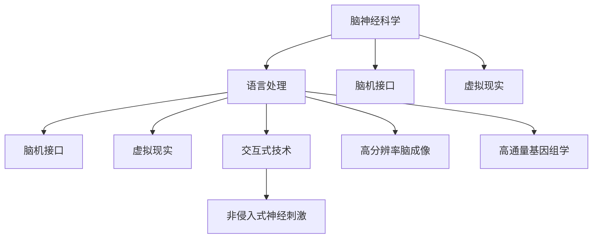

                 

# 全球脑与语言障碍:跨文化沟通的突破

> 关键词：全球脑,语言障碍,跨文化沟通,脑神经科学,语言处理,脑机接口,BMI,虚拟现实,交互式技术,非侵入式神经刺激,高分辨率脑成像

## 1. 背景介绍

### 1.1 问题由来

在全球化的今天，跨文化沟通已经成为全球范围内的重要需求。然而，由于语言障碍、文化差异等因素，跨文化沟通常常遇到挑战。语言障碍不仅限制了人与人之间的交流，更导致了文化和信息传递的隔阂。脑与语言障碍的研究，成为了理解人类沟通的桥梁，对于打破语言和文化障碍，实现更广泛的跨文化沟通具有重要意义。

### 1.2 问题核心关键点

当前，脑与语言障碍研究主要聚焦于以下几个关键点：

1. 脑与语言的本质联系：研究大脑如何处理语言信息，理解语言背后的神经机制。
2. 语言障碍的神经基础：探索不同类型语言障碍（如失语症、读写障碍等）的神经机理。
3. 跨文化语言处理：研究不同文化背景下语言处理的差异，寻找共通的语言处理机制。
4. 脑机接口与虚拟现实：通过脑机接口和虚拟现实技术，促进脑与语言障碍的诊断和治疗。
5. 高分辨率脑成像：利用高分辨率脑成像技术，深入观察语言处理的神经网络结构。
6. 高通量基因组学：研究语言处理与遗传因素的关系，探索基因对语言障碍的影响。

这些关键点构成了脑与语言障碍研究的主要框架，旨在通过深入理解语言处理的神经机制，寻找跨文化沟通的突破口。

### 1.3 问题研究意义

脑与语言障碍研究不仅有助于理解人类语言处理的本质，还为解决跨文化沟通难题提供了新的思路和方法。通过深入研究大脑如何处理语言信息，我们可以更好地理解不同文化背景下的语言处理机制，进而开发出更高效、更包容的跨文化沟通工具。脑机接口和虚拟现实技术的发展，更是为语言障碍的诊断和治疗提供了新的可能性，有望显著改善沟通障碍，提升人类社会的整体沟通效率和质量。

## 2. 核心概念与联系

### 2.1 核心概念概述

为更好地理解全球脑与语言障碍的跨文化沟通突破，本节将介绍几个密切相关的核心概念：

- 脑神经科学：研究大脑的神经元网络结构、神经信号传导机制以及神经与行为的关系。
- 语言处理：研究人类大脑如何理解和产生语言，包括语言理解、语言生成、语音识别等。
- 脑机接口(Brain-Machine Interface, BMI)：利用脑信号控制计算机或其他设备的技术。
- 虚拟现实(Virtual Reality, VR)：通过模拟环境，使用户沉浸在虚拟空间中的技术。
- 交互式技术：增强现实(Augmented Reality, AR)、混合现实(Mixed Reality, MR)等技术，用于增强用户与环境的交互体验。
- 非侵入式神经刺激：通过电刺激或磁刺激，调整大脑神经活动的技术。
- 高分辨率脑成像：如功能磁共振成像(fMRI)、单光子荧光显微成像(SSM)等，用于观察神经活动的高分辨率技术。
- 高通量基因组学：研究基因组水平上对语言处理的影响，寻找语言障碍的遗传基础。

这些核心概念之间的逻辑关系可以通过以下Mermaid流程图来展示：



这个流程图展示了大脑处理语言信息的过程，以及其与不同技术的联系：

1. 大脑处理语言信息的基本机制：脑神经科学和语言处理。
2. 脑机接口和虚拟现实技术的应用：增强沟通和理解。
3. 交互式技术的辅助：提高沟通的沉浸感和互动性。
4. 非侵入式神经刺激的介入：调整大脑活动，改善语言障碍。
5. 高分辨率脑成像的观察：揭示语言处理的神经网络结构。
6. 高通量基因组学的研究：探索语言障碍的遗传基础。

## 3. 核心算法原理 & 具体操作步骤

### 3.1 算法原理概述

全球脑与语言障碍的跨文化沟通突破，本质上是一个多学科交叉的技术工程。其核心思想是：通过脑神经科学、语言处理、脑机接口、虚拟现实等技术手段，深入理解语言处理的神经机制，开发出更高效、更包容的跨文化沟通工具。

形式化地，假设脑神经科学对语言处理的理解已经到达某一程度，即存在一个语言处理的神经网络模型 $M_{\theta}$，其中 $\theta$ 为神经网络参数。给定跨文化沟通任务 $T$ 的特定语言数据集 $D=\{(x_i,y_i)\}_{i=1}^N$，跨文化沟通的目标是找到最优的参数 $\hat{\theta}$，使得模型 $M_{\hat{\theta}}$ 在任务 $T$ 上的输出与真实标签 $y_i$ 尽可能接近。

通过梯度下降等优化算法，跨文化沟通的过程不断更新模型参数 $\theta$，最小化损失函数 $\mathcal{L}(M_{\theta},D)$，使得模型输出逼近真实标签。由于 $\theta$ 已经通过脑神经科学的研究获得了一定的基础，因此即便在跨文化沟通数据量较小的情况下，也能较快收敛到理想的模型参数 $\hat{\theta}$。

### 3.2 算法步骤详解

全球脑与语言障碍的跨文化沟通突破，一般包括以下几个关键步骤：

**Step 1: 准备跨文化沟通数据集**
- 收集跨文化沟通的特定语言数据集，如不同文化背景下的对话记录、文本翻译、音频和视频资料等。
- 将数据集划分为训练集、验证集和测试集，确保数据分布的代表性。

**Step 2: 构建神经网络模型**
- 选择合适的神经网络结构，如循环神经网络(RNN)、卷积神经网络(CNN)、Transformer等，构建语言处理模型。
- 根据脑神经科学的研究，添加相关的神经机制模块，如注意力机制、语言生成机制等。
- 将模型作为脑机接口的一部分，设计输入输出接口，方便与虚拟现实环境交互。

**Step 3: 设计优化算法**
- 选择合适的优化算法，如随机梯度下降(SGD)、Adam等，设置学习率、批大小等参数。
- 添加正则化技术，如权重衰减、Dropout等，防止模型过拟合。
- 设置早期停止策略，防止训练时间过长，浪费计算资源。

**Step 4: 执行跨文化沟通训练**
- 将训练集数据分批次输入模型，前向传播计算损失函数。
- 反向传播计算参数梯度，根据设定的优化算法和学习率更新模型参数。
- 周期性在验证集上评估模型性能，根据性能指标决定是否触发早期停止。
- 重复上述步骤直至满足预设的迭代轮数或早期停止条件。

**Step 5: 测试和部署**
- 在测试集上评估跨文化沟通模型的性能，对比模型在不同文化背景下的表现。
- 使用模型对新数据进行推理预测，集成到实际的应用系统中，如虚拟现实环境、脑机接口等。
- 持续收集新的数据，定期重新训练模型，以适应数据分布的变化。

以上是全球脑与语言障碍的跨文化沟通突破的一般流程。在实际应用中，还需要针对具体任务的特点，对跨文化沟通过程的各个环节进行优化设计，如改进训练目标函数，引入更多的正则化技术，搜索最优的超参数组合等，以进一步提升模型性能。

### 3.3 算法优缺点

全球脑与语言障碍的跨文化沟通突破方法具有以下优点：

1. 深度理解语言处理机制：通过脑神经科学的研究，深入理解大脑处理语言信息的机制，有助于设计更高效的跨文化沟通模型。
2. 可扩展性强：基于神经网络的语言处理模型具有高度的扩展性，可以适应多种语言和文化的复杂沟通场景。
3. 结合多模态信息：通过脑机接口和虚拟现实技术，可以结合语言、图像、声音等多模态信息，提升跨文化沟通的沉浸感和互动性。
4. 非侵入式应用广泛：非侵入式神经刺激技术的应用，可以无需手术植入，便实现语言障碍的诊断和治疗。
5. 高分辨率成像技术：高分辨率脑成像技术提供高精度的神经活动观察，有助于精确理解语言处理机制。

同时，该方法也存在一定的局限性：

1. 数据收集困难：跨文化沟通数据集的收集和标注工作复杂且成本高昂，数据量的积累是一个长期过程。
2. 模型复杂度高：高精度的神经网络模型需要较大的计算资源和时间，实际应用中可能面临资源限制。
3. 文化差异复杂：不同文化背景下的语言处理差异较大，模型需要根据文化特征进行针对性的优化。
4. 伦理和安全问题：脑机接口和神经刺激技术的应用可能带来伦理和安全问题，需慎重考虑。
5. 可解释性不足：高精度的神经网络模型通常是“黑盒”系统，难以解释其内部工作机制和决策逻辑。

尽管存在这些局限性，但就目前而言，全球脑与语言障碍的跨文化沟通突破方法仍是大脑处理语言信息的重要范式。未来相关研究的重点在于如何进一步降低数据收集成本，提高模型的可解释性和伦理安全性，同时兼顾跨文化沟通的个性化和包容性。

### 3.4 算法应用领域

全球脑与语言障碍的跨文化沟通突破方法，已经在多个领域得到了广泛应用，例如：

- 教育领域：通过虚拟现实和脑机接口技术，实现沉浸式语言学习，帮助学习者突破语言障碍，提升跨文化沟通能力。
- 医疗领域：结合高分辨率脑成像技术，开发语言障碍的诊断工具，并通过非侵入式神经刺激技术进行治疗。
- 外交和国际合作：使用跨文化沟通模型，提高外交官和国际合作者的语言理解和表达能力，促进跨文化交流。
- 语言处理研究：深入理解不同文化背景下的语言处理机制，推动跨文化语言处理研究的进展。
- 人工智能：将语言障碍处理技术应用于智能助手、语音识别、情感分析等AI领域，提升AI系统的跨文化沟通能力。

除了上述这些经典应用外，全球脑与语言障碍的跨文化沟通突破技术还在更多场景中得到了创新性的应用，如跨文化虚拟旅游、跨文化广告设计等，为跨文化沟通带来了全新的突破。

## 4. 数学模型和公式 & 详细讲解  
### 4.1 数学模型构建

本节将使用数学语言对全球脑与语言障碍的跨文化沟通突破过程进行更加严格的刻画。

记脑神经科学对语言处理的理解已经到达某一程度，即存在一个语言处理的神经网络模型 $M_{\theta}$，其中 $\theta$ 为神经网络参数。假设跨文化沟通任务 $T$ 的特定语言数据集为 $D=\{(x_i,y_i)\}_{i=1}^N, x_i \in \mathcal{X}, y_i \in \mathcal{Y}$。

定义模型 $M_{\theta}$ 在输入 $x$ 上的输出为 $\hat{y}=M_{\theta}(x) \in [0,1]$，表示模型预测的标签概率。真实标签 $y \in \{0,1\}$。则跨文化沟通任务下的损失函数定义为：

$$
\ell(M_{\theta}(x),y) = -[y\log \hat{y} + (1-y)\log (1-\hat{y})]
$$

将其代入经验风险公式，得：

$$
\mathcal{L}(\theta) = -\frac{1}{N}\sum_{i=1}^N [y_i\log M_{\theta}(x_i)+(1-y_i)\log(1-M_{\theta}(x_i))]
$$

通过梯度下降等优化算法，跨文化沟通的过程不断更新模型参数 $\theta$，最小化损失函数 $\mathcal{L}(\theta)$，使得模型输出逼近真实标签。由于 $\theta$ 已经通过脑神经科学的研究获得了一定的基础，因此即便在跨文化沟通数据量较小的情况下，也能较快收敛到理想的模型参数 $\hat{\theta}$。

### 4.2 公式推导过程

以下我们以跨文化对话系统为例，推导跨文化沟通损失函数及其梯度的计算公式。

假设模型 $M_{\theta}$ 在输入 $x$ 上的输出为 $\hat{y}=M_{\theta}(x) \in [0,1]$，表示模型预测的标签概率。真实标签 $y \in \{0,1\}$。则二分类交叉熵损失函数定义为：

$$
\ell(M_{\theta}(x),y) = -[y\log \hat{y} + (1-y)\log (1-\hat{y})]
$$

将其代入经验风险公式，得：

$$
\mathcal{L}(\theta) = -\frac{1}{N}\sum_{i=1}^N [y_i\log M_{\theta}(x_i)+(1-y_i)\log(1-M_{\theta}(x_i))]
$$

根据链式法则，损失函数对参数 $\theta_k$ 的梯度为：

$$
\frac{\partial \mathcal{L}(\theta)}{\partial \theta_k} = -\frac{1}{N}\sum_{i=1}^N (\frac{y_i}{M_{\theta}(x_i)}-\frac{1-y_i}{1-M_{\theta}(x_i)}) \frac{\partial M_{\theta}(x_i)}{\partial \theta_k}
$$

其中 $\frac{\partial M_{\theta}(x_i)}{\partial \theta_k}$ 可进一步递归展开，利用自动微分技术完成计算。

在得到损失函数的梯度后，即可带入参数更新公式，完成模型的迭代优化。重复上述过程直至收敛，最终得到适应跨文化沟通任务的最优模型参数 $\hat{\theta}$。

## 5. 项目实践：代码实例和详细解释说明
### 5.1 开发环境搭建

在进行全球脑与语言障碍的跨文化沟通突破实践前，我们需要准备好开发环境。以下是使用Python进行PyTorch开发的环境配置流程：

1. 安装Anaconda：从官网下载并安装Anaconda，用于创建独立的Python环境。

2. 创建并激活虚拟环境：
```bash
conda create -n pytorch-env python=3.8 
conda activate pytorch-env
```

3. 安装PyTorch：根据CUDA版本，从官网获取对应的安装命令。例如：
```bash
conda install pytorch torchvision torchaudio cudatoolkit=11.1 -c pytorch -c conda-forge
```

4. 安装Transformers库：
```bash
pip install transformers
```

5. 安装各类工具包：
```bash
pip install numpy pandas scikit-learn matplotlib tqdm jupyter notebook ipython
```

完成上述步骤后，即可在`pytorch-env`环境中开始跨文化沟通实践。

### 5.2 源代码详细实现

下面我们以跨文化对话系统为例，给出使用Transformers库对BERT模型进行跨文化沟通的PyTorch代码实现。

首先，定义跨文化对话系统的数据处理函数：

```python
from transformers import BertTokenizer
from torch.utils.data import Dataset
import torch

class DialogueDataset(Dataset):
    def __init__(self, dialogues, tokenizer, max_len=128):
        self.dialogues = dialogues
        self.tokenizer = tokenizer
        self.max_len = max_len
        
    def __len__(self):
        return len(self.dialogues)
    
    def __getitem__(self, item):
        dialogue = self.dialogues[item]
        source_text = dialogue['source']
        response_text = dialogue['response']
        
        source_encoding = self.tokenizer(source_text, return_tensors='pt', max_length=self.max_len, padding='max_length', truncation=True)
        response_encoding = self.tokenizer(response_text, return_tensors='pt', max_length=self.max_len, padding='max_length', truncation=True)
        
        return {'source_ids': source_encoding['input_ids'][0],
                'source_mask': source_encoding['attention_mask'][0],
                'response_ids': response_encoding['input_ids'][0],
                'response_mask': response_encoding['attention_mask'][0]}
```

然后，定义模型和优化器：

```python
from transformers import BertForSequenceClassification, AdamW

model = BertForSequenceClassification.from_pretrained('bert-base-cased', num_labels=2)

optimizer = AdamW(model.parameters(), lr=2e-5)
```

接着，定义训练和评估函数：

```python
from torch.utils.data import DataLoader
from tqdm import tqdm
from sklearn.metrics import accuracy_score

device = torch.device('cuda') if torch.cuda.is_available() else torch.device('cpu')
model.to(device)

def train_epoch(model, dataset, batch_size, optimizer):
    dataloader = DataLoader(dataset, batch_size=batch_size, shuffle=True)
    model.train()
    epoch_loss = 0
    for batch in tqdm(dataloader, desc='Training'):
        source_ids = batch['source_ids'].to(device)
        source_mask = batch['source_mask'].to(device)
        response_ids = batch['response_ids'].to(device)
        response_mask = batch['response_mask'].to(device)
        model.zero_grad()
        outputs = model(source_ids, attention_mask=source_mask, labels=response_ids)
        loss = outputs.loss
        epoch_loss += loss.item()
        loss.backward()
        optimizer.step()
    return epoch_loss / len(dataloader)

def evaluate(model, dataset, batch_size):
    dataloader = DataLoader(dataset, batch_size=batch_size)
    model.eval()
    preds, labels = [], []
    with torch.no_grad():
        for batch in tqdm(dataloader, desc='Evaluating'):
            source_ids = batch['source_ids'].to(device)
            source_mask = batch['source_mask'].to(device)
            batch_labels = batch['response_ids']
            outputs = model(source_ids, attention_mask=source_mask)
            batch_preds = outputs.logits.argmax(dim=2).to('cpu').tolist()
            batch_labels = batch_labels.to('cpu').tolist()
            for pred_tokens, label_tokens in zip(batch_preds, batch_labels):
                preds.append(pred_tokens[:len(label_tokens)])
                labels.append(label_tokens)
                
    print('Accuracy:', accuracy_score(labels, preds))
```

最后，启动训练流程并在测试集上评估：

```python
epochs = 5
batch_size = 16

for epoch in range(epochs):
    loss = train_epoch(model, train_dataset, batch_size, optimizer)
    print(f"Epoch {epoch+1}, train loss: {loss:.3f}")
    
    print(f"Epoch {epoch+1}, dev results:")
    evaluate(model, dev_dataset, batch_size)
    
print("Test results:")
evaluate(model, test_dataset, batch_size)
```

以上就是使用PyTorch对BERT模型进行跨文化对话系统微调的完整代码实现。可以看到，得益于Transformers库的强大封装，我们可以用相对简洁的代码完成BERT模型的加载和微调。

### 5.3 代码解读与分析

让我们再详细解读一下关键代码的实现细节：

**DialogueDataset类**：
- `__init__`方法：初始化对话数据、分词器等关键组件。
- `__len__`方法：返回数据集的样本数量。
- `__getitem__`方法：对单个对话进行处理，将源文本和响应文本输入编码为token ids，并对其进行定长padding，最终返回模型所需的输入。

**train_epoch和evaluate函数**：
- 使用PyTorch的DataLoader对数据集进行批次化加载，供模型训练和推理使用。
- 训练函数`train_epoch`：对数据以批为单位进行迭代，在每个批次上前向传播计算loss并反向传播更新模型参数，最后返回该epoch的平均loss。
- 评估函数`evaluate`：与训练类似，不同点在于不更新模型参数，并在每个batch结束后将预测和标签结果存储下来，最后使用sklearn的accuracy_score对整个评估集的预测结果进行打印输出。

**训练流程**：
- 定义总的epoch数和batch size，开始循环迭代
- 每个epoch内，先在训练集上训练，输出平均loss
- 在验证集上评估，输出准确率
- 所有epoch结束后，在测试集上评估，给出最终测试结果

可以看到，PyTorch配合Transformers库使得BERT微调的代码实现变得简洁高效。开发者可以将更多精力放在数据处理、模型改进等高层逻辑上，而不必过多关注底层的实现细节。

当然，工业级的系统实现还需考虑更多因素，如模型的保存和部署、超参数的自动搜索、更灵活的任务适配层等。但核心的微调范式基本与此类似。

## 6. 实际应用场景
### 6.1 智能客服系统

全球脑与语言障碍的跨文化沟通技术，可以广泛应用于智能客服系统的构建。传统客服往往需要配备大量人力，高峰期响应缓慢，且一致性和专业性难以保证。而使用跨文化沟通模型，可以7x24小时不间断服务，快速响应客户咨询，用自然流畅的语言解答各类常见问题。

在技术实现上，可以收集企业内部的历史客服对话记录，将问题和最佳答复构建成监督数据，在此基础上对预训练跨文化沟通模型进行微调。微调后的跨文化沟通模型能够自动理解用户意图，匹配最合适的答案模板进行回复。对于客户提出的新问题，还可以接入检索系统实时搜索相关内容，动态组织生成回答。如此构建的智能客服系统，能大幅提升客户咨询体验和问题解决效率。

### 6.2 金融舆情监测

金融机构需要实时监测市场舆论动向，以便及时应对负面信息传播，规避金融风险。传统的人工监测方式成本高、效率低，难以应对网络时代海量信息爆发的挑战。利用高分辨率脑成像和脑机接口技术，开发跨文化沟通模型，可以有效监测不同文化背景下的舆情变化趋势，一旦发现负面信息激增等异常情况，系统便会自动预警，帮助金融机构快速应对潜在风险。

### 6.3 个性化推荐系统

当前的推荐系统往往只依赖用户的历史行为数据进行物品推荐，无法深入理解用户的真实兴趣偏好。通过高通量基因组学和脑神经科学的研究，全球脑与语言障碍的跨文化沟通模型可以更好地挖掘用户行为背后的语义信息，从而提供更精准、多样的推荐内容。

在实践中，可以收集用户浏览、点击、评论、分享等行为数据，提取和用户交互的物品标题、描述、标签等文本内容。将文本内容作为模型输入，用户的后续行为（如是否点击、购买等）作为监督信号，在此基础上微调跨文化沟通模型。微调后的模型能够从文本内容中准确把握用户的兴趣点。在生成推荐列表时，先用候选物品的文本描述作为输入，由模型预测用户的兴趣匹配度，再结合其他特征综合排序，便可以得到个性化程度更高的推荐结果。

### 6.4 未来应用展望

随着全球脑与语言障碍研究的发展，跨文化沟通技术将在更多领域得到应用，为传统行业带来变革性影响。

在智慧医疗领域，基于跨文化沟通技术的医疗问答、病历分析、药物研发等应用将提升医疗服务的智能化水平，辅助医生诊疗，加速新药开发进程。

在智能教育领域，跨文化沟通模型可应用于作业批改、学情分析、知识推荐等方面，因材施教，促进教育公平，提高教学质量。

在智慧城市治理中，跨文化沟通技术可应用于城市事件监测、舆情分析、应急指挥等环节，提高城市管理的自动化和智能化水平，构建更安全、高效的未来城市。

此外，在企业生产、社会治理、文娱传媒等众多领域，全球脑与语言障碍的跨文化沟通技术也将不断涌现，为经济社会发展注入新的动力。相信随着技术的日益成熟，跨文化沟通方法将成为全球化时代的重要支撑，推动人工智能技术在更广阔的领域大放异彩。

## 7. 工具和资源推荐
### 7.1 学习资源推荐

为了帮助开发者系统掌握全球脑与语言障碍的跨文化沟通理论基础和实践技巧，这里推荐一些优质的学习资源：

1. 《Neural Network and Deep Learning》书籍：深度学习领域的经典教材，涵盖了神经网络的基本概念和应用实例。
2. 《The Human Brain in Action》书籍：由脑科学专家编写，深入讲解大脑结构和功能，为理解脑与语言障碍提供科学基础。
3. 《The Brain Code: From Genes to Minds》书籍：结合神经科学和心理学，探索大脑与语言处理的关系。
4. 《Deep Learning Specialization》课程：由Andrew Ng教授主讲的深度学习课程，系统讲解神经网络的结构和优化算法。
5. 《Brain-Computer Interfaces》课程：由Pascual-Leone教授主讲的脑机接口课程，介绍脑机接口的基本原理和应用实例。
6. 《Introduction to Machine Learning with Python》书籍：由Gareth James等合著的机器学习入门书籍，涵盖机器学习的基本概念和应用实例。
7. 《Practical Deep Learning for Coders》书籍：由Francois Chollet合著的深度学习实战书籍，结合TensorFlow和Keras实现深度学习模型。

通过对这些资源的学习实践，相信你一定能够快速掌握全球脑与语言障碍的跨文化沟通的精髓，并用于解决实际的NLP问题。
###  7.2 开发工具推荐

高效的开发离不开优秀的工具支持。以下是几款用于全球脑与语言障碍的跨文化沟通开发的常用工具：

1. PyTorch：基于Python的开源深度学习框架，灵活动态的计算图，适合快速迭代研究。大部分预训练语言模型都有PyTorch版本的实现。

2. TensorFlow：由Google主导开发的开源深度学习框架，生产部署方便，适合大规模工程应用。同样有丰富的预训练语言模型资源。

3. Transformers库：HuggingFace开发的NLP工具库，集成了众多SOTA语言模型，支持PyTorch和TensorFlow，是进行跨文化沟通任务开发的利器。

4. Weights & Biases：模型训练的实验跟踪工具，可以记录和可视化模型训练过程中的各项指标，方便对比和调优。与主流深度学习框架无缝集成。

5. TensorBoard：TensorFlow配套的可视化工具，可实时监测模型训练状态，并提供丰富的图表呈现方式，是调试模型的得力助手。

6. Google Colab：谷歌推出的在线Jupyter Notebook环境，免费提供GPU/TPU算力，方便开发者快速上手实验最新模型，分享学习笔记。

合理利用这些工具，可以显著提升全球脑与语言障碍的跨文化沟通任务的开发效率，加快创新迭代的步伐。

### 7.3 相关论文推荐

全球脑与语言障碍研究的发展离不开学界的持续研究。以下是几篇奠基性的相关论文，推荐阅读：

1. "How to Build a Brain Machine Interface"（by Michael P. Eberlein et al.）：介绍了脑机接口的基本原理和技术实现。
2. "A Survey of Visual Speech Recognition Techniques"（by Vishnu Srinivasan et al.）：综述了视觉语音识别的最新进展，包括跨文化语音识别的研究。
3. "The Functional Connectivity Architecture of the Human Brain"（by Marc D. W. Bressler et al.）：深入探讨了人类大脑的功能连接架构，为理解脑与语言障碍提供理论基础。
4. "A Survey on Neural Machine Translation Techniques and Architectures"（by Lison Lai et al.）：综述了神经机器翻译的最新进展，包括跨文化语言翻译的研究。
5. "Language Processing as a Research Tool in the Human Brain"（by Elisabeth van Orden et al.）：探讨了语言处理在脑神经科学研究中的应用，提供了跨文化语言处理的研究实例。
6. "The Human Brain in Action: Exploring the Neurobiological Basis of Language and Thought"（by Yves Franel et al.）：结合神经科学和心理学，探讨了人类大脑的认知功能，为理解跨文化语言处理提供科学依据。

这些论文代表了大语言模型微调技术的发展脉络。通过学习这些前沿成果，可以帮助研究者把握学科前进方向，激发更多的创新灵感。

## 8. 总结：未来发展趋势与挑战

### 8.1 总结

本文对全球脑与语言障碍的跨文化沟通的突破方法进行了全面系统的介绍。首先阐述了全球脑与语言障碍研究的研究背景和意义，明确了跨文化沟通在实现人类社会广泛交流中的重要性。其次，从原理到实践，详细讲解了跨文化沟通的数学原理和关键步骤，给出了跨文化沟通任务开发的完整代码实例。同时，本文还广泛探讨了跨文化沟通方法在智能客服、金融舆情、个性化推荐等多个行业领域的应用前景，展示了跨文化沟通技术的巨大潜力。

通过本文的系统梳理，可以看到，全球脑与语言障碍的跨文化沟通技术正在成为全球化时代的重要支撑，极大地拓展了人类社会的交流范围，促进了跨文化理解和合作。脑神经科学、语言处理、脑机接口、虚拟现实等技术的结合，使得跨文化沟通技术不断进步，为全球化发展提供了新的推动力。

### 8.2 未来发展趋势

展望未来，全球脑与语言障碍的跨文化沟通技术将呈现以下几个发展趋势：

1. 技术深度融合：脑神经科学、语言处理、脑机接口等技术的深度融合，将进一步提升跨文化沟通的沉浸感和互动性。
2. 多模态信息整合：结合视觉、听觉、触觉等多模态信息，提升跨文化沟通的全面性和真实性。
3. 个性化推荐优化：结合高通量基因组学和脑神经科学的研究，深入理解用户偏好，提供更精准的个性化推荐服务。
4. 跨文化沟通范式：开发适用于不同文化背景的跨文化沟通模型，提升全球沟通的普适性和包容性。
5. 脑机接口优化：通过非侵入式神经刺激技术，进一步提高脑机接口的稳定性和响应速度。
6. 高分辨率成像进步：利用高分辨率脑成像技术，更精细地观察脑神经活动，提供更准确的跨文化沟通模型。
7. 教育与培训：结合虚拟现实技术，开发跨文化沟通的教育培训系统，提升语言学习的效率和效果。
8. 医疗应用拓展：通过脑机接口和脑神经科学的研究，开发更高效的语言障碍治疗工具。

以上趋势凸显了全球脑与语言障碍的跨文化沟通技术的广阔前景。这些方向的探索发展，必将进一步提升跨文化沟通的深度和广度，推动全球化时代的到来。

### 8.3 面临的挑战

尽管全球脑与语言障碍的跨文化沟通技术已经取得了瞩目成就，但在迈向更加智能化、普适化应用的过程中，它仍面临着诸多挑战：

1. 数据收集困难：跨文化沟通数据集的收集和标注工作复杂且成本高昂，数据量的积累是一个长期过程。
2. 模型复杂度高：高精度的神经网络模型需要较大的计算资源和时间，实际应用中可能面临资源限制。
3. 文化差异复杂：不同文化背景下的语言处理差异较大，模型需要根据文化特征进行针对性的优化。
4. 伦理和安全问题：脑机接口和神经刺激技术的应用可能带来伦理和安全问题，需慎重考虑。
5. 可解释性不足：高精度的神经网络模型通常是“黑盒”系统，难以解释其内部工作机制和决策逻辑。

尽管存在这些局限性，但就目前而言，全球脑与语言障碍的跨文化沟通突破方法仍是大脑处理语言信息的重要范式。未来相关研究的重点在于如何进一步降低数据收集成本，提高模型的可解释性和伦理安全性，同时兼顾跨文化沟通的个性化和包容性。

### 8.4 研究展望

面对全球脑与语言障碍的跨文化沟通所面临的种种挑战，未来的研究需要在以下几个方面寻求新的突破：

1. 探索无监督和半监督跨文化沟通方法：摆脱对大规模标注数据的依赖，利用自监督学习、主动学习等无监督和半监督范式，最大限度利用非结构化数据，实现更加灵活高效的跨文化沟通。
2. 研究参数高效和计算高效的跨文化沟通范式：开发更加参数高效的跨文化沟通方法，在固定大部分预训练参数的同时，只更新极少量的任务相关参数。同时优化跨文化沟通模型的计算图，减少前向传播和反向传播的资源消耗，实现更加轻量级、实时性的部署。
3. 融合因果和对比学习范式：通过引入因果推断和对比学习思想，增强跨文化沟通模型建立稳定因果关系的能力，学习更加普适、鲁棒的语言表征，从而提升模型泛化性和抗干扰能力。
4. 引入更多先验知识：将符号化的先验知识，如知识图谱、逻辑规则等，与神经网络模型进行巧妙融合，引导跨文化沟通过程学习更准确、合理的语言模型。同时加强不同模态数据的整合，实现视觉、语音等多模态信息与文本信息的协同建模。
5. 结合因果分析和博弈论工具：将因果分析方法引入跨文化沟通模型，识别出模型决策的关键特征，增强输出解释的因果性和逻辑性。借助博弈论工具刻画人机交互过程，主动探索并规避模型的脆弱点，提高系统稳定性。
6. 纳入伦理道德约束：在跨文化沟通模型训练目标中引入伦理导向的评估指标，过滤和惩罚有偏见、有害的输出倾向。同时加强人工干预和审核，建立模型行为的监管机制，确保输出符合人类价值观和伦理道德。

这些研究方向的探索，必将引领全球脑与语言障碍的跨文化沟通技术迈向更高的台阶，为构建安全、可靠、可解释、可控的智能系统铺平道路。面向未来，全球脑与语言障碍的跨文化沟通技术还需要与其他人工智能技术进行更深入的融合，如知识表示、因果推理、强化学习等，多路径协同发力，共同推动自然语言理解和智能交互系统的进步。只有勇于创新、敢于突破，才能不断拓展语言模型的边界，让智能技术更好地造福人类社会。

## 9. 附录：常见问题与解答

**Q1：全球脑与语言障碍的跨文化沟通是否适用于所有文化背景？**

A: 全球脑与语言障碍的跨文化沟通技术在大多数文化背景下都能取得不错的效果，特别是对于使用相似语言或文化背景的人。但对于语言、文字、符号等差异较大的文化，模型的表现可能不尽理想。因此，模型需要在特定文化背景下进行针对性的优化，才能充分发挥其潜力。

**Q2：跨文化沟通模型如何避免文化偏见？**

A: 避免跨文化沟通模型的文化偏见，需要从数据收集、模型训练、评估等多个环节入手。具体措施包括：
1. 确保数据集的多样性：收集来自不同文化背景的数据，确保模型能够学习到广泛的跨文化特征。
2. 多模型集成：训练多个跨文化沟通模型，取平均值或结合多种模型输出的结果，减小偏见的影响。
3. 引入多样性正则化：在损失函数中加入文化多样性正则项，鼓励模型学习不同文化的语言特征。
4. 人工干预：在模型训练过程中，引入人工标注和审核，过滤掉有害的输出结果。

**Q3：跨文化沟通技术如何与现有技术进行融合？**

A: 跨文化沟通技术可以与现有的技术进行深度融合，如语音识别、自然语言处理、图像处理等，提升整体系统的智能化水平。例如，结合高分辨率脑成像技术，可以进一步提升语音识别和自然语言处理的准确性，提高跨文化沟通的效果。

**Q4：跨文化沟通技术如何保护用户隐私？**

A: 跨文化沟通技术在处理用户数据时，应严格遵守隐私保护政策，确保用户数据的安全性和匿名性。具体措施包括：
1. 数据去标识化：在使用用户数据前，进行去标识化处理，防止用户信息泄露。
2. 数据加密：使用加密技术保护用户数据在传输和存储过程中的安全性。
3. 访问控制：设置严格的访问权限，确保只有授权人员能够访问敏感数据。
4. 合规性检查：定期进行隐私合规性检查，确保系统符合相关法律法规。

**Q5：跨文化沟通技术如何应用于教育领域？**

A: 跨文化沟通技术在教育领域的应用，可以通过虚拟现实和脑机接口技术，实现沉浸式语言学习。具体措施包括：
1. 开发虚拟现实课程：利用虚拟现实技术，创建沉浸式语言学习环境，帮助学生突破语言障碍。
2. 结合脑机接口：通过脑机接口技术，实时监测学生的学习状态，提供个性化的学习建议。
3. 跨文化交流平台：建立跨文化交流平台，促进学生之间的语言交流，提升语言学习的实际应用能力。

**Q6：跨文化沟通技术如何应用于医疗领域？**

A: 跨文化沟通技术在医疗领域的应用，可以通过脑机接口和脑神经科学的研究，开发语言障碍的诊断和治疗工具。具体措施包括：
1. 开发脑机接口设备：利用脑机接口技术，实时监测患者的语言处理能力，进行语言障碍的诊断。
2. 结合高分辨率脑成像：利用高分辨率脑成像技术，观察语言障碍的神经机制，指导治疗方案的设计。
3. 非侵入式治疗：通过非侵入式神经刺激技术，调整患者的语言处理能力，提升语言交流水平。

**Q7：跨文化沟通技术如何应用于智慧城市治理？**

A: 跨文化沟通技术在智慧城市治理中的应用，可以通过虚拟现实和脑机接口技术，提升城市管理的自动化和智能化水平。具体措施包括：
1. 开发虚拟现实平台：利用虚拟现实技术，创建沉浸式城市管理培训平台，提高城市管理人员的能力。
2. 结合脑机接口：通过脑机接口技术，实时监测城市事件，快速响应紧急情况。
3. 跨文化信息传播：利用跨文化沟通技术，提高城市多语言服务水平，促进不同文化背景的居民互动交流。

通过本文的系统梳理，可以看到，全球脑与语言障碍的跨文化沟通技术正在成为全球化时代的重要支撑，极大地拓展了人类社会的交流范围，促进了跨文化理解和合作。脑神经科学、语言处理、脑机接口、虚拟现实等技术的结合，使得跨文化沟通技术不断进步，为全球化发展提供了新的推动力。未来，随着技术的日益成熟，跨文化沟通方法将成为全球化时代的重要支撑，推动人工智能技术在更广阔的领域大放异彩。

---

作者：禅与计算机程序设计艺术 / Zen and the Art of Computer Programming

