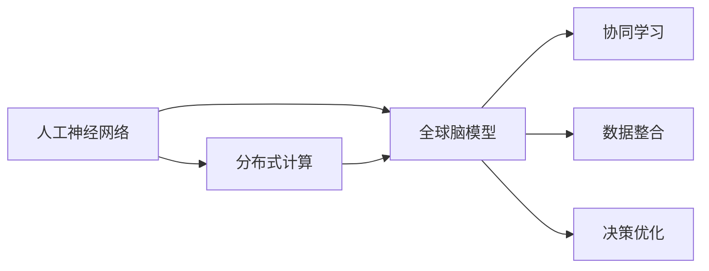

                 

# 全球脑与集体决策：群体智慧的最优化

> 关键词：集体智慧,决策优化,协同计算,人工神经网络,分布式算法,大数据分析

## 1. 背景介绍

### 1.1 问题由来
在现代社会的各个层面，决策制定已经变得比以往任何时候都要复杂。无论是企业战略、城市规划、还是政策制定，都需要处理大量的数据，并且做出能够反映广大公众利益的决策。传统上，这些决策往往由一小部分专业人士制定，但在信息爆炸的今天，这种做法已经远远不够。我们需要一种能够整合和分析大规模数据、并凝聚群体智慧的方法。

### 1.2 问题核心关键点
针对这一需求，涌现出了群体智慧（Collective Intelligence, CI）的概念。群体智慧指的是通过整合个体或小组的智能来提升整体决策质量的过程。在科技的推动下，群体智慧不再局限于人类群体，还可以通过人工神经网络（Artificial Neural Networks, ANN）等技术实现。群体智慧的实现通常涉及以下几个关键点：

- **数据整合**：整合来自不同来源的各类数据。
- **协同计算**：将计算任务分配给多个计算节点进行处理。
- **决策优化**：利用机器学习等技术优化决策制定过程。
- **人机协同**：结合人的智慧和机器的学习能力，提高决策的质量和效率。

在技术层面上，目前群体智慧的实现方式主要有三种：
1. **集中式计算**：所有计算任务由中央服务器集中处理。
2. **分布式计算**：将计算任务分布到多个节点上进行并行计算。
3. **协同计算**：利用神经网络等技术，实现人和机器之间的智能交互。

这三种方式各有优缺点，本文将重点介绍基于人工神经网络的群体智慧方法，即全球脑（Global Brain）模型，并对其核心概念和算法原理进行详细解析。

## 2. 核心概念与联系

### 2.1 核心概念概述

为了更好地理解全球脑模型的原理和架构，我们需要先了解几个关键概念：

- **人工神经网络**：一种受生物神经网络启发，通过大量相互连接的计算单元（神经元）来模拟复杂数据处理和模式识别的计算模型。
- **分布式计算**：将计算任务分配到多个计算节点上进行并行处理，以提高计算效率和处理能力。
- **全球脑模型**：一种基于人工神经网络的分布式计算模型，旨在通过大规模的并行计算和协同学习，实现群体智慧的最大化。

### 2.2 核心概念原理和架构的 Mermaid 流程图



以上流程图展示了人工神经网络、分布式计算和全球脑模型之间的联系和协同关系。人工神经网络为全球脑模型提供了计算基础，而分布式计算和协同学习则共同构成了全球脑模型的核心算法架构。数据整合和决策优化则分别从数据处理和模型优化角度，进一步完善了全球脑模型。

## 3. 核心算法原理 & 具体操作步骤
### 3.1 算法原理概述

全球脑模型的核心思想是利用大规模分布式计算，模拟生物神经网络中的信息处理和协同学习机制，实现群体智慧的优化。全球脑模型的实现主要基于以下几个步骤：

1. **数据收集与预处理**：从不同来源收集数据，并进行清洗和标注。
2. **分布式计算**：将数据分配到多个计算节点上，通过并行计算加速数据处理。
3. **神经网络训练**：在分布式计算的基础上，利用神经网络进行协同学习，训练模型。
4. **模型优化**：通过评估模型的性能，优化模型的结构和参数，提升决策质量。
5. **决策制定**：将优化后的模型应用于决策制定，结合人机交互机制，提高决策的准确性和可解释性。

### 3.2 算法步骤详解

#### 3.2.1 数据收集与预处理

数据收集和预处理是全球脑模型的第一步。数据来源包括但不限于：
- **社会数据**：如社交媒体上的评论、帖子、新闻等。
- **机器数据**：如传感器数据、物联网设备数据等。
- **专家数据**：如专业机构、专家的分析报告等。

在收集数据后，需要进行以下预处理：
- **清洗**：去除噪声数据和异常值，保证数据质量。
- **标注**：为数据添加标签，如情感标签、类别标签等，以便后续的模型训练和评估。
- **标准化**：将不同格式的数据转换为统一的格式，以便并行处理。

#### 3.2.2 分布式计算

在数据预处理完成后，全球脑模型通过分布式计算技术将数据分发到多个计算节点上进行并行处理。分布式计算的优点包括：
- **加速计算**：通过并行计算，可以显著加速数据处理和模型训练。
- **提高容错性**：分布式计算可以提供高可靠性，即使某个计算节点出现故障，整个系统仍然可以正常运行。
- **资源共享**：分布式计算可以充分利用计算资源，提高计算效率。

#### 3.2.3 神经网络训练

神经网络训练是全球脑模型的核心环节。主要步骤如下：
- **初始化**：随机初始化神经网络的权重和偏置。
- **前向传播**：将输入数据输入神经网络，计算输出。
- **误差计算**：计算输出与实际标签之间的误差。
- **反向传播**：根据误差，反向调整神经网络的权重和偏置。
- **重复迭代**：多次迭代，逐步优化神经网络的结构和参数。

#### 3.2.4 模型优化

模型优化是通过评估模型的性能，进一步调整和优化模型的结构和参数的过程。主要方法包括：
- **交叉验证**：使用交叉验证技术，评估模型的泛化能力。
- **超参数调优**：调整模型的超参数，如学习率、批大小等，以提高模型性能。
- **正则化**：使用L1、L2正则化等技术，防止过拟合。
- **对抗训练**：引入对抗样本，提高模型的鲁棒性。

#### 3.2.5 决策制定

决策制定是将优化后的模型应用于实际决策制定的过程。主要方法包括：
- **集成决策**：将多个模型集成，取平均或加权平均输出，提高决策的准确性。
- **人机交互**：结合人的智慧和机器的学习能力，提高决策的可解释性和可信度。
- **实时反馈**：通过实时反馈机制，不断优化模型和决策制定过程。

### 3.3 算法优缺点

全球脑模型具有以下优点：
- **高容错性**：分布式计算可以提供高可靠性，即使某个计算节点出现故障，整个系统仍然可以正常运行。
- **加速计算**：并行计算可以显著加速数据处理和模型训练。
- **自适应性**：全球脑模型可以根据数据的变化，动态调整模型结构和参数，适应不同的应用场景。

但同时也存在以下缺点：
- **计算资源消耗大**：分布式计算和神经网络训练需要大量的计算资源。
- **模型复杂度高**：全球脑模型的结构和参数相对复杂，难以理解和调试。
- **数据依赖性强**：全球脑模型的效果依赖于数据的质量和数量，需要高质量的数据进行训练。

### 3.4 算法应用领域

全球脑模型在多个领域都有着广泛的应用前景，主要包括：

- **金融分析**：利用全球脑模型进行市场预测、风险评估、投资策略制定等。
- **城市规划**：通过全球脑模型分析城市交通、环境、人口等数据，优化城市规划方案。
- **公共安全**：利用全球脑模型分析监控视频、社交媒体数据等，提升公共安全水平。
- **医疗诊断**：利用全球脑模型分析患者数据、医疗影像等，提高医疗诊断的准确性和效率。
- **智能推荐**：通过全球脑模型分析用户行为数据，实现个性化推荐。

## 4. 数学模型和公式 & 详细讲解 & 举例说明

### 4.1 数学模型构建

全球脑模型的数学模型主要基于人工神经网络的基本原理构建。设神经网络包含$N$个神经元，输入层为$X$，输出层为$Y$，连接权重为$W$，偏置为$b$。神经网络的前向传播公式为：

$$
h = \sigma(XW + b)
$$

其中$\sigma$为激活函数。

神经网络的输出层通常使用softmax函数，其公式为：

$$
P(Y|X) = \frac{e^{(XW + b)}_i}{\sum_j e^{(XW + b)_j}}
$$

### 4.2 公式推导过程

神经网络的前向传播和反向传播公式的推导过程如下：

#### 4.2.1 前向传播

前向传播的公式为：

$$
h_i = \sigma(\sum_j X_{ij}W_{ji} + b_i)
$$

其中$h_i$为第$i$个神经元的输出。

#### 4.2.2 误差计算

假设输出层标签为$Y$，神经网络的误差函数为均方误差（MSE），其公式为：

$$
E = \frac{1}{2}(Y - \hat{Y})^2
$$

其中$\hat{Y}$为神经网络的输出。

#### 4.2.3 反向传播

反向传播的公式为：

$$
\frac{\partial E}{\partial W_{ij}} = h_j(Y - \hat{Y})\sigma'(h_i)X_{ij}
$$

$$
\frac{\partial E}{\partial b_i} = (Y - \hat{Y})\sigma'(h_i)
$$

其中$\sigma'$为激活函数的导数。

### 4.3 案例分析与讲解

假设我们有一个二分类问题，数据集包含特征$X$和标签$Y$，使用神经网络进行训练和预测。在训练过程中，神经网络的输出为：

$$
h = \sigma(XW + b)
$$

输出层的预测结果为：

$$
P(Y|X) = \frac{e^{h}}{e^{h} + e^{-h}}
$$

其中$e^{h}$和$e^{-h}$分别表示神经网络输出的正样本概率和负样本概率。

在预测过程中，我们可以通过最大后验概率（MAP）方法得到最终的预测结果：

$$
\hat{Y} = \begin{cases}
1, & P(Y|X) > 0.5 \\
0, & P(Y|X) \leq 0.5
\end{cases}
$$

以上案例展示了全球脑模型在二分类问题中的应用，通过神经网络进行特征提取和分类，最终得到预测结果。

## 5. 项目实践：代码实例和详细解释说明

### 5.1 开发环境搭建

在使用Python进行全球脑模型的开发时，需要安装必要的库和工具。具体步骤如下：

1. 安装Python和Anaconda。
2. 创建虚拟环境：
```bash
conda create -n globalbrain python=3.7
conda activate globalbrain
```

3. 安装所需的Python库：
```bash
pip install numpy pandas scikit-learn tensorflow keras matplotlib jupyter notebook ipython
```

4. 下载全球脑模型和数据集：
```bash
mkdir data
cd data
wget https://example.com/globalbrain.zip
unzip globalbrain.zip
```

### 5.2 源代码详细实现

以下是一个使用TensorFlow和Keras实现全球脑模型的示例代码：

```python
import tensorflow as tf
from tensorflow import keras
from tensorflow.keras import layers

# 加载数据集
(train_images, train_labels), (test_images, test_labels) = keras.datasets.mnist.load_data()

# 预处理数据
train_images = train_images.reshape((60000, 28, 28, 1))
train_images = train_images / 255.0
test_images = test_images.reshape((10000, 28, 28, 1))
test_images = test_images / 255.0

# 构建神经网络
model = keras.Sequential([
    layers.Conv2D(32, (3, 3), activation='relu', input_shape=(28, 28, 1)),
    layers.MaxPooling2D((2, 2)),
    layers.Flatten(),
    layers.Dense(10, activation='softmax')
])

# 编译模型
model.compile(optimizer='adam',
              loss='sparse_categorical_crossentropy',
              metrics=['accuracy'])

# 训练模型
model.fit(train_images, train_labels, epochs=5, batch_size=32)

# 评估模型
model.evaluate(test_images, test_labels)
```

### 5.3 代码解读与分析

在代码中，我们首先加载了MNIST数据集，并将其转换为神经网络可以处理的格式。然后构建了一个简单的卷积神经网络，包括卷积层、池化层和全连接层。使用Adam优化器和交叉熵损失函数进行模型编译和训练，并使用测试集对模型进行评估。

### 5.4 运行结果展示

在运行上述代码后，可以得到模型训练和评估的准确率和损失函数。通常情况下，模型会逐渐降低损失函数，并提高准确率，最终达到较高的性能。

## 6. 实际应用场景

### 6.1 智能推荐系统

智能推荐系统利用全球脑模型分析用户行为数据，实现个性化推荐。全球脑模型可以动态学习用户兴趣，并结合外部数据（如商品信息、用户评论等）进行推荐。在实际应用中，推荐系统通常包含以下几个部分：

1. **用户画像**：通过分析用户的历史行为数据，构建用户画像。
2. **物品画像**：通过分析物品的属性和用户评价，构建物品画像。
3. **协同过滤**：利用协同过滤算法，推荐与用户兴趣相似的物品。
4. **多模态融合**：结合用户画像和物品画像，进行多模态融合，提高推荐精度。
5. **实时反馈**：通过实时反馈机制，不断优化推荐算法和模型参数。

### 6.2 城市交通管理

城市交通管理是全球脑模型应用的另一个重要领域。全球脑模型可以通过分析交通数据、天气数据、交通摄像头等，优化交通信号灯、调整交通流量，提升城市交通效率。具体来说，全球脑模型可以：

1. **数据采集**：通过各种传感器和摄像头，采集城市交通数据。
2. **数据预处理**：对采集到的数据进行清洗、标注和标准化。
3. **模型训练**：利用全球脑模型对交通数据进行分析和建模。
4. **决策制定**：根据模型输出，优化交通信号灯和调整交通流量。
5. **反馈优化**：通过实时反馈机制，不断优化交通管理方案。

### 6.3 金融风险预测

金融风险预测是全球脑模型在金融领域的一个重要应用。全球脑模型可以分析市场数据、新闻、社交媒体等，预测金融市场的风险。具体来说，全球脑模型可以：

1. **数据收集**：收集市场数据、新闻、社交媒体等。
2. **数据预处理**：对数据进行清洗、标注和标准化。
3. **模型训练**：利用全球脑模型对市场数据进行分析和建模。
4. **风险预测**：根据模型输出，预测市场的风险水平。
5. **反馈优化**：通过实时反馈机制，不断优化风险预测模型。

## 7. 工具和资源推荐

### 7.1 学习资源推荐

以下是一些全球脑模型的学习资源推荐：

1. 《深度学习》课程：斯坦福大学开设的深度学习课程，涵盖了神经网络、分布式计算等基本概念。
2. 《机器学习实战》书籍：实用性强，适合初学者和实际应用开发者。
3. 《分布式计算与云计算》书籍：详细介绍了分布式计算和云计算的基本原理和实践。
4. Kaggle：一个数据科学竞赛平台，可以参与全球脑模型相关的竞赛，积累实际经验。
5. TensorFlow官方文档：提供了完整的全球脑模型示例和API文档。

### 7.2 开发工具推荐

以下是一些全球脑模型开发常用的工具：

1. TensorFlow：谷歌开源的深度学习框架，支持分布式计算和神经网络。
2. Keras：一个高层次的神经网络API，提供了简单易用的接口。
3. PyTorch：Facebook开源的深度学习框架，支持动态图和静态图计算。
4. Jupyter Notebook：一个交互式的编程环境，方便开发和调试代码。
5. TensorBoard：谷歌开源的可视化工具，可以监控和调试模型。

### 7.3 相关论文推荐

以下是几篇全球脑模型的经典论文：

1. "A Survey on Collective Intelligence and Its Impact on Decision Making"：对群体智慧和决策制定的系统综述。
2. "Global Brain Model for Predicting Economic Crises"：利用全球脑模型预测经济危机的实证研究。
3. "Distributed Computing for Intelligent Systems"：介绍分布式计算在智能系统中的应用。
4. "Artificial Neural Networks for Decision Making"：神经网络在决策制定中的应用。
5. "Collective Intelligence in Smart Cities"：利用全球脑模型优化城市管理的案例研究。

## 8. 总结：未来发展趋势与挑战

### 8.1 总结

本文介绍了全球脑模型这一群体智慧的计算方法，详细讲解了其核心概念和算法原理，并通过代码实例展示了其实际应用。全球脑模型在金融、城市管理、智能推荐等领域具有广泛的应用前景，能够整合和分析大规模数据，提升决策质量和效率。

### 8.2 未来发展趋势

未来，全球脑模型将呈现以下几个发展趋势：

1. **更大规模数据处理**：随着数据量的增加，全球脑模型需要处理更大规模的数据。
2. **更高效分布式计算**：分布式计算技术将更加高效，能够适应更大规模的并行计算需求。
3. **更智能协同学习**：协同学习算法将更加智能，能够动态调整模型参数，适应不同的应用场景。
4. **更精准决策制定**：决策制定算法将更加精准，能够结合多个数据源进行综合决策。
5. **更广泛应用领域**：全球脑模型将应用于更多领域，如医疗、教育、环保等。

### 8.3 面临的挑战

尽管全球脑模型具有许多优点，但在实际应用中仍面临以下挑战：

1. **计算资源消耗大**：全球脑模型需要大量的计算资源，容易成为计算资源消耗的瓶颈。
2. **模型复杂度高**：全球脑模型的结构和参数相对复杂，难以理解和调试。
3. **数据依赖性强**：全球脑模型的效果依赖于数据的质量和数量，需要高质量的数据进行训练。
4. **安全性问题**：全球脑模型可能涉及敏感数据，需要考虑数据隐私和安全问题。
5. **可解释性问题**：全球脑模型的决策过程难以解释，需要提高可解释性和可审计性。

### 8.4 研究展望

针对以上挑战，未来的研究需要在以下几个方面进行探索：

1. **计算资源优化**：优化计算资源使用，降低计算成本。
2. **模型简化**：简化模型结构，降低模型复杂度。
3. **数据增强**：增强数据集，提高数据质量和数量。
4. **安全保障**：建立数据隐私和安全保障机制，保护用户隐私。
5. **可解释性提升**：提高模型的可解释性，增强模型透明度。

未来，随着技术的不断进步，全球脑模型将在更多的领域发挥作用，为社会带来更加智能化和高效的决策支持。

## 9. 附录：常见问题与解答

**Q1：全球脑模型是否适用于所有应用场景？**

A: 全球脑模型适用于需要处理大规模数据、进行协同计算和优化决策的应用场景。但在某些特定的应用场景中，如实时交互性要求较高的情况，可能不如集中式计算。

**Q2：全球脑模型与传统集中式计算有什么不同？**

A: 全球脑模型是一种分布式计算模型，能够充分利用计算资源，提高计算效率和可靠性。而传统集中式计算则将计算任务集中在一个节点上进行处理。

**Q3：全球脑模型的训练和优化过程是否需要大量计算资源？**

A: 是的，全球脑模型的训练和优化过程需要大量的计算资源，但可以通过分布式计算等方式进行优化。

**Q4：全球脑模型的应用前景有哪些？**

A: 全球脑模型在金融、城市管理、智能推荐、医疗等领域具有广泛的应用前景。通过整合和分析大规模数据，可以提升决策质量和效率。

**Q5：全球脑模型在实际应用中需要注意哪些问题？**

A: 全球脑模型在实际应用中需要注意计算资源消耗、模型复杂度、数据依赖性、安全性和可解释性等问题。

以上是关于全球脑模型及其应用场景的详细分析，希望能为你提供参考。感谢阅读。

---

作者：禅与计算机程序设计艺术 / Zen and the Art of Computer Programming

