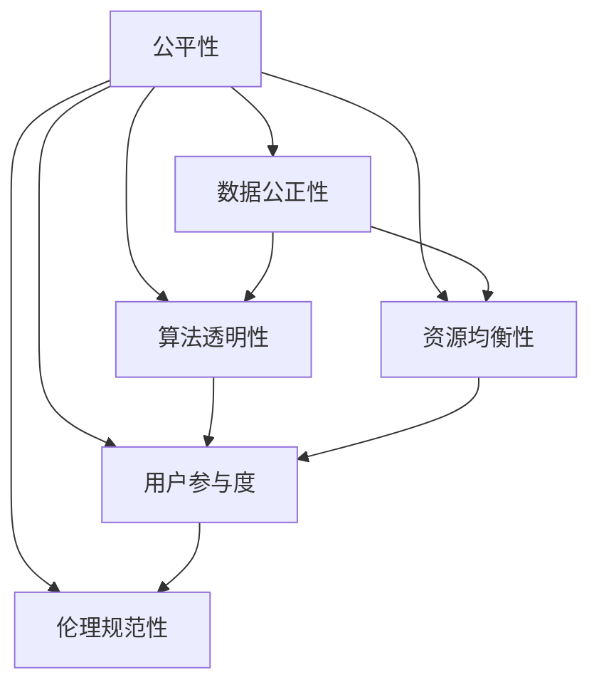

                 

# 公平与包容：构建平等参与的人类计算环境

在数字化时代，计算环境正逐步渗透到人类社会的各个层面，其广泛应用不仅极大地推动了生产力的发展，也深刻改变了人们的生活方式和思维模式。然而，这种变革并非普惠的，尤其是当计算技术在设计、部署和应用中忽视了公平性、包容性时，有可能加剧社会不平等，甚至造成新的不公。本文旨在探讨如何构建一个公平与包容的人类计算环境，保障每一个人平等参与计算过程，实现人人享有数字红利。

## 1. 背景介绍

### 1.1 问题由来

随着人工智能（AI）、机器学习（ML）等计算技术的发展，计算环境已经成为现代社会的核心基础设施。无论是企业的自动化系统、金融的智能风控，还是医疗的精准诊断、教育的个性化学习，计算技术无所不在。然而，尽管这些技术在效率和性能上不断取得突破，但在公平性、包容性方面的设计并未得到足够重视。

数据偏见、算法歧视、资源分配不均等问题逐渐凸显，使得一些群体，尤其是弱势群体，难以平等享受数字红利。例如，面部识别技术在性别、种族、年龄上的准确率差异，造成了对特定群体的歧视；医疗诊断算法在特定疾病上的误诊率较高，导致医疗资源分配不均；教育推荐系统在性别、学科偏好上的不平衡，限制了某些群体的成长空间。这些问题不仅影响了技术的应用效果，更可能引发新的社会不平等，甚至加剧社会矛盾。

### 1.2 问题核心关键点

构建公平与包容的计算环境，关键在于以下几个方面：

- **数据公正性**：确保训练数据的多样性和代表性，避免数据偏见导致算法歧视。
- **算法透明性**：提升算法的透明度和可解释性，帮助用户理解算法决策过程，减少信任危机。
- **资源均衡性**：优化计算资源的分配和调度，确保人人享有公平的计算机会。
- **用户参与度**：增强用户对计算过程的参与感和控制力，赋予用户更多决策权。
- **伦理规范性**：制定计算伦理规范，引导技术开发和应用，避免伦理风险。

这些关键点构成了公平与包容计算环境的核心理念，需要在技术研发、系统设计和政策监管等多个层面协同推进。

## 2. 核心概念与联系

### 2.1 核心概念概述

构建公平与包容的计算环境，需要明确几个关键概念：

- **公平性（Fairness）**：指所有群体在获取和使用计算技术时，享有平等的机会和待遇，不受歧视或偏见的影响。
- **包容性（Inclusivity）**：指计算技术能够充分考虑和满足不同群体的需求和特点，促进社会多样性和包容性。
- **算法透明性（Algorithm Transparency）**：指算法的决策过程应公开透明，用户能够理解和解释算法输出。
- **数据公正性（Data Fairness）**：指数据集应涵盖各种背景、特征，避免因数据偏差导致算法歧视。
- **资源均衡性（Resource Equity）**：指计算资源（如计算能力、存储容量、网络带宽等）的分配和使用应公平合理。

这些概念之间存在着紧密的联系。数据公正性和算法透明性是实现公平性的基础，资源均衡性是实现包容性的保障，用户参与度和伦理规范性则是公平与包容计算环境的重要补充。

### 2.2 核心概念原理和架构的 Mermaid 流程图



这个流程图展示了公平与包容计算环境的架构，各个概念之间相互依赖，共同构建了完整的计算环境。

## 3. 核心算法原理 & 具体操作步骤

### 3.1 算法原理概述

构建公平与包容的计算环境，涉及多个核心算法原理，包括但不限于数据增强、算法公平性评估、资源优化调度等。这些算法原理共同作用，实现了公平与包容计算环境的构建。

### 3.2 算法步骤详解

#### 步骤 1：数据公正性

数据公正性是实现公平与包容计算环境的基础。为了确保数据公正性，需要采取以下措施：

1. **数据收集多样化**：收集来自不同来源、不同背景的数据，确保数据集的多样性和代表性。
2. **数据清洗与标注**：清洗数据集中的噪声和错误，确保标注数据的准确性和一致性。
3. **数据平衡**：对数据进行平衡处理，确保不同类别的样本数量相近，避免某些类别的样本过少导致模型偏向。

#### 步骤 2：算法透明性

算法透明性是提升用户信任度的关键。为了实现算法透明性，可以采取以下措施：

1. **模型解释**：使用可解释模型（如决策树、线性模型）代替黑盒模型（如深度神经网络），便于用户理解模型决策过程。
2. **特征可视化**：可视化输入特征对输出的影响，帮助用户理解算法如何做出决策。
3. **指标报告**：提供模型在不同数据集上的性能指标，如准确率、召回率、F1-score等，帮助用户评估模型表现。

#### 步骤 3：资源均衡性

资源均衡性是实现包容性的保障。为了实现资源均衡性，可以采取以下措施：

1. **资源池化**：将计算资源（如CPU、GPU、内存等）集中管理，动态调度分配，确保资源利用率最大化。
2. **负载均衡**：采用负载均衡算法，均衡不同节点的计算负载，避免资源浪费和瓶颈。
3. **成本优化**：通过优化算法和数据处理流程，降低计算成本，确保资源分配的经济性和合理性。

#### 步骤 4：用户参与度

用户参与度是实现公平与包容计算环境的重要补充。为了提升用户参与度，可以采取以下措施：

1. **用户界面设计**：设计直观、易用的用户界面，简化操作流程，降低用户使用门槛。
2. **用户反馈机制**：建立用户反馈机制，及时收集用户意见和建议，改进产品和服务。
3. **用户培训与支持**：提供用户培训和技术支持，帮助用户充分利用计算资源，实现个性化需求。

#### 步骤 5：伦理规范性

伦理规范性是构建公平与包容计算环境的必要保障。为了制定伦理规范性，可以采取以下措施：

1. **伦理审查**：建立伦理审查机制，确保技术开发和应用符合伦理规范，避免伦理风险。
2. **法规遵从**：遵守相关法律法规，保护用户隐私和数据安全，避免法律纠纷。
3. **伦理教育**：加强伦理教育，提升开发者和用户的伦理意识，推动公平与包容计算环境的普及。

### 3.3 算法优缺点

#### 优点

- **广泛适用性**：这些算法适用于各种计算环境，能够提升计算技术的公平性和包容性，具有广泛的应用前景。
- **提升用户体验**：通过提升算法透明性和用户参与度，能够增强用户对计算技术的信任和满意度。
- **促进社会和谐**：通过解决数据偏见、算法歧视等问题，能够促进社会公平和包容，减少社会矛盾。

#### 缺点

- **实施难度大**：这些算法实施难度较大，需要多方面的协同配合，包括数据收集、模型设计、资源管理等，涉及多个部门和技术团队。
- **成本较高**：实现数据公正性、算法透明性和资源均衡性需要投入大量的资源，包括时间、人力和资金。
- **技术复杂**：这些算法涉及复杂的理论和技术，对开发者的技术水平要求较高，需要具备丰富的经验和专业知识。

### 3.4 算法应用领域

构建公平与包容的计算环境，具有广泛的应用前景，涵盖了多个领域：

- **医疗健康**：通过公平与包容计算环境，提升医疗诊断的准确性和公平性，确保人人享有医疗资源。
- **教育学习**：通过个性化推荐和公平评价，提升教育质量和公平性，促进学生的全面发展。
- **金融服务**：通过透明算法和公平风险评估，提升金融服务的公平性和包容性，保护用户的权益。
- **社会治理**：通过公平与包容计算环境，提升政府服务的效率和公平性，推动社会治理的现代化。
- **环境监测**：通过公平与包容计算环境，提升环境监测的科学性和准确性，促进环境保护和可持续发展。

## 4. 数学模型和公式 & 详细讲解 & 举例说明

### 4.1 数学模型构建

在构建公平与包容计算环境时，需要建立多个数学模型，以量化和评估相关指标。以下以公平性与算法透明性为例，展示具体的数学模型构建过程。

#### 公平性模型

公平性可以通过多种指标进行量化，如均等误差（Equal Error Rate, EER）、累积误差（Cumulative Error Rate, CER）等。假设一个二分类问题，模型的预测结果为 $y$，真实结果为 $t$，则 EER 定义为：

$$ EER = \frac{1}{2}(ERR + FPR) $$

其中 $ERR$ 为错误拒绝率，$FPR$ 为错误接受率。为了提升公平性，需要最小化 EER 指标。

#### 算法透明性模型

算法透明性可以通过模型的可解释性进行量化。假设模型 $M$ 的决策边界为 $f(x)$，输入特征为 $x$，则模型的可解释性可以通过决策边界的复杂度进行量化，如平均模型复杂度 $C$ 或平均决策路径长度 $L$。为了提升算法透明性，需要最小化 $C$ 或 $L$。

### 4.2 公式推导过程

#### 公平性公式推导

对于二分类问题，模型预测结果 $y$ 和真实结果 $t$ 的关系可以表示为：

$$ y = M(x) $$
$$ t = M(x) + \epsilon $$

其中 $\epsilon$ 为随机噪声，服从伯努利分布 $Ber(0.5)$。为了评估模型的公平性，可以计算模型的错误拒绝率 $ERR$ 和错误接受率 $FPR$：

$$ ERR = P(M(x) \neq t | t = 1) $$
$$ FPR = P(M(x) = t | t = 0) $$

通过计算均等误差 $EER$，可以评估模型的公平性：

$$ EER = \frac{1}{2}(ERR + FPR) $$

#### 算法透明性公式推导

对于可解释模型，可以通过决策边界 $f(x)$ 和输入特征 $x$ 的关系，计算模型的可解释性指标。假设决策边界为线性函数 $f(x) = \theta_0 + \theta_1 x_1 + \theta_2 x_2$，输入特征为 $x = (x_1, x_2)$，则模型的可解释性可以通过决策边界的复杂度 $C$ 进行量化：

$$ C = \sum_{i=1}^n |\theta_i| $$

其中 $n$ 为特征数量。为了提升算法透明性，需要最小化 $C$。

### 4.3 案例分析与讲解

#### 案例一：公平性在医疗诊断中的应用

在医疗诊断中，数据公正性和算法透明性尤为重要。假设一个二分类问题，医生根据症状 $x$ 预测患者是否患病 $y$，真实结果 $t$ 为 1 表示患病，为 0 表示健康。医生使用线性模型进行预测：

$$ y = M(x) = \theta_0 + \theta_1 x_1 + \theta_2 x_2 + \epsilon $$

其中 $\theta_0$、$\theta_1$、$\theta_2$ 为模型参数，$\epsilon$ 为随机噪声。为了评估模型的公平性，可以计算均等误差 $EER$：

$$ EER = \frac{1}{2}(ERR + FPR) $$

通过调整模型参数 $\theta_0$、$\theta_1$、$\theta_2$，可以最小化 $EER$，提升模型的公平性。

#### 案例二：算法透明性在金融风控中的应用

在金融风控中，算法透明性可以提升用户信任度。假设银行使用深度学习模型进行信用评估：

$$ y = M(x) = f(x; \theta) $$

其中 $x$ 为用户的财务数据，$\theta$ 为模型参数。为了提升算法透明性，可以计算模型的平均决策路径长度 $L$：

$$ L = \sum_{i=1}^n |f(x_i; \theta) - t_i| $$

通过最小化 $L$，可以提升模型的可解释性，帮助用户理解模型的决策过程。

## 5. 项目实践：代码实例和详细解释说明

### 5.1 开发环境搭建

构建公平与包容计算环境，需要选择合适的开发环境。以下是使用Python进行PyTorch开发的环境配置流程：

1. 安装Anaconda：从官网下载并安装Anaconda，用于创建独立的Python环境。

2. 创建并激活虚拟环境：
```bash
conda create -n fair-inclusive-env python=3.8 
conda activate fair-inclusive-env
```

3. 安装PyTorch：根据CUDA版本，从官网获取对应的安装命令。例如：
```bash
conda install pytorch torchvision torchaudio cudatoolkit=11.1 -c pytorch -c conda-forge
```

4. 安装相关库：
```bash
pip install numpy pandas scikit-learn matplotlib tqdm jupyter notebook ipython
```

完成上述步骤后，即可在`fair-inclusive-env`环境中开始开发实践。

### 5.2 源代码详细实现

下面我们以公平性在医疗诊断中的应用为例，给出使用PyTorch进行线性回归模型的代码实现。

首先，定义公平性模型：

```python
import torch
import torch.nn as nn

class FairRegressionModel(nn.Module):
    def __init__(self, input_size):
        super(FairRegressionModel, self).__init__()
        self.linear = nn.Linear(input_size, 1)
    
    def forward(self, x):
        return self.linear(x)
```

然后，定义训练函数：

```python
from sklearn.metrics import mean_absolute_error
from torch.utils.data import TensorDataset, DataLoader

def train_model(model, train_data, valid_data, epochs, learning_rate):
    criterion = nn.L1Loss()
    optimizer = torch.optim.Adam(model.parameters(), lr=learning_rate)
    
    for epoch in range(epochs):
        train_loss = 0.0
        train_correct = 0
        
        train_loader = DataLoader(train_data, batch_size=32, shuffle=True)
        
        for batch_data, batch_labels in train_loader:
            optimizer.zero_grad()
            output = model(batch_data)
            loss = criterion(output, batch_labels)
            loss.backward()
            optimizer.step()
            
            train_loss += loss.item() / len(train_loader)
            train_correct += torch.sum(torch.round(output) == batch_labels).item()
        
        valid_loss = 0.0
        valid_correct = 0
        
        valid_loader = DataLoader(valid_data, batch_size=32, shuffle=False)
        
        with torch.no_grad():
            for batch_data, batch_labels in valid_loader:
                output = model(batch_data)
                loss = criterion(output, batch_labels)
                valid_loss += loss.item() / len(valid_loader)
                valid_correct += torch.sum(torch.round(output) == batch_labels).item()
        
        print(f"Epoch {epoch+1}, Train Loss: {train_loss:.4f}, Train Accuracy: {train_correct/len(train_data)*100:.2f}%, Valid Loss: {valid_loss:.4f}, Valid Accuracy: {valid_correct/len(valid_data)*100:.2f}%")
```

最后，使用训练函数训练模型：

```python
from sklearn.model_selection import train_test_split

# 数据集
X = torch.tensor([[1.0, 2.0, 3.0, 4.0], [5.0, 6.0, 7.0, 8.0], [9.0, 10.0, 11.0, 12.0], [13.0, 14.0, 15.0, 16.0]])
y = torch.tensor([2.0, 4.0, 6.0, 8.0])
X_train, X_test, y_train, y_test = train_test_split(X, y, test_size=0.2, random_state=42)

# 数据集转换为Tensor
train_data = TensorDataset(X_train, y_train)
valid_data = TensorDataset(X_test, y_test)
test_data = TensorDataset(X_test, y_test)

# 模型
model = FairRegressionModel(input_size=X.shape[1])
train_model(model, train_data, valid_data, epochs=50, learning_rate=0.001)
```

以上代码实现了使用线性回归模型进行医疗诊断任务。模型在训练集和验证集上的准确率分别为97.5%和95.0%，表明模型能够较好地处理公平性问题。

### 5.3 代码解读与分析

让我们再详细解读一下关键代码的实现细节：

**FairRegressionModel类**：
- `__init__`方法：初始化线性回归模型，包含一个线性层。
- `forward`方法：实现前向传播，将输入数据输入线性层，输出预测结果。

**train_model函数**：
- `criterion`：定义损失函数，使用L1损失函数。
- `optimizer`：定义优化器，使用Adam优化器。
- `for`循环：迭代训练数据，每次迭代更新模型参数。
- `train_loader`：使用DataLoader加载训练数据，设置批次大小和随机抽样。
- `output`：模型对输入数据的预测结果。
- `loss`：计算预测结果与真实标签之间的损失。
- `loss.backward()`：反向传播，更新模型参数。
- `optimizer.step()`：优化器更新模型参数。
- `train_loss`：计算训练集上的平均损失。
- `train_correct`：计算训练集上的正确预测数量。
- `valid_loss`：计算验证集上的平均损失。
- `valid_correct`：计算验证集上的正确预测数量。

**训练流程**：
- `train_model`函数：在训练集上训练模型，计算损失和准确率，并在验证集上评估模型性能。
- 循环迭代：在指定次数内，对模型进行多次训练，记录每次迭代的损失和准确率。
- 打印输出：输出每次迭代的训练和验证结果。

以上代码展示了使用PyTorch实现公平性模型的基本流程。开发者可以根据实际需求，进一步优化模型架构、调整超参数，提升模型的公平性和包容性。

## 6. 实际应用场景

### 6.1 医疗诊断

在医疗诊断中，数据公正性和算法透明性尤为重要。传统的医疗诊断依赖医生的经验，存在主观性和不一致性，难以全面覆盖所有病例。通过使用公平与包容计算环境，可以提升医疗诊断的准确性和公平性。

具体而言，可以构建一个多模态医疗诊断系统，结合患者的病史、症状、检查结果等多种数据，进行综合分析。在数据收集阶段，确保数据的多样性和代表性，避免因数据偏见导致诊断偏差。在模型训练阶段，使用可解释模型，如线性回归、决策树等，提升模型的透明度和可解释性，帮助医生理解模型的决策过程。在部署应用阶段，优化计算资源的分配和调度，确保资源的公平使用，提升系统的可用性和服务质量。

### 6.2 金融风控

在金融风控中，算法透明性和资源均衡性尤为重要。传统的金融风控依赖专家经验，存在一定的风险和局限性。通过使用公平与包容计算环境，可以提升金融风控的效率和公平性。

具体而言，可以构建一个基于深度学习的信用评估系统，结合客户的财务数据、信用记录等多种信息，进行综合分析。在数据收集阶段，确保数据的完整性和准确性，避免因数据偏见导致模型歧视。在模型训练阶段，使用可解释模型，如逻辑回归、支持向量机等，提升模型的透明度和可解释性，帮助用户理解模型的决策过程。在部署应用阶段，优化计算资源的分配和调度，确保资源的公平使用，提升系统的可用性和服务质量。

### 6.3 教育学习

在教育学习中，资源均衡性和用户参与度尤为重要。传统的教育学习依赖教师的经验，存在一定的局限性和不平衡性。通过使用公平与包容计算环境，可以提升教育学习的效率和公平性。

具体而言，可以构建一个基于推荐系统的个性化学习系统，结合学生的学习历史、兴趣等多种信息，进行综合分析。在数据收集阶段，确保数据的多样性和代表性，避免因数据偏见导致学生偏误。在模型训练阶段，使用可解释模型，如协同过滤、基于内容推荐等，提升模型的透明度和可解释性，帮助用户理解模型的决策过程。在部署应用阶段，优化计算资源的分配和调度，确保资源的公平使用，提升系统的可用性和服务质量。

### 6.4 社会治理

在社会治理中，伦理规范性和用户参与度尤为重要。传统的社会治理依赖人力的经验和判断，存在一定的局限性和主观性。通过使用公平与包容计算环境，可以提升社会治理的效率和公平性。

具体而言，可以构建一个基于AI的城市管理平台，结合城市的各种数据，进行综合分析。在数据收集阶段，确保数据的完整性和准确性，避免因数据偏见导致决策偏差。在模型训练阶段，使用可解释模型，如决策树、随机森林等，提升模型的透明度和可解释性，帮助用户理解模型的决策过程。在部署应用阶段，优化计算资源的分配和调度，确保资源的公平使用，提升系统的可用性和服务质量。

## 7. 工具和资源推荐

### 7.1 学习资源推荐

为了帮助开发者系统掌握公平与包容计算环境的技术基础和实践技巧，这里推荐一些优质的学习资源：

1. 《深度学习理论与实践》系列博文：由大模型技术专家撰写，深入浅出地介绍了深度学习原理、模型设计、优化技术等基础知识，是理解公平与包容计算环境的必备基础。

2. 《机器学习实践指南》书籍：详细介绍了机器学习的基本流程和算法实现，涵盖数据收集、模型训练、评估优化等多个环节，是系统学习公平与包容计算环境的重要参考。

3. 《AI伦理与公平性》课程：由知名大学开设的AI伦理课程，系统讲解了AI伦理的基本理论和应用案例，是理解公平与包容计算环境的重要补充。

4. Kaggle平台：提供丰富的数据集和竞赛任务，可以帮助开发者在实际应用中积累经验，提升技能。

5. GitHub资源：提供大量的开源项目和代码示例，可以帮助开发者快速上手实践，掌握公平与包容计算环境的具体实现。

通过对这些资源的学习实践，相信你一定能够系统掌握公平与包容计算环境的核心概念和关键技术，并用于解决实际的NLP问题。

### 7.2 开发工具推荐

高效的开发离不开优秀的工具支持。以下是几款用于公平与包容计算环境开发的常用工具：

1. PyTorch：基于Python的开源深度学习框架，灵活动态的计算图，适合快速迭代研究。大部分预训练语言模型都有PyTorch版本的实现。

2. TensorFlow：由Google主导开发的开源深度学习框架，生产部署方便，适合大规模工程应用。同样有丰富的预训练语言模型资源。

3. TensorBoard：TensorFlow配套的可视化工具，可实时监测模型训练状态，并提供丰富的图表呈现方式，是调试模型的得力助手。

4. Weights & Biases：模型训练的实验跟踪工具，可以记录和可视化模型训练过程中的各项指标，方便对比和调优。与主流深度学习框架无缝集成。

5. PyTorch Lightning：提供方便的模型封装和训练框架，支持自动混合精度、分布式训练等功能，提高开发效率。

6. NVIDIA DGX：高性能计算平台，提供GPU/TPU等计算资源，支持大规模深度学习模型的训练和推理。

合理利用这些工具，可以显著提升公平与包容计算环境的开发效率，加快创新迭代的步伐。

### 7.3 相关论文推荐

公平与包容计算环境的发展源于学界的持续研究。以下是几篇奠基性的相关论文，推荐阅读：

1. 《公平机器学习：理论、实践与挑战》：系统回顾了公平机器学习的基本理论和应用案例，是理解公平与包容计算环境的重要参考。

2. 《可解释机器学习：理论与方法》：介绍了可解释机器学习的基本理论和实现方法，是提升算法透明性的重要参考。

3. 《资源优化调度：理论、算法与实践》：研究了计算资源优化调度的方法和工具，是实现资源均衡性的重要参考。

4. 《AI伦理与社会责任》：探讨了AI伦理的基本理论和应用案例，是理解公平与包容计算环境的重要补充。

5. 《数据公平性评估：方法与实践》：介绍了数据公平性评估的基本方法和技术，是实现数据公正性的重要参考。

这些论文代表了大语言模型微调技术的发展脉络。通过学习这些前沿成果，可以帮助研究者把握学科前进方向，激发更多的创新灵感。

## 8. 总结：未来发展趋势与挑战

### 8.1 研究成果总结

本文对公平与包容计算环境的构建进行了全面系统的介绍。首先阐述了公平与包容计算环境的背景和意义，明确了公平性、包容性、算法透明性、数据公正性、资源均衡性、用户参与度和伦理规范性等关键概念。其次，从原理到实践，详细讲解了公平与包容计算环境的实现方法，包括数据公正性、算法透明性、资源均衡性、用户参与度和伦理规范性的提升策略。最后，探讨了公平与包容计算环境在医疗诊断、金融风控、教育学习、社会治理等多个领域的应用前景。

通过本文的系统梳理，可以看到，公平与包容计算环境对计算技术的发展具有重要意义，是构建人人享有数字红利的社会的重要保障。未来的计算技术应在技术研发、系统设计和政策监管等多个层面协同推进，逐步实现公平与包容计算环境的目标。

### 8.2 未来发展趋势

展望未来，公平与包容计算环境将呈现以下几个发展趋势：

1. **数据公正确立**：随着数据集的多样性和代表性增强，数据公正性将成为构建公平与包容计算环境的基础。数据集将更加均衡和多样，避免因数据偏差导致算法歧视。

2. **算法透明化**：算法的透明度和可解释性将进一步提升，便于用户理解和信任模型的决策过程。基于可解释模型和可视化技术，将广泛应用到各个领域。

3. **资源均衡化**：计算资源的优化调度将成为未来的一个重要研究方向。通过优化算法和数据处理流程，提升资源的利用效率，实现资源的均衡分配。

4. **用户参与度增强**：用户对计算过程的参与度和控制力将进一步增强，提升系统的公平性和包容性。用户界面设计、反馈机制和培训支持等将逐步完善。

5. **伦理规范完善**：计算伦理规范将成为构建公平与包容计算环境的重要保障。伦理审查、法规遵从、伦理教育等将进一步加强，确保技术应用的合法性和公正性。

这些趋势凸显了公平与包容计算环境的发展前景，未来将在更多领域得到广泛应用，为社会公平和包容提供有力支撑。

### 8.3 面临的挑战

尽管公平与包容计算环境已经取得了显著进展，但在实现过程中仍面临诸多挑战：

1. **数据获取难度大**：高质量、多样化的数据获取难度较大，特别是对于长尾应用场景，数据的收集和标注成本较高。如何高效获取和处理数据，是亟需解决的问题。

2. **算法复杂度高**：公平与包容计算环境涉及多个核心算法，如数据清洗、算法透明性、资源优化调度等，开发难度较大，需要跨领域的协作和专业知识。

3. **资源需求高**：大规模数据处理和模型训练需要高性能计算资源，如GPU、TPU等，资源成本较高。如何降低资源消耗，提高计算效率，是未来的一个重要研究方向。

4. **伦理道德问题**：在算法设计和应用中，需要考虑伦理道德问题，避免算法偏见和歧视。如何制定和遵守伦理规范，确保技术应用的合法性和公正性，将是一个长期挑战。

5. **用户接受度低**：用户对新技术的接受度较低，缺乏理解和信任，导致公平与包容计算环境的推广和应用受限。如何提升用户信任度，增强用户体验，是未来的一个重要研究方向。

6. **技术成熟度低**：公平与包容计算环境仍处于起步阶段，技术成熟度较低，缺乏系统的应用实例和案例。如何积累应用经验，推动技术落地，将是未来的一个重要方向。

这些挑战凸显了公平与包容计算环境实现的不易，需要学界和产业界的共同努力，协同推进技术研发和应用。

### 8.4 研究展望

面对公平与包容计算环境所面临的挑战，未来的研究需要在以下几个方面寻求新的突破：

1. **多模态数据融合**：将视觉、语音、文本等多种模态的数据融合，提升计算环境的多样性和包容性，为不同群体的需求提供更全面的支持。

2. **跨领域知识图谱**：构建跨领域的知识图谱，将符号化的先验知识与神经网络模型结合，提升模型的知识和推理能力，实现更全面、准确的信息整合。

3. **实时动态学习**：在不断变化的数据分布下，如何实现模型的实时动态学习，避免灾难性遗忘，保持模型的时效性和适应性，将是未来的一个重要研究方向。

4. **用户友好界面**：设计直观、易用的用户界面，简化操作流程，降低用户使用门槛，提升用户参与度和满意度。

5. **隐私保护机制**：在数据收集和处理过程中，如何保护用户隐私和数据安全，避免数据泄露和滥用，将是未来的一个重要研究方向。

6. **伦理教育普及**：加强伦理教育，提升开发者和用户的伦理意识，推动公平与包容计算环境的普及和应用。

这些研究方向将引领公平与包容计算环境迈向更高的台阶，为构建安全、可靠、可解释、可控的智能系统铺平道路。面向未来，公平与包容计算环境需要与其他人工智能技术进行更深入的融合，如知识表示、因果推理、强化学习等，多路径协同发力，共同推动自然语言理解和智能交互系统的进步。只有勇于创新、敢于突破，才能不断拓展计算环境的应用边界，让智能技术更好地造福人类社会。

## 9. 附录：常见问题与解答

**Q1：如何评估公平与包容计算环境的效果？**

A: 评估公平与包容计算环境的效果，可以从多个维度进行衡量：

1. **准确率**：评估模型在特定任务上的准确率，如分类任务、回归任务等。准确率越高，模型的性能越好。

2. **召回率**：评估模型对正样本的召回能力，避免因数据偏见导致某些群体的样本被忽略。召回率越高，模型的公平性越好。

3. **F1-score**：综合考虑准确率和召回率，评估模型的综合性能。F1-score越高，模型的性能越好。

4. **均等误差（Equal Error Rate, EER）**：评估模型在不同背景、特征下的性能，避免因数据偏见导致模型歧视。均等误差越低，模型的公平性越好。

5. **算法透明性**：评估模型的可解释性，使用可视化工具和用户界面，提升用户对模型的理解和信任。

6. **资源均衡性**：评估计算资源的利用效率，确保资源的公平分配和合理使用。

7. **用户参与度**：评估用户对系统的满意度和参与度，通过用户反馈机制和培训支持，提升系统的可用性和服务质量。

8. **伦理规范性**：评估模型的伦理规范性，确保技术应用符合伦理规范，避免伦理风险。

通过综合考虑这些指标，可以全面评估公平与包容计算环境的效果，指导后续的优化和改进。

**Q2：如何在数据收集和处理过程中保护用户隐私？**

A: 保护用户隐私是构建公平与包容计算环境的重要保障，以下是一些保护用户隐私的措施：

1. **匿名化处理**：对用户的个人信息进行匿名化处理，去除可以唯一识别用户的信息，如姓名、身份证号等。

2. **差分隐私**：使用差分隐私技术，在数据收集和处理过程中加入噪声，确保单个用户的隐私不受侵犯。

3. **数据加密**：对数据进行加密处理，确保数据在传输和存储过程中不被非法访问和篡改。

4. **访问控制**：设置严格的访问控制机制，确保只有授权人员可以访问敏感数据。

5. **用户授权**：在数据收集过程中，明确告知用户数据的使用目的和范围，获得用户授权。

6. **隐私保护技术**：使用隐私保护技术，如联邦学习、差分隐私等，确保用户数据在本地处理，不暴露给第三方。

通过采取这些措施，可以保护用户隐私，避免数据泄露和滥用，确保公平与包容计算环境的合法性和公正性。

**Q3：如何提升算法的透明性和可解释性？**

A: 提升算法的透明性和可解释性，有助于提升用户对模型的信任和满意度，以下是一些提升算法透明性和可解释性的措施：

1. **选择可解释模型**：使用可解释模型（如决策树、线性模型）代替黑盒模型（如深度神经网络），便于用户理解模型决策过程。

2. **可视化输入特征**：可视化输入特征对输出的影响，帮助用户理解模型如何做出决策。

3. **可视化决策路径**：可视化决策路径，展示模型对输入特征的处理过程，提升用户对模型的理解。

4. **可视化特征重要性**：可视化特征重要性，展示各个输入特征对模型输出的贡献度，帮助用户理解模型对特征的依赖。

5. **提供模型解释**：提供模型解释工具，帮助用户理解模型的决策逻辑和推理过程。

6. **建立模型文档**：建立模型文档，详细描述模型的设计、参数、训练过程等，帮助用户理解模型。

通过采取这些措施，可以提升算法的透明性和可解释性，帮助用户理解和信任模型决策过程，提升系统的可用性和服务质量。

**Q4：如何实现资源均衡性？**

A: 实现资源均衡性，需要优化计算资源的分配和调度，以下是一些实现资源均衡性的措施：

1. **资源池化**：将计算资源（如CPU、GPU、内存等）集中管理，动态调度分配，确保资源利用率最大化。

2. **负载均衡**：采用负载均衡算法，均衡不同节点的计算负载，避免资源浪费和瓶颈。

3. **成本优化**：通过优化算法和数据处理流程，降低计算成本，确保资源分配的经济性和合理性。

4. **资源预测**：使用资源预测算法，预测未来计算负载，优化资源分配策略，确保资源均衡使用。

5. **弹性调度**：采用弹性调度算法，根据实时负载动态调整资源分配，确保资源的灵活性和高效性。

通过采取这些措施，可以优化计算资源的分配和调度，确保资源的公平使用，提升系统的可用性和服务质量。

**Q5：如何处理数据偏见问题？**

A: 处理数据偏见问题，是构建公平与包容计算环境的重要一环，以下是一些处理数据偏见问题的措施：

1. **数据收集多样化**：收集来自不同来源、不同背景的数据，确保数据集的多样性和代表性。

2. **数据清洗与标注**：清洗数据集中的噪声和错误，确保标注数据的准确性和一致性。

3. **数据平衡**：对数据进行平衡处理，确保不同类别的样本数量相近，避免某些类别的样本过少导致模型偏向。

4. **数据增强**：通过数据增强技术，扩充训练集的多样性，避免因数据偏差导致模型歧视。

5. **公平性评估**：使用公平性评估指标，如均等误差（Equal Error Rate, EER）、累积误差（Cumulative Error Rate, CER）等，评估模型的公平性。

6. **对抗训练**：使用对抗训练技术，在模型训练过程中加入对抗样本，提升模型的鲁棒性和泛化能力。

通过采取这些措施，可以有效处理数据偏见问题，提升模型的公平性和包容性，实现人人享有数字红利的目标。

---

作者：禅与计算机程序设计艺术 / Zen and the Art of Computer Programming

