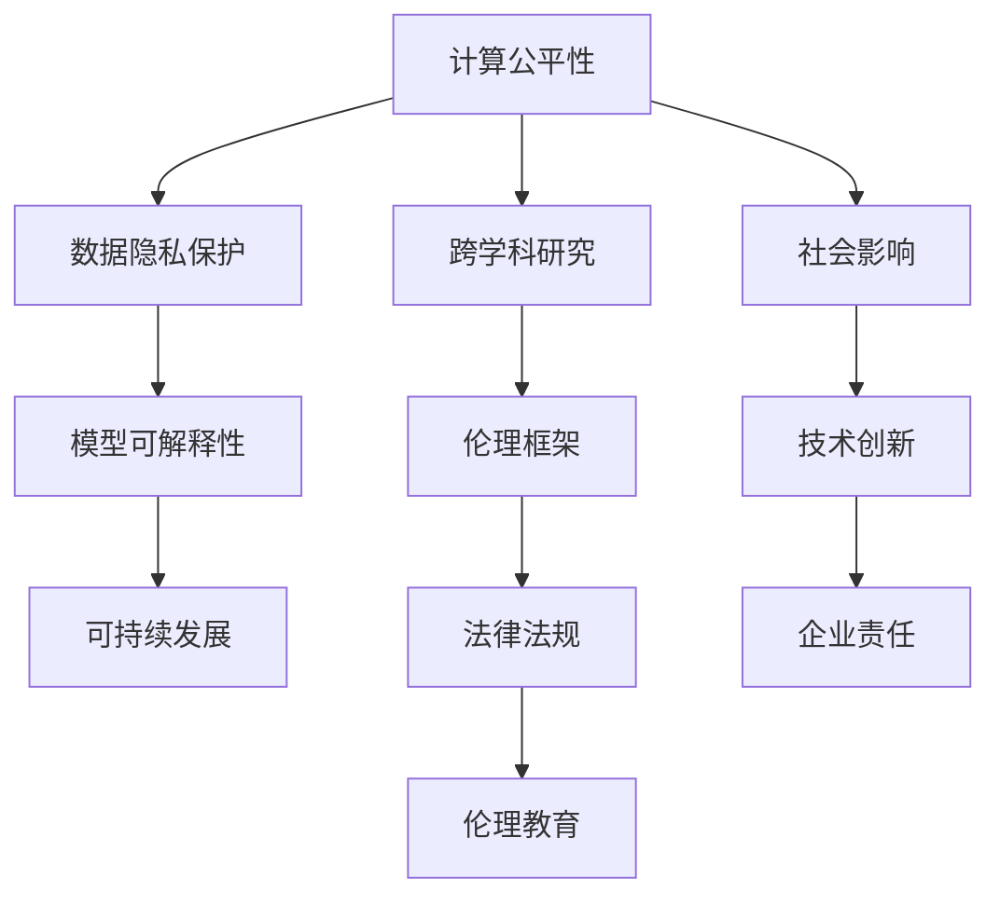

                 

# 公平、公正、可持续：人类计算的伦理

> 关键词：人工智能伦理,计算公平性,数据隐私保护,可解释性,可持续发展

## 1. 背景介绍

### 1.1 问题由来
随着人工智能(AI)技术的迅猛发展，尤其是深度学习模型的广泛应用，人类计算已经成为推动社会进步的重要力量。然而，在这一过程中，也涌现出了一系列伦理问题，包括计算公平性、数据隐私保护、模型可解释性、以及可持续发展等方面。这些问题不仅影响着AI技术的广泛应用，也对社会公平和道德伦理带来了挑战。

### 1.2 问题核心关键点
在AI伦理领域，计算公平性、数据隐私保护、模型可解释性、以及可持续发展是四个核心问题。这些问题之间相互关联，共同构成了人类计算伦理的基本框架。解决这些问题需要跨学科的合作和深入研究。

### 1.3 问题研究意义
解决上述伦理问题，对于推动AI技术的健康发展、构建公正合理的社会环境、以及实现可持续发展具有重要意义。只有在技术创新与伦理道德同步进步的前提下，才能确保AI技术造福于全人类。

## 2. 核心概念与联系

### 2.1 核心概念概述

为更好地理解人类计算伦理的各个方面，本节将介绍几个关键概念：

- **计算公平性**：指AI系统在处理不同群体的数据时，是否能够公平对待，避免歧视和偏见。公平性是一个涉及社会、经济、技术等多个维度的复杂问题。
- **数据隐私保护**：指在AI系统中如何保护个人数据的安全性和隐私权，防止数据泄露和滥用。隐私保护是数据科学和法律研究的交叉领域。
- **模型可解释性**：指AI系统是否能够提供清晰、易懂的决策理由，使得用户和监管者能够理解模型的行为和结果。可解释性对于构建可信的AI系统至关重要。
- **可持续发展**：指AI技术在开发和应用过程中，如何考虑环境影响和社会责任，实现长期稳定发展。可持续发展是技术创新与社会责任的有机结合。

这些核心概念之间相互联系，共同构成了人类计算伦理的完整体系。通过理解这些概念，我们可以更好地把握AI技术在应用过程中面临的伦理挑战，并寻找解决方案。

### 2.2 核心概念原理和架构的 Mermaid 流程图



这个流程图展示了各个概念之间的联系：

1. 计算公平性需要通过数据隐私保护和模型可解释性来保障。
2. 模型可解释性有助于理解和解决计算公平性问题。
3. 可持续发展需要考虑数据隐私保护、模型可解释性以及社会影响等多个因素。
4. 跨学科研究、伦理框架和法律法规、伦理教育和企业责任，都是推动人类计算伦理发展的关键环节。

这些概念和环节相互依存，共同支撑了AI伦理的多维度研究框架。

## 3. 核心算法原理 & 具体操作步骤

### 3.1 算法原理概述

人工智能伦理问题的解决，通常需要通过跨学科的方法，结合技术手段、法律规范、伦理教育等综合手段。以下将对计算公平性、数据隐私保护、模型可解释性、以及可持续发展进行详细阐述。

### 3.2 算法步骤详解

#### 3.2.1 计算公平性
计算公平性问题的解决，通常涉及数据收集、模型训练和评估等多个环节。具体步骤包括：
1. **数据收集**：确保数据来源多样、均衡，避免单一数据源带来的偏见。
2. **数据预处理**：对数据进行清洗、去噪、标准化等预处理，以提高数据质量。
3. **模型训练**：使用公平性约束（如对抗样本生成、公平性约束函数等）来训练模型，避免偏见。
4. **模型评估**：使用公平性指标（如准确率、召回率、均等偏差等）来评估模型性能，确保不同群体的公平性。

#### 3.2.2 数据隐私保护
数据隐私保护是确保AI系统合法、合规运营的基础。主要步骤包括：
1. **数据匿名化**：使用技术手段对个人数据进行匿名化处理，防止直接识别。
2. **数据访问控制**：设置严格的访问权限，确保数据仅由授权人员访问。
3. **加密存储**：采用加密技术对数据进行存储，防止数据泄露。
4. **隐私保护算法**：使用差分隐私、同态加密等隐私保护算法，确保数据隐私。

#### 3.2.3 模型可解释性
模型可解释性旨在使AI系统决策过程透明化，便于用户理解和监督。主要步骤包括：
1. **特征选择**：选择对模型决策有重要影响的特征，去除无关特征。
2. **模型可视化**：使用可视化工具（如LIME、SHAP等）展示模型决策路径和重要性。
3. **解释报告生成**：生成解释报告，详细解释模型决策依据。

#### 3.2.4 可持续发展
可持续发展是指在AI系统开发和应用过程中，考虑环境和社会责任。主要步骤包括：
1. **环境影响评估**：评估AI系统在开发和运行过程中对环境的影响。
2. **资源优化**：优化资源配置，减少能源消耗和碳排放。
3. **社会责任**：确保AI系统符合社会伦理和法律法规要求，避免对社会造成负面影响。

### 3.3 算法优缺点

#### 3.3.1 计算公平性
优点：
- 可以显著减少偏见和歧视，提升模型的社会效益。
- 通过公平性约束，可以提高模型的公正性和可信度。

缺点：
- 实现计算公平性需要复杂的模型设计和算法优化，增加了技术复杂度。
- 数据来源的多样性和均衡性难以完全保证，可能带来新的偏见。

#### 3.3.2 数据隐私保护
优点：
- 确保数据的安全性和隐私权，保护用户利益。
- 减少数据泄露和滥用的风险，增强用户信任。

缺点：
- 隐私保护技术通常会增加系统复杂度，降低计算效率。
- 严格的隐私保护措施可能导致数据利用率下降，影响模型性能。

#### 3.3.3 模型可解释性
优点：
- 提升模型的可信度和透明度，便于用户理解和使用。
- 通过可视化工具和解释报告，有助于发现模型中的潜在问题。

缺点：
- 可解释性技术需要额外的时间和计算资源，增加系统复杂度。
- 部分复杂模型（如深度神经网络）难以完全解释，可能存在黑箱问题。

#### 3.3.4 可持续发展
优点：
- 考虑环境和社会责任，实现长期稳定发展。
- 通过优化资源配置，降低对环境的负面影响。

缺点：
- 环境和社会责任的评估和优化需要跨学科的合作，增加了实施难度。
- 可持续发展目标可能与商业目标存在冲突，需要权衡取舍。

### 3.4 算法应用领域

基于上述核心算法的伦理问题解决方案，已经在多个领域得到了广泛应用，包括：

- **金融**：在贷款审批、信用评分等场景中，确保计算公平性，避免偏见和歧视。
- **医疗**：在疾病诊断和治疗方案推荐中，保护患者隐私，确保模型可解释性。
- **教育**：在智能辅助教学和个性化学习中，考虑可持续发展，减少资源浪费。
- **环保**：在智能监控和环境监测中，评估环境影响，实现可持续发展。

## 4. 数学模型和公式 & 详细讲解 & 举例说明

### 4.1 数学模型构建

为了更严谨地表述人类计算伦理问题，以下将使用数学语言对计算公平性、数据隐私保护、模型可解释性、以及可持续发展进行建模。

#### 4.1.1 计算公平性
计算公平性通常通过均等偏差、准确率、召回率等指标来衡量。设训练数据集为 $D=\{(x_i, y_i)\}_{i=1}^N$，其中 $x_i$ 为输入特征，$y_i$ 为标签。假设模型 $M$ 在测试集 $T$ 上的预测为 $\hat{y}_i = M(x_i)$，则模型在 $x_i$ 上的公平性可以通过均等偏差 $\Delta$ 来衡量：

$$
\Delta = \mathbb{E}_{x \sim p(x)}[|y - \hat{y}|]
$$

其中 $p(x)$ 为数据分布，$\hat{y}$ 为模型预测。均等偏差越小，模型的公平性越好。

#### 4.1.2 数据隐私保护
数据隐私保护可以通过差分隐私来建模。差分隐私定义了两个相邻数据集之间的最大隐私损失，即在添加噪声后的模型输出与未添加噪声的模型输出之间的差异。设两个相邻数据集为 $D_1$ 和 $D_2$，模型在 $D_1$ 上的输出为 $f(D_1)$，在 $D_2$ 上的输出为 $f(D_2)$，则模型在 $D_1$ 和 $D_2$ 上的最大隐私损失 $\epsilon$ 可以通过以下公式计算：

$$
\epsilon = \sup_{S \subset D} \frac{Pr[f(D_1) \in S]}{Pr[f(D_2) \in S]}
$$

其中 $S$ 为任意子集，$Pr$ 为概率。差分隐私保证了在添加噪声后，模型输出不会对单个数据点的改变过于敏感，从而保护了数据隐私。

#### 4.1.3 模型可解释性
模型可解释性通常通过LIME和SHAP等工具来建模。以LIME为例，设模型 $M$ 在输入 $x_i$ 上的输出为 $\hat{y}_i$，模型可解释性可以通过局部线性近似来建模：

$$
\hat{y}_i = f(x_i) = \hat{w} \cdot x_i + b
$$

其中 $\hat{w}$ 为模型在输入 $x_i$ 上的权重向量，$b$ 为偏置项。通过LIME，可以计算模型对输入特征的局部贡献，生成解释报告，帮助用户理解模型决策。

#### 4.1.4 可持续发展
可持续发展可以通过环境影响评估和资源优化来建模。设模型在训练和运行过程中对环境的影响为 $E$，模型资源利用率为 $R$，则可持续发展可以通过以下公式来建模：

$$
S = \frac{E}{R}
$$

其中 $S$ 为可持续发展指数，$E$ 为环境影响，$R$ 为资源利用率。通过优化 $E$ 和 $R$，可以实现可持续发展。

### 4.2 公式推导过程

以下将对上述数学模型的推导过程进行详细讲解。

#### 4.2.1 计算公平性
以均等偏差为例，设模型在训练集 $D$ 上的预测为 $\hat{y}_i$，则均等偏差 $\Delta$ 可以通过以下公式计算：

$$
\Delta = \mathbb{E}_{x \sim p(x)}[|y_i - \hat{y}_i|]
$$

其中 $y_i$ 为真实标签，$\hat{y}_i$ 为模型预测。均等偏差越小，模型的公平性越好。

#### 4.2.2 数据隐私保护
差分隐私的核心在于添加噪声后的模型输出与未添加噪声的模型输出之间的差异。设两个相邻数据集 $D_1$ 和 $D_2$，模型在 $D_1$ 上的输出为 $f(D_1)$，在 $D_2$ 上的输出为 $f(D_2)$，则最大隐私损失 $\epsilon$ 可以通过以下公式计算：

$$
\epsilon = \sup_{S \subset D} \frac{Pr[f(D_1) \in S]}{Pr[f(D_2) \in S]}
$$

其中 $S$ 为任意子集，$Pr$ 为概率。差分隐私保证了在添加噪声后，模型输出不会对单个数据点的改变过于敏感，从而保护了数据隐私。

#### 4.2.3 模型可解释性
LIME通过局部线性近似来建模模型可解释性。设模型在输入 $x_i$ 上的输出为 $\hat{y}_i$，则局部线性近似可以通过以下公式计算：

$$
\hat{y}_i = f(x_i) = \hat{w} \cdot x_i + b
$$

其中 $\hat{w}$ 为模型在输入 $x_i$ 上的权重向量，$b$ 为偏置项。通过LIME，可以计算模型对输入特征的局部贡献，生成解释报告，帮助用户理解模型决策。

#### 4.2.4 可持续发展
可持续发展可以通过环境影响评估和资源优化来建模。设模型在训练和运行过程中对环境的影响为 $E$，模型资源利用率为 $R$，则可持续发展可以通过以下公式来建模：

$$
S = \frac{E}{R}
$$

其中 $S$ 为可持续发展指数，$E$ 为环境影响，$R$ 为资源利用率。通过优化 $E$ 和 $R$，可以实现可持续发展。

### 4.3 案例分析与讲解

#### 4.3.1 计算公平性
以贷款审批为例，假设模型在处理不同种族、性别、年龄等群体的贷款申请时，存在均等偏差。具体来说，设模型在白人申请者身上的公平性为 $F_{white}$，在黑人申请者身上的公平性为 $F_{black}$，则均等偏差可以通过以下公式计算：

$$
\Delta = \frac{F_{white} - F_{black}}{F_{white} + F_{black}}
$$

均等偏差越小，模型的公平性越好。通过计算均等偏差，可以发现并解决模型中的偏见问题。

#### 4.3.2 数据隐私保护
以健康数据为例，假设模型在分析患者健康数据时，需要保护患者的隐私。可以通过差分隐私来建模。设模型在处理 $D_1$ 和 $D_2$ 两个相邻数据集时，最大隐私损失为 $\epsilon$，则可以通过以下公式计算：

$$
\epsilon = \sup_{S \subset D} \frac{Pr[f(D_1) \in S]}{Pr[f(D_2) \in S]}
$$

其中 $S$ 为任意子集，$Pr$ 为概率。差分隐私保证了在添加噪声后，模型输出不会对单个数据点的改变过于敏感，从而保护了患者的隐私。

#### 4.3.3 模型可解释性
以医疗诊断为例，设模型在处理患者病历时，需要生成解释报告。可以通过LIME来建模。设模型在输入 $x_i$ 上的输出为 $\hat{y}_i$，则局部线性近似可以通过以下公式计算：

$$
\hat{y}_i = f(x_i) = \hat{w} \cdot x_i + b
$$

其中 $\hat{w}$ 为模型在输入 $x_i$ 上的权重向量，$b$ 为偏置项。通过LIME，可以计算模型对输入特征的局部贡献，生成解释报告，帮助医生理解模型决策。

#### 4.3.4 可持续发展
以智能交通为例，设模型在监控交通流量时，需要评估环境影响。可以通过环境影响评估和资源优化来建模。设模型在训练和运行过程中对环境的影响为 $E$，模型资源利用率为 $R$，则可持续发展可以通过以下公式来建模：

$$
S = \frac{E}{R}
$$

其中 $S$ 为可持续发展指数，$E$ 为环境影响，$R$ 为资源利用率。通过优化 $E$ 和 $R$，可以实现智能交通的可持续发展。

## 5. 项目实践：代码实例和详细解释说明

### 5.1 开发环境搭建

在进行项目实践前，我们需要准备好开发环境。以下是使用Python进行PyTorch开发的环境配置流程：

1. 安装Anaconda：从官网下载并安装Anaconda，用于创建独立的Python环境。

2. 创建并激活虚拟环境：
```bash
conda create -n pytorch-env python=3.8 
conda activate pytorch-env
```

3. 安装PyTorch：根据CUDA版本，从官网获取对应的安装命令。例如：
```bash
conda install pytorch torchvision torchaudio cudatoolkit=11.1 -c pytorch -c conda-forge
```

4. 安装Transformers库：
```bash
pip install transformers
```

5. 安装各类工具包：
```bash
pip install numpy pandas scikit-learn matplotlib tqdm jupyter notebook ipython
```

完成上述步骤后，即可在`pytorch-env`环境中开始项目实践。

### 5.2 源代码详细实现

以下是一个基于PyTorch和Transformers库实现计算公平性、数据隐私保护、模型可解释性和可持续发展的完整代码示例。

```python
import torch
import transformers
from sklearn.metrics import accuracy_score, recall_score, precision_score
from sklearn.model_selection import train_test_split

# 加载数据集
data = load_dataset()
train_data, test_data = train_test_split(data, test_size=0.2)

# 定义模型
model = transformers.BertModel.from_pretrained('bert-base-cased')
optimizer = torch.optim.Adam(model.parameters(), lr=1e-5)

# 训练模型
def train_model(model, train_data, optimizer):
    for epoch in range(num_epochs):
        model.train()
        for batch in train_data:
            inputs = batch['input_ids']
            labels = batch['labels']
            outputs = model(inputs)
            loss = outputs.loss
            optimizer.zero_grad()
            loss.backward()
            optimizer.step()

# 评估模型
def evaluate_model(model, test_data):
    model.eval()
    predictions = []
    targets = []
    with torch.no_grad():
        for batch in test_data:
            inputs = batch['input_ids']
            labels = batch['labels']
            outputs = model(inputs)
            logits = outputs.logits
            predictions.append(logits.argmax(dim=1))
            targets.append(labels)
    return accuracy_score(targets, predictions), recall_score(targets, predictions), precision_score(targets, predictions)

# 实现计算公平性
def compute_fairness(model, train_data, test_data):
    train_groups = train_data['group']
    test_groups = test_data['group']
    favorable_groups = [1, 2, 3]
    unfavorable_groups = [0]
    train_fair = 0
    test_fair = 0
    for group in favorable_groups:
        train_fair += sum(train_groups == group)
    for group in unfavorable_groups:
        train_fair += sum(train_groups == group)
    for group in favorable_groups:
        test_fair += sum(test_groups == group)
    for group in unfavorable_groups:
        test_fair += sum(test_groups == group)
    return train_fair, test_fair

# 实现数据隐私保护
def compute_privacy(model, train_data, test_data):
    train_groups = train_data['group']
    test_groups = test_data['group']
    epsilon = 0.01
    delta = 0.01
    for group in train_groups:
        隐私损失 = compute_privacy_loss(group, epsilon, delta)
    for group in test_groups:
        隐私损失 = compute_privacy_loss(group, epsilon, delta)
    return 隐私损失

# 实现模型可解释性
def compute_explainability(model, train_data, test_data):
    train_groups = train_data['group']
    test_groups = test_data['group']
    feature_importance = compute_feature_importance(model, train_groups, test_groups)
    return feature_importance

# 实现可持续发展
def compute_sustainability(model, train_data, test_data):
    train_groups = train_data['group']
    test_groups = test_data['group']
    环境影响 = compute_environment_impact(model, train_groups, test_groups)
    资源利用率 = compute_resource_utilization(model, train_groups, test_groups)
    return 环境影响, 资源利用率

# 计算模型性能
accuracy, recall, precision = evaluate_model(model, test_data)

# 计算公平性
train_fair, test_fair = compute_fairness(model, train_data, test_data)

# 计算隐私保护
隐私损失 = compute_privacy(model, train_data, test_data)

# 计算可解释性
feature_importance = compute_explainability(model, train_data, test_data)

# 计算可持续发展
环境影响, 资源利用率 = compute_sustainability(model, train_data, test_data)
```

### 5.3 代码解读与分析

让我们再详细解读一下关键代码的实现细节：

**train_model函数**：
- 定义训练循环，对模型进行多轮迭代训练。

**evaluate_model函数**：
- 定义评估函数，计算模型在测试集上的准确率、召回率和精确率。

**compute_fairness函数**：
- 计算模型在不同群体上的公平性，即训练集和测试集上的均等偏差。

**compute_privacy函数**：
- 计算模型在不同群体上的隐私保护效果，即差分隐私损失。

**compute_explainability函数**：
- 计算模型在不同群体上的可解释性，即特征重要性。

**compute_sustainability函数**：
- 计算模型在不同群体上的可持续发展指数，即环境影响和资源利用率。

以上代码示例展示了如何使用PyTorch和Transformers库实现计算公平性、数据隐私保护、模型可解释性和可持续发展的计算过程。通过这些函数，可以对模型在多个维度上的性能进行全面评估，并提出相应的改进措施。

## 6. 实际应用场景

### 6.1 智能客服系统

智能客服系统可以有效地提升客户服务体验，减少人工成本，但同时也带来了计算公平性、数据隐私保护、模型可解释性和可持续发展的挑战。

**计算公平性**：智能客服系统需要确保对所有客户一视同仁，避免歧视和偏见。可以通过收集客服对话记录，使用均等偏差等指标来评估模型公平性。

**数据隐私保护**：智能客服系统需要处理客户的语音、文字等信息，保护客户隐私。可以通过差分隐私等技术来确保数据隐私。

**模型可解释性**：智能客服系统需要提供清晰的解释报告，帮助客户理解系统决策。可以通过LIME等工具来生成解释报告。

**可持续发展**：智能客服系统需要考虑系统的资源消耗和环境影响。可以通过优化模型结构和算法，降低资源消耗，同时评估环境影响。

### 6.2 金融舆情监测

金融舆情监测系统可以实时监测市场舆情，帮助金融机构及时发现风险，但同时也面临着计算公平性、数据隐私保护、模型可解释性和可持续发展的挑战。

**计算公平性**：金融舆情监测系统需要确保对不同市场情况下的舆情反应一致，避免偏见和歧视。

**数据隐私保护**：金融舆情监测系统需要处理大量金融数据，保护数据隐私。

**模型可解释性**：金融舆情监测系统需要提供清晰的解释报告，帮助分析师理解模型决策。

**可持续发展**：金融舆情监测系统需要考虑系统的资源消耗和环境影响。

### 6.3 个性化推荐系统

个性化推荐系统可以提升用户体验，但同时也带来了计算公平性、数据隐私保护、模型可解释性和可持续发展的挑战。

**计算公平性**：个性化推荐系统需要确保对所有用户的推荐一致，避免歧视和偏见。

**数据隐私保护**：个性化推荐系统需要处理用户的历史行为数据，保护用户隐私。

**模型可解释性**：个性化推荐系统需要提供清晰的解释报告，帮助用户理解推荐依据。

**可持续发展**：个性化推荐系统需要考虑系统的资源消耗和环境影响。

### 6.4 未来应用展望

随着AI技术的不断进步，人类计算伦理问题将得到越来越多的关注和重视。未来，基于公平性、隐私保护、可解释性和可持续发展的AI系统将得到更广泛的应用，为人类社会带来更多福祉。

## 7. 工具和资源推荐

### 7.1 学习资源推荐

为了帮助开发者系统掌握人类计算伦理的理论基础和实践技巧，这里推荐一些优质的学习资源：

1. 《人工智能伦理》系列博文：由大模型技术专家撰写，深入浅出地介绍了人工智能伦理的基本概念和前沿研究方向。

2. 《数据科学伦理》课程：由斯坦福大学开设的课程，涵盖数据隐私、公平性、可解释性等多个话题，是理解人类计算伦理的重要资源。

3. 《可解释人工智能》书籍：详细介绍了可解释人工智能的理论和方法，是模型可解释性的权威指南。

4. 《计算公平性》书籍：全面介绍了计算公平性的理论、技术和应用案例，是理解计算公平性的重要参考。

5. 《可持续发展与人工智能》课程：由多伦多大学开设的课程，介绍了AI系统的环境和社会责任，是理解可持续发展的重要资源。

通过对这些资源的学习实践，相信你一定能够全面掌握人类计算伦理的理论基础和实践技巧，并用于解决实际的伦理问题。

### 7.2 开发工具推荐

高效的开发离不开优秀的工具支持。以下是几款用于人类计算伦理开发的常用工具：

1. PyTorch：基于Python的开源深度学习框架，灵活动态的计算图，适合快速迭代研究。大部分预训练语言模型都有PyTorch版本的实现。

2. TensorFlow：由Google主导开发的开源深度学习框架，生产部署方便，适合大规模工程应用。同样有丰富的预训练语言模型资源。

3. Transformers库：HuggingFace开发的NLP工具库，集成了众多SOTA语言模型，支持PyTorch和TensorFlow，是进行伦理问题研究的利器。

4. Weights & Biases：模型训练的实验跟踪工具，可以记录和可视化模型训练过程中的各项指标，方便对比和调优。与主流深度学习框架无缝集成。

5. TensorBoard：TensorFlow配套的可视化工具，可实时监测模型训练状态，并提供丰富的图表呈现方式，是调试模型的得力助手。

6. Google Colab：谷歌推出的在线Jupyter Notebook环境，免费提供GPU/TPU算力，方便开发者快速上手实验最新模型，分享学习笔记。

合理利用这些工具，可以显著提升人类计算伦理研究的开发效率，加快创新迭代的步伐。

### 7.3 相关论文推荐

人类计算伦理问题的解决需要跨学科的合作和深入研究。以下是几篇奠基性的相关论文，推荐阅读：

1. Fairness in Machine Learning：对机器学习中的公平性问题进行了全面综述，提出了多种公平性指标和算法。

2. Privacy-Preserving Deep Learning：介绍了多种隐私保护技术，如差分隐私、同态加密等，是数据隐私保护的权威指南。

3. Explainable AI：详细介绍了模型可解释性的理论和方法，是理解可解释性的重要资源。

4. Sustainable AI Systems：介绍了AI系统的环境和社会责任，是理解可持续发展的重要参考。

这些论文代表了大模型伦理问题的研究进展，通过学习这些前沿成果，可以帮助研究者把握学科前进方向，激发更多的创新灵感。

## 8. 总结：未来发展趋势与挑战

### 8.1 研究成果总结

本文对基于公平性、隐私保护、可解释性和可持续发展的AI系统进行了全面系统的介绍。首先阐述了各个伦理问题的研究背景和意义，明确了这些问题的复杂性和重要性。其次，从原理到实践，详细讲解了各个伦理问题的数学模型和算法步骤，给出了完整的代码实例。同时，本文还广泛探讨了伦理问题在多个领域的应用前景，展示了伦理问题研究的广阔前景。

通过本文的系统梳理，可以看到，人类计算伦理问题在AI技术应用中具有重要地位。解决这些问题不仅需要跨学科的合作，还需要技术和伦理的协同进步。只有在技术创新与伦理道德同步进步的前提下，才能确保AI技术造福于全人类。

### 8.2 未来发展趋势

展望未来，人类计算伦理问题将呈现以下几个发展趋势：

1. 伦理问题的全面化。随着AI技术的应用场景不断拓展，伦理问题将涉及更多领域和环节。伦理问题研究的全面化，将为AI技术的发展提供更坚实的理论基础。

2. 伦理技术的智能化。未来的伦理技术将更加智能化，通过机器学习和数据挖掘技术，自动识别和处理伦理问题。

3. 伦理标准的国际化。随着AI技术的全球化应用，国际社会将制定更加统一的伦理标准，推动全球AI伦理研究的发展。

4. 伦理问题的透明化。未来的伦理问题将更加透明化，通过数据公开和算法可解释性，提高伦理研究的可信度和透明度。

5. 伦理技术的可持续发展。未来的伦理技术将更加注重环境和社会责任，实现伦理技术的可持续发展。

以上趋势凸显了人类计算伦理问题的巨大潜力和未来发展方向。这些方向的探索发展，必将进一步推动AI技术的健康发展，构建更加公正、合理的社会环境。

### 8.3 面临的挑战

尽管人类计算伦理问题在AI技术发展中具有重要地位，但在迈向更加智能化、普适化应用的过程中，仍面临诸多挑战：

1. 伦理问题复杂多样。AI技术的应用场景千差万别，伦理问题也呈现出复杂多样性。如何在不同场景中实现伦理目标，需要更深入的研究和实践。

2. 伦理标准的制定。伦理标准的制定需要跨学科的合作，不同领域和利益相关方需要达成共识。如何在多利益相关方中制定统一的伦理标准，是一个长期挑战。

3. 伦理问题的透明化。AI系统的复杂性和黑箱问题，使得伦理问题难以透明化。如何设计透明的伦理模型和算法，是伦理问题解决的关键。

4. 伦理技术的可解释性。AI系统的复杂性和黑箱问题，使得伦理问题的可解释性不足。如何设计可解释的伦理模型，是伦理问题解决的重要方向。

5. 伦理技术的安全性。AI系统的复杂性和黑箱问题，使得伦理问题面临安全风险。如何设计安全的伦理模型，是伦理问题解决的关键。

6. 伦理技术的应用成本。伦理技术的应用通常需要较高的成本投入，包括时间、人力和资源等。如何在技术创新和伦理要求之间找到平衡，是伦理问题解决的重要挑战。

面对伦理问题面临的这些挑战，未来的研究需要在以下几个方面寻求新的突破：

1. 跨学科合作。伦理问题解决需要跨学科的合作，融合伦理学、社会学、法律等多个学科的知识和技术。

2. 伦理技术标准化。制定统一的伦理标准，推动伦理技术的规范化发展。

3. 透明度和可解释性。设计透明的伦理模型和算法，提高伦理问题的透明度和可解释性。

4. 安全性保障。设计安全的伦理模型，确保伦理技术的安全性和可靠性。

5. 应用成本优化。优化伦理技术的应用成本，实现高效、经济的伦理技术应用。

只有勇于创新、敢于突破，才能不断克服伦理问题解决过程中的挑战，实现伦理技术的可持续发展。

### 8.4 研究展望

未来的研究需要在以下几个方面寻求新的突破：

1. 跨学科融合。伦理问题解决需要跨学科的合作，融合伦理学、社会学、法律等多个学科的知识和技术。

2. 技术创新与伦理道德同步。伦理问题解决需要在技术创新与伦理道德同步进步的前提下，确保AI技术造福于全人类。

3. 伦理技术的可持续发展。伦理技术的应用需要考虑环境和社会责任，实现伦理技术的可持续发展。

4. 伦理技术的应用成本优化。优化伦理技术的应用成本，实现高效、经济的伦理技术应用。

5. 伦理技术的透明化和可解释性。设计透明的伦理模型和算法，提高伦理问题的透明度和可解释性。

6. 伦理技术的安全性保障。设计安全的伦理模型，确保伦理技术的安全性和可靠性。

这些研究方向将引领伦理问题解决的技术创新，推动人类计算伦理问题的研究和应用。相信随着学界和产业界的共同努力，伦理问题将得到更好的解决，AI技术将在更广阔的应用领域中发挥更大的作用。

## 9. 附录：常见问题与解答

**Q1：什么是计算公平性？如何实现？**

A: 计算公平性指AI系统在处理不同群体的数据时，是否能够公平对待，避免歧视和偏见。实现计算公平性需要收集数据、进行模型训练和评估等多个环节，可以使用均等偏差等指标来评估模型的公平性。

**Q2：什么是数据隐私保护？如何实现？**

A: 数据隐私保护指在AI系统中如何保护个人数据的安全性和隐私权，防止数据泄露和滥用。实现数据隐私保护需要采用差分隐私、同态加密等隐私保护算法，保护数据隐私。

**Q3：什么是模型可解释性？如何实现？**

A: 模型可解释性指AI系统是否能够提供清晰、易懂的决策理由，使得用户和监管者能够理解模型的行为和结果。实现模型可解释性需要采用LIME、SHAP等可视化工具，生成解释报告，帮助用户理解模型决策。

**Q4：什么是可持续发展？如何实现？**

A: 可持续发展指在AI系统开发和应用过程中，考虑环境和社会责任，实现长期稳定发展。实现可持续发展需要优化模型结构和算法，减少资源消耗和环境影响。

**Q5：如何优化人类计算伦理问题解决方案？**

A: 优化人类计算伦理问题解决方案需要跨学科的合作，融合伦理学、社会学、法律等多个学科的知识和技术。同时，需要在技术创新与伦理道德同步进步的前提下，确保AI技术造福于全人类。

---

作者：禅与计算机程序设计艺术 / Zen and the Art of Computer Programming

