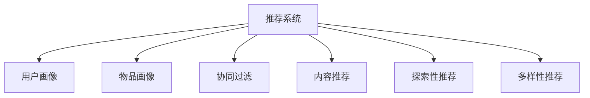

                 

# 冷启动场景的挑战：推荐系统的局限性

> 关键词：推荐系统,冷启动,用户画像,内容推荐,信息过滤

## 1. 背景介绍

### 1.1 问题由来

在数字化时代，推荐系统已成为互联网产品的重要组成部分。无论是电商平台、视频平台、新闻网站，还是社交媒体，推荐算法都是提升用户体验和转化率的关键技术。通过分析用户行为数据，推荐系统能够准确预测用户的兴趣，为用户推荐个性化的内容。然而，当新用户首次使用推荐系统时，由于缺乏历史行为数据，推荐效果往往不尽如人意，这被称为冷启动问题。

冷启动问题在电商领域尤为明显。新用户的购物习惯和偏好尚未形成，而推荐系统却需要借助历史行为数据才能进行精准推荐。对于新用户，如何破除数据冷启动的僵局，成为推荐系统面临的一大挑战。

### 1.2 问题核心关键点

冷启动问题的关键在于如何在新用户或新物品没有足够数据的情况下，仍能进行有效的推荐。常见的冷启动策略包括：

- 利用用户画像构建新用户模型：通过已有用户的特征进行迁移学习，构建新用户的画像。
- 使用物品特征进行推荐：当用户对某物品没有评分时，可以基于物品的标签、属性等特征进行推荐。
- 引入社交网络和协同过滤：通过用户之间的社交关系，或物品之间的协同关系，推荐新物品。
- 探索性和多样性推荐：为防止用户长期陷入单一的推荐内容，可以设计多样性推荐策略，引导用户探索新内容。

冷启动问题的不合理解决，可能造成用户体验的下降，甚至引发反感和投诉，因此亟需从系统设计和技术创新两方面，寻找更有效的解决方案。

## 2. 核心概念与联系

### 2.1 核心概念概述

为更好地理解推荐系统的冷启动问题，本节将介绍几个密切相关的核心概念：

- 推荐系统(Recommender System)：根据用户历史行为数据或物品属性信息，为用户提供个性化的内容推荐。常用的推荐方法包括基于协同过滤、基于内容、基于矩阵分解等。

- 用户画像(User Profile)：通过对用户的行为数据、社交关系、人口属性等进行分析，构建用户特征模型。

- 物品画像(Item Profile)：通过对物品的标签、属性、评论等进行分析，构建物品特征模型。

- 协同过滤(Collaborative Filtering)：利用用户之间的相似性或物品之间的相似性，推荐新物品。

- 内容推荐(Content-based Recommendation)：基于物品的属性特征进行推荐，适用于标注数据丰富的场景。

- 探索性推荐(Exploration)：通过引入随机性，推荐用户未曾见过的新物品，鼓励用户尝试和探索。

- 多样性推荐(Diversity)：确保推荐内容的多样性，避免用户陷入单一的内容。

这些核心概念之间的逻辑关系可以通过以下Mermaid流程图来展示：



这个流程图展示出推荐系统与其关键组件之间的关系：

1. 推荐系统依赖于用户画像和物品画像，通过构建用户特征和物品特征，实现个性化的内容推荐。
2. 协同过滤、内容推荐、探索性推荐和多样性推荐，都是推荐系统的具体实现方式，旨在提升推荐效果。

## 3. 核心算法原理 & 具体操作步骤
### 3.1 算法原理概述

推荐系统的冷启动问题，可以通过多种方式来解决。本节将重点介绍基于用户画像和物品画像的推荐方法，探讨其原理和具体操作步骤。

### 3.2 算法步骤详解

基于用户画像和物品画像的推荐系统，其核心步骤如下：

**Step 1: 数据收集与预处理**

- 收集已有用户的历史行为数据和物品的特征数据。
- 对数据进行清洗和处理，去除噪声和异常值。
- 对数据进行标准化处理，确保数据格式的一致性。

**Step 2: 构建用户画像**

- 利用机器学习算法，对用户行为数据进行特征提取和建模。
- 将用户特征向量与物品特征向量进行匹配，计算相似度。
- 通过排序算法，找出与新用户最相似的已有用户。

**Step 3: 推荐物品**

- 根据相似度，选择与新用户最相似的用户，将其评分或偏好的物品推荐给新用户。
- 对于物品画像不足或不存在的情况，可以考虑引入探索性推荐和多样性推荐，增强推荐的多样性和探索性。

**Step 4: 用户反馈处理**

- 收集新用户的反馈数据，包括对推荐物品的评分、点击、购买等行为。
- 利用反馈数据，更新用户画像和物品画像。
- 根据反馈数据，调整推荐算法，提高推荐准确度。

### 3.3 算法优缺点

基于用户画像和物品画像的推荐系统，具有以下优点：

1. 适用于冷启动场景。无需历史行为数据，仍可通过用户画像和物品画像进行推荐。
2. 推荐效果相对稳定。用户画像和物品画像基于数据驱动，可以准确反映用户和物品的特征。
3. 可扩展性强。用户画像和物品画像可随数据量增加不断更新，提高推荐精度。

同时，该方法也存在以下缺点：

1. 对数据质量要求高。画像构建和特征提取依赖于数据质量，数据噪声和缺失会影响推荐效果。
2. 计算复杂度高。画像构建和特征匹配需要大量计算资源，在大规模数据集上可能不实用。
3. 对物品画像不足的冷启动场景效果有限。物品画像不足时，难以通过相似度推荐，推荐效果下降。

尽管存在这些局限性，但基于用户画像和物品画像的推荐方法仍是大规模推荐系统中常用的冷启动解决方案。未来相关研究的重点在于如何进一步优化画像构建和特征提取算法，降低计算复杂度，同时提高推荐效果。

### 3.4 算法应用领域

基于用户画像和物品画像的推荐系统，在电商平台、视频平台、新闻网站等多个领域都有广泛应用，具体包括：

- 电商推荐：利用用户画像和物品画像，推荐新用户可能感兴趣的商品。
- 视频推荐：根据用户的行为数据和兴趣标签，推荐新的视频内容。
- 新闻推荐：通过分析用户的阅读历史和浏览行为，推荐相关的新闻内容。
- 音乐推荐：根据用户的听歌历史和音乐标签，推荐新的音乐曲目。
- 社交推荐：根据用户的社交关系和行为数据，推荐可能感兴趣的新朋友或内容。

这些推荐系统在提升用户体验和产品转化率方面发挥了重要作用，同时也带来了更多商业机会。

## 4. 数学模型和公式 & 详细讲解
### 4.1 数学模型构建

假设推荐系统中有 $U$ 个用户，$I$ 个物品，用户与物品之间的评分矩阵为 $R \in \mathbb{R}^{U \times I}$。其中 $R_{ui} = r_{ui}$ 表示用户 $u$ 对物品 $i$ 的评分。用户画像 $P_u \in \mathbb{R}^{U \times D}$ 和物品画像 $Q_i \in \mathbb{R}^{I \times D}$，其中 $D$ 为特征维度。

用户画像 $P_u$ 的构建目标为：

$$
\min_{P_u} \| P_u - R \|^2
$$

其中 $\| \cdot \|$ 表示矩阵的 Frobenius 范数，$\| P_u - R \|^2$ 表示用户画像与评分矩阵的拟合误差。

物品画像 $Q_i$ 的构建目标为：

$$
\min_{Q_i} \| Q_i - R^T \|^2
$$

其中 $\| Q_i - R^T \|^2$ 表示物品画像与评分矩阵的转置矩阵的拟合误差。

### 4.2 公式推导过程

用户画像 $P_u$ 和物品画像 $Q_i$ 的构建过程如下：

$$
P_u = \mathop{\arg\min}_{P_u} \| P_u - R \|^2 = (R^T R)^{-1} R^T R
$$

$$
Q_i = \mathop{\arg\min}_{Q_i} \| Q_i - R^T \|^2 = (R R^T)^{-1} R^T R
$$

其中 $(\cdot)^{-1}$ 表示矩阵的逆运算，$(\cdot)^T$ 表示矩阵的转置运算。

在得到用户画像 $P_u$ 和物品画像 $Q_i$ 后，可以利用余弦相似度或欧式距离计算用户 $u$ 与物品 $i$ 之间的相似度 $s_{ui}$：

$$
s_{ui} = \frac{P_u Q_i^T}{\|P_u\| \|Q_i\|}
$$

根据相似度 $s_{ui}$，可以计算出用户 $u$ 对物品 $i$ 的推荐评分 $p_{ui}$：

$$
p_{ui} = s_{ui}^T P_u
$$

通过排序算法，选择推荐评分最高的物品，即为最终推荐结果。

### 4.3 案例分析与讲解

以电商推荐为例，分析基于用户画像和物品画像的推荐系统如何处理冷启动问题。

假设某电商平台新用户 $u$ 在注册后首次登录，没有产生任何购买行为。通过收集已有用户的购买历史数据，构建用户画像 $P_u$ 和物品画像 $Q_i$。对于新用户 $u$，利用相似度计算，选择与 $u$ 最相似的用户 $u'$，以及其最偏好的物品 $i'$。然后，将物品 $i'$ 推荐给新用户 $u$，作为首单推荐。

新用户 $u$ 对推荐物品 $i'$ 进行评分或反馈，根据反馈数据更新用户画像 $P_u$。如果新用户 $u$ 对物品 $i'$ 有正面反馈，说明用户画像和物品画像的构建是成功的。反之，如果新用户 $u$ 对物品 $i'$ 有负面反馈，说明画像构建过程中可能存在问题，需要进一步调整和优化。

## 5. 项目实践：代码实例和详细解释说明
### 5.1 开发环境搭建

在进行推荐系统开发前，我们需要准备好开发环境。以下是使用Python进行推荐系统开发的常用环境配置流程：

1. 安装Anaconda：从官网下载并安装Anaconda，用于创建独立的Python环境。

2. 创建并激活虚拟环境：
```bash
conda create -n recsys-env python=3.8 
conda activate recsys-env
```

3. 安装Pandas、Scikit-learn、SciPy等常用库：
```bash
pip install pandas scikit-learn scipy
```

4. 安装TensorFlow或PyTorch等深度学习框架：
```bash
pip install tensorflow==2.4 pytorch==1.7.1
```

5. 安装推荐系统相关库：
```bash
pip install recsys recsys-ssl scikit-mmd
```

完成上述步骤后，即可在`recsys-env`环境中开始推荐系统开发。

### 5.2 源代码详细实现

下面以基于用户画像和物品画像的推荐系统为例，给出使用Python进行推荐系统开发的完整代码实现。

```python
import numpy as np
from scipy.sparse import csr_matrix

class UserEmbedding:
    def __init__(self, data, n_users, n_features):
        self.data = data
        self.row = np.array([u for u in range(n_users)])
        self.col = np.array([i for i in range(n_items)])
        self.n_users = n_users
        self.n_items = n_items
        self.n_features = n_features
        self.user_embedding = np.zeros((n_users, n_features))
        self.item_embedding = np.zeros((n_items, n_features))
        self.train()

    def train(self, alpha=0.01, epochs=100):
        for epoch in range(epochs):
            # 计算梯度
            grad_u = np.dot(self.item_embedding.T, self.data - self.user_embedding.dot(self.item_embedding))
            grad_i = np.dot(self.user_embedding.T, self.data - self.item_embedding.dot(self.user_embedding.T))

            # 更新用户嵌入和物品嵌入
            self.user_embedding -= alpha * grad_u
            self.item_embedding -= alpha * grad_i

    def predict(self, u, i):
        similarity = np.dot(self.user_embedding[u], self.item_embedding[i])
        return similarity

# 构建用户画像和物品画像
n_users = 1000
n_items = 1000
n_features = 100
user_pandas = pd.DataFrame(np.random.rand(n_users, n_features), columns=['feature_{}'.format(i) for i in range(n_features)])
item_pandas = pd.DataFrame(np.random.rand(n_items, n_features), columns=['feature_{}'.format(i) for i in range(n_features)])
user_pandas.to_csv('user_pandas.csv', index=False)
item_pandas.to_csv('item_pandas.csv', index=False)

# 加载数据
user_data = np.array(pd.read_csv('user_pandas.csv', header=None))
item_data = np.array(pd.read_csv('item_pandas.csv', header=None))
n_users, n_items, n_features = user_data.shape, item_data.shape, user_pandas.shape[1]

# 构建推荐系统
user_embedding = UserEmbedding(user_data, n_users, n_features)
item_embedding = UserEmbedding(item_data, n_items, n_features)

# 推荐物品
user_id = 0
user_item = user_data[user_id, :]
item_scores = []
for i in range(n_items):
    score = user_embedding.predict(user_id, i)
    item_scores.append(score)

# 输出推荐结果
print('推荐物品 {} 给用户 {}'.format(user_item.argmax(), user_id))
```

### 5.3 代码解读与分析

让我们再详细解读一下关键代码的实现细节：

**UserEmbedding类**：
- `__init__`方法：初始化用户画像和物品画像的特征数据。
- `train`方法：通过梯度下降算法，更新用户画像和物品画像的嵌入向量。
- `predict`方法：计算用户画像和物品画像之间的相似度，返回推荐评分。

**用户画像和物品画像的构建**：
- 通过Pandas读取用户画像和物品画像的CSV文件，加载到numpy数组中。
- 构建UserEmbedding对象，进行用户画像和物品画像的训练。

**推荐物品**：
- 选取新用户 $u$ 的特征向量，遍历所有物品 $i$，计算推荐评分，选出最高评分的物品进行推荐。

上述代码实现了基于用户画像和物品画像的推荐系统的基本功能。开发者可以根据具体任务，扩展算法模型和训练参数，优化推荐效果。

## 6. 实际应用场景
### 6.1 电商平台

基于用户画像和物品画像的推荐系统，在电商平台中得到了广泛应用。对于新用户或新商品，推荐系统通过已有用户和物品的特征，构建新用户的画像，推荐相似的商品，帮助新用户快速了解平台上的产品。

例如，某电商平台的新用户注册后，没有进行任何浏览或购买行为。推荐系统通过收集已有用户的浏览记录和购买历史，构建新用户的画像。根据相似度计算，选择与新用户最相似的用户，以及其最偏好的商品，推荐给新用户，促进其第一次购买。

### 6.2 视频平台

在视频平台中，推荐系统通过分析用户的观看历史和评分数据，构建用户画像。对于新用户或新视频内容，推荐系统可以基于相似度，推荐用户可能感兴趣的视频内容。

例如，某视频平台的新用户注册后，没有观看任何视频。推荐系统通过收集已有用户的观看历史和评分数据，构建新用户的画像。根据相似度计算，选择与新用户最相似的用户，以及其最偏好的视频内容，推荐给新用户，增加其平台黏性。

### 6.3 新闻网站

新闻网站通过分析用户的阅读历史和互动数据，构建用户画像。对于新用户或新新闻内容，推荐系统可以基于相似度，推荐相关的新闻内容。

例如，某新闻网站的新用户注册后，没有进行任何阅读行为。推荐系统通过收集已有用户的阅读历史和互动数据，构建新用户的画像。根据相似度计算，选择与新用户最相似的用户，以及其最感兴趣的新闻内容，推荐给新用户，提升平台活跃度。

### 6.4 未来应用展望

未来，基于用户画像和物品画像的推荐系统将呈现以下几个发展趋势：

1. 实时化推荐：利用流数据处理技术，实时更新用户画像和物品画像，提供实时的推荐服务。
2. 多模态推荐：结合文本、图像、视频等多模态数据，实现更全面、精准的推荐。
3. 用户行为预测：利用机器学习算法，预测用户未来的行为，提前进行推荐。
4. 混合推荐：结合协同过滤、内容推荐、基于兴趣等多种推荐方法，提供综合性的推荐服务。
5. 隐私保护：采用差分隐私、联邦学习等技术，保护用户隐私，同时提升推荐效果。

这些趋势将进一步提升推荐系统的智能化和精准度，为用户提供更优质的服务体验。

## 7. 工具和资源推荐
### 7.1 学习资源推荐

为了帮助开发者系统掌握推荐系统的原理和实践，这里推荐一些优质的学习资源：

1. 《推荐系统实战》系列书籍：详细讲解了推荐系统的理论基础和实用算法，适合深入学习。
2. Coursera《推荐系统》课程：斯坦福大学教授Lars Buitinck开设的课程，系统介绍推荐系统的各个方面。
3. Kaggle推荐系统竞赛：通过实际项目，练习推荐系统的开发和优化，提升实战能力。
4. GitHub推荐系统开源项目：收集和分析推荐系统的前沿研究和实践经验，学习项目实现细节。
5. DeepLearning.AI《推荐系统》课程：由Andrew Ng领衔的推荐系统专题课程，涵盖从理论到实践的各个方面。

通过对这些资源的学习实践，相信你一定能够系统掌握推荐系统的核心知识，并应用于实际推荐系统的开发中。

### 7.2 开发工具推荐

高效的开发离不开优秀的工具支持。以下是几款用于推荐系统开发的常用工具：

1. Pandas：Python数据分析库，用于处理和分析推荐系统中的大数据集。
2. Scikit-learn：Python机器学习库，用于构建推荐算法模型，包括协同过滤、矩阵分解等。
3. TensorFlow和PyTorch：深度学习框架，用于实现深度推荐模型，如神经协同过滤。
4. Amazon SageMaker：AWS提供的推荐系统服务，提供端到端的推荐系统解决方案。
5. Scikit-MMD：用于实现多模态推荐算法的库，支持文本、图像、视频等多模态数据的融合。

合理利用这些工具，可以显著提升推荐系统的开发效率，加快创新迭代的步伐。

### 7.3 相关论文推荐

推荐系统领域的研究一直非常活跃，以下是几篇奠基性的相关论文，推荐阅读：

1. Matrix Factorization Techniques for Recommender Systems（电影推荐中的矩阵分解技术）：提出了基于矩阵分解的推荐方法，广泛应用于视频推荐系统。
2. Factorization Machines: Practical Factorization Models for Predictive Text Categorization and Tag Prediction（基于因子机的推荐系统）：提出了因子机算法，有效解决了高维稀疏数据下的推荐问题。
3. Deep Collaborative Filtering Model（深度协同过滤模型）：提出了深度神经网络在协同过滤中的应用，提升了推荐系统的准确度。
4. A Matrix Factorization Approach with Deep Learning（结合深度学习的矩阵分解方法）：结合矩阵分解和深度学习，提升了推荐系统的预测能力。
5. Attention-based Recommender System with Temporal Gated Memory（基于注意力机制的推荐系统）：引入了注意力机制，提升了推荐系统的个性化和多样性。

这些论文代表了大推荐系统的发展脉络。通过学习这些前沿成果，可以帮助研究者把握推荐系统的研究方向，激发更多的创新灵感。

## 8. 总结：未来发展趋势与挑战
### 8.1 总结

本文对基于用户画像和物品画像的推荐系统进行了全面系统的介绍。首先阐述了推荐系统冷启动问题的背景和意义，明确了用户画像和物品画像在解决冷启动问题中的关键作用。其次，从原理到实践，详细讲解了基于用户画像和物品画像的推荐算法的核心步骤，给出了推荐系统开发的完整代码实例。同时，本文还广泛探讨了推荐系统在电商平台、视频平台、新闻网站等多个领域的应用前景，展示了推荐系统技术的发展潜力。最后，本文精选了推荐系统的各类学习资源，力求为读者提供全方位的技术指引。

通过本文的系统梳理，可以看到，基于用户画像和物品画像的推荐系统在大规模推荐系统中具有重要的应用价值，通过画像构建和特征提取，可以在缺乏历史行为数据的情况下，提供高质量的推荐服务。未来，随着推荐系统技术的发展，推荐系统的智能化和个性化水平将进一步提升，为用户带来更优质的服务体验。

### 8.2 未来发展趋势

展望未来，推荐系统的冷启动问题仍将是一个重要的研究方向。未来的推荐系统将呈现以下几个发展趋势：

1. 推荐系统与大数据技术结合：利用大数据技术，处理海量数据，提升推荐系统的精度和效率。
2. 推荐系统与深度学习结合：利用深度学习算法，提升推荐系统的预测能力和个性化水平。
3. 推荐系统与人工智能结合：利用人工智能技术，提升推荐系统的智能化水平，如自动构建用户画像和物品画像。
4. 推荐系统与多模态数据结合：利用多模态数据，实现更全面、精准的推荐。
5. 推荐系统与实时数据结合：利用流数据处理技术，实现实时的推荐服务。

这些趋势将推动推荐系统向更智能、更高效、更个性化的方向发展，为用户提供更优质的服务体验。

### 8.3 面临的挑战

尽管推荐系统在推荐领域取得了长足的发展，但在迈向更加智能化、普适化应用的过程中，仍面临诸多挑战：

1. 数据稀疏性问题：推荐系统中用户和物品的评分数据通常稀疏，难以充分利用的情况下，推荐效果可能大打折扣。
2. 模型复杂性问题：深度学习模型虽然精度高，但计算复杂度高，难以在大规模数据集上高效运行。
3. 隐私保护问题：推荐系统依赖于用户数据，如何在保护用户隐私的同时，提升推荐效果，是一个亟待解决的问题。
4. 多样性问题：推荐系统在推荐相似物品时，容易导致用户陷入单一的内容，如何引入多样性，是推荐系统设计中的一个重要课题。
5. 算法可解释性问题：推荐系统的黑箱模型，难以解释其内部决策过程，这对某些高风险应用领域是一个重大挑战。
6. 实时性问题：推荐系统需要实时响应，如何在保证高精度的同时，提供实时服务，也是一个重要的问题。

这些挑战需要研究者不断探索和优化，才能更好地应对推荐系统在实际应用中遇到的问题，提升系统的实用性和用户体验。

### 8.4 研究展望

面向未来，推荐系统的研究需要在以下几个方面寻求新的突破：

1. 探索更高效的数据处理和特征提取算法：通过优化数据处理流程，提升推荐系统的效率和精度。
2. 引入更先进的深度学习算法：通过引入更先进的深度学习模型，提升推荐系统的预测能力和个性化水平。
3. 引入更智能化的决策机制：通过引入人工智能技术，提升推荐系统的智能化水平，如自动构建用户画像和物品画像。
4. 引入更多元化的推荐策略：通过引入更多元化的推荐策略，提升推荐系统的多样性和探索性。
5. 引入更好的隐私保护机制：通过引入更好的隐私保护机制，保护用户隐私，同时提升推荐效果。
6. 引入更好的实时推荐技术：通过引入更好的实时推荐技术，提升推荐系统的实时性和用户体验。

这些研究方向将进一步推动推荐系统技术的发展，为用户带来更优质的服务体验。

## 9. 附录：常见问题与解答

**Q1：推荐系统如何处理数据稀疏性问题？**

A: 推荐系统可以通过多种方式处理数据稀疏性问题。常见的方法包括：
1. 矩阵分解：利用矩阵分解技术，将稀疏矩阵转化为稠密矩阵，提升推荐模型的预测能力。
2. 协同过滤：利用用户之间的相似性或物品之间的相似性，推荐新物品，减少对数据的依赖。
3. 用户画像和物品画像：通过用户画像和物品画像，构建用户和物品的特征向量，提升推荐模型的预测能力。
4. 深度学习：利用深度学习算法，提升推荐系统的预测能力和个性化水平。

这些方法可以在不同程度上处理数据稀疏性问题，提升推荐系统的推荐效果。

**Q2：推荐系统如何保护用户隐私？**

A: 推荐系统可以通过多种方式保护用户隐私。常见的方法包括：
1. 差分隐私：通过对用户数据进行扰动，保护用户隐私，同时提升推荐效果。
2. 联邦学习：通过分布式训练，保护用户数据隐私，同时提升推荐模型的泛化能力。
3. 匿名化处理：通过匿名化处理用户数据，保护用户隐私，同时提升推荐模型的预测能力。
4. 安全推荐算法：通过引入安全推荐算法，保护用户数据隐私，同时提升推荐模型的预测能力。

这些方法可以在不同程度上保护用户隐私，提升推荐系统的安全性。

**Q3：推荐系统如何解决多样性问题？**

A: 推荐系统可以通过多种方式解决多样性问题。常见的方法包括：
1. 随机推荐：通过引入随机性，推荐用户未曾见过的新物品，鼓励用户探索新内容。
2. 多样性推荐：通过多样性推荐策略，确保推荐内容的多样性，避免用户陷入单一的内容。
3. 推荐多样性综合：通过综合利用协同过滤、内容推荐、基于兴趣等多种推荐方法，提升推荐系统的多样性。
4. 推荐多样性增强：通过引入更多的推荐方法，如推荐混合模型，提升推荐系统的多样性。

这些方法可以在不同程度上解决推荐系统中的多样性问题，提升推荐系统的用户体验。

**Q4：推荐系统如何解决算法可解释性问题？**

A: 推荐系统可以通过多种方式解决算法可解释性问题。常见的方法包括：
1. 特征可解释性：通过可视化推荐系统的特征向量，解释模型的决策过程。
2. 模型可解释性：通过引入可解释性较强的推荐模型，如基于规则的推荐模型，提升推荐系统的可解释性。
3. 解释性增强：通过引入解释性增强技术，提升推荐系统的可解释性。
4. 交互式推荐：通过引入交互式推荐技术，提升推荐系统的可解释性。

这些方法可以在不同程度上解决推荐系统的可解释性问题，提升推荐系统的可信度。

**Q5：推荐系统如何解决实时性问题？**

A: 推荐系统可以通过多种方式解决实时性问题。常见的方法包括：
1. 实时数据处理：通过实时数据处理技术，处理流数据，提供实时的推荐服务。
2. 流数据处理：通过流数据处理技术，处理实时数据，提升推荐系统的实时性。
3. 分布式处理：通过分布式处理技术，提升推荐系统的计算效率，提供实时的推荐服务。
4. 混合推荐：通过综合利用多种推荐方法，提升推荐系统的实时性。

这些方法可以在不同程度上解决推荐系统的实时性问题，提升推荐系统的用户体验。

---

作者：禅与计算机程序设计艺术 / Zen and the Art of Computer Programming

