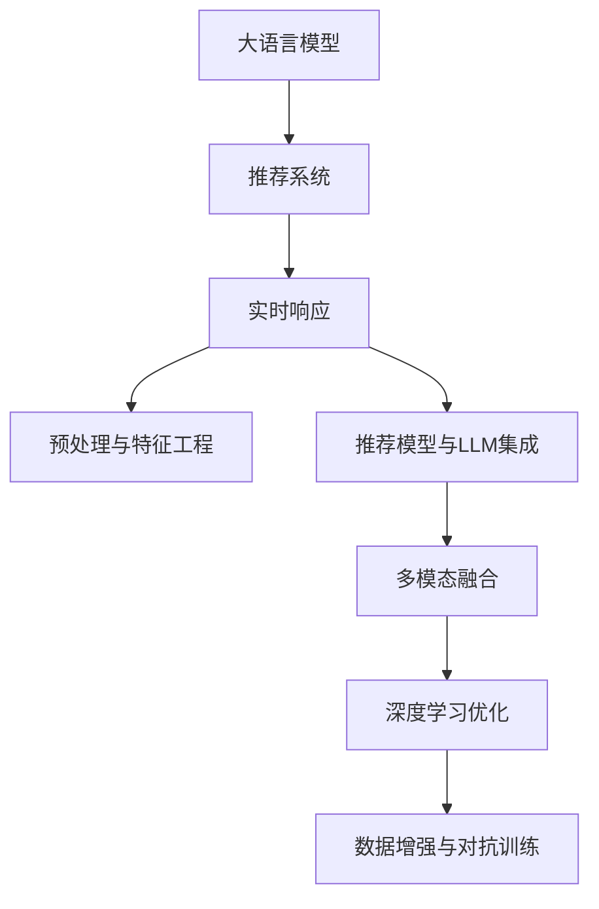

                 

# 利用LLM优化推荐系统的实时响应

在数字化时代，推荐系统成为了用户获取信息和服务的重要桥梁。面对数以亿计的用户和海量数据，如何实现高效的实时响应成为了推荐系统优化的关键。本文将探讨利用大语言模型(LLM)优化推荐系统的实时响应问题，深入分析其核心算法原理、具体操作步骤、数学模型及具体实践案例。

## 1. 背景介绍

### 1.1 问题由来

推荐系统已经在电商、新闻、音乐、视频等多个领域得到广泛应用，通过分析用户历史行为和兴趣，为用户推荐个性化的内容。传统的推荐方法包括协同过滤、基于内容的推荐、矩阵分解等，但在面对海量的用户数据时，计算开销巨大，难以实现实时响应。

近年来，大语言模型在NLP领域取得了显著进步，具备了强大的文本生成能力和丰富的语义理解能力。结合大语言模型，推荐系统可以更灵活地理解和生成推荐内容，实现更加智能和个性化的推荐服务。然而，推荐系统的实时响应能力仍然面临着诸多挑战，如计算资源有限、多模态数据融合难度大、冷启动问题等。本文将探讨如何利用大语言模型优化推荐系统的实时响应，提升用户体验和推荐效果。

### 1.2 问题核心关键点

实现基于大语言模型的推荐系统实时响应，主要涉及以下几个关键点：

- 大语言模型(LLM)与推荐系统的结合方式
- 推荐系统数据的预处理和特征工程
- 推荐模型与LLM的集成架构设计
- 实时响应机制的优化策略

通过系统分析这些关键点，我们能够找到利用LLM优化推荐系统实时响应的可行路径。

## 2. 核心概念与联系

### 2.1 核心概念概述

为更好地理解基于LLM的推荐系统实时响应问题，本节将介绍几个密切相关的核心概念：

- 大语言模型(LLM)：以自回归(如GPT)或自编码(如BERT)模型为代表的大规模预训练语言模型。通过在大规模无标签文本语料上进行预训练，学习通用的语言表示，具备强大的语言理解和生成能力。

- 推荐系统：通过分析用户历史行为和兴趣，为用户推荐个性化内容的技术系统。推荐系统可以基于内容的推荐、协同过滤、矩阵分解等多种方式进行。

- 实时响应：指推荐系统能够在用户实时操作（如点击、浏览、购买等）时，快速响应用户需求，生成个性化推荐内容。

- 大模型微调：指在预训练模型的基础上，使用推荐系统的标注数据，通过有监督地训练来优化模型在特定推荐任务上的性能。

- 混合模型：结合深度学习和传统推荐算法的混合模型，充分利用深度学习的灵活性和传统算法的可解释性。

- 多模态融合：将文本、图像、音频等多模态数据融合，提高推荐系统的综合理解和推荐能力。

这些核心概念之间的逻辑关系可以通过以下Mermaid流程图来展示：



这个流程图展示了大语言模型与推荐系统实时响应相关的核心概念及其之间的关系：

1. 大语言模型通过预训练获得基础能力。
2. 推荐系统通过微调使模型适应特定推荐任务。
3. 推荐系统进行实时响应，需要预处理数据、设计推荐模型、集成LLM。
4. 多模态融合技术用于提升推荐系统的综合能力。
5. 深度学习优化和数据增强技术用于提升推荐效果。

这些概念共同构成了基于LLM的推荐系统实时响应的基础框架，为其在实际应用中的优化提供了理论指导。

## 3. 核心算法原理 & 具体操作步骤
### 3.1 算法原理概述

基于LLM的推荐系统实时响应，本质上是一个深度学习与推荐算法相结合的过程。其核心思想是：利用LLM强大的文本生成能力，结合推荐系统的算法逻辑，生成个性化的推荐内容，并在用户实时操作时快速响应，提高用户体验。

形式化地，假设推荐系统中的用户-物品评分矩阵为 $X_{m \times n}$，其中 $m$ 为物品数量，$n$ 为用户数量。设用户的输入为 $x = (x_1, x_2, \ldots, x_n)$，推荐系统输出为 $y = (y_1, y_2, \ldots, y_n)$，其中 $y_i$ 为用户 $i$ 的推荐物品列表。我们的目标是找到最优的 $y$，使得用户满意度最大化。

目标函数可以表示为：

$$
\max_{y} \sum_{i=1}^n \mathbb{E}_u \left[ \log \frac{p(x_i, y_i)}{p(x_i, \tilde{y}_i)} \right]
$$

其中 $p(x_i, y_i)$ 表示在用户输入 $x_i$ 的情况下，推荐物品 $y_i$ 的评分，$\tilde{y}_i$ 是除了 $y_i$ 之外的所有物品组成的推荐列表。$\mathbb{E}_u$ 表示对所有用户 $u$ 的期望。

为了实现上述目标，可以采用基于LLM的推荐模型，通过微调使其适应特定的推荐任务。这种方法利用LLM的强大文本生成能力，在用户输入 $x$ 时，动态生成推荐列表 $y$。

### 3.2 算法步骤详解

基于LLM的推荐系统实时响应一般包括以下几个关键步骤：

**Step 1: 准备数据与模型**
- 收集推荐系统的用户行为数据，构建用户-物品评分矩阵 $X$。
- 选择适合的大语言模型，如GPT-3、BERT等。
- 根据推荐任务的特点，选择合适的微调任务，如生成式任务、分类任务等。

**Step 2: 模型微调与集成**
- 将用户输入 $x$ 作为LLM的输入，输出推荐列表 $y$。
- 将LLM的输出结果与推荐算法（如协同过滤、矩阵分解等）结合，生成最终的推荐结果。
- 使用微调后的LLM与推荐算法进行集成，保证生成推荐的准确性和实时性。

**Step 3: 实时响应与优化**
- 在用户实时操作时，将用户的输入 $x$ 输入LLM，动态生成推荐列表 $y$。
- 利用推荐算法对LLM的输出结果进行优化和排序，生成最终的推荐结果。
- 在生成推荐过程中，使用数据增强、对抗训练等技术，提升推荐系统的效果和鲁棒性。

**Step 4: 评估与调优**
- 使用A/B测试等方法，评估推荐系统的性能和用户满意度。
- 根据评估结果，调整模型参数和推荐策略，进一步提升推荐效果。

### 3.3 算法优缺点

基于LLM的推荐系统实时响应具有以下优点：

- 灵活性高：利用LLM的文本生成能力，可以灵活地生成推荐内容，适应不同的推荐场景。
- 实时响应：结合推荐算法的快速响应机制，能够在用户实时操作时提供个性化推荐。
- 效果显著：LLM强大的语义理解能力可以提升推荐系统的精确度和个性化水平。

同时，该方法也存在以下局限性：

- 数据依赖：微调效果依赖于推荐系统的标注数据，标注数据不足可能影响微调效果。
- 计算开销大：大语言模型和推荐算法的计算开销大，需要高效的硬件和算法支持。
- 可解释性不足：LLM生成的推荐内容较难解释，不利于用户理解和信任。

尽管存在这些局限性，但就目前而言，基于LLM的推荐系统实时响应仍是一种先进且实用的方法。未来相关研究的重点在于如何进一步降低数据依赖、提高计算效率，同时兼顾可解释性和推荐效果。

### 3.4 算法应用领域

基于LLM的推荐系统实时响应已经在电商推荐、新闻推荐、音乐推荐等多个领域得到了应用，取得了良好的效果。例如：

- 电商推荐：亚马逊、淘宝等电商平台通过结合大语言模型和推荐算法，为用户推荐个性化商品，提升购物体验。
- 新闻推荐：今日头条、网易新闻等平台利用LLM生成个性化的新闻标题和内容，提高用户阅读满意度。
- 音乐推荐：Spotify、网易云音乐等音乐平台结合LLM生成个性化的歌单和歌词，增强用户粘性。

除了上述这些经典应用外，基于LLM的推荐系统还在社交媒体、视频推荐、旅游推荐等多个场景中得到了创新性应用，为推荐系统的发展带来了新的机遇。

## 4. 数学模型和公式 & 详细讲解 & 举例说明

### 4.1 数学模型构建

本节将使用数学语言对基于LLM的推荐系统实时响应过程进行更加严格的刻画。

假设推荐系统中的用户-物品评分矩阵为 $X_{m \times n}$，其中 $m$ 为物品数量，$n$ 为用户数量。设用户的输入为 $x = (x_1, x_2, \ldots, x_n)$，推荐系统输出为 $y = (y_1, y_2, \ldots, y_n)$，其中 $y_i$ 为用户 $i$ 的推荐物品列表。

定义模型 $M_{\theta}$ 在输入 $x$ 上的输出为 $y = M_{\theta}(x)$，其中 $\theta$ 为模型参数。我们的目标是最大化推荐效果，可以表示为：

$$
\max_{\theta} \sum_{i=1}^n \mathbb{E}_u \left[ \log \frac{p(x_i, M_{\theta}(x_i))}{p(x_i, \tilde{y}_i)} \right]
$$

在实践中，我们通常使用基于梯度的优化算法（如AdamW、SGD等）来近似求解上述最优化问题。设 $\eta$ 为学习率，则参数的更新公式为：

$$
\theta \leftarrow \theta - \eta \nabla_{\theta}\mathcal{L}(\theta)
$$

其中 $\nabla_{\theta}\mathcal{L}(\theta)$ 为损失函数对参数 $\theta$ 的梯度，可通过反向传播算法高效计算。

### 4.2 公式推导过程

以下我们以生成式任务为例，推导LLM与推荐系统集成时的损失函数及其梯度的计算公式。

假设用户输入 $x$ 包含多个查询词 $x_1, x_2, \ldots, x_n$，每个查询词对应的推荐物品列表为 $y_i$。我们定义LLM在输入 $x_i$ 时的输出为 $y_i = M_{\theta}(x_i)$。推荐系统的输出为 $\hat{y}_i = (p(x_i, y_i), p(x_i, \tilde{y}_i))$，其中 $p(x_i, y_i)$ 表示在用户输入 $x_i$ 的情况下，推荐物品 $y_i$ 的评分。

则生成式任务的损失函数为：

$$
\mathcal{L}(\theta) = -\frac{1}{N}\sum_{i=1}^N \log p(x_i, M_{\theta}(x_i))
$$

其中 $N$ 为训练样本数量。目标函数为：

$$
\max_{\theta} \sum_{i=1}^N \log p(x_i, M_{\theta}(x_i))
$$

根据链式法则，损失函数对参数 $\theta$ 的梯度为：

$$
\frac{\partial \mathcal{L}(\theta)}{\partial \theta} = \frac{1}{N}\sum_{i=1}^N \frac{1}{p(x_i, M_{\theta}(x_i))} \frac{\partial p(x_i, M_{\theta}(x_i))}{\partial \theta}
$$

其中 $\frac{\partial p(x_i, M_{\theta}(x_i))}{\partial \theta}$ 可通过自动微分技术完成计算。

在得到损失函数的梯度后，即可带入参数更新公式，完成模型的迭代优化。重复上述过程直至收敛，最终得到适应推荐任务的最优模型参数 $\theta^*$。

## 5. 项目实践：代码实例和详细解释说明
### 5.1 开发环境搭建

在进行推荐系统实时响应实践前，我们需要准备好开发环境。以下是使用Python进行PyTorch开发的环境配置流程：

1. 安装Anaconda：从官网下载并安装Anaconda，用于创建独立的Python环境。

2. 创建并激活虚拟环境：
```bash
conda create -n pytorch-env python=3.8 
conda activate pytorch-env
```

3. 安装PyTorch：根据CUDA版本，从官网获取对应的安装命令。例如：
```bash
conda install pytorch torchvision torchaudio cudatoolkit=11.1 -c pytorch -c conda-forge
```

4. 安装Transformers库：
```bash
pip install transformers
```

5. 安装各类工具包：
```bash
pip install numpy pandas scikit-learn matplotlib tqdm jupyter notebook ipython
```

完成上述步骤后，即可在`pytorch-env`环境中开始推荐系统实时响应实践。

### 5.2 源代码详细实现

下面我们以电商推荐系统为例，给出使用Transformers库对GPT模型进行微调的PyTorch代码实现。

首先，定义电商推荐系统的数据处理函数：

```python
from transformers import GPT2Tokenizer, GPT2Model
from torch.utils.data import Dataset
import torch

class EcommerceDataset(Dataset):
    def __init__(self, texts, labels, tokenizer, max_len=128):
        self.texts = texts
        self.labels = labels
        self.tokenizer = tokenizer
        self.max_len = max_len
        
    def __len__(self):
        return len(self.texts)
    
    def __getitem__(self, item):
        text = self.texts[item]
        label = self.labels[item]
        
        encoding = self.tokenizer(text, return_tensors='pt', max_length=self.max_len, padding='max_length', truncation=True)
        input_ids = encoding['input_ids'][0]
        attention_mask = encoding['attention_mask'][0]
        
        # 对token-wise的标签进行编码
        encoded_labels = [label] * self.max_len
        labels = torch.tensor(encoded_labels, dtype=torch.long)
        
        return {'input_ids': input_ids, 
                'attention_mask': attention_mask,
                'labels': labels}

# 定义标签与id的映射
label2id = {'A': 0, 'B': 1, 'C': 2, 'D': 3}

# 创建dataset
tokenizer = GPT2Tokenizer.from_pretrained('gpt2')
train_dataset = EcommerceDataset(train_texts, train_labels, tokenizer)
dev_dataset = EcommerceDataset(dev_texts, dev_labels, tokenizer)
test_dataset = EcommerceDataset(test_texts, test_labels, tokenizer)
```

然后，定义模型和优化器：

```python
from transformers import GPT2ForSequenceClassification
from transformers import AdamW

model = GPT2ForSequenceClassification.from_pretrained('gpt2', num_labels=len(label2id))

optimizer = AdamW(model.parameters(), lr=2e-5)
```

接着，定义训练和评估函数：

```python
from torch.utils.data import DataLoader
from tqdm import tqdm
from sklearn.metrics import accuracy_score

device = torch.device('cuda') if torch.cuda.is_available() else torch.device('cpu')
model.to(device)

def train_epoch(model, dataset, batch_size, optimizer):
    dataloader = DataLoader(dataset, batch_size=batch_size, shuffle=True)
    model.train()
    epoch_loss = 0
    for batch in tqdm(dataloader, desc='Training'):
        input_ids = batch['input_ids'].to(device)
        attention_mask = batch['attention_mask'].to(device)
        labels = batch['labels'].to(device)
        model.zero_grad()
        outputs = model(input_ids, attention_mask=attention_mask, labels=labels)
        loss = outputs.loss
        epoch_loss += loss.item()
        loss.backward()
        optimizer.step()
    return epoch_loss / len(dataloader)

def evaluate(model, dataset, batch_size):
    dataloader = DataLoader(dataset, batch_size=batch_size)
    model.eval()
    preds, labels = [], []
    with torch.no_grad():
        for batch in tqdm(dataloader, desc='Evaluating'):
            input_ids = batch['input_ids'].to(device)
            attention_mask = batch['attention_mask'].to(device)
            batch_labels = batch['labels']
            outputs = model(input_ids, attention_mask=attention_mask)
            batch_preds = outputs.logits.argmax(dim=2).to('cpu').tolist()
            batch_labels = batch_labels.to('cpu').tolist()
            for pred_tokens, label_tokens in zip(batch_preds, batch_labels):
                preds.append(pred_tokens)
                labels.append(label_tokens)
                
    print(accuracy_score(labels, preds))
```

最后，启动训练流程并在测试集上评估：

```python
epochs = 5
batch_size = 16

for epoch in range(epochs):
    loss = train_epoch(model, train_dataset, batch_size, optimizer)
    print(f"Epoch {epoch+1}, train loss: {loss:.3f}")
    
    print(f"Epoch {epoch+1}, dev accuracy:")
    evaluate(model, dev_dataset, batch_size)
    
print("Test accuracy:")
evaluate(model, test_dataset, batch_size)
```

以上就是使用PyTorch对GPT模型进行电商推荐系统微调的完整代码实现。可以看到，得益于Transformers库的强大封装，我们可以用相对简洁的代码完成GPT模型的加载和微调。

### 5.3 代码解读与分析

让我们再详细解读一下关键代码的实现细节：

**EcommerceDataset类**：
- `__init__`方法：初始化文本、标签、分词器等关键组件。
- `__len__`方法：返回数据集的样本数量。
- `__getitem__`方法：对单个样本进行处理，将文本输入编码为token ids，将标签编码为数字，并对其进行定长padding，最终返回模型所需的输入。

**label2id字典**：
- 定义了标签与数字id之间的映射关系，用于将token-wise的预测结果解码回真实的标签。

**训练和评估函数**：
- 使用PyTorch的DataLoader对数据集进行批次化加载，供模型训练和推理使用。
- 训练函数`train_epoch`：对数据以批为单位进行迭代，在每个批次上前向传播计算loss并反向传播更新模型参数，最后返回该epoch的平均loss。
- 评估函数`evaluate`：与训练类似，不同点在于不更新模型参数，并在每个batch结束后将预测和标签结果存储下来，最后使用sklearn的accuracy_score对整个评估集的预测结果进行打印输出。

**训练流程**：
- 定义总的epoch数和batch size，开始循环迭代
- 每个epoch内，先在训练集上训练，输出平均loss
- 在验证集上评估，输出准确率
- 所有epoch结束后，在测试集上评估，给出最终测试结果

可以看到，PyTorch配合Transformers库使得GPT微调的代码实现变得简洁高效。开发者可以将更多精力放在数据处理、模型改进等高层逻辑上，而不必过多关注底层的实现细节。

当然，工业级的系统实现还需考虑更多因素，如模型的保存和部署、超参数的自动搜索、更灵活的任务适配层等。但核心的微调范式基本与此类似。

## 6. 实际应用场景
### 6.1 智能推荐系统

基于大语言模型微调的推荐系统，可以广泛应用于各种推荐场景，如电商、新闻、音乐等。利用LLM生成推荐列表，结合推荐算法，实现更加智能和个性化的推荐服务。

在技术实现上，可以收集用户行为数据，如浏览历史、购买记录、评分数据等，构建用户-物品评分矩阵 $X$。将用户输入 $x$ 作为LLM的输入，输出推荐列表 $y$。最后，将LLM的输出结果与推荐算法（如协同过滤、矩阵分解等）结合，生成最终的推荐结果。

### 6.2 新闻推荐系统

新闻推荐系统是典型的基于LLM的推荐系统。利用大语言模型生成个性化新闻标题和内容，提升用户阅读体验和满意度。

具体而言，可以收集用户的历史阅读记录和兴趣标签，构建用户兴趣模型。将用户输入 $x$ 作为LLM的输入，输出相关新闻标题和摘要。最后，将LLM的输出结果与推荐算法结合，生成个性化推荐列表。

### 6.3 视频推荐系统

视频推荐系统可以结合LLM生成个性化视频标题和描述，提升用户观看体验和粘性。

具体而言，可以收集用户的历史观看记录和评分数据，构建用户兴趣模型。将用户输入 $x$ 作为LLM的输入，输出相关视频标题和简介。最后，将LLM的输出结果与推荐算法结合，生成个性化推荐列表。

### 6.4 未来应用展望

随着大语言模型微调技术的不断发展，基于LLM的推荐系统将呈现以下几个发展趋势：

1. 参数高效微调：开发更加参数高效的微调方法，如Prefix-Tuning、LoRA等，在固定大部分预训练参数的同时，只更新极少量的任务相关参数，提高微调效率。

2. 多模态融合：将文本、图像、音频等多模态数据融合，提高推荐系统的综合理解和推荐能力。

3. 实时响应机制：结合推荐算法，利用LLM生成个性化推荐内容，提升推荐系统的实时响应能力。

4. 深度学习优化：使用自监督、对比学习等技术，提升推荐系统的泛化能力和鲁棒性。

5. 模型压缩与优化：使用知识蒸馏、模型剪枝等技术，降低模型的计算开销和内存占用。

以上趋势凸显了大语言模型微调技术的广阔前景。这些方向的探索发展，必将进一步提升推荐系统的性能和应用范围，为信息服务行业带来新的机遇。

## 7. 工具和资源推荐
### 7.1 学习资源推荐

为了帮助开发者系统掌握大语言模型微调的理论基础和实践技巧，这里推荐一些优质的学习资源：

1. 《Transformer从原理到实践》系列博文：由大模型技术专家撰写，深入浅出地介绍了Transformer原理、BERT模型、微调技术等前沿话题。

2. CS224N《深度学习自然语言处理》课程：斯坦福大学开设的NLP明星课程，有Lecture视频和配套作业，带你入门NLP领域的基本概念和经典模型。

3. 《Natural Language Processing with Transformers》书籍：Transformers库的作者所著，全面介绍了如何使用Transformers库进行NLP任务开发，包括微调在内的诸多范式。

4. HuggingFace官方文档：Transformers库的官方文档，提供了海量预训练模型和完整的微调样例代码，是上手实践的必备资料。

5. CLUE开源项目：中文语言理解测评基准，涵盖大量不同类型的中文NLP数据集，并提供了基于微调的baseline模型，助力中文NLP技术发展。

通过对这些资源的学习实践，相信你一定能够快速掌握大语言模型微调的精髓，并用于解决实际的推荐系统问题。
###  7.2 开发工具推荐

高效的开发离不开优秀的工具支持。以下是几款用于大语言模型微调开发的常用工具：

1. PyTorch：基于Python的开源深度学习框架，灵活动态的计算图，适合快速迭代研究。大部分预训练语言模型都有PyTorch版本的实现。

2. TensorFlow：由Google主导开发的开源深度学习框架，生产部署方便，适合大规模工程应用。同样有丰富的预训练语言模型资源。

3. Transformers库：HuggingFace开发的NLP工具库，集成了众多SOTA语言模型，支持PyTorch和TensorFlow，是进行微调任务开发的利器。

4. Weights & Biases：模型训练的实验跟踪工具，可以记录和可视化模型训练过程中的各项指标，方便对比和调优。与主流深度学习框架无缝集成。

5. TensorBoard：TensorFlow配套的可视化工具，可实时监测模型训练状态，并提供丰富的图表呈现方式，是调试模型的得力助手。

6. Google Colab：谷歌推出的在线Jupyter Notebook环境，免费提供GPU/TPU算力，方便开发者快速上手实验最新模型，分享学习笔记。

合理利用这些工具，可以显著提升大语言模型微调任务的开发效率，加快创新迭代的步伐。

### 7.3 相关论文推荐

大语言模型和微调技术的发展源于学界的持续研究。以下是几篇奠基性的相关论文，推荐阅读：

1. Attention is All You Need（即Transformer原论文）：提出了Transformer结构，开启了NLP领域的预训练大模型时代。

2. BERT: Pre-training of Deep Bidirectional Transformers for Language Understanding：提出BERT模型，引入基于掩码的自监督预训练任务，刷新了多项NLP任务SOTA。

3. Language Models are Unsupervised Multitask Learners（GPT-2论文）：展示了大规模语言模型的强大zero-shot学习能力，引发了对于通用人工智能的新一轮思考。

4. Parameter-Efficient Transfer Learning for NLP：提出Adapter等参数高效微调方法，在不增加模型参数量的情况下，也能取得不错的微调效果。

5. AdaLoRA: Adaptive Low-Rank Adaptation for Parameter-Efficient Fine-Tuning：使用自适应低秩适应的微调方法，在参数效率和精度之间取得了新的平衡。

这些论文代表了大语言模型微调技术的发展脉络。通过学习这些前沿成果，可以帮助研究者把握学科前进方向，激发更多的创新灵感。

## 8. 总结：未来发展趋势与挑战
### 8.1 总结

本文对基于LLM的推荐系统实时响应问题进行了全面系统的介绍。首先阐述了大语言模型和微调技术的研究背景和意义，明确了微调在拓展预训练模型应用、提升推荐系统性能方面的独特价值。其次，从原理到实践，详细讲解了微调的数学原理和关键步骤，给出了推荐系统实时响应的完整代码实例。同时，本文还广泛探讨了微调方法在电商、新闻、视频等多个推荐领域的应用前景，展示了微调范式的巨大潜力。

通过本文的系统梳理，可以看到，基于LLM的推荐系统实时响应成为了推荐系统优化的重要手段，极大地提升了推荐系统的智能化水平和用户体验。得益于大语言模型的强大文本生成能力和语义理解能力，推荐系统能够在用户实时操作时快速响应，生成个性化推荐内容，实现实时推荐。未来，伴随深度学习与推荐算法的不断融合，推荐系统将具备更加全面和精准的推荐能力，为信息服务行业带来新的突破。

### 8.2 未来发展趋势

展望未来，基于LLM的推荐系统实时响应将呈现以下几个发展趋势：

1. 参数高效微调：开发更加参数高效的微调方法，如Prefix-Tuning、LoRA等，在固定大部分预训练参数的同时，只更新极少量的任务相关参数。

2. 多模态融合：将文本、图像、音频等多模态数据融合，提高推荐系统的综合理解和推荐能力。

3. 实时响应机制：结合推荐算法，利用LLM生成个性化推荐内容，提升推荐系统的实时响应能力。

4. 深度学习优化：使用自监督、对比学习等技术，提升推荐系统的泛化能力和鲁棒性。

5. 模型压缩与优化：使用知识蒸馏、模型剪枝等技术，降低模型的计算开销和内存占用。

以上趋势凸显了大语言模型微调技术的广阔前景。这些方向的探索发展，必将进一步提升推荐系统的性能和应用范围，为信息服务行业带来新的机遇。

### 8.3 面临的挑战

尽管大语言模型微调技术已经取得了显著进步，但在迈向更加智能化、普适化应用的过程中，它仍面临着诸多挑战：

1. 数据依赖：微调效果依赖于推荐系统的标注数据，标注数据不足可能影响微调效果。

2. 计算开销大：大语言模型和推荐算法的计算开销大，需要高效的硬件和算法支持。

3. 可解释性不足：LLM生成的推荐内容较难解释，不利于用户理解和信任。

4. 模型鲁棒性不足：推荐系统面临冷启动、对抗样本等挑战，需要提升模型的鲁棒性。

5. 用户隐私保护：推荐系统需要保护用户隐私，避免数据泄露和滥用。

尽管存在这些挑战，但就目前而言，基于LLM的推荐系统实时响应仍是一种先进且实用的方法。未来相关研究的重点在于如何进一步降低数据依赖、提高计算效率，同时兼顾可解释性和推荐效果。

### 8.4 研究展望

面对基于LLM的推荐系统实时响应所面临的种种挑战，未来的研究需要在以下几个方面寻求新的突破：

1. 探索无监督和半监督微调方法。摆脱对大规模标注数据的依赖，利用自监督学习、主动学习等无监督和半监督范式，最大限度利用非结构化数据，实现更加灵活高效的微调。

2. 研究参数高效和计算高效的微调范式。开发更加参数高效的微调方法，如Prefix-Tuning、LoRA等，在固定大部分预训练参数的同时，只更新极少量的任务相关参数。同时优化微调模型的计算图，减少前向传播和反向传播的资源消耗，实现更加轻量级、实时性的部署。

3. 引入更多先验知识。将符号化的先验知识，如知识图谱、逻辑规则等，与神经网络模型进行巧妙融合，引导微调过程学习更准确、合理的语言模型。

4. 融合因果分析和博弈论工具。将因果分析方法引入微调模型，识别出模型决策的关键特征，增强输出解释的因果性和逻辑性。借助博弈论工具刻画人机交互过程，主动探索并规避模型的脆弱点，提高系统稳定性。

5. 纳入伦理道德约束。在模型训练目标中引入伦理导向的评估指标，过滤和惩罚有偏见、有害的输出倾向。同时加强人工干预和审核，建立模型行为的监管机制，确保输出符合人类价值观和伦理道德。

这些研究方向的探索，必将引领基于LLM的推荐系统实时响应技术迈向更高的台阶，为构建安全、可靠、可解释、可控的智能系统铺平道路。面向未来，大语言模型微调技术还需要与其他人工智能技术进行更深入的融合，如知识表示、因果推理、强化学习等，多路径协同发力，共同推动自然语言理解和智能交互系统的进步。只有勇于创新、敢于突破，才能不断拓展语言模型的边界，让智能技术更好地造福人类社会。

## 9. 附录：常见问题与解答

**Q1：基于LLM的推荐系统实时响应是否适用于所有推荐场景？**

A: 基于LLM的推荐系统实时响应在大多数推荐场景上都能取得不错的效果，特别是对于数据量较大的推荐任务。但对于一些特定领域的推荐任务，如医疗、金融等，仅仅依靠通用语料预训练的模型可能难以很好地适应。此时需要在特定领域语料上进一步预训练，再进行微调，才能获得理想效果。

**Q2：微调过程中如何选择合适的学习率？**

A: 微调的学习率一般要比预训练时小1-2个数量级，如果使用过大的学习率，容易破坏预训练权重，导致过拟合。一般建议从1e-5开始调参，逐步减小学习率，直至收敛。也可以使用warmup策略，在开始阶段使用较小的学习率，再逐渐过渡到预设值。需要注意的是，不同的优化器(如AdamW、Adafactor等)以及不同的学习率调度策略，可能需要设置不同的学习率阈值。

**Q3：在推荐系统实时响应过程中如何避免冷启动问题？**

A: 冷启动问题是指在推荐系统中，对于新用户或新物品，由于缺乏历史数据，难以生成个性化推荐。解决冷启动问题的方法包括：

1. 利用用户标签、兴趣模型等先验知识，生成初始推荐列表。
2. 使用预训练的通用模型，结合小规模数据进行微调，快速生成推荐结果。
3. 引入探索策略，如随机推荐、热门推荐等，为用户提供初始推荐。

**Q4：推荐系统实时响应时如何提升模型鲁棒性？**

A: 推荐系统的鲁棒性是指模型在面对噪声数据、对抗样本等干扰时，仍能保持较高的准确性和稳定性。提升推荐系统鲁棒性的方法包括：

1. 数据增强：通过回译、近义替换等方式扩充训练集，提高模型的泛化能力。
2. 对抗训练：引入对抗样本，提高模型对噪声和对抗样本的鲁棒性。
3. 模型压缩：使用知识蒸馏、模型剪枝等技术，降低模型的计算开销和内存占用。
4. 多模型集成：训练多个微调模型，取平均输出，抑制过拟合。

**Q5：推荐系统实时响应时如何保护用户隐私？**

A: 推荐系统实时响应时，保护用户隐私尤为重要。具体措施包括：

1. 数据匿名化：对用户数据进行匿名化处理，保护用户隐私。
2. 差分隐私：在模型训练和推理过程中，引入差分隐私机制，保护用户数据不被滥用。
3. 用户控制：允许用户自主选择推荐结果，拒绝不感兴趣的推荐内容。
4. 安全审计：定期进行安全审计，检查推荐系统是否存在隐私泄露风险。

通过这些措施，可以有效保护用户隐私，增强推荐系统的可信度和安全性。

---

作者：禅与计算机程序设计艺术 / Zen and the Art of Computer Programming

