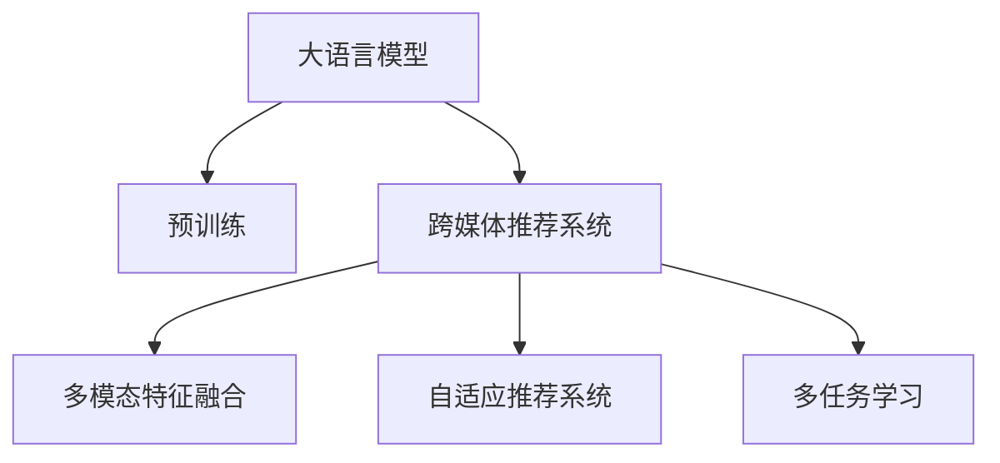

                 

# 利用LLM提升推荐系统的跨媒体推荐能力

## 1. 背景介绍

### 1.1 问题由来

随着互联网技术的飞速发展，用户获取信息的方式日趋多样化，从单一的文字媒体，逐渐扩展到图片、视频、音频等多种模态。推荐系统作为帮助用户发现感兴趣内容的重要工具，也面临着跨媒体推荐的挑战。如何理解不同模态信息，进行语义对齐和内容协同，成为了推荐系统优化的一个关键课题。

现有推荐系统主要以用户行为和物品属性为依据，在单一模态（如文本、图像、音频）下进行推荐。虽然在一些模态间存在部分内容交集，但缺乏对多模态数据的深层次理解和融合。利用大语言模型（Large Language Model, LLM）提升推荐系统的跨媒体推荐能力，能够更好地挖掘不同模态之间的联系，为用户提供更加丰富、个性化、多样化的推荐内容。

### 1.2 问题核心关键点

实现跨媒体推荐的关键在于：
1. 理解不同模态的内容表达，进行语义对齐。
2. 建立模态之间的协同关系，提升推荐效果。
3. 实现推荐内容的跨媒体展示，提高用户满意度。

基于大语言模型的推荐方法，能够利用其强大的语言理解和生成能力，实现对不同模态数据的融合与协同，从而提升推荐系统的跨媒体推荐能力。本研究聚焦于如何在大语言模型基础上构建跨媒体推荐模型，探讨其在推荐系统中的应用。

## 2. 核心概念与联系

### 2.1 核心概念概述

为更好地理解基于大语言模型的跨媒体推荐方法，本节将介绍几个密切相关的核心概念：

- 大语言模型(Large Language Model, LLM)：以自回归(如GPT)或自编码(如BERT)模型为代表的大规模预训练语言模型。通过在大规模无标签文本语料上进行预训练，学习通用的语言表示，具备强大的语言理解和生成能力。

- 预训练(Pre-training)：指在大规模无标签文本语料上，通过自监督学习任务训练通用语言模型的过程。常见的预训练任务包括言语建模、遮挡语言模型等。预训练使得模型学习到语言的通用表示。

- 跨媒体推荐系统(Multi-modal Recommendation System)：结合多种媒体数据（如文本、图像、音频等），综合考虑用户行为和物品属性，提供跨媒体推荐内容。

- 多模态特征融合(Feature Fusion)：将不同模态的数据进行语义对齐和特征融合，构建更加全面的用户画像，提升推荐系统的准确性和多样化。

- 自适应推荐系统(Adaptive Recommendation System)：根据用户历史行为、兴趣偏好等因素，动态调整推荐策略，实现个性化推荐。

- 多任务学习(Multi-task Learning)：通过在多个相关任务上训练，利用共同的知识提高模型在不同任务上的性能。

这些核心概念之间的逻辑关系可以通过以下Mermaid流程图来展示：



这个流程图展示了大语言模型在跨媒体推荐中的核心概念及其之间的关系：

1. 大语言模型通过预训练获得基础能力。
2. 跨媒体推荐系统利用大语言模型的多模态特征融合能力和自适应推荐能力，实现跨媒体推荐。
3. 多模态特征融合和自适应推荐系统是跨媒体推荐的关键技术手段。
4. 多任务学习可以进一步提升模型在不同任务上的表现，扩展推荐系统的应用范围。

## 3. 核心算法原理 & 具体操作步骤
### 3.1 算法原理概述

基于大语言模型的跨媒体推荐方法，本质上是利用语言模型强大的语义理解能力，将不同模态的数据转化为可理解、可处理的形式，进行跨模态特征融合，最终输出推荐结果。

具体而言，假设推荐系统面临的用户行为数据为 $X$，物品属性数据为 $Y$，推荐标签为 $Z$。我们希望找到一个推荐模型 $M_{\theta}$，使得：

$$
M_{\theta}(X, Y) = Z
$$

其中，$X$ 和 $Y$ 可以分别对应文本、图像、音频等多模态数据。推荐模型 $M_{\theta}$ 通过在大语言模型上进行微调，学习如何将 $X$ 和 $Y$ 数据转化为 $Z$ 标签，从而实现跨媒体推荐。

### 3.2 算法步骤详解

基于大语言模型的跨媒体推荐方法，通常包括以下几个关键步骤：

**Step 1: 准备数据集**
- 收集和预处理跨媒体推荐任务所需的用户行为数据、物品属性数据和推荐标签数据。
- 将不同模态的数据进行拼接或拼接，构建多模态特征向量。
- 划分训练集、验证集和测试集，分别用于模型训练、参数调优和性能评估。

**Step 2: 设计推荐模型**
- 选择合适的预训练语言模型，如GPT、BERT等。
- 在预训练模型的顶层设计任务适配层，用于处理不同模态的数据。
- 引入多任务学习框架，将推荐任务和其他相关任务（如情感分析、实体抽取等）共同训练。

**Step 3: 微调大语言模型**
- 加载预训练语言模型，设置合适的微调超参数。
- 通过反向传播算法，在训练集上进行微调，最小化损失函数。
- 在验证集上进行性能评估，调整模型参数和学习率。
- 在测试集上进行最终性能评估，输出推荐结果。

**Step 4: 输出推荐结果**
- 使用微调后的模型，对用户输入的数据进行推理预测，生成推荐内容。
- 根据推荐结果，构建跨媒体推荐结果的展示页面。
- 提供用户反馈机制，优化推荐模型和策略。

### 3.3 算法优缺点

基于大语言模型的跨媒体推荐方法具有以下优点：
1. 可以处理多种模态数据，提供更加多样化的推荐内容。
2. 利用大语言模型的语言理解能力，能够更好地理解不同模态数据的内容。
3. 引入多任务学习框架，可以在不同任务间共享知识，提高模型泛化能力。

同时，该方法也存在一定的局限性：
1. 对数据的要求较高，需要获取高质量的多模态数据。
2. 微调过程中可能会引入预训练模型的固有偏见，需要注意处理。
3. 推荐模型需要大量的计算资源和时间，适用于大规模数据集。

尽管存在这些局限性，但就目前而言，基于大语言模型的跨媒体推荐方法仍是大规模推荐系统的重要方向。未来相关研究的重点在于如何进一步降低数据获取成本，提高推荐效率，同时兼顾可解释性和伦理安全性等因素。

### 3.4 算法应用领域

基于大语言模型的跨媒体推荐方法，已经在多个领域得到了广泛的应用，例如：

- 智能广告推荐：将文本、图像、音频等多模态数据进行融合，推荐精准的广告内容。
- 智能视频推荐：结合用户行为和视频属性，推荐相似的视频内容。
- 个性化音乐推荐：分析用户听歌记录和歌曲属性，推荐个性化音乐。
- 跨模态商品推荐：结合用户浏览历史、商品描述和图像特征，推荐相似商品。

除了上述这些经典应用外，大语言模型在跨媒体推荐领域还将有更多创新性探索，如跨媒体检索、跨媒体编辑、跨媒体问答等，进一步拓展推荐系统的发展空间。

## 4. 数学模型和公式 & 详细讲解  
### 4.1 数学模型构建

假设用户行为数据为 $X$，物品属性数据为 $Y$，推荐标签为 $Z$。我们将 $X$ 和 $Y$ 数据转换为隐含语义表示 $H_X$ 和 $H_Y$，并引入大语言模型 $M_{\theta}$ 进行跨媒体推荐。

### 4.2 公式推导过程

我们希望找到一个推荐模型 $M_{\theta}$，使得：

$$
M_{\theta}(H_X, H_Y) = Z
$$

其中 $H_X$ 和 $H_Y$ 为不同模态数据的语义表示，$Z$ 为推荐标签。

假设 $H_X$ 和 $H_Y$ 由预训练语言模型 $M_{\theta_{enc}}$ 生成，即：

$$
H_X = M_{\theta_{enc}}(X)
$$

$$
H_Y = M_{\theta_{enc}}(Y)
$$

则推荐模型 $M_{\theta}$ 的输出可以表示为：

$$
Z = M_{\theta}(H_X, H_Y)
$$

$$
M_{\theta} = f(H_X, H_Y)
$$

其中 $f$ 为推荐模型 $M_{\theta}$ 的参数化函数，可以是线性回归、二分类器等。

### 4.3 案例分析与讲解

以下以智能视频推荐为例，展示基于大语言模型的跨媒体推荐过程：

1. **数据准备**：
   - 收集用户历史观看视频数据，包括观看时长、评分、评论等。
   - 收集视频属性数据，如视频时长、类别、标签等。
   - 将视频标签进行编码，如动作片、科幻片等。

2. **模型设计**：
   - 选择BERT作为预训练语言模型。
   - 设计多任务学习框架，将视频分类和情感分析任务同时训练。
   - 在预训练模型的顶层设计推荐模型，输出推荐标签。

3. **微调**：
   - 加载预训练BERT模型，设置学习率为 $2e-5$，微调步数为 $10$ 轮。
   - 使用反向传播算法，最小化交叉熵损失。
   - 在验证集上进行性能评估，调整学习率和批次大小。

4. **结果输出**：
   - 将用户输入的视频特征和属性特征输入微调后的模型，输出推荐标签。
   - 根据推荐标签，构建跨媒体推荐页面，展示推荐结果。

## 5. 项目实践：代码实例和详细解释说明
### 5.1 开发环境搭建

在进行跨媒体推荐实践前，我们需要准备好开发环境。以下是使用Python进行PyTorch开发的环境配置流程：

1. 安装Anaconda：从官网下载并安装Anaconda，用于创建独立的Python环境。

2. 创建并激活虚拟环境：
```bash
conda create -n pytorch-env python=3.8 
conda activate pytorch-env
```

3. 安装PyTorch：根据CUDA版本，从官网获取对应的安装命令。例如：
```bash
conda install pytorch torchvision torchaudio cudatoolkit=11.1 -c pytorch -c conda-forge
```

4. 安装Transformers库：
```bash
pip install transformers
```

5. 安装各类工具包：
```bash
pip install numpy pandas scikit-learn matplotlib tqdm jupyter notebook ipython
```

完成上述步骤后，即可在`pytorch-env`环境中开始跨媒体推荐实践。

### 5.2 源代码详细实现

这里我们以智能视频推荐为例，给出使用Transformers库对BERT模型进行微调的PyTorch代码实现。

首先，定义智能视频推荐的数据处理函数：

```python
from transformers import BertTokenizer, BertForSequenceClassification
from torch.utils.data import Dataset
import torch

class VideoDataset(Dataset):
    def __init__(self, videos, features, labels, tokenizer, max_len=128):
        self.videos = videos
        self.features = features
        self.labels = labels
        self.tokenizer = tokenizer
        self.max_len = max_len
        
    def __len__(self):
        return len(self.videos)
    
    def __getitem__(self, item):
        video = self.videos[item]
        feature = self.features[item]
        label = self.labels[item]
        
        # 将视频特征和标签拼接为统一长度的序列
        sequence = [video] + [feature] + [label]
        
        # 对序列进行token化
        encoding = self.tokenizer(sequence, return_tensors='pt', max_length=self.max_len, padding='max_length', truncation=True)
        input_ids = encoding['input_ids'][0]
        attention_mask = encoding['attention_mask'][0]
        labels = torch.tensor([label], dtype=torch.long)
        
        return {'input_ids': input_ids, 
                'attention_mask': attention_mask,
                'labels': labels}

# 标签与id的映射
label2id = {'动作片': 0, '科幻片': 1, '喜剧片': 2, '悬疑片': 3, '爱情片': 4}
id2label = {v: k for k, v in label2id.items()}

# 创建dataset
tokenizer = BertTokenizer.from_pretrained('bert-base-cased')

train_dataset = VideoDataset(train_videos, train_features, train_labels, tokenizer)
dev_dataset = VideoDataset(dev_videos, dev_features, dev_labels, tokenizer)
test_dataset = VideoDataset(test_videos, test_features, test_labels, tokenizer)
```

然后，定义模型和优化器：

```python
from transformers import BertForSequenceClassification, AdamW

model = BertForSequenceClassification.from_pretrained('bert-base-cased', num_labels=len(label2id))

optimizer = AdamW(model.parameters(), lr=2e-5)
```

接着，定义训练和评估函数：

```python
from torch.utils.data import DataLoader
from tqdm import tqdm
from sklearn.metrics import classification_report

device = torch.device('cuda') if torch.cuda.is_available() else torch.device('cpu')
model.to(device)

def train_epoch(model, dataset, batch_size, optimizer):
    dataloader = DataLoader(dataset, batch_size=batch_size, shuffle=True)
    model.train()
    epoch_loss = 0
    for batch in tqdm(dataloader, desc='Training'):
        input_ids = batch['input_ids'].to(device)
        attention_mask = batch['attention_mask'].to(device)
        labels = batch['labels'].to(device)
        model.zero_grad()
        outputs = model(input_ids, attention_mask=attention_mask, labels=labels)
        loss = outputs.loss
        epoch_loss += loss.item()
        loss.backward()
        optimizer.step()
    return epoch_loss / len(dataloader)

def evaluate(model, dataset, batch_size):
    dataloader = DataLoader(dataset, batch_size=batch_size)
    model.eval()
    preds, labels = [], []
    with torch.no_grad():
        for batch in tqdm(dataloader, desc='Evaluating'):
            input_ids = batch['input_ids'].to(device)
            attention_mask = batch['attention_mask'].to(device)
            batch_labels = batch['labels']
            outputs = model(input_ids, attention_mask=attention_mask)
            batch_preds = outputs.logits.argmax(dim=2).to('cpu').tolist()
            batch_labels = batch_labels.to('cpu').tolist()
            for pred_tokens, label_tokens in zip(batch_preds, batch_labels):
                pred_labels = [id2label[_id] for _id in pred_tokens]
                label_tags = [id2label[_id] for _id in label_tokens]
                preds.append(pred_labels[:len(label_tags)])
                labels.append(label_tags)
                
    print(classification_report(labels, preds))
```

最后，启动训练流程并在测试集上评估：

```python
epochs = 5
batch_size = 16

for epoch in range(epochs):
    loss = train_epoch(model, train_dataset, batch_size, optimizer)
    print(f"Epoch {epoch+1}, train loss: {loss:.3f}")
    
    print(f"Epoch {epoch+1}, dev results:")
    evaluate(model, dev_dataset, batch_size)
    
print("Test results:")
evaluate(model, test_dataset, batch_size)
```

以上就是使用PyTorch对BERT进行智能视频推荐任务微调的完整代码实现。可以看到，得益于Transformers库的强大封装，我们可以用相对简洁的代码完成BERT模型的加载和微调。

### 5.3 代码解读与分析

让我们再详细解读一下关键代码的实现细节：

**VideoDataset类**：
- `__init__`方法：初始化视频、特征、标签等关键组件，并设置分词器。
- `__len__`方法：返回数据集的样本数量。
- `__getitem__`方法：对单个样本进行处理，将视频特征和标签拼接为统一长度的序列，进行token化，并输出模型所需的输入。

**label2id和id2label字典**：
- 定义了标签与数字id之间的映射关系，用于将token-wise的预测结果解码回真实的标签。

**训练和评估函数**：
- 使用PyTorch的DataLoader对数据集进行批次化加载，供模型训练和推理使用。
- 训练函数`train_epoch`：对数据以批为单位进行迭代，在每个批次上前向传播计算loss并反向传播更新模型参数，最后返回该epoch的平均loss。
- 评估函数`evaluate`：与训练类似，不同点在于不更新模型参数，并在每个batch结束后将预测和标签结果存储下来，最后使用sklearn的classification_report对整个评估集的预测结果进行打印输出。

**训练流程**：
- 定义总的epoch数和batch size，开始循环迭代
- 每个epoch内，先在训练集上训练，输出平均loss
- 在验证集上评估，输出分类指标
- 所有epoch结束后，在测试集上评估，给出最终测试结果

可以看到，PyTorch配合Transformers库使得BERT微调的代码实现变得简洁高效。开发者可以将更多精力放在数据处理、模型改进等高层逻辑上，而不必过多关注底层的实现细节。

当然，工业级的系统实现还需考虑更多因素，如模型的保存和部署、超参数的自动搜索、更灵活的任务适配层等。但核心的跨媒体推荐范式基本与此类似。

## 6. 实际应用场景
### 6.1 智能广告推荐

智能广告推荐系统可以利用大语言模型提升广告推荐效果。传统广告推荐系统主要以用户历史行为和物品属性为依据，往往缺乏对广告文本的深入理解。利用大语言模型，可以将广告文本与用户行为数据进行融合，推荐更加精准、多样化的广告内容。

在技术实现上，可以收集用户的历史广告点击记录、浏览记录等数据，将广告文本和物品属性作为微调数据，训练模型学习广告-用户匹配度。微调后的模型能够自动理解广告文本的语义，进行跨媒体推荐，提升广告的转化率和用户体验。

### 6.2 智能视频推荐

智能视频推荐系统利用大语言模型提高推荐效果。传统视频推荐系统主要依赖用户历史观看记录，难以捕捉视频的语义内容。通过大语言模型，可以将视频标签和用户历史行为进行融合，推荐相似视频内容。

具体而言，可以收集用户历史观看视频数据，结合视频时长、类别、标签等属性信息，训练大语言模型学习视频-用户匹配度。微调后的模型能够自动理解视频内容的语义，进行跨媒体推荐，提高推荐的精准度和多样化。

### 6.3 个性化音乐推荐

个性化音乐推荐系统利用大语言模型提升推荐效果。传统音乐推荐系统主要依赖用户历史听歌记录，难以捕捉音乐的多维度特征。通过大语言模型，可以将歌曲文本和音乐属性进行融合，推荐个性化音乐内容。

具体而言，可以收集用户历史听歌记录，结合歌曲的歌词、曲风、歌手信息等属性，训练大语言模型学习歌曲-用户匹配度。微调后的模型能够自动理解歌曲的语义，进行跨媒体推荐，提升推荐的个性化和多样化。

### 6.4 未来应用展望

随着大语言模型和跨媒体推荐方法的发展，未来跨媒体推荐系统将在更多领域得到应用，为各行各业带来新的价值：

1. 智慧医疗领域：利用大语言模型进行医疗知识库抽取、疾病诊断等任务，提升医疗服务的智能化水平。

2. 金融理财领域：利用大语言模型进行金融市场分析、投资决策等任务，辅助用户做出合理投资。

3. 智能家居领域：利用大语言模型进行智能语音控制、智能场景推荐等任务，提升用户体验和智能化水平。

4. 智能旅游领域：利用大语言模型进行旅游目的地推荐、行程规划等任务，提升旅游体验。

5. 智能交通领域：利用大语言模型进行交通路况分析、导航路线推荐等任务，提升交通服务的智能化水平。

6. 智能教育领域：利用大语言模型进行学习资源推荐、个性化教学等任务，提升教育质量和智能化水平。

未来，跨媒体推荐系统将在更多领域得到应用，为各行各业带来新的价值，推动人工智能技术的发展和普及。

## 7. 工具和资源推荐
### 7.1 学习资源推荐

为了帮助开发者系统掌握大语言模型在跨媒体推荐中的应用，这里推荐一些优质的学习资源：

1. 《Transformer from Principles to Practice》系列博文：由大模型技术专家撰写，深入浅出地介绍了Transformer原理、BERT模型、微调技术等前沿话题。

2. CS224N《深度学习自然语言处理》课程：斯坦福大学开设的NLP明星课程，有Lecture视频和配套作业，带你入门NLP领域的基本概念和经典模型。

3. 《Natural Language Processing with Transformers》书籍：Transformers库的作者所著，全面介绍了如何使用Transformers库进行NLP任务开发，包括跨媒体推荐在内的诸多范式。

4. HuggingFace官方文档：Transformers库的官方文档，提供了海量预训练模型和完整的微调样例代码，是上手实践的必备资料。

5. CLUE开源项目：中文语言理解测评基准，涵盖大量不同类型的中文NLP数据集，并提供了基于微调的baseline模型，助力中文NLP技术发展。

通过对这些资源的学习实践，相信你一定能够快速掌握大语言模型在跨媒体推荐中的应用，并用于解决实际的NLP问题。

### 7.2 开发工具推荐

高效的开发离不开优秀的工具支持。以下是几款用于大语言模型跨媒体推荐开发的常用工具：

1. PyTorch：基于Python的开源深度学习框架，灵活动态的计算图，适合快速迭代研究。大部分预训练语言模型都有PyTorch版本的实现。

2. TensorFlow：由Google主导开发的开源深度学习框架，生产部署方便，适合大规模工程应用。同样有丰富的预训练语言模型资源。

3. Transformers库：HuggingFace开发的NLP工具库，集成了众多SOTA语言模型，支持PyTorch和TensorFlow，是进行跨媒体推荐开发的利器。

4. Weights & Biases：模型训练的实验跟踪工具，可以记录和可视化模型训练过程中的各项指标，方便对比和调优。与主流深度学习框架无缝集成。

5. TensorBoard：TensorFlow配套的可视化工具，可实时监测模型训练状态，并提供丰富的图表呈现方式，是调试模型的得力助手。

6. Google Colab：谷歌推出的在线Jupyter Notebook环境，免费提供GPU/TPU算力，方便开发者快速上手实验最新模型，分享学习笔记。

合理利用这些工具，可以显著提升跨媒体推荐任务的开发效率，加快创新迭代的步伐。

### 7.3 相关论文推荐

大语言模型在跨媒体推荐中的应用涉及多个前沿领域，以下几篇相关论文推荐阅读：

1. Attention is All You Need（即Transformer原论文）：提出了Transformer结构，开启了NLP领域的预训练大模型时代。

2. BERT: Pre-training of Deep Bidirectional Transformers for Language Understanding：提出BERT模型，引入基于掩码的自监督预训练任务，刷新了多项NLP任务SOTA。

3. Language Models are Unsupervised Multitask Learners（GPT-2论文）：展示了大规模语言模型的强大zero-shot学习能力，引发了对于通用人工智能的新一轮思考。

4. Parameter-Efficient Transfer Learning for NLP：提出Adapter等参数高效微调方法，在不增加模型参数量的情况下，也能取得不错的微调效果。

5. Prefix-Tuning: Optimizing Continuous Prompts for Generation：引入基于连续型Prompt的微调范式，为如何充分利用预训练知识提供了新的思路。

6. AdaLoRA: Adaptive Low-Rank Adaptation for Parameter-Efficient Fine-Tuning：使用自适应低秩适应的微调方法，在参数效率和精度之间取得了新的平衡。

这些论文代表了大语言模型在跨媒体推荐领域的研究方向，展示了跨媒体推荐系统的广阔前景和潜力。

## 8. 总结：未来发展趋势与挑战
### 8.1 总结

本文对基于大语言模型的跨媒体推荐方法进行了全面系统的介绍。首先阐述了大语言模型和跨媒体推荐系统的研究背景和意义，明确了跨媒体推荐在多模态数据融合、内容协同方面的独特价值。其次，从原理到实践，详细讲解了跨媒体推荐模型的数学模型和算法步骤，给出了跨媒体推荐任务开发的完整代码实例。同时，本文还广泛探讨了跨媒体推荐方法在智能广告、智能视频、个性化音乐等多个领域的应用前景，展示了跨媒体推荐技术的强大潜力。此外，本文精选了跨媒体推荐技术的各类学习资源，力求为读者提供全方位的技术指引。

通过本文的系统梳理，可以看到，基于大语言模型的跨媒体推荐方法正在成为NLP领域的重要方向，极大地拓展了预训练语言模型的应用边界，催生了更多的落地场景。受益于大规模语料的预训练，跨媒体推荐系统以更低的时间和标注成本，在跨媒体推荐场景中取得不俗的效果，推动了NLP技术的产业化进程。未来，伴随预训练语言模型和跨媒体推荐方法的持续演进，相信跨媒体推荐系统必将在更广阔的应用领域大放异彩，深刻影响人类的生产生活方式。

### 8.2 未来发展趋势

展望未来，跨媒体推荐技术将呈现以下几个发展趋势：

1. 多模态融合技术更加成熟。随着多模态数据采集和处理的自动化程度提升，跨媒体推荐系统将更好地融合不同模态的信息，提供更加丰富、个性化的推荐内容。

2. 跨媒体协同模型更加通用。未来的跨媒体推荐模型将能够更加灵活地适应不同模态的语义对齐和特征融合，在更多领域得到应用。

3. 自适应推荐系统更加智能。未来的跨媒体推荐系统将具备更强的自适应能力，能够根据用户的行为、兴趣、情感等因素，动态调整推荐策略，提升推荐效果。

4. 多任务学习更加高效。引入多任务学习框架，将在不同任务间共享知识，提升模型的泛化能力和跨媒体推荐效果。

5. 跨媒体推荐技术更加普及。伴随技术成熟度和算法优化，跨媒体推荐技术将在更多领域得到应用，如智慧医疗、金融理财、智能家居等，推动各行各业的数字化转型。

以上趋势凸显了跨媒体推荐技术的广阔前景。这些方向的探索发展，必将进一步提升跨媒体推荐系统的性能和应用范围，为各行各业带来新的价值。

### 8.3 面临的挑战

尽管跨媒体推荐技术已经取得了显著进展，但在迈向更加智能化、普适化应用的过程中，它仍面临着诸多挑战：

1. 数据获取成本较高。跨媒体推荐系统需要收集和处理多种模态的数据，数据获取和处理成本较高。如何降低数据获取成本，提高数据质量，仍是一个重要课题。

2. 模型复杂度较高。跨媒体推荐系统需要处理多种模态的数据，模型复杂度较高。如何提高模型效率，降低计算资源和时间成本，仍是一个重要课题。

3. 推荐内容多样性不足。当前跨媒体推荐系统往往对用户历史行为进行线性叠加，缺乏对不同模态数据内容的深度理解。如何提高推荐内容的多样性和个性化，仍是一个重要课题。

4. 模型泛化能力有待提升。跨媒体推荐系统在不同模态和场景下泛化性能有限，需要进一步优化模型架构和训练方法。

5. 伦理和安全问题。跨媒体推荐系统涉及多种模态数据，数据隐私和安全问题较为突出。如何保障用户数据隐私，防止恶意用途，仍是一个重要课题。

6. 技术落地困难。跨媒体推荐系统需要与多种业务系统集成，技术复杂度较高。如何实现技术落地，提供稳定、高效、安全的服务，仍是一个重要课题。

正视跨媒体推荐面临的这些挑战，积极应对并寻求突破，将是跨媒体推荐技术迈向成熟的重要步骤。相信随着学界和产业界的共同努力，这些挑战终将一一被克服，跨媒体推荐技术必将在更广泛的应用领域大放异彩。

### 8.4 研究展望

未来的跨媒体推荐研究需要在以下几个方面寻求新的突破：

1. 探索无监督和半监督跨媒体推荐方法。摆脱对大规模标注数据的依赖，利用自监督学习、主动学习等无监督和半监督范式，最大限度利用非结构化数据，实现更加灵活高效的跨媒体推荐。

2. 研究跨媒体推荐的多模态特征融合方法。开发更加高效的多模态特征融合方法，提高跨媒体推荐的准确性和多样化。

3. 引入因果推断和对比学习思想。通过引入因果推断和对比学习思想，增强跨媒体推荐模型的建立稳定因果关系的能力，学习更加普适、鲁棒的语言表征，从而提升模型泛化性和抗干扰能力。

4. 融合符号化的先验知识。将符号化的先验知识，如知识图谱、逻辑规则等，与神经网络模型进行巧妙融合，引导跨媒体推荐过程学习更准确、合理的语义表征。

5. 结合因果分析和博弈论工具。将因果分析方法引入跨媒体推荐模型，识别出模型决策的关键特征，增强推荐结果的因果性和逻辑性。借助博弈论工具刻画人机交互过程，主动探索并规避模型的脆弱点，提高系统稳定性。

6. 纳入伦理道德约束。在跨媒体推荐模型的训练目标中引入伦理导向的评估指标，过滤和惩罚有偏见、有害的输出倾向。同时加强人工干预和审核，建立模型行为的监管机制，确保输出符合人类价值观和伦理道德。

这些研究方向的探索，必将引领跨媒体推荐技术迈向更高的台阶，为构建安全、可靠、可解释、可控的智能系统铺平道路。面向未来，跨媒体推荐技术还需要与其他人工智能技术进行更深入的融合，如知识表示、因果推理、强化学习等，多路径协同发力，共同推动跨媒体推荐系统的进步。只有勇于创新、敢于突破，才能不断拓展跨媒体推荐系统的边界，让智能技术更好地造福人类社会。

## 9. 附录：常见问题与解答

**Q1：跨媒体推荐系统是否适用于所有推荐任务？**

A: 跨媒体推荐系统在大多数推荐任务上都能取得不错的效果，特别是对于数据量较小的任务。但对于一些特定领域的任务，如医药、法律等，仅仅依靠通用语料预训练的模型可能难以很好地适应。此时需要在特定领域语料上进一步预训练，再进行微调，才能获得理想效果。此外，对于一些需要时效性、个性化很强的任务，如对话、推荐等，跨媒体推荐方法也需要针对性的改进优化。

**Q2：微调过程中如何选择合适的学习率？**

A: 微调的学习率一般要比预训练时小1-2个数量级，如果使用过大的学习率，容易破坏预训练权重，导致过拟合。一般建议从1e-5开始调参，逐步减小学习率，直至收敛。也可以使用warmup策略，在开始阶段使用较小的学习率，再逐渐过渡到预设值。需要注意的是，不同的优化器(如AdamW、Adafactor等)以及不同的学习率调度策略，可能需要设置不同的学习率阈值。

**Q3：跨媒体推荐系统面临哪些资源瓶颈？**

A: 目前主流的预训练大模型动辄以亿计的参数规模，对算力、内存、存储都提出了很高的要求。GPU/TPU等高性能设备是必不可少的，但即便如此，超大批次的训练和推理也可能遇到显存不足的问题。因此需要采用一些资源优化技术，如梯度积累、混合精度训练、模型并行等，来突破硬件瓶颈。同时，模型的存储和读取也可能占用大量时间和空间，需要采用模型压缩、稀疏化存储等方法进行优化。

**Q4：如何缓解跨媒体推荐过程中的过拟合问题？**

A: 过拟合是跨媒体推荐面临的主要挑战，尤其是在标注数据不足的情况下。常见的缓解策略包括：
1. 数据增强：通过回译、近义替换等方式扩充训练集。
2. 正则化：使用L2正则、Dropout、Early Stopping等避免过拟合。
3. 对抗训练：引入对抗样本，提高模型鲁棒性。
4. 参数高效微调：只调整少量参数(如Adapter、Prefix等)，减小过拟合风险。
5. 多模型集成：训练多个推荐模型，取平均输出，抑制过拟合。

这些策略往往需要根据具体任务和数据特点进行灵活组合。只有在数据、模型、训练、推理等各环节进行全面优化，才能最大限度地发挥大语言模型在跨媒体推荐中的潜力。

**Q5：跨媒体推荐模型在落地部署时需要注意哪些问题？**

A: 将跨媒体推荐模型转化为实际应用，还需要考虑以下因素：
1. 模型裁剪：去除不必要的层和参数，减小模型尺寸，加快推理速度。
2. 量化加速：将浮点模型转为定点模型，压缩存储空间，提高计算效率。
3. 服务化封装：将模型封装为标准化服务接口，便于集成调用。
4. 弹性伸缩：根据请求流量动态调整资源配置，平衡服务质量和成本。
5. 监控告警：实时采集系统指标，设置异常告警阈值，确保服务稳定性。
6. 安全防护：采用访问鉴权、数据脱敏等措施，保障数据和模型安全。

跨媒体推荐系统需要在数据采集、模型训练、推理部署等各个环节进行全面优化，才能实现高效、稳定、安全的推荐服务。只有深入理解各环节的技术细节，才能将大语言模型在跨媒体推荐中的潜力转化为实际应用价值。

---

作者：禅与计算机程序设计艺术 / Zen and the Art of Computer Programming

