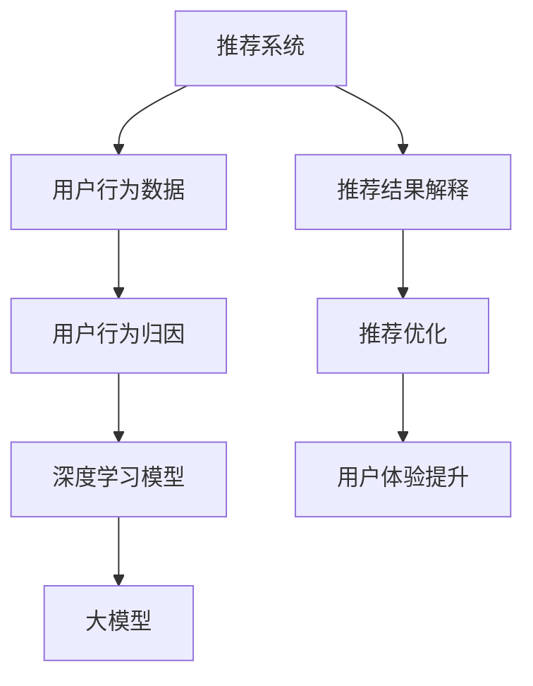

                 

## 1. 背景介绍

### 1.1 问题由来

在推荐系统（Recommender System）中，用户行为数据的分析和解释是极其重要的任务。这不仅有助于提高推荐系统的个性化水平，还可以帮助平台理解用户偏好，优化推荐算法，提升用户体验。然而，随着用户数据量的激增和数据形态的复杂化，传统的数据分析和解释手段显得力不从心。

### 1.2 问题核心关键点

推荐系统用户行为归因与解释的核心关键点包括：
- **用户行为数据**：如点击、浏览、购买等行为数据，是推荐系统分析的基础。
- **数据特征提取**：通过特征提取，将用户行为数据转化为可输入模型的向量表示。
- **模型训练与预测**：使用机器学习模型（如神经网络）对用户行为数据进行建模，并进行预测和分析。
- **结果解释与优化**：分析模型的预测结果，并根据结果进行优化和调整，提升推荐系统的准确性和用户体验。

### 1.3 问题研究意义

研究和应用基于大模型（如BERT、GPT等）的用户行为归因与解释技术，对于提升推荐系统的个性化水平和用户体验具有重要意义：
1. **提升推荐效果**：通过分析用户行为数据，大模型能够挖掘更深层次的特征和规律，从而提高推荐系统的效果。
2. **优化用户体验**：通过解释推荐结果，用户可以更好地理解推荐系统的推荐逻辑，提升对推荐结果的信任度和满意度。
3. **促进商业价值**：通过精准推荐和个性化服务，增加用户粘性，提升平台的用户转化率和商业收益。
4. **支持决策制定**：通过归因分析，平台可以了解用户行为背后的原因，为产品改进和市场策略提供依据。

## 2. 核心概念与联系

### 2.1 核心概念概述

为了更好地理解基于大模型的用户行为归因与解释方法，本节将介绍几个密切相关的核心概念：

- **推荐系统（Recommender System）**：利用用户行为数据，为用户提供个性化推荐的一类信息过滤系统。常见的推荐方法包括基于协同过滤、内容推荐、混合推荐等。
- **用户行为归因（User Behavior Attribution）**：分析用户行为数据，了解用户偏好的来源和变化规律，从而优化推荐算法。
- **推荐结果解释（Recommendation Explanation）**：对推荐系统输出的推荐结果进行解释，帮助用户理解推荐逻辑和推荐依据。
- **深度学习模型（Deep Learning Model）**：以神经网络为基础，通过大量数据训练，能够提取复杂特征和规律，适用于推荐系统的用户行为分析。
- **大模型（Large Model）**：如BERT、GPT等，通过在海量数据上预训练，具备强大的语言理解和生成能力，适用于处理自然语言相关的推荐任务。

这些核心概念之间的逻辑关系可以通过以下Mermaid流程图来展示：



这个流程图展示了大模型在推荐系统中的核心概念及其之间的关系：

1. 推荐系统通过用户行为数据，利用深度学习模型进行建模，获得推荐结果。
2. 大模型作为深度学习模型的一种，在自然语言相关任务中具有优势，常用于用户行为归因和推荐结果解释。
3. 用户行为归因分析用户行为的来源和变化规律，从而优化推荐算法。
4. 推荐结果解释对推荐结果进行解释，提升用户对推荐系统的信任度。
5. 推荐优化和用户体验提升通过用户行为归因和解释，优化推荐算法，提升用户体验。

## 3. 核心算法原理 & 具体操作步骤

### 3.1 算法原理概述

基于大模型的推荐系统用户行为归因与解释，本质上是一种深度学习驱动的用户行为分析方法。其核心思想是：将用户的自然语言行为数据输入大模型，通过预训练权重对用户行为进行语义理解和特征提取，从而分析用户行为背后的原因，并对推荐结果进行解释。

具体来说，算法流程包括以下几个步骤：
1. **特征提取**：将用户行为数据（如点击记录、评论内容等）转化为大模型可以处理的向量表示。
2. **模型训练**：利用标注数据（如用户行为与兴趣标签的对）在大模型上进行有监督训练，学习用户行为与兴趣之间的关系。
3. **行为归因**：利用训练好的模型对用户行为进行归因分析，识别出影响用户行为的关键因素。
4. **结果解释**：通过分析归因结果，对推荐系统的推荐结果进行解释，提升用户理解度。

### 3.2 算法步骤详解

以下是详细的算法步骤：

**Step 1: 数据预处理**
- 收集用户行为数据，如点击记录、浏览历史、评论内容等。
- 对数据进行清洗和标注，如去除噪声、归一化处理、标签标注等。
- 将数据转化为大模型的输入格式，如分词、编码等。

**Step 2: 特征提取**
- 利用大模型进行特征提取，将用户行为数据转化为语义向量。
- 常见的特征提取方式包括BERT、GPT等预训练模型，或自定义的文本表示方法。

**Step 3: 模型训练**
- 选择合适的大模型作为基础模型，如BERT、GPT等。
- 准备标注数据，如用户行为与兴趣标签的对，如点击记录与产品标签的对。
- 在大模型上进行有监督训练，学习用户行为与兴趣之间的关系。

**Step 4: 行为归因**
- 利用训练好的模型对用户行为进行归因分析，识别出影响用户行为的关键因素。
- 常见的归因方法包括因果推断、LIME等。
- 对归因结果进行可视化，帮助理解用户行为背后的原因。

**Step 5: 结果解释**
- 对推荐系统的推荐结果进行解释，利用归因分析的结果。
- 常见的解释方式包括模型可解释性、标注数据可视等。

### 3.3 算法优缺点

基于大模型的推荐系统用户行为归因与解释方法具有以下优点：
1. **深度学习模型的强大表现**：大模型能够提取复杂的语义特征，分析用户行为背后的深层原因。
2. **广泛的适用性**：适用于多种自然语言相关的推荐任务，如电商、新闻、社交等。
3. **自动化处理**：自动化特征提取和分析，减少了人工干预的复杂度。
4. **持续学习**：利用用户行为数据进行持续学习，不断提高模型的准确性。

但同时，该方法也存在一定的局限性：
1. **数据标注成本高**：标注数据需要大量的人力和时间，成本较高。
2. **模型复杂度高**：大模型的训练和推理需要较高的计算资源，且复杂度较高。
3. **解释性不足**：尽管大模型具有强大的分析能力，但其内部机制复杂，解释性较差。
4. **潜在偏见**：大模型可能学习到数据中的偏见和有害信息，对推荐结果产生影响。

### 3.4 算法应用领域

基于大模型的推荐系统用户行为归因与解释方法，在以下领域得到了广泛应用：

1. **电商推荐**：分析用户点击、购买记录，了解用户兴趣，优化推荐算法。
2. **内容推荐**：分析用户评论、点赞记录，了解用户对内容的偏好，优化内容推荐策略。
3. **社交推荐**：分析用户互动记录，了解用户关系和兴趣，优化社交网络推荐。
4. **广告推荐**：分析用户浏览、点击记录，了解用户行为，优化广告推荐效果。
5. **个性化推荐**：分析用户行为数据，挖掘更深层次的特征和规律，提升个性化推荐的效果。

除了以上这些经典应用外，大模型在推荐系统中的创新应用也在不断涌现，如可控推荐、隐私保护推荐等，为推荐系统带来了新的突破。

## 4. 数学模型和公式 & 详细讲解 & 举例说明

### 4.1 数学模型构建

本节将使用数学语言对基于大模型的推荐系统用户行为归因与解释过程进行更加严格的刻画。

记推荐系统为 $R$，用户行为数据为 $D=\{(x_i,y_i)\}_{i=1}^N, x_i \in \mathcal{X}, y_i \in \mathcal{Y}$，其中 $\mathcal{X}$ 为输入空间，$\mathcal{Y}$ 为输出空间。大模型为 $M_{\theta}:\mathcal{X} \rightarrow \mathcal{Y}$，其中 $\theta$ 为模型参数。

定义推荐系统 $R$ 在用户行为数据 $D$ 上的损失函数为 $\mathcal{L}(R,D) = \frac{1}{N} \sum_{i=1}^N \ell(R(x_i),y_i)$，其中 $\ell$ 为损失函数，通常使用交叉熵损失。

### 4.2 公式推导过程

以下我们以电商推荐系统为例，推导交叉熵损失函数及其梯度的计算公式。

假设推荐系统 $R$ 将用户行为 $x_i$ 映射到商品 $y_i$，损失函数定义为：

$$
\ell(R(x_i),y_i) = -[y_i\log R(x_i)+(1-y_i)\log(1-R(x_i))]
$$

将其代入经验风险公式，得：

$$
\mathcal{L}(R,D) = -\frac{1}{N}\sum_{i=1}^N [y_i\log R(x_i)+(1-y_i)\log(1-R(x_i))]
$$

根据链式法则，损失函数对模型参数 $\theta$ 的梯度为：

$$
\frac{\partial \mathcal{L}(R,D)}{\partial \theta} = -\frac{1}{N}\sum_{i=1}^N (\frac{y_i}{R(x_i)}-\frac{1-y_i}{1-R(x_i)}) \frac{\partial R(x_i)}{\partial \theta}
$$

其中 $\frac{\partial R(x_i)}{\partial \theta}$ 可进一步递归展开，利用自动微分技术完成计算。

### 4.3 案例分析与讲解

假设有一个电商推荐系统，希望通过用户行为数据，了解用户对不同商品的兴趣，并优化推荐算法。具体步骤如下：

**Step 1: 数据预处理**
- 收集用户浏览、点击、购买等行为数据，进行清洗和标注。
- 将数据转化为BERT模型的输入格式，如分词、编码等。

**Step 2: 特征提取**
- 利用BERT模型对用户行为数据进行特征提取，转化为语义向量。
- 特征向量可包括用户浏览记录、点击记录、购买记录等。

**Step 3: 模型训练**
- 选择BERT模型作为基础模型，准备标注数据，如用户行为与商品标签的对。
- 在大模型上进行有监督训练，学习用户行为与商品标签之间的关系。

**Step 4: 行为归因**
- 利用训练好的模型对用户行为进行归因分析，识别出影响用户行为的关键因素。
- 例如，通过因果推断方法，分析用户浏览记录与购买行为之间的关系。

**Step 5: 结果解释**
- 对推荐系统的推荐结果进行解释，利用归因分析的结果。
- 例如，通过可视化归因结果，解释推荐系统推荐某一商品的依据。

## 5. 项目实践：代码实例和详细解释说明

### 5.1 开发环境搭建

在进行推荐系统用户行为归因与解释的开发前，我们需要准备好开发环境。以下是使用Python进行PyTorch开发的环境配置流程：

1. 安装Anaconda：从官网下载并安装Anaconda，用于创建独立的Python环境。

2. 创建并激活虚拟环境：
```bash
conda create -n pytorch-env python=3.8 
conda activate pytorch-env
```

3. 安装PyTorch：根据CUDA版本，从官网获取对应的安装命令。例如：
```bash
conda install pytorch torchvision torchaudio cudatoolkit=11.1 -c pytorch -c conda-forge
```

4. 安装TensorFlow：
```bash
pip install tensorflow
```

5. 安装transformers库：
```bash
pip install transformers
```

6. 安装各类工具包：
```bash
pip install numpy pandas scikit-learn matplotlib tqdm jupyter notebook ipython
```

完成上述步骤后，即可在`pytorch-env`环境中开始推荐系统开发。

### 5.2 源代码详细实现

下面我们以电商推荐系统为例，给出使用Transformers库对BERT模型进行用户行为归因与解释的PyTorch代码实现。

首先，定义用户行为数据的数据处理函数：

```python
from transformers import BertTokenizer
from torch.utils.data import Dataset
import torch

class UserBehaviorDataset(Dataset):
    def __init__(self, user_browses, user_clicks, user_purchases, tokenizer, max_len=128):
        self.user_browses = user_browses
        self.user_clicks = user_clicks
        self.user_purchases = user_purchases
        self.tokenizer = tokenizer
        self.max_len = max_len
        
    def __len__(self):
        return len(self.user_browses)
    
    def __getitem__(self, item):
        user = self.user_browses[item]
        clicks = self.user_clicks[item]
        purchases = self.user_purchases[item]
        
        encoding = self.tokenizer(user, return_tensors='pt', max_length=self.max_len, padding='max_length', truncation=True)
        input_ids = encoding['input_ids'][0]
        attention_mask = encoding['attention_mask'][0]
        
        # 对token-wise的标签进行编码
        encoded_labels = [click_label2id[click_label] for click_label in clicks] + \
                         [purchase_label2id[purchase_label] for purchase_label in purchases] + \
                         [label2id['O']] * (self.max_len - len(encoded_labels))
        labels = torch.tensor(encoded_labels, dtype=torch.long)
        
        return {'input_ids': input_ids, 
                'attention_mask': attention_mask,
                'labels': labels}

# 标签与id的映射
click_label2id = {'view': 0, 'click': 1, 'add_to_cart': 2, 'purchase': 3}
purchase_label2id = {'buy': 0, 'return': 1}
label2id = {'O': 0}

# 创建dataset
tokenizer = BertTokenizer.from_pretrained('bert-base-cased')

train_dataset = UserBehaviorDataset(train_user_browses, train_user_clicks, train_user_purchases, tokenizer)
dev_dataset = UserBehaviorDataset(dev_user_browses, dev_user_clicks, dev_user_purchases, tokenizer)
test_dataset = UserBehaviorDataset(test_user_browses, test_user_clicks, test_user_purchases, tokenizer)
```

然后，定义模型和优化器：

```python
from transformers import BertForTokenClassification, AdamW

model = BertForTokenClassification.from_pretrained('bert-base-cased', num_labels=len(click_label2id)+len(purchase_label2id))

optimizer = AdamW(model.parameters(), lr=2e-5)
```

接着，定义训练和评估函数：

```python
from torch.utils.data import DataLoader
from tqdm import tqdm
from sklearn.metrics import classification_report

device = torch.device('cuda') if torch.cuda.is_available() else torch.device('cpu')
model.to(device)

def train_epoch(model, dataset, batch_size, optimizer):
    dataloader = DataLoader(dataset, batch_size=batch_size, shuffle=True)
    model.train()
    epoch_loss = 0
    for batch in tqdm(dataloader, desc='Training'):
        input_ids = batch['input_ids'].to(device)
        attention_mask = batch['attention_mask'].to(device)
        labels = batch['labels'].to(device)
        model.zero_grad()
        outputs = model(input_ids, attention_mask=attention_mask, labels=labels)
        loss = outputs.loss
        epoch_loss += loss.item()
        loss.backward()
        optimizer.step()
    return epoch_loss / len(dataloader)

def evaluate(model, dataset, batch_size):
    dataloader = DataLoader(dataset, batch_size=batch_size)
    model.eval()
    preds, labels = [], []
    with torch.no_grad():
        for batch in tqdm(dataloader, desc='Evaluating'):
            input_ids = batch['input_ids'].to(device)
            attention_mask = batch['attention_mask'].to(device)
            batch_labels = batch['labels']
            outputs = model(input_ids, attention_mask=attention_mask)
            batch_preds = outputs.logits.argmax(dim=2).to('cpu').tolist()
            batch_labels = batch_labels.to('cpu').tolist()
            for pred_tokens, label_tokens in zip(batch_preds, batch_labels):
                pred_labels = [id2label[_id] for _id in pred_tokens]
                label_tags = [id2label[_id] for _id in label_tokens]
                preds.append(pred_labels[:len(label_tags)])
                labels.append(label_tags)
                
    print(classification_report(labels, preds))
```

最后，启动训练流程并在测试集上评估：

```python
epochs = 5
batch_size = 16

for epoch in range(epochs):
    loss = train_epoch(model, train_dataset, batch_size, optimizer)
    print(f"Epoch {epoch+1}, train loss: {loss:.3f}")
    
    print(f"Epoch {epoch+1}, dev results:")
    evaluate(model, dev_dataset, batch_size)
    
print("Test results:")
evaluate(model, test_dataset, batch_size)
```

以上就是使用PyTorch对BERT进行电商推荐系统用户行为归因与解释的完整代码实现。可以看到，得益于Transformers库的强大封装，我们可以用相对简洁的代码完成BERT模型的加载和微调。

### 5.3 代码解读与分析

让我们再详细解读一下关键代码的实现细节：

**UserBehaviorDataset类**：
- `__init__`方法：初始化用户浏览记录、点击记录、购买记录等关键组件。
- `__len__`方法：返回数据集的样本数量。
- `__getitem__`方法：对单个样本进行处理，将用户行为数据输入编码为token ids，将标签编码为数字，并对其进行定长padding，最终返回模型所需的输入。

**标签与id的映射**：
- 定义了点击行为、购买行为与数字id之间的映射关系，用于将token-wise的预测结果解码回真实的标签。

**训练和评估函数**：
- 使用PyTorch的DataLoader对数据集进行批次化加载，供模型训练和推理使用。
- 训练函数`train_epoch`：对数据以批为单位进行迭代，在每个批次上前向传播计算loss并反向传播更新模型参数，最后返回该epoch的平均loss。
- 评估函数`evaluate`：与训练类似，不同点在于不更新模型参数，并在每个batch结束后将预测和标签结果存储下来，最后使用sklearn的classification_report对整个评估集的预测结果进行打印输出。

**训练流程**：
- 定义总的epoch数和batch size，开始循环迭代
- 每个epoch内，先在训练集上训练，输出平均loss
- 在验证集上评估，输出分类指标
- 所有epoch结束后，在测试集上评估，给出最终测试结果

可以看到，PyTorch配合Transformers库使得BERT微调的代码实现变得简洁高效。开发者可以将更多精力放在数据处理、模型改进等高层逻辑上，而不必过多关注底层的实现细节。

当然，工业级的系统实现还需考虑更多因素，如模型的保存和部署、超参数的自动搜索、更灵活的任务适配层等。但核心的微调范式基本与此类似。

## 6. 实际应用场景

### 6.1 智能客服系统

基于大模型进行推荐系统的用户行为归因与解释，可以应用于智能客服系统的构建。传统的客服往往需要配备大量人力，高峰期响应缓慢，且一致性和专业性难以保证。通过分析用户的行为数据，可以提升智能客服系统的智能水平，实现7x24小时不间断服务，快速响应客户咨询，提供自然流畅的客户服务。

在技术实现上，可以收集企业内部的历史客服对话记录，将问题和最佳答复构建成监督数据，在此基础上对预训练对话模型进行微调。微调后的对话模型能够自动理解用户意图，匹配最合适的答案模板进行回复。对于客户提出的新问题，还可以接入检索系统实时搜索相关内容，动态组织生成回答。如此构建的智能客服系统，能大幅提升客户咨询体验和问题解决效率。

### 6.2 金融舆情监测

金融机构需要实时监测市场舆论动向，以便及时应对负面信息传播，规避金融风险。通过分析用户的行为数据，可以了解用户对金融产品的偏好和态度，从而优化产品推荐和市场营销策略。例如，可以通过分析用户的交易记录、评论记录等行为数据，了解用户对不同金融产品的兴趣和反应，及时调整产品推荐策略，提升用户满意度和市场收益。

### 6.3 个性化推荐系统

当前的推荐系统往往只依赖用户的历史行为数据进行物品推荐，无法深入理解用户的真实兴趣偏好。通过分析用户的行为数据，可以挖掘更深层次的特征和规律，从而提升推荐系统的个性化水平。例如，可以分析用户浏览、点击、评论、分享等行为数据，提取和用户交互的物品标题、描述、标签等文本内容。利用大模型进行特征提取和行为归因，可以更准确地把握用户的兴趣点。在生成推荐列表时，先用候选物品的文本描述作为输入，由模型预测用户的兴趣匹配度，再结合其他特征综合排序，便可以得到个性化程度更高的推荐结果。

### 6.4 未来应用展望

随着大模型和微调方法的不断发展，基于大模型进行推荐系统用户行为归因与解释的方法将在更多领域得到应用，为传统行业带来变革性影响。

在智慧医疗领域，基于用户行为数据进行分析，可以提升个性化医疗推荐系统的效果，帮助医生推荐适合的治疗方案和药物，提升治疗效果和患者满意度。

在智能教育领域，通过分析学生的行为数据，可以优化个性化教育推荐系统，为学生推荐适合的学习资源和课程，提高学习效率和效果。

在智慧城市治理中，通过分析市民的行为数据，可以优化智慧城市推荐系统，提升市民对城市服务的满意度和参与度，构建更安全、高效的未来城市。

此外，在企业生产、社会治理、文娱传媒等众多领域，基于大模型进行推荐系统用户行为归因与解释的应用也将不断涌现，为各行各业带来新的技术创新和业务价值。相信随着技术的日益成熟，推荐系统用户行为归因与解释方法必将在构建人机协同的智能时代中扮演越来越重要的角色。

## 7. 工具和资源推荐

### 7.1 学习资源推荐

为了帮助开发者系统掌握大模型进行推荐系统用户行为归因与解释的理论基础和实践技巧，这里推荐一些优质的学习资源：

1. 《深度学习推荐系统》书籍：全面介绍推荐系统原理、模型构建、评估指标等内容，适合初学者入门。
2. 《自然语言处理与深度学习》课程：斯坦福大学开设的NLP明星课程，系统讲解自然语言处理和深度学习，涵盖推荐系统相关内容。
3. 《推荐系统实战》书籍：介绍推荐系统开发实战技巧，结合案例讲解推荐系统优化方法和应用场景。
4. 《自然语言处理入门》博客：详细讲解自然语言处理的基本概念和常用技术，包括推荐系统相关内容。
5. Kaggle竞赛平台：通过参与推荐系统相关的数据竞赛，实践推荐系统开发，提升实战能力。

通过对这些资源的学习实践，相信你一定能够快速掌握大模型进行推荐系统用户行为归因与解释的精髓，并用于解决实际的推荐问题。

### 7.2 开发工具推荐

高效的开发离不开优秀的工具支持。以下是几款用于大模型进行推荐系统用户行为归因与解释开发的常用工具：

1. PyTorch：基于Python的开源深度学习框架，灵活动态的计算图，适合快速迭代研究。大部分预训练语言模型都有PyTorch版本的实现。
2. TensorFlow：由Google主导开发的开源深度学习框架，生产部署方便，适合大规模工程应用。同样有丰富的预训练语言模型资源。
3. Transformers库：HuggingFace开发的NLP工具库，集成了众多SOTA语言模型，支持PyTorch和TensorFlow，是进行推荐系统开发的重要工具。
4. Weights & Biases：模型训练的实验跟踪工具，可以记录和可视化模型训练过程中的各项指标，方便对比和调优。与主流深度学习框架无缝集成。
5. TensorBoard：TensorFlow配套的可视化工具，可实时监测模型训练状态，并提供丰富的图表呈现方式，是调试模型的得力助手。
6. Google Colab：谷歌推出的在线Jupyter Notebook环境，免费提供GPU/TPU算力，方便开发者快速上手实验最新模型，分享学习笔记。

合理利用这些工具，可以显著提升大模型进行推荐系统用户行为归因与解释任务的开发效率，加快创新迭代的步伐。

### 7.3 相关论文推荐

大模型进行推荐系统用户行为归因与解释的研究源于学界的持续研究。以下是几篇奠基性的相关论文，推荐阅读：

1. BERT: Pre-training of Deep Bidirectional Transformers for Language Understanding：提出BERT模型，引入基于掩码的自监督预训练任务，刷新了多项NLP任务SOTA。
2. Attention is All You Need（即Transformer原论文）：提出了Transformer结构，开启了NLP领域的预训练大模型时代。
3. Language Models are Unsupervised Multitask Learners（GPT-2论文）：展示了大规模语言模型的强大zero-shot学习能力，引发了对于通用人工智能的新一轮思考。
4. Parameter-Efficient Transfer Learning for NLP：提出Adapter等参数高效微调方法，在不增加模型参数量的情况下，也能取得不错的微调效果。
5. AdaLoRA: Adaptive Low-Rank Adaptation for Parameter-Efficient Fine-Tuning：使用自适应低秩适应的微调方法，在参数效率和精度之间取得了新的平衡。
6. Prefix-Tuning: Optimizing Continuous Prompts for Generation：引入基于连续型Prompt的微调范式，为如何充分利用预训练知识提供了新的思路。

这些论文代表了大模型进行推荐系统用户行为归因与解释的发展脉络。通过学习这些前沿成果，可以帮助研究者把握学科前进方向，激发更多的创新灵感。

## 8. 总结：未来发展趋势与挑战

### 8.1 总结

本文对基于大模型进行推荐系统用户行为归因与解释方法进行了全面系统的介绍。首先阐述了推荐系统的背景和用户行为归因与解释的核心关键点，明确了微调在拓展预训练模型应用、提升推荐系统效果方面的独特价值。其次，从原理到实践，详细讲解了基于大模型的推荐系统用户行为归因与解释的数学原理和关键步骤，给出了推荐系统开发的完整代码实例。同时，本文还广泛探讨了推荐系统在智能客服、金融舆情、个性化推荐等多个领域的应用前景，展示了推荐系统技术的巨大潜力。此外，本文精选了推荐系统技术的各类学习资源，力求为读者提供全方位的技术指引。

通过本文的系统梳理，可以看到，基于大模型的推荐系统用户行为归因与解释方法正在成为推荐系统的重要范式，极大地拓展了推荐系统的应用边界，催生了更多的落地场景。受益于大规模语料的预训练，推荐系统用户行为归因与解释方法在大模型驱动下取得了显著的效果，为推荐系统的发展注入了新的活力。未来，伴随大模型和微调方法的持续演进，推荐系统用户行为归因与解释方法必将进一步提升推荐系统的个性化水平和用户体验，为各行各业带来深远的影响。

### 8.2 未来发展趋势

展望未来，基于大模型的推荐系统用户行为归因与解释技术将呈现以下几个发展趋势：

1. **模型规模持续增大**：随着算力成本的下降和数据规模的扩张，预训练语言模型的参数量还将持续增长。超大规模语言模型蕴含的丰富语言知识，有望支撑更加复杂多变的推荐任务。
2. **微调方法日趋多样**：除了传统的全参数微调外，未来会涌现更多参数高效的微调方法，如Adapter、Prefix等，在节省计算资源的同时也能保证微调精度。
3. **持续学习成为常态**：随着数据分布的不断变化，推荐系统也需要持续学习新知识以保持性能。如何在不遗忘原有知识的同时，高效吸收新样本信息，将成为重要的研究课题。
4. **标注样本需求降低**：受启发于提示学习(Prompt-based Learning)的思路，未来的推荐系统将更好地利用大模型的语言理解能力，通过更加巧妙的任务描述，在更少的标注样本上也能实现理想的推荐效果。
5. **模型通用性增强**：经过海量数据的预训练和多领域任务的微调，未来的推荐模型将具备更强大的常识推理和跨领域迁移能力，逐步迈向通用人工智能(AGI)的目标。

以上趋势凸显了基于大模型的推荐系统用户行为归因与解释技术的广阔前景。这些方向的探索发展，必将进一步提升推荐系统的性能和应用范围，为人类认知智能的进化带来深远影响。

### 8.3 面临的挑战

尽管基于大模型的推荐系统用户行为归因与解释技术已经取得了瞩目成就，但在迈向更加智能化、普适化应用的过程中，它仍面临着诸多挑战：

1. **标注成本瓶颈**：标注数据需要大量的人力和时间，成本较高。如何进一步降低推荐系统对标注样本的依赖，将是一大难题。
2. **模型鲁棒性不足**：推荐系统面临域外数据时，泛化性能往往大打折扣。对于测试样本的微小扰动，推荐系统的预测也容易发生波动。如何提高推荐系统的鲁棒性，避免灾难性遗忘，还需要更多理论和实践的积累。
3. **推理效率有待提高**：大规模语言模型虽然精度高，但在实际部署时往往面临推理速度慢、内存占用大等效率问题。如何在保证性能的同时，简化模型结构，提升推理速度，优化资源占用，将是重要的优化方向。
4. **可解释性亟需加强**：尽管大模型具有强大的分析能力，但其内部机制复杂，解释性较差。对于金融、医疗等高风险应用，算法的可解释性和可审计性尤为重要。如何赋予推荐系统更强的可解释性，将是亟待攻克的难题。
5. **安全性有待保障**：推荐系统可能学习到数据中的偏见和有害信息，对推荐结果产生影响。如何从数据和算法层面消除推荐系统的偏见，避免恶意用途，确保输出的安全性，也将是重要的研究课题。
6. **知识整合能力不足**：现有的推荐系统往往局限于数据内部的特征挖掘，难以灵活吸收和运用更广泛的先验知识。如何让推荐系统更好地与外部知识库、规则库等专家知识结合，形成更加全面、准确的信息整合能力，还有很大的想象空间。

正视推荐系统面临的这些挑战，积极应对并寻求突破，将是大模型进行推荐系统用户行为归因与解释技术走向成熟的必由之路。相信随着学界和产业界的共同努力，这些挑战终将一一被克服，大模型进行推荐系统用户行为归因与解释必将在构建人机协同的智能时代中扮演越来越重要的角色。

### 8.4 研究展望

面对大模型进行推荐系统用户行为归因与解释所面临的种种挑战，未来的研究需要在以下几个方面寻求新的突破：

1. **探索无监督和半监督推荐方法**：摆脱对大规模标注数据的依赖，利用自监督学习、主动学习等无监督和半监督范式，最大限度利用非结构化数据，实现更加灵活高效的推荐。
2. **研究参数高效和计算高效的推荐范式**：开发更加参数高效的推荐方法，在固定大部分预训练参数的同时，只更新极少量的任务相关参数。同时优化推荐系统的计算图，减少前向传播和反向传播的资源消耗，实现更加轻量级、实时性的部署。
3. **融合因果和对比学习范式**：通过引入因果推断和对比学习思想，增强推荐系统建立稳定因果关系的能力，学习更加普适、鲁棒的用户行为表征，从而提升推荐系统的泛化性和抗干扰能力。
4. **引入更多先验知识**：将符号化的先验知识，如知识图谱、逻辑规则等，与神经网络模型进行巧妙融合，引导推荐系统的推荐过程学习更准确、合理的用户行为特征。同时加强不同模态数据的整合，实现视觉、语音等多模态信息与文本信息的协同建模。
5. **结合因果分析和博弈论工具**：将因果分析方法引入推荐系统，识别出推荐系统决策的关键特征，增强推荐结果的因果性和逻辑性。借助博弈论工具刻画人机交互过程，主动探索并规避推荐系统的脆弱点，提高系统稳定性。
6. **纳入伦理道德约束**：在推荐系统训练目标中引入伦理导向的评估指标，过滤和惩罚有偏见、有害的输出倾向。同时加强人工干预和审核，建立推荐系统的监管机制，确保输出的符合人类价值观和伦理道德。

这些研究方向的探索，必将引领大模型进行推荐系统用户行为归因与解释技术迈向更高的台阶，为构建安全、可靠、可解释、可控的推荐系统铺平道路。面向未来，大模型进行推荐系统用户行为归因与解释技术还需要与其他人工智能技术进行更深入的融合，如知识表示、因果推理、强化学习等，多路径协同发力，共同推动推荐系统的发展。只有勇于创新、敢于突破，才能不断拓展推荐系统的边界，让智能技术更好地造福人类社会。

## 9. 附录：常见问题与解答

**Q1：基于大模型进行推荐系统用户行为归因与解释是否适用于所有推荐任务？**

A: 基于大模型进行推荐系统用户行为归因与解释方法在大多数推荐任务上都能取得不错的效果，特别是对于数据量较小的任务。但对于一些特定领域的任务，如医学、法律等，仅仅依靠通用语料预训练的模型可能难以很好地适应。此时需要在特定领域语料上进一步预训练，再进行微调，才能获得理想效果。此外，对于一些需要时效性、个性化很强的任务，如对话、推荐等，推荐方法也需要针对性的改进优化。

**Q2：推荐系统用户行为归因与解释的核心关键点是什么？**

A: 推荐系统用户行为归因与解释的核心关键点包括：
- **用户行为数据**：如点击、浏览、购买等行为数据，是推荐系统分析的基础。
- **数据特征提取**：通过特征提取，将用户行为数据转化为可输入模型的向量表示。
- **模型训练与预测**：使用机器学习模型（如神经网络）对用户行为数据进行建模，并进行预测和分析。
- **结果解释与优化**：分析模型的预测结果，并根据结果进行优化和调整，提升推荐系统的准确性和用户体验。

**Q3：大模型进行推荐系统用户行为归因与解释的优点和缺点分别是什么？**

A: 基于大模型的推荐系统用户行为归因与解释方法具有以下优点：
1. **深度学习模型的强大表现**：大模型能够提取复杂的语义特征，分析用户行为背后的深层原因。
2. **广泛的适用性**：适用于多种自然语言相关的推荐任务，如电商、新闻、社交等。
3. **自动化处理**：自动化特征提取和分析，减少了人工干预的复杂度。
4. **持续学习**：利用用户行为数据进行持续学习，不断提高模型的准确性。

但同时，该方法也存在一定的局限性：
1. **数据标注成本高**：标注数据需要大量的人力和时间，成本较高。
2. **模型鲁棒性不足**：推荐系统面临域外数据时，泛化性能往往大打折扣。
3. **推理效率有待提高**：大规模语言模型虽然精度高，但在实际部署时往往面临推理速度慢、内存占用大等效率问题。
4. **可解释性亟需加强**：尽管大模型具有强大的分析能力，但其内部机制复杂，解释性较差。
5. **安全性有待保障**：推荐系统可能学习到数据中的偏见和有害信息，对推荐结果产生影响。
6. **知识整合能力不足**：现有的推荐系统往往局限于数据内部的特征挖掘，难以灵活吸收和运用更广泛的先验知识。

**Q4：如何缓解推荐系统用户行为归因与解释中的过拟合问题？**

A: 过拟合是推荐系统用户行为归因与解释面临的主要挑战，尤其是在标注数据不足的情况下。常见的缓解策略包括：
1. **数据增强**：通过回译、近义替换等方式扩充训练集
2. **正则化**：使用L2正则、Dropout、Early Stopping等避免过拟合
3. **对抗训练**：引入对抗样本，提高推荐系统的鲁棒性
4. **参数高效微调**：只调整少量参数(如Adapter、Prefix等)，减小过拟合风险
5. **多模型集成**：训练多个推荐系统，取平均输出，抑制过拟合

这些策略往往需要根据具体任务和数据特点进行灵活组合。只有在数据、模型、训练、推理等各环节进行全面优化，才能最大限度地发挥大模型进行推荐系统用户行为归因与解释的优势。

**Q5：推荐系统用户行为归因与解释在实际应用中需要注意哪些问题？**

A: 将推荐系统用户行为归因与解释应用于实际推荐场景，还需要考虑以下因素：
1. **模型裁剪**：去除不必要的层和参数，减小模型尺寸，加快推理速度
2. **量化加速**：将浮点模型转为定点模型，压缩存储空间，提高计算效率
3. **服务化封装**：将模型封装为标准化服务接口，便于集成调用
4. **弹性伸缩**：根据请求流量动态调整资源配置，平衡服务质量和成本
5. **监控告警**：实时采集系统指标，设置异常告警阈值，确保服务稳定性
6. **安全防护**：采用访问鉴权、数据脱敏等措施，保障数据和模型安全

大模型进行推荐系统用户行为归因与解释为推荐系统提供了强大的分析能力和解释能力，但如何将强大的性能转化为稳定、高效、安全的业务价值，还需要工程实践的不断打磨。唯有从数据、算法、工程、业务等多个维度协同发力，才能真正实现人工智能技术在推荐系统中的落地应用。总之，推荐系统用户行为归因与解释需要开发者根据具体任务，不断迭代和优化模型、数据和算法，方能得到理想的效果。

---

作者：禅与计算机程序设计艺术 / Zen and the Art of Computer Programming

