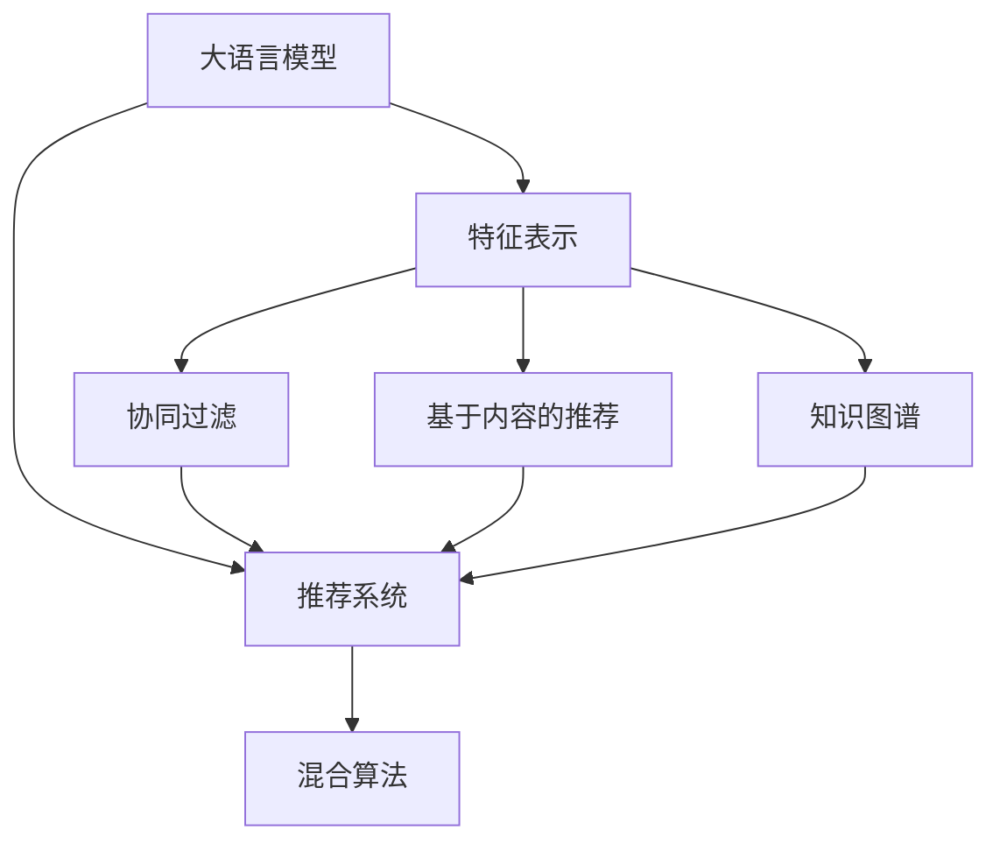

                 

# 利用大模型进行跨领域推荐的思路与方法

> 关键词：大语言模型, 跨领域推荐, 深度学习, 特征表示, 协同过滤, 多模态数据, 知识图谱, 预训练模型, 混合算法

## 1. 背景介绍

### 1.1 问题由来

随着互联网技术的发展，电子商务、社交网络等平台的用户数量和交易量不断增长。推荐系统作为提升用户满意度和交易转化率的关键手段，受到了广泛关注。传统的推荐算法如协同过滤、基于内容的推荐等，已经难以满足大规模复杂场景下的推荐需求。大语言模型作为一种新兴的推荐工具，以其强大的特征表示能力和泛化能力，逐步成为推荐系统的重要组成部分。

然而，大语言模型推荐面临一些挑战：
1. **数据质量和规模**：语言模型的训练需要大量的文本数据，推荐系统则需要交易行为数据，两者的数据来源和质量差异较大。
2. **特征表示**：传统的推荐算法主要依赖用户行为特征，而大语言模型则侧重于文本特征，两者在特征维度、分布和形式上都存在差异。
3. **模型选择**：不同的推荐任务需要不同的模型架构和参数设置，如何在预训练和微调之间平衡，需要谨慎设计。
4. **模型融合**：单一模型可能无法兼顾多模态数据的融合，需要探索多种算法结合的策略。

针对这些问题，本文将介绍利用大语言模型进行跨领域推荐的思路与方法，探讨如何构建高效、准确、可靠的推荐系统。

## 2. 核心概念与联系

### 2.1 核心概念概述

为了更好地理解大语言模型在推荐系统中的应用，本节将介绍几个关键概念：

- **大语言模型**：以Transformer模型为代表的大规模预训练语言模型，通过在大规模文本语料上进行自监督学习，学习到通用的语言表示，具备强大的文本处理和生成能力。
- **推荐系统**：基于用户行为和物品属性的匹配度，为用户提供个性化推荐服务的系统。推荐系统分为基于协同过滤、基于内容的推荐等传统方法，以及融合了大模型的新兴方法。
- **特征表示**：推荐系统中用于刻画用户、物品、行为等特征的向量表示。优秀的特征表示能够提高推荐系统的准确性和多样性。
- **协同过滤**：利用用户之间的相似性进行推荐，包括基于用户的协同过滤和基于物品的协同过滤。
- **知识图谱**：利用图结构表示实体之间的关系，结合语义信息进行推荐。
- **混合算法**：将多种推荐算法进行组合，综合利用不同算法的优势，提升推荐效果。

这些概念之间的逻辑关系可以通过以下Mermaid流程图来展示：



这个流程图展示了各概念之间的联系：

1. 大语言模型通过预训练学习到通用的语言表示。
2. 特征表示用于刻画用户、物品等特征，与大模型输出进行结合。
3. 协同过滤、基于内容的推荐和知识图谱等算法用于推荐。
4. 推荐系统综合多种算法，提供个性化推荐服务。

## 3. 核心算法原理 & 具体操作步骤

### 3.1 算法原理概述

大语言模型在推荐系统中的应用，主要基于其强大的特征表示能力和泛化能力。其核心思想是：通过预训练学习到通用的语言表示，再将用户行为和物品属性的文本表示进行融合，使用混合算法进行推荐。

具体而言，推荐系统的工作流程如下：

1. **数据准备**：收集用户行为数据、物品属性数据和用户描述数据。
2. **文本表示**：将用户行为和物品属性转换为文本表示。
3. **特征提取**：使用大语言模型将文本表示转换为高维特征向量。
4. **推荐模型**：将高维特征向量输入推荐算法，进行预测推荐。

### 3.2 算法步骤详解

大语言模型在推荐系统中的应用可以分为以下几个关键步骤：

**Step 1: 数据准备**

1. **用户数据**：收集用户的基本信息、历史行为数据、评分数据等。
2. **物品数据**：收集物品的描述、属性、类别等。
3. **用户描述数据**：收集用户的自我介绍、兴趣爱好、社交网络信息等。

**Step 2: 文本表示**

1. **行为序列表示**：将用户的浏览、点击、购买等行为序列转换为文本表示。例如，将行为序列中的每个动作转换为一个词或短语，并拼接成序列。
2. **物品属性表示**：将物品的属性、类别等特征转换为文本表示。例如，将物品的关键词组合成句子。
3. **用户描述表示**：将用户的自我介绍、兴趣爱好等转换为文本表示。例如，将用户的自我介绍分词，拼接成句子。

**Step 3: 特征提取**

1. **预训练模型**：使用预训练好的语言模型（如BERT、GPT等）作为特征提取器。
2. **文本编码**：将行为序列、物品属性和用户描述的文本表示输入预训练模型，获得高维特征向量。
3. **融合特征**：将行为序列、物品属性和用户描述的特征向量进行融合，生成最终的推荐特征向量。

**Step 4: 推荐模型**

1. **选择推荐算法**：根据推荐任务选择合适的推荐算法，如协同过滤、基于内容的推荐、知识图谱等。
2. **模型训练**：使用融合后的特征向量训练推荐模型。
3. **预测推荐**：将新用户和物品的特征向量输入推荐模型，得到推荐结果。

### 3.3 算法优缺点

利用大语言模型进行跨领域推荐，具有以下优点：

1. **强大的特征表示能力**：大语言模型通过预训练学习到丰富的语言表示，能够捕捉用户和物品的深层次语义信息。
2. **泛化能力强**：大语言模型具备较强的泛化能力，能够处理不同领域的推荐任务。
3. **自适应性强**：大语言模型能够动态更新特征表示，适应推荐任务的动态变化。
4. **提升推荐效果**：大语言模型结合多种推荐算法，能够提高推荐系统的准确性和多样性。

同时，大语言模型推荐也存在一些缺点：

1. **数据需求高**：大语言模型需要大量的文本数据进行预训练，推荐系统则需要行为数据和属性数据，数据来源和质量差异较大。
2. **计算复杂度高**：预训练和特征提取需要大量的计算资源，影响推荐系统的实时性。
3. **模型复杂度高**：大语言模型和推荐算法的融合增加了模型的复杂性，增加了模型的训练和推理难度。
4. **解释性差**：大语言模型的特征表示过程复杂，难以解释其内部机制和决策逻辑。

### 3.4 算法应用领域

大语言模型在推荐系统中的应用领域广泛，包括但不限于以下几个方面：

- **电子商务推荐**：利用用户浏览、购买行为，推荐商品和优惠活动。
- **社交网络推荐**：推荐用户感兴趣的内容、好友、群组等。
- **媒体推荐**：推荐新闻、视频、音频等媒体内容。
- **旅游推荐**：推荐旅游目的地、行程、酒店等。
- **金融推荐**：推荐理财产品、股票、基金等。

## 4. 数学模型和公式 & 详细讲解 & 举例说明

### 4.1 数学模型构建

在利用大语言模型进行推荐时，可以构建一个多模态特征表示的推荐模型。其数学模型如下：

设 $X$ 为用户的特征向量，$Y$ 为物品的特征向量，$W$ 为用户-物品的关联矩阵，$Z$ 为用户-物品的关联矩阵的嵌入向量。推荐模型可以表示为：

$$
f(X, Y) = \sigma(WX + BY)
$$

其中，$f$ 为推荐函数，$\sigma$ 为激活函数，$W$ 和 $B$ 为模型的权重矩阵。

### 4.2 公式推导过程

利用大语言模型进行推荐，需要经过以下几个步骤：

1. **行为序列表示**：将用户的浏览、点击、购买等行为序列转换为文本表示 $X$。例如，将行为序列中的每个动作转换为一个词或短语，并拼接成序列。
2. **物品属性表示**：将物品的属性、类别等特征转换为文本表示 $Y$。例如，将物品的关键词组合成句子。
3. **用户描述表示**：将用户的自我介绍、兴趣爱好等转换为文本表示 $Z$。例如，将用户的自我介绍分词，拼接成句子。
4. **特征提取**：使用预训练好的语言模型（如BERT、GPT等）作为特征提取器，将 $X$、$Y$、$Z$ 转换为高维特征向量 $W$、$B$。
5. **推荐模型**：将高维特征向量 $W$、$B$ 输入推荐算法，进行预测推荐。

### 4.3 案例分析与讲解

以电商平台推荐为例，利用大语言模型进行推荐的步骤如下：

1. **数据准备**：收集用户的购买行为、评分数据、物品的描述、属性、类别等。
2. **文本表示**：将用户的购买行为序列、物品的属性特征转换为文本表示。
3. **特征提取**：使用预训练好的BERT模型作为特征提取器，将行为序列、物品属性和用户描述的文本表示转换为高维特征向量。
4. **融合特征**：将行为序列、物品属性和用户描述的特征向量进行融合，生成最终的推荐特征向量。
5. **推荐模型**：使用融合后的特征向量训练协同过滤算法，进行推荐预测。

## 5. 项目实践：代码实例和详细解释说明

### 5.1 开发环境搭建

在进行推荐系统开发前，我们需要准备好开发环境。以下是使用Python进行PyTorch开发的环境配置流程：

1. 安装Anaconda：从官网下载并安装Anaconda，用于创建独立的Python环境。

2. 创建并激活虚拟环境：
```bash
conda create -n pytorch-env python=3.8 
conda activate pytorch-env
```

3. 安装PyTorch：根据CUDA版本，从官网获取对应的安装命令。例如：
```bash
conda install pytorch torchvision torchaudio cudatoolkit=11.1 -c pytorch -c conda-forge
```

4. 安装Transformers库：
```bash
pip install transformers
```

5. 安装各类工具包：
```bash
pip install numpy pandas scikit-learn matplotlib tqdm jupyter notebook ipython
```

完成上述步骤后，即可在`pytorch-env`环境中开始推荐系统开发。

### 5.2 源代码详细实现

下面我们以电商平台推荐为例，给出使用Transformers库对BERT模型进行推荐开发的PyTorch代码实现。

首先，定义推荐数据处理函数：

```python
from transformers import BertTokenizer
from torch.utils.data import Dataset
import torch

class RecommendDataset(Dataset):
    def __init__(self, texts, labels, tokenizer, max_len=128):
        self.texts = texts
        self.labels = labels
        self.tokenizer = tokenizer
        self.max_len = max_len
        
    def __len__(self):
        return len(self.texts)
    
    def __getitem__(self, item):
        text = self.texts[item]
        label = self.labels[item]
        
        encoding = self.tokenizer(text, return_tensors='pt', max_length=self.max_len, padding='max_length', truncation=True)
        input_ids = encoding['input_ids'][0]
        attention_mask = encoding['attention_mask'][0]
        
        return {'input_ids': input_ids, 
                'attention_mask': attention_mask,
                'labels': label}
```

然后，定义模型和优化器：

```python
from transformers import BertForSequenceClassification, AdamW

model = BertForSequenceClassification.from_pretrained('bert-base-cased', num_labels=2)

optimizer = AdamW(model.parameters(), lr=2e-5)
```

接着，定义训练和评估函数：

```python
from torch.utils.data import DataLoader
from tqdm import tqdm
from sklearn.metrics import classification_report

device = torch.device('cuda') if torch.cuda.is_available() else torch.device('cpu')
model.to(device)

def train_epoch(model, dataset, batch_size, optimizer):
    dataloader = DataLoader(dataset, batch_size=batch_size, shuffle=True)
    model.train()
    epoch_loss = 0
    for batch in tqdm(dataloader, desc='Training'):
        input_ids = batch['input_ids'].to(device)
        attention_mask = batch['attention_mask'].to(device)
        labels = batch['labels'].to(device)
        model.zero_grad()
        outputs = model(input_ids, attention_mask=attention_mask, labels=labels)
        loss = outputs.loss
        epoch_loss += loss.item()
        loss.backward()
        optimizer.step()
    return epoch_loss / len(dataloader)

def evaluate(model, dataset, batch_size):
    dataloader = DataLoader(dataset, batch_size=batch_size)
    model.eval()
    preds, labels = [], []
    with torch.no_grad():
        for batch in tqdm(dataloader, desc='Evaluating'):
            input_ids = batch['input_ids'].to(device)
            attention_mask = batch['attention_mask'].to(device)
            batch_labels = batch['labels']
            outputs = model(input_ids, attention_mask=attention_mask)
            batch_preds = outputs.logits.argmax(dim=2).to('cpu').tolist()
            batch_labels = batch_labels.to('cpu').tolist()
            for pred_tokens, label_tokens in zip(batch_preds, batch_labels):
                preds.append(pred_tokens)
                labels.append(label_tokens)
                
    print(classification_report(labels, preds))
```

最后，启动训练流程并在测试集上评估：

```python
epochs = 5
batch_size = 16

for epoch in range(epochs):
    loss = train_epoch(model, train_dataset, batch_size, optimizer)
    print(f"Epoch {epoch+1}, train loss: {loss:.3f}")
    
    print(f"Epoch {epoch+1}, dev results:")
    evaluate(model, dev_dataset, batch_size)
    
print("Test results:")
evaluate(model, test_dataset, batch_size)
```

以上就是使用PyTorch对BERT进行推荐系统微调的完整代码实现。可以看到，得益于Transformers库的强大封装，我们可以用相对简洁的代码完成BERT模型的加载和微调。

### 5.3 代码解读与分析

让我们再详细解读一下关键代码的实现细节：

**RecommendDataset类**：
- `__init__`方法：初始化文本、标签、分词器等关键组件。
- `__len__`方法：返回数据集的样本数量。
- `__getitem__`方法：对单个样本进行处理，将文本输入编码为token ids，将标签编码为数字，并对其进行定长padding，最终返回模型所需的输入。

**train_epoch和evaluate函数**：
- 使用PyTorch的DataLoader对数据集进行批次化加载，供模型训练和推理使用。
- 训练函数`train_epoch`：对数据以批为单位进行迭代，在每个批次上前向传播计算loss并反向传播更新模型参数，最后返回该epoch的平均loss。
- 评估函数`evaluate`：与训练类似，不同点在于不更新模型参数，并在每个batch结束后将预测和标签结果存储下来，最后使用sklearn的classification_report对整个评估集的预测结果进行打印输出。

**训练流程**：
- 定义总的epoch数和batch size，开始循环迭代
- 每个epoch内，先在训练集上训练，输出平均loss
- 在验证集上评估，输出分类指标
- 重复上述步骤直至收敛，最终得到适应推荐任务的最优模型参数

可以看到，PyTorch配合Transformers库使得BERT推荐模型的代码实现变得简洁高效。开发者可以将更多精力放在数据处理、模型改进等高层逻辑上，而不必过多关注底层的实现细节。

当然，工业级的系统实现还需考虑更多因素，如模型的保存和部署、超参数的自动搜索、更灵活的任务适配层等。但核心的推荐范式基本与此类似。

## 6. 实际应用场景

### 6.1 智能客服系统

基于大语言模型微调的推荐系统，可以应用于智能客服系统的构建。传统客服往往需要配备大量人力，高峰期响应缓慢，且一致性和专业性难以保证。而使用推荐系统，可以7x24小时不间断服务，快速响应客户咨询，用推荐内容引导用户，提升服务质量和客户满意度。

在技术实现上，可以收集企业内部的历史客户咨询记录，将问题和推荐内容构建成监督数据，在此基础上对预训练推荐模型进行微调。微调后的推荐模型能够自动理解用户意图，匹配最合适的推荐内容进行回复。对于客户提出的新问题，还可以接入检索系统实时搜索相关内容，动态生成推荐回答。如此构建的智能客服系统，能大幅提升客户咨询体验和问题解决效率。

### 6.2 金融舆情监测

金融机构需要实时监测市场舆论动向，以便及时应对负面信息传播，规避金融风险。传统的人工监测方式成本高、效率低，难以应对网络时代海量信息爆发的挑战。基于大语言模型微调的文本分类和情感分析技术，为金融舆情监测提供了新的解决方案。

具体而言，可以收集金融领域相关的新闻、报道、评论等文本数据，并对其进行主题标注和情感标注。在此基础上对预训练语言模型进行微调，使其能够自动判断文本属于何种主题，情感倾向是正面、中性还是负面。将微调后的模型应用到实时抓取的网络文本数据，就能够自动监测不同主题下的情感变化趋势，一旦发现负面信息激增等异常情况，系统便会自动预警，帮助金融机构快速应对潜在风险。

### 6.3 个性化推荐系统

当前的推荐系统往往只依赖用户的历史行为数据进行物品推荐，无法深入理解用户的真实兴趣偏好。基于大语言模型微调的推荐系统可以更好地挖掘用户行为背后的语义信息，从而提供更精准、多样的推荐内容。

在实践中，可以收集用户浏览、点击、评论、分享等行为数据，提取和用户交互的物品标题、描述、标签等文本内容。将文本内容作为模型输入，用户的后续行为（如是否点击、购买等）作为监督信号，在此基础上微调预训练语言模型。微调后的模型能够从文本内容中准确把握用户的兴趣点。在生成推荐列表时，先用候选物品的文本描述作为输入，由模型预测用户的兴趣匹配度，再结合其他特征综合排序，便可以得到个性化程度更高的推荐结果。

### 6.4 未来应用展望

随着大语言模型和推荐方法的不断发展，基于大模型的推荐技术将在更多领域得到应用，为各行各业带来变革性影响。

在智慧医疗领域，基于大语言模型微调的医疗推荐系统，可以辅助医生诊疗，推荐相关药品、病历、治疗方法等。在智能教育领域，微调技术可应用于作业批改、学情分析、知识推荐等方面，因材施教，促进教育公平，提高教学质量。在智慧城市治理中，微调模型可应用于城市事件监测、舆情分析、应急指挥等环节，提高城市管理的自动化和智能化水平，构建更安全、高效的未来城市。

此外，在企业生产、社会治理、文娱传媒等众多领域，基于大模型微调的推荐系统也将不断涌现，为传统行业数字化转型升级提供新的技术路径。相信随着技术的日益成熟，大语言模型微调必将在构建人机协同的智能时代中扮演越来越重要的角色。

## 7. 工具和资源推荐

### 7.1 学习资源推荐

为了帮助开发者系统掌握大语言模型微调的理论基础和实践技巧，这里推荐一些优质的学习资源：

1. 《Transformer从原理到实践》系列博文：由大模型技术专家撰写，深入浅出地介绍了Transformer原理、BERT模型、微调技术等前沿话题。

2. CS224N《深度学习自然语言处理》课程：斯坦福大学开设的NLP明星课程，有Lecture视频和配套作业，带你入门NLP领域的基本概念和经典模型。

3. 《Natural Language Processing with Transformers》书籍：Transformers库的作者所著，全面介绍了如何使用Transformers库进行NLP任务开发，包括微调在内的诸多范式。

4. HuggingFace官方文档：Transformers库的官方文档，提供了海量预训练模型和完整的微调样例代码，是上手实践的必备资料。

5. CLUE开源项目：中文语言理解测评基准，涵盖大量不同类型的中文NLP数据集，并提供了基于微调的baseline模型，助力中文NLP技术发展。

通过对这些资源的学习实践，相信你一定能够快速掌握大语言模型微调的精髓，并用于解决实际的推荐问题。

### 7.2 开发工具推荐

高效的开发离不开优秀的工具支持。以下是几款用于大语言模型微调开发的常用工具：

1. PyTorch：基于Python的开源深度学习框架，灵活动态的计算图，适合快速迭代研究。大部分预训练语言模型都有PyTorch版本的实现。

2. TensorFlow：由Google主导开发的开源深度学习框架，生产部署方便，适合大规模工程应用。同样有丰富的预训练语言模型资源。

3. Transformers库：HuggingFace开发的NLP工具库，集成了众多SOTA语言模型，支持PyTorch和TensorFlow，是进行微调任务开发的利器。

4. Weights & Biases：模型训练的实验跟踪工具，可以记录和可视化模型训练过程中的各项指标，方便对比和调优。与主流深度学习框架无缝集成。

5. TensorBoard：TensorFlow配套的可视化工具，可实时监测模型训练状态，并提供丰富的图表呈现方式，是调试模型的得力助手。

6. Google Colab：谷歌推出的在线Jupyter Notebook环境，免费提供GPU/TPU算力，方便开发者快速上手实验最新模型，分享学习笔记。

合理利用这些工具，可以显著提升大语言模型微调任务的开发效率，加快创新迭代的步伐。

### 7.3 相关论文推荐

大语言模型和微调技术的发展源于学界的持续研究。以下是几篇奠基性的相关论文，推荐阅读：

1. Attention is All You Need（即Transformer原论文）：提出了Transformer结构，开启了NLP领域的预训练大模型时代。

2. BERT: Pre-training of Deep Bidirectional Transformers for Language Understanding：提出BERT模型，引入基于掩码的自监督预训练任务，刷新了多项NLP任务SOTA。

3. Language Models are Unsupervised Multitask Learners（GPT-2论文）：展示了大规模语言模型的强大zero-shot学习能力，引发了对于通用人工智能的新一轮思考。

4. Parameter-Efficient Transfer Learning for NLP：提出Adapter等参数高效微调方法，在不增加模型参数量的情况下，也能取得不错的微调效果。

5. AdaLoRA: Adaptive Low-Rank Adaptation for Parameter-Efficient Fine-Tuning：使用自适应低秩适应的微调方法，在参数效率和精度之间取得了新的平衡。

6. Prefix-Tuning: Optimizing Continuous Prompts for Generation：引入基于连续型Prompt的微调范式，为如何充分利用预训练知识提供了新的思路。

这些论文代表了大语言模型微调技术的发展脉络。通过学习这些前沿成果，可以帮助研究者把握学科前进方向，激发更多的创新灵感。

## 8. 总结：未来发展趋势与挑战

### 8.1 总结

本文对利用大语言模型进行跨领域推荐的思路与方法进行了全面系统的介绍。首先阐述了大语言模型在推荐系统中的应用背景和意义，明确了推荐系统和大语言模型的联系与区别。其次，从原理到实践，详细讲解了推荐系统的数学模型和推荐流程，给出了推荐系统开发的完整代码实例。同时，本文还探讨了大语言模型推荐在实际应用中的多种场景，展示了微调技术的广泛应用前景。

通过本文的系统梳理，可以看到，基于大语言模型的推荐系统在提升推荐效果、优化用户体验方面具有显著优势，有望成为推荐系统的重要组成部分。未来，伴随预训练语言模型和微调方法的持续演进，基于大模型的推荐系统必将在更多领域得到应用，为各行各业带来变革性影响。

### 8.2 未来发展趋势

展望未来，大语言模型在推荐系统中的应用将呈现以下几个发展趋势：

1. **模型规模持续增大**：随着算力成本的下降和数据规模的扩张，预训练语言模型的参数量还将持续增长。超大规模语言模型蕴含的丰富语言知识，有望支撑更加复杂多变的推荐任务。

2. **特征表示多样化**：大语言模型能够处理多种数据形式，包括文本、图像、音频等，未来的推荐系统将更加多模态化，综合利用不同模态的信息进行推荐。

3. **知识图谱融合**：将知识图谱与语言模型结合，提升推荐系统的语义理解和推理能力，推荐更加精确和有意义的内容。

4. **混合算法广泛应用**：单一算法难以覆盖所有推荐场景，未来的推荐系统将采用多种算法结合的方式，提升推荐效果。

5. **实时性优化**：推荐系统需要快速响应用户需求，未来的推荐算法将更加注重计算效率和实时性。

6. **个性化和多样化**：推荐系统将更加注重用户个性化需求，推荐多样化内容，提升用户体验。

以上趋势凸显了大语言模型推荐技术的广阔前景。这些方向的探索发展，必将进一步提升推荐系统的性能和应用范围，为各行各业带来深远影响。

### 8.3 面临的挑战

尽管大语言模型推荐技术已经取得了瞩目成就，但在迈向更加智能化、普适化应用的过程中，它仍面临诸多挑战：

1. **数据质量和规模**：大语言模型需要大量的文本数据进行预训练，推荐系统则需要行为数据和属性数据，数据来源和质量差异较大。
2. **计算资源需求高**：预训练和特征提取需要大量的计算资源，影响推荐系统的实时性。
3. **模型复杂度高**：大语言模型和推荐算法的融合增加了模型的复杂性，增加了模型的训练和推理难度。
4. **解释性差**：大语言模型的特征表示过程复杂，难以解释其内部机制和决策逻辑。
5. **泛化能力有待提升**：推荐系统在不同场景和数据集上的泛化能力有待进一步提高。

### 8.4 研究展望

面对大语言模型推荐所面临的种种挑战，未来的研究需要在以下几个方面寻求新的突破：

1. **数据融合技术**：探索如何将多种数据形式进行融合，提升推荐系统的多模态处理能力。
2. **实时优化算法**：研究高效的推荐算法，优化计算资源和计算效率，提升推荐系统的实时性。
3. **模型解释性**：开发可解释性强的推荐算法，提高推荐系统的透明性和可信度。
4. **知识图谱扩展**：探索更高效的图结构存储和处理技术，提升推荐系统的语义理解能力。
5. **混合算法创新**：研究多种算法结合的方式，优化推荐效果和计算效率。

这些研究方向的探索，必将引领大语言模型推荐技术迈向更高的台阶，为构建安全、可靠、可解释、可控的智能推荐系统铺平道路。面向未来，大语言模型推荐技术还需要与其他人工智能技术进行更深入的融合，如知识表示、因果推理、强化学习等，多路径协同发力，共同推动推荐系统的发展。只有勇于创新、敢于突破，才能不断拓展推荐系统的边界，让智能技术更好地服务于各行各业。

## 9. 附录：常见问题与解答

**Q1：大语言模型推荐是否适用于所有推荐任务？**

A: 大语言模型推荐在大多数推荐任务上都能取得不错的效果，特别是对于数据量较小的任务。但对于一些特定领域的任务，如医学、法律等，仅仅依靠通用语料预训练的模型可能难以很好地适应。此时需要在特定领域语料上进一步预训练，再进行微调，才能获得理想效果。此外，对于一些需要时效性、个性化很强的任务，如对话、推荐等，推荐方法也需要针对性的改进优化。

**Q2：在推荐系统中如何处理数据不平衡问题？**

A: 推荐系统中的数据不平衡问题可以通过多种方法处理：
1. **欠采样**：对数量较多的样本进行欠采样，增加数量较少的样本数量。
2. **过采样**：对数量较少的样本进行过采样，增加数量较多的样本数量。
3. **重采样**：使用SMOTE等重采样方法，生成新的合成样本，平衡数据分布。
4. **调整损失函数**：使用类不平衡损失函数，如Focal Loss等，重点关注少数类样本的分类效果。
5. **算法优化**：使用分类器偏差调整方法，如Cost-sensitive Learning，优化算法对不同类别的分类效果。

**Q3：推荐系统如何利用用户行为数据进行推荐？**

A: 推荐系统利用用户行为数据进行推荐主要通过以下几种方式：
1. **行为序列表示**：将用户的浏览、点击、购买等行为序列转换为文本表示。例如，将行为序列中的每个动作转换为一个词或短语，并拼接成序列。
2. **行为特征提取**：将用户的浏览、点击、购买等行为特征转换为文本表示。例如，将用户的行为序列分词，拼接成句子。
3. **用户行为嵌入**：使用预训练好的语言模型（如BERT、GPT等）作为特征提取器，将用户行为序列和行为特征转换为高维特征向量。
4. **融合特征**：将用户行为特征和物品属性特征进行融合，生成最终的推荐特征向量。

**Q4：推荐系统如何利用物品属性进行推荐？**

A: 推荐系统利用物品属性进行推荐主要通过以下几种方式：
1. **属性向量表示**：将物品的属性、类别等特征转换为文本表示。例如，将物品的关键词组合成句子。
2. **属性特征提取**：使用预训练好的语言模型（如BERT、GPT等）作为特征提取器，将物品属性转换为高维特征向量。
3. **物品属性嵌入**：将物品属性特征和用户行为特征进行融合，生成最终的推荐特征向量。

**Q5：推荐系统如何利用知识图谱进行推荐？**

A: 推荐系统利用知识图谱进行推荐主要通过以下几种方式：
1. **知识图谱表示**：将知识图谱中的实体和关系转换为文本表示。例如，将知识图谱中的实体和关系组合成句子。
2. **知识图谱嵌入**：使用预训练好的语言模型（如BERT、GPT等）作为特征提取器，将知识图谱转换为高维特征向量。
3. **知识图谱融合**：将知识图谱嵌入和用户行为特征进行融合，生成最终的推荐特征向量。

**Q6：推荐系统如何处理噪声数据和异常数据？**

A: 推荐系统处理噪声数据和异常数据主要通过以下几种方式：
1. **数据清洗**：去除数据中的噪声和异常值，保证数据的干净性和准确性。
2. **数据标注**：对异常数据进行标注和标记，区分正常数据和异常数据。
3. **异常检测**：使用异常检测算法，识别并排除异常数据。
4. **异常处理**：对异常数据进行处理，如删除或替换。
5. **算法优化**：使用鲁棒性强的推荐算法，减少异常数据的影响。

这些方法需要根据具体数据情况和任务特点进行选择和组合，以达到最佳的效果。

---

作者：禅与计算机程序设计艺术 / Zen and the Art of Computer Programming

