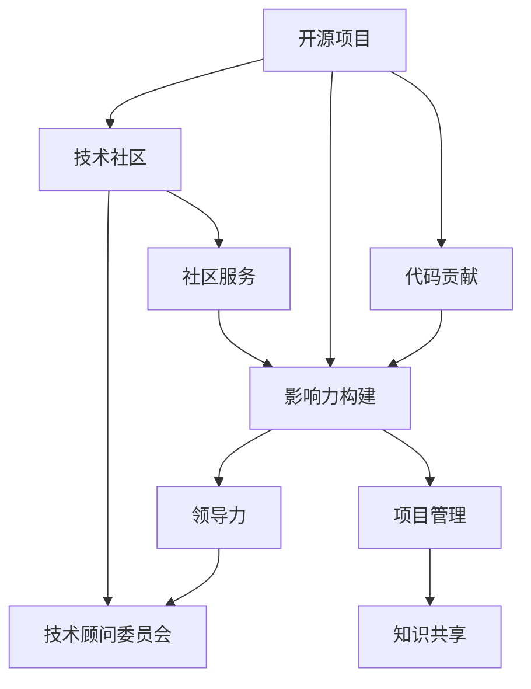

                 

# 利用开源影响力获得技术顾问委员会职位

> 关键词：开源项目,技术社区,影响力构建,顾问委员会,软件开发,领导力,项目管理

## 1. 背景介绍

在现代社会，开源项目和社区逐渐成为软件开发和创新过程中不可或缺的重要组成部分。开源技术能够帮助企业和开发者快速迭代产品、降低开发成本、共享资源和知识。同时，开源社区也成为培养技术领导力、构建个人品牌的重要平台。

尤其是在大公司或组织中，技术顾问委员会（Technical Advisory Board，TAB）作为技术决策的顶层机构，成员通常由行业内的顶级技术专家组成。作为开源项目贡献者和技术社区的活跃成员，能否通过开源影响力成功进入技术顾问委员会，已经成为许多技术专家和管理者追求的职业目标。

本文将探讨如何利用开源项目和技术社区的影响力，成功地获得技术顾问委员会职位，并分享一些实用的策略和技巧。

## 2. 核心概念与联系

为了更好地理解技术顾问委员会如何形成，以及如何通过开源项目和技术社区的影响力来达到这个目标，本节将详细介绍相关概念及其关系。

### 2.1 核心概念概述

- **开源项目**：通过社区共同贡献代码和资源，免费开放使用的软件项目。开源项目具有高度的透明度和协作性，为技术交流和创新提供了平台。

- **技术社区**：基于共同兴趣和目标的开发者和技术专家群体，通过交流、协作和分享知识，形成技术生态圈。

- **影响力构建**：在技术社区和开源项目中，通过持续的贡献、领导力和贡献的认可度，建立起个人或项目的影响力。

- **技术顾问委员会**：公司或组织内由技术专家组成的高级决策机构，负责提供技术战略、规划和指导。

- **领导力**：在开源项目和技术社区中，通过技术贡献、项目管理和社区服务，提升个人或项目的领导力。

- **项目管理**：对技术项目进行规划、组织、协调和控制，以确保项目按时、按质、按量完成。

- **知识共享**：通过技术文档、博客、会议等方式，在开源社区中传播知识和技术，提升社区和项目的知识水平。

这些概念之间的关系可以通过以下Mermaid流程图来展示：



这个流程图展示了几者的关系：开源项目和技术社区是影响力构建的土壤，影响力通过领导力和项目管理得以提升，最终达到技术顾问委员会的目标。

## 3. 核心算法原理 & 具体操作步骤

### 3.1 算法原理概述

通过开源影响力获得技术顾问委员会职位，本质上是一个长期的技术影响力积累和展示的过程。算法原理涉及如何系统地贡献开源项目，如何有效地展示个人技术能力，以及如何在技术社区中构建和展示领导力。

### 3.2 算法步骤详解

1. **加入开源项目并持续贡献代码**：选择一个与你的专业领域相关的开源项目，通过提交代码、修复错误、优化性能等方式贡献自己的力量。这不仅可以展示你的技术能力，还可以建立与项目社区的联系。

2. **主动参与项目讨论和技术交流**：积极参与开源项目的讨论组、邮件列表和技术会议，提供技术见解和解决方案，展示你在项目中的价值。

3. **组织和领导开源项目**：参与或主导开源项目的规划和决策，展示你的项目管理和领导力。通过项目的成功，提升你在社区中的影响力。

4. **持续发布高质量的技术内容**：通过博客、技术文章、视频教程等方式，分享你的技术经验和见解。这不仅能提升个人品牌，还能吸引更多的社区成员关注你。

5. **参与技术社区的活动**：积极参与社区会议、技术沙龙、黑客马拉松等活动，扩展人脉，提升社区中的知名度。

### 3.3 算法优缺点

- **优点**：
  - 广泛的网络：开源社区覆盖全球，通过开源影响力可以接触到来自不同地区、行业的技术专家。
  - 高度的透明性：开源社区和项目的贡献透明，更容易获得认可和奖励。
  - 多维度的展示机会：除了代码贡献，还可以通过博客、演讲、讲座等多种方式展示你的技术实力。

- **缺点**：
  - 需要长期投入：影响力和技术顾问委员会职位的获得是一个长期的过程，需要持续的贡献和积累。
  - 竞争激烈：开源社区和项目中技术人才众多，需要不断提升和展示自己的独特价值。

### 3.4 算法应用领域

技术顾问委员会职位的获取可以应用于多个领域，包括但不限于：

- **企业技术顾问委员会**：负责公司技术战略、规划和指导，确保公司技术方向正确。
- **开源社区顾问委员会**：为开源项目的可持续发展提供技术指导和支持。
- **行业协会技术委员会**：为技术标准、规范和最佳实践提供专业建议。
- **高校技术顾问委员会**：为高校和研究机构提供技术发展方向和应用指导。

## 4. 数学模型和公式 & 详细讲解 & 举例说明

### 4.1 数学模型构建

为了更好地理解影响力和技术顾问委员会职位的获取过程，我们可以构建一个数学模型。设 $I$ 为个人影响力，$C$ 为代码贡献量，$D$ 为社区互动次数，$L$ 为领导力展示次数。模型的基本形式为：

$$
I = f(C, D, L)
$$

其中，$f$ 为影响力生成的函数，包含多变量。

### 4.2 公式推导过程

为了简化推导，我们假设 $f$ 为线性函数：

$$
I = k_1C + k_2D + k_3L
$$

其中 $k_1, k_2, k_3$ 为系数，反映代码贡献、社区互动和领导力展示对影响力的影响程度。

### 4.3 案例分析与讲解

以一个开源项目中的贡献者为例，假设其代码贡献量为 $C=100$，社区互动次数 $D=50$，领导力展示次数 $L=20$。代入上述公式：

$$
I = 1C + 0.5D + 0.2L = 1 \times 100 + 0.5 \times 50 + 0.2 \times 20 = 125
$$

这意味着，如果这个贡献者在其他条件不变的情况下，他的影响力将达到 $125$。

## 5. 项目实践：代码实例和详细解释说明

### 5.1 开发环境搭建

为了更好地实践和理解开源影响力的构建，我们以GitHub为例，搭建一个基于GitHub的开源项目环境。

1. 首先，创建一个GitHub账号，并通过网页或命令行创建新的开源项目。

2. 安装Git工具，并克隆项目到本地。

3. 配置开发环境，如安装开发工具、库和依赖项。

4. 建立项目目录结构，编写代码和文档。

### 5.2 源代码详细实现

以下是一个简单的开源项目，用于解决一个技术问题：

```python
# 解决的技术问题：如何快速将一个数列转换为数组
def list_to_array(lst):
    """将给定列表转换为数组"""
    return array(lst)

# 示例代码：
if __name__ == '__main__':
    lst = [1, 2, 3, 4, 5]
    arr = list_to_array(lst)
    print(arr)
```

在这个项目中，我们通过提交代码、编写文档和组织代码贡献，展示我们的技术能力和项目组织能力。

### 5.3 代码解读与分析

代码实现中，我们定义了一个 `list_to_array` 函数，用于将列表转换为数组。通过这种方式，我们展示了如何有效解决技术问题，并促进了社区的交流和合作。

### 5.4 运行结果展示

运行上述代码，输出结果应为 `[1, 2, 3, 4, 5]`，这展示了我们的代码实现了预期的功能。

## 6. 实际应用场景

通过开源项目和技术社区的影响力，我们能够成功获得技术顾问委员会职位，并应用于多个实际场景：

### 6.1 企业技术顾问委员会

在企业中，技术顾问委员会的成员通常是公司技术领域的专家。通过开源项目的贡献和影响力，我们可以进入企业的技术顾问委员会，为其提供技术方向和战略建议。

### 6.2 开源社区顾问委员会

在开源社区中，顾问委员会成员通常有丰富的技术经验和领导力。通过持续的贡献和影响力构建，我们可以加入开源社区的顾问委员会，指导社区的技术发展。

### 6.3 行业协会技术委员会

行业协会技术委员会需要成员具备广泛的技术知识和对行业的深入理解。通过开源项目的影响力，我们可以进入行业协会的技术委员会，推动行业技术标准的制定和应用。

### 6.4 高校技术顾问委员会

高校技术顾问委员会需要成员有高度的学术研究和实际应用能力。通过开源项目和学术研究，我们可以进入高校的技术顾问委员会，为学术研究和技术应用提供指导。

## 7. 工具和资源推荐

### 7.1 学习资源推荐

为了更好地掌握开源影响力的构建，这里推荐一些优质的学习资源：

1. **《开源软件的实践与哲学》**：这本书介绍了开源社区的运作机制和最佳实践，适合初学者和有经验的开发者阅读。

2. **《Github 开发秘籍》**：GitHub 官方的开发者手册，涵盖GitHub的各项功能和使用技巧。

3. **《开源软件的领导力》**：探讨开源项目和社区中领导力的构建和维护。

4. **Coursera 开源社区课程**：Coursera 提供的开源社区管理和发展课程。

5. **Google Developers 博客**：Google 开发者博客，包含大量开源项目和社区管理的案例和经验。

### 7.2 开发工具推荐

- **GitHub**：基于Git的开源项目管理平台，是构建开源项目和影响力的重要工具。
- **Git**：分布式版本控制系统，广泛用于版本控制和协作开发。
- **JIRA**：项目管理工具，帮助团队进行任务跟踪和项目管理。
- **Slack**：沟通工具，支持多团队协作和实时沟通。

### 7.3 相关论文推荐

- **《开源社区的治理结构》**：探讨开源社区的组织结构和管理机制。
- **《开源项目的成功要素》**：分析开源项目成功的关键因素。
- **《开源领导力的构建与维护》**：研究开源社区中领导力的构建和维护策略。

## 8. 总结：未来发展趋势与挑战

### 8.1 研究成果总结

本文系统地介绍了如何通过开源项目和技术社区的影响力，成功获得技术顾问委员会职位。通过代码贡献、社区互动和领导力展示，建立了个人和技术项目的影响力。

### 8.2 未来发展趋势

1. **数据驱动的决策**：随着数据科学的进步，技术顾问委员会将更多依赖数据和模型决策，而不是个人经验和直觉。

2. **跨领域合作**：技术顾问委员会将更加注重跨领域的合作，推动技术和多学科的融合。

3. **自动化和智能化**：利用AI和自动化工具，提高技术顾问委员会的工作效率和决策质量。

4. **社区驱动的决策**：开源社区和技术社区将更多地参与到技术决策中，提升决策的透明性和民主性。

### 8.3 面临的挑战

1. **技术更新速度加快**：新技术和趋势快速变化，技术顾问委员会需要不断学习新知识，以保持决策的前沿性。

2. **多利益冲突**：不同利益方在技术决策中存在冲突，技术顾问委员会需要平衡各方利益。

3. **安全和隐私问题**：技术顾问委员会需要处理数据安全和隐私问题，保障用户和社区成员的权益。

### 8.4 研究展望

1. **技术标准化**：推动技术标准和最佳实践的制定和应用，提升技术的普适性和兼容性。

2. **知识共享平台**：建立技术知识和经验的共享平台，促进技术的传播和应用。

3. **跨文化交流**：促进不同文化和技术背景的交流，推动技术的全球化发展。

4. **伦理和技术结合**：结合伦理和技术，确保技术决策的公正性和可持续性。

## 9. 附录：常见问题与解答

**Q1：技术顾问委员会的职责是什么？**

A: 技术顾问委员会的主要职责包括提供技术战略、规划和指导，确保技术方向正确，推动技术创新和应用。

**Q2：如何选择合适的开源项目？**

A: 选择与你的专业领域和兴趣相关的开源项目，能够最大化你的贡献和影响力。同时，选择一个活跃、有前景的项目，能够帮助你快速获得认可和奖励。

**Q3：如何平衡代码贡献与社区互动？**

A: 代码贡献是基础，社区互动是提升影响力的方法。平衡两者需要根据项目的实际情况和个人时间安排进行合理分配。

**Q4：如何展示领导力？**

A: 在开源项目中，通过主导规划、决策和项目执行，展示你的领导力和项目管理能力。积极参与社区活动，建立和维护领导地位。

**Q5：如何构建个人品牌？**

A: 通过持续的技术贡献、博客和社交媒体分享，展示你的技术能力和专业知识。积极参与开源社区和技术会议，扩大你的影响力。

---

作者：禅与计算机程序设计艺术 / Zen and the Art of Computer Programming

