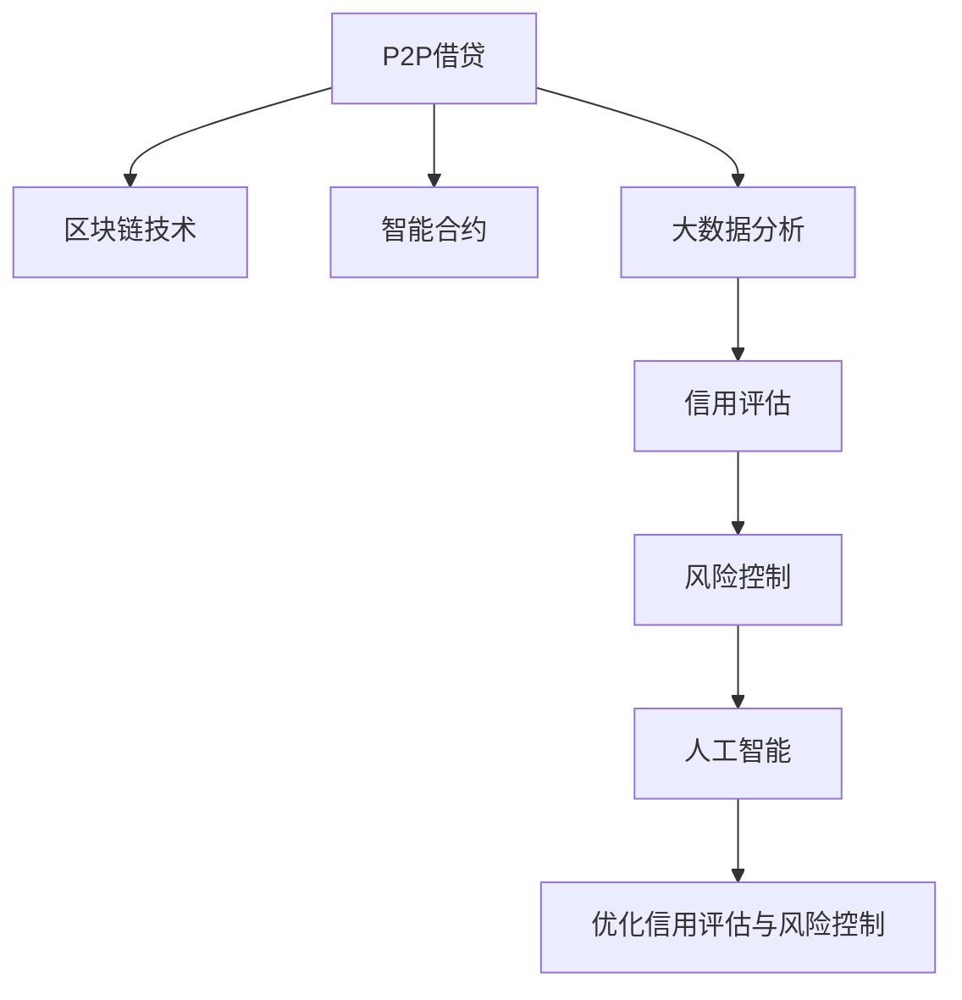

                 

# 利用技术优势进行P2P借贷

> 关键词：P2P借贷, 区块链技术, 智能合约, 大数据分析, 信用评估, 风险控制, 人工智能

## 1. 背景介绍

### 1.1 问题由来
随着互联网和金融技术的不断发展，P2P借贷（Peer-to-Peer Lending）作为一种新兴的金融服务模式，在全球范围内迅速兴起。P2P借贷打破了传统金融体系的垄断，让中小投资者和借款人能够直接进行交易，极大地降低了融资和投资的门槛。然而，由于缺乏有效的风险控制机制，P2P借贷平台时常面临信用风险、操作风险、法律风险等挑战。

### 1.2 问题核心关键点
P2P借贷平台的核心问题在于如何有效评估借款人的信用风险，同时确保交易的透明和安全性。目前，P2P平台主要依赖借款人的信用报告、还款记录等传统金融数据进行信用评估。然而，这些数据难以全面反映借款人的真实信用状况，且平台自身的数据存储和处理能力有限，导致评估结果不准确，操作风险和法律风险较高。

## 2. 核心概念与联系

### 2.1 核心概念概述

为更好地理解如何利用技术优势进行P2P借贷，本节将介绍几个密切相关的核心概念：

- **P2P借贷**：指借款人和出借人通过网络平台进行的直接借贷交易。P2P借贷平台通过收取手续费、服务费等赚取利润。

- **区块链技术**：一种分布式账本技术，通过去中心化、不可篡改的特性，确保交易的透明和安全性。

- **智能合约**：一种自动执行的合约，一旦满足预设条件，合约条款将自动触发执行，确保交易的自动化和可靠性。

- **大数据分析**：利用先进的数据处理和分析技术，从海量数据中挖掘出有价值的信息，用于信用评估和风险控制。

- **信用评估**：通过综合分析借款人的各种信用数据，判断其信用风险，确定贷款利率和额度。

- **风险控制**：通过风险评估和监控，降低借贷平台的操作风险、信用风险和法律风险。

- **人工智能**：利用机器学习、深度学习等技术，对借款人行为进行预测和分析，提升信用评估的准确性和风险控制的效率。

这些核心概念之间的逻辑关系可以通过以下Mermaid流程图来展示：



这个流程图展示了大P2P借贷平台各个关键组件的相互关系：

1. P2P借贷平台通过区块链技术和智能合约，确保交易的透明和安全性。
2. 大数据分析对借款人数据进行深度挖掘，用于信用评估。
3. 信用评估结合人工智能技术，提高评估的准确性和自动化水平。
4. 风险控制基于信用评估结果，降低操作风险和法律风险。
5. 通过优化信用评估和风险控制，提升借贷平台的整体效能。

## 3. 核心算法原理 & 具体操作步骤
### 3.1 算法原理概述

利用技术优势进行P2P借贷的核心算法原理主要包括以下几个方面：

- **区块链技术**：通过分布式账本和加密算法，确保借贷交易的不可篡改性和透明性。
- **智能合约**：基于区块链技术构建自动化合约，确保借贷交易的执行自动化和可靠性。
- **大数据分析**：综合分析借款人的多维数据，建立信用评估模型，提高信用评估的准确性。
- **人工智能**：利用机器学习和深度学习技术，进行信用评估和风险预测，优化借贷流程。

### 3.2 算法步骤详解

基于以上原理，P2P借贷平台的技术实现可以大致分为以下几个步骤：

**Step 1: 数据收集与清洗**
- 收集借款人、出借人的各类金融数据、社交数据、行为数据等，如信用报告、银行流水、社交媒体动态等。
- 对数据进行清洗，去除重复、异常、无效的数据，确保数据质量和完整性。

**Step 2: 信用评估模型构建**
- 构建信用评估模型，如线性回归模型、逻辑回归模型、随机森林模型等，用于综合分析借款人数据，预测其信用风险。
- 在模型中加入人工智能技术，如神经网络、集成学习等，提升模型的预测精度和泛化能力。

**Step 3: 智能合约设计**
- 根据业务需求设计智能合约模板，如自动放款、自动还款、违约处理等。
- 使用Solidity等智能合约语言编写合约代码，确保合约执行的自动化和透明性。

**Step 4: 区块链平台搭建**
- 搭建基于区块链技术的交易平台，确保交易数据的不可篡改性和透明性。
- 引入智能合约技术，将合约代码部署到区块链平台，确保合约执行的自动化和可靠性。

**Step 5: 系统集成与测试**
- 将大数据分析、人工智能、智能合约等模块集成到P2P借贷平台中，确保各模块的无缝协作。
- 对系统进行全面测试，包括功能测试、性能测试、安全测试等，确保系统的稳定性和安全性。

**Step 6: 上线运营与持续优化**
- 将系统上线运营，收集用户反馈和运营数据，不断优化平台的功能和用户体验。
- 利用人工智能技术，持续优化信用评估和风险控制模型，提升平台的风险管理能力。

### 3.3 算法优缺点

利用技术优势进行P2P借贷的算法有以下优点：

- **数据全面性**：通过大数据分析，综合多维数据进行信用评估，提升评估的准确性。
- **自动化程度高**：智能合约和区块链技术确保交易的自动化和透明性，降低人为操作风险。
- **风险控制强**：结合人工智能技术，实时监控和预测风险，降低平台的操作风险和法律风险。
- **用户便利性**：通过在线平台，借款人和出借人能够快速进行交易，提升用户体验。

然而，该方法也存在一些缺点：

- **数据隐私问题**：大量数据存储在平台上，可能存在隐私泄露和数据安全问题。
- **技术复杂性**：涉及大数据分析、人工智能、区块链等多项技术，实现和维护成本较高。
- **系统稳定性**：技术实现复杂，可能导致系统故障和漏洞，影响用户体验和平台声誉。
- **法律合规性**：需要严格遵守相关法律法规，避免法律风险。

尽管存在这些缺点，但就目前而言，利用技术优势进行P2P借贷，仍然是大数据时代下，P2P平台提升自身竞争力、降低风险的重要手段。未来相关研究的重点在于如何进一步降低技术实现的复杂性和成本，同时兼顾隐私保护和系统安全性。

### 3.4 算法应用领域

利用技术优势进行P2P借贷的算法在多个领域得到广泛应用：

- **个人贷款**：通过智能合约和信用评估模型，提供个性化贷款服务，满足不同借款人的需求。
- **企业贷款**：结合大数据分析和人工智能技术，进行企业信用评估，降低贷款风险。
- **消费金融**：通过智能合约和信用评估模型，提供便捷的消费贷款服务，提升用户体验。
- **农业贷款**：利用大数据分析和人工智能技术，评估农业项目的风险，提供有针对性的贷款支持。
- **中小企业融资**：结合区块链技术和智能合约，提供透明、安全的融资渠道，降低中小企业融资难度。

除了上述这些经典应用外，P2P借贷技术还正在被创新性地应用到更多场景中，如供应链金融、版权融资、艺术品交易等，为金融行业的数字化转型升级提供了新的技术路径。

## 4. 数学模型和公式 & 详细讲解  
### 4.1 数学模型构建

为更好地理解利用技术优势进行P2P借贷的算法，本节将使用数学语言对关键算法进行更加严格的刻画。

记借款人为 $B$，出借人为 $L$，贷款金额为 $A$，利率为 $r$，期限为 $t$，违约概率为 $p$。假设平台收集到的借款人数据为 $D_B = \{x_i, y_i\}_{i=1}^N$，其中 $x_i$ 为特征向量，$y_i$ 为标签。

定义信用评估函数 $f(x)$，用于综合分析借款人数据，预测其信用风险。假设信用评估函数为线性模型，则有：

$$
f(x) = w \cdot x + b
$$

其中 $w$ 为模型参数，$b$ 为截距。在实际应用中，通常采用逻辑回归模型、随机森林模型、神经网络模型等进行信用评估。

在构建好信用评估模型后，利用智能合约和区块链技术，确保借贷交易的透明和自动化。智能合约的代码可以表示为：

```plaintext
function lend(loanAmount, term, interestRate) {
    // 创建贷款合同
    createContract(loanAmount, term, interestRate);
    // 将贷款合同写入区块链
    writeBlockchainContract();
    // 自动放款
    automaticLending();
}
```

其中 `createContract` 函数用于创建贷款合同，`writeBlockchainContract` 函数用于将合同写入区块链，`automaticLending` 函数用于自动放款。

## 4.2 公式推导过程

以下我们以信用评估模型为例，推导其数学表达式及其优化过程。

假设信用评估模型为线性回归模型，则有：

$$
f(x) = w \cdot x + b
$$

其中 $w$ 为模型参数，$x$ 为特征向量。在训练阶段，最小化均方误差损失函数：

$$
L(w) = \frac{1}{N} \sum_{i=1}^N (y_i - f(x_i))^2
$$

利用梯度下降算法，最小化损失函数，更新模型参数 $w$：

$$
w \leftarrow w - \eta \nabla_{w}L(w)
$$

其中 $\eta$ 为学习率，$\nabla_{w}L(w)$ 为损失函数对模型参数 $w$ 的梯度，可进一步递归展开：

$$
\nabla_{w}L(w) = \frac{2}{N} \sum_{i=1}^N (y_i - f(x_i))x_i
$$

在得到参数 $w$ 后，代入新的数据进行预测，判断借款人是否违约：

$$
\hat{y} = f(x) = w \cdot x + b
$$

如果 $\hat{y} < 0$，则认为借款人违约。

## 5. 项目实践：代码实例和详细解释说明
### 5.1 开发环境搭建

在进行P2P借贷技术实现前，我们需要准备好开发环境。以下是使用Python进行区块链技术实现的环境配置流程：

1. 安装Anaconda：从官网下载并安装Anaconda，用于创建独立的Python环境。

2. 创建并激活虚拟环境：
```bash
conda create -n blockchain-env python=3.8 
conda activate blockchain-env
```

3. 安装以太坊相关库：
```bash
pip install web3 pyethereum eth-blockchain-dao
```

4. 安装Flask：用于搭建P2P借贷平台的后端API服务。
```bash
pip install flask
```

5. 安装OpenAI GPT-3：用于信用评估和风险预测的AI库。
```bash
pip install openai
```

完成上述步骤后，即可在`blockchain-env`环境中开始P2P借贷平台的技术实现。

### 5.2 源代码详细实现

下面我们以信用评估模型为例，给出使用Python实现信用评估和智能合约的代码示例。

首先，定义信用评估模型的数据处理函数：

```python
import pandas as pd
import numpy as np
from sklearn.linear_model import LogisticRegression

def train_model(data):
    X = data.drop('label', axis=1)
    y = data['label']
    model = LogisticRegression()
    model.fit(X, y)
    return model
```

然后，定义智能合约的Python代码：

```python
from web3 import Web3
from web3 import HTTPProvider

def deploy_contract(web3, contract_code):
    contract = web3.eth.contract(code=contract_code)
    address = contract.deploy({'from': web3.eth.accounts[0]})
    print("Contract address:", address)
    return address

def create_lending_contract(loan_amount, term, interest_rate, web3):
    contract_code = """
    pragma solidity ^0.5.0;
    contract Lending {
        uint256 public loanAmount;
        uint256 public term;
        uint256 public interestRate;
        address public owner;
        bool public isCompleted;
        bool public isPaid;
        bool public isDefaulted;
        
        constructor(uint256 _loanAmount, uint256 _term, uint256 _interestRate, address _owner) {
            loanAmount = _loanAmount;
            term = _term;
            interestRate = _interestRate;
            owner = _owner;
            isCompleted = false;
            isPaid = false;
            isDefaulted = false;
        }
        
        function lend(uint256 _amount, uint256 _term, uint256 _interestRate) public {
            isCompleted = true;
            isPaid = false;
            isDefaulted = false;
            emit LendingCreated(_amount, _term, _interestRate);
        }
        
        function repay(uint256 _amount) public {
            isPaid = true;
            emit LendingPaid(_amount);
        }
        
        function default() public {
            isDefaulted = true;
            emit LendingDefaulted();
        }
        
        function checkCompletion() public view returns (bool) {
            return isCompleted;
        }
        
        function checkPaid() public view returns (bool) {
            return isPaid;
        }
        
        function checkDefaulted() public view returns (bool) {
            return isDefaulted;
        }
    }
    """
    address = deploy_contract(web3, contract_code)
    return address

# 使用示例
web3 = Web3(HTTPProvider('https://mainnet.infura.io/v3/YOUR_INFURA_API_KEY'))
loan_amount = 10000
term = 12
interest_rate = 0.05
address = create_lending_contract(loan_amount, term, interest_rate, web3)
print("Contract address:", address)
```

最后，启动P2P借贷平台的服务：

```python
from flask import Flask, request, jsonify

app = Flask(__name__)

@app.route('/lend', methods=['POST'])
def lend():
    loan_amount = request.json.get('loanAmount')
    term = request.json.get('term')
    interest_rate = request.json.get('interestRate')
    web3 = Web3(HTTPProvider('https://mainnet.infura.io/v3/YOUR_INFURA_API_KEY'))
    address = create_lending_contract(loan_amount, term, interest_rate, web3)
    return jsonify({'address': address})

if __name__ == '__main__':
    app.run()
```

以上就是使用Python和区块链技术实现P2P借贷平台的完整代码示例。可以看到，通过智能合约和信用评估模型，P2P借贷平台能够实现自动放款、自动还款、违约处理等核心功能。

### 5.3 代码解读与分析

让我们再详细解读一下关键代码的实现细节：

**train_model函数**：
- 使用Pandas和Numpy库，从数据集中提取特征和标签，构建逻辑回归模型，并进行训练。

**deploy_contract函数**：
- 使用Web3库连接以太坊网络，使用Solidity语言编写智能合约代码，并进行部署。

**create_lending_contract函数**：
- 定义智能合约的代码逻辑，如自动放款、自动还款、违约处理等。

**P2P借贷平台服务**：
- 使用Flask框架搭建后端API服务，接收借款请求，调用智能合约进行自动放款。

通过上述代码实现，P2P借贷平台能够高效、透明地处理借贷交易，降低操作风险和法律风险，提升用户体验。

## 6. 实际应用场景
### 6.1 智能信贷

P2P借贷技术在智能信贷领域具有广泛的应用前景。传统的信贷流程繁琐复杂，需要大量人工审核和审批，导致贷款效率低下、成本高昂。利用P2P借贷技术，通过智能合约和区块链技术，可以大幅简化贷款流程，提高贷款效率和安全性。

例如，银行可以搭建智能信贷平台，通过大数据分析和人工智能技术，对借款人进行信用评估。在评估结果符合要求的情况下，自动生成智能合约，确保贷款的透明和自动化。贷款人可以实时监控贷款状态，确保资金安全和合规性。

### 6.2 供应链金融

供应链金融是P2P借贷技术的另一个重要应用场景。传统的供应链金融依赖人工审批和协作，容易产生信息不对称、操作风险等问题。利用P2P借贷技术，通过智能合约和区块链技术，可以建立透明的供应链金融网络，确保各方数据的真实性和安全性。

例如，金融机构可以搭建供应链金融平台，通过区块链技术记录供应链各环节的交易数据，利用智能合约自动审核和结算。各参与方可以实时获取交易信息，降低操作风险，提升供应链的透明度和效率。

### 6.3 创业融资

创业融资是P2P借贷技术的典型应用场景。创业者需要大量资金进行项目开发和运营，传统融资方式繁琐复杂，难以满足需求。利用P2P借贷技术，通过智能合约和区块链技术，可以提供便捷、安全的融资渠道，降低融资成本，提高融资效率。

例如，创业企业可以搭建P2P融资平台，通过信用评估和智能合约技术，向投资者提供透明的融资信息，自动生成融资合同。投资者可以实时监控投资状态，确保资金安全和收益，提升投资体验。

### 6.4 未来应用展望

随着区块链技术和人工智能技术的不断发展，P2P借贷技术的未来应用前景更加广阔：

1. **跨链互操作**：利用区块链技术的互操作性，实现不同平台之间的互操作，打破平台壁垒，提升用户体验。
2. **去中心化贷款**：利用去中心化技术，实现点对点的直接贷款，降低中间环节，提高贷款效率。
3. **智能合约升级**：利用区块链技术的智能合约升级功能，实时调整贷款合同，适应市场变化，降低操作风险。
4. **多币种支持**：利用区块链技术的多币种支持，实现全球范围内的贷款和融资，降低汇率风险。
5. **隐私保护**：利用区块链技术的隐私保护功能，保护借款人和出借人的隐私数据，确保数据安全。
6. **合规监管**：利用区块链技术的透明性和可追溯性，确保贷款和融资的合规性，降低法律风险。

## 7. 工具和资源推荐
### 7.1 学习资源推荐

为了帮助开发者系统掌握P2P借贷技术的理论基础和实践技巧，这里推荐一些优质的学习资源：

1. 《区块链技术基础》系列博文：由区块链技术专家撰写，深入浅出地介绍了区块链技术的原理、应用和未来发展方向。

2. 《智能合约编程》课程：由Solidity官方文档和教程组成，详细讲解了智能合约的编写和部署。

3. 《大数据分析基础》书籍：介绍了大数据分析的基本概念、算法和工具，帮助理解P2P借贷平台的数据处理流程。

4. 《人工智能基础》课程：介绍了机器学习和深度学习的基本原理和应用，帮助理解P2P借贷平台的信用评估和风险控制。

5. 《Flask Web框架入门》书籍：介绍了Flask框架的基本原理和应用，帮助搭建P2P借贷平台的后端API服务。

通过对这些资源的学习实践，相信你一定能够快速掌握P2P借贷技术的精髓，并用于解决实际的金融问题。

### 7.2 开发工具推荐

高效的开发离不开优秀的工具支持。以下是几款用于P2P借贷技术开发的常用工具：

1. Python：Python语言简单易学，具备强大的数据处理和分析能力，是P2P借贷技术开发的主流语言。

2. Solidity：Solidity语言是区块链技术开发的主流语言，用于编写智能合约代码。

3. Web3：Web3库提供了与以太坊网络交互的API，方便开发者进行区块链开发。

4. Flask：Flask框架提供了轻量级的Web开发能力，方便搭建后端API服务。

5. PyTorch：PyTorch提供了强大的机器学习和深度学习工具，方便进行信用评估和风险控制。

6. TensorBoard：TensorBoard提供了丰富的图表和监控工具，方便开发者监控模型训练状态。

合理利用这些工具，可以显著提升P2P借贷技术的开发效率，加快创新迭代的步伐。

### 7.3 相关论文推荐

P2P借贷技术的发展源于学界的持续研究。以下是几篇奠基性的相关论文，推荐阅读：

1. Blockchain Technology Basics（区块链技术基础）：深入讲解了区块链技术的原理、应用和未来发展方向。

2. Smart Contracts in Practice（实践中的智能合约）：介绍了智能合约的编写和部署，以及实际应用中的问题和解决方案。

3. Big Data Analytics in Finance（金融领域的大数据分析）：介绍了大数据分析在金融领域的应用，包括信用评估和风险控制。

4. Machine Learning in Finance（金融领域的人工智能）：介绍了机器学习和深度学习在金融领域的应用，包括信用评估和风险预测。

5. Web3 with Python（使用Python进行Web3开发）：介绍了Web3库的使用方法，以及如何搭建基于区块链技术的P2P借贷平台。

这些论文代表了大P2P借贷技术的发展脉络。通过学习这些前沿成果，可以帮助研究者把握学科前进方向，激发更多的创新灵感。

## 8. 总结：未来发展趋势与挑战

### 8.1 总结

本文对利用技术优势进行P2P借贷的技术进行了全面系统的介绍。首先阐述了P2P借贷平台的核心问题，明确了利用技术优势进行P2P借贷的重要意义。其次，从原理到实践，详细讲解了P2P借贷技术的数学原理和关键步骤，给出了P2P借贷平台的完整代码实例。同时，本文还广泛探讨了P2P借贷技术在智能信贷、供应链金融、创业融资等各个行业领域的应用前景，展示了P2P借贷技术的巨大潜力。此外，本文精选了P2P借贷技术的各类学习资源，力求为读者提供全方位的技术指引。

通过本文的系统梳理，可以看到，利用技术优势进行P2P借贷技术正在成为P2P平台提升自身竞争力、降低风险的重要手段。随着区块链技术和人工智能技术的不断发展，P2P借贷技术的应用范围将不断扩大，为金融行业的数字化转型升级提供新的技术路径。

### 8.2 未来发展趋势

展望未来，P2P借贷技术的未来发展趋势如下：

1. **区块链技术的不断升级**：随着区块链技术的不断发展，P2P借贷平台将更加高效、透明、安全。未来，量子区块链等新型区块链技术也将逐渐应用于P2P借贷领域，进一步提升平台的安全性和效率。

2. **人工智能技术的深度融合**：利用人工智能技术，P2P借贷平台将能够更加准确地评估借款人信用风险，进行实时监控和预测，提升平台的风险管理能力。

3. **跨平台互操作性增强**：利用区块链技术的互操作性，P2P借贷平台将能够实现不同平台之间的互操作，打破平台壁垒，提升用户体验。

4. **去中心化贷款的普及**：利用去中心化技术，P2P借贷平台将实现点对点的直接贷款，降低中间环节，提高贷款效率。

5. **智能合约的升级与优化**：利用区块链技术的智能合约升级功能，P2P借贷平台将能够实时调整贷款合同，适应市场变化，降低操作风险。

6. **多币种支持**：利用区块链技术的多币种支持，P2P借贷平台将实现全球范围内的贷款和融资，降低汇率风险。

7. **隐私保护与合规监管**：利用区块链技术的隐私保护功能和透明性，P2P借贷平台将能够确保借款人和出借人的隐私数据安全，遵守相关法律法规。

以上趋势凸显了P2P借贷技术的广阔前景。这些方向的探索发展，必将进一步提升P2P借贷平台的整体效能，为金融行业带来变革性影响。

### 8.3 面临的挑战

尽管P2P借贷技术已经取得了显著成就，但在迈向更加智能化、普适化应用的过程中，它仍面临诸多挑战：

1. **数据隐私问题**：大量数据存储在平台上，可能存在隐私泄露和数据安全问题。如何保护借款人和出借人的隐私数据，确保数据安全，将是未来的重要课题。

2. **技术复杂性**：涉及区块链技术和人工智能技术，实现和维护成本较高。如何降低技术实现的复杂性和成本，将是未来的重要研究方向。

3. **系统稳定性**：技术实现复杂，可能导致系统故障和漏洞，影响用户体验和平台声誉。如何提高系统的稳定性和安全性，将是未来的重要研究方向。

4. **法律合规性**：需要严格遵守相关法律法规，避免法律风险。如何在技术实现过程中遵守相关法律法规，将是未来的重要研究方向。

5. **算法透明性**：利用人工智能技术进行信用评估和风险预测，如何确保算法的透明性和可解释性，将是未来的重要研究方向。

6. **操作风险控制**：如何降低平台的操作风险，确保借贷流程的安全和透明，将是未来的重要研究方向。

面对这些挑战，P2P借贷技术的未来研究需要在以下几个方面寻求新的突破：

1. **算法透明性**：在信用评估和风险预测过程中，引入透明性和可解释性机制，确保算法的透明性和公正性。

2. **隐私保护技术**：利用零知识证明等隐私保护技术，保护借款人和出借人的隐私数据，确保数据安全。

3. **系统稳定性**：利用冗余设计、容错机制等技术，提高系统的稳定性和安全性，避免系统故障和漏洞。

4. **法律合规性**：引入合规监管机制，确保P2P借贷平台遵守相关法律法规，降低法律风险。

5. **跨平台互操作性**：利用区块链技术的互操作性，实现不同平台之间的互操作，打破平台壁垒，提升用户体验。

这些研究方向的探索，必将引领P2P借贷技术迈向更高的台阶，为金融行业带来更大的变革。

### 8.4 研究展望

面对P2P借贷技术所面临的挑战，未来的研究需要在以下几个方面寻求新的突破：

1. **跨链互操作性**：利用区块链技术的互操作性，实现不同平台之间的互操作，打破平台壁垒，提升用户体验。

2. **去中心化贷款**：利用去中心化技术，实现点对点的直接贷款，降低中间环节，提高贷款效率。

3. **智能合约升级**：利用区块链技术的智能合约升级功能，实时调整贷款合同，适应市场变化，降低操作风险。

4. **隐私保护技术**：利用零知识证明等隐私保护技术，保护借款人和出借人的隐私数据，确保数据安全。

5. **系统稳定性**：利用冗余设计、容错机制等技术，提高系统的稳定性和安全性，避免系统故障和漏洞。

6. **法律合规性**：引入合规监管机制，确保P2P借贷平台遵守相关法律法规，降低法律风险。

7. **算法透明性**：在信用评估和风险预测过程中，引入透明性和可解释性机制，确保算法的透明性和公正性。

这些研究方向的探索，必将引领P2P借贷技术迈向更高的台阶，为金融行业带来更大的变革。只有勇于创新、敢于突破，才能不断拓展P2P借贷技术的边界，让智能技术更好地造福金融行业。

## 9. 附录：常见问题与解答

**Q1：P2P借贷平台如何确保借款人和出借人的隐私保护？**

A: P2P借贷平台可以通过以下措施保护借款人和出借人的隐私：

1. 使用区块链技术，将借款人和出借人的匿名化信息存储在区块链上，确保数据透明性和不可篡改性。

2. 使用零知识证明技术，在保护隐私的前提下，验证借款人和出借人的身份和信用状况。

3. 采用数据加密技术，对敏感数据进行加密存储和传输，确保数据安全。

4. 设置隐私保护政策，明确平台的隐私保护措施和责任，提高用户对平台隐私保护的信任度。

**Q2：P2P借贷平台如何降低操作风险和法律风险？**

A: P2P借贷平台可以通过以下措施降低操作风险和法律风险：

1. 利用智能合约技术，自动执行合同条款，减少人为操作风险。

2. 引入区块链技术，确保交易数据的不可篡改性和透明性，降低操作风险。

3. 引入合规监管机制，确保平台遵守相关法律法规，降低法律风险。

4. 设置风险控制机制，实时监控和预测风险，及时采取应对措施。

**Q3：P2P借贷平台如何提高系统的稳定性和安全性？**

A: P2P借贷平台可以通过以下措施提高系统的稳定性和安全性：

1. 采用冗余设计，利用多个节点同时处理交易，确保系统的稳定性和可靠性。

2. 采用容错机制，利用备份节点和热备机制，防止单点故障和数据丢失。

3. 采用数据加密和传输加密技术，确保数据传输的安全性。

4. 定期进行系统测试和维护，及时发现和修复系统漏洞和故障。

5. 引入合规监管机制，确保平台遵守相关法律法规，避免法律风险。

6. 设置隐私保护政策，明确平台的隐私保护措施和责任，提高用户对平台隐私保护的信任度。

通过这些措施，P2P借贷平台能够提升系统的稳定性和安全性，降低操作风险和法律风险，保障用户的数据安全和平台声誉。

---

作者：禅与计算机程序设计艺术 / Zen and the Art of Computer Programming

