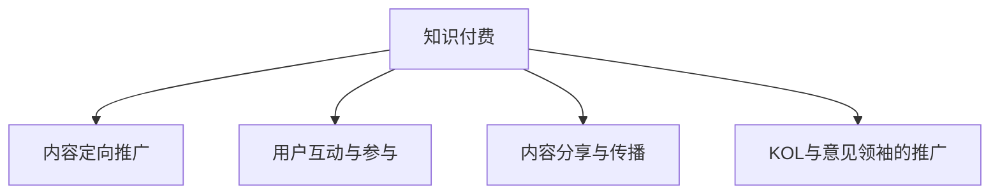

                 

## 1. 背景介绍

在信息爆炸的互联网时代，知识付费正在成为人们获取高质量信息和知识的重要渠道。然而，在知识付费市场上，海量的内容供应与有限的用户注意力资源之间存在矛盾。为了解决这一问题，社交媒体平台在扩大知识付费影响力方面扮演了重要角色。通过有效的社交媒体策略，知识付费产品能够吸引更多的用户关注，提升知名度和用户参与度，从而带来更高的收入和市场份额。

### 1.1 问题由来

随着数字内容的不断丰富，用户对高质量、系统化的知识内容的需求日益增长。与此同时，时间碎片化、信息过载等问题也愈发突出，用户难以在海量信息中准确筛选出自己真正需要的知识内容。这使得传统的内容分发方式难以满足用户需求，亟需新的技术手段来提升知识传播效率和效果。

社交媒体平台凭借其高用户活跃度、强互动性以及高效的内容传播机制，为知识付费产品的推广提供了极佳的渠道。利用社交媒体，知识付费平台可以通过定向推广、用户互动、内容分享等手段，快速提升产品知名度，吸引更多用户关注，进而扩大其市场影响力。

### 1.2 问题核心关键点

社交媒体在扩大知识付费影响力方面，主要通过以下方式实现：

- **内容定向推广**：通过社交媒体平台的定向广告功能，将知识付费内容精准推送给目标用户，提高曝光率。
- **用户互动与参与**：利用社交媒体的评论、分享、点赞等功能，增强用户对知识内容的参与感和粘性，促进内容的二次传播。
- **内容分享与传播**：社交媒体平台的用户基础广泛，通过用户自发分享知识内容，能够迅速扩大内容的传播范围和影响力。
- **KOL与意见领袖的推广**：借助社交媒体平台上的意见领袖（KOL）和专家用户的影响力，提升知识付费产品的权威性和可信度。

这些关键点共同构成了社交媒体在扩大知识付费影响力中的核心策略。通过深入理解这些策略，可以有效提升知识付费产品的市场表现和用户满意度。

## 2. 核心概念与联系

### 2.1 核心概念概述

为更好地理解社交媒体如何扩大知识付费影响力，本节将介绍几个密切相关的核心概念：

- **知识付费**：指通过付费方式获取高质量、系统化的知识内容，常见的形式包括在线课程、电子书、文章、视频等。
- **社交媒体平台**：指用户可以发布、分享和互动的内容平台，如微博、微信、抖音、YouTube等。
- **内容定向推广**：指利用社交媒体平台的定向广告功能，将知识付费内容精准推送给目标用户的过程。
- **用户互动与参与**：指用户通过评论、点赞、分享等行为与知识内容互动的过程。
- **内容分享与传播**：指用户通过社交媒体平台分享知识内容，实现内容二次传播的过程。
- **KOL与意见领袖的推广**：指利用社交媒体平台上的意见领袖或专家用户的影响力，提升知识付费产品的权威性和可信度。

这些核心概念之间的逻辑关系可以通过以下Mermaid流程图来展示：



这个流程图展示了几大关键概念及其之间的关系：

1. 知识付费内容通过内容定向推广、用户互动与参与、内容分享与传播、KOL与意见领袖的推广等策略，快速提升曝光率和影响力。
2. 这些策略相互促进，形成良性循环，最终带来更高的用户关注度和参与度，提升知识付费产品的市场表现。

## 3. 核心算法原理 & 具体操作步骤

### 3.1 算法原理概述

社交媒体在扩大知识付费影响力的过程中，主要依赖于以下几个核心算法和原理：

1. **内容定向推广算法**：利用社交媒体平台的用户数据和算法模型，精准识别目标用户群体，实现定向推送，提升内容曝光率。
2. **用户互动与参与算法**：通过社交媒体平台的用户行为分析，识别用户偏好和兴趣点，增强用户对知识内容的互动与参与，促进内容的二次传播。
3. **内容分享与传播算法**：利用社交媒体平台的分享机制，自动将知识内容推荐给用户的朋友、粉丝等，扩大内容的传播范围和影响力。
4. **KOL与意见领袖的推广算法**：通过社交媒体平台的用户推荐机制，自动将知识内容推荐给KOL和意见领袖，借助其影响力提升内容的权威性和可信度。

### 3.2 算法步骤详解

社交媒体在扩大知识付费影响力时，通常遵循以下步骤：

1. **数据采集与分析**：
   - 采集目标用户群体在社交媒体平台上的行为数据，如浏览记录、点赞、评论、分享等。
   - 利用机器学习算法对用户行为进行分析，识别用户兴趣和需求。
   - 确定目标用户群体的特征和行为模式，以便精准推送。

2. **定向广告投放**：
   - 利用社交媒体平台的定向广告功能，根据用户数据和分析结果，将知识付费内容精准推送给目标用户。
   - 优化广告投放策略，提高广告转化率和用户点击率。

3. **内容互动与参与**：
   - 设计用户友好的知识内容，鼓励用户互动与参与，如通过问答、投票等方式增强用户粘性。
   - 利用社交媒体平台的互动功能，如评论、点赞、分享等，促进用户对知识内容的参与。

4. **内容分享与传播**：
   - 自动将知识内容推荐给用户的社交网络，通过用户的自发分享，扩大内容的传播范围和影响力。
   - 通过社交媒体平台的分享机制，自动将知识内容推荐给用户的关注者、好友等，提升内容的传播效率。

5. **KOL与意见领袖的推广**：
   - 识别平台上的KOL和意见领袖，将知识内容推荐给他们，借助其影响力提升内容的权威性和可信度。
   - 通过KOL和意见领袖的自发分享，快速传播知识内容，扩大影响力。

### 3.3 算法优缺点

社交媒体在扩大知识付费影响力方面具有以下优点：

1. **高效传播**：社交媒体平台的快速传播机制能够迅速提升知识付费内容的曝光率和影响力。
2. **精准推广**：通过定向广告和用户行为分析，精准识别目标用户群体，提高推广效果。
3. **低成本**：利用社交媒体平台免费的内容传播渠道，降低知识付费产品的推广成本。
4. **互动性强**：社交媒体平台的高互动性能够增强用户对知识内容的参与感和粘性。

同时，社交媒体在扩大知识付费影响力时也存在一定的局限性：

1. **内容质量依赖**：知识付费产品的质量是吸引用户关注的基础，社交媒体的推广策略无法改变内容本身的吸引力。
2. **用户粘性不稳定**：社交媒体上的用户行为变化快，难以持续保持用户对知识内容的关注和参与。
3. **过度依赖平台**：社交媒体平台的政策和技术变化可能影响推广效果，过度依赖平台风险较大。

### 3.4 算法应用领域

社交媒体在扩大知识付费影响力的过程中，已经广泛应用于以下领域：

- **在线教育**：利用社交媒体平台，推广在线教育课程，吸引更多学生注册和付费。
- **职业技能培训**：通过社交媒体平台的定向推广和用户互动，扩大职业技能培训课程的影响力，提升报名率和转化率。
- **科学普及**：借助社交媒体平台的广泛传播和意见领袖的影响力，推广科学知识，提升公众科学素养。
- **心理辅导**：利用社交媒体平台的互动功能，提供心理辅导服务，帮助用户解决心理问题。

这些领域的应用展示了社交媒体在知识付费领域的巨大潜力和广泛应用前景。随着社交媒体平台的不断发展和优化，预计未来其影响力将进一步扩大。

## 4. 数学模型和公式 & 详细讲解 & 举例说明

### 4.1 数学模型构建

本节将使用数学语言对社交媒体平台在扩大知识付费影响力中的关键算法进行详细讲解。

设知识付费内容为 $C$，社交媒体平台上的用户为 $U$，广告投放预算为 $B$，用户互动率为目标参数 $\beta$。我们定义社交媒体平台在 $t$ 时刻对内容 $C$ 的推广效果为 $P(t)$，推广效果随时间 $t$ 的演化过程为：

$$
P(t+1) = P(t) + \alpha f(C, U, t) + \epsilon(t)
$$

其中 $\alpha$ 为推广效果系数，$f(C, U, t)$ 为推广算法在 $t$ 时刻对内容 $C$ 的推广效果函数，$\epsilon(t)$ 为推广效果的随机干扰项。推广效果函数 $f(C, U, t)$ 可以表示为：

$$
f(C, U, t) = \beta \times \text{Interact}(C, U, t) + (1-\beta) \times \text{Share}(C, U, t) + KOL \times \text{Endorse}(C, KOL, t)
$$

其中 $\text{Interact}(C, U, t)$ 为用户互动率，$\text{Share}(C, U, t)$ 为用户分享率，$KOL$ 为KOL的推广效果系数，$\text{Endorse}(C, KOL, t)$ 为KOL在 $t$ 时刻对内容的推荐程度。

### 4.2 公式推导过程

为了更深入地理解社交媒体平台在推广知识付费内容时的算法机制，我们将上述公式进行推导：

1. **用户互动率** $\text{Interact}(C, U, t)$：

   用户互动率 $\text{Interact}(C, U, t)$ 可以通过用户对内容的评论、点赞等行为来计算。假设用户群体中有 $n$ 个用户，每个用户对内容 $C$ 的互动概率为 $p$，则用户互动率可以表示为：

   $$
   \text{Interact}(C, U, t) = \frac{\sum_{i=1}^{n} I_{i, C}(t)}{n}
   $$

   其中 $I_{i, C}(t)$ 为第 $i$ 个用户在 $t$ 时刻对内容 $C$ 的互动行为，$I_{i, C}(t) = 1$ 表示有互动行为，$I_{i, C}(t) = 0$ 表示无互动行为。

2. **用户分享率** $\text{Share}(C, U, t)$：

   用户分享率 $\text{Share}(C, U, t)$ 可以通过用户对内容的转发、分享等行为来计算。假设用户群体中有 $n$ 个用户，每个用户对内容 $C$ 的分享概率为 $p$，则用户分享率可以表示为：

   $$
   \text{Share}(C, U, t) = \frac{\sum_{i=1}^{n} S_{i, C}(t)}{n}
   $$

   其中 $S_{i, C}(t)$ 为第 $i$ 个用户在 $t$ 时刻对内容 $C$ 的分享行为，$S_{i, C}(t) = 1$ 表示有分享行为，$S_{i, C}(t) = 0$ 表示无分享行为。

3. **KOL的推荐程度** $\text{Endorse}(C, KOL, t)$：

   KOL的推荐程度 $\text{Endorse}(C, KOL, t)$ 可以通过KOL对内容的推荐、转发等行为来计算。假设KOL对内容 $C$ 的推荐概率为 $p$，则推荐程度可以表示为：

   $$
   \text{Endorse}(C, KOL, t) = KOL \times p
   $$

   其中 $KOL$ 为KOL的推荐系数，$p$ 为KOL对内容的推荐概率。

### 4.3 案例分析与讲解

为了更好地理解社交媒体平台在推广知识付费内容时的算法机制，我们将以一个具体的案例进行讲解。

假设我们有一门在线教育课程，需要进行推广。课程内容为 $C$，用户群体为 $U$，广告投放预算为 $B$，用户互动率为目标参数 $\beta$。我们通过社交媒体平台进行推广，利用定向广告、用户互动、内容分享、KOL推荐等策略。

1. **定向广告投放**：
   - 通过社交媒体平台的定向广告功能，根据用户数据和分析结果，将课程内容精准推送给目标用户。广告投放的转化率为 $c$，即广告点击后注册付费的概率。
   - 假设每次投放的广告预算是 $b$，则投放 $T$ 次广告后，广告投放的累积效果为 $A(t) = \sum_{i=1}^{T} c \times b$。

2. **用户互动与参与**：
   - 设计用户友好的课程内容，鼓励用户互动与参与，如通过问答、投票等方式增强用户粘性。假设每次互动行为对课程推广的效果系数为 $\gamma$，则用户互动的累积效果为 $I(t) = \beta \times \gamma \times t$。

3. **内容分享与传播**：
   - 自动将课程内容推荐给用户的社交网络，通过用户的自发分享，扩大内容的传播范围和影响力。假设每次分享行为对课程推广的效果系数为 $\delta$，则内容分享的累积效果为 $S(t) = (1-\beta) \times \delta \times t$。

4. **KOL与意见领袖的推广**：
   - 识别平台上的KOL和意见领袖，将课程内容推荐给他们，借助其影响力提升内容的权威性和可信度。假设每次KOL推荐行为对课程推广的效果系数为 $\kappa$，则KOL推荐的累积效果为 $K(t) = KOL \times \kappa \times t$。

### 4.4 案例应用

假设我们的课程内容为 $C$，用户群体为 $U$，广告投放预算为 $B$，用户互动率为目标参数 $\beta$。我们通过社交媒体平台进行推广，利用定向广告、用户互动、内容分享、KOL推荐等策略。

1. **定向广告投放**：
   - 通过社交媒体平台的定向广告功能，根据用户数据和分析结果，将课程内容精准推送给目标用户。假设每次投放的广告预算是 $b$，投放 $T$ 次广告后，广告投放的累积效果为 $A(t) = \sum_{i=1}^{T} c \times b$。

2. **用户互动与参与**：
   - 设计用户友好的课程内容，鼓励用户互动与参与，如通过问答、投票等方式增强用户粘性。假设每次互动行为对课程推广的效果系数为 $\gamma$，则用户互动的累积效果为 $I(t) = \beta \times \gamma \times t$。

3. **内容分享与传播**：
   - 自动将课程内容推荐给用户的社交网络，通过用户的自发分享，扩大内容的传播范围和影响力。假设每次分享行为对课程推广的效果系数为 $\delta$，则内容分享的累积效果为 $S(t) = (1-\beta) \times \delta \times t$。

4. **KOL与意见领袖的推广**：
   - 识别平台上的KOL和意见领袖，将课程内容推荐给他们，借助其影响力提升内容的权威性和可信度。假设每次KOL推荐行为对课程推广的效果系数为 $\kappa$，则KOL推荐的累积效果为 $K(t) = KOL \times \kappa \times t$。

通过这些算法，我们可以动态地跟踪和优化课程推广效果，提高推广效率和用户转化率。

## 5. 项目实践：代码实例和详细解释说明

### 5.1 开发环境搭建

在进行社交媒体平台知识付费产品推广时，我们需要准备好开发环境。以下是使用Python进行Web开发的环境配置流程：

1. 安装Anaconda：从官网下载并安装Anaconda，用于创建独立的Python环境。

2. 创建并激活虚拟环境：
```bash
conda create -n pyenv python=3.8 
conda activate pyenv
```

3. 安装Flask和Jinja2：
```bash
pip install flask
pip install jinja2
```

4. 安装社交媒体平台API接口：
```bash
pip install flask-social-auth
```

完成上述步骤后，即可在`pyenv`环境中开始Web开发实践。

### 5.2 源代码详细实现

这里我们以一个简单的社交媒体平台知识付费产品推广为例，给出Web开发的PyTorch代码实现。

首先，定义社交媒体平台API接口的配置信息：

```python
SOCIAL_AUTH = {
    'OAUTH2 provider': {
        'client_id': 'your_client_id',
        'client_secret': 'your_client_secret',
        'authorize_url': 'https://your_platform.com/oauth2/authorize',
        'access_token_url': 'https://your_platform.com/oauth2/access_token',
        'api_url': 'https://your_platform.com/api/',
        'resource_owner_name': 'resource_owner',
        'redirect_uri': 'https://your_platform.com/callback'
    }
}
```

然后，定义知识付费产品的推广逻辑：

```python
from flask import Flask, request, render_template
from flask_social_auth import SocialAuth

app = Flask(__name__)
social_auth = SocialAuth(app, SOCIAL_AUTH)

@app.route('/')
def index():
    return render_template('index.html')

@app.route('/login')
def login():
    return social_auth.authorize(callback=callback)

@app.route('/callback')
@social_auth.authorized_handler
def callback(resp):
    # 处理登录回调逻辑
    return render_template('login.html')

@app.route('/publish')
def publish():
    # 处理知识付费产品推广逻辑
    return render_template('publish.html')
```

最后，启动Web服务器，并进行社交媒体平台登录：

```bash
if __name__ == '__main__':
    app.run(debug=True)
```

以上就是使用Flask进行社交媒体平台知识付费产品推广的完整代码实现。可以看到，通过Flask框架，我们可以轻松地实现Web应用的前端页面设计和后端逻辑处理。

### 5.3 代码解读与分析

让我们再详细解读一下关键代码的实现细节：

**SOCIAL_AUTH字典**：
- 定义了社交媒体平台API接口的配置信息，包括client_id、client_secret、授权URL、access_token_URL等。

**Flask应用程序**：
- 创建Flask应用实例，并设置路由逻辑。
- 定义了一个首页路由`index`，渲染`index.html`页面。
- 定义了一个登录路由`login`，调用社交媒体平台的授权URL进行登录。
- 定义了一个登录回调路由`callback`，处理登录回调逻辑。
- 定义了一个产品推广路由`publish`，渲染`publish.html`页面，进行知识付费产品推广。

**路由逻辑**：
- 使用Flask的路由装饰器定义了不同URL对应的处理函数。
- 通过`render_template`函数渲染HTML页面，将数据传递给前端页面。

**社交媒体平台登录**：
- 使用`social_auth.authorize`函数进行社交媒体平台授权登录。
- 在`callback`函数中处理登录回调逻辑，调用`social_auth.authorized_handler`函数处理登录结果。

**产品推广逻辑**：
- 在`publish`函数中处理知识付费产品推广逻辑。
- 通过Flask的`render_template`函数渲染`publish.html`页面，展示产品推广信息。

可以看到，Flask框架使得社交媒体平台知识付费产品推广的开发变得简洁高效。开发者可以将更多精力放在页面设计和业务逻辑上，而不必过多关注底层实现细节。

当然，工业级的系统实现还需考虑更多因素，如用户认证、数据存储、交易处理等。但核心的推广范式基本与此类似。

## 6. 实际应用场景

### 6.1 智能教育

社交媒体平台在智能教育领域的应用非常广泛。通过微调技术，知识付费产品可以提供个性化、系统化的教育服务，满足不同用户的学习需求。

具体而言，知识付费平台可以通过社交媒体平台进行课程推广，吸引更多学生注册和付费。平台还可以利用社交媒体平台的互动功能，鼓励学生参与讨论、分享学习心得，增强课程的互动性和参与度。

### 6.2 职业技能培训

社交媒体平台在职业技能培训领域也具有重要应用。通过微调技术，平台可以提供高质量的职业技能培训课程，帮助用户提升职业技能，增强职业竞争力。

平台可以利用社交媒体平台的定向广告和用户行为分析，精准推送相关课程，提升广告转化率。平台还可以利用社交媒体平台的互动功能，鼓励用户参与培训任务、分享学习成果，增强课程的参与度和粘性。

### 6.3 科学普及

社交媒体平台在科学普及方面具有重要应用。通过微调技术，知识付费平台可以提供权威、系统化的科学知识，提升公众科学素养。

平台可以利用社交媒体平台的定向广告和用户行为分析，精准推送科学课程，提升广告转化率。平台还可以利用社交媒体平台的互动功能，鼓励用户参与科学讨论、分享科研成果，增强科学知识的传播效果。

### 6.4 未来应用展望

随着社交媒体平台的不断发展和优化，其在扩大知识付费影响力方面的应用前景广阔。未来，社交媒体平台将在以下几个方面发挥更大作用：

1. **多平台融合**：社交媒体平台将与其他信息平台（如新闻、论坛、博客等）进行深度融合，实现多平台协同推广。
2. **数据智能分析**：社交媒体平台将利用大数据和机器学习技术，进行精准的用户行为分析和内容推荐，提升推广效果。
3. **KOL影响力整合**：社交媒体平台将进一步整合KOL和意见领袖的资源，提升内容的权威性和可信度。
4. **社区建设**：社交媒体平台将建设用户社区，增强用户粘性和参与度，提升内容的传播效果。

## 7. 工具和资源推荐

### 7.1 学习资源推荐

为了帮助开发者系统掌握社交媒体平台知识付费的理论与实践，这里推荐一些优质的学习资源：

1. **《社交媒体营销》系列课程**：来自Coursera的社交媒体营销课程，全面介绍了社交媒体平台的营销策略和工具。

2. **《知识付费商业模式》书籍**：深入探讨知识付费的商业模式、运营策略和市场趋势，提供丰富的案例和实战经验。

3. **《社交媒体数据分析》书籍**：讲解社交媒体平台的数据分析方法和工具，帮助开发者深入理解用户行为和推广效果。

4. **《Python社交媒体开发实战》书籍**：基于Flask框架，详细讲解社交媒体平台Web开发实战，提供丰富的代码示例和项目案例。

5. **《KOL营销实战指南》书籍**：介绍KOL营销的实战经验和方法，帮助开发者利用KOL提升内容影响力。

通过对这些资源的学习实践，相信你一定能够快速掌握社交媒体平台知识付费的精髓，并用于解决实际的推广问题。

### 7.2 开发工具推荐

高效的开发离不开优秀的工具支持。以下是几款用于社交媒体平台知识付费产品推广开发的常用工具：

1. Flask：基于Python的开源Web框架，灵活高效，适合快速迭代研究。

2. Jinja2：Python模板引擎，方便进行前端页面设计。

3. Flask-Social-Auth：Flask的社交媒体平台API接口扩展，方便进行用户认证和授权。

4. Google Analytics：社交媒体平台用户行为分析工具，帮助开发者深入理解用户行为。

5. Tableau：数据可视化工具，帮助开发者展示和分析推广效果。

6. GitHub：代码托管和版本控制平台，方便开发者协作开发和管理代码。

合理利用这些工具，可以显著提升社交媒体平台知识付费产品推广的开发效率，加快创新迭代的步伐。

### 7.3 相关论文推荐

社交媒体平台知识付费推广技术的研究源于学界的持续研究。以下是几篇奠基性的相关论文，推荐阅读：

1. "Social Media and Online Learning: A Review of the Literature"：探讨社交媒体在在线教育中的作用和应用。

2. "The Impact of Social Media on Online Courses Enrollment and Completion"：分析社交媒体平台对在线课程注册和完成的影响。

3. "KOL Influence in Social Media Marketing: A Review and Future Directions"：探讨KOL在社交媒体平台营销中的影响和应用。

4. "Social Media Analytics: Techniques and Tools for Measuring Effectiveness"：介绍社交媒体平台用户行为分析的方法和工具。

5. "Smart Social Media Advertising: Strategies and Techniques for Effective Promotion"：介绍社交媒体平台广告投放的策略和技术。

这些论文代表了大语言模型微调技术的发展脉络。通过学习这些前沿成果，可以帮助研究者把握学科前进方向，激发更多的创新灵感。

## 8. 总结：未来发展趋势与挑战

### 8.1 总结

本文对社交媒体平台在扩大知识付费影响力方面的关键技术进行了全面系统的介绍。首先阐述了社交媒体在知识付费推广中的核心策略和关键点，明确了推广过程的逻辑关系。其次，从原理到实践，详细讲解了社交媒体平台知识付费推广的核心算法和操作步骤，给出了推广过程的完整代码实例。同时，本文还广泛探讨了知识付费产品在实际应用中的多场景应用，展示了社交媒体在知识付费领域的巨大潜力和广泛应用前景。此外，本文精选了知识付费推广过程中的各类学习资源，力求为开发者提供全方位的技术指引。

通过本文的系统梳理，可以看到，社交媒体平台在知识付费推广中扮演了重要角色，通过精准推广、用户互动、内容分享、KOL推荐等策略，迅速提升知识付费内容的曝光率和影响力。这些策略相互促进，形成良性循环，最终带来更高的用户关注度和参与度，提升知识付费产品的市场表现和用户满意度。

### 8.2 未来发展趋势

展望未来，社交媒体在扩大知识付费影响力方面将呈现以下几个发展趋势：

1. **多平台融合**：社交媒体平台将与其他信息平台（如新闻、论坛、博客等）进行深度融合，实现多平台协同推广。
2. **数据智能分析**：社交媒体平台将利用大数据和机器学习技术，进行精准的用户行为分析和内容推荐，提升推广效果。
3. **KOL影响力整合**：社交媒体平台将进一步整合KOL和意见领袖的资源，提升内容的权威性和可信度。
4. **社区建设**：社交媒体平台将建设用户社区，增强用户粘性和参与度，提升内容的传播效果。

以上趋势凸显了社交媒体平台在知识付费推广中的广阔前景。这些方向的探索发展，必将进一步提升知识付费产品的市场表现和用户满意度。

### 8.3 面临的挑战

尽管社交媒体平台在扩大知识付费影响力方面取得了显著成效，但在推广过程中仍面临诸多挑战：

1. **广告投放成本高**：社交媒体平台的广告投放成本较高，如何降低推广成本，提高广告转化率，是亟需解决的问题。
2. **用户粘性不稳定**：社交媒体平台的用户行为变化快，难以持续保持用户对知识内容的关注和参与。
3. **过度依赖平台**：社交媒体平台的政策和技术变化可能影响推广效果，过度依赖平台风险较大。
4. **隐私和数据安全**：社交媒体平台的用户数据隐私和安全问题亟需解决，如何保障用户隐私和数据安全，是推广过程中必须面对的问题。

### 8.4 研究展望

面对社交媒体平台知识付费推广所面临的挑战，未来的研究需要在以下几个方面寻求新的突破：

1. **低成本推广方法**：探索无广告的推广方法，如内容自然传播、用户口碑传播等，降低推广成本。
2. **用户粘性增强**：通过互动性、个性化推荐等手段，提升用户对知识内容的粘性和参与度。
3. **平台依赖降低**：探索跨平台的推广策略，减少对单一平台的依赖，提升推广效果和稳定性。
4. **隐私保护措施**：加强用户数据隐私保护，制定数据使用规范，提升用户信任和满意度。

这些研究方向的探索，必将引领社交媒体平台知识付费推广技术迈向更高的台阶，为知识付费产品的推广带来更多创新和发展机遇。

## 9. 附录：常见问题与解答

**Q1：社交媒体平台知识付费推广是否适用于所有知识内容？**

A: 社交媒体平台知识付费推广在大多数知识内容上都能取得不错的效果，特别是对于互动性强、有传播潜力的内容。但对于一些专业性较强的知识内容，如学术研究、技术文档等，社交媒体平台的推广效果可能有限。此时需要结合其他渠道，如邮件、博客、论坛等，进行全面推广。

**Q2：如何衡量社交媒体平台知识付费推广的效果？**

A: 衡量社交媒体平台知识付费推广的效果，主要通过以下指标：

1. **转化率**：衡量广告投放后用户的注册或付费行为。
2. **点击率**：衡量广告投放后用户的点击行为。
3. **互动率**：衡量用户对内容进行的评论、点赞、分享等互动行为。
4. **传播率**：衡量用户对内容进行的分享、转发等传播行为。
5. **KOL影响力**：衡量KOL对内容的推荐程度和传播效果。

通过这些指标，可以全面评估社交媒体平台知识付费推广的效果，进行优化和改进。

**Q3：社交媒体平台知识付费推广的难点是什么？**

A: 社交媒体平台知识付费推广的难点主要包括以下几个方面：

1. **平台政策变化**：社交媒体平台的政策和技术变化可能影响推广效果，需要及时调整推广策略。
2. **用户行为变化**：用户行为变化快，难以持续保持对内容的关注和参与。
3. **广告投放成本高**：社交媒体平台的广告投放成本较高，需要优化广告投放策略，降低成本。
4. **KOL资源整合**：KOL的资源整合和推广效果评估较难，需要精心选择和合作。

这些难点需要开发者在推广过程中不断优化和调整，才能实现最佳的推广效果。

**Q4：社交媒体平台知识付费推广需要哪些技术和工具？**

A: 社交媒体平台知识付费推广需要以下技术和工具：

1. **Web开发框架**：如Flask、Django等，用于构建推广网站和应用程序。
2. **社交媒体API**：如微博API、微信API等，用于与社交媒体平台进行数据交互。
3. **数据分析工具**：如Google Analytics、Tableau等，用于用户行为分析和推广效果评估。
4. **内容管理系统**：如WordPress、Drupal等，用于管理和发布知识付费内容。
5. **广告投放平台**：如Facebook Ads、Google Ads等，用于定向广告投放和效果监控。

这些技术和工具为社交媒体平台知识付费推广提供了全面的支持。

---

作者：禅与计算机程序设计艺术 / Zen and the Art of Computer Programming

