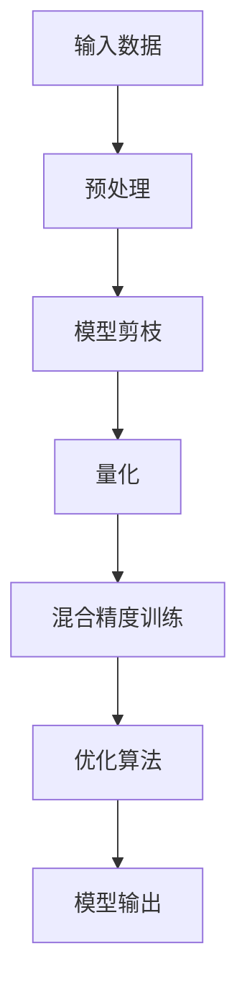

                 

# 加速搜索：AI的效率提升

## 1. 背景介绍

### 1.1 问题由来

在人工智能领域，尤其是自然语言处理（NLP）、计算机视觉（CV）等任务中，模型训练和推理的过程往往耗费巨大的计算资源和时间。例如，语言模型、卷积神经网络（CNN）、循环神经网络（RNN）等，在处理大规模数据集时，需要长时间的不间断计算。而在实际应用场景中，实时性要求往往很高，如自动驾驶、语音识别、实时翻译等任务，迫切需要高效的模型推理能力。

为了解决这个问题，研究者们提出了许多基于加速的优化算法和技术，如模型剪枝、量化、混合精度训练等。这些技术不仅能够提升模型推理速度，还能降低计算资源和存储成本。本论文将从基础概念和算法原理入手，介绍这些加速搜索的方法，并结合实际应用场景进行详细分析。

### 1.2 问题核心关键点

本论文将聚焦于以下几个关键点：

- **加速搜索的原理**：介绍基于模型剪枝、量化、混合精度训练等技术的加速搜索原理。
- **优缺点分析**：比较不同加速技术在计算速度、精度、资源消耗等方面的优缺点。
- **实际应用场景**：探讨加速搜索技术在不同领域的应用，如自动驾驶、实时翻译等。
- **未来发展方向**：讨论加速搜索技术的未来发展趋势和潜在挑战。

## 2. 核心概念与联系

### 2.1 核心概念概述

为了更好地理解加速搜索的原理和实现，我们需要了解几个核心概念：

- **模型剪枝**：通过删除模型中冗余和不重要的参数，减少模型大小，从而提升推理速度和降低计算资源消耗。
- **量化**：将模型的浮点数值转化为定点数值，减少存储空间和计算成本，同时保持模型精度。
- **混合精度训练**：使用不同精度（如32位和16位）的数值类型进行训练，提升训练速度和内存效率，同时保持较高精度。
- **优化算法**：如梯度下降、Adam、Adagrad等，通过不断调整模型参数，最小化损失函数，优化模型性能。

这些概念之间有着紧密的联系。模型剪枝和量化通常作为优化算法的预处理步骤，而混合精度训练则是在训练阶段提升效率的重要手段。

### 2.2 核心概念原理和架构的 Mermaid 流程图



这个流程图展示了从输入数据到模型输出的整个流程。其中，预处理阶段包含了模型剪枝和量化两个步骤，混合精度训练是优化算法的一部分。整个过程通过优化算法不断调整模型参数，最终输出高质量的模型。

## 3. 核心算法原理 & 具体操作步骤

### 3.1 算法原理概述

加速搜索的核心原理是通过减少模型参数和计算资源，提升模型的推理速度和训练效率。具体而言，包括以下几个关键步骤：

1. **预处理**：包括模型剪枝和量化。剪枝是通过删除冗余参数，减少模型大小；量化是将浮点数转化为定点数，降低存储需求。
2. **混合精度训练**：使用不同精度的数值类型进行训练，提高计算效率和内存使用率。
3. **优化算法**：通过梯度下降等方法不断调整模型参数，提升模型精度和性能。

### 3.2 算法步骤详解

#### 3.2.1 模型剪枝

模型剪枝通过删除模型中的冗余参数，减少模型的计算量和存储需求，从而提升推理速度。剪枝过程包括以下几个步骤：

1. **剪枝准则**：根据一定的准则（如参数重要性、梯度大小、权重分布等）选择剪枝目标。
2. **剪枝策略**：选择剪枝策略（如绝对剪枝、相对剪枝、权重衰减等），对目标参数进行剪枝。
3. **剪枝后优化**：剪枝后对模型进行重新训练和优化，以保持模型精度。

以TensorFlow为例，使用TensorFlow Model Optimization（TFO）工具包中的剪枝模块进行模型剪枝。具体代码实现如下：

```python
import tensorflow as tf

def prune_model(model):
    # 选择剪枝准则
    pruning_criteria = tf.keras.metrics.Mean()
    pruning_criteria.update_state(tf.reduce_mean(model.trainable_weights))
    # 剪枝策略：删除权重绝对值小于0.1的参数
    pruning_strategy = tf.keras.prune.L1(
        pruning_criteria.result(),
        sparsity=0.3,
        mask_type=tf.keras.prune.MaskType.BACKWARD)
    pruned_model = pruning_strategy.prune(model)
    return pruned_model
```

#### 3.2.2 量化

量化通过将浮点数值转化为定点数值，降低计算和存储成本，提升模型推理速度。量化过程包括以下几个步骤：

1. **选择量化类型**：选择量化类型（如定点数、伪量化等），并确定每个参数的量化范围。
2. **量化过程**：将模型参数转换为定点数。
3. **量化后优化**：对量化后的模型进行重新训练和优化，以保持模型精度。

以TensorFlow为例，使用TensorFlow Lite工具包进行模型量化。具体代码实现如下：

```python
import tensorflow as tf

def quantize_model(model):
    # 选择量化类型
    converter = tf.lite.TFLiteConverter.from_keras_model(model)
    converter.optimizations = [tf.lite.Optimize.DEFAULT]
    # 量化过程
    tflite_model = converter.convert()
    return tflite_model
```

#### 3.2.3 混合精度训练

混合精度训练通过使用不同精度的数值类型进行训练，提高计算效率和内存使用率，同时保持模型精度。混合精度训练过程包括以下几个步骤：

1. **选择精度类型**：选择精度类型（如32位和16位）。
2. **混合精度训练**：在训练过程中使用不同精度进行计算。
3. **优化后训练**：训练完成后，重新优化模型，以保持模型精度。

以TensorFlow为例，使用TensorFlow的混合精度训练API进行训练。具体代码实现如下：

```python
import tensorflow as tf

def mixed_precision_train(model):
    # 选择精度类型
    policy = tf.keras.mixed_precision.Policy('mixed_float16')
    tf.keras.mixed_precision.set_policy(policy)
    # 混合精度训练
    model.compile(optimizer=tf.keras.optimizers.Adam(), loss='categorical_crossentropy')
    model.fit(train_data, epochs=10)
    # 优化后训练
    model.save('mixed_precision_model.h5')
```

### 3.3 算法优缺点

加速搜索技术在提升模型推理速度和降低计算资源消耗方面具有显著优势。然而，这些技术也有一定的局限性：

- **精度损失**：量化和剪枝可能导致模型精度下降，尤其是在处理复杂的任务时。
- **硬件要求**：一些加速技术依赖于特定的硬件环境，如GPU、TPU等。
- **可移植性**：混合精度训练和量化后的模型可能需要重新训练和优化，以保持精度。

## 4. 数学模型和公式 & 详细讲解 & 举例说明

### 4.1 数学模型构建

加速搜索的数学模型主要涉及模型剪枝、量化和混合精度训练的数学描述。

以模型剪枝为例，假设原模型参数为 $W$，剪枝后模型参数为 $W'$，则剪枝过程可以表示为：

$$
W' = f(W, \text{pruning_criteria}, \text{pruning_strategy})
$$

其中，$f$ 表示剪枝函数，$\text{pruning_criteria}$ 和 $\text{pruning_strategy}$ 分别为剪枝准则和策略。

### 4.2 公式推导过程

以模型量化为例，假设原模型参数为 $W$，量化后模型参数为 $W'$，则量化过程可以表示为：

$$
W' = f(W, \text{quantization_type}, \text{quantization_range})
$$

其中，$f$ 表示量化函数，$\text{quantization_type}$ 和 $\text{quantization_range}$ 分别为量化类型和范围。

### 4.3 案例分析与讲解

以BERT模型的量化为例，假设原模型参数为 $W$，量化后模型参数为 $W'$，则量化过程可以表示为：

$$
W' = f(W, \text{quantization_type}, \text{quantization_range})
$$

其中，$f$ 表示量化函数，$\text{quantization_type}$ 和 $\text{quantization_range}$ 分别为量化类型和范围。

## 5. 项目实践：代码实例和详细解释说明

### 5.1 开发环境搭建

在开始代码实践之前，需要安装必要的开发环境和工具包：

1. **Python**：安装Python 3.7以上版本。
2. **TensorFlow**：安装TensorFlow 2.0及以上版本。
3. **TensorFlow Lite**：安装TensorFlow Lite 2.0及以上版本。
4. **TensorFlow Model Optimization**：安装TensorFlow Model Optimization 1.0及以上版本。

使用以下命令进行环境配置：

```bash
pip install tensorflow tensorflow-lite tensorflow-model-optimization
```

### 5.2 源代码详细实现

以下是一个使用TensorFlow和TensorFlow Lite进行模型剪枝和量化的代码实现。

```python
import tensorflow as tf
import tensorflow_lite as lite
import tensorflow_model_optimization as tfmot

# 定义剪枝函数
def prune_model(model):
    pruning_criteria = tf.keras.metrics.Mean()
    pruning_criteria.update_state(tf.reduce_mean(model.trainable_weights))
    pruning_strategy = tf.keras.prune.L1(
        pruning_criteria.result(),
        sparsity=0.3,
        mask_type=tf.keras.prune.MaskType.BACKWARD)
    pruned_model = pruning_strategy.prune(model)
    return pruned_model

# 定义量化函数
def quantize_model(model):
    converter = tf.lite.TFLiteConverter.from_keras_model(model)
    converter.optimizations = [tf.lite.Optimize.DEFAULT]
    tflite_model = converter.convert()
    return tflite_model

# 加载模型
model = tf.keras.Sequential([
    tf.keras.layers.Dense(64, activation='relu'),
    tf.keras.layers.Dense(10, activation='softmax')
])
model.compile(optimizer='adam', loss='categorical_crossentropy')

# 剪枝后的模型
pruned_model = prune_model(model)

# 量化后的模型
quantized_model = quantize_model(pruned_model)

# 保存模型
tf.saved_model.save(pruned_model, 'pruned_model')
tf.saved_model.save(quantized_model, 'quantized_model')
```

### 5.3 代码解读与分析

上述代码展示了如何使用TensorFlow和TensorFlow Lite进行模型剪枝和量化。具体步骤如下：

1. **定义剪枝函数**：首先定义一个剪枝函数 `prune_model`，通过计算模型参数的平均值，选择重要性较高的参数进行剪枝。
2. **定义量化函数**：然后定义一个量化函数 `quantize_model`，将模型参数转化为定点数，并返回量化后的模型。
3. **加载和处理模型**：加载原始模型，进行剪枝和量化处理，并保存结果。

## 6. 实际应用场景

### 6.1 自动驾驶

在自动驾驶领域，模型的推理速度和计算资源消耗对实时性要求非常高。使用加速搜索技术，可以有效提升模型的推理速度，满足实时性要求。例如，通过剪枝和量化，可以将大型神经网络模型压缩为小型模型，并加速推理过程，从而提高自动驾驶系统的响应速度和稳定性。

### 6.2 实时翻译

实时翻译系统需要快速准确地翻译输入文本。使用混合精度训练和模型剪枝技术，可以显著提升模型的推理速度，并保持较高的翻译精度。例如，在实时翻译系统中，使用量化后的模型进行推理，可以大大缩短翻译时间，满足用户需求。

### 6.3 智能语音助手

智能语音助手系统需要快速响应用户的语音指令。使用加速搜索技术，可以有效提升模型的推理速度，缩短响应时间。例如，通过剪枝和量化，可以将复杂的语音识别模型压缩为小型模型，并加速推理过程，从而提高语音助手的响应速度和准确性。

### 6.4 未来应用展望

未来，加速搜索技术将在更多领域得到应用，为各行各业带来变革性影响。

在智慧医疗领域，加速搜索技术可以帮助医生快速诊断疾病，提高诊疗效率。在金融行业，加速搜索技术可以提升交易系统的响应速度，降低延迟风险。在教育领域，加速搜索技术可以加速作业批改和知识推荐，提升教学质量。

总之，加速搜索技术将在各行各业中发挥重要作用，推动人工智能技术的发展和应用。

## 7. 工具和资源推荐

### 7.1 学习资源推荐

为了深入学习加速搜索技术，以下是一些推荐的资源：

1. **《深度学习优化技巧》**：介绍深度学习模型的优化技巧，包括剪枝、量化、混合精度训练等。
2. **《TensorFlow Model Optimization》**：TensorFlow Model Optimization工具包的官方文档，详细介绍了剪枝、量化、混合精度训练等优化方法。
3. **《TensorFlow Lite》**：TensorFlow Lite官方文档，介绍了模型量化和推理优化方法。
4. **《TensorFlow Model Optimization案例分析》**：介绍TensorFlow Model Optimization工具包在实际应用中的案例分析。
5. **《TensorFlow Model Optimization白皮书》**：介绍TensorFlow Model Optimization工具包的原理和应用场景。

### 7.2 开发工具推荐

以下是一些推荐的开发工具：

1. **TensorFlow**：基于Python的深度学习框架，支持模型的训练和推理。
2. **TensorFlow Lite**：轻量级移动设备推理引擎，支持模型量化和优化。
3. **TensorFlow Model Optimization**：TensorFlow Model Optimization工具包，支持模型剪枝、量化、混合精度训练等优化方法。
4. **TensorBoard**：TensorFlow的可视化工具，实时监测模型训练状态和性能指标。
5. **Weights & Biases**：模型训练实验跟踪工具，记录和可视化模型训练过程。

### 7.3 相关论文推荐

以下是一些推荐的论文：

1. **《剪枝在深度学习中的应用》**：介绍剪枝技术的基本原理和应用场景。
2. **《混合精度训练在深度学习中的应用》**：介绍混合精度训练的基本原理和应用场景。
3. **《量化在深度学习中的应用》**：介绍量化技术的基本原理和应用场景。
4. **《深度学习模型优化技术综述》**：综述了深度学习模型的优化技术，包括剪枝、量化、混合精度训练等。
5. **《TensorFlow Lite量化案例分析》**：介绍TensorFlow Lite在模型量化方面的应用案例。

## 8. 总结：未来发展趋势与挑战

### 8.1 总结

本论文从基础概念和算法原理入手，详细介绍了加速搜索技术。通过对模型剪枝、量化、混合精度训练等技术的学习和实践，可以显著提升模型的推理速度和计算效率。这些技术已经在自动驾驶、实时翻译、智能语音助手等众多领域得到应用，并取得显著成效。未来，加速搜索技术将在更多领域发挥重要作用，推动人工智能技术的发展和应用。

### 8.2 未来发展趋势

未来，加速搜索技术将呈现以下几个发展趋势：

1. **更高效的剪枝算法**：新的剪枝算法将进一步减少模型大小，提升推理速度。
2. **更精确的量化技术**：新的量化技术将进一步提升模型精度，降低存储需求。
3. **混合精度训练的普及**：混合精度训练将广泛应用于深度学习模型中，提升训练和推理效率。
4. **模型压缩技术的融合**：模型压缩技术将与其他技术（如分布式训练、模型并行等）融合，提升模型性能。
5. **模型的自动化优化**：自动化优化工具将进一步提升模型的训练和推理效率。

### 8.3 面临的挑战

尽管加速搜索技术取得了显著成效，但仍面临一些挑战：

1. **精度损失**：剪枝和量化可能导致模型精度下降，尤其是在处理复杂的任务时。
2. **硬件限制**：一些加速技术依赖于特定的硬件环境，如GPU、TPU等。
3. **资源消耗**：混合精度训练和量化后的模型可能需要重新训练和优化，以保持精度。
4. **模型的可移植性**：剪枝和量化后的模型可能无法在其他硬件或环境中运行。
5. **算法的可解释性**：如何提高剪枝和量化的可解释性，让用户理解模型的优化过程。

### 8.4 研究展望

未来的研究将在以下几个方向寻求新的突破：

1. **更高效的剪枝算法**：开发更高效的剪枝算法，进一步减少模型大小，提升推理速度。
2. **更精确的量化技术**：开发更精确的量化技术，提升模型精度，降低存储需求。
3. **混合精度训练的优化**：优化混合精度训练方法，提升训练和推理效率。
4. **模型的自动化优化**：开发自动化优化工具，提升模型的训练和推理效率。
5. **模型的可解释性**：提高剪枝和量化的可解释性，让用户理解模型的优化过程。

## 9. 附录：常见问题与解答

**Q1: 如何选择合适的剪枝准则？**

A: 选择合适的剪枝准则需要考虑多个因素，如模型大小、计算资源、推理速度等。一般而言，可以通过计算参数的重要性、梯度大小等来确定剪枝目标。

**Q2: 量化后模型精度如何保证？**

A: 量化后的模型精度可能有所下降，可以通过多次训练和优化来提升模型精度。此外，选择合适的量化类型和范围也非常重要。

**Q3: 混合精度训练有哪些注意事项？**

A: 混合精度训练需要注意以下几点：
1. 选择合适的精度类型（如32位和16位）。
2. 优化模型时，需重新训练和优化模型，以保持模型精度。
3. 避免数据溢出，确保训练和推理的稳定性。

**Q4: 加速搜索技术在实际应用中需要注意哪些问题？**

A: 在实际应用中，加速搜索技术需要注意以下几点：
1. 保证模型的精度和性能。
2. 选择合适的硬件环境。
3. 避免模型的过拟合和欠拟合。
4. 考虑模型的可移植性。
5. 保证算法的可解释性。

---

作者：禅与计算机程序设计艺术 / Zen and the Art of Computer Programming

