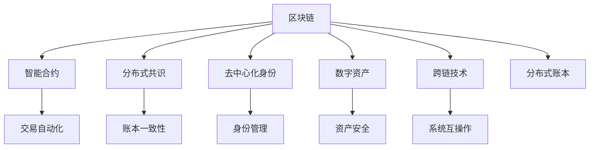

                 

# 区块链在数字政府中的应用与挑战

## 1. 背景介绍

### 1.1 问题由来
随着数字经济的蓬勃发展，政府数字化转型的需求愈发迫切。传统政务系统中存在的数据孤岛、效率低下、透明度不足等问题，亟需通过技术创新进行系统性解决。区块链作为一种新型的分布式账本技术，以其去中心化、透明公开、不可篡改等特点，为数字政府的建设提供了新的思路。

区块链技术在数字政府中的应用，主要集中在数据安全、治理透明、服务效能提升等方面。利用区块链技术，可以实现政务数据的分布式存储、共享和互操作，保障数据的安全性和完整性。同时，通过区块链技术，可以实现政府决策的透明化、参与度的增加，提升政务服务效率。

### 1.2 问题核心关键点
区块链在数字政府应用中的核心关键点包括：

- **数据透明性**：通过区块链的分布式账本和不可篡改特性，保证政务数据的透明和可追溯。
- **去中心化**：区块链的去中心化架构避免了单点故障，提升了系统的可靠性和安全性。
- **智能合约**：通过智能合约，实现自动化的政务流程，提高行政效率。
- **身份认证**：基于区块链的数字身份认证，可以解决传统身份认证中存在的问题，提升身份管理的可信度。
- **数据隐私保护**：利用区块链的加密技术，保护政务数据的隐私。
- **系统互操作**：通过区块链的跨链技术，实现不同系统间的数据互操作。

### 1.3 问题研究意义
区块链技术在数字政府中的应用，旨在解决传统政务系统中的痛点，提升政府治理的透明度、效率和公平性。具体来说，区块链可以：

- **提高政务透明度**：通过区块链的透明性和不可篡改性，保障政务决策过程的公开透明，提升公众信任。
- **提升政务效率**：通过智能合约和自动化流程，实现政务服务的快速响应和高效处理。
- **保障数据安全**：利用区块链的加密和分布式存储特性，保障政务数据的完整性和安全性。
- **促进跨部门协作**：通过区块链的跨链技术，实现不同政府部门间的数据共享和互操作，推动部门协同治理。

## 2. 核心概念与联系

### 2.1 核心概念概述

为了更好地理解区块链在数字政府中的应用，本节将介绍几个关键概念：

- **区块链（Blockchain）**：一种分布式账本技术，通过去中心化的方式，记录和验证交易数据的真实性，保障数据的安全性和透明性。
- **智能合约（Smart Contract）**：一种自动执行的合约，利用区块链的脚本语言编写，一旦满足预设条件，合约自动执行。
- **分布式共识（Consensus）**：区块链网络中节点间达成共识的过程，保障账本的不可篡改性和一致性。
- **去中心化身份（Decentralized Identity）**：利用区块链技术，实现用户的去中心化身份管理和认证，提升身份管理的可信度。
- **数字资产（Digital Assets）**：在区块链上以数字形式存在的资产，如数字货币、电子合同等。
- **跨链技术（Cross-chain）**：实现不同区块链间的互操作，促进不同系统间的互联互通。

这些核心概念之间的逻辑关系可以通过以下Mermaid流程图来展示：



这个流程图展示了几大关键概念之间的关系：

1. 区块链作为基础，记录和验证交易数据，提供分布式账本和不可篡改性。
2. 智能合约在区块链上自动执行，保障交易的自动性和安全性。
3. 分布式共识保障区块链网络的一致性和信任度。
4. 去中心化身份利用区块链技术，实现用户的可信身份管理。
5. 数字资产在区块链上存在，保障其安全性和可转移性。
6. 跨链技术实现不同区块链之间的互操作，促进不同系统间的互联互通。

这些概念共同构成了区块链技术在数字政府应用的基础框架，为其提供了解决问题的技术支撑。

## 3. 核心算法原理 & 具体操作步骤
### 3.1 算法原理概述

区块链在数字政府应用中的核心算法原理主要涉及分布式账本技术、智能合约技术、分布式共识机制等。具体来说：

- **分布式账本技术**：通过区块链的分布式存储机制，实现数据的分布式记录和共享。
- **智能合约技术**：通过区块链的脚本语言，实现自动化的政务流程。
- **分布式共识机制**：通过节点间的共识算法，保障区块链网络的一致性和信任度。

### 3.2 算法步骤详解

基于区块链的数字政府应用一般包括以下几个关键步骤：

**Step 1: 数据上链**
- 将政务数据按照区块链的规范进行编码，确保数据格式符合区块链的存储要求。
- 将数据通过分布式共识机制，在区块链上进行记录和验证。

**Step 2: 智能合约执行**
- 设计智能合约，定义政务流程的逻辑规则和操作权限。
- 将智能合约部署到区块链上，并设定触发条件。

**Step 3: 身份认证**
- 利用区块链的去中心化身份认证技术，为用户生成数字身份。
- 通过智能合约，验证数字身份的有效性，实现身份认证的自动化。

**Step 4: 跨链互操作**
- 利用区块链的跨链技术，实现不同区块链系统间的互操作。
- 通过区块链网络，实现政务数据的共享和互操作。

**Step 5: 系统维护**
- 通过区块链的网络维护机制，定期更新区块链网络，保证系统的稳定性和可靠性。

### 3.3 算法优缺点

区块链在数字政府应用中具有以下优点：

- **数据透明性**：通过区块链的分布式账本和不可篡改特性，保证政务数据的透明和可追溯。
- **去中心化**：区块链的去中心化架构避免了单点故障，提升了系统的可靠性和安全性。
- **智能合约**：通过智能合约，实现自动化的政务流程，提高行政效率。
- **身份认证**：基于区块链的数字身份认证，可以解决传统身份认证中存在的问题，提升身份管理的可信度。
- **数据隐私保护**：利用区块链的加密技术，保护政务数据的隐私。
- **系统互操作**：通过区块链的跨链技术，实现不同系统间的数据共享和互操作。

同时，该方法也存在一定的局限性：

- **性能瓶颈**：区块链的性能受限于网络规模和共识算法，大规模数据上链和操作可能面临性能瓶颈。
- **技术门槛高**：区块链技术的复杂性导致其在实际应用中存在较高的技术门槛，需要专业的技术团队进行开发和维护。
- **标准化不足**：不同区块链系统之间的互操作性不足，缺乏统一的标准和规范。
- **成本高**：区块链技术的开发、部署和维护成本较高，需要投入大量的资源和技术支持。

尽管存在这些局限性，但区块链技术的诸多优势使其在数字政府中的应用前景广阔。未来相关研究的重点在于如何进一步降低区块链技术的开发和部署成本，提高其性能，同时优化跨链互操作，构建更加统一和标准化的数字政府基础设施。

### 3.4 算法应用领域

区块链技术在数字政府中的应用，涵盖了从数据管理到政务服务的多个领域，具体包括：

- **电子政务**：利用区块链技术，实现政务数据的分布式存储和共享，保障数据的透明性和安全性。
- **电子投票**：通过区块链的去中心化特性，保障投票过程的透明和公正。
- **数字身份认证**：利用区块链的去中心化身份认证技术，提升身份管理的可信度和安全性。
- **电子合同**：利用区块链的智能合约技术，实现自动化的合同执行和监控。
- **溯源管理**：利用区块链的不可篡改特性，实现产品的全生命周期溯源管理。
- **社会治理**：通过区块链的透明性和不可篡改性，实现政务决策的透明化和参与度的增加。

## 4. 数学模型和公式 & 详细讲解 & 举例说明

### 4.1 数学模型构建

为了更好地理解区块链在数字政府中的应用，我们首先定义相关的数学模型。

**1. 分布式账本模型**
分布式账本模型可以表示为：
$$
B = \{T_0, T_1, T_2, \ldots\}
$$
其中 $T_i$ 表示第 $i$ 个区块，包含了若干个交易记录。

**2. 智能合约模型**
智能合约模型可以表示为：
$$
C = \{c_0, c_1, c_2, \ldots\}
$$
其中 $c_i$ 表示第 $i$ 个智能合约，定义了相应的逻辑规则和操作权限。

**3. 分布式共识模型**
分布式共识模型可以表示为：
$$
V = \{v_0, v_1, v_2, \ldots\}
$$
其中 $v_i$ 表示第 $i$ 个共识节点，负责验证和维护区块链网络的完整性。

### 4.2 公式推导过程

**1. 分布式账本模型的推导**

在分布式账本模型中，每个区块 $T_i$ 包含若干个交易记录 $t_j$。设交易记录 $t_j$ 的哈希值为 $H_j$，则有：
$$
H_j = \text{hash}(T_i)
$$
其中 $\text{hash}$ 表示哈希函数，将交易记录 $t_j$ 哈希为哈希值 $H_j$。

**2. 智能合约模型的推导**

智能合约模型 $C$ 中的每个合约 $c_i$ 由一系列代码片段 $s_j$ 组成。设 $s_j$ 的代码片段对应的操作为 $o_j$，则有：
$$
o_j = \text{execute}(s_j)
$$
其中 $\text{execute}$ 表示执行操作函数，将代码片段 $s_j$ 执行为操作 $o_j$。

**3. 分布式共识模型的推导**

分布式共识模型 $V$ 中的每个节点 $v_i$ 负责验证交易记录和智能合约的正确性。设节点 $v_i$ 验证的区块为 $T_k$，其验证结果为 $V_k$，则有：
$$
V_k = \text{validate}(T_k, \{c_j\})
$$
其中 $\text{validate}$ 表示验证函数，将区块 $T_k$ 和智能合约 $c_j$ 验证为 $V_k$。

### 4.3 案例分析与讲解

**案例一：电子投票**

在电子投票应用中，利用区块链的去中心化特性，保障投票过程的透明和公正。具体步骤如下：

**Step 1: 数据上链**
- 将每个选民的投票记录按照区块链的规范进行编码，确保数据格式符合区块链的存储要求。
- 将投票记录通过分布式共识机制，在区块链上进行记录和验证。

**Step 2: 智能合约执行**
- 设计智能合约，定义投票规则和操作权限，如投票、计票、结果公布等。
- 将智能合约部署到区块链上，并设定触发条件，如投票开始、计票完成、结果公布等。

**Step 3: 身份认证**
- 利用区块链的去中心化身份认证技术，为每个选民生成数字身份。
- 通过智能合约，验证数字身份的有效性，实现身份认证的自动化。

**Step 4: 结果公布**
- 利用智能合约，自动统计投票结果，并通过区块链的透明特性，向选民公开投票结果。

**案例二：数字身份认证**

在数字身份认证应用中，利用区块链的去中心化特性，提升身份管理的可信度和安全性。具体步骤如下：

**Step 1: 数据上链**
- 将每个用户的身份信息按照区块链的规范进行编码，确保数据格式符合区块链的存储要求。
- 将身份信息通过分布式共识机制，在区块链上进行记录和验证。

**Step 2: 智能合约执行**
- 设计智能合约，定义身份验证的逻辑规则和操作权限，如验证、更新等。
- 将智能合约部署到区块链上，并设定触发条件，如身份验证请求、身份信息更新等。

**Step 3: 身份认证**
- 利用区块链的去中心化身份认证技术，为用户生成数字身份。
- 通过智能合约，验证数字身份的有效性，实现身份认证的自动化。

**Step 4: 身份管理**
- 利用智能合约，对用户的身份信息进行管理和更新，确保身份数据的准确性和安全性。

## 5. 项目实践：代码实例和详细解释说明
### 5.1 开发环境搭建

在进行区块链应用开发前，我们需要准备好开发环境。以下是使用Python和Hyperledger Fabric进行区块链开发的环境配置流程：

1. 安装Anaconda：从官网下载并安装Anaconda，用于创建独立的Python环境。

2. 创建并激活虚拟环境：
```bash
conda create -n blockchain-env python=3.8 
conda activate blockchain-env
```

3. 安装Hyperledger Fabric：根据版本要求，从官网获取对应的安装命令。例如：
```bash
conda install hyperledger-fabric
```

4. 安装各类工具包：
```bash
pip install numpy pandas scikit-learn matplotlib tqdm jupyter notebook ipython
```

完成上述步骤后，即可在`blockchain-env`环境中开始区块链应用开发。

### 5.2 源代码详细实现

这里我们以电子投票应用为例，给出使用Hyperledger Fabric进行区块链应用开发的Python代码实现。

首先，定义电子投票的数据结构：

```python
from hyperledger_fabric.sdk.util import json as json_util

class Vote:
    def __init__(self, votes):
        self.votes = votes
        self.voter_ids = []
        self.valid = True
        
    def add_voter(self, voter_id):
        self.votes[voter_id] = 0
        self.voter_ids.append(voter_id)
        
    def vote(self, voter_id, candidate_id):
        if voter_id in self.voter_ids:
            self.votes[voter_id] += 1
            return True
        else:
            return False
        
    def count(self, candidate_id):
        return self.votes[candidate_id]
        
    def __str__(self):
        return json_util.dumps(self.votes)
```

然后，定义智能合约的接口：

```python
from hyperledger_fabric.sdk leverages import Chaincode

class VoteContract(Chaincode):
    def __init__(self):
        super(VoteContract, self).__init__()
        self.votes = {}
        
    @Chaincode.func()
    def vote(self, tx_id, request):
        voter_id, candidate_id = request
        if voter_id not in self.votes:
            self.votes[voter_id] = {candidate_id: 0}
        self.votes[voter_id][candidate_id] += 1
        return json_util.dumps(self.votes)
        
    @Chaincode.func()
    def count(self, tx_id, request):
        voter_id, candidate_id = request
        if voter_id in self.votes and candidate_id in self.votes[voter_id]:
            return json_util.dumps({candidate_id: self.votes[voter_id][candidate_id]})
        else:
            return json_util.dumps({})
        
    @Chaincode.func()
    def add_voter(self, tx_id, request):
        voter_id = request
        self.votes[voter_id] = {}
        return json_util.dumps(self.votes)
        
    @Chaincode.func()
    def valid(self, tx_id, request):
        return json_util.dumps({"valid": True})
```

接下来，启动区块链网络和智能合约：

```python
from hyperledger_fabric.sdk import FabricCAServices
from hyperledger_fabric.sdk hubs import Hubs
from hyperledger_fabric.sdk identity import ID

# 创建Hubs实例，连接到Fabric网络
hubs = Hubs()
hubs.add(identity="user1.example.com", service=FabricCAServices())

# 创建通道
channel = hubs.get_channel("vote")

# 注册智能合约
contract = VoteContract()
chaincode_id = "vote"
hubs.register("vote", channel, chaincode_id, contract)
```

最后，测试电子投票应用：

```python
from hyperledger_fabric.sdk leverages import Chaincode

# 获取区块链网络中的所有用户
users = hubs.get_identity_service().get_all_identites()

# 用户投票
voter_id = "user1.example.com"
candidate_id = "candidate1"
contract.vote(voter_id, candidate_id)

# 查看投票结果
votes = contract.count(voter_id, candidate_id)

# 输出投票结果
print(votes)
```

以上就是使用Hyperledger Fabric进行电子投票应用开发的完整代码实现。可以看到，利用Hyperledger Fabric，开发者可以很方便地实现智能合约和区块链网络的管理，通过简单的代码实现复杂的业务逻辑。

### 5.3 代码解读与分析

让我们再详细解读一下关键代码的实现细节：

**Vote类**：
- `__init__`方法：初始化投票记录和投票人信息。
- `add_voter`方法：添加新的投票人。
- `vote`方法：记录投票人的投票结果。
- `count`方法：统计候选人的投票数量。
- `__str__`方法：将投票记录转换为JSON字符串，方便输出。

**VoteContract类**：
- `__init__`方法：初始化智能合约，创建一个空字典。
- `vote`方法：记录投票人的投票结果。
- `count`方法：统计候选人的投票数量。
- `add_voter`方法：添加新的投票人。
- `valid`方法：检查投票的有效性。

**区块链网络测试**：
- 获取区块链网络中的所有用户。
- 用户投票，记录投票结果。
- 统计投票结果，并输出。

可以看到，Hyperledger Fabric使得区块链应用的开发变得更加简单高效，无需深入理解底层共识算法和分布式账本技术，即可实现复杂的业务逻辑。

当然，实际系统开发中还需要考虑更多因素，如节点管理、链码部署、跨链互操作等，但核心的区块链应用开发流程与此类似。

## 6. 实际应用场景
### 6.1 智能合约与政务服务

在智能合约与政务服务应用中，利用区块链的自动化特性，实现政务服务的自动审批、监督等。具体而言：

**案例一：电子审批**
- 利用智能合约，定义政务审批的流程和条件，如申请、审查、批准等。
- 将智能合约部署到区块链上，并将申请材料上传区块链，自动触发审批流程。
- 通过智能合约的逻辑规则，自动监督审批过程，保障审批的公正性和透明性。

**案例二：行政监督**
- 利用智能合约，定义行政监督的逻辑规则和操作权限，如记录、查询、统计等。
- 将智能合约部署到区块链上，并将行政记录上传区块链，自动触发监督流程。
- 通过智能合约的逻辑规则，自动统计监督结果，生成监督报告。

### 6.2 数字身份与公共安全

在数字身份与公共安全应用中，利用区块链的去中心化特性，提升身份管理的可信度和安全性。具体而言：

**案例一：数字身份认证**
- 利用区块链的去中心化身份认证技术，为用户生成数字身份。
- 通过智能合约，验证数字身份的有效性，实现身份认证的自动化。

**案例二：公共安全监控**
- 利用区块链的去中心化特性，记录和共享公共安全事件信息。
- 通过智能合约，定义公共安全事件的处理流程和操作权限，如记录、查询、报警等。
- 通过智能合约的逻辑规则，自动监督公共安全事件的处理过程，保障事件处理的透明性和公正性。

### 6.3 数字资产与金融服务

在数字资产与金融服务应用中，利用区块链的不可篡改特性，保障金融交易的安全性和透明性。具体而言：

**案例一：电子合同**
- 利用区块链的智能合约技术，实现自动化的合同执行和监控。
- 将合同条款和执行条件写入智能合约，并部署到区块链上。
- 通过智能合约的逻辑规则，自动执行合同，并在执行过程中进行监控和记录。

**案例二：数字货币交易**
- 利用区块链的不可篡改特性，记录和验证数字货币交易的合法性。
- 将数字货币交易信息上传区块链，通过智能合约的逻辑规则，自动验证交易的合法性和真实性。

### 6.4 未来应用展望

展望未来，区块链技术在数字政府中的应用将呈现以下几个趋势：

**趋势一：跨链互操作性提升**
随着区块链技术的发展，跨链互操作性将逐渐增强。不同区块链系统之间的数据和信息共享将变得更加高效，推动政府部门之间的协同治理。

**趋势二：智能合约自动化水平提升**
智能合约的自动化水平将进一步提升，利用区块链的去中心化和不可篡改特性，实现更多复杂的政务流程自动化，提升政务效率。

**趋势三：身份认证和管理**
区块链的去中心化身份认证技术将得到更广泛的应用，提升身份管理的可信度和安全性。

**趋势四：数字资产和金融服务**
数字资产和金融服务将更加普及，利用区块链的不可篡改特性，保障金融交易的安全性和透明性。

**趋势五：数据透明和安全**
区块链将推动政务数据的透明和安全，保障数据的完整性和不可篡改性。

这些趋势凸显了区块链技术在数字政府应用中的广泛前景。随着技术的不断发展和成熟，区块链必将在政府数字化转型中发挥更大的作用，推动政府治理的透明、公平和高效。

## 7. 工具和资源推荐
### 7.1 学习资源推荐

为了帮助开发者系统掌握区块链技术在数字政府中的应用，这里推荐一些优质的学习资源：

1. 《区块链基础与前沿技术》课程：由知名区块链专家授课，涵盖区块链的基本原理、应用场景和前沿技术，适合入门学习。
2. 《Hyperledger Fabric官方文档》：Hyperledger Fabric的官方文档，提供了完整的区块链开发指南和样例代码，是开发区块链应用的必备资源。
3. 《区块链智能合约开发实战》书籍：详细介绍了区块链智能合约的开发流程和技术细节，适合有一定区块链基础的开发者。
4. 《Hyperledger Fabric开发者手册》：Hyperledger Fabric的开发者手册，提供了详细的区块链网络管理和智能合约部署指导，适合进阶学习。
5. 《区块链与数字政府》论文集：收录了大量区块链在数字政府应用中的经典案例和研究成果，适合深入学习。

通过对这些资源的学习实践，相信你一定能够快速掌握区块链技术在数字政府应用的基本原理和实践技巧，并用于解决实际的政务问题。

### 7.2 开发工具推荐

高效的区块链应用开发离不开优秀的工具支持。以下是几款用于区块链应用开发的常用工具：

1. Hyperledger Fabric：Hyperledger Fabric是IBM开发的一款区块链平台，提供了完整的区块链开发和部署框架，支持智能合约、共识机制、跨链互操作等。
2. Ethereum：Ethereum是目前应用最广泛的公有链平台，支持智能合约、去中心化应用（DApps）和跨链互操作。
3. ConsenSys：ConsenSys是一家专注于区块链技术的开发和研究机构，提供了丰富的区块链开发工具和资源，支持Hyperledger Fabric、Ethereum等主流区块链平台。
4. Chaincode工具链：Hyperledger Fabric提供的智能合约开发工具链，支持智能合约的编写、调试和部署。
5. Truffle框架：Truffle是一个基于Ethereum的开发框架，提供了智能合约开发、测试和部署的全面支持。

合理利用这些工具，可以显著提升区块链应用的开发效率，加快创新迭代的步伐。

### 7.3 相关论文推荐

区块链技术在数字政府中的应用源于学界的持续研究。以下是几篇奠基性的相关论文，推荐阅读：

1. 《Blockchain Technology and Government Services》：详细介绍了区块链技术在政府服务中的应用，包括数据透明、身份认证、电子投票等。
2. 《Blockchain for Smart Cities: Current State and Future Prospects》：探讨了区块链在智慧城市治理中的应用，包括数据共享、协同治理等。
3. 《A Survey on Blockchain for Digital Government: Opportunities and Challenges》：综述了区块链在数字政府应用中的现状、应用场景和面临的挑战，提供了深入的学术分析。
4. 《Smart Contracts in Government Services: An Exploratory Study》：探讨了智能合约在政务服务中的应用，包括电子审批、行政监督等。
5. 《Digital Identity in Government Services: Blockchain-Based Solutions》：探讨了区块链在数字身份管理中的应用，包括身份认证、安全管理等。

这些论文代表了大语言模型微调技术的发展脉络。通过学习这些前沿成果，可以帮助研究者把握学科前进方向，激发更多的创新灵感。

## 8. 总结：未来发展趋势与挑战

### 8.1 总结

本文对区块链在数字政府中的应用进行了全面系统的介绍。首先阐述了区块链技术在数字政府应用中的背景和意义，明确了区块链在提升政务透明度、效率和公平性方面的独特价值。其次，从原理到实践，详细讲解了区块链的数学模型和操作步骤，给出了区块链应用的完整代码实现。同时，本文还广泛探讨了区块链技术在政务服务、身份认证、数字资产等方面的应用前景，展示了区块链技术的广阔前景。此外，本文精选了区块链技术的各类学习资源，力求为读者提供全方位的技术指引。

通过本文的系统梳理，可以看到，区块链技术在数字政府中的应用前景广阔，其去中心化、透明公开、不可篡改等特性，能够有效解决传统政务系统中的痛点，提升政府治理的透明度和效率。未来，伴随区块链技术的不断发展和成熟，必将在数字政府建设中发挥更大的作用，推动政府治理的全面数字化转型。

### 8.2 未来发展趋势

展望未来，区块链技术在数字政府应用中呈现以下几个发展趋势：

**趋势一：跨链互操作性提升**
随着区块链技术的发展，跨链互操作性将逐渐增强。不同区块链系统之间的数据和信息共享将变得更加高效，推动政府部门之间的协同治理。

**趋势二：智能合约自动化水平提升**
智能合约的自动化水平将进一步提升，利用区块链的去中心化和不可篡改特性，实现更多复杂的政务流程自动化，提升政务效率。

**趋势三：身份认证和管理**
区块链的去中心化身份认证技术将得到更广泛的应用，提升身份管理的可信度和安全性。

**趋势四：数字资产和金融服务**
数字资产和金融服务将更加普及，利用区块链的不可篡改特性，保障金融交易的安全性和透明性。

**趋势五：数据透明和安全**
区块链将推动政务数据的透明和安全，保障数据的完整性和不可篡改性。

这些趋势凸显了区块链技术在数字政府应用中的广泛前景。随着技术的不断发展和成熟，区块链必将在政府数字化转型中发挥更大的作用，推动政府治理的透明、公平和高效。

### 8.3 面临的挑战

尽管区块链技术在数字政府中的应用前景广阔，但在迈向更加智能化、普适化应用的过程中，它仍面临诸多挑战：

**挑战一：技术门槛高**
区块链技术的复杂性导致其在实际应用中存在较高的技术门槛，需要专业的技术团队进行开发和维护。

**挑战二：性能瓶颈**
区块链的性能受限于网络规模和共识算法，大规模数据上链和操作可能面临性能瓶颈。

**挑战三：标准化不足**
不同区块链系统之间的互操作性不足，缺乏统一的标准和规范。

**挑战四：成本高**
区块链技术的开发、部署和维护成本较高，需要投入大量的资源和技术支持。

尽管存在这些挑战，但区块链技术的诸多优势使其在数字政府中的应用前景广阔。未来相关研究的重点在于如何进一步降低区块链技术的开发和部署成本，提高其性能，同时优化跨链互操作，构建更加统一和标准化的数字政府基础设施。

### 8.4 研究展望

面对区块链技术在数字政府应用中面临的挑战，未来的研究需要在以下几个方面寻求新的突破：

**研究一：降低技术门槛**
探索更加易用的区块链开发框架和技术工具，降低技术门槛，推动区块链在政务应用中的普及。

**研究二：提升性能**
研究高性能的共识算法和链码优化技术，提升区块链的性能和可扩展性。

**研究三：标准化**
推动区块链技术在数字政府应用中的标准化建设，制定统一的技术规范和标准。

**研究四：成本优化**
研究区块链技术的成本优化技术，降低开发、部署和维护成本。

**研究五：跨链互操作**
研究跨链互操作技术，推动不同区块链系统之间的数据共享和互操作，构建更高效的数字政府生态。

这些研究方向将推动区块链技术在数字政府应用中的不断发展，提升其普适性和适用性，促进政府数字化转型的全面推进。

## 9. 附录：常见问题与解答

**Q1：区块链在数字政府应用中能否完全取代传统政务系统？**

A: 区块链技术在数字政府应用中能够提升政务透明度、效率和公平性，但并不能完全取代传统政务系统。区块链更多地是一种补充和增强手段，能够与传统政务系统协同工作，提升整体治理能力。

**Q2：区块链技术在数字政府应用中面临哪些主要挑战？**

A: 区块链技术在数字政府应用中面临的主要挑战包括技术门槛高、性能瓶颈、标准化不足和成本高等问题。这些问题需要通过技术创新和政策支持来逐步解决。

**Q3：区块链技术在数字政府应用中能否实现数据透明和不可篡改？**

A: 区块链技术在数字政府应用中能够实现数据的透明和不可篡改，但需注意区块链数据的存储和传输过程中的安全性。

**Q4：区块链技术在数字政府应用中能否提升政务效率？**

A: 区块链技术在数字政府应用中能够实现政务流程的自动化和透明化，提升政务效率。但需注意区块链网络的部署和管理成本。

**Q5：区块链技术在数字政府应用中能否保障数据安全？**

A: 区块链技术在数字政府应用中能够保障数据的透明和安全，但需注意区块链网络的隐私保护和数据安全。

**Q6：区块链技术在数字政府应用中能否实现去中心化身份认证？**

A: 区块链技术在数字政府应用中能够实现去中心化身份认证，但需注意区块链技术的可扩展性和性能瓶颈。

**Q7：区块链技术在数字政府应用中能否实现跨链互操作？**

A: 区块链技术在数字政府应用中能够实现跨链互操作，但需注意跨链互操作的标准化和技术难度。

通过对这些问题的回答，可以看到区块链技术在数字政府应用中的潜力与挑战，期待更多研究者和开发者一起推动区块链技术的普及和应用，共同构建透明、高效、安全的数字政府。

---

作者：禅与计算机程序设计艺术 / Zen and the Art of Computer Programming

