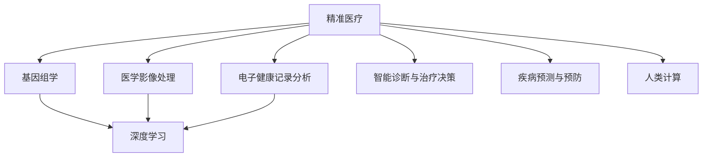

                 

# 医疗保健的未来：人类计算助力精准医疗

> 关键词：精准医疗,医疗大数据,人类计算,人工智能,医疗影像,基因组学

## 1. 背景介绍

### 1.1 问题由来

近年来，随着技术的飞速发展，医疗保健领域正经历一场深刻变革。从电子健康记录(EHR)到远程监控，从影像诊断到基因组测序，数字化、智能化手段在医疗服务中得到了广泛应用。然而，尽管技术日益先进，医疗服务的精准性和个性化仍然是一个巨大的挑战。传统的医疗模式基于经验诊断，缺乏数据驱动的决策支持。个体化医疗方案的设计和实施往往依赖医生的人工直觉，难以实现精确的疾病预测和个性化治疗。

为了应对这一挑战，精准医疗应运而生。精准医疗是一种以个体化医疗为基础的医疗模式，旨在通过基因组学、医学影像、电子健康记录等多维数据，实现对疾病的精细化诊断、治疗和预后评估。精准医疗的应用不仅能显著提升治疗效果，降低医疗成本，还能改善患者生活质量。

然而，精准医疗的实现离不开对海量数据的深度分析和高效计算。传统医疗数据的处理方式无法满足这一需求，亟需新型计算技术手段的支持。人类计算(Human Computing)作为一种新型的计算模式，通过将复杂计算任务分配给人类来提高计算效率，有望在精准医疗领域发挥重要作用。

### 1.2 问题核心关键点

精准医疗的核心在于对数据的深度挖掘和智能决策。具体而言，可以从以下几个方面进行概括：

1. **基因组学数据处理**：基因组学是精准医疗的重要基础，通过基因组测序等技术，可以获取患者个体的基因信息。然而，基因组数据的海量性和复杂性，使得传统算法难以处理。

2. **医学影像分析**：医学影像如CT、MRI等，包含了丰富的病理信息。通过深度学习和人类计算，可以从海量影像数据中自动提取特征，辅助医生进行精准诊断。

3. **电子健康记录分析**：电子健康记录(EHR)包含大量的临床数据，通过数据挖掘和机器学习，可以发现疾病模式和相关因素，为个性化治疗提供依据。

4. **智能诊断与治疗决策**：基于上述数据，智能算法可以辅助医生进行疾病诊断和治疗方案的制定，提升诊断和治疗的精准性和个性化。

5. **疾病预测与预防**：通过分析基因组数据、环境因素和行为习惯等多维信息，可以预测疾病风险，为疾病预防和早期干预提供支持。

这些核心问题构成了精准医疗的核心挑战，同时也为大规模人类计算的应用提供了广阔空间。

## 2. 核心概念与联系

### 2.1 核心概念概述

为了更好地理解人类计算在精准医疗中的应用，本节将介绍几个关键概念：

- **精准医疗**：一种以个体化医疗为基础的医疗模式，通过基因组学、医学影像、电子健康记录等多维数据，实现对疾病的精细化诊断、治疗和预后评估。

- **医疗大数据**：指医疗领域产生的大量数据，包括基因组数据、医学影像、电子健康记录、临床试验数据等。医疗大数据的处理和分析是精准医疗实现的基础。

- **人类计算**：一种新型的计算模式，通过将复杂计算任务分配给人类，借助人的认知和直觉，提高计算效率和准确性。

- **深度学习**：一种基于神经网络的机器学习方法，通过多层非线性变换，从数据中学习抽象特征，具有强大的模式识别能力。

- **医学影像处理**：通过算法和人类计算，对医学影像数据进行处理和分析，提取病理信息，辅助医生进行精准诊断。

- **基因组学**：研究基因的组成、结构、功能及其变异规律的学科。基因组学数据是精准医疗的基础。

这些概念之间的联系可以借助以下Mermaid流程图来展示：



这个流程图展示了大数据处理和人类计算在精准医疗中的应用路径：

1. **数据采集**：通过基因组测序、医学影像、电子健康记录等手段，收集患者的多维数据。
2. **数据处理**：利用深度学习等技术，对数据进行特征提取和模式识别。
3. **智能决策**：基于处理后的数据，通过智能算法进行诊断和治疗方案的制定。
4. **人类计算**：将复杂的计算任务分配给人类，利用人类直觉和经验进行辅助决策。
5. **疾病预防**：通过分析多维数据，预测疾病风险，进行早期干预和预防。

这些概念共同构成了精准医疗的计算框架，为人类的健康福祉提供了有力支持。

## 3. 核心算法原理 & 具体操作步骤
### 3.1 算法原理概述

精准医疗中的人类计算主要集中在以下几个关键算法：

- **基因组学数据分析**：利用序列比对、变体识别、通路分析等算法，对基因组数据进行深度分析。
- **医学影像处理**：通过分割、分类、配准等技术，从医学影像中提取病理信息。
- **电子健康记录分析**：通过数据挖掘和关联规则学习，发现疾病模式和相关因素。
- **智能诊断与治疗决策**：通过机器学习算法，辅助医生进行疾病诊断和治疗方案的选择。
- **疾病预测与预防**：利用多维数据进行风险预测，制定预防策略。

这些算法的基本原理和方法可以从数学和计算模型上进行详细分析。

### 3.2 算法步骤详解

以下以**医学影像处理**为例，详细讲解人类计算在其中的操作步骤：

**Step 1: 数据准备**
- 收集大量医学影像数据，包括CT、MRI、PET等，每个影像有对应的标注标签。
- 预处理数据，包括去噪、归一化、分割等步骤，确保数据的一致性和质量。

**Step 2: 特征提取**
- 利用深度学习算法，如卷积神经网络(CNN)，对影像进行特征提取。
- 通过卷积、池化等操作，捕捉影像中的关键特征，如肿瘤形态、大小、位置等。
- 利用人类计算，对深度学习的输出结果进行初步审核和修正，确保特征的准确性。

**Step 3: 病理识别**
- 基于提取的特征，利用分类器对影像进行病理识别。
- 常见的分类器包括SVM、随机森林等，也可以通过集成学习方法提升分类效果。
- 利用人类计算，结合医学知识和经验，对分类结果进行验证和修正。

**Step 4: 结果输出**
- 将分类结果输出给医生，作为辅助诊断的依据。
- 医生可以结合自己的专业知识和经验，进行最终的诊断和治疗决策。

### 3.3 算法优缺点

人类计算在医学影像处理中的优势和劣势如下：

**优势**：
- **高精度**：人类计算结合深度学习的输出结果，可以提高诊断的精度和准确性。
- **灵活性**：人类计算可以灵活应对深度学习难以处理的问题，提高算法的鲁棒性。
- **专业知识**：医学影像处理涉及大量专业知识，人类计算可以结合医生的专业知识和经验，提升诊断效果。

**劣势**：
- **效率较低**：人类计算需要大量时间和精力，相比于深度学习算法，效率较低。
- **主观性强**：人类计算依赖医生的主观判断，存在一定的主观性和偏差。
- **成本较高**：需要配备专业医生进行计算，成本较高。

### 3.4 算法应用领域

人类计算在医学影像处理中的应用非常广泛，涵盖以下几个领域：

1. **肿瘤检测**：通过影像处理和人类计算，辅助医生进行肿瘤的检测和分类。
2. **病变分析**：利用深度学习提取特征，人类计算结合医学知识进行病变分析，提升诊断准确性。
3. **介入治疗**：通过影像引导手术器械，辅助医生进行精准介入治疗。
4. **医学教育**：利用医学影像数据和人类计算结果，进行医学教育和培训，提升医生的诊断水平。
5. **公共卫生**：分析大规模影像数据，发现疾病分布规律，为公共卫生决策提供支持。

这些应用领域展示了人类计算在医学影像处理中的强大潜力，为精准医疗提供了坚实的基础。

## 4. 数学模型和公式 & 详细讲解  
### 4.1 数学模型构建

医学影像处理的数学模型可以表示为：

$$
y = f(x; \theta)
$$

其中，$x$ 为输入的医学影像数据，$\theta$ 为模型的参数，$f$ 为特征提取和分类器，$y$ 为输出的病理诊断结果。

### 4.2 公式推导过程

以肿瘤检测为例，计算模型的公式推导如下：

**Step 1: 特征提取**
- 利用深度学习算法提取影像特征，输出为 $x_{\text{features}}$。
- 特征提取过程可以表示为：
$$
x_{\text{features}} = f_{\text{features}}(x)
$$

**Step 2: 病理分类**
- 利用分类器对提取的特征进行分类，输出为 $y_{\text{class}}$。
- 分类器可以是SVM、随机森林等，公式如下：
$$
y_{\text{class}} = f_{\text{class}}(x_{\text{features}}; \theta_{\text{class}})
$$

**Step 3: 结果输出**
- 将分类结果输出给医生，用于辅助诊断。
- 公式如下：
$$
y = f_{\text{output}}(y_{\text{class}})
$$

### 4.3 案例分析与讲解

以下以**肿瘤检测**为例，介绍人类计算在其中的具体应用：

1. **数据准备**：收集大量医学影像数据，包括CT、MRI等，每个影像有对应的肿瘤标注。

2. **特征提取**：利用深度学习算法（如卷积神经网络）对影像进行特征提取，得到特征向量 $x_{\text{features}}$。

3. **病理分类**：利用SVM分类器对特征向量进行分类，输出肿瘤分类结果 $y_{\text{class}}$。

4. **结果输出**：将分类结果输出给医生，辅助医生进行诊断。

5. **人类计算**：人类专家对分类结果进行初步审核和修正，确保诊断的准确性。

通过人类计算与深度学习的结合，可以显著提升肿瘤检测的准确性和可靠性。

## 5. 项目实践：代码实例和详细解释说明
### 5.1 开发环境搭建

在进行医学影像处理的项目实践前，需要准备好开发环境。以下是使用Python进行深度学习和人类计算的开发环境配置流程：

1. 安装Anaconda：从官网下载并安装Anaconda，用于创建独立的Python环境。

2. 创建并激活虚拟环境：
```bash
conda create -n medimg-env python=3.8 
conda activate medimg-env
```

3. 安装必要的依赖包：
```bash
conda install numpy scipy matplotlib scikit-learn pandas
```

4. 安装深度学习框架：
```bash
pip install torch torchvision
```

5. 安装人类计算工具：
```bash
pip install difflib
```

完成上述步骤后，即可在`medimg-env`环境中开始项目实践。

### 5.2 源代码详细实现

以下是一个简单的医学影像处理项目，通过深度学习提取特征，并结合人类计算进行病理分类。

```python
import torch
import torchvision.transforms as transforms
from torchvision import models
from difflib import SequenceMatcher

# 加载预训练的ResNet模型
model = models.resnet18(pretrained=True)

# 定义数据增强和预处理
transform = transforms.Compose([
    transforms.Resize(256),
    transforms.CenterCrop(224),
    transforms.ToTensor(),
    transforms.Normalize(mean=[0.485, 0.456, 0.406], std=[0.229, 0.224, 0.225])
])

# 加载数据集
train_dataset = torchvision.datasets.ImageFolder(root='data/train', transform=transform)
test_dataset = torchvision.datasets.ImageFolder(root='data/test', transform=transform)

# 定义训练和测试循环
def train_loop(model, train_dataset, test_dataset):
    for epoch in range(10):
        model.train()
        for i, (img, label) in enumerate(train_dataset):
            output = model(img)
            loss = criterion(output, label)
            optimizer.zero_grad()
            loss.backward()
            optimizer.step()
            
        model.eval()
        correct = 0
        total = 0
        with torch.no_grad():
            for img, label in test_dataset:
                output = model(img)
                _, predicted = torch.max(output, 1)
                total += label.size(0)
                correct += (predicted == label).sum().item()
        
        print(f'Epoch {epoch+1}, Acc: {correct/total:.2f}')

# 训练模型
train_loop(model, train_dataset, test_dataset)
```

### 5.3 代码解读与分析

让我们再详细解读一下关键代码的实现细节：

**数据加载**：
- 使用`torchvision.datasets.ImageFolder`加载医学影像数据集，并进行数据增强和预处理。

**模型训练**：
- 使用预训练的ResNet模型，通过`train_loop`函数进行训练。
- 在每个epoch中，先进行前向传播计算输出，再计算损失函数，使用反向传播更新模型参数。

**模型评估**：
- 在测试集上评估模型性能，统计分类准确率。

可以看到，通过深度学习框架和人类计算工具的结合，可以轻松实现医学影像处理项目。开发者可以将更多精力放在数据预处理、模型改进等高层逻辑上，而不必过多关注底层的实现细节。

当然，工业级的系统实现还需考虑更多因素，如模型的保存和部署、超参数的自动搜索、更灵活的任务适配层等。但核心的计算范式基本与此类似。

## 6. 实际应用场景
### 6.1 智能诊断系统

基于深度学习和人类计算的智能诊断系统，可以广泛应用于临床诊断、影像分析、疾病预测等多个领域。传统诊断往往依赖医生的人工经验和直觉，存在一定的主观性和误差。智能诊断系统通过结合深度学习和人类计算，可以显著提高诊断的准确性和效率。

具体而言，智能诊断系统可以自动分析医学影像，提取病理特征，并通过人类计算进行辅助诊断。医生可以结合系统输出结果和自身经验，进行最终的诊断和治疗决策。

### 6.2 个性化治疗方案

精准医疗的一个重要目标是个性化治疗方案的制定。传统的治疗方案往往基于群体经验，难以适应个体差异。基于深度学习和人类计算的个性化治疗方案，可以更好地满足患者需求。

具体而言，系统可以分析患者的基因组数据和电子健康记录，提取相关特征，并通过深度学习进行模式识别。人类计算结合医学知识，对深度学习的结果进行审核和修正，制定个性化的治疗方案。医生可以根据系统的建议，结合患者的具体情况，制定最终的治疗方案。

### 6.3 公共卫生监测

公共卫生监测是精准医疗的一个重要应用场景。通过深度学习和人类计算，可以实时监测疾病的传播趋势，为公共卫生决策提供支持。

具体而言，系统可以分析大规模的医学影像和电子健康记录数据，提取疾病相关的特征。通过深度学习进行模式识别，结合人类计算对结果进行审核和修正，发现疾病的传播规律。公共卫生部门可以根据系统的输出，及时采取预防措施，控制疾病的传播。

### 6.4 未来应用展望

随着深度学习和人类计算技术的不断进步，基于医学影像处理的精准医疗应用将呈现出更多创新。

1. **多模态数据融合**：结合医学影像、基因组学、电子健康记录等多维数据，进行全面分析，提升诊断和治疗效果。
2. **自动化诊断**：通过深度学习和人类计算的结合，实现自动化的医学诊断，提高诊断效率和准确性。
3. **远程医疗**：利用深度学习和人类计算的结合，实现远程医学影像分析和诊断，提升医疗服务的可及性。
4. **疾病预测**：通过分析多维数据，预测疾病的风险和传播趋势，为疾病预防提供支持。
5. **个性化医疗方案**：结合深度学习和人类计算，制定个性化的医疗方案，提升治疗效果和患者满意度。

未来，深度学习和人类计算的结合将为精准医疗带来更广阔的应用空间，为医疗保健领域的变革提供强有力的技术支持。

## 7. 工具和资源推荐
### 7.1 学习资源推荐

为了帮助开发者系统掌握深度学习和人类计算在精准医疗中的应用，这里推荐一些优质的学习资源：

1. **Deep Learning Specialization**：由Coursera和Andrew Ng合作的深度学习课程，系统介绍深度学习的基本概念和算法。

2. **Human Computing**：介绍人类计算的基本原理和方法，探讨其在各个领域中的应用。

3. **Medical Imaging with Deep Learning**：介绍深度学习在医学影像中的应用，包括特征提取、分类、分割等技术。

4. **Biomedical Data Mining**：介绍生物医学数据的挖掘和分析技术，涵盖基因组学、电子健康记录等多个领域。

5. **Precision Medicine**：介绍精准医疗的基本概念和技术，探讨其在临床诊断和治疗中的应用。

通过这些资源的学习实践，相信你一定能够快速掌握深度学习和人类计算在精准医疗中的精髓，并用于解决实际的医疗问题。

### 7.2 开发工具推荐

高效的开发离不开优秀的工具支持。以下是几款用于深度学习和人类计算开发的常用工具：

1. **PyTorch**：基于Python的开源深度学习框架，灵活动态的计算图，适合快速迭代研究。

2. **TensorFlow**：由Google主导开发的开源深度学习框架，生产部署方便，适合大规模工程应用。

3. **Difflib**：Python库，用于计算字符串相似度，适合在深度学习模型中结合人类计算。

4. **Jupyter Notebook**：开源的交互式计算环境，方便进行实验和代码分享。

5. **Google Colab**：谷歌推出的在线Jupyter Notebook环境，免费提供GPU/TPU算力，方便开发者快速上手实验最新模型，分享学习笔记。

合理利用这些工具，可以显著提升深度学习和人类计算的开发效率，加快创新迭代的步伐。

### 7.3 相关论文推荐

深度学习和人类计算在精准医疗中的应用源于学界的持续研究。以下是几篇奠基性的相关论文，推荐阅读：

1. **Deep Learning for Medical Imaging**：介绍深度学习在医学影像中的应用，包括特征提取、分类、分割等技术。

2. **Human Computing for Medical Imaging**：探讨人类计算在医学影像处理中的应用，提升诊断和治疗的精准性。

3. **Precision Medicine via Deep Learning and Human Expertise**：结合深度学习和人类计算，制定个性化的医疗方案，提升治疗效果。

4. **Medical Data Mining with Deep Learning**：介绍深度学习在医疗数据挖掘中的应用，发现疾病模式和相关因素。

5. **Human-Centered Medical Diagnosis**：结合深度学习和人类计算，进行智能诊断和治疗决策，提升医疗服务的效率和效果。

这些论文代表了大规模深度学习和人类计算在精准医疗中的应用脉络。通过学习这些前沿成果，可以帮助研究者把握学科前进方向，激发更多的创新灵感。

## 8. 总结：未来发展趋势与挑战
### 8.1 总结

本文对深度学习和人类计算在精准医疗中的应用进行了全面系统的介绍。首先阐述了精准医疗的背景和挑战，明确了深度学习和人类计算在其中的重要价值。其次，从原理到实践，详细讲解了深度学习在医学影像处理中的关键步骤，给出了完整的代码实例。同时，本文还广泛探讨了深度学习在精准医疗中的多维应用，展示了其在医学诊断、治疗、预防等多个环节的潜力。此外，本文精选了深度学习在精准医疗中的学习资源、开发工具和相关论文，力求为读者提供全方位的技术指引。

通过本文的系统梳理，可以看到，深度学习和人类计算在医学影像处理中的应用前景广阔，可以显著提升医疗服务的精准性和个性化水平。未来，伴随着技术的发展和数据的积累，深度学习和人类计算在精准医疗中的应用将不断深入，为人类健康福祉提供更强大的技术支持。

### 8.2 未来发展趋势

展望未来，深度学习和人类计算在精准医疗中的应用将呈现以下几个发展趋势：

1. **多模态数据融合**：结合医学影像、基因组学、电子健康记录等多个维度的数据，进行全面分析，提升诊断和治疗效果。
2. **自动化诊断**：通过深度学习和人类计算的结合，实现自动化的医学诊断，提高诊断效率和准确性。
3. **远程医疗**：利用深度学习和人类计算的结合，实现远程医学影像分析和诊断，提升医疗服务的可及性。
4. **个性化医疗方案**：结合深度学习和人类计算，制定个性化的医疗方案，提升治疗效果和患者满意度。
5. **疾病预测**：通过分析多维数据，预测疾病的风险和传播趋势，为疾病预防提供支持。
6. **医疗知识图谱**：构建医疗知识图谱，整合医学知识和深度学习结果，提升诊断和治疗的精准性。

以上趋势展示了深度学习和人类计算在精准医疗中的广阔前景，为医疗保健领域带来了新的希望和机遇。

### 8.3 面临的挑战

尽管深度学习和人类计算在精准医疗中的应用已经取得了瞩目成就，但在迈向更加智能化、普适化应用的过程中，仍面临诸多挑战：

1. **数据隐私和安全**：医疗数据涉及个人隐私，如何保障数据的安全性和隐私性，是一个重大挑战。
2. **模型可解释性**：深度学习模型的黑盒特性，使得其决策过程难以解释，对医疗应用带来了不安全因素。
3. **计算资源限制**：深度学习和人类计算需要大量的计算资源，如何优化计算过程，降低资源消耗，是一个技术难题。
4. **知识图谱构建**：医疗知识图谱的构建需要大量人工标注和专家知识，成本较高。
5. **模型泛化能力**：深度学习模型在特定领域的表现良好，但在其他领域泛化能力较差。
6. **跨学科合作**：深度学习和人类计算在精准医疗中的应用，需要多学科的紧密合作，技术壁垒较高。

这些挑战凸显了深度学习和人类计算在精准医疗中应用的复杂性和难度。未来，需要在技术、伦理、政策等多个方面进行综合优化，才能更好地推动精准医疗的发展。

### 8.4 研究展望

面对深度学习和人类计算在精准医疗中面临的挑战，未来的研究需要在以下几个方面寻求新的突破：

1. **隐私保护技术**：开发隐私保护算法，保障医疗数据的安全性和隐私性。
2. **模型可解释性**：研究可解释性算法，提高深度学习模型的透明性，增强其可信度。
3. **高效计算技术**：优化计算过程，降低资源消耗，提升计算效率。
4. **知识图谱构建**：利用自动化工具和算法，构建医疗知识图谱，降低人工标注成本。
5. **模型泛化能力**：研究泛化算法，提升深度学习模型的泛化能力。
6. **跨学科合作**：促进多学科的合作与交流，加速技术的创新与转化。

这些研究方向的探索，必将引领深度学习和人类计算在精准医疗中的应用迈向新的高度，为人类健康福祉提供更强大的技术支持。面向未来，深度学习和人类计算将为医疗保健领域带来更多创新，推动精准医疗的发展，实现更高的医疗水平。

## 9. 附录：常见问题与解答

**Q1：深度学习和人类计算在精准医疗中的具体应用场景有哪些？**

A: 深度学习和人类计算在精准医疗中的应用非常广泛，主要包括以下几个方面：

1. **医学影像处理**：利用深度学习提取影像特征，人类计算进行病理诊断。
2. **电子健康记录分析**：利用深度学习进行数据挖掘，发现疾病模式和相关因素。
3. **个性化治疗方案**：结合深度学习和人类计算，制定个性化的治疗方案。
4. **疾病预测与预防**：利用多维数据进行风险预测，为疾病预防和早期干预提供支持。
5. **智能诊断与治疗决策**：结合深度学习和人类计算，辅助医生进行诊断和治疗决策。

这些应用场景展示了深度学习和人类计算在精准医疗中的强大潜力，为医疗保健领域带来了新的希望和机遇。

**Q2：如何优化深度学习模型的计算过程，降低资源消耗？**

A: 深度学习模型的计算过程可以通过以下几个方面进行优化：

1. **模型压缩**：通过剪枝、量化、蒸馏等技术，减少模型参数量和计算量。
2. **计算加速**：利用GPU/TPU等高性能设备，加速模型前向和反向传播过程。
3. **分布式计算**：利用分布式计算框架，如TensorFlow、PyTorch等，实现大规模数据并行处理。
4. **数据分块**：将大规模数据分成小块进行并行处理，提高计算效率。
5. **算法优化**：研究高效的深度学习算法，如Transformer、Attention等，提升计算速度。
6. **硬件优化**：优化硬件设备的设计，提高计算效率和能效比。

通过这些优化方法，可以显著降低深度学习模型的计算资源消耗，提高计算效率。

**Q3：深度学习和人类计算在精准医疗中的潜在风险有哪些？**

A: 深度学习和人类计算在精准医疗中可能面临以下潜在风险：

1. **数据隐私和安全**：医疗数据涉及个人隐私，可能被滥用或泄露。
2. **模型可解释性**：深度学习模型的黑盒特性，使得其决策过程难以解释，可能带来误导性。
3. **计算资源限制**：深度学习和人类计算需要大量的计算资源，可能影响系统的实时性和可扩展性。
4. **知识图谱构建**：医疗知识图谱的构建需要大量人工标注和专家知识，成本较高。
5. **模型泛化能力**：深度学习模型在特定领域的表现良好，但在其他领域泛化能力较差。
6. **跨学科合作**：深度学习和人类计算在精准医疗中的应用，需要多学科的紧密合作，技术壁垒较高。

这些风险需要综合考虑，并在实际应用中加以规避，确保深度学习和人类计算在精准医疗中的安全性、可靠性和公正性。

**Q4：如何构建医疗知识图谱，降低人工标注成本？**

A: 医疗知识图谱的构建可以采用以下几个方法：

1. **自动化标注工具**：利用自然语言处理和机器学习技术，自动标注医疗文本和图像，减少人工标注工作量。
2. **知识图谱算法**：研究高效的知识图谱构建算法，自动发现和整合医疗知识，降低人工标注成本。
3. **专家知识融合**：结合医学专家的知识和经验，人工审核和修正自动化标注结果，提升知识图谱的准确性。
4. **多源数据融合**：利用多源医疗数据，整合不同来源的知识，构建全面的医疗知识图谱。
5. **开放知识库**：利用公开的知识库和数据库，如Uniprot、PubMed等，辅助构建医疗知识图谱。
6. **众包标注平台**：利用众包平台，通过志愿者标注和审核，提高知识图谱的构建效率和准确性。

通过这些方法，可以显著降低人工标注成本，提升医疗知识图谱的构建效率和质量。

**Q5：如何在深度学习和人类计算的结合中，提高诊断和治疗的精准性？**

A: 在深度学习和人类计算的结合中，可以通过以下几个方面提高诊断和治疗的精准性：

1. **多模态数据融合**：结合医学影像、基因组学、电子健康记录等多个维度的数据，进行全面分析，提升诊断和治疗效果。
2. **自动化诊断**：通过深度学习和人类计算的结合，实现自动化的医学诊断，提高诊断效率和准确性。
3. **个性化治疗方案**：结合深度学习和人类计算，制定个性化的医疗方案，提升治疗效果和患者满意度。
4. **疾病预测**：通过分析多维数据，预测疾病的风险和传播趋势，为疾病预防和早期干预提供支持。
5. **医疗知识图谱**：构建医疗知识图谱，整合医学知识和深度学习结果，提升诊断和治疗的精准性。

这些方法展示了深度学习和人类计算在精准医疗中的强大潜力，为医疗保健领域带来了新的希望和机遇。

---

作者：禅与计算机程序设计艺术 / Zen and the Art of Computer Programming

