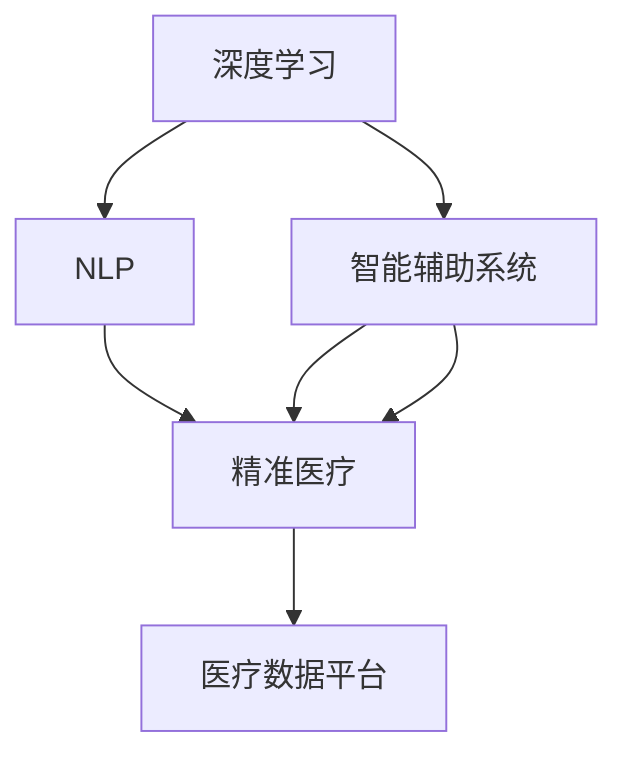

                 

# 医疗保健的未来：人类计算助力精准医疗发展

## 1. 背景介绍

随着科学技术的飞速发展，人类正站在医疗卫生领域一场革命的风口浪尖上。传统基于经验与直觉的医疗方式已经无法满足现代人们对精准医疗的期待，而新技术的引入，尤其是计算机科学的介入，正在彻底改变这一现状。

这一转变背后的推手，正是快速崛起的“人类计算”技术——通过数据驱动的模型和算法，赋予医疗领域前所未有的深度和广度，实现了从精准诊断到个性化治疗的飞跃。其中，以深度学习、自然语言处理、智能辅助系统等为代表的新兴技术，正在加速这一过程，并逐渐成为医疗保健领域未来的主要驱动力。

### 1.1 问题由来
医疗保健领域一直以来面临着诊断复杂、治疗个体化、数据量大且难以整合等多重挑战。以往的医疗方式更多依赖医生的经验，难以处理海量、复杂且不断增长的数据，更无法提供精准的个性化医疗方案。而随着数据采集设备和互联网应用的普及，医疗数据呈现出海量的趋势，这为应用人工智能技术提供了可能。

因此，通过引入“人类计算”技术，对医疗数据的深度分析和处理，有望显著提升医疗诊断和治疗的精准度和效率。这也成为了医疗保健领域面临的挑战之一，即如何在数据驱动的模型和算法中，实现精准医疗，并为未来医疗保健的发展指明方向。

### 1.2 问题核心关键点
在医疗保健领域应用“人类计算”技术，需要从以下几个方面进行考虑：

- **数据采集与整合**：构建统一、完整、高质量的医疗数据平台，涵盖病历、影像、实验室数据等多种类型，为深度学习模型提供丰富的训练样本。
- **模型训练与优化**：开发高效、鲁棒的深度学习模型，利用海量数据进行训练，优化模型参数以适应医疗数据的多样性和复杂性。
- **临床验证与部署**：确保模型的预测结果能够在临床应用中得到验证，并不断迭代优化，实现从实验室到医院的平稳过渡。
- **伦理与安全**：关注模型应用的伦理问题，如隐私保护、数据安全等，确保技术的透明性与安全性，保障患者权益。

## 2. 核心概念与联系

### 2.1 核心概念概述

为了更好地理解“人类计算”在医疗保健中的应用，本节将介绍几个核心概念：

- **深度学习 (Deep Learning)**：一种基于神经网络的学习方法，通过多层非线性变换对数据进行特征提取和表示学习，广泛应用于图像识别、语音识别等领域。在医疗领域，深度学习被用于图像分割、病理分析等任务。

- **自然语言处理 (Natural Language Processing, NLP)**：使计算机能够理解、处理人类语言的技术，应用于医疗领域则包括文本分类、信息抽取、问答系统等。

- **智能辅助系统 (Intelligent Assistance System)**：通过人工智能技术构建的系统，为医生提供诊断、治疗建议、患者管理等辅助，提升医疗服务质量和效率。

- **精准医疗 (Precision Medicine)**：利用遗传信息、基因组信息等，结合人工智能技术，为个体患者量身定制的治疗方案，以期达到更高效、更个性化的医疗服务。

- **医疗数据平台 (Health Data Platform)**：一个集成了多种医疗数据来源，并能高效管理和分析的平台，为人工智能技术提供数据支撑。

这些概念之间的联系密切，共同构成了“人类计算”在医疗保健领域的完整框架，其核心是利用计算机技术和人工智能，对医疗数据进行深度挖掘，为精准医疗提供技术支持。

### 2.2 核心概念原理和架构的 Mermaid 流程图



此流程图展示了深度学习、NLP、智能辅助系统、精准医疗以及医疗数据平台之间的联系，共同作用于医疗保健的发展。

## 3. 核心算法原理 & 具体操作步骤

### 3.1 算法原理概述

在医疗保健领域，“人类计算”技术的应用核心是深度学习算法。深度学习模型通过多层神经网络对数据进行自动特征提取和表示学习，能够有效处理高维、非线性的医疗数据，从而提高诊断和治疗的准确性。

### 3.2 算法步骤详解

深度学习在医疗保健中的应用步骤如下：

**Step 1: 数据预处理**
- 收集和整合医疗数据，包括电子病历、影像数据、基因组数据等。
- 清洗和标注数据，去除异常和噪声。
- 分拆数据集为训练集、验证集和测试集。

**Step 2: 模型训练**
- 选择合适的深度学习模型（如卷积神经网络CNN、循环神经网络RNN、Transformer等），并进行参数初始化。
- 利用训练集对模型进行前向传播和反向传播，更新模型参数。
- 在验证集上进行模型验证，调整超参数。

**Step 3: 模型评估**
- 在测试集上评估模型性能，如准确率、召回率、F1分数等。
- 对模型结果进行临床验证，确保其在真实医疗环境中可应用。

**Step 4: 模型部署与优化**
- 将训练好的模型部署到医疗系统中，与现有的医疗系统进行集成。
- 持续收集新数据，不断优化模型，以适应不断变化的医疗环境。

### 3.3 算法优缺点

深度学习在医疗保健中的应用具有以下优点：

- **高精度**：通过多层神经网络自动提取和表示医疗数据的特征，能够提升诊断和治疗的准确性。
- **自适应**：能够适应多样化的医疗数据类型和复杂性，为不同个体提供个性化治疗方案。
- **可扩展性**：可以处理海量数据，适应医疗数据平台的发展。

同时，深度学习在医疗应用中也有以下缺点：

- **数据需求高**：需要大量标注数据，而医疗数据的标注成本高、周期长。
- **模型复杂**：深度模型参数多、计算量大，对计算资源要求较高。
- **可解释性差**：深度学习模型通常被视为“黑盒”，缺乏可解释性，对医生的信任度有影响。
- **泛化性问题**：模型可能会过拟合训练数据，泛化能力不足。

### 3.4 算法应用领域

基于深度学习的医疗保健应用广泛，涵盖以下领域：

- **影像诊断**：如利用卷积神经网络进行X光片、CT、MRI等影像的自动分割和标注。
- **病理分析**：通过自然语言处理技术，自动分析病理学报告，判断疾病类型和严重程度。
- **基因组分析**：通过深度学习对基因组数据进行分析，预测遗传性疾病风险。
- **药物研发**：使用深度学习模型预测药物分子的活性，加速新药开发过程。
- **智能问答系统**：通过问答系统，为患者解答常见问题，提供疾病预防和治疗建议。

## 4. 数学模型和公式 & 详细讲解 & 举例说明

### 4.1 数学模型构建

在医疗保健领域，深度学习模型通常用于图像分类、病理标注等任务，其数学模型构建如下：

设医疗数据集为 $D=\{(x_i,y_i)\}_{i=1}^N$，其中 $x_i$ 为医疗数据样本， $y_i$ 为标签（疾病类型）。假设使用的深度学习模型为 $M_{\theta}$，其中 $\theta$ 为模型参数。

模型的损失函数为交叉熵损失函数：

$$
\mathcal{L}(\theta) = -\frac{1}{N}\sum_{i=1}^N \sum_{j=1}^C y_{ij} \log M_{\theta}(x_i)_j
$$

其中 $C$ 为类别数，$y_{ij}$ 表示样本 $i$ 在第 $j$ 个类别上的标签， $M_{\theta}(x_i)_j$ 表示模型在样本 $i$ 上第 $j$ 个类别的预测概率。

### 4.2 公式推导过程

为了更好地理解交叉熵损失函数的推导过程，我们以二分类任务为例，进行详细推导：

设样本 $x$ 的标签为 $y$，模型预测为 $\hat{y}$，则二分类交叉熵损失函数为：

$$
\ell(M_{\theta}(x),y) = -[y\log \hat{y} + (1-y)\log (1-\hat{y})]
$$

将损失函数扩展到整个数据集，得：

$$
\mathcal{L}(\theta) = -\frac{1}{N}\sum_{i=1}^N [y_i\log M_{\theta}(x_i)+(1-y_i)\log(1-M_{\theta}(x_i))]
$$

利用自动微分技术，可以计算出模型参数 $\theta$ 对损失函数 $\mathcal{L}(\theta)$ 的梯度：

$$
\frac{\partial \mathcal{L}(\theta)}{\partial \theta} = -\frac{1}{N}\sum_{i=1}^N \left[(y_i - M_{\theta}(x_i)) \frac{\partial M_{\theta}(x_i)}{\partial \theta}\right]
$$

### 4.3 案例分析与讲解

以图像分割为例，深度学习模型通常使用卷积神经网络，如图像分割任务中使用的U-Net网络。通过多层卷积和上采样操作，模型能够自动学习图像中不同区域的语义特征，并进行分割。

训练时，将医疗影像数据输入U-Net网络，进行前向传播，输出分割结果。通过计算分割结果与真实标注之间的差异，计算损失函数。然后反向传播更新网络参数，直至损失函数收敛。

训练完成后，使用测试集进行评估，计算分割准确率和误分割率。如果评估结果满意，则将模型部署到临床系统中，实现自动化的影像分割。

## 5. 项目实践：代码实例和详细解释说明

### 5.1 开发环境搭建

在进行深度学习医疗应用开发前，首先需要搭建好开发环境。以下是使用Python进行TensorFlow开发的环境配置流程：

1. 安装Anaconda：从官网下载并安装Anaconda，用于创建独立的Python环境。

2. 创建并激活虚拟环境：
```bash
conda create -n tf-env python=3.8 
conda activate tf-env
```

3. 安装TensorFlow：根据CUDA版本，从官网获取对应的安装命令。例如：
```bash
conda install tensorflow -c pytorch -c conda-forge
```

4. 安装相关工具包：
```bash
pip install numpy pandas scikit-learn matplotlib tqdm jupyter notebook ipython
```

完成上述步骤后，即可在`tf-env`环境中开始医疗应用开发。

### 5.2 源代码详细实现

这里我们以图像分割为例，展示如何使用TensorFlow进行卷积神经网络模型的训练和推理。

```python
import tensorflow as tf
from tensorflow.keras import layers
from tensorflow.keras.losses import binary_crossentropy

# 构建U-Net模型
model = tf.keras.Sequential([
    layers.Conv2D(64, 3, activation='relu', padding='same', input_shape=(256, 256, 1)),
    layers.Conv2D(64, 3, activation='relu', padding='same'),
    layers.MaxPooling2D(pool_size=(2, 2)),
    # 构建U-Net中间部分
    layers.Conv2D(128, 3, activation='relu', padding='same'),
    layers.Conv2D(128, 3, activation='relu', padding='same'),
    layers.MaxPooling2D(pool_size=(2, 2)),
    # 构建U-Net编码器部分
    layers.Conv2D(256, 3, activation='relu', padding='same'),
    layers.Conv2D(256, 3, activation='relu', padding='same'),
    layers.MaxPooling2D(pool_size=(2, 2)),
    # 构建U-Net解码器部分
    layers.Conv2D(128, 3, activation='relu', padding='same'),
    layers.Conv2D(128, 3, activation='relu', padding='same'),
    layers.UpSampling2D(size=(2, 2)),
    # 输出层
    layers.Conv2D(1, 1, activation='sigmoid')
])

# 定义损失函数
loss_fn = binary_crossentropy

# 编译模型
model.compile(optimizer='adam', loss=loss_fn)

# 训练模型
model.fit(x_train, y_train, epochs=10, batch_size=16, validation_data=(x_val, y_val))

# 测试模型
test_loss = model.evaluate(x_test, y_test)
print('Test Loss:', test_loss)
```

### 5.3 代码解读与分析

让我们再详细解读一下关键代码的实现细节：

**模型构建**：
- 使用Sequential模型定义卷积神经网络，包括卷积层、激活函数、池化层、上采样层等。
- 中间部分采用U-Net网络的结构，包括卷积、激活、池化、上采样等操作。

**损失函数定义**：
- 定义二分类交叉熵损失函数。

**模型编译**：
- 使用adam优化器进行模型训练。

**模型训练**：
- 使用fit函数进行模型训练，指定训练数据、验证数据、训练轮数和批次大小。

**模型测试**：
- 使用evaluate函数进行模型测试，输出测试损失。

可以看出，使用TensorFlow进行深度学习模型开发的过程十分便捷，而丰富的API和模块库也使得构建复杂模型变得容易。通过TensorFlow，我们可以快速搭建和训练卷积神经网络，实现图像分割等任务。

## 6. 实际应用场景

### 6.1 智能影像诊断

深度学习在医学影像诊断中具有广泛应用，通过图像分割、识别等技术，可以快速、准确地辅助医生进行诊断。例如，利用深度学习对X光片进行肺结节检测，可以有效提高肺癌筛查的准确性和效率。

### 6.2 病理报告自动分析

利用自然语言处理技术，对病理学报告进行自动分析，可以识别出病理类型和严重程度，辅助医生进行病理诊断。例如，使用BERT模型对病理学报告进行情感分析，判断病理报告的积极和消极情绪，从而更准确地了解病理结果。

### 6.3 基因组数据分析

深度学习可以应用于基因组数据分析，通过序列比对、分类等技术，预测基因突变类型和疾病风险。例如，使用CNN模型对DNA序列进行分类，判断其是否含有癌症相关基因突变，辅助早期癌症筛查。

### 6.4 药物研发

深度学习技术在药物研发中也具有重要应用，通过药物分子模拟、药物活性预测等技术，可以加速新药开发进程。例如，使用卷积神经网络对药物分子进行图像识别，判断其活性，从而筛选出有效的候选药物。

### 6.5 智能问答系统

通过构建问答系统，为患者提供常见疾病问答服务，可以提升医疗服务质量和患者满意度。例如，利用BERT模型对患者咨询的问题进行语义分析，匹配合适的答案，生成自然流畅的回答。

## 7. 工具和资源推荐

### 7.1 学习资源推荐

为了帮助开发者系统掌握深度学习在医疗保健中的应用，这里推荐一些优质的学习资源：

1. TensorFlow官方文档：提供全面的API和示例代码，帮助开发者快速上手深度学习模型开发。

2. PyTorch官方文档：详细讲解PyTorch框架，适合喜欢Python语法的开发者。

3. Coursera《深度学习专项课程》：由斯坦福大学教授Andrew Ng主讲，涵盖深度学习基础及应用，包括医疗影像分析等。

4. arXiv上最新论文：深度学习领域最新研究动态，涵盖医学影像、病理分析等多个方向。

5. Kaggle数据集：大量医学数据集可供开发者使用，帮助理解不同类型的数据和任务。

### 7.2 开发工具推荐

高效开发深度学习医疗应用，需要利用先进的开发工具：

1. TensorFlow：基于Google的深度学习框架，适合大规模工程应用。

2. PyTorch：灵活的Python深度学习框架，适合快速迭代和研究。

3. Jupyter Notebook：交互式编程环境，适合数据处理、模型训练和结果展示。

4. Keras：高层API，简化模型构建过程，适合初学者和快速原型设计。

5. Google Colab：免费提供GPU算力，方便开发者测试最新模型和工具。

### 7.3 相关论文推荐

深度学习在医疗保健领域的研究不断深入，以下是几篇奠基性的相关论文，推荐阅读：

1. **Deep Learning for Medical Image Analysis**：Yan Xiao等人，介绍了深度学习在医学影像分析中的应用，包括分类、分割、检测等任务。

2. **Pathology Report Summarization using Transformer-based Architectures**：Jia Yin等人，提出利用Transformer模型对病理学报告进行自动分析和摘要，提升病理报告的处理效率。

3. **Convolutional Neural Networks for Genomic Classification**：Günter Repetto等人，研究使用卷积神经网络对基因组数据进行分类，预测癌症风险。

4. **Predicting Drug Activity with Deep Convolutional Neural Networks**：Guofei Dai等人，提出利用卷积神经网络预测药物分子的活性，加速新药研发过程。

5. **A Deep Learning Framework for Medical Question Answering**：Zeng et al.，提出利用深度学习技术构建医学问答系统，为患者提供快速准确的回答。

## 8. 总结：未来发展趋势与挑战

### 8.1 总结

本文对深度学习在医疗保健领域的应用进行了全面系统的介绍。首先阐述了深度学习在医疗领域的应用背景和优势，明确了其在精准医疗中的重要作用。其次，从原理到实践，详细讲解了深度学习模型的构建和训练过程，提供了完整的代码实现。同时，本文还广泛探讨了深度学习在医学影像、病理分析、基因组分析、药物研发等多个实际应用场景中的前景，展示了其广阔的应用前景。此外，本文精选了深度学习的研究资源和工具，力求为读者提供全方位的技术指引。

通过本文的系统梳理，可以看到，深度学习技术在医疗保健领域的应用正处于快速发展阶段，其高效、精准的特点正逐步改变医疗服务的方式。未来，随着技术的不断进步，深度学习将为医疗保健带来更多创新和变革。

### 8.2 未来发展趋势

展望未来，深度学习在医疗保健领域的应用将呈现以下几个发展趋势：

1. **跨模态融合**：深度学习将进一步与图像、声音、文字等多模态数据进行融合，提升诊断和治疗的准确性和全面性。

2. **自适应学习**：深度学习模型将具备更强的自适应能力，能够根据不同患者个体化需求，提供更加个性化的医疗方案。

3. **实时性增强**：通过优化深度学习模型和推理算法，实现医疗数据的实时处理和分析，提升诊断和治疗的效率。

4. **人工智能辅助决策**：深度学习将结合专家知识，构建智能辅助决策系统，提升医生的决策准确性和效率。

5. **隐私保护和伦理考量**：深度学习应用将更加注重患者隐私保护和伦理问题，确保数据使用的合法性和安全性。

### 8.3 面临的挑战

尽管深度学习在医疗保健领域的应用前景广阔，但在迈向更加智能化、普适化应用的过程中，也面临诸多挑战：

1. **数据隐私和安全**：医疗数据涉及个人隐私，深度学习应用需要严格的隐私保护和数据安全措施，确保患者数据不被滥用。

2. **模型可解释性**：深度学习模型通常被视为“黑盒”，缺乏可解释性，这对于医生的信任度和解释决策具有重要影响。

3. **模型泛化性**：深度学习模型可能会过拟合训练数据，泛化能力不足，限制了其在实际医疗环境中的应用。

4. **计算资源需求**：深度学习模型参数多、计算量大，对计算资源要求较高，限制了其在资源受限环境中的应用。

### 8.4 研究展望

面对深度学习在医疗保健领域面临的挑战，未来的研究需要在以下几个方面寻求新的突破：

1. **隐私保护技术**：开发更加高效的隐私保护算法和数据加密技术，确保患者数据的安全性和隐私性。

2. **可解释性增强**：利用可解释性方法，如注意力机制、决策图等，增强深度学习模型的可解释性，提升医生的信任度和解释能力。

3. **模型泛化性优化**：通过迁移学习、多模态学习等方法，提升深度学习模型的泛化能力，使其在实际医疗环境中表现更加稳定。

4. **轻量级模型设计**：开发轻量级、高效的深度学习模型，适应资源受限的环境，如移动设备和嵌入式设备。

这些研究方向的探索，必将引领深度学习技术在医疗保健领域迈向新的高度，为构建智能、高效、安全的医疗系统铺平道路。总之，深度学习技术正逐步成为医疗保健领域的重要工具，将为医疗服务的未来带来革命性的变革。

## 9. 附录：常见问题与解答

**Q1：深度学习在医疗保健中的应用有什么优势？**

A: 深度学习在医疗保健中的应用具有以下优势：

- **高效性**：能够快速处理大量医疗数据，提升诊断和治疗效率。

- **准确性**：通过多层神经网络自动提取和表示医疗数据的特征，提升诊断和治疗的准确性。

- **个性化**：能够根据不同患者个体化需求，提供更加个性化的医疗方案。

- **自适应**：具备较强的自适应能力，能够适应多样化的医疗数据类型和复杂性。

**Q2：如何选择合适的深度学习模型进行医疗应用？**

A: 选择合适的深度学习模型需要考虑以下几个因素：

- **数据类型**：根据医疗数据的类型，选择合适的卷积神经网络、循环神经网络、Transformer等模型。

- **任务复杂度**：根据任务的复杂度，选择合适的模型深度和宽度，避免过拟合和欠拟合。

- **计算资源**：考虑可用计算资源，选择合适的模型结构和优化方法，确保模型能够在实际环境中运行。

**Q3：深度学习模型在医疗应用中如何避免过拟合？**

A: 避免深度学习模型在医疗应用中过拟合，可以采取以下措施：

- **数据增强**：通过回译、数据扩充等方法，扩充训练数据集，避免模型过拟合。

- **正则化**：使用L2正则化、Dropout等技术，限制模型参数，避免过拟合。

- **早停法**：在验证集上监测模型性能，一旦性能不再提升，立即停止训练。

- **集成学习**：构建多个深度学习模型，通过集成学习提高模型的泛化能力。

**Q4：如何在医疗应用中提高深度学习模型的可解释性？**

A: 提高深度学习模型在医疗应用中的可解释性，可以采取以下措施：

- **注意力机制**：利用注意力机制，使模型能够关注输入数据的关键特征。

- **决策图**：构建决策图，展示模型的决策过程和逻辑。

- **特征可视化**：通过特征可视化技术，展示模型在每个输入特征上的权重和贡献度。

- **解释性模型**：选择解释性较强的模型，如决策树、逻辑回归等，进行辅助解释。

通过这些方法，可以显著提高深度学习模型在医疗应用中的可解释性，增强医生的信任度和解释能力。

---

作者：禅与计算机程序设计艺术 / Zen and the Art of Computer Programming

