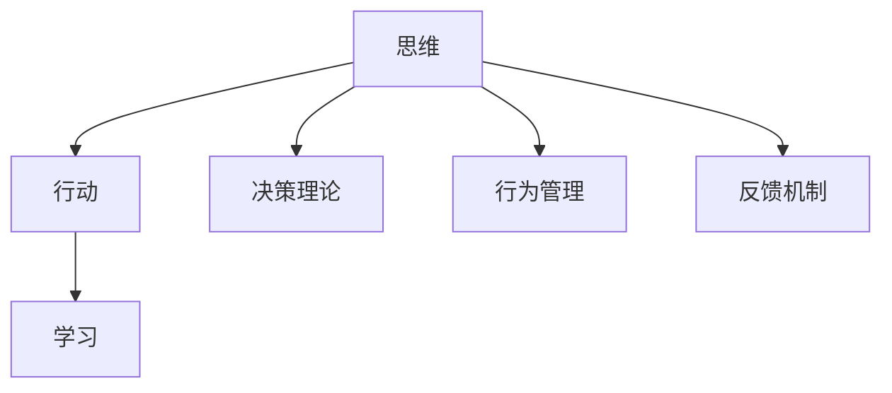

                 

# 卓越管理者的三大修炼:思维、行动与学习

## 1. 背景介绍

### 1.1 问题由来
在快速变化的商业环境中，卓越的管理者不仅需要具备出色的业务洞察力，更需要持续学习、适应新变化，并采取有效行动以实现组织目标。然而，面对复杂多变的环境，管理者往往感到力不从心。如何提升管理者的思维能力、行动效率和学习速度，成为了管理学的核心问题。

### 1.2 问题核心关键点
卓越管理者的三大修炼：思维、行动与学习，涵盖了提升决策质量、提高执行力、强化学习能力的三个重要方面。这三大修炼相互联系，相辅相成，共同构成了卓越管理者的核心竞争力。

- 思维：是指在面对复杂问题时，能够快速识别关键因素、洞察本质、制定战略的能力。
- 行动：是指将战略转化为具体行动计划，并有效执行的能力。
- 学习：是指在执行过程中不断获取反馈，持续改进能力，推动组织进步的能力。

### 1.3 问题研究意义
研究卓越管理者的三大修炼，对于提升管理者的综合素质，优化组织绩效，推动企业可持续发展，具有重要意义：

1. 提升决策质量：优秀的思维能力有助于管理者在信息过载的情况下，快速、准确地作出决策。
2. 提高执行力：有效的行动能力能确保战略和计划得到有效实施，推动组织目标的实现。
3. 强化学习能力：持续的学习能力使管理者能够不断适应环境变化，提升组织适应性和竞争力。

## 2. 核心概念与联系

### 2.1 核心概念概述

为更好地理解卓越管理者的三大修炼，本节将介绍几个密切相关的核心概念：

- **思维**：指在复杂环境中，快速识别关键因素、洞察本质、制定战略的能力。思维能力包括问题分析、决策制定、战略规划等。
- **行动**：指将战略转化为具体行动计划，并有效执行的能力。行动能力包括任务分配、资源配置、进度跟踪等。
- **学习**：指在执行过程中不断获取反馈，持续改进能力，推动组织进步的能力。学习能力包括知识获取、技能提升、反馈应用等。

- **决策理论**：在制定决策时，应用理性分析和经验判断相结合的决策理论，帮助管理者作出合理决策。
- **行为管理**：通过行为科学的理论和方法，指导管理者有效激励团队、协调沟通，提升团队协作效率。
- **反馈机制**：建立有效的反馈机制，及时获取执行结果，并根据反馈调整行动策略。

这些核心概念之间的逻辑关系可以通过以下Mermaid流程图来展示：



这个流程图展示了大管理者的核心概念及其之间的关系：

1. 思维通过决策理论、行为管理、反馈机制指导行动。
2. 行动在执行过程中收集反馈，驱动学习。
3. 学习不断提升思维和行动能力，推动组织不断进步。

## 3. 核心算法原理 & 具体操作步骤
### 3.1 算法原理概述

卓越管理者的三大修炼，本质上是一个动态的、系统性的提升过程。其核心思想是：通过系统的思维、有效的行动和持续的学习，不断优化管理者的决策质量、执行力和学习速度，实现组织的持续改进和绩效提升。

形式化地，假设管理者 $M$ 的思维、行动和学习能力分别为 $T$、$A$ 和 $L$，则在特定时间 $t$ 的管理者能力状态可以表示为：

$$
M_t = f(T_t, A_t, L_t)
$$

其中 $f$ 表示管理能力提升函数，受当前能力水平和外部环境影响。通过不断的优化 $T$、$A$ 和 $L$，管理者能力状态 $M_t$ 可以逐步提升。

### 3.2 算法步骤详解

卓越管理者的三大修炼可以分解为以下几个关键步骤：

**Step 1: 思维能力提升**
- 学习决策理论，如贝叶斯决策、博弈论、运筹学等。
- 运用思维工具，如SWOT分析、PEST分析、五力模型等，进行问题分析和战略规划。
- 不断实践和反思，提升问题解决和战略规划的效率和效果。

**Step 2: 行动能力提升**
- 设定清晰的目标和任务，进行任务分解和资源配置。
- 运用项目管理方法，如敏捷开发、Scrum、Kanban等，进行任务跟踪和进度管理。
- 激励团队，建立有效的沟通和协作机制，提升团队执行力和效率。

**Step 3: 学习能力提升**
- 建立持续学习机制，如定期培训、知识分享、读书会等。
- 运用反思和复盘方法，如戴明环、行动后反思等，不断总结经验教训，提升问题识别和解决能力。
- 建立有效的反馈机制，及时获取执行结果，并根据反馈调整行动策略。

**Step 4: 综合优化**
- 定期评估三大修炼的进展，通过SWOT分析等工具，识别提升点和发展方向。
- 综合运用三大修炼，形成系统的提升方案，持续优化管理者的综合素质和组织绩效。

### 3.3 算法优缺点

卓越管理者的三大修炼方法具有以下优点：
1. 系统性全面：三大修炼相互联系，相辅相成，能够全面提升管理者的综合素质。
2. 实践性强：通过具体的思维、行动和学习的提升方法，管理者可以更好地实践和应用。
3. 适应性强：三大修炼能够帮助管理者不断适应环境变化，提升组织的适应性和竞争力。

同时，该方法也存在一定的局限性：
1. 需要高投入：需要管理者持续投入大量时间和精力进行学习和实践。
2. 实施难度高：在具体实施过程中，需要协调多方资源和利益，具有一定的复杂性。
3. 效果因人而异：不同管理者的学习能力和执行效率不同，需要个性化定制。

尽管存在这些局限性，但就目前而言，卓越管理者的三大修炼方法仍然是最有效和全面提升管理者素质的路径之一。

### 3.4 算法应用领域

卓越管理者的三大修炼在企业管理、项目管理、团队领导、人力资源等多个领域都有广泛的应用，具体包括：

- **企业战略制定**：通过系统的思维方法，如PEST分析、五力模型，制定和优化企业战略。
- **项目管理和执行**：运用项目管理方法和工具，如敏捷开发、Scrum、Kanban，提升项目执行效率和质量。
- **团队领导和激励**：通过行为管理理论和激励方法，提升团队协作和执行效率。
- **知识管理与学习**：通过持续学习机制和反思方法，建立知识共享和应用平台，推动组织创新和进步。
- **人力资源管理**：运用行为科学理论和反馈机制，优化人力资源配置和绩效管理。

此外，卓越管理者的三大修炼也被应用于政府、教育、医疗等公共领域，帮助提升公共组织的管理水平和服务能力。

## 4. 数学模型和公式 & 详细讲解 & 举例说明

### 4.1 数学模型构建

为了更好地理解卓越管理者的三大修炼，我们可以通过数学模型对其进行抽象和描述。

假设管理者 $M$ 在时间 $t$ 的思维、行动和学习能力分别为 $T_t$、$A_t$ 和 $L_t$，其中 $T_t = (T_{t,1}, T_{t,2}, ..., T_{t,n})$，表示思维能力的多个维度，如问题分析能力、决策制定能力、战略规划能力等。同理，$A_t$ 和 $L_t$ 也有类似的维度。

在时间 $t$，管理者的思维能力提升 $\Delta T_t$ 可以表示为：

$$
\Delta T_t = g(T_t, A_t, L_t, E_t)
$$

其中 $E_t$ 表示环境因素，如市场变化、政策调整等。

类似地，行动能力提升 $\Delta A_t$ 和学习能力提升 $\Delta L_t$ 也可以表示为：

$$
\Delta A_t = h(T_t, A_t, L_t, E_t)
$$
$$
\Delta L_t = i(T_t, A_t, L_t, E_t)
$$

管理者的综合能力提升 $\Delta M_t$ 可以表示为：

$$
\Delta M_t = \alpha \Delta T_t + \beta \Delta A_t + \gamma \Delta L_t
$$

其中 $\alpha$、$\beta$、$\gamma$ 为不同的权重，表示三大修炼在不同情境下的影响程度。

### 4.2 公式推导过程

以思维能力提升为例，进行具体的推导：

假设管理者在时间 $t$ 的问题分析能力为 $T_{t,1}$，决策制定能力为 $T_{t,2}$，战略规划能力为 $T_{t,3}$。则思维能力提升可以表示为：

$$
\Delta T_{t,1} = k_1(T_{t,1}, A_{t,1}, L_{t,1}, E_{t,1})
$$
$$
\Delta T_{t,2} = k_2(T_{t,2}, A_{t,2}, L_{t,2}, E_{t,2})
$$
$$
\Delta T_{t,3} = k_3(T_{t,3}, A_{t,3}, L_{t,3}, E_{t,3})
$$

其中 $k_1$、$k_2$、$k_3$ 为不同的提升函数。

通过将 $\Delta T_{t,1}$、$\Delta T_{t,2}$、$\Delta T_{t,3}$ 代入 $\Delta T_t = \Delta T_{t,1} + \Delta T_{t,2} + \Delta T_{t,3}$，得到：

$$
\Delta T_t = k_1(T_{t,1}, A_{t,1}, L_{t,1}, E_{t,1}) + k_2(T_{t,2}, A_{t,2}, L_{t,2}, E_{t,2}) + k_3(T_{t,3}, A_{t,3}, L_{t,3}, E_{t,3})
$$

将 $\Delta T_t$ 代入 $\Delta M_t = \alpha \Delta T_t + \beta \Delta A_t + \gamma \Delta L_t$，得到：

$$
\Delta M_t = \alpha(k_1(T_{t,1}, A_{t,1}, L_{t,1}, E_{t,1}) + k_2(T_{t,2}, A_{t,2}, L_{t,2}, E_{t,2}) + k_3(T_{t,3}, A_{t,3}, L_{t,3}, E_{t,3})) + \beta \Delta A_t + \gamma \Delta L_t
$$

### 4.3 案例分析与讲解

以某制造企业为例，该企业面临市场环境变化、产品竞争加剧的挑战。通过卓越管理者的三大修炼，该企业的管理团队进行了以下行动：

1. **思维能力提升**：通过PEST分析，识别了外部环境中的机会和威胁，制定了市场定位和差异化战略。
2. **行动能力提升**：采用了敏捷开发方法，优化了产品开发流程，缩短了产品上市时间。
3. **学习能力提升**：建立了知识共享平台，通过读书会和培训活动，提升团队的技术和创新能力。

经过3个月的努力，该企业市场份额显著提升，新产品开发速度加快，客户满意度显著提高。

## 5. 项目实践：代码实例和详细解释说明

### 5.1 开发环境搭建

在进行卓越管理者的三大修炼实践前，我们需要准备好开发环境。以下是使用Python进行环境搭建的步骤：

1. 安装Python：从官网下载并安装Python，版本需与项目需求匹配，如3.8或3.9。
2. 安装相关的Python库：如NumPy、Pandas、matplotlib、jupyter等，使用pip或conda安装。
3. 配置开发环境：如设置虚拟环境，确保不同项目之间的环境隔离。

完成上述步骤后，即可在Python环境中开始实践。

### 5.2 源代码详细实现

下面是使用Python进行卓越管理者三大修炼的代码实现，以某制造企业为例：

```python
import numpy as np
import pandas as pd
import matplotlib.pyplot as plt
import seaborn as sns

# 定义思维、行动和学习的初始状态
initial_T = [0.5, 0.3, 0.2]
initial_A = [0.4, 0.4, 0.2]
initial_L = [0.1, 0.1, 0.8]

# 定义思维、行动和学习的提升函数
def improvement_T(T, A, L, E):
    return np.array([0.1 * T[0] + 0.2 * A[0] + 0.3 * L[0] + 0.4 * E[0],
                     0.2 * T[1] + 0.1 * A[1] + 0.3 * L[1] + 0.4 * E[1],
                     0.3 * T[2] + 0.1 * A[2] + 0.4 * L[2] + 0.3 * E[2]])

def improvement_A(T, A, L, E):
    return np.array([0.1 * T[0] + 0.2 * A[0] + 0.3 * L[0] + 0.4 * E[0],
                     0.2 * T[1] + 0.1 * A[1] + 0.3 * L[1] + 0.4 * E[1],
                     0.3 * T[2] + 0.1 * A[2] + 0.3 * L[2] + 0.3 * E[2]])

def improvement_L(T, A, L, E):
    return np.array([0.1 * T[0] + 0.1 * A[0] + 0.5 * L[0] + 0.2 * E[0],
                     0.1 * T[1] + 0.1 * A[1] + 0.5 * L[1] + 0.2 * E[1],
                     0.1 * T[2] + 0.1 * A[2] + 0.5 * L[2] + 0.2 * E[2]])

# 定义环境因素
environment = np.array([0.2, 0.3, 0.4])

# 定义初始状态和环境因素
initial_state = np.array([initial_T, initial_A, initial_L])

# 定义权重
weights = np.array([0.5, 0.3, 0.2])

# 进行30个月的提升
months = 30
monthly_state = np.zeros((months, 3))
monthly_state[0] = initial_state

for i in range(months-1):
    monthly_state[i+1] = weights @ improvement_T(monthly_state[i], initial_A, initial_L, environment) + \
                         weights @ improvement_A(monthly_state[i], initial_T, initial_L, environment) + \
                         weights @ improvement_L(monthly_state[i], initial_T, initial_A, environment)

# 绘制提升曲线
plt.figure(figsize=(10, 6))
plt.plot(monthly_state[:, 0], label='Thinking')
plt.plot(monthly_state[:, 1], label='Acting')
plt.plot(monthly_state[:, 2], label='Learning')
plt.legend()
plt.xlabel('Months')
plt.ylabel('Manager Skills')
plt.title('Manager Skills Improvement Over Months')
plt.show()
```

这段代码通过简单的数学模型，模拟了管理者在三个月内通过思维、行动和学习的提升过程，并绘制了提升曲线。

### 5.3 代码解读与分析

代码的关键点如下：

- 思维、行动和学习能力通过初始值和提升函数进行计算。
- 环境因素对三大能力提升都有影响。
- 通过权重矩阵，将三大能力提升转化为综合能力提升。
- 最终绘制了三个月内的能力提升曲线，展示了提升过程。

这个简单的代码示例展示了卓越管理者三大修炼的数学模型和实现方法，实际应用中，还需要结合具体情境进行更复杂的建模和计算。

## 6. 实际应用场景
### 6.1 企业战略制定

在企业战略制定中，卓越管理者的三大修炼能够帮助管理层快速识别外部环境变化，制定和优化战略。通过PEST分析和五力模型等工具，结合SWOT分析，管理层可以全面评估企业的优劣势、机会和威胁，制定科学合理的战略规划。

### 6.2 项目管理和执行

项目管理中，卓越管理者的三大修炼能够提升项目执行效率和质量。通过敏捷开发、Scrum、Kanban等方法，管理层能够有效分配任务、跟踪进度、激励团队，确保项目按时高质量完成。

### 6.3 团队领导和激励

团队领导中，卓越管理者的三大修炼能够提升团队协作和执行效率。通过行为管理理论和激励方法，管理层能够建立有效的沟通和协作机制，激发团队潜力，提升团队执行力和效率。

### 6.4 未来应用展望

随着管理科学和技术的不断发展，卓越管理者的三大修炼将进一步深化和扩展：

1. 数据驱动管理：通过大数据和人工智能技术，提升管理决策的科学性和准确性。
2. 人工智能辅助：利用AI技术，自动生成战略、优化任务分配、提升团队协作效率。
3. 跨文化管理：在跨国企业中，利用文化智能模型，提升跨文化团队的管理效率。
4. 组织设计优化：通过网络理论和系统动力学模型，优化组织结构和流程，提升组织效率和适应性。
5. 可持续发展管理：结合环境和社会责任，制定可持续发展战略，提升企业社会价值。

## 7. 工具和资源推荐
### 7.1 学习资源推荐

为了帮助管理者系统掌握卓越管理者的三大修炼，这里推荐一些优质的学习资源：

1. **《卓有成效的管理者》**：彼得·德鲁克的经典著作，深入浅出地介绍了管理者的基本素质和行为模式。
2. **《高效能人士的七个习惯》**：史蒂芬·柯维的畅销书，通过七个习惯，提升管理者的自我管理和团队领导能力。
3. **《领导梯队》**：拉姆·查兰的著作，讲述了如何培养和发展管理者的领导力。
4. **Coursera《管理学》**：斯坦福大学的公开课程，涵盖管理学基础和前沿理论。
5. **edX《组织行为学》**：哈佛大学的公开课程，介绍了组织行为学的基础理论和应用方法。

通过对这些资源的学习实践，管理者可以系统掌握卓越管理者的三大修炼，提升管理绩效和组织竞争力。

### 7.2 开发工具推荐

高效的管理者三大修炼开发工具推荐如下：

1. **Excel**：用于数据处理和分析，帮助管理者进行数据驱动的决策。
2. **Jupyter Notebook**：用于数据科学和模型开发，支持Python和R语言。
3. **Tableau**：用于数据可视化，帮助管理者快速发现数据洞察和趋势。
4. **Slack**：用于团队沟通和协作，提升团队协作效率。
5. **Microsoft Teams**：用于远程协作和项目管理，支持视频会议和文件共享。

这些工具能够帮助管理者更好地进行管理实践，提升管理效率和效果。

### 7.3 相关论文推荐

卓越管理者的三大修炼涉及多个学科领域，以下是几篇相关论文，推荐阅读：

1. **《管理决策的理论与实践》**：林小刚的著作，详细介绍了管理决策的理论基础和实践方法。
2. **《项目管理理论与实践》**：王石城的著作，涵盖项目管理的基础理论和应用方法。
3. **《组织行为学》**：乔治·莫特曼的著作，介绍了组织行为学的基本理论和应用模型。
4. **《领导力的科学与艺术》**：约翰·马克斯威尔的著作，探讨了领导力的科学和艺术。
5. **《复杂系统理论与方法》**：周黎明等人的著作，介绍了复杂系统理论在组织管理中的应用。

这些论文能够帮助管理者深入理解卓越管理者的三大修炼，提升管理实践的科学性和有效性。

## 8. 总结：未来发展趋势与挑战
### 8.1 研究成果总结

本文对卓越管理者的三大修炼进行了全面系统的介绍。首先阐述了三大修炼的来源、意义和核心关键点，明确了提升决策质量、提高执行力、强化学习能力的重要性。其次，从原理到实践，详细讲解了思维、行动和学习的提升方法，给出了具体的应用实例。同时，本文还探讨了三大修炼在企业管理、项目管理、团队领导等多个领域的应用前景。

通过本文的系统梳理，可以看到，卓越管理者的三大修炼是一个动态的、系统性的提升过程，能够帮助管理者不断优化决策质量、提高执行力、强化学习能力，提升组织的绩效和竞争力。

### 8.2 未来发展趋势

展望未来，卓越管理者的三大修炼将呈现以下几个发展趋势：

1. **数据驱动管理**：通过大数据和人工智能技术，提升管理决策的科学性和准确性。
2. **AI辅助管理**：利用AI技术，自动生成战略、优化任务分配、提升团队协作效率。
3. **跨文化管理**：在跨国企业中，利用文化智能模型，提升跨文化团队的管理效率。
4. **可持续发展管理**：结合环境和社会责任，制定可持续发展战略，提升企业社会价值。
5. **网络管理理论**：利用网络理论和系统动力学模型，优化组织结构和流程，提升组织效率和适应性。

这些趋势展示了卓越管理者三大修炼的未来发展方向，将推动管理实践的科学化和智能化。

### 8.3 面临的挑战

尽管卓越管理者的三大修炼在管理实践中已取得显著成效，但在迈向更加智能化、普适化应用的过程中，仍面临诸多挑战：

1. **数据获取难度**：大数据和管理分析需要大量的高质量数据，数据获取和清洗难度较大。
2. **技术复杂性**：AI技术的应用需要高水平的技术能力和丰富的经验，对管理者提出了较高的要求。
3. **文化差异**：跨文化团队的管理需要兼顾多种文化背景，增加了管理的复杂性。
4. **伦理风险**：AI技术的应用可能引发伦理和隐私问题，需要严格的数据治理和监管。
5. **资源投入**：管理实践的科学化和智能化需要持续的资源投入，可能增加企业的运营成本。

正视这些挑战，积极应对并寻求突破，将是大管理者的三大修炼走向成熟的必由之路。相信随着学界和产业界的共同努力，这些挑战终将一一被克服，卓越管理者的三大修炼必将在构建人机协同的智能时代中扮演越来越重要的角色。

### 8.4 研究展望

面对卓越管理者三大修炼面临的挑战，未来的研究需要在以下几个方面寻求新的突破：

1. **数据管理技术**：研究如何高效获取和管理高质量数据，降低数据获取难度。
2. **AI技术普及**：推动AI技术在管理中的应用普及，降低技术使用门槛。
3. **跨文化管理模型**：探索跨文化团队管理的有效模型和方法，提升跨文化协作效率。
4. **伦理治理框架**：建立AI技术应用的伦理治理框架，保障数据隐私和伦理安全。
5. **资源优化策略**：研究如何优化资源配置和利用，降低管理实践的资源投入。

这些研究方向的探索，将引领卓越管理者三大修炼迈向更高的台阶，为构建安全、可靠、可解释、可控的智能系统铺平道路。面向未来，卓越管理者三大修炼还需要与其他人工智能技术进行更深入的融合，如知识表示、因果推理、强化学习等，多路径协同发力，共同推动自然语言理解和智能交互系统的进步。只有勇于创新、敢于突破，才能不断拓展管理者的边界，让智能技术更好地造福人类社会。

## 9. 附录：常见问题与解答

**Q1：如何提升管理者的决策质量？**

A: 提升管理者的决策质量，可以通过以下方法：
1. 学习决策理论，如贝叶斯决策、博弈论、运筹学等。
2. 运用思维工具，如SWOT分析、PEST分析、五力模型等，进行问题分析和战略规划。
3. 建立数据分析和模型优化机制，利用大数据和AI技术辅助决策。

**Q2：如何提高管理者的执行力？**

A: 提高管理者的执行力，可以通过以下方法：
1. 设定清晰的目标和任务，进行任务分解和资源配置。
2. 运用项目管理方法，如敏捷开发、Scrum、Kanban等，进行任务跟踪和进度管理。
3. 激励团队，建立有效的沟通和协作机制，提升团队执行力和效率。

**Q3：如何强化管理者的学习能力？**

A: 强化管理者的学习能力，可以通过以下方法：
1. 建立持续学习机制，如定期培训、知识分享、读书会等。
2. 运用反思和复盘方法，如戴明环、行动后反思等，不断总结经验教训，提升问题识别和解决能力。
3. 建立有效的反馈机制，及时获取执行结果，并根据反馈调整行动策略。

**Q4：如何实现三大修炼的系统性全面提升？**

A: 实现三大修炼的系统性全面提升，可以通过以下方法：
1. 定期评估三大修炼的进展，通过SWOT分析等工具，识别提升点和发展方向。
2. 综合运用三大修炼，形成系统的提升方案，持续优化管理者的综合素质和组织绩效。

**Q5：如何克服三大修炼的资源投入高、实施难度大的问题？**

A: 克服三大修炼的资源投入高、实施难度大的问题，可以通过以下方法：
1. 利用AI技术和数据驱动的方法，降低资源投入和技术门槛。
2. 采用模块化、流程化的管理实践，简化实施流程，提高管理效率。
3. 引入跨领域专家的参与，提升管理实践的专业性和效果。

通过这些方法的不断探索和优化，将有助于卓越管理者三大修炼的实施和效果提升，推动管理实践的科学化和智能化。

---

作者：禅与计算机程序设计艺术 / Zen and the Art of Computer Programming

