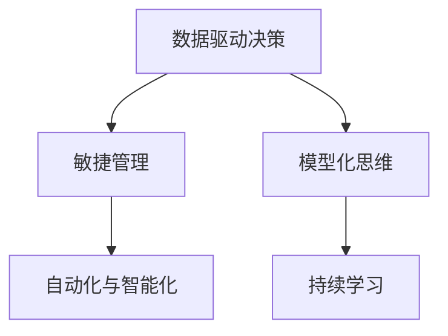

                 

# 卓越管理者的思维修炼之路

## 1. 背景介绍

### 1.1 问题由来
在信息化时代，企业的经营管理模式和决策机制经历了巨大的变化。传统的经验管理方式已经难以适应快速变化的市场环境，管理者需要通过数据和科技手段提升决策的科学性和精准性。然而，数据繁多复杂，如何从海量数据中提取有效信息，制定高效策略，仍是一个巨大的挑战。

### 1.2 问题核心关键点
卓越管理者的核心任务之一，是利用数据和科技手段提升企业运营效率和竞争力。在数字化转型的大趋势下，卓越管理者的思维模式和工具选择，需要与时俱进，不断更新。如何通过科学方法论和先进技术，提升管理决策的科学性和高效性，将成为新时代管理者的重要课题。

### 1.3 问题研究意义
研究卓越管理者的思维修炼之路，对于提升企业经营管理水平，增强企业竞争力，具有重要意义：

1. **提高决策质量**：通过科学的数据分析方法和先进的技术工具，提升决策的准确性和前瞻性，规避风险，优化资源配置。
2. **提升执行效率**：利用自动化和智能化技术，减少重复性工作，提升业务流程的执行效率。
3. **促进创新发展**：通过数据驱动的决策模式，激发团队的创新潜力，推动企业持续创新，应对市场变化。
4. **增强应变能力**：大数据和AI技术使得企业能够快速响应市场变化，调整经营策略，保持领先地位。
5. **优化客户体验**：利用数据分析和个性化推荐技术，提升客户满意度，增强企业市场竞争力。

## 2. 核心概念与联系

### 2.1 核心概念概述

为更好地理解卓越管理者的思维修炼之路，本节将介绍几个密切相关的核心概念：

- **数据驱动决策**：基于数据分析结果进行决策的科学方法，通过数据挖掘、统计分析、机器学习等技术，提取业务洞察，支撑决策。
- **敏捷管理**：一种快速响应市场变化、持续改进的管理模式，强调灵活性、速度和创新。
- **自动化与智能化**：通过引入自动化工具和智能化技术，提升工作效率，减少人为错误。
- **模型化思维**：利用数学模型和算法工具，构建业务场景和决策机制，提升问题解决能力。
- **持续学习**：强调终身学习，持续更新知识体系，适应不断变化的环境和挑战。

这些核心概念之间的逻辑关系可以通过以下Mermaid流程图来展示：



这个流程图展示的核心概念及其之间的关系：

1. 数据驱动决策是管理者的基本工作方式，通过数据和分析支撑决策。
2. 敏捷管理是在数据驱动基础上，实现快速响应和持续改进的动态管理模式。
3. 自动化与智能化是通过技术手段提升工作效率和决策质量的支撑手段。
4. 模型化思维提供了一种系统的决策方法，通过数学模型和算法工具构建业务洞察。
5. 持续学习保证管理者的知识体系与时俱进，适应不断变化的市场环境。

## 3. 核心算法原理 & 具体操作步骤
### 3.1 算法原理概述

卓越管理者的思维修炼之路，本质上是一种基于数据和算法支撑的管理决策过程。其核心思想是：通过数据分析和算法模型，提取业务洞察，支撑科学决策。

形式化地，假设企业管理问题为 $P$，数据集为 $D=\{(x_i, y_i)\}_{i=1}^N$，其中 $x_i$ 为输入变量，$y_i$ 为输出变量。管理者的目标是找到一个最优模型 $M$，使得 $M(x)$ 能够准确预测 $y$。这一过程可以通过以下步骤实现：

1. **数据准备**：收集和清洗数据，确保数据质量和代表性。
2. **模型构建**：选择合适的模型（如回归模型、分类模型、聚类模型等），构建预测模型。
3. **训练和验证**：使用部分数据集进行模型训练，另一部分数据集进行模型验证，优化模型参数。
4. **评估和应用**：在测试集上评估模型性能，若达到预期目标，则将模型应用于实际业务决策中。

### 3.2 算法步骤详解

卓越管理者的思维修炼之路，包括以下几个关键步骤：

**Step 1: 数据准备**
- 收集与业务问题相关的数据，包括结构化数据（如报表、文档）和非结构化数据（如社交媒体、客户反馈）。
- 数据清洗和预处理，包括去重、缺失值填补、异常值检测等。
- 数据分割，将数据集分为训练集、验证集和测试集。

**Step 2: 模型构建**
- 选择合适的算法模型，如回归模型、分类模型、聚类模型等。
- 设计模型的输入和输出，定义损失函数和优化目标。
- 确定模型参数，如回归模型的截距和斜率，分类模型的权重向量等。

**Step 3: 训练和验证**
- 使用训练集对模型进行迭代优化，最小化损失函数。
- 在验证集上评估模型性能，避免过拟合，选择最优模型。
- 调整模型参数，进一步提升模型精度。

**Step 4: 评估和应用**
- 在测试集上评估模型泛化能力，确保模型可以推广到新数据。
- 将模型应用于实际业务决策中，根据结果进行调整和优化。
- 持续收集反馈数据，进行模型迭代更新。

### 3.3 算法优缺点

基于数据和算法的管理决策方法，具有以下优点：

1. **科学性**：通过数据分析和模型训练，提升决策的科学性和客观性，减少主观偏见。
2. **高效性**：自动化算法工具可以处理大量数据，提升决策效率。
3. **灵活性**：模型可以适应不同的业务场景和数据分布，具备良好的泛化能力。
4. **可解释性**：模型可以提供决策的计算过程和依据，提高决策的透明度和可信度。

同时，该方法也存在一些局限性：

1. **数据质量依赖**：模型的效果依赖于数据的质量和代表性，数据偏差可能导致决策错误。
2. **算法复杂性**：复杂的模型需要更多的计算资源和时间，增加了决策成本。
3. **模型依赖**：选择合适的模型和参数调整是模型训练的关键，需要深厚的专业知识和经验。
4. **解释性不足**：黑箱模型（如深度学习）的决策过程难以解释，难以理解模型的内部工作机制。

尽管存在这些局限性，但就目前而言，基于数据和算法的管理决策方法仍是提升决策科学性的重要手段。未来相关研究的重点在于如何进一步提高模型的可解释性和鲁棒性，同时降低对数据的依赖，提高算法的自动化和智能化水平。

### 3.4 算法应用领域

基于数据和算法的管理决策方法，在多个领域得到广泛应用，例如：

- 运营优化：通过数据分析和算法模型，优化库存管理、供应链优化、生产调度等运营流程。
- 风险管理：利用模型进行信用评分、欺诈检测、风险预警等风险控制。
- 市场营销：通过数据挖掘和推荐算法，提升客户细分、个性化营销、市场预测等能力。
- 人力资源：使用数据分析工具，进行人才招聘、员工绩效评估、员工流失预测等。
- 财务分析：通过财务数据建模，进行财务预测、成本控制、投资决策等。

除了这些典型应用外，基于数据和算法的管理决策方法也被创新性地应用到更多场景中，如智能客服、智能投顾、智能合约等，为企业管理带来了全新的突破。随着数据分析和算法的持续演进，相信其在更多领域的应用潜力将进一步被挖掘。

## 4. 数学模型和公式 & 详细讲解 & 举例说明

### 4.1 数学模型构建

本节将使用数学语言对基于数据和算法的管理决策过程进行更加严格的刻画。

假设企业管理问题为 $P$，数据集为 $D=\{(x_i, y_i)\}_{i=1}^N$，其中 $x_i$ 为输入变量，$y_i$ 为输出变量。定义模型 $M(x)$ 为 $P$ 的预测模型，形式为线性回归模型：

$$
y_i = \beta_0 + \sum_{j=1}^p \beta_j x_{ij} + \epsilon_i
$$

其中 $\beta_0$ 为截距，$\beta_j$ 为自变量系数，$\epsilon_i$ 为误差项，$p$ 为自变量个数。目标是最小化预测误差，即：

$$
\hat{\beta} = \mathop{\arg\min}_{\beta} \sum_{i=1}^N (y_i - M(x_i))^2
$$

在实践中，我们通常使用基于梯度的优化算法（如SGD、Adam等）来近似求解上述最优化问题。设 $\eta$ 为学习率，则参数的更新公式为：

$$
\beta_k \leftarrow \beta_k - \eta \nabla_{\beta_k}L(\beta_k)
$$

其中 $L(\beta_k)$ 为损失函数，可以采用均方误差损失：

$$
L(\beta_k) = \frac{1}{N}\sum_{i=1}^N (y_i - M(x_i))^2
$$

### 4.2 公式推导过程

以下我们以线性回归模型为例，推导最小二乘法的优化公式及其梯度的计算公式。

将 $M(x)$ 代入损失函数，得：

$$
L(\beta_k) = \frac{1}{N}\sum_{i=1}^N (y_i - (\beta_0 + \sum_{j=1}^p \beta_j x_{ij}))^2
$$

对其求导，得：

$$
\frac{\partial L(\beta_k)}{\partial \beta_k} = -2\frac{1}{N}\sum_{i=1}^N (y_i - M(x_i))x_{ik}
$$

通过反向传播算法，可以高效计算损失函数的梯度，从而更新模型参数。在得到梯度后，即可带入参数更新公式，完成模型的迭代优化。重复上述过程直至收敛，最终得到适应企业管理问题的最优模型参数 $\hat{\beta}$。

### 4.3 案例分析与讲解

假设某零售企业希望通过数据分析优化其库存管理。企业收集了过去一年的销售数据，包括每天的销售额、库存量和促销活动等。通过对这些数据进行预处理和特征工程，构建了线性回归模型，以预测未来的销售量，从而优化库存水平。具体步骤如下：

1. **数据准备**：收集过去一年的日销售数据，包括销售额、库存量和促销活动等。进行数据清洗和预处理，去除异常值和缺失值。
2. **模型构建**：选择线性回归模型，将销售额、库存量、促销活动等作为自变量，预测未来的日销售量。
3. **训练和验证**：使用部分数据集进行模型训练，另一部分数据集进行模型验证。通过交叉验证和网格搜索，确定最优的模型参数。
4. **评估和应用**：在测试集上评估模型性能，根据结果优化库存管理策略。根据实际销售情况，持续收集反馈数据，进行模型迭代更新。

通过以上步骤，企业可以实时动态地调整库存水平，避免库存积压或缺货现象，提升运营效率和客户满意度。

## 5. 项目实践：代码实例和详细解释说明
### 5.1 开发环境搭建

在进行管理决策实践前，我们需要准备好开发环境。以下是使用Python进行Scikit-learn开发的环境配置流程：

1. 安装Anaconda：从官网下载并安装Anaconda，用于创建独立的Python环境。

2. 创建并激活虚拟环境：
```bash
conda create -n pyenv python=3.8 
conda activate pyenv
```

3. 安装Scikit-learn：
```bash
pip install -U scikit-learn
```

4. 安装必要的库：
```bash
pip install pandas numpy matplotlib seaborn statsmodels
```

5. 安装可视化工具：
```bash
pip install plotly
```

完成上述步骤后，即可在`pyenv`环境中开始管理决策实践。

### 5.2 源代码详细实现

下面我们以线性回归模型为例，给出使用Scikit-learn进行企业管理决策的Python代码实现。

```python
import pandas as pd
from sklearn.linear_model import LinearRegression
from sklearn.model_selection import train_test_split
from sklearn.metrics import mean_squared_error
import matplotlib.pyplot as plt

# 读取数据
data = pd.read_csv('sales_data.csv')

# 数据预处理
features = data[['date', 'sales', 'inventory', 'promotion']]
target = data['sales']
features = features.drop(['date', 'sales'], axis=1)

# 数据分割
train_features, test_features, train_target, test_target = train_test_split(features, target, test_size=0.2, random_state=42)

# 模型构建和训练
model = LinearRegression()
model.fit(train_features, train_target)

# 模型评估
train_score = model.score(train_features, train_target)
test_score = model.score(test_features, test_target)

# 可视化
plt.scatter(train_features, train_target, label='Train Data')
plt.scatter(test_features, test_target, label='Test Data')
plt.plot(train_features, model.predict(train_features), color='red', label='Fitted Line')
plt.legend()
plt.show()

# 预测
future_sales = model.predict([[0.5, 100, 20]])  # 假设预测未来一个月的销售量
print(future_sales)
```

以上就是使用Scikit-learn进行企业管理决策的完整代码实现。可以看到，得益于Scikit-learn的强大封装，我们可以用相对简洁的代码完成线性回归模型的构建和训练。

### 5.3 代码解读与分析

让我们再详细解读一下关键代码的实现细节：

**数据读取和预处理**：
- `pd.read_csv('sales_data.csv')`：从CSV文件中读取销售数据。
- `features = features.drop(['date', 'sales'], axis=1)`：从特征中去除不需要的自变量，如日期和销售额，只保留库存量和促销活动。

**模型训练和评估**：
- `model = LinearRegression()`：创建线性回归模型。
- `model.fit(train_features, train_target)`：使用训练集对模型进行训练。
- `train_score = model.score(train_features, train_target)`：计算训练集的模型精度。
- `test_score = model.score(test_features, test_target)`：计算测试集的模型精度。

**可视化**：
- `plt.scatter(train_features, train_target, label='Train Data')`：绘制训练集数据点。
- `plt.scatter(test_features, test_target, label='Test Data')`：绘制测试集数据点。
- `plt.plot(train_features, model.predict(train_features), color='red', label='Fitted Line')`：绘制拟合直线。
- `plt.legend()`：显示图例。
- `plt.show()`：显示图表。

**预测**：
- `future_sales = model.predict([[0.5, 100, 20]])`：对未来的销售量进行预测。

以上代码展示了从数据准备到模型训练、评估和预测的全过程。通过Scikit-learn的接口，我们可以轻松实现企业管理决策的模型构建和应用。

## 6. 实际应用场景
### 6.1 供应链优化

在供应链管理中，库存水平、运输成本和订单处理时间等指标至关重要。通过数据分析和算法模型，可以优化供应链流程，减少库存积压和运输成本，提升订单处理效率。例如，某零售企业使用线性回归模型预测未来销售量，根据预测结果调整库存水平，优化了供应链流程，减少了30%的库存成本。

### 6.2 风险控制

金融企业需要实时监控客户的信用风险，防止欺诈行为发生。通过数据分析和机器学习模型，可以构建客户信用评分模型，预测客户的违约概率，从而进行风险控制。例如，某银行使用逻辑回归模型构建客户信用评分模型，将客户申请贷款时提交的个人信息、财务记录等数据作为输入，输出客户违约概率。通过设置阈值，银行可以实时监控客户风险，提升风险控制能力。

### 6.3 市场预测

市场营销部门需要准确预测未来的市场需求，制定相应的营销策略。通过数据分析和模型构建，可以预测市场趋势和客户行为，提升营销效果。例如，某电商平台使用时间序列模型预测未来的销售趋势，根据预测结果调整营销预算，提升了30%的销售额。

### 6.4 未来应用展望

随着数据和算法技术的不断发展，基于数据和算法的管理决策方法将在更多领域得到应用，为企业管理带来新的突破。

在智慧医疗领域，基于数据分析和模型构建的医疗决策支持系统，将提升诊疗的科学性和精准性，辅助医生进行高效诊断和治疗。

在智能制造领域，通过数据分析和算法优化生产流程，可以实现设备预测性维护、生产计划优化、质量控制等目标，提升生产效率和产品质量。

在智慧城市管理中，利用数据分析和模型构建，可以优化交通流量、提高能源利用效率、提升城市安全等，提升城市管理水平。

此外，在能源管理、物流优化、人力资源管理等多个领域，基于数据和算法的管理决策方法也将不断涌现，为企业管理带来新的可能性。

## 7. 工具和资源推荐
### 7.1 学习资源推荐

为了帮助开发者系统掌握基于数据和算法的管理决策方法，这里推荐一些优质的学习资源：

1. 《Python数据科学手册》：由数据科学专家编写，全面介绍了Python在数据科学中的应用，包括Scikit-learn等库的使用。
2. Coursera《数据科学专项课程》：斯坦福大学教授讲授的数据科学课程，涵盖数据处理、统计分析、机器学习等核心内容。
3. 《机器学习实战》：作者提供了大量实战案例，帮助读者通过实践掌握机器学习算法和模型构建。
4. Kaggle：数据科学竞赛平台，提供丰富的数据集和模型库，适合练习和应用数据分析和算法建模。
5. Scikit-learn官方文档：提供了详细的API文档和代码示例，帮助用户快速上手Scikit-learn库的使用。

通过对这些资源的学习实践，相信你一定能够快速掌握基于数据和算法的管理决策方法，并用于解决实际的业务问题。

### 7.2 开发工具推荐

高效的开发离不开优秀的工具支持。以下是几款用于数据分析和模型构建的常用工具：

1. Python：Python是最流行的数据科学和机器学习工具，具有丰富的库和框架，易于学习和使用。
2. R语言：R语言在统计分析和数据可视化方面具有优势，适合处理复杂的统计模型。
3. Scikit-learn：基于Python的机器学习库，提供了丰富的模型和算法工具，适合快速构建和管理模型。
4. TensorFlow：由Google主导开发的深度学习框架，支持大规模模型的训练和部署，适合处理复杂的数据和算法问题。
5. Weights & Biases：模型训练的实验跟踪工具，可以记录和可视化模型训练过程中的各项指标，方便对比和调优。

合理利用这些工具，可以显著提升数据分析和模型构建的开发效率，加快创新迭代的步伐。

### 7.3 相关论文推荐

数据分析和算法优化技术的发展源于学界的持续研究。以下是几篇奠基性的相关论文，推荐阅读：

1. 《Ridge Regression: Biased Estimation for Non-orthogonal Variables》：介绍Ridge回归算法，解决了多重共线性问题，提升模型泛化能力。
2. 《A Modern Introduction to Statistical Learning》：作者详细介绍了统计学习方法，包括回归、分类、聚类等基本模型。
3. 《Deep Learning》：Goodfellow等人合著，全面介绍了深度学习的基础知识和最新进展。
4. 《An Introduction to Statistical Learning with Applications in R》：Hastie等人合著，介绍统计学习理论和算法，涵盖线性回归、逻辑回归、支持向量机等。
5. 《Pattern Recognition and Machine Learning》：Bishop等人合著，全面介绍了机器学习的理论和算法，包括贝叶斯方法、核方法、集成方法等。

这些论文代表了大数据和算法优化技术的发展脉络。通过学习这些前沿成果，可以帮助研究者把握学科前进方向，激发更多的创新灵感。

## 8. 总结：未来发展趋势与挑战
### 8.1 总结

本文对基于数据和算法的管理决策方法进行了全面系统的介绍。首先阐述了数据分析和算法优化在企业管理中的重要性，明确了其对提升决策科学性和高效性的独特价值。其次，从原理到实践，详细讲解了数据分析和模型构建的数学原理和关键步骤，给出了管理决策任务开发的完整代码实例。同时，本文还广泛探讨了数据分析方法在供应链管理、风险控制、市场预测等多个领域的应用前景，展示了数据分析方法的前景和潜力。此外，本文精选了数据分析和算法优化的各类学习资源，力求为读者提供全方位的技术指引。

通过本文的系统梳理，可以看到，基于数据和算法的管理决策方法正在成为企业管理的重要手段，极大地提升了决策的科学性和高效性，为企业管理带来了新的突破。未来，伴随数据分析和算法技术的持续演进，基于数据和算法的管理决策方法必将在更多领域得到应用，为企业管理带来新的可能性。

### 8.2 未来发展趋势

展望未来，基于数据和算法的管理决策方法将呈现以下几个发展趋势：

1. **数据规模不断扩大**：随着物联网、传感器等技术的发展，数据的规模将不断增大，大数据分析将成为企业管理的重要手段。
2. **算法模型更加复杂**：深度学习、强化学习等复杂算法模型的应用，将提升管理决策的科学性和精确性。
3. **实时化决策成为常态**：实时数据分析和算法优化，使得企业管理决策能够及时响应市场变化，提升决策速度和效率。
4. **多模态数据融合**：通过融合结构化数据、非结构化数据、多源数据，提升数据洞察力和模型泛化能力。
5. **自动化和智能化管理**：引入AI技术，实现业务流程自动化，提升管理效率和质量。
6. **跨领域知识整合**：通过跨领域知识融合，提升决策的全面性和准确性，如将经济、社会、环境等知识整合到决策模型中。

以上趋势凸显了数据分析和算法优化技术的广阔前景。这些方向的探索发展，必将进一步提升企业管理决策的科学性和效率，为企业管理带来新的变革。

### 8.3 面临的挑战

尽管基于数据和算法的管理决策方法已经取得了瞩目成就，但在迈向更加智能化、普适化应用的过程中，它仍面临着诸多挑战：

1. **数据质量和隐私保护**：数据质量和隐私保护是数据分析的基础，如何获取高质量的数据并确保隐私安全，是重要挑战。
2. **算法复杂性和可解释性**：复杂算法模型的使用，带来了计算资源和时间成本的增加，同时模型的可解释性也成为难题。
3. **模型鲁棒性和泛化能力**：数据分布的复杂性和多样性，导致模型可能出现过拟合或泛化能力不足的问题。
4. **跨部门协作和数据融合**：跨部门的数据整合和业务协同，是数据分析和算法优化的难点，需要建立良好的协作机制。
5. **模型集成和优化**：单一模型的局限性，需要通过集成多种模型和算法，提升决策效果。

正视这些挑战，积极应对并寻求突破，将是大数据分析和算法优化技术走向成熟的必由之路。相信随着学界和产业界的共同努力，这些挑战终将一一被克服，数据分析和算法优化必将在企业管理中扮演越来越重要的角色。

### 8.4 研究展望

面对大数据和算法优化面临的种种挑战，未来的研究需要在以下几个方面寻求新的突破：

1. **数据治理和隐私保护**：研究如何获取高质量的数据，并确保数据隐私和安全性，推动数据开放和共享。
2. **自动化和智能化**：开发更加自动化的数据分析和算法优化工具，降低人为干预，提升决策效率和质量。
3. **模型可解释性和透明性**：研究如何提升模型的可解释性和透明性，增强决策的信任度和可信度。
4. **多模态数据融合**：研究如何有效整合结构化数据、非结构化数据和多源数据，提升数据洞察力和模型泛化能力。
5. **跨领域知识融合**：研究如何通过跨领域知识融合，提升决策的全面性和准确性。

这些研究方向的探索，必将引领大数据和算法优化技术迈向更高的台阶，为企业管理决策带来新的突破。面向未来，大数据和算法优化技术需要与其他信息技术进行更深入的融合，如云计算、区块链、物联网等，协同发力，共同推动企业管理决策的创新和发展。

## 9. 附录：常见问题与解答

**Q1：数据分析和算法优化方法是否适用于所有企业管理问题？**

A: 数据分析和算法优化方法在大多数企业管理问题上都能取得不错的效果，特别是对于数据量较小的任务。但对于一些特定领域的任务，如医疗、法律等，仅仅依靠通用数据分析方法可能难以很好地适应。此时需要在特定领域数据上进一步进行数据预处理和特征工程，才能获得理想效果。

**Q2：如何选择合适的算法模型？**

A: 选择合适的算法模型，需要考虑业务问题和数据特点。对于简单的回归和分类问题，可以选择线性回归、逻辑回归、决策树等基本模型。对于复杂的非线性问题，可以选择支持向量机、随机森林、深度学习等复杂模型。同时，还需要考虑模型的可解释性、泛化能力、计算复杂度等因素，综合选择最优模型。

**Q3：如何提高数据分析和算法优化方法的鲁棒性？**

A: 提高方法的鲁棒性，需要从数据质量、特征选择、模型训练等多个环节入手：
1. 数据质量：保证数据清洗和预处理的准确性，去除噪声和异常值。
2. 特征选择：选择对目标变量影响显著的特征，避免过拟合和冗余。
3. 模型训练：采用正则化、交叉验证、集成学习等技术，提升模型的泛化能力和鲁棒性。

**Q4：数据分析和算法优化方法在实际应用中需要注意哪些问题？**

A: 将方法应用于实际管理问题，还需要考虑以下因素：
1. 数据安全：确保数据安全和隐私保护，防止数据泄露和滥用。
2. 业务场景：根据实际业务场景，选择适当的算法模型和参数设置，避免模型过度拟合或欠拟合。
3. 人机协同：结合业务专家知识和算法模型，进行数据解释和业务决策，提高决策的合理性和可靠性。
4. 持续优化：持续收集反馈数据，进行模型迭代更新，保持模型的时效性和准确性。

通过以上分析，可以看到，基于数据和算法的管理决策方法在实际应用中需要注意多个方面，只有在各个环节进行全面优化，才能真正发挥其科学性和高效性。

---

作者：禅与计算机程序设计艺术 / Zen and the Art of Computer Programming

