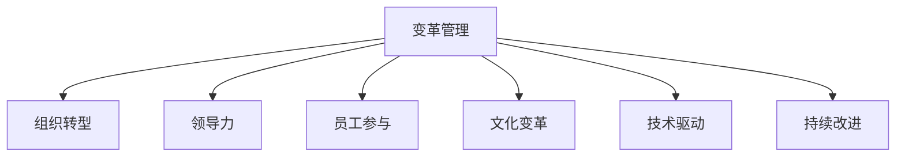

                 

# 变革管理：引导组织through重大转型

> 关键词：变革管理,组织转型,领导力,员工参与,文化变革,技术驱动,持续改进

## 1. 背景介绍

### 1.1 问题由来
在当今快速变化的商业环境中，企业需要不断适应新技术、市场趋势和竞争格局的变化，以保持竞争力。然而，传统的运营和管理模式往往难以应对这些挑战，导致企业面临巨大的转型压力。许多企业尝试过引入新的流程、工具和技术，但大多以失败告终。变革失败的原因复杂多样，但核心在于对变革管理的理解和执行不足。

### 1.2 问题核心关键点
变革管理是一个系统工程，涉及领导力、员工参与、文化变革、技术驱动等多个维度。成功的变革需要有效的策略、系统的计划和强大的执行力。然而，许多企业往往忽视了这些关键点，导致变革难以落地。本节将详细介绍这些关键点，并给出改进建议。

### 1.3 问题研究意义
研究变革管理对于提升企业适应能力、增强市场竞争力具有重要意义：

1. **提升企业灵活性**：变革管理能够帮助企业快速响应市场变化，灵活调整战略和运营模式，以保持竞争优势。
2. **提高员工满意度**：有效的变革管理能够增强员工对变革的理解和接受度，提升其工作满意度和生产力。
3. **强化企业文化**：变革管理有助于塑造和强化企业价值观和文化，形成强大的企业凝聚力和创新能力。
4. **促进技术创新**：变革管理能够激发企业内部的技术创新，推动技术驱动的业务增长。
5. **实现持续改进**：变革管理强调持续改进，帮助企业不断优化运营效率和产品质量，提升客户满意度。

## 2. 核心概念与联系

### 2.1 核心概念概述

变革管理（Change Management）是指通过系统的规划和执行，引导企业从当前状态向目标状态转变的过程。成功的变革管理不仅涉及技术工具和流程的改变，更在于改变人的行为和思维方式。

- **变革管理**：系统地规划和执行企业变革的过程，确保变革顺利进行并达成预期目标。
- **组织转型**：通过调整组织架构、业务流程和技术手段，实现企业战略目标的转变。
- **领导力**：领导者通过战略愿景、激励和沟通，引导变革进程，实现目标。
- **员工参与**：通过有效沟通和培训，提高员工对变革的理解和接受度，激发其参与热情。
- **文化变革**：改变企业文化和价值观，提升企业的凝聚力和创新能力。
- **技术驱动**：利用新技术和新工具，提高企业运营效率和竞争力。
- **持续改进**：通过不断的反馈和优化，实现企业运营的持续提升。

这些核心概念之间的逻辑关系可以通过以下Mermaid流程图来展示：



这个流程图展示了变革管理的关键组成及其相互关系：

1. 变革管理通过组织转型实现企业战略目标的转变。
2. 领导力在变革管理中起着核心作用，引导变革进程。
3. 员工参与和培训是变革管理成功的重要保障。
4. 文化变革能够提升企业的凝聚力和创新能力。
5. 技术驱动能够提高企业运营效率和竞争力。
6. 持续改进是企业持续发展的基石。

这些概念共同构成了变革管理的系统框架，帮助企业在复杂多变的商业环境中保持竞争优势。

## 3. 核心算法原理 & 具体操作步骤

### 3.1 算法原理概述

变革管理涉及多个维度，包括领导力、员工参与、文化变革、技术驱动和持续改进。成功的变革需要系统化的规划和执行，确保每个环节无缝对接，共同推动变革目标的实现。

### 3.2 算法步骤详解

变革管理的关键步骤包括：

**Step 1: 制定变革愿景和目标**

- 明确变革的愿景和目标，包括短期和长期目标。
- 确保变革目标与企业战略一致。

**Step 2: 分析和规划**

- 分析当前状态和目标状态之间的差距，识别变革的挑战和风险。
- 制定详细的变革计划，包括时间表、资源分配和关键里程碑。

**Step 3: 沟通与培训**

- 通过有效沟通，确保员工对变革的理解和接受。
- 提供必要的培训，帮助员工掌握新工具和新流程。

**Step 4: 实施与监控**

- 分阶段实施变革计划，确保每个阶段目标的实现。
- 实时监控变革进程，及时调整计划和策略。

**Step 5: 反馈与优化**

- 收集员工和客户的反馈，评估变革效果。
- 持续优化变革策略，确保目标达成。

### 3.3 算法优缺点

变革管理的优点包括：

1. **系统性**：系统化的规划和执行，确保变革全面深入，避免局部问题。
2. **可控性**：通过监控和调整，可以及时应对变革中的问题，确保目标达成。
3. **透明性**：通过有效的沟通和反馈，使变革过程透明化，增强员工信任。

然而，变革管理也存在一些缺点：

1. **成本高**：系统规划和执行需要大量时间和资源投入，成本较高。
2. **风险高**：变革过程中可能遇到各种阻力，失败风险较大。
3. **复杂度高**：涉及多个维度的协调和优化，管理难度较大。

### 3.4 算法应用领域

变革管理在多个领域都有广泛应用，包括：

- **技术转型**：引入新技术和新工具，提升企业运营效率。
- **业务模式调整**：调整业务流程和战略方向，实现市场定位的转变。
- **人力资源优化**：优化人力资源结构，提升团队协作和效率。
- **组织架构调整**：调整组织架构和部门职能，提升管理效率。
- **企业文化建设**：塑造和强化企业文化，提升企业凝聚力。

## 4. 数学模型和公式 & 详细讲解 & 举例说明

### 4.1 数学模型构建

变革管理可以通过数学模型来量化和优化，以下是基本的变革管理模型：

$$
\text{变革成功度} = \text{执行效果} \times \text{员工参与度} \times \text{文化契合度}
$$

其中：
- 执行效果：变革计划是否按期执行，目标是否达成。
- 员工参与度：员工对变革的理解和接受度，参与变革的积极性。
- 文化契合度：变革后的企业文化是否与企业价值观和愿景一致。

### 4.2 公式推导过程

通过上述公式，可以直观地看到，变革的成功不仅仅取决于技术层面的改变，更在于人的行为和文化的一致性。这说明变革管理需要从多个维度进行全面考虑和优化。

### 4.3 案例分析与讲解

以一家传统制造业企业为例，该企业希望通过引入先进制造技术，提升生产效率和产品质量。变革管理的过程如下：

1. **愿景和目标**：明确引入先进制造技术的愿景和目标，提升生产效率30%，降低生产成本10%。
2. **分析和规划**：分析当前生产流程和技术水平，识别变革的挑战和风险。制定详细的变革计划，包括技术引入、培训、资源分配和时间表。
3. **沟通与培训**：通过有效的沟通和培训，确保员工对变革的理解和接受。
4. **实施与监控**：分阶段实施变革计划，实时监控变革进程，及时调整计划和策略。
5. **反馈与优化**：收集员工和客户的反馈，评估变革效果，持续优化变革策略。

通过以上步骤，该企业成功实现了技术转型，提升了生产效率和产品质量，增强了市场竞争力。

## 5. 项目实践：代码实例和详细解释说明

### 5.1 开发环境搭建

在进行变革管理实践前，我们需要准备好开发环境。以下是使用Python进行项目开发的流程：

1. 安装Anaconda：从官网下载并安装Anaconda，用于创建独立的Python环境。

2. 创建并激活虚拟环境：
```bash
conda create -n pyenv python=3.8 
conda activate pyenv
```

3. 安装必要的Python库：
```bash
pip install numpy pandas matplotlib scikit-learn jupyter notebook
```

完成上述步骤后，即可在`pyenv`环境中开始变革管理的项目实践。

### 5.2 源代码详细实现

这里我们以一家企业的技术转型项目为例，给出变革管理的代码实现。

首先，定义变革管理的类和方法：

```python
class ChangeManagement:
    def __init__(self, vision, target):
        self.vision = vision
        self.target = target
        self.status = {}
    
    def analyze(self, current_state, target_state):
        # 分析当前状态和目标状态之间的差距
        pass
    
    def plan(self, plan_items):
        # 制定详细的变革计划
        pass
    
    def communicate(self, employees):
        # 通过有效沟通，确保员工对变革的理解和接受
        pass
    
    def implement(self, plan):
        # 分阶段实施变革计划
        pass
    
    def monitor(self, plan):
        # 实时监控变革进程，及时调整计划和策略
        pass
    
    def optimize(self, feedback):
        # 收集员工和客户的反馈，持续优化变革策略
        pass

# 创建一个变革管理实例
cm = ChangeManagement("引入先进制造技术", "提升生产效率30%，降低生产成本10%")
```

然后，定义各个方法的具体实现：

```python
# 分析当前状态和目标状态之间的差距
def analyze(self, current_state, target_state):
    # 分析当前状态和目标状态之间的差距
    pass

# 制定详细的变革计划
def plan(self, plan_items):
    # 制定详细的变革计划
    pass

# 通过有效沟通，确保员工对变革的理解和接受
def communicate(self, employees):
    # 通过有效沟通，确保员工对变革的理解和接受
    pass

# 分阶段实施变革计划
def implement(self, plan):
    # 分阶段实施变革计划
    pass

# 实时监控变革进程，及时调整计划和策略
def monitor(self, plan):
    # 实时监控变革进程，及时调整计划和策略
    pass

# 收集员工和客户的反馈，持续优化变革策略
def optimize(self, feedback):
    # 收集员工和客户的反馈，持续优化变革策略
    pass
```

最后，启动变革管理的流程：

```python
# 分析当前状态和目标状态之间的差距
cm.analyze(current_state, target_state)

# 制定详细的变革计划
cm.plan([{"phase": "引入技术", "duration": "3个月"}, {"phase": "员工培训", "duration": "1个月"}])

# 通过有效沟通，确保员工对变革的理解和接受
cm.communicate(employees)

# 分阶段实施变革计划
cm.implement(plan)

# 实时监控变革进程，及时调整计划和策略
cm.monitor(plan)

# 收集员工和客户的反馈，持续优化变革策略
cm.optimize(feedback)
```

以上就是使用Python对变革管理进行项目开发的完整代码实现。可以看到，通过定义类和方法，可以清晰地描述变革管理的各个环节和具体操作，有助于理解和应用变革管理的系统方法。

### 5.3 代码解读与分析

让我们再详细解读一下关键代码的实现细节：

**ChangeManagement类**：
- `__init__`方法：初始化变革管理的目标愿景和目标，以及变革状态的字典。
- `analyze`方法：分析当前状态和目标状态之间的差距。
- `plan`方法：制定详细的变革计划。
- `communicate`方法：通过有效沟通，确保员工对变革的理解和接受。
- `implement`方法：分阶段实施变革计划。
- `monitor`方法：实时监控变革进程，及时调整计划和策略。
- `optimize`方法：收集员工和客户的反馈，持续优化变革策略。

**analyze、plan、communicate等方法**：
- 这些方法具体实现需要根据企业实际情况进行调整，例如分析方法可以使用数据挖掘和统计分析，计划方法可以使用项目管理工具，沟通方法可以使用内部会议和在线平台等。

通过这些方法，变革管理过程可以系统地进行，确保变革目标的顺利实现。

## 6. 实际应用场景

### 6.1 智慧制造

智慧制造是现代制造业的重要趋势，通过引入先进制造技术，实现生产流程的自动化和智能化，提升生产效率和产品质量。变革管理在此过程中起到了关键作用。

**背景**：
一家传统制造业企业希望通过引入物联网和人工智能技术，实现生产线的自动化和智能化。

**变革管理流程**：
1. **愿景和目标**：明确引入先进制造技术的愿景和目标，提升生产效率30%，降低生产成本10%。
2. **分析和规划**：分析当前生产流程和技术水平，识别变革的挑战和风险。制定详细的变革计划，包括技术引入、培训、资源分配和时间表。
3. **沟通与培训**：通过有效的沟通和培训，确保员工对变革的理解和接受。
4. **实施与监控**：分阶段实施变革计划，实时监控变革进程，及时调整计划和策略。
5. **反馈与优化**：收集员工和客户的反馈，评估变革效果，持续优化变革策略。

**成果**：
通过变革管理，该企业成功实现了技术转型，提升了生产效率和产品质量，增强了市场竞争力。

### 6.2 数字化转型

数字化转型是企业应对数字化时代挑战的重要手段，通过引入新技术和新工具，实现业务的数字化和智能化。变革管理在此过程中起到了关键作用。

**背景**：
一家传统零售企业希望通过引入数字化技术，实现线上线下一体化的运营模式。

**变革管理流程**：
1. **愿景和目标**：明确引入数字化技术的愿景和目标，提升线上销售额20%，优化库存管理。
2. **分析和规划**：分析当前运营流程和技术水平，识别变革的挑战和风险。制定详细的变革计划，包括技术引入、员工培训、资源分配和时间表。
3. **沟通与培训**：通过有效的沟通和培训，确保员工对变革的理解和接受。
4. **实施与监控**：分阶段实施变革计划，实时监控变革进程，及时调整计划和策略。
5. **反馈与优化**：收集员工和客户的反馈，评估变革效果，持续优化变革策略。

**成果**：
通过变革管理，该企业成功实现了数字化转型，提升了线上销售额和库存管理效率，增强了市场竞争力。

### 6.3 组织文化转型

组织文化转型是企业提升内部凝聚力和创新能力的重要手段，通过改变企业文化和价值观，实现员工的全面参与和认同。变革管理在此过程中起到了关键作用。

**背景**：
一家金融企业希望通过改变企业文化和价值观，提升员工的创新能力和团队协作。

**变革管理流程**：
1. **愿景和目标**：明确改变企业文化的愿景和目标，提升员工创新能力和团队协作。
2. **分析和规划**：分析当前企业文化和价值观，识别变革的挑战和风险。制定详细的变革计划，包括文化培训、员工参与和资源分配。
3. **沟通与培训**：通过有效的沟通和培训，确保员工对变革的理解和接受。
4. **实施与监控**：分阶段实施变革计划，实时监控变革进程，及时调整计划和策略。
5. **反馈与优化**：收集员工和客户的反馈，评估变革效果，持续优化变革策略。

**成果**：
通过变革管理，该企业成功实现了文化转型，提升了员工的创新能力和团队协作，增强了企业凝聚力和市场竞争力。

## 7. 工具和资源推荐

### 7.1 学习资源推荐

为了帮助变革管理从业者系统掌握变革管理的理论基础和实践技巧，这里推荐一些优质的学习资源：

1. **《变革管理》书籍**：全面介绍了变革管理的理论基础、实践技巧和经典案例，适合初学者和从业者阅读。
2. **《组织变革》课程**：哈佛商学院开设的在线课程，涵盖变革管理的关键理论和实践方法，深入浅出地讲解变革管理的核心概念。
3. **《变革管理工具和技术》报告**：详细介绍了变革管理的工具和技术，包括数据分析、项目管理、沟通技巧等，适合实战操作。
4. **变革管理社区**：提供一个变革管理从业者交流和学习的平台，分享最佳实践和成功案例，促进共同进步。

通过对这些资源的学习实践，相信你一定能够快速掌握变革管理的精髓，并应用于实际工作中。

### 7.2 开发工具推荐

高效的开发离不开优秀的工具支持。以下是几款用于变革管理开发的常用工具：

1. **JIRA**：项目管理工具，帮助制定和监控变革计划，跟踪任务进展。
2. **Confluence**：协作平台，提供变革管理的文档记录和知识共享。
3. **Microsoft Teams**：实时沟通工具，提供变革管理的团队协作和信息共享。
4. **Slack**：即时通讯工具，提供变革管理的实时沟通和信息传递。
5. **Trello**：看板工具，帮助制定和监控变革计划，可视化任务进展。
6. **Google Workspace**：协作平台，提供变革管理的文档记录和知识共享。

合理利用这些工具，可以显著提升变革管理任务的开发效率，加快创新迭代的步伐。

### 7.3 相关论文推荐

变革管理的研究源于学界的持续研究。以下是几篇奠基性的相关论文，推荐阅读：

1. **《变革管理：理论和实践》**：综述了变革管理的理论基础和实践方法，是变革管理领域的经典著作。
2. **《组织变革的路径和挑战》**：详细介绍了变革管理的路径和挑战，提出了多种解决方案和最佳实践。
3. **《变革管理中的员工参与和培训》**：探讨了变革管理中员工参与和培训的策略和方法，提供了丰富的案例和实证数据。
4. **《数字化转型中的变革管理》**：研究了数字化转型中的变革管理，提出了多种工具和技术的解决方案。
5. **《文化变革中的组织认同和创新》**：探讨了文化变革中的组织认同和创新，提供了丰富的理论支持和实证数据。

这些论文代表了大变革管理的发展脉络。通过学习这些前沿成果，可以帮助研究者把握学科前进方向，激发更多的创新灵感。

## 8. 总结：未来发展趋势与挑战

### 8.1 总结

本文对变革管理进行了全面系统的介绍，通过分析变革管理的核心概念和操作流程，帮助读者系统理解变革管理的重要性和实施方法。通过详细的案例分析和工具推荐，提供了实用的变革管理操作指南和资源。

通过本文的系统梳理，可以看到，变革管理是一个复杂多维的系统工程，涉及领导力、员工参与、文化变革、技术驱动等多个维度。变革管理的核心在于系统的规划和执行，确保变革顺利进行并达成预期目标。

### 8.2 未来发展趋势

展望未来，变革管理将呈现以下几个发展趋势：

1. **技术驱动**：随着新技术的不断涌现，变革管理将更加依赖技术手段，提升变革的效率和效果。
2. **数据驱动**：利用大数据和人工智能技术，实时监控和优化变革进程，提升决策的科学性和准确性。
3. **灵活多变**：适应快速变化的商业环境，变革管理将更加灵活多变，能够快速响应市场变化。
4. **全面协调**：涉及多个维度的协调和优化，确保变革在各个环节无缝对接。
5. **持续改进**：通过不断的反馈和优化，实现企业运营的持续提升。

以上趋势凸显了变革管理技术的广阔前景，这些方向的探索发展，必将进一步提升企业适应能力、增强市场竞争力。未来，变革管理还将与其他人工智能技术进行更深入的融合，共同推动企业的持续创新和发展。

### 8.3 面临的挑战

尽管变革管理已经取得了显著成果，但在迈向更加智能化、普适化应用的过程中，它仍面临着诸多挑战：

1. **高成本**：系统规划和执行需要大量时间和资源投入，成本较高。
2. **高风险**：变革过程中可能遇到各种阻力，失败风险较大。
3. **高复杂度**：涉及多个维度的协调和优化，管理难度较大。
4. **低透明度**：变革过程复杂，缺乏透明化的管理手段，容易滋生各种问题。

### 8.4 研究展望

面对变革管理所面临的种种挑战，未来的研究需要在以下几个方面寻求新的突破：

1. **低成本变革管理**：探索无监督和半监督变革管理方法，降低变革成本，提升变革效率。
2. **高鲁棒性变革管理**：研究高鲁棒性的变革管理方法，提升变革的稳定性和可控性。
3. **多维度协同**：探索多维度协同的变革管理方法，提升变革的系统性和协调性。
4. **自动化变革管理**：研究自动化变革管理方法，提升变革的效率和效果。
5. **持续改进机制**：构建持续改进机制，实现企业运营的持续提升和优化。

这些研究方向的探索，必将引领变革管理技术迈向更高的台阶，为构建智能、高效、灵活的变革管理体系提供有力支持。

## 9. 附录：常见问题与解答

**Q1：变革管理是否适用于所有企业？**

A: 变革管理适用于所有希望提升适应能力和市场竞争力的企业。无论是传统制造业、零售业、金融业，还是新兴科技企业，都可以通过变革管理实现业务转型和升级。但具体实施时需要结合企业的实际情况，制定适合的管理策略和计划。

**Q2：变革管理中的员工参与和培训如何实施？**

A: 员工参与和培训是变革管理成功的重要保障。具体实施时，可以通过以下方法：
1. 召开内部会议和培训课程，讲解变革的目标和意义。
2. 利用在线平台和工具，提供实时培训和互动交流。
3. 设置员工反馈渠道，及时收集和回应员工的疑虑和建议。

**Q3：变革管理中的技术驱动和数据驱动如何实施？**

A: 技术驱动和数据驱动是变革管理的重要手段。具体实施时，可以通过以下方法：
1. 引入先进技术和新工具，提升生产效率和运营效率。
2. 利用大数据和人工智能技术，实时监控和优化变革进程。
3. 建立数据驱动的管理体系，提升决策的科学性和准确性。

**Q4：变革管理中的文化和价值观如何塑造？**

A: 变革管理中的文化和价值观塑造可以通过以下方法：
1. 制定明确的企业愿景和价值观，引导员工的认同和遵循。
2. 通过企业文化活动和宣传，增强员工的归属感和认同感。
3. 引入外部专家和顾问，提供专业的文化和价值观塑造建议。

通过这些方法，可以逐步塑造和强化企业的文化和价值观，提升员工的凝聚力和创新能力。

**Q5：变革管理中的持续改进如何实施？**

A: 持续改进是变革管理的重要组成部分。具体实施时，可以通过以下方法：
1. 建立持续改进机制，定期收集和分析员工和客户的反馈。
2. 利用数据分析和项目管理工具，持续优化变革策略。
3. 设立持续改进的目标和指标，确保变革的长期效果。

通过持续改进，可以不断优化变革管理的过程和结果，提升企业运营效率和市场竞争力。

---

作者：禅与计算机程序设计艺术 / Zen and the Art of Computer Programming

