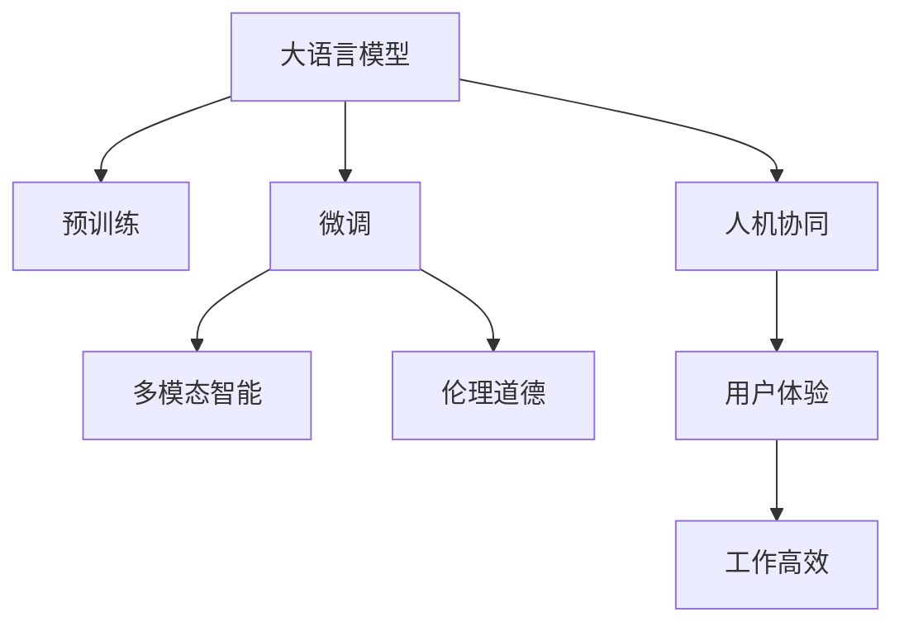

                 

# 后 LLM 时代：对社会的持续影响

> 关键词：大语言模型,预训练模型,微调,多模态智能,伦理道德,人机协同

## 1. 背景介绍

### 1.1 问题由来
随着大语言模型（Large Language Model, LLM）的兴起，人工智能领域进入了一个新的时代。LLM的优越性能得益于海量的数据和复杂的模型架构，能够处理自然语言中的各种细微差别和复杂关系。它不仅在自然语言处理（NLP）领域取得了突破性进展，还广泛应用于多个行业，包括金融、医疗、教育、客服等。然而，随着LLM技术的持续发展和广泛应用，也带来了一系列新的问题与挑战。

### 1.2 问题核心关键点
1. **数据隐私与安全**：LLM依赖大量数据进行训练，如何保护个人隐私和数据安全成为重要议题。
2. **偏见与歧视**：LLM可能无意中继承了训练数据中的偏见，导致输出结果存在歧视性问题。
3. **可解释性与透明度**：LLM的决策过程难以解释，透明度和可解释性不足，影响了用户信任。
4. **计算资源消耗**：LLM的模型规模庞大，训练和推理过程耗时耗力，需要高效且绿色的计算资源。
5. **伦理与道德**：LLM的广泛应用引发了伦理与道德层面的深刻思考，需要建立相应的规范和标准。

## 2. 核心概念与联系

### 2.1 核心概念概述

为更好地理解后LLM时代的应用与影响，本节将介绍几个关键概念及其相互联系：

- **大语言模型（LLM）**：基于自回归或自编码模型，通过大规模预训练学习到通用语言表示的模型。
- **预训练模型（Pre-training Model）**：在大量无标签数据上预训练模型，学习语言表示，为后续微调奠定基础。
- **微调（Fine-tuning）**：在预训练模型的基础上，使用特定任务的数据进行微调，优化模型在特定任务上的性能。
- **多模态智能（Multi-modal Intelligence）**：结合文本、图像、语音等多模态数据，提升模型的综合理解和生成能力。
- **伦理道德（Ethics and Morality）**：在AI应用中，需要考虑伦理道德问题，确保模型行为符合人类价值观。
- **人机协同（Human-Machine Collaboration）**：实现人机结合，共同完成任务，提升用户体验和工作效率。

这些核心概念构成了LLM技术应用的基础，相互联系、相互作用，共同推动了人工智能技术的进步和广泛应用。

### 2.2 核心概念原理和架构的 Mermaid 流程图



这个流程图展示了核心概念之间的联系：预训练的LLM模型通过微调优化特定任务性能，结合多模态数据提升综合理解能力，同时考虑伦理道德，确保人机协同中用户体验和工作高效。

## 3. 核心算法原理 & 具体操作步骤

### 3.1 算法原理概述

后LLM时代的核心算法原理主要包括：

- **预训练模型的构建**：利用大规模无标签数据对模型进行预训练，学习语言表示。
- **微调的实现**：通过有标签数据对预训练模型进行微调，优化特定任务上的性能。
- **多模态融合**：结合文本、图像、语音等多种数据类型，提升模型的理解和生成能力。
- **伦理道德的考量**：在算法设计、数据处理、模型训练及应用过程中，考虑伦理道德问题。

### 3.2 算法步骤详解

1. **数据准备**：收集并清洗数据，分为无标签数据和有标签数据。无标签数据用于预训练，有标签数据用于微调。
2. **模型构建**：选择合适的预训练模型（如GPT-3, BERT等），在无标签数据上进行预训练。
3. **微调准备**：选择合适的任务和数据集，设计任务适配层，设置微调超参数（学习率、批大小等）。
4. **微调训练**：在微调数据集上训练模型，优化特定任务上的性能。
5. **多模态融合**：将文本与图像、语音等模态数据融合，提升综合理解能力。
6. **伦理考量**：在算法设计中考虑伦理道德问题，确保模型行为符合社会规范。

### 3.3 算法优缺点

**优点**：

- **性能提升**：微调能够显著提升模型在特定任务上的性能，满足不同行业的需求。
- **多模态融合**：多模态智能能够提升模型的综合理解和生成能力，适应更复杂的任务。
- **伦理考量**：在算法设计中考虑伦理道德问题，确保模型行为符合社会规范。

**缺点**：

- **数据依赖**：微调对标注数据的需求较大，数据获取和标注成本较高。
- **资源消耗**：预训练和微调过程耗时耗力，需要高效且绿色的计算资源。
- **解释性不足**：模型的决策过程难以解释，透明度和可解释性不足。

### 3.4 算法应用领域

后LLM时代的应用领域极为广泛，涵盖了金融、医疗、教育、客服等多个行业。以下是几个典型的应用场景：

- **金融领域**：利用LLM进行市场舆情监测、信用评估、风险预警等。
- **医疗领域**：利用LLM进行病历分析、诊断辅助、药物研发等。
- **教育领域**：利用LLM进行智能辅导、个性化推荐、语言学习等。
- **客服领域**：利用LLM进行智能客服、对话机器人等。

## 4. 数学模型和公式 & 详细讲解 & 举例说明

### 4.1 数学模型构建

假设预训练模型为$M_{\theta}$，输入数据为$x$，输出为$y$，任务适配层为$H$。则模型的目标函数为：

$$\mathcal{L}(M_{\theta}, y) = \frac{1}{N} \sum_{i=1}^N \ell(y_i, M_{\theta}(x_i))$$

其中，$\ell$为任务损失函数，$N$为样本数量。

### 4.2 公式推导过程

以文本分类任务为例，目标函数$\ell$为交叉熵损失函数：

$$\ell(y_i, M_{\theta}(x_i)) = -(y_i \log M_{\theta}(x_i) + (1-y_i) \log (1-M_{\theta}(x_i)))$$

将目标函数展开，得到：

$$\mathcal{L}(M_{\theta}, y) = \frac{1}{N} \sum_{i=1}^N (-y_i \log M_{\theta}(x_i) - (1-y_i) \log (1-M_{\theta}(x_i)))$$

通过对目标函数进行最小化，优化模型参数$\theta$，提升模型在特定任务上的性能。

### 4.3 案例分析与讲解

以医疗领域为例，利用LLM进行病历分析。首先，收集医疗领域的相关病历数据，预训练一个医疗领域的LLM模型。然后，设计病历分析任务适配层，对模型进行微调。最后，将文本与图像、语音等多模态数据融合，提升综合理解能力，确保模型输出符合伦理道德规范。

## 5. 项目实践：代码实例和详细解释说明

### 5.1 开发环境搭建

为了进行后LLM时代的项目实践，需要搭建一个高效的开发环境：

1. **安装Anaconda**：从官网下载并安装Anaconda，用于创建独立的Python环境。
2. **创建虚拟环境**：
```bash
conda create -n llm-env python=3.8
conda activate llm-env
```
3. **安装相关库**：
```bash
pip install transformers torch torchvision torchaudio numpy pandas scikit-learn matplotlib tqdm jupyter notebook ipython
```

### 5.2 源代码详细实现

以医疗领域病历分析为例，给出使用Transformers库对BERT模型进行微调的PyTorch代码实现。

```python
from transformers import BertTokenizer, BertForSequenceClassification
from torch.utils.data import DataLoader
from torch.nn import CrossEntropyLoss
from sklearn.metrics import accuracy_score

# 加载预训练模型和分词器
tokenizer = BertTokenizer.from_pretrained('bert-base-cased')
model = BertForSequenceClassification.from_pretrained('bert-base-cased', num_labels=2)

# 数据准备
train_data = ['...', '...']  # 病历数据
train_labels = [0, 1]  # 病历分类标签
train_dataset = Dataset(train_data, train_labels, tokenizer)
train_dataloader = DataLoader(train_dataset, batch_size=16)

# 定义损失函数
criterion = CrossEntropyLoss()

# 模型训练
optimizer = AdamW(model.parameters(), lr=1e-5)
model.train()
for batch in train_dataloader:
    input_ids = batch['input_ids']
    attention_mask = batch['attention_mask']
    labels = batch['labels']
    outputs = model(input_ids, attention_mask=attention_mask, labels=labels)
    loss = criterion(outputs.logits, labels)
    optimizer.zero_grad()
    loss.backward()
    optimizer.step()

# 模型评估
test_data = ['...', '...']
test_labels = [0, 1]
test_dataset = Dataset(test_data, test_labels, tokenizer)
test_dataloader = DataLoader(test_dataset, batch_size=16)
model.eval()
test_loss = []
test_accuracy = []
for batch in test_dataloader:
    input_ids = batch['input_ids']
    attention_mask = batch['attention_mask']
    labels = batch['labels']
    with torch.no_grad():
        outputs = model(input_ids, attention_mask=attention_mask)
        loss = criterion(outputs.logits, labels)
        test_loss.append(loss.item())
        predictions = outputs.logits.argmax(dim=1)
        test_accuracy.append(accuracy_score(labels, predictions))
```

### 5.3 代码解读与分析

**BertTokenizer和BertForSequenceClassification**：

- `BertTokenizer`用于分词，将病历文本转化为token序列。
- `BertForSequenceClassification`用于构建分类器，输出文本的分类标签。

**数据准备**：

- `Dataset`类用于封装训练数据和标签，支持自动填充padding和截断，方便模型的输入。
- `DataLoader`用于批处理数据，方便模型的训练和推理。

**模型训练**：

- `AdamW`优化器用于模型参数的更新，控制学习率。
- 在每个epoch中，模型对训练数据进行前向传播和反向传播，更新参数。

**模型评估**：

- `CrossEntropyLoss`用于计算分类任务的损失函数。
- `accuracy_score`用于计算模型在测试集上的准确率。

通过上述代码，我们可以快速搭建一个基于BERT的病历分析模型，并进行训练和评估。需要注意的是，实际应用中还需要进行数据增强、正则化等优化策略，以提高模型的泛化能力和鲁棒性。

## 6. 实际应用场景

### 6.1 金融领域

在金融领域，LLM可以用于市场舆情监测、信用评估、风险预警等。通过微调，LLM能够学习金融领域的专业语言和术语，预测市场动态，为投资者提供决策支持。

### 6.2 医疗领域

在医疗领域，LLM可以用于病历分析、诊断辅助、药物研发等。通过微调，LLM能够理解医疗文本，提供精准的疾病诊断和个性化治疗建议。

### 6.3 教育领域

在教育领域，LLM可以用于智能辅导、个性化推荐、语言学习等。通过微调，LLM能够理解学生的学习需求和水平，提供个性化的教学建议和资源推荐。

### 6.4 客服领域

在客服领域，LLM可以用于智能客服、对话机器人等。通过微调，LLM能够理解客户需求，提供高效的客服解决方案。

## 7. 工具和资源推荐

### 7.1 学习资源推荐

为了帮助开发者系统掌握后LLM时代的技术，这里推荐一些优质的学习资源：

1. **《深度学习理论与实践》系列课程**：由知名大学教授录制，涵盖了深度学习理论、算法和应用实践。
2. **《Transformer: An Introduction》博文系列**：由大模型技术专家撰写，深入浅出地介绍了Transformer模型原理和实践。
3. **《自然语言处理：模型与算法》书籍**：详细介绍了NLP领域的各种模型和算法，包括LLM的构建和微调方法。
4. **HuggingFace官方文档**：提供丰富的预训练模型和微调样例，是学习LLM技术的最佳资源。
5. **CLUE开源项目**：涵盖多种中文NLP数据集，提供基于微调的baseline模型，助力中文NLP技术发展。

### 7.2 开发工具推荐

高效的开发离不开优秀的工具支持。以下是几款用于后LLM时代开发的常用工具：

1. **PyTorch**：基于Python的开源深度学习框架，适合快速迭代研究，与HuggingFace深度集成。
2. **TensorFlow**：由Google主导开发的开源深度学习框架，适合大规模工程应用。
3. **Transformers库**：HuggingFace开发的NLP工具库，支持多种预训练模型，易于微调。
4. **Weights & Biases**：实验跟踪工具，记录和可视化模型训练过程，方便调优。
5. **TensorBoard**：TensorFlow配套的可视化工具，实时监测模型训练状态，提供丰富的图表。

### 7.3 相关论文推荐

后LLM时代的研究源于学界的持续探索。以下是几篇奠基性的相关论文，推荐阅读：

1. **Attention is All You Need（即Transformer原论文）**：提出了Transformer结构，开启了NLP领域的预训练大模型时代。
2. **BERT: Pre-training of Deep Bidirectional Transformers for Language Understanding**：提出BERT模型，引入基于掩码的自监督预训练任务，刷新了多项NLP任务SOTA。
3. **Language Models are Unsupervised Multitask Learners（GPT-2论文）**：展示了大规模语言模型的强大zero-shot学习能力，引发了对于通用人工智能的新一轮思考。
4. **Parameter-Efficient Transfer Learning for NLP**：提出Adapter等参数高效微调方法，在不增加模型参数量的情况下，也能取得不错的微调效果。
5. **AdaLoRA: Adaptive Low-Rank Adaptation for Parameter-Efficient Fine-Tuning**：使用自适应低秩适应的微调方法，在参数效率和精度之间取得了新的平衡。

这些论文代表了后LLM时代的技术发展脉络，通过学习这些前沿成果，可以帮助研究者把握学科前进方向，激发更多的创新灵感。

## 8. 总结：未来发展趋势与挑战

### 8.1 总结

本文对后LLM时代的技术进行了全面系统的介绍。首先阐述了LLM技术的背景和重要性，明确了微调和多模态智能等技术的应用价值。其次，从原理到实践，详细讲解了LLM的构建和微调过程，给出了微调任务开发的完整代码实例。同时，本文还广泛探讨了LLM技术在金融、医疗、教育等多个领域的应用前景，展示了LLM技术的广泛影响力。此外，本文精选了LLM技术的各类学习资源，力求为读者提供全方位的技术指引。

通过本文的系统梳理，可以看到，后LLM时代的技术正在推动人工智能领域进入一个全新的阶段，LLM技术在多领域的应用将带来革命性的变革。未来，随着预训练模型的规模和参数量的不断增长，LLM技术将具备更强大的泛化能力和跨领域迁移能力，逐步迈向通用人工智能的目标。

### 8.2 未来发展趋势

展望未来，后LLM时代的技术将呈现以下几个发展趋势：

1. **模型规模持续增大**：随着算力成本的下降和数据规模的扩张，预训练模型的参数量将持续增长。超大规模语言模型蕴含的丰富语言知识，有望支撑更加复杂多变的下游任务微调。
2. **微调方法日趋多样**：除了传统的全参数微调外，未来会涌现更多参数高效的微调方法，如Prefix-Tuning、LoRA等，在节省计算资源的同时保证微调精度。
3. **持续学习成为常态**：随着数据分布的不断变化，微调模型也需要持续学习新知识以保持性能。如何在不遗忘原有知识的同时，高效吸收新样本信息，将成为重要的研究课题。
4. **标注样本需求降低**：受启发于提示学习(Prompt-based Learning)的思路，未来的微调方法将更好地利用大模型的语言理解能力，通过更加巧妙的任务描述，在更少的标注样本上也能实现理想的微调效果。
5. **多模态微调崛起**：当前的微调主要聚焦于纯文本数据，未来会进一步拓展到图像、视频、语音等多模态数据微调。多模态信息的融合，将显著提升语言模型对现实世界的理解和建模能力。
6. **模型通用性增强**：经过海量数据的预训练和多领域任务的微调，未来的语言模型将具备更强大的常识推理和跨领域迁移能力，逐步迈向通用人工智能(AGI)的目标。

以上趋势凸显了后LLM时代技术的广阔前景。这些方向的探索发展，必将进一步提升LLM系统的性能和应用范围，为人类认知智能的进化带来深远影响。

### 8.3 面临的挑战

尽管后LLM时代的技术已经取得了瞩目成就，但在迈向更加智能化、普适化应用的过程中，仍面临诸多挑战：

1. **数据隐私与安全**：LLM依赖大量数据进行训练，如何保护个人隐私和数据安全成为重要议题。
2. **偏见与歧视**：LLM可能无意中继承了训练数据中的偏见，导致输出结果存在歧视性问题。
3. **可解释性与透明度**：LLM的决策过程难以解释，透明度和可解释性不足，影响了用户信任。
4. **计算资源消耗**：预训练和微调过程耗时耗力，需要高效且绿色的计算资源。
5. **伦理道德问题**：LLM的广泛应用引发了伦理与道德层面的深刻思考，需要建立相应的规范和标准。

这些挑战需要通过技术创新和政策规范，逐步解决和优化。

### 8.4 研究展望

面对后LLM时代的技术挑战，未来的研究需要在以下几个方面寻求新的突破：

1. **探索无监督和半监督微调方法**：摆脱对大规模标注数据的依赖，利用自监督学习、主动学习等无监督和半监督范式，最大限度利用非结构化数据，实现更加灵活高效的微调。
2. **研究参数高效和计算高效的微调范式**：开发更加参数高效的微调方法，在固定大部分预训练参数的同时，只更新极少量的任务相关参数。同时优化微调模型的计算图，减少前向传播和反向传播的资源消耗，实现更加轻量级、实时性的部署。
3. **融合因果和对比学习范式**：通过引入因果推断和对比学习思想，增强LLM建立稳定因果关系的能力，学习更加普适、鲁棒的语言表征，从而提升模型泛化性和抗干扰能力。
4. **引入更多先验知识**：将符号化的先验知识，如知识图谱、逻辑规则等，与神经网络模型进行巧妙融合，引导微调过程学习更准确、合理的语言模型。同时加强不同模态数据的整合，实现视觉、语音等多模态信息与文本信息的协同建模。
5. **结合因果分析和博弈论工具**：将因果分析方法引入LLM模型，识别出模型决策的关键特征，增强输出解释的因果性和逻辑性。借助博弈论工具刻画人机交互过程，主动探索并规避模型的脆弱点，提高系统稳定性。
6. **纳入伦理道德约束**：在模型训练目标中引入伦理导向的评估指标，过滤和惩罚有偏见、有害的输出倾向。同时加强人工干预和审核，建立模型行为的监管机制，确保输出符合人类价值观和伦理道德。

这些研究方向的探索，必将引领后LLM时代的技术迈向更高的台阶，为构建安全、可靠、可解释、可控的智能系统铺平道路。面向未来，后LLM时代的技术还需要与其他人工智能技术进行更深入的融合，如知识表示、因果推理、强化学习等，多路径协同发力，共同推动自然语言理解和智能交互系统的进步。只有勇于创新、敢于突破，才能不断拓展LLM的边界，让智能技术更好地造福人类社会。

## 9. 附录：常见问题与解答

**Q1：大语言模型微调是否适用于所有NLP任务？**

A: 大语言模型微调在大多数NLP任务上都能取得不错的效果，特别是对于数据量较小的任务。但对于一些特定领域的任务，如医学、法律等，仅仅依靠通用语料预训练的模型可能难以很好地适应。此时需要在特定领域语料上进一步预训练，再进行微调，才能获得理想效果。

**Q2：微调过程中如何选择合适的学习率？**

A: 微调的学习率一般要比预训练时小1-2个数量级，如果使用过大的学习率，容易破坏预训练权重，导致过拟合。一般建议从1e-5开始调参，逐步减小学习率，直至收敛。也可以使用warmup策略，在开始阶段使用较小的学习率，再逐渐过渡到预设值。需要注意的是，不同的优化器(如AdamW、Adafactor等)以及不同的学习率调度策略，可能需要设置不同的学习率阈值。

**Q3：采用大模型微调时会面临哪些资源瓶颈？**

A: 目前主流的预训练大模型动辄以亿计的参数规模，对算力、内存、存储都提出了很高的要求。GPU/TPU等高性能设备是必不可少的，但即便如此，超大批次的训练和推理也可能遇到显存不足的问题。因此需要采用一些资源优化技术，如梯度积累、混合精度训练、模型并行等，来突破硬件瓶颈。同时，模型的存储和读取也可能占用大量时间和空间，需要采用模型压缩、稀疏化存储等方法进行优化。

**Q4：如何缓解微调过程中的过拟合问题？**

A: 过拟合是微调面临的主要挑战，尤其是在标注数据不足的情况下。常见的缓解策略包括：
1. 数据增强：通过回译、近义替换等方式扩充训练集
2. 正则化：使用L2正则、Dropout、Early Stopping等避免过拟合
3. 对抗训练：引入对抗样本，提高模型鲁棒性
4. 参数高效微调：只调整少量参数(如Adapter、Prefix等)，减小过拟合风险
5. 多模型集成：训练多个微调模型，取平均输出，抑制过拟合

这些策略往往需要根据具体任务和数据特点进行灵活组合。只有在数据、模型、训练、推理等各环节进行全面优化，才能最大限度地发挥大模型微调的威力。

**Q5：微调模型在落地部署时需要注意哪些问题？**

A: 将微调模型转化为实际应用，还需要考虑以下因素：
1. 模型裁剪：去除不必要的层和参数，减小模型尺寸，加快推理速度
2. 量化加速：将浮点模型转为定点模型，压缩存储空间，提高计算效率
3. 服务化封装：将模型封装为标准化服务接口，便于集成调用
4. 弹性伸缩：根据请求流量动态调整资源配置，平衡服务质量和成本
5. 监控告警：实时采集系统指标，设置异常告警阈值，确保服务稳定性
6. 安全防护：采用访问鉴权、数据脱敏等措施，保障数据和模型安全

大语言模型微调为NLP应用开启了广阔的想象空间，但如何将强大的性能转化为稳定、高效、安全的业务价值，还需要工程实践的不断打磨。唯有从数据、算法、工程、业务等多个维度协同发力，才能真正实现人工智能技术在垂直行业的规模化落地。总之，微调需要开发者根据具体任务，不断迭代和优化模型、数据和算法，方能得到理想的效果。

---

作者：禅与计算机程序设计艺术 / Zen and the Art of Computer Programming

