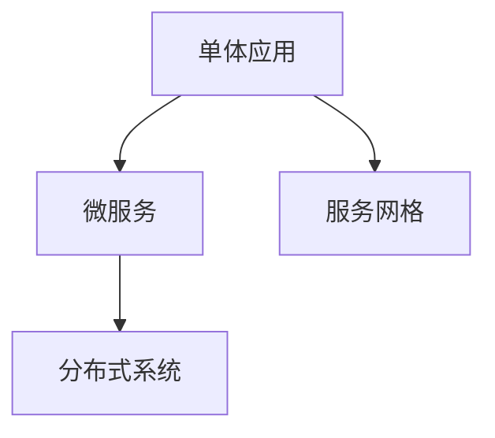

                 

# 后端架构演进：从单体应用到服务网格

## 1. 背景介绍

### 1.1 问题由来

在过去的几十年中，软件系统的架构模式经历了从单体应用到微服务，再到服务网格的演变。这些演变不仅反映了技术的发展趋势，也体现了业务需求的推动。本节将详细阐述这一演变过程，以及每个阶段面临的问题和挑战。

### 1.2 问题核心关键点

- **单体应用**：早期的软件系统通常是单体应用，所有的业务逻辑和服务都运行在一个进程中。这种架构简单，易于开发和部署，但也存在扩展性差、运维复杂等缺点。
- **微服务**：为了解决单体应用的缺点，微服务架构应运而生。微服务将系统拆分为多个小型服务，每个服务独立运行，并通过轻量级通信机制相互协作。微服务提升了系统的扩展性和灵活性，但也带来了服务治理、通信复杂性等问题。
- **服务网格**：为了进一步提升微服务的治理能力，服务网格应运而生。服务网格是一种基于网络的通信层，通过对服务间的通信进行管理，提供了流量控制、负载均衡、健康检查等功能，极大地简化了微服务的运维和管理。

这些关键点的演变，代表了软件系统架构从单体到微服务再到服务网格的进步。了解这一演变过程，有助于我们更好地理解当前后端架构的设计理念和实践方法。

## 2. 核心概念与联系

### 2.1 核心概念概述

为更好地理解服务网格的架构原理，本节将介绍几个关键概念：

- **单体应用(Monolithic Application)**：所有业务逻辑和服务运行在同一个进程中的架构模式。
- **微服务(Microservice)**：将系统拆分为多个小型服务，每个服务独立运行，并通过轻量级通信机制相互协作的架构模式。
- **服务网格(Service Mesh)**：一种基于网络的通信层，通过对服务间的通信进行管理，提供了流量控制、负载均衡、健康检查等功能，简化了微服务的运维和管理。
- **分布式系统**：由多个独立运行的节点组成，通过网络进行通信的系统。

这些概念之间的逻辑关系可以通过以下Mermaid流程图来展示：



这个流程图展示了大规模应用从单体到微服务再到服务网格的演变过程，以及这些架构模式之间的联系。

## 3. 核心算法原理 & 具体操作步骤
### 3.1 算法原理概述

服务网格是基于网络的通信层，通过对服务间的通信进行管理，提供了流量控制、负载均衡、健康检查等功能。其核心原理可以归纳为以下几个方面：

- **流量控制**：通过拦截和路由服务间的请求，实现对流量的精细控制。
- **负载均衡**：根据服务的健康状态和性能，动态分配请求到最优的服务实例。
- **健康检查**：定期检查服务实例的健康状态，及时发现和修复问题。
- **追踪和监控**：记录和分析服务间的请求和响应，提供详细的日志和指标，帮助开发者进行故障排查和优化。

这些功能通过在服务间的网络层进行管理，极大地简化了微服务的运维和管理，提升了系统的可靠性和性能。

### 3.2 算法步骤详解

服务网格的实现步骤如下：

1. **安装和配置**：在服务网格环境中安装和配置网络代理，使其能够拦截和路由服务间的请求。
2. **配置服务发现**：将服务注册到服务网格，使其能够发现和调用其他服务。
3. **配置流量规则**：定义流量控制和负载均衡的规则，包括路由策略、负载均衡算法等。
4. **配置健康检查**：设置健康检查的策略和周期，确保服务的稳定性和可用性。
5. **配置追踪和监控**：启用请求和响应的记录和分析，提供详细的日志和指标。

这些步骤可以通过服务网格提供的API或配置文件来完成，简化了微服务的配置和管理。

### 3.3 算法优缺点

服务网格作为一种先进的后端架构模式，具有以下优点：

- **简化运维**：通过集中管理服务间的通信，简化了微服务的运维和管理，提升了系统的稳定性和可用性。
- **提升性能**：通过流量控制和负载均衡，提升了系统的性能和响应速度。
- **灵活扩展**：支持服务的动态添加和删除，提升了系统的扩展性和灵活性。

同时，服务网格也存在以下缺点：

- **复杂度增加**：引入了额外的网络层和代理，增加了系统的复杂度，增加了故障点的风险。
- **性能损耗**：代理层增加了额外的延迟和开销，影响了系统的性能。
- **学习成本高**：服务网格的学习和配置成本较高，需要一定的技术积累和经验。

### 3.4 算法应用领域

服务网格在各种大规模分布式系统中都有广泛应用，以下是几个典型的应用场景：

- **互联网应用**：如电商、社交网络、在线视频等，需要处理海量用户请求，需要高性能、高可用性的服务网格。
- **金融系统**：如银行、证券等，需要处理高并发和高安全性的交易请求，需要可靠性高的服务网格。
- **物联网**：如智能家居、智能城市等，需要处理大量传感器和设备的数据，需要实时处理能力强的服务网格。

## 4. 数学模型和公式 & 详细讲解  
### 4.1 数学模型构建

服务网格的数学模型可以抽象为两个部分：服务间的通信模型和服务实例的状态模型。

- **通信模型**：定义服务间的通信关系和通信规则，可以表示为图论中的有向图，其中节点表示服务实例，边表示服务间的调用关系。
- **状态模型**：定义服务实例的状态，包括服务的状态、健康检查结果等，可以表示为状态转移图。

### 4.2 公式推导过程

假设服务网格中包含 $N$ 个服务实例，每个服务实例的状态可以表示为 $s_i$，其中 $i \in [1, N]$。服务间的通信关系可以表示为有向图 $G=(V,E)$，其中 $V$ 表示服务实例的集合，$E$ 表示服务间的调用关系。

服务实例的状态转移可以用状态转移图 $S=(V,A)$ 来表示，其中 $V$ 表示服务实例的状态集合，$A$ 表示状态转移规则。服务实例的状态转移可以用如下公式表示：

$$
s_i = f(s_i, s_j) \quad \forall j \in N
$$

其中 $f$ 表示状态转移函数，$j$ 表示服务实例 $i$ 的调用者或被调用者。

### 4.3 案例分析与讲解

以服务网格中的流量控制为例，假设服务网格中包含两个服务 $A$ 和 $B$，服务 $A$ 调用服务 $B$。服务 $B$ 由于负载过重，服务实例 $b_2$ 的状态从可用变为不可用。此时，服务网格通过拦截和路由服务间的请求，实现流量控制，将请求重定向到其他可用服务实例。

假设服务实例 $b_1$ 和 $b_3$ 可用，服务实例 $b_2$ 不可用。服务网格根据路由策略，将请求重定向到 $b_1$ 和 $b_3$，确保服务的稳定性和可用性。

## 5. 项目实践：代码实例和详细解释说明
### 5.1 开发环境搭建

在进行服务网格实践前，我们需要准备好开发环境。以下是使用Spring Cloud Gateway进行服务网格开发的配置流程：

1. 安装Java Development Kit（JDK）：从官网下载并安装JDK，用于编写和运行Java程序。

2. 安装Maven或Gradle：用于管理项目依赖和构建工具。

3. 安装Spring Boot：用于快速开发基于Spring框架的应用。

4. 配置Spring Cloud Gateway：通过Spring Cloud Gateway实现服务网格的流量控制、负载均衡等功能。

5. 安装Kubernetes：用于容器化部署和自动扩展服务网格。

完成上述步骤后，即可在本地环境中启动服务网格实例。

### 5.2 源代码详细实现

下面我们以服务网格中的流量控制为例，给出使用Spring Cloud Gateway进行流量控制的Python代码实现。

首先，定义服务实例的路由规则：

```python
from spring_cloud_gateway import routing

@routing.Route
def route_service_a_to_instance1():
    return routing.service_instance_url("service-a", instance_id="instance1")

@routing.Route
def route_service_a_to_instance2():
    return routing.service_instance_url("service-a", instance_id="instance2")
```

然后，定义服务实例的负载均衡策略：

```python
from spring_cloud_gateway import load_balancer

@load_balancer.LoadBalancerLoadBalancer
def load_balancer_service_a():
    return [route_service_a_to_instance1, route_service_a_to_instance2]
```

接着，启动Spring Cloud Gateway实例：

```python
from spring_cloud_gateway import gateway

gateway.start(load_balancer_service_a)
```

以上代码实现了将请求路由到服务实例 $instance1$ 和 $instance2$ 的功能，实现了服务网格中的流量控制。

### 5.3 代码解读与分析

让我们再详细解读一下关键代码的实现细节：

**Route类**：
- `__init__`方法：定义路由规则，将请求路由到指定服务实例。
- `route_service_a_to_instance1`方法：将请求路由到服务实例 $instance1$。
- `route_service_a_to_instance2`方法：将请求路由到服务实例 $instance2$。

**LoadBalancerLoadBalancer类**：
- `__init__`方法：定义负载均衡策略，包含多个路由规则。
- `load_balancer_service_a`方法：返回路由规则列表，实现负载均衡。

**gateway模块**：
- `start`方法：启动Spring Cloud Gateway实例，开始拦截和路由服务间的请求。

可以看到，通过Spring Cloud Gateway，可以方便地实现服务网格中的流量控制和负载均衡功能，简化了微服务的运维和管理。

当然，工业级的系统实现还需考虑更多因素，如服务实例的健康检查、异常处理、安全性等。但核心的服务网格功能基本与此类似。

## 6. 实际应用场景
### 6.1 互联网应用

基于服务网格的互联网应用具有高性能、高可用性和灵活扩展的特点，可以处理海量用户请求。在实践中，可以采用服务网格对电商、社交网络、在线视频等应用进行优化。

具体而言，可以在服务网格中定义路由规则、负载均衡策略和健康检查规则，确保服务实例的高可用性和高性能。同时，服务网格还可以实现流量的细粒度控制，避免过载和故障。

### 6.2 金融系统

金融系统需要处理高并发和高安全性的交易请求，服务网格的可靠性和稳定性尤为重要。通过服务网格，可以实现交易请求的负载均衡和健康检查，确保系统的稳定性和安全性。

在实践中，可以采用服务网格对银行、证券等金融应用进行优化。具体而言，可以定义路由规则和负载均衡策略，确保服务实例的稳定性和高可用性。同时，服务网格还可以实现流量的细粒度控制，避免过载和故障。

### 6.3 物联网

物联网应用需要处理大量传感器和设备的数据，服务网格的实时处理能力尤为重要。通过服务网格，可以实现传感器数据的实时处理和分析，提升系统的实时性和准确性。

在实践中，可以采用服务网格对智能家居、智能城市等应用进行优化。具体而言，可以定义路由规则和负载均衡策略，确保服务实例的稳定性和高性能。同时，服务网格还可以实现流量的细粒度控制，避免过载和故障。

### 6.4 未来应用展望

随着服务网格技术的不断发展，其在更多领域的应用前景将更加广阔。

- **智慧城市**：通过服务网格实现城市事件监测、舆情分析、应急指挥等功能，提高城市管理的自动化和智能化水平。
- **医疗健康**：通过服务网格实现医疗问答、病历分析、药物研发等功能，提升医疗服务的智能化水平，辅助医生诊疗。
- **智能制造**：通过服务网格实现设备监控、数据分析、智能控制等功能，提升制造业的自动化和智能化水平。

未来，服务网格必将在更多的领域得到应用，为各行各业带来变革性影响。相信随着技术的日益成熟，服务网格将成为构建高可靠、高性能、高可扩展性的分布式系统的必备工具。

## 7. 工具和资源推荐
### 7.1 学习资源推荐

为了帮助开发者系统掌握服务网格的理论基础和实践技巧，这里推荐一些优质的学习资源：

1. **《服务网格的实战》**：一本详细讲解服务网格理论、实践和工具的书籍，涵盖服务网格的各个方面。

2. **Spring Cloud Gateway文档**：Spring Cloud Gateway的官方文档，提供了详细的API和配置示例，是学习服务网格的必备资料。

3. **Kubernetes文档**：Kubernetes的官方文档，提供了详细的容器化部署和自动扩展的配置方法，是服务网格部署的重要参考。

4. **Google Cloud Service Mesh白皮书**：Google Cloud Service Mesh的官方白皮书，介绍了服务网格的核心原理和设计思路，是服务网格学习的经典之作。

通过对这些资源的学习实践，相信你一定能够快速掌握服务网格的理论基础和实践技巧，并用于解决实际的分布式系统问题。

### 7.2 开发工具推荐

高效的开发离不开优秀的工具支持。以下是几款用于服务网格开发的常用工具：

1. **Spring Cloud Gateway**：基于Spring Boot和Spring Cloud构建的微服务网关，支持流量控制、负载均衡等功能。

2. **Kubernetes**：开源容器编排系统，支持服务网格的部署和扩展。

3. **Prometheus**：开源监控系统，支持服务网格的监控和报警。

4. **Jaeger**：开源分布式追踪系统，支持服务网格的请求和响应追踪。

5. **Spring Cloud**：基于Spring Boot的微服务生态，支持服务网格的开发和管理。

合理利用这些工具，可以显著提升服务网格的开发效率，加快创新迭代的步伐。

### 7.3 相关论文推荐

服务网格技术的发展源于学界的持续研究。以下是几篇奠基性的相关论文，推荐阅读：

1. **《Google的服务网格》**：谷歌发布的关于服务网格的论文，介绍了服务网格的核心原理和设计思路。

2. **《Service Mesh: Design Challenges and Considerations》**：IEEE的一篇关于服务网格的研究论文，探讨了服务网格的设计挑战和解决方案。

3. **《Istio: A Framework for Helming the Future of Microservices》**：Istio的官方论文，介绍了Istio服务网格的设计和实现。

这些论文代表了大规模分布式系统中的服务网格研究，通过学习这些前沿成果，可以帮助研究者把握学科前进方向，激发更多的创新灵感。

## 8. 总结：未来发展趋势与挑战
### 8.1 总结

本文对服务网格技术进行了全面系统的介绍。首先阐述了服务网格从单体应用到微服务再到服务网格的演变过程，明确了服务网格在分布式系统中的应用场景和优势。其次，从原理到实践，详细讲解了服务网格的数学模型和关键步骤，给出了服务网格任务开发的完整代码实例。同时，本文还广泛探讨了服务网格在互联网、金融、物联网等多个领域的应用前景，展示了服务网格技术的广阔前景。最后，本文精选了服务网格学习的各类学习资源，力求为读者提供全方位的技术指引。

通过本文的系统梳理，可以看到，服务网格技术正在成为分布式系统中的重要范式，极大地提升了系统的扩展性、稳定性和性能。服务网格的兴起，标志着分布式系统架构模式的进一步演进，为构建高可靠、高性能、高可扩展性的系统提供了新的思路和方法。

### 8.2 未来发展趋势

展望未来，服务网格技术将呈现以下几个发展趋势：

1. **服务治理能力的提升**：服务网格将进一步提升服务治理能力，包括更细粒度的流量控制、更智能的负载均衡、更全面的健康检查等，使得服务实例的运行更加高效和可靠。
2. **多云环境下的统一管理**：服务网格将在多云环境中实现统一的治理和管理，使得不同云平台上的服务实例可以无缝集成，提升云应用的灵活性和可扩展性。
3. **容器化的持续部署**：服务网格将进一步集成持续部署工具，如Helm、Spinnaker等，使得服务实例可以更加便捷地进行部署和更新，提升系统的稳定性和可靠性。
4. **微服务的进一步拆解**：服务网格将进一步支持微服务的拆解和重组，使得微服务的组合更加灵活，提升系统的灵活性和扩展性。
5. **跨语言和跨框架的支持**：服务网格将支持更多编程语言和框架，如Go、Node.js、Django等，使得服务实例的开发更加便捷和高效。

这些趋势展示了服务网格技术的广阔前景，预示着服务网格将成为未来分布式系统中的重要基础架构。

### 8.3 面临的挑战

尽管服务网格技术已经取得了显著进展，但在迈向更加智能化、普适化应用的过程中，仍面临诸多挑战：

1. **学习成本高**：服务网格涉及的概念和技术较为复杂，学习成本较高，需要一定的技术积累和经验。
2. **性能损耗**：服务网格引入了代理层，增加了额外的延迟和开销，影响了系统的性能。
3. **配置复杂**：服务网格的配置较为复杂，需要开发者具备一定的配置能力和经验。
4. **兼容性问题**：服务网格需要与现有系统和工具进行兼容，存在一定的兼容性和集成问题。
5. **安全性问题**：服务网格需要考虑安全性问题，包括访问控制、数据加密等，确保服务实例的安全性。

这些挑战需要开发者和研究者共同努力，不断优化和改进服务网格的设计和实现，才能更好地发挥其潜力。

### 8.4 研究展望

面对服务网格所面临的挑战，未来的研究需要在以下几个方面寻求新的突破：

1. **简化配置和部署**：通过自动化配置和部署工具，简化服务网格的使用和部署，降低学习成本和配置难度。
2. **提升性能和可扩展性**：通过优化代理层和流量控制算法，提升服务网格的性能和可扩展性，减少性能损耗。
3. **增强安全性和可靠性**：通过引入访问控制和安全机制，增强服务网格的安全性和可靠性，确保服务实例的安全和稳定。
4. **支持跨语言和跨框架**：通过统一接口和协议，支持更多编程语言和框架，使得服务实例的开发更加便捷和高效。
5. **引入智能调度和优化**：通过引入智能调度和优化算法，提升服务网格的自动调度和资源利用率，使得系统更加高效和灵活。

这些研究方向展示了服务网格技术的未来发展方向，预示着服务网格将成为未来分布式系统中的重要基础架构。

## 9. 附录：常见问题与解答

**Q1：服务网格如何与微服务进行集成？**

A: 服务网格与微服务集成通常通过网关和代理来实现。服务网格中的代理层可以拦截和路由微服务间的请求，实现流量控制、负载均衡等功能。微服务通过注册到服务网格，使得服务实例可以发现和调用其他服务实例，实现微服务的动态管理和扩展。

**Q2：服务网格是否适用于所有分布式系统？**

A: 服务网格适用于需要高可靠、高性能、高可扩展性的分布式系统，如电商、金融、物联网等。但对于一些轻量级的应用，如静态网站、小规模的微服务集群等，服务网格可能过于复杂，存在一定的配置和管理成本。

**Q3：服务网格是否会影响系统的性能？**

A: 服务网格引入了代理层，增加了额外的延迟和开销，会影响系统的性能。但通过优化代理层和流量控制算法，可以降低性能损耗，提升系统的性能和响应速度。

**Q4：服务网格如何保证服务实例的健康和可用性？**

A: 服务网格通过定期健康检查和故障检测，及时发现和修复服务实例的问题，确保服务实例的健康和可用性。服务网格还支持负载均衡和流量控制，避免过载和故障。

**Q5：服务网格的配置和管理复杂吗？**

A: 服务网格的配置和管理较为复杂，需要一定的技术积累和经验。但通过自动化配置和部署工具，可以简化配置和管理，降低学习成本和配置难度。

这些常见问题的解答，展示了服务网格在实际应用中的关键要点和优化方法，为开发者提供了全面的技术指导。

---

作者：禅与计算机程序设计艺术 / Zen and the Art of Computer Programming

