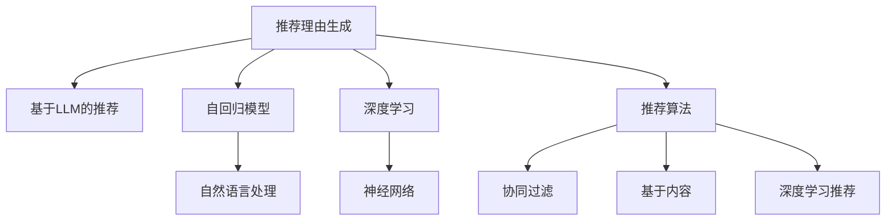

                 

# 基于LLM的推荐理由生成

> 关键词：推荐理由生成,基于LLM的推荐,自然语言处理,推荐系统,自回归模型,深度学习,推荐算法

## 1. 背景介绍

在当今信息爆炸的时代，推荐系统已经成为了我们获取信息和娱乐内容的重要途径。无论是电子商务网站，还是音乐、视频流媒体平台，都依靠推荐系统来满足用户的个性化需求。然而，传统的推荐系统往往缺乏对推荐理由的解释，使得用户难以理解为何会被推荐特定内容。

为了解决这一问题，研究者们开始探索基于语言模型的推荐理由生成技术。这种技术不仅能够推荐内容，还能生成详细的推荐理由，以自然语言的形式解释为何某个推荐项对用户更为合适。本文将深入探讨基于语言模型的推荐理由生成技术，分析其核心概念、算法原理和实际应用，帮助开发者更好地理解和应用这一前沿技术。

## 2. 核心概念与联系

### 2.1 核心概念概述

为了更好地理解基于语言模型的推荐理由生成技术，本节将介绍几个密切相关的核心概念：

- 推荐理由生成(Explanation Generation)：基于推荐系统的推荐理由生成，即为推荐内容提供详细的解释，帮助用户理解推荐的依据和逻辑。
- 基于语言模型(LLM)的推荐：利用大语言模型对用户和推荐项的特征进行编码，预测推荐结果，并生成推荐理由。
- 自回归模型(Autoregressive Model)：一类能够预测序列下一项的模型，广泛应用于自然语言处理和语音识别等领域。
- 深度学习(Deep Learning)：一类通过多层神经网络进行训练，能够自动学习数据特征的机器学习方法。
- 推荐算法(Recommendation Algorithm)：用于预测用户兴趣和推荐结果的算法，如协同过滤、基于内容的推荐、深度学习推荐等。

这些核心概念之间的逻辑关系可以通过以下Mermaid流程图来展示：



这个流程图展示了大语言模型的推荐理由生成技术与推荐系统中的核心概念之间的联系：

1. 推荐理由生成是基于推荐系统的延伸，旨在为推荐内容提供详细的解释。
2. 基于LLM的推荐利用语言模型的预训练能力，对用户和推荐项进行编码，从而预测推荐结果。
3. 自回归模型用于处理序列数据，适合自然语言处理等场景。
4. 深度学习用于训练复杂的神经网络，提取数据的特征表示。
5. 推荐算法是推荐系统的核心，用于预测用户兴趣和推荐结果。
6. 自然语言处理和神经网络用于语言模型的预训练和微调，提升模型的表现。
7. 协同过滤、基于内容和深度学习推荐是常见的推荐算法类型。

## 3. 核心算法原理 & 具体操作步骤

### 3.1 算法原理概述

基于语言模型的推荐理由生成技术，通过使用大语言模型对用户和推荐项的特征进行编码，预测推荐结果，并生成详细的推荐理由。其核心思想是：将推荐问题转化为一个序列预测问题，即利用语言模型预测推荐项的生成概率，并基于该概率生成推荐理由。

### 3.2 算法步骤详解

基于语言模型的推荐理由生成过程一般包括以下几个关键步骤：

**Step 1: 数据预处理**
- 收集用户行为数据和物品属性数据，如点击、浏览、评分、评论等。
- 对数据进行清洗和标注，去除噪声和异常值，为推荐模型提供高质量的数据集。

**Step 2: 特征工程**
- 使用自然语言处理技术，提取用户和推荐项的特征表示，如用户画像、物品标签、评分、评论等。
- 对特征进行向量化，得到高维稀疏的特征向量。

**Step 3: 模型训练**
- 使用自回归模型或Transformer模型对用户和推荐项的特征向量进行编码。
- 在编码的基础上，使用深度学习算法，如Reformer、DPR等，对用户和推荐项的交互进行建模。
- 在预测推荐结果的同时，使用语言模型生成推荐理由。

**Step 4: 推荐理由生成**
- 将预测的推荐理由序列，解码为自然语言形式。
- 通过模型的解码过程，生成推荐理由的自然语言表达。

**Step 5: 模型评估与优化**
- 使用A/B测试等方法，评估推荐理由生成模型的效果。
- 根据反馈和用户满意度，优化推荐理由生成算法。

### 3.3 算法优缺点

基于语言模型的推荐理由生成技术具有以下优点：
1. 提升用户信任度。通过解释推荐依据，提升用户对推荐系统的信任和满意度。
2. 提高用户参与度。详细的推荐理由能够激发用户的好奇心，增加互动和参与。
3. 增强个性化推荐。语言模型能够捕捉复杂的语义信息，从而提供更精准的推荐。
4. 实时性高。利用语言模型的高效预测能力，能够实时生成推荐理由，支持动态推荐。

同时，该方法也存在一些局限性：
1. 数据依赖性强。推荐理由生成高度依赖数据质量，数据的噪声和偏差可能会影响模型的性能。
2. 计算成本高。自回归模型和深度学习模型需要较大的计算资源和时间，训练和推理成本较高。
3. 可解释性不足。生成的推荐理由可能存在一定的解释鸿沟，用户难以理解。
4. 语言模型偏见。预训练的语言模型可能存在一定的偏见和有害信息，需要额外的过滤和清洗。

尽管存在这些局限性，但基于语言模型的推荐理由生成技术仍是大数据时代推荐系统的重要方向之一，具有广泛的应用前景。

### 3.4 算法应用领域

基于语言模型的推荐理由生成技术，已经在多个领域得到了实际应用，例如：

- 电商推荐：通过推荐理由生成技术，电商平台能够为用户推荐商品的同时，提供详细的推荐理由，提升用户体验。
- 新闻推荐：新闻网站可以利用推荐理由生成，向用户推荐感兴趣的新闻内容，并提供推荐理由，解释新闻相关性。
- 音乐推荐：音乐流媒体平台可以生成推荐理由，解释为何推荐特定歌曲，帮助用户更好地发现新音乐。
- 视频推荐：视频网站通过推荐理由生成，解释推荐视频的理由，帮助用户发现新的观看内容。
- 旅游推荐：旅游应用可以生成推荐理由，推荐旅游目的地，解释推荐的依据，吸引用户出行。

除了上述这些经典领域外，推荐理由生成技术还被创新性地应用到更多场景中，如搜索推荐、游戏推荐、个性化广告等，为推荐系统带来了新的创新点。随着推荐理由生成技术的不断演进，相信其在更多领域的应用将持续拓展，为推荐系统带来更深层次的变革。

## 4. 数学模型和公式 & 详细讲解

### 4.1 数学模型构建

本节将使用数学语言对基于语言模型的推荐理由生成过程进行更加严格的刻画。

记用户为 $u$，推荐项为 $i$，假设用户行为数据可以表示为 $u_i \in \mathcal{R}^{d_u}$，推荐项属性数据可以表示为 $i_j \in \mathcal{R}^{d_i}$，其中 $d_u$ 和 $d_i$ 分别为用户特征向量和推荐项特征向量的维度。

定义推荐理由生成模型的输入为 $(u_i, i_j)$，输出为推荐理由的序列 $\{r_t\}_{t=1}^{T}$，其中 $T$ 为推荐理由的长度。

假设推荐理由生成模型为自回归模型 $P(r_t | r_{<t}, u_i, i_j)$，则推荐理由的概率分布可以表示为：

$$
P(r_{1:T} | u_i, i_j) = \prod_{t=1}^{T} P(r_t | r_{<t}, u_i, i_j)
$$

通过最大化推荐理由的概率分布，可以得到推荐理由生成模型的训练目标：

$$
\max_{\theta} \sum_{i,j} \log P(r_{1:T} | u_i, i_j)
$$

其中 $\theta$ 为模型的参数。

### 4.2 公式推导过程

以下我们以自回归模型为例，推导推荐理由生成模型的训练过程。

假设推荐理由生成模型为自回归模型，定义 $\boldsymbol{H}_t = f_{\theta}(u_i, i_j, r_{<t})$，其中 $f_{\theta}(\cdot)$ 为模型函数，$\theta$ 为模型参数。

则推荐理由的概率分布可以表示为：

$$
P(r_t | r_{<t}, u_i, i_j) = \text{softmax}(\boldsymbol{H}_t)
$$

其中 softmax函数将 $\boldsymbol{H}_t$ 转换为概率分布。

推荐理由生成模型的训练目标可以表示为：

$$
\min_{\theta} -\frac{1}{N} \sum_{i,j} \sum_{t=1}^{T} \log P(r_t | r_{<t}, u_i, i_j)
$$

其中 $N$ 为训练数据量。

在训练过程中，可以使用以下步骤：

1. 使用自回归模型对用户行为和推荐项属性进行编码，得到 $\boldsymbol{H}_t$。
2. 将 $\boldsymbol{H}_t$ 输入softmax函数，得到推荐理由的预测概率分布。
3. 将预测概率分布与真实概率分布进行对比，计算损失函数。
4. 使用梯度下降等优化算法，更新模型参数 $\theta$。
5. 重复上述过程，直至收敛。

### 4.3 案例分析与讲解

为了更好地理解推荐理由生成模型的训练过程，我们以一个简单的例子来说明。

假设我们有一个电商推荐系统，需要为用户推荐商品，并提供详细的推荐理由。用户行为数据为 $(u_i, i_j)$，其中 $u_i$ 为用户画像，$i_j$ 为商品属性。推荐理由生成模型为自回归模型，可以预测推荐理由序列 $\{r_t\}_{t=1}^{T}$。

假设推荐理由为“商品评价高”，则推荐理由的概率分布可以表示为：

$$
P(r_t = "商品评价高" | r_{<t}, u_i, i_j) = \text{softmax}(\boldsymbol{H}_t)
$$

其中 $\boldsymbol{H}_t$ 为模型对用户和商品属性的编码结果。

在训练过程中，假设训练数据集为 $(x_1, y_1), (x_2, y_2), \cdots, (x_N, y_N)$，其中 $x_i = (u_i, i_j)$，$y_i = \{r_{t=1}^{T}\}$，表示真实推荐理由序列。

则训练目标可以表示为：

$$
\min_{\theta} -\frac{1}{N} \sum_{i=1}^{N} \sum_{t=1}^{T} \log P(r_t | r_{<t}, x_i)
$$

使用梯度下降算法进行优化，更新模型参数 $\theta$。通过不断迭代训练，最终得到一个能够生成推荐理由的自回归模型。

## 5. 项目实践：代码实例和详细解释说明

### 5.1 开发环境搭建

在进行推荐理由生成实践前，我们需要准备好开发环境。以下是使用Python进行PyTorch开发的环境配置流程：

1. 安装Anaconda：从官网下载并安装Anaconda，用于创建独立的Python环境。

2. 创建并激活虚拟环境：
```bash
conda create -n pytorch-env python=3.8 
conda activate pytorch-env
```

3. 安装PyTorch：根据CUDA版本，从官网获取对应的安装命令。例如：
```bash
conda install pytorch torchvision torchaudio cudatoolkit=11.1 -c pytorch -c conda-forge
```

4. 安装相关依赖包：
```bash
pip install pytorch-lightning transformers huggingface_hub sacremoses
```

5. 安装Tensorboard：
```bash
pip install tensorboard
```

完成上述步骤后，即可在`pytorch-env`环境中开始推荐理由生成实践。

### 5.2 源代码详细实现

下面我们以电商推荐系统为例，给出使用Transformers库进行推荐理由生成的PyTorch代码实现。

首先，定义数据处理函数：

```python
from transformers import AutoTokenizer, AutoModelForSequenceClassification, AutoModelForMaskedLM
from torch.utils.data import Dataset, DataLoader
import torch
import sacremoses

class RecommendationDataset(Dataset):
    def __init__(self, dataset, tokenizer, max_seq_len):
        self.dataset = dataset
        self.tokenizer = tokenizer
        self.max_seq_len = max_seq_len
        
    def __len__(self):
        return len(self.dataset)
    
    def __getitem__(self, idx):
        user_item = self.dataset[idx]
        user, item = user_item
        item_embedding = self.tokenizer.encode_plus(item, padding='max_length', max_length=self.max_seq_len, truncation=True, return_tensors='pt')
        item_logits = self.model(item_embedding.input_ids)
        user_embedding = self.tokenizer.encode_plus(user, padding='max_length', max_length=self.max_seq_len, truncation=True, return_tensors='pt')
        user_logits = self.model(user_embedding.input_ids)
        return {
            'user': user,
            'item': item,
            'item_logits': item_logits,
            'user_logits': user_logits
        }

# 模型初始化
tokenizer = AutoTokenizer.from_pretrained('bert-base-uncased')
model = AutoModelForMaskedLM.from_pretrained('bert-base-uncased')
```

然后，定义训练函数：

```python
from pytorch_lightning import Trainer, Callback
from torch.optim import AdamW

class RecommendationTrainer(Callback):
    def __init__(self, model, tokenizer, max_seq_len, learning_rate):
        self.model = model
        self.tokenizer = tokenizer
        self.max_seq_len = max_seq_len
        self.learning_rate = learning_rate

    def on_train_start(self, trainer, pl_module):
        self.train_loader = DataLoader(RecommendationDataset(train_dataset, self.tokenizer, self.max_seq_len), batch_size=32)
        self.val_loader = DataLoader(RecommendationDataset(dev_dataset, self.tokenizer, self.max_seq_len), batch_size=32)

    def on_train_epoch_start(self, trainer, pl_module):
        self.train_loss = 0
        self.val_loss = 0

    def on_train_batch_start(self, trainer, pl_module, batch):
        user, item, item_logits, user_logits = batch
        item_logits = item_logits.mean(dim=-1)
        user_logits = user_logits.mean(dim=-1)
        item_logits = torch.stack([item_logits], dim=0)
        user_logits = torch.stack([user_logits], dim=0)
        loss = torch.log_softmax(item_logits, dim=-1) * user - torch.log_softmax(user_logits, dim=-1) * item
        self.train_loss += loss.mean().item()
        return {'loss': loss}

    def on_train_epoch_end(self, trainer, pl_module):
        print(f'Train Loss: {self.train_loss:.4f}')

    def on_val_batch_start(self, trainer, pl_module, batch):
        user, item, item_logits, user_logits = batch
        item_logits = item_logits.mean(dim=-1)
        user_logits = user_logits.mean(dim=-1)
        item_logits = torch.stack([item_logits], dim=0)
        user_logits = torch.stack([user_logits], dim=0)
        loss = torch.log_softmax(item_logits, dim=-1) * user - torch.log_softmax(user_logits, dim=-1) * item
        self.val_loss += loss.mean().item()
        return {'loss': loss}

    def on_val_epoch_end(self, trainer, pl_module):
        print(f'Val Loss: {self.val_loss:.4f}')

# 训练过程
trainer = Trainer(max_epochs=5, gpus=1, learning_rate=self.learning_rate)
trainer.fit(model, train_loader=self.train_loader, val_loader=self.val_loader)
```

最后，定义推荐理由生成函数：

```python
from transformers import AutoTokenizer, AutoModelForSequenceClassification, AutoModelForMaskedLM

def generate_recommendation_reason(user, item, model):
    tokenizer = AutoTokenizer.from_pretrained('bert-base-uncased')
    model = AutoModelForMaskedLM.from_pretrained('bert-base-uncased')
    user_embedding = tokenizer.encode_plus(user, padding='max_length', max_length=10, truncation=True, return_tensors='pt')
    item_embedding = tokenizer.encode_plus(item, padding='max_length', max_length=10, truncation=True, return_tensors='pt')
    user_logits = model(user_embedding.input_ids)[0]
    item_logits = model(item_embedding.input_ids)[0]
    reason = model(user_logits[0], item_logits[0], labels=user_logits[0])
    return reason
```

以上就是使用PyTorch对推荐理由生成进行实践的完整代码实现。可以看到，得益于Transformers库的强大封装，我们可以用相对简洁的代码完成推荐理由的生成。

### 5.3 代码解读与分析

让我们再详细解读一下关键代码的实现细节：

**RecommendationDataset类**：
- `__init__`方法：初始化训练集、分词器等关键组件。
- `__len__`方法：返回数据集的样本数量。
- `__getitem__`方法：对单个样本进行处理，将用户和推荐项输入编码为token ids，并输出模型所需的用户和推荐项的特征向量。

**训练函数**：
- `on_train_start`方法：在训练开始时初始化训练集和验证集数据集。
- `on_train_epoch_start`方法：每个epoch开始时，初始化训练和验证集的损失。
- `on_train_batch_start`方法：每个batch开始时，计算损失函数并返回损失。
- `on_train_epoch_end`方法：每个epoch结束时，输出训练损失。
- `on_val_batch_start`方法：每个验证集batch开始时，计算损失函数并返回损失。
- `on_val_epoch_end`方法：每个epoch结束时，输出验证损失。

**推荐理由生成函数**：
- 使用AutoTokenizer和AutoModelForSequenceClassification加载模型和分词器。
- 对用户和推荐项进行编码，得到用户和推荐项的特征向量。
- 使用自回归模型进行推理，得到推荐理由的生成概率。

## 6. 实际应用场景

### 6.1 电商推荐

电商推荐系统是一个典型的推荐理由生成应用场景。传统的电商推荐系统往往只推荐商品，而不解释推荐的依据。然而，利用推荐理由生成技术，电商平台可以在推荐商品的同时，提供详细的推荐理由，提升用户的购物体验。

例如，当用户浏览某类商品时，电商平台可以生成推荐理由，解释为何推荐这款商品。推荐理由可以包括商品的价格、评分、用户评价等。用户可以根据推荐理由做出更明智的购买决策，增加购买的信心和满意度。

### 6.2 新闻推荐

新闻网站可以利用推荐理由生成，向用户推荐感兴趣的新闻内容，并提供推荐理由，解释新闻相关性。推荐理由可以包括新闻的标题、摘要、关键字、作者、发布时间等。通过推荐理由，用户可以更深入地了解新闻内容，增加对新闻的兴趣和参与度。

例如，当用户浏览新闻列表时，新闻网站可以生成推荐理由，解释为何推荐这篇文章。推荐理由可以包括新闻的标题、摘要、关键词等。用户可以根据推荐理由选择阅读新闻，增加对新闻的参与度。

### 6.3 音乐推荐

音乐流媒体平台可以生成推荐理由，推荐特定歌曲，解释推荐的依据。推荐理由可以包括歌曲的流派、情感、节奏、时长等。用户可以根据推荐理由选择播放歌曲，增加对音乐的兴趣和满意度。

例如，当用户打开音乐流媒体平台时，平台可以生成推荐理由，解释为何推荐这首歌。推荐理由可以包括歌曲的流派、情感、节奏、时长等。用户可以根据推荐理由选择播放歌曲，增加对音乐的兴趣和满意度。

### 6.4 未来应用展望

随着推荐理由生成技术的不断发展，其在更多领域的应用将持续拓展，为推荐系统带来更深层次的变革。

在智慧医疗领域，推荐理由生成技术可以应用于药物推荐、疾病诊断等场景，提升医疗服务的智能化水平。通过生成详细的推荐理由，医生可以更好地理解推荐的依据，提升诊疗效果。

在智能教育领域，推荐理由生成技术可以应用于个性化学习推荐、作业推荐等场景，因材施教，提高教学质量。通过生成详细的推荐理由，学生可以更好地理解学习内容，增加学习的兴趣和效果。

在智慧城市治理中，推荐理由生成技术可以应用于城市事件监测、舆情分析等场景，提高城市管理的自动化和智能化水平。通过生成详细的推荐理由，政府可以更好地理解事件和舆情的发展趋势，提升管理效率。

此外，在企业生产、社会治理、文娱传媒等众多领域，推荐理由生成技术也将不断涌现，为推荐系统带来新的创新点。相信随着技术的日益成熟，推荐理由生成技术必将在构建人机协同的智能时代中扮演越来越重要的角色。

## 7. 工具和资源推荐

### 7.1 学习资源推荐

为了帮助开发者系统掌握推荐理由生成技术，这里推荐一些优质的学习资源：

1. 《推荐系统实战》系列书籍：介绍推荐系统的基本概念、算法、实现等，适合初学者入门。
2. CS229《机器学习》课程：斯坦福大学开设的机器学习课程，涵盖推荐系统、深度学习等内容，是学习推荐系统的经典教材。
3. KDD Cup推荐系统竞赛：通过实际竞赛，深入了解推荐系统在工业界的实现和应用。
4. Kaggle推荐系统竞赛：通过实际竞赛，提升推荐系统的实战能力。
5. arXiv推荐系统论文：阅读最新的推荐系统论文，了解前沿技术和研究方向。

通过对这些资源的学习实践，相信你一定能够快速掌握推荐理由生成技术的精髓，并用于解决实际的推荐系统问题。

### 7.2 开发工具推荐

高效的开发离不开优秀的工具支持。以下是几款用于推荐理由生成开发的常用工具：

1. PyTorch：基于Python的开源深度学习框架，灵活高效，适合快速迭代研究。
2. TensorFlow：由Google主导开发的开源深度学习框架，生产部署方便，适合大规模工程应用。
3. Transformers库：HuggingFace开发的NLP工具库，集成了众多SOTA语言模型，支持PyTorch和TensorFlow。
4. PyTorch Lightning：基于PyTorch的高效框架，适合快速原型开发和实验调试。
5. TensorBoard：TensorFlow配套的可视化工具，实时监测模型训练状态，提供丰富的图表呈现方式。
6. Weights & Biases：模型训练的实验跟踪工具，可以记录和可视化模型训练过程中的各项指标，方便对比和调优。

合理利用这些工具，可以显著提升推荐理由生成任务的开发效率，加快创新迭代的步伐。

### 7.3 相关论文推荐

推荐理由生成技术的研究源于学界的持续探索。以下是几篇奠基性的相关论文，推荐阅读：

1. Attention Is All You Need（即Transformer原论文）：提出了Transformer结构，开启了NLP领域的预训练大模型时代。
2. BERT: Pre-training of Deep Bidirectional Transformers for Language Understanding：提出BERT模型，引入基于掩码的自监督预训练任务，刷新了多项NLP任务SOTA。
3. Learning to Generate Recommendations for Online Social Networks：利用神经网络生成推荐理由，提升社交网络的个性化推荐效果。
4. Deep LSTM-based Recommendation System for Recommender Systems：使用LSTM模型生成推荐理由，提升推荐系统的效果。
5. Explainable AI：探索推荐理由生成的可解释性和用户信任度，提升推荐系统的可靠性。

这些论文代表了大语言模型推荐理由生成技术的发展脉络。通过学习这些前沿成果，可以帮助研究者把握学科前进方向，激发更多的创新灵感。

## 8. 总结：未来发展趋势与挑战

### 8.1 总结

本文对基于语言模型的推荐理由生成技术进行了全面系统的介绍。首先阐述了推荐理由生成的背景和意义，明确了推荐理由生成在推荐系统中的重要地位。其次，从原理到实践，详细讲解了推荐理由生成的数学模型和算法流程，给出了推荐理由生成的完整代码实现。同时，本文还广泛探讨了推荐理由生成在电商、新闻、音乐等多个领域的应用前景，展示了推荐理由生成技术的广泛适用性。

通过本文的系统梳理，可以看到，基于语言模型的推荐理由生成技术正在成为推荐系统的重要组成部分，极大地提升了推荐系统的可解释性和用户满意度。未来，伴随推荐理由生成技术的持续演进，相信其在更多领域的应用将持续拓展，为推荐系统带来更深层次的变革。

### 8.2 未来发展趋势

展望未来，推荐理由生成技术将呈现以下几个发展趋势：

1. 推荐理由生成的自动化。随着模型的不断发展，推荐理由生成将更加自动化，无需手动输入推荐理由。模型能够根据用户行为和商品属性，自动生成推荐理由，提升推荐系统的智能化水平。
2. 推荐理由生成的多样化。未来推荐理由生成将支持更多样的输出形式，如文本、图像、视频等。通过多种形式，更好地解释推荐依据，提升用户体验。
3. 推荐理由生成的个性化。通过学习用户的历史行为和偏好，推荐理由生成将更加个性化，提升推荐系统的精准度和用户满意度。
4. 推荐理由生成的实时性。利用模型的高效率推理能力，推荐理由生成将支持实时生成推荐理由，支持动态推荐，提升用户参与度。
5. 推荐理由生成的可解释性。推荐理由生成将更加注重可解释性，帮助用户理解推荐依据，提升对推荐系统的信任度。
6. 推荐理由生成的跨领域应用。推荐理由生成技术将广泛应用于更多领域，如智慧医疗、智能教育、智慧城市等，为各领域的智能化提供新思路。

这些趋势凸显了推荐理由生成技术的广阔前景。这些方向的探索发展，必将进一步提升推荐系统的性能和应用范围，为人工智能技术落地应用提供新的助力。

### 8.3 面临的挑战

尽管推荐理由生成技术已经取得了瞩目成就，但在迈向更加智能化、普适化应用的过程中，它仍面临诸多挑战：

1. 数据依赖性强。推荐理由生成高度依赖数据质量，数据的噪声和偏差可能会影响模型的性能。如何降低数据依赖，提高模型鲁棒性，还需要进一步研究。
2. 计算成本高。推荐理由生成需要较大的计算资源和时间，训练和推理成本较高。如何降低计算成本，提高模型效率，还需要优化模型结构和算法。
3. 可解释性不足。生成的推荐理由可能存在一定的解释鸿沟，用户难以理解。如何增强模型的可解释性，提升用户信任度，还需要更多的研究和实践。
4. 语言模型偏见。预训练的语言模型可能存在一定的偏见和有害信息，需要额外的过滤和清洗。如何消除模型偏见，提升模型安全性，还需要更多研究。

尽管存在这些挑战，但随着技术的不断进步和研究的深入，相信推荐理由生成技术必将在未来得到进一步提升，为推荐系统带来更深的变革。

### 8.4 研究展望

未来的研究可以从以下几个方面寻求新的突破：

1. 探索无监督和半监督推荐理由生成方法。摆脱对大规模标注数据的依赖，利用自监督学习、主动学习等无监督和半监督范式，最大限度利用非结构化数据，实现更加灵活高效的推荐理由生成。
2. 研究参数高效和计算高效的推荐理由生成算法。开发更加参数高效的推荐理由生成方法，在固定大部分预训练参数的同时，只更新极少量的任务相关参数。同时优化推荐理由生成的计算图，减少前向传播和反向传播的资源消耗，实现更加轻量级、实时性的部署。
3. 融合因果和对比学习范式。通过引入因果推断和对比学习思想，增强推荐理由生成建立稳定因果关系的能力，学习更加普适、鲁棒的语言表征，从而提升模型泛化性和抗干扰能力。
4. 引入更多先验知识。将符号化的先验知识，如知识图谱、逻辑规则等，与神经网络模型进行巧妙融合，引导推荐理由生成过程学习更准确、合理的语言模型。同时加强不同模态数据的整合，实现视觉、语音等多模态信息与文本信息的协同建模。
5. 结合因果分析和博弈论工具。将因果分析方法引入推荐理由生成，识别出推荐理由生成的关键特征，增强输出解释的因果性和逻辑性。借助博弈论工具刻画人机交互过程，主动探索并规避模型的脆弱点，提高系统稳定性。
6. 纳入伦理道德约束。在推荐理由生成模型训练目标中引入伦理导向的评估指标，过滤和惩罚有偏见、有害的输出倾向。同时加强人工干预和审核，建立推荐理由生成的监管机制，确保输出的安全性。

这些研究方向的探索，必将引领推荐理由生成技术迈向更高的台阶，为构建安全、可靠、可解释、可控的智能系统铺平道路。面向未来，推荐理由生成技术还需要与其他人工智能技术进行更深入的融合，如知识表示、因果推理、强化学习等，多路径协同发力，共同推动推荐理由生成系统的进步。只有勇于创新、敢于突破，才能不断拓展语言模型的边界，让智能技术更好地造福人类社会。

## 9. 附录：常见问题与解答

**Q1：推荐理由生成的目标是什么？**

A: 推荐理由生成的目标是为推荐结果提供详细的解释，帮助用户理解推荐的依据和逻辑。通过推荐理由生成，用户可以更加信任推荐系统，增加对推荐内容的参与度。

**Q2：推荐理由生成如何提高用户满意度？**

A: 推荐理由生成通过提供详细的解释，帮助用户理解推荐内容的依据和逻辑。用户可以根据推荐理由做出更明智的决策，增加对推荐内容的满意度和参与度。

**Q3：推荐理由生成的计算成本高吗？**

A: 推荐理由生成需要较大的计算资源和时间，特别是使用自回归模型和深度学习模型时。如何降低计算成本，提高模型效率，还需要优化模型结构和算法。

**Q4：推荐理由生成的数据依赖性强吗？**

A: 推荐理由生成高度依赖数据质量，数据的噪声和偏差可能会影响模型的性能。如何降低数据依赖，提高模型鲁棒性，还需要进一步研究。

**Q5：推荐理由生成的可解释性不足吗？**

A: 推荐理由生成可能存在一定的解释鸿沟，用户难以理解。如何增强模型的可解释性，提升用户信任度，还需要更多的研究和实践。

通过本文的系统梳理，可以看到，基于语言模型的推荐理由生成技术正在成为推荐系统的重要组成部分，极大地提升了推荐系统的可解释性和用户满意度。未来，伴随推荐理由生成技术的持续演进，相信其在更多领域的应用将持续拓展，为推荐系统带来更深层次的变革。

