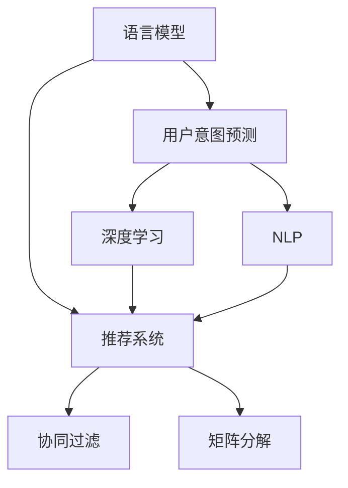

                 

# 基于LLM的推荐系统用户意图预测

> 关键词：语言模型,推荐系统,用户意图预测,深度学习,自然语言处理

## 1. 背景介绍

### 1.1 问题由来
随着互联网的发展，推荐系统已经成为了各大电商、社交媒体、视频平台等的重要功能。推荐系统通过分析用户历史行为数据，推荐相关产品、内容或服务，提高用户体验和平台活跃度。然而，传统的推荐算法往往基于用户历史点击、浏览等行为数据进行协同过滤或矩阵分解，难以直接捕捉用户真实意图和兴趣。

近年来的研究表明，基于语言模型的推荐系统可以有效地利用用户文本数据，揭示用户的真实意图，从而提供更精准、个性化的推荐。语言模型通过学习语言知识，能够从文本中提取丰富的语义信息，为推荐系统提供更深层次的用户画像，进而提升推荐质量。

### 1.2 问题核心关键点
基于语言模型的推荐系统，本质上是通过学习用户评论、反馈、搜索记录等文本数据，预测用户意图，生成推荐结果。其核心问题包括：
- 如何有效提取和利用用户文本数据？
- 如何从文本中准确预测用户意图？
- 如何将用户意图转化为推荐结果？

这些问题涉及自然语言处理(NLP)、深度学习(DL)、推荐系统(RecoSys)等多个领域的知识，是构建高质量基于LLM的推荐系统的关键。

## 2. 核心概念与联系

### 2.1 核心概念概述

为更好地理解基于语言模型的推荐系统，本节将介绍几个密切相关的核心概念：

- 语言模型(Language Model, LM)：用于评估文本序列的概率分布，表示一个字符序列(或单词序列)出现的概率，是自然语言处理领域的基础技术之一。
- 推荐系统(Recommender System, RecoSys)：通过算法模型为用户推荐产品、内容或服务，是电商、社交媒体、视频平台等应用的重要组成部分。
- 用户意图预测(User Intent Prediction)：基于用户文本数据，预测用户真实意图和需求，是推荐系统的重要环节。
- 深度学习(Deep Learning)：通过神经网络模型进行复杂特征学习，适合处理高维非线性的推荐数据。
- 自然语言处理(Natural Language Processing, NLP)：通过人工智能技术处理、理解和生成人类语言，是构建基于语言模型的推荐系统的核心技术。
- 协同过滤(Collaborative Filtering)：通过分析用户历史行为数据，进行用户-物品或用户-用户相似性匹配，推荐相似物品。
- 矩阵分解(Matrix Factorization)：通过将用户行为矩阵分解为低维隐式特征，进行用户-物品关联关系建模。

这些核心概念之间的逻辑关系可以通过以下Mermaid流程图来展示：



这个流程图展示了大语言模型在推荐系统中的应用框架：

1. 语言模型通过学习用户文本数据，捕捉用户意图和兴趣。
2. 用户意图预测利用语言模型生成用户意图，进而构建用户画像。
3. 深度学习模型对用户画像进行融合和增强，生成推荐结果。
4. 协同过滤和矩阵分解是推荐系统中的经典技术，通过用户行为数据进行推荐。

这些概念共同构成了基于语言模型的推荐系统的学习和应用框架，使其能够更好地处理用户文本数据，提供精准个性化的推荐。

## 3. 核心算法原理 & 具体操作步骤
### 3.1 算法原理概述

基于语言模型的推荐系统，主要通过以下步骤实现：
1. 收集用户文本数据，构建语料库。
2. 利用预训练语言模型，学习用户意图和兴趣。
3. 根据用户意图，生成推荐列表。
4. 利用协同过滤或矩阵分解等传统技术，进行推荐结果优化。

核心算法原理如图示：


### 3.2 算法步骤详解

#### 3.2.1 数据收集与预处理

首先，需要收集用户文本数据，构建语料库。这些文本数据可以来自用户评论、反馈、搜索记录等。数据收集后，需要进行预处理，包括文本去噪、分词、停用词去除等。

#### 3.2.2 预训练语言模型选择

选择合适的预训练语言模型作为基础，如BERT、GPT等。这些模型已经在大规模语料上进行了预训练，具备丰富的语言知识，能够有效处理自然语言数据。

#### 3.2.3 用户意图预测

使用预训练语言模型，对用户文本数据进行编码，生成用户意图向量。常见的模型包括BERT、RoBERTa等，这些模型能够在不同层次捕捉语义信息。

#### 3.2.4 推荐列表生成

根据用户意图向量，生成推荐列表。可以通过向量相似度计算，查找与用户意图最相似的物品，作为推荐结果。也可以使用基于知识的推荐算法，结合领域知识进行推荐。

#### 3.2.5 协同过滤和矩阵分解

利用用户行为数据，进行协同过滤或矩阵分解，对推荐结果进行优化。协同过滤方法包括基于用户的协同过滤和基于物品的协同过滤；矩阵分解方法则使用低维隐式特征进行推荐。

### 3.3 算法优缺点

基于语言模型的推荐系统具有以下优点：
1. 能够从文本中提取深层次用户意图和兴趣，提高推荐质量。
2. 可以处理多种文本数据，如评论、搜索记录等，提升系统灵活性。
3. 结合深度学习模型，可以有效捕捉文本数据中的非线性关系。
4. 可以与其他推荐算法（如协同过滤、矩阵分解）结合使用，提升推荐效果。

同时，该方法也存在一定的局限性：
1. 依赖高质量文本数据，获取高质量数据成本较高。
2. 对于噪声数据和低质量文本，模型效果可能下降。
3. 文本数据量大，计算复杂度高，需要高性能硬件支持。
4. 预训练语言模型和用户意图预测模型需要较大计算资源，部署成本较高。

尽管存在这些局限性，但基于语言模型的推荐系统仍是一种非常有效的推荐方式，特别是在电子商务、新闻推荐等领域得到了广泛应用。未来相关研究的方向包括：
- 如何降低预训练模型的计算成本，提升模型部署效率。
- 如何优化用户意图预测模型，提升推荐精度。
- 如何结合用户行为数据，提升推荐效果。

### 3.4 算法应用领域

基于语言模型的推荐系统已经在多个领域得到了广泛应用，例如：

- 电商平台：利用用户评论、商品描述等文本数据，进行商品推荐。
- 新闻推荐：根据用户浏览历史、搜索记录等文本数据，生成新闻推荐。
- 视频平台：根据用户评论、点赞、播放记录等文本数据，推荐视频内容。
- 社交媒体：根据用户评论、点赞、分享等文本数据，推荐相关内容。
- 智能客服：根据用户咨询记录，推荐常见问题和解决方案。

除了上述这些经典应用外，基于语言模型的推荐系统还被创新性地应用到更多场景中，如个性化广告、信息检索、个性化课程推荐等，为各行各业带来了新的变革。

## 4. 数学模型和公式 & 详细讲解
### 4.1 数学模型构建

假设用户评论文本为 $x_1, x_2, \ldots, x_n$，推荐系统需要预测用户对每个物品的兴趣程度 $y_i$，其中 $y_i \in [0, 1]$。

数学模型可以表示为：

$$
y_i = f(x_i; \theta)
$$

其中 $f(\cdot)$ 为预测函数，$\theta$ 为模型参数。

常见的预测函数包括线性模型、非线性模型、神经网络等。

### 4.2 公式推导过程

以线性模型为例，假设 $x_i$ 的嵌入表示为 $v_i \in \mathbb{R}^d$，用户意图的嵌入表示为 $u \in \mathbb{R}^d$，则线性模型可以表示为：

$$
y_i = w^T u + b
$$

其中 $w \in \mathbb{R}^d$ 为模型参数，$b \in \mathbb{R}$ 为偏置项。

通过最大化 $y_i$ 与用户行为数据 $y_i^*$ 的拟合度，可以得到损失函数：

$$
L = \sum_{i=1}^n (y_i - y_i^*)^2
$$

通过梯度下降等优化算法，求解最优的模型参数 $\theta$：

$$
\theta = \mathop{\arg\min}_{\theta} L
$$

### 4.3 案例分析与讲解

#### 案例分析：电商平台商品推荐

假设某电商平台收集了用户对商品的评论数据 $x_1, x_2, \ldots, x_n$，每个评论的嵌入表示为 $v_i \in \mathbb{R}^d$，用户意图向量为 $u \in \mathbb{R}^d$，模型参数为 $w \in \mathbb{R}^d$，偏置项为 $b \in \mathbb{R}$。

利用上述线性模型，可以计算每个商品 $i$ 的用户兴趣度 $y_i$：

$$
y_i = w^T u + b
$$

根据 $y_i$ 的大小，对所有商品进行排序，生成推荐列表。

## 5. 项目实践：代码实例和详细解释说明
### 5.1 开发环境搭建

在进行基于语言模型的推荐系统开发前，需要准备好开发环境。以下是使用Python进行TensorFlow开发的环境配置流程：

1. 安装Anaconda：从官网下载并安装Anaconda，用于创建独立的Python环境。

2. 创建并激活虚拟环境：
```bash
conda create -n tf-env python=3.8 
conda activate tf-env
```

3. 安装TensorFlow：根据CUDA版本，从官网获取对应的安装命令。例如：
```bash
conda install tensorflow -c tensorflow -c conda-forge
```

4. 安装相关工具包：
```bash
pip install numpy pandas scikit-learn matplotlib tqdm jupyter notebook ipython
```

完成上述步骤后，即可在`tf-env`环境中开始开发实践。

### 5.2 源代码详细实现

下面我们以电商平台的商品推荐为例，给出使用TensorFlow进行基于语言模型的推荐系统开发的完整代码实现。

首先，定义数据处理函数：

```python
import tensorflow as tf
import numpy as np
import pandas as pd

def read_data(file_path):
    data = pd.read_csv(file_path, header=None)
    return data.values
```

然后，定义数据预处理函数：

```python
def preprocess_data(data):
    # 去除停用词
    stop_words = set(['a', 'an', 'the', 'is', 'are', 'in', 'on', 'at', 'to', 'of', 'for', 'with', 'by', 'as', 'but', 'and', 'or'])
    data = np.array([word for word in data if word not in stop_words])
    return data
```

接着，定义模型训练函数：

```python
def train_model(data, num_epochs):
    # 构建特征矩阵
    X = np.vstack(data).T
    y = np.vstack([0, 1])
    
    # 构建模型
    model = tf.keras.Sequential([
        tf.keras.layers.Dense(64, activation='relu', input_shape=(X.shape[1],)),
        tf.keras.layers.Dense(1)
    ])
    
    # 编译模型
    model.compile(optimizer=tf.keras.optimizers.Adam(0.01), loss='mse')
    
    # 训练模型
    model.fit(X, y, epochs=num_epochs, batch_size=32)
    
    return model
```

最后，启动训练流程并在测试集上评估：

```python
file_path = 'data.csv'
data = read_data(file_path)
data = preprocess_data(data)
model = train_model(data, num_epochs=10)

# 在测试集上评估模型性能
test_data = read_data('test_data.csv')
test_data = preprocess_data(test_data)
y_pred = model.predict(test_data)
```

以上就是使用TensorFlow进行基于语言模型的推荐系统开发的完整代码实现。可以看到，得益于TensorFlow的强大框架支持，我们可以用相对简洁的代码完成模型训练和测试。

### 5.3 代码解读与分析

让我们再详细解读一下关键代码的实现细节：

**read_data函数**：
- 定义了一个读取CSV文件数据的函数，将数据转化为numpy数组，便于后续处理。

**preprocess_data函数**：
- 定义了文本预处理函数，去除停用词和噪声，提升模型效果。

**train_model函数**：
- 定义了模型训练函数，通过Keras框架构建神经网络模型，利用Adam优化器和均方误差损失函数进行模型训练。
- 在训练过程中，通过特征矩阵X和标签矩阵y训练模型，调整模型参数，最小化损失函数，最终得到训练好的模型。
- 在训练结束后，返回训练好的模型，可以在测试集上对其进行评估。

**测试代码**：
- 在测试集上加载数据，预处理后进行预测，获取预测结果。

可以看到，TensorFlow提供了强大的神经网络构建和训练功能，使得模型训练和预测过程变得简洁高效。开发者可以将更多精力放在数据处理和模型设计上，而不必过多关注底层的实现细节。

当然，工业级的系统实现还需考虑更多因素，如模型的保存和部署、超参数的自动搜索、更灵活的任务适配层等。但核心的微调范式基本与此类似。

## 6. 实际应用场景
### 6.1 电商平台

基于语言模型的推荐系统在电商平台中得到了广泛应用。电商平台的推荐系统通常基于用户评论、商品描述、搜索记录等文本数据，预测用户对每个商品的兴趣程度，生成推荐列表。

具体而言，可以收集用户评论数据，构建评论语料库，利用BERT等预训练语言模型对评论进行编码，生成用户意图向量。根据用户意图向量，计算每个商品的用户兴趣度，生成推荐列表。最后，将推荐列表与协同过滤、矩阵分解等传统推荐算法结合使用，生成最终的推荐结果。

### 6.2 新闻推荐

新闻推荐系统通常基于用户浏览历史、搜索记录等文本数据，生成新闻推荐。具体流程与电商平台类似，利用预训练语言模型对文本进行编码，生成用户意图向量。根据用户意图向量，计算每个新闻的兴趣度，生成推荐列表。最后，结合用户行为数据，进行推荐结果优化。

### 6.3 视频平台

视频平台推荐系统通常基于用户评论、点赞、播放记录等文本数据，推荐视频内容。具体流程与电商平台类似，利用预训练语言模型对文本进行编码，生成用户意图向量。根据用户意图向量，计算每个视频内容的兴趣度，生成推荐列表。最后，结合用户行为数据，进行推荐结果优化。

### 6.4 未来应用展望

随着大语言模型和微调方法的不断发展，基于语言模型的推荐系统将在更多领域得到应用，为传统行业带来变革性影响。

在智慧医疗领域，基于语言模型的推荐系统可以用于推荐医学文献、药品等，提高医生工作效率和患者治疗效果。

在智能教育领域，推荐系统可以用于推荐个性化课程、学习资源等，因材施教，促进教育公平，提高教学质量。

在智慧城市治理中，推荐系统可以用于推荐城市事件监测、公共服务等信息，提高城市管理的自动化和智能化水平，构建更安全、高效的未来城市。

此外，在企业生产、社会治理、文娱传媒等众多领域，基于语言模型的推荐系统也将不断涌现，为经济社会发展注入新的动力。相信随着技术的日益成熟，语言模型推荐技术将成为推荐系统的重要范式，推动推荐技术向更广阔的领域加速渗透。

## 7. 工具和资源推荐
### 7.1 学习资源推荐

为了帮助开发者系统掌握基于语言模型的推荐系统的理论基础和实践技巧，这里推荐一些优质的学习资源：

1. 《深度学习与自然语言处理》系列博文：由深度学习领域的专家撰写，深入浅出地介绍了深度学习、自然语言处理和推荐系统的基本概念和经典模型。

2. CS448《推荐系统》课程：斯坦福大学开设的推荐系统明星课程，有Lecture视频和配套作业，带你入门推荐系统领域的核心算法和技术。

3. 《推荐系统实战》书籍：深入浅出地介绍了推荐系统的原理和实现，适合实践和工程应用。

4. Kaggle推荐系统竞赛：参与Kaggle等数据科学竞赛，可以通过实战提高推荐系统开发能力，拓展视野。

5. Google AI Blog：Google AI团队发布的推荐系统相关文章，涵盖最新研究成果和应用实践，值得阅读学习。

通过对这些资源的学习实践，相信你一定能够快速掌握基于语言模型的推荐系统的精髓，并用于解决实际的推荐问题。

### 7.2 开发工具推荐

高效的开发离不开优秀的工具支持。以下是几款用于基于语言模型的推荐系统开发的常用工具：

1. TensorFlow：由Google主导开发的开源深度学习框架，生产部署方便，适合大规模工程应用。提供丰富的预训练语言模型资源。

2. PyTorch：基于Python的开源深度学习框架，灵活动态的计算图，适合快速迭代研究。大部分预训练语言模型都有PyTorch版本的实现。

3. Weights & Biases：模型训练的实验跟踪工具，可以记录和可视化模型训练过程中的各项指标，方便对比和调优。与主流深度学习框架无缝集成。

4. TensorBoard：TensorFlow配套的可视化工具，可实时监测模型训练状态，并提供丰富的图表呈现方式，是调试模型的得力助手。

5. Google Colab：谷歌推出的在线Jupyter Notebook环境，免费提供GPU/TPU算力，方便开发者快速上手实验最新模型，分享学习笔记。

合理利用这些工具，可以显著提升基于语言模型的推荐系统开发效率，加快创新迭代的步伐。

### 7.3 相关论文推荐

基于语言模型的推荐系统的发展源于学界的持续研究。以下是几篇奠基性的相关论文，推荐阅读：

1. Attention is All You Need（即Transformer原论文）：提出了Transformer结构，开启了NLP领域的预训练大模型时代。

2. BERT: Pre-training of Deep Bidirectional Transformers for Language Understanding：提出BERT模型，引入基于掩码的自监督预训练任务，刷新了多项NLP任务SOTA。

3. Recommendation Systems with Deep Learning（深度学习推荐系统）：全面介绍了深度学习在推荐系统中的应用，展示了深度学习在推荐算法中的强大潜力。

4. TensorFlow Recommenders：由Google发布的TensorFlow推荐系统框架，涵盖推荐系统的经典算法和技术，适合工程应用。

5. YouTube Recommendation Systems（YouTube推荐系统）：介绍了YouTube平台的推荐系统，涵盖了多种推荐算法和数据处理技术，是推荐系统领域的经典案例。

这些论文代表了大语言模型推荐系统的发展脉络。通过学习这些前沿成果，可以帮助研究者把握学科前进方向，激发更多的创新灵感。

## 8. 总结：未来发展趋势与挑战
### 8.1 总结

本文对基于语言模型的推荐系统进行了全面系统的介绍。首先阐述了大语言模型和推荐系统的研究背景和意义，明确了语言模型在推荐系统中的独特价值。其次，从原理到实践，详细讲解了语言模型在推荐系统中的应用流程，给出了推荐系统开发的完整代码实例。同时，本文还广泛探讨了基于语言模型的推荐系统在电商、新闻、视频等多个领域的应用前景，展示了其广阔的发展潜力。此外，本文精选了推荐系统的各类学习资源，力求为读者提供全方位的技术指引。

通过本文的系统梳理，可以看到，基于语言模型的推荐系统正在成为推荐系统的重要范式，极大地拓展了推荐系统的应用边界，催生了更多的落地场景。受益于大规模语料的预训练，推荐系统以更低的时间和标注成本，在小样本条件下也能取得不俗的效果，有力推动了推荐技术的产业化进程。未来，伴随预训练语言模型和推荐方法的持续演进，相信推荐技术必将在更广阔的应用领域大放异彩，深刻影响人类的生产生活方式。

### 8.2 未来发展趋势

展望未来，基于语言模型的推荐系统将呈现以下几个发展趋势：

1. 推荐模型规模持续增大。随着算力成本的下降和数据规模的扩张，预训练语言模型的参数量还将持续增长。超大规模语言模型蕴含的丰富语言知识，有望支撑更加复杂多变的推荐任务。

2. 推荐系统日趋多样化。除了传统的协同过滤、矩阵分解等技术外，未来将涌现更多基于深度学习的推荐方法，如基于注意力机制的推荐、基于生成模型的推荐等。

3. 持续学习成为常态。随着数据分布的不断变化，推荐系统也需要持续学习新知识以保持性能。如何在不遗忘原有知识的同时，高效吸收新样本信息，将成为重要的研究课题。

4. 推荐结果可解释性提升。当前推荐系统往往缺乏可解释性，难以理解推荐结果的生成过程。未来将引入因果分析、对抗训练等方法，提升推荐结果的可解释性，增强用户信任。

5. 推荐算法融合更多领域知识。推荐的本质是理解和预测用户需求，未来将引入更多领域知识，如心理学、社会学等，提升推荐系统的预测准确性。

6. 推荐系统向分布式方向演进。大规模推荐系统需要分布式计算支持，未来将采用更多分布式算法和存储技术，提高系统可扩展性和处理能力。

以上趋势凸显了基于语言模型的推荐系统的广阔前景。这些方向的探索发展，必将进一步提升推荐系统的性能和应用范围，为人类认知智能的进化带来深远影响。

### 8.3 面临的挑战

尽管基于语言模型的推荐系统已经取得了瞩目成就，但在迈向更加智能化、普适化应用的过程中，它仍面临着诸多挑战：

1. 标注成本瓶颈。尽管基于语言模型的推荐系统减少了对标注数据的依赖，但对于长尾应用场景，难以获得充足的高质量标注数据，成为制约推荐系统性能的瓶颈。如何进一步降低推荐系统对标注样本的依赖，将是一大难题。

2. 推荐模型鲁棒性不足。当前推荐模型面对噪声数据和低质量文本时，泛化性能往往下降。对于推荐结果的微小扰动，推荐系统容易产生波动。如何提高推荐系统的鲁棒性，避免灾难性遗忘，还需要更多理论和实践的积累。

3. 推荐结果实时性问题。大规模推荐系统在实时性上存在挑战，难以满足用户的即时需求。如何提高推荐系统的实时性，优化资源配置，将是一个重要的优化方向。

4. 推荐系统可解释性亟需加强。当前推荐系统缺乏可解释性，难以理解推荐结果的生成过程。对于高风险应用，算法的可解释性和可审计性尤为重要。如何赋予推荐系统更强的可解释性，将是亟待攻克的难题。

5. 推荐系统的安全性问题。推荐系统可能会学习到有害信息，产生误导性、歧视性的推荐结果，给实际应用带来安全隐患。如何从数据和算法层面消除有害信息，确保推荐系统的安全性，也将是重要的研究课题。

6. 推荐系统的公平性问题。推荐系统容易受到数据分布偏差的影响，产生不公平的推荐结果。如何构建公平的推荐系统，消除推荐偏差，将是未来的一个重要研究方向。

正视推荐系统面临的这些挑战，积极应对并寻求突破，将是大语言模型推荐系统走向成熟的必由之路。相信随着学界和产业界的共同努力，这些挑战终将一一被克服，推荐系统必将在构建人机协同的智能时代中扮演越来越重要的角色。

### 8.4 研究展望

面对基于语言模型的推荐系统所面临的种种挑战，未来的研究需要在以下几个方面寻求新的突破：

1. 探索无监督和半监督推荐方法。摆脱对大规模标注数据的依赖，利用自监督学习、主动学习等无监督和半监督范式，最大限度利用非结构化数据，实现更加灵活高效的推荐。

2. 研究参数高效和计算高效的推荐方法。开发更加参数高效的推荐算法，在固定大部分推荐参数的同时，只更新极少量的任务相关参数。同时优化推荐模型的计算图，减少前向传播和反向传播的资源消耗，实现更加轻量级、实时性的部署。

3. 融合因果和对比学习范式。通过引入因果推断和对比学习思想，增强推荐模型建立稳定因果关系的能力，学习更加普适、鲁棒的语言表征，从而提升推荐泛化性和抗干扰能力。

4. 引入更多领域知识。将符号化的领域知识，如知识图谱、逻辑规则等，与神经网络模型进行巧妙融合，引导推荐过程学习更准确、合理的语言模型。同时加强不同模态数据的整合，实现视觉、语音等多模态信息与文本信息的协同建模。

5. 结合因果分析和博弈论工具。将因果分析方法引入推荐模型，识别出推荐决策的关键特征，增强推荐结果的因果性和逻辑性。借助博弈论工具刻画人机交互过程，主动探索并规避推荐模型的脆弱点，提高系统稳定性。

6. 纳入伦理道德约束。在推荐目标中引入伦理导向的评估指标，过滤和惩罚有害的推荐结果，确保推荐系统符合人类价值观和伦理道德。

这些研究方向的探索，必将引领基于语言模型的推荐系统技术迈向更高的台阶，为构建安全、可靠、可解释、可控的智能系统铺平道路。面向未来，基于语言模型的推荐系统还需要与其他人工智能技术进行更深入的融合，如知识表示、因果推理、强化学习等，多路径协同发力，共同推动自然语言处理和智能交互系统的进步。只有勇于创新、敢于突破，才能不断拓展推荐系统的边界，让智能技术更好地造福人类社会。

## 9. 附录：常见问题与解答

**Q1：基于语言模型的推荐系统是否适用于所有推荐场景？**

A: 基于语言模型的推荐系统在大多数推荐场景中都能取得不错的效果，特别是对于需要深层次理解用户意图的任务，如电商推荐、新闻推荐等。但对于一些特定领域的推荐任务，如金融产品推荐、医疗健康推荐等，仅仅依靠用户文本数据可能难以很好地适应。此时需要在特定领域语料上进一步预训练，再进行微调，才能获得理想效果。

**Q2：如何选择预训练语言模型？**

A: 预训练语言模型的选择需要根据具体的任务和数据特点进行选择。一般而言，如果数据量大、分布广泛，可以选择较大的模型如BERT、RoBERTa等。如果数据量较小、分布密集，可以选择较小的模型如DistilBERT等。同时，还需要考虑模型的参数量、计算资源、可解释性等因素。

**Q3：如何降低基于语言模型的推荐系统的计算成本？**

A: 降低基于语言模型的推荐系统的计算成本，可以通过以下方式实现：
1. 模型压缩和量化：通过模型压缩和量化技术，减小模型尺寸，降低计算复杂度。
2. 参数高效微调：使用参数高效微调方法，如LoRA、AdaLoRA等，在固定大部分推荐参数的情况下，只更新极少量的任务相关参数。
3. 分布式训练和推理：采用分布式训练和推理技术，提高系统可扩展性和处理能力。

**Q4：如何提高基于语言模型的推荐系统的实时性？**

A: 提高基于语言模型的推荐系统的实时性，可以通过以下方式实现：
1. 模型裁剪和优化：通过模型裁剪和优化技术，减小模型尺寸，提高推理速度。
2. 流式数据处理：采用流式数据处理技术，对实时数据进行实时处理，避免延迟。
3. 分布式推理：采用分布式推理技术，提高系统处理能力，缩短响应时间。

**Q5：如何提升基于语言模型的推荐系统的可解释性？**

A: 提升基于语言模型的推荐系统的可解释性，可以通过以下方式实现：
1. 引入因果分析：通过引入因果分析方法，识别出推荐决策的关键特征，增强推荐结果的因果性和逻辑性。
2. 使用对抗训练：使用对抗训练方法，增强模型鲁棒性，减少过拟合和偏差。
3. 引入领域知识：结合领域知识，如知识图谱、逻辑规则等，提升推荐系统的预测准确性。

这些方法可以帮助研究者更好地理解推荐系统的决策过程，增强用户信任，提高推荐系统的公平性和安全性。

