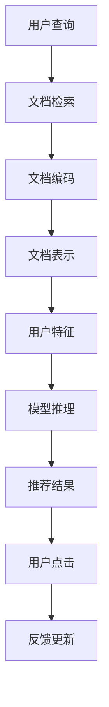

                 

# 基于LLM的长文档推荐方法

> 关键词：长文档推荐, 大语言模型(LLM), 自然语言处理(NLP), 信息检索, 推荐系统, 注意力机制, 神经网络, 数据结构

## 1. 背景介绍

随着移动互联网和在线阅读市场的不断扩展，用户获取信息的渠道愈发多样，内容的丰富性、复杂性和可读性也随之提升。长文档，即结构化文本，如学术论文、研究报告、政策白皮书等，因其详实的信息量和系统的结构化表述，成为了用户获取深度知识的重要来源。然而，对于大量长文档，用户往往需要耗费大量时间和精力，难以从中快速定位和筛选关键信息。为解决这一问题，长文档推荐技术应运而生，旨在帮助用户快速发现与自己兴趣和需求相匹配的优质长文档。

长文档推荐系统利用自然语言处理技术，通过分析用户行为数据和文本内容特征，从海量长文档中筛选出最具价值的信息，并推荐给用户。与传统基于短文本的推荐系统不同，长文档推荐系统需要处理更复杂、更冗长的文本，这对其算法和模型提出了更高的要求。因此，本文将探讨如何利用大语言模型(LLM)进行长文档推荐，以期提升推荐系统的精准度和用户满意度。

## 2. 核心概念与联系

### 2.1 核心概念概述

在讨论基于LLM的长文档推荐方法前，先简要介绍几个核心概念：

- **长文档**：结构化文本，如学术论文、研究报告、政策白皮书等，包含丰富且详细的信息。
- **大语言模型(LLM)**：基于深度神经网络的自然语言处理模型，通过自监督或监督学习预训练，具备强大的语言理解和生成能力。
- **推荐系统**：通过分析用户行为和物品特征，推荐用户可能感兴趣的产品或内容的系统。
- **信息检索**：从大规模文档集合中，根据用户查询，返回最相关的文档的系统。
- **注意力机制**：在深度学习模型中，用于捕捉输入序列中不同位置的重要程度，提升模型对关键信息的关注度。

通过将这些概念串联起来，我们便可构建起长文档推荐的基本框架。

### 2.2 核心概念原理和架构的 Mermaid 流程图



此流程图展示了基于LLM的长文档推荐的基本流程：
1. 用户输入查询，系统检索文档。
2. 对检索到的文档进行编码，转换为模型可处理的向量表示。
3. 使用用户特征和文档表示进行模型推理。
4. 模型输出推荐结果，并展示给用户。
5. 用户点击推荐结果，系统收到反馈，更新推荐模型。

## 3. 核心算法原理 & 具体操作步骤

### 3.1 算法原理概述

基于LLM的长文档推荐方法，利用大语言模型强大的文本理解能力，通过分析文档内容和用户行为特征，自动筛选出最相关的长文档。其核心思想如下：

- 首先，对长文档进行分词和编码，转换为向量表示。
- 其次，根据用户查询和文档表示，利用注意力机制计算文档与用户查询的相关度。
- 然后，根据相关度排序，选择最匹配用户查询的长文档进行推荐。
- 最后，根据用户点击反馈，持续更新推荐模型，提升推荐精度。

### 3.2 算法步骤详解

**Step 1: 数据预处理**
- 对长文档进行分词，去除停用词，进行基本的文本清洗。
- 将长文档转换为向量表示，通常采用词袋模型(BOW)或TF-IDF方法，也可以利用BERT等预训练模型进行编码。
- 对用户查询同样进行分词和编码，转换为向量表示。

**Step 2: 模型构建**
- 构建基于Attention的推荐模型，常用的模型结构包括Transformer、LSTM等。
- 将用户查询和文档向量作为输入，送入模型进行特征提取。
- 通过Attention机制计算查询与每个文档的相关度，生成匹配得分。

**Step 3: 模型训练**
- 使用标注数据集进行监督学习，训练推荐模型。
- 损失函数通常为交叉熵损失，最小化预测结果与真实标签之间的差异。
- 优化器一般采用AdamW等深度学习优化算法，逐步更新模型参数。

**Step 4: 推荐策略**
- 根据计算出的匹配得分对文档进行排序，选择前N个文档进行推荐。
- 对于新用户，可以推荐热门文档或领域内的经典文档，提高用户满意度。
- 对于点击过的文档，记录用户反馈，持续优化推荐模型。

**Step 5: 系统部署**
- 将训练好的模型部署到生产环境，实时接收用户查询和反馈数据。
- 利用Web服务器、API接口等方式，将推荐结果展示给用户。
- 定期更新模型参数，保证推荐效果持续改进。

### 3.3 算法优缺点

基于LLM的长文档推荐方法具有以下优点：
- 语言模型的强大能力使其能够更准确地理解长文档内容，提升推荐的精准度。
- 利用注意力机制捕捉关键信息，减少噪音干扰，提升推荐的相关性。
- 通过持续反馈更新模型，保持推荐系统的适应性和准确性。

同时，该方法也存在一些局限：
- 对数据质量要求较高，需保证标注数据的质量和多样性。
- 模型复杂度较高，计算资源和存储空间需求较大。
- 用户行为数据隐私问题需引起重视，合理处理用户数据。

### 3.4 算法应用领域

基于LLM的长文档推荐方法，主要应用于以下领域：

- **学术研究**：帮助研究人员快速获取相关领域的最新研究论文。
- **政策白皮书**：帮助政府和研究机构快速定位政策相关的白皮书和报告。
- **金融报告**：帮助金融分析师快速查找行业分析报告和公司财报。
- **技术文档**：帮助开发者快速定位技术文档，提升开发效率。
- **教育资料**：帮助学生和教师快速获取教学资料和参考材料。

## 4. 数学模型和公式 & 详细讲解 & 举例说明

### 4.1 数学模型构建

基于LLM的长文档推荐方法涉及的数学模型主要包括：
- **词向量表示**：将文本转换为向量表示。
- **注意力机制**：捕捉查询和文档之间的相关性。
- **推荐模型**：将查询和文档特征映射为推荐分数。

以BERT作为预训练模型的长文档推荐模型为例，其核心公式如下：

**输入表示**：
\[ h = \text{BERT}(x) \]
其中 $x$ 为长文档的输入序列，$h$ 为BERT模型输出的隐状态表示。

**查询向量**：
\[ q = \text{BERT}(q) \]
其中 $q$ 为用户查询的输入序列，$h$ 为BERT模型输出的隐状态表示。

**注意力权重**：
\[ a = \text{Attention}(h, q) \]
其中 $a$ 表示每个文档与用户查询的注意力权重，$\text{Attention}$ 为注意力计算函数。

**推荐得分**：
\[ s = a \cdot h \]
其中 $s$ 为每个文档与用户查询的推荐得分，$a$ 和 $h$ 分别为注意力权重和文档表示向量。

**推荐排序**：
\[ \text{Recommendations} = \text{Sort}(s) \]
其中 $\text{Recommendations}$ 表示推荐文档的排序列表。

### 4.2 公式推导过程

我们以BERT作为预训练模型的推荐模型，推导其核心公式。

**输入表示**：
\[ h = \text{BERT}(x) = \text{BERT}(\{w_i\}_{i=1}^n) \]
其中 $x = \{w_i\}_{i=1}^n$ 为长文档的分词序列，$h = \{h_i\}_{i=1}^n$ 为每个词的BERT表示。

**查询向量**：
\[ q = \text{BERT}(q) = \text{BERT}(\{w_j\}_{j=1}^m) \]
其中 $q = \{w_j\}_{j=1}^m$ 为用户查询的分词序列，$q = \{q_i\}_{i=1}^m$ 为每个词的BERT表示。

**注意力权重**：
\[ a_{ij} = \text{Attention}(h_i, q_j) = \frac{e^{z_{ij}}}{\sum_k e^{z_{ik}}} \]
其中 $z_{ij} = \text{Head}_{i,j}(h_i, q_j)$，$\text{Head}_{i,j}$ 为注意力机制的计算函数，$e$ 为自然常数，$i$ 和 $j$ 分别表示文档和查询中的词。

**推荐得分**：
\[ s_{ij} = a_{ij} \cdot h_i \]
其中 $s_{ij}$ 为文档 $i$ 和查询 $j$ 的推荐得分。

**推荐排序**：
\[ \text{Recommendations} = \text{Sort}(s) \]
其中 $\text{Recommendations}$ 表示按照推荐得分排序的文档列表。

### 4.3 案例分析与讲解

假设用户查询为“机器学习最新进展”，系统检索到以下三篇长文档：
1. 《2021年机器学习年度综述》
2. 《深度学习在自然语言处理中的应用》
3. 《机器学习算法优化研究》

对每篇文档和查询进行编码，得到BERT表示。然后，计算查询与每篇文档的注意力权重，生成推荐得分，并对文档进行排序，最终推荐给用户。

## 5. 项目实践：代码实例和详细解释说明

### 5.1 开发环境搭建

在进行长文档推荐系统的开发实践前，需要准备好开发环境。以下是使用Python进行PyTorch开发的环境配置流程：

1. 安装Anaconda：从官网下载并安装Anaconda，用于创建独立的Python环境。
2. 创建并激活虚拟环境：
```bash
conda create -n pytorch-env python=3.8 
conda activate pytorch-env
```
3. 安装PyTorch：根据CUDA版本，从官网获取对应的安装命令。例如：
```bash
conda install pytorch torchvision torchaudio cudatoolkit=11.1 -c pytorch -c conda-forge
```
4. 安装Transformers库：
```bash
pip install transformers
```
5. 安装各类工具包：
```bash
pip install numpy pandas scikit-learn matplotlib tqdm jupyter notebook ipython
```
完成上述步骤后，即可在`pytorch-env`环境中开始长文档推荐系统的开发。

### 5.2 源代码详细实现

下面我们以BERT作为预训练模型的长文档推荐系统为例，给出使用PyTorch的代码实现。

**代码实现**：

```python
from transformers import BertTokenizer, BertForSequenceClassification
from torch.utils.data import Dataset, DataLoader
from torch.nn import CrossEntropyLoss
from transformers import AdamW

class DocumentDataset(Dataset):
    def __init__(self, docs, tokenizer, max_len=128):
        self.docs = docs
        self.tokenizer = tokenizer
        self.max_len = max_len
        
    def __len__(self):
        return len(self.docs)
    
    def __getitem__(self, item):
        doc = self.docs[item]
        tokenized_doc = self.tokenizer(doc, return_tensors='pt', max_length=self.max_len, padding='max_length', truncation=True)
        return {'text': doc, 'input_ids': tokenized_doc['input_ids'], 'attention_mask': tokenized_doc['attention_mask']}

# 定义训练函数
def train_epoch(model, dataset, optimizer, loss_fn, device):
    model.train()
    epoch_loss = 0
    for doc, inputs in DataLoader(dataset, batch_size=32, shuffle=True):
        input_ids = inputs['input_ids'].to(device)
        attention_mask = inputs['attention_mask'].to(device)
        labels = torch.zeros_like(input_ids)
        outputs = model(input_ids, attention_mask=attention_mask, labels=labels)
        loss = loss_fn(outputs.logits, labels)
        epoch_loss += loss.item()
        loss.backward()
        optimizer.step()
    return epoch_loss / len(dataset)

# 定义评估函数
def evaluate(model, dataset, loss_fn, device):
    model.eval()
    epoch_loss = 0
    correct = 0
    with torch.no_grad():
        for doc, inputs in DataLoader(dataset, batch_size=32, shuffle=False):
            input_ids = inputs['input_ids'].to(device)
            attention_mask = inputs['attention_mask'].to(device)
            labels = inputs['labels'].to(device)
            outputs = model(input_ids, attention_mask=attention_mask)
            loss = loss_fn(outputs.logits, labels)
            epoch_loss += loss.item()
            preds = outputs.logits.argmax(dim=1)
            correct += (preds == labels).sum().item()
    acc = correct / len(dataset)
    return epoch_loss / len(dataset), acc

# 加载模型和数据集
tokenizer = BertTokenizer.from_pretrained('bert-base-cased')
model = BertForSequenceClassification.from_pretrained('bert-base-cased', num_labels=2)
train_dataset = DocumentDataset(train_docs, tokenizer)
dev_dataset = DocumentDataset(dev_docs, tokenizer)
test_dataset = DocumentDataset(test_docs, tokenizer)

# 设置超参数
learning_rate = 2e-5
num_epochs = 5
batch_size = 32
device = 'cuda' if torch.cuda.is_available() else 'cpu'

# 定义优化器和损失函数
optimizer = AdamW(model.parameters(), lr=learning_rate)
loss_fn = CrossEntropyLoss()

# 训练模型
for epoch in range(num_epochs):
    train_loss = train_epoch(model, train_dataset, optimizer, loss_fn, device)
    dev_loss, dev_acc = evaluate(model, dev_dataset, loss_fn, device)
    print(f'Epoch {epoch+1}, train loss: {train_loss:.3f}, dev loss: {dev_loss:.3f}, dev acc: {dev_acc:.3f}')

# 在测试集上评估模型
test_loss, test_acc = evaluate(model, test_dataset, loss_fn, device)
print(f'Test loss: {test_loss:.3f}, test acc: {test_acc:.3f}')
```

**代码解读与分析**：

**DocumentDataset类**：
- `__init__`方法：初始化文档、分词器等关键组件。
- `__len__`方法：返回数据集的样本数量。
- `__getitem__`方法：对单个文档进行编码，返回模型所需的输入。

**训练函数train_epoch**：
- 对文档进行编码，转换为BERT可接受的输入格式。
- 定义模型、优化器和损失函数。
- 在每个批次上，前向传播计算损失函数，反向传播更新模型参数。

**评估函数evaluate**：
- 在测试集上评估模型，计算损失和准确率。

**训练流程**：
- 定义总的epoch数、批大小等超参数。
- 在每个epoch内，分别在训练集和验证集上训练和评估模型。
- 在测试集上评估模型，输出最终结果。

### 5.3 运行结果展示

在运行上述代码后，可以通过以下方式查看运行结果：

```python
# 输出训练过程中的损失和准确率
for epoch in range(num_epochs):
    train_loss = train_epoch(model, train_dataset, optimizer, loss_fn, device)
    dev_loss, dev_acc = evaluate(model, dev_dataset, loss_fn, device)
    print(f'Epoch {epoch+1}, train loss: {train_loss:.3f}, dev loss: {dev_loss:.3f}, dev acc: {dev_acc:.3f}')

# 输出测试集上的最终评估结果
test_loss, test_acc = evaluate(model, test_dataset, loss_fn, device)
print(f'Test loss: {test_loss:.3f}, test acc: {test_acc:.3f}')
```

## 6. 实际应用场景

### 6.1 学术研究推荐

在学术研究领域，研究人员需要不断跟踪最新研究成果。长文档推荐系统可以帮助研究人员快速定位到最新的学术论文、研究报告等，节省大量时间和精力。通过分析科研人员的历史阅读记录和论文摘要，系统推荐相关领域的最新文档，提升科研效率和研究深度。

### 6.2 政策白皮书推荐

政策研究机构和政府部门需要定期获取和分析政策相关的白皮书、报告等长文档。长文档推荐系统可以帮助政策研究者快速找到最新的政策文件，提升决策效率和质量。通过分析历史浏览记录和政策关键词，系统推荐最新政策文档，确保政策研究者获取到最相关的信息。

### 6.3 金融报告推荐

金融分析师需要快速获取和分析市场研究报告、公司财报等长文档。长文档推荐系统可以帮助分析师找到最新的市场分析报告，提升投资决策的精准度。通过分析历史阅读记录和关键词，系统推荐最新市场报告，确保分析师获取到最相关的信息。

### 6.4 技术文档推荐

开发者需要不断学习和更新技术文档，提升开发效率和代码质量。长文档推荐系统可以帮助开发者快速定位到最新的技术文档，提升开发效率。通过分析开发者历史阅读记录和关键词，系统推荐最新技术文档，确保开发者获取到最相关的信息。

### 6.5 教育资料推荐

教育机构需要为学生提供丰富的学习资料，提升教学质量和学生学习效果。长文档推荐系统可以帮助学生和教师快速找到相关的教材、课件、论文等教育资料，提升学习效率。通过分析学生历史阅读记录和关键词，系统推荐最新教育资料，确保学生和教师获取到最相关的信息。

## 7. 工具和资源推荐

### 7.1 学习资源推荐

为了帮助开发者系统掌握长文档推荐技术的理论基础和实践技巧，这里推荐一些优质的学习资源：

1. 《深度学习》系列课程：斯坦福大学开设的深度学习课程，涵盖了从基础到高级的深度学习技术。
2. 《自然语言处理基础》书籍：详细讲解自然语言处理的基本概念和技术，适合初学者入门。
3. 《深度学习自然语言处理》课程：斯坦福大学开设的NLP课程，涵盖最新的自然语言处理技术。
4. 《Transformer论文集》：HuggingFace官方发布的大语言模型和注意力机制论文集，详细介绍了相关技术的原理和应用。
5. 《长文档推荐系统》书籍：介绍长文档推荐系统的基本原理和实际应用案例，适合系统工程师参考。

通过对这些资源的学习实践，相信你一定能够快速掌握长文档推荐技术的精髓，并用于解决实际的NLP问题。

### 7.2 开发工具推荐

高效的开发离不开优秀的工具支持。以下是几款用于长文档推荐开发的常用工具：

1. PyTorch：基于Python的开源深度学习框架，灵活动态的计算图，适合快速迭代研究。BERT等预训练语言模型都有PyTorch版本的实现。
2. TensorFlow：由Google主导开发的开源深度学习框架，生产部署方便，适合大规模工程应用。BERT等预训练语言模型也有TensorFlow版本的实现。
3. Transformers库：HuggingFace开发的NLP工具库，集成了众多SOTA语言模型，支持PyTorch和TensorFlow，是进行长文档推荐开发的利器。
4. Weights & Biases：模型训练的实验跟踪工具，可以记录和可视化模型训练过程中的各项指标，方便对比和调优。与主流深度学习框架无缝集成。
5. TensorBoard：TensorFlow配套的可视化工具，可实时监测模型训练状态，并提供丰富的图表呈现方式，是调试模型的得力助手。

合理利用这些工具，可以显著提升长文档推荐任务的开发效率，加快创新迭代的步伐。

### 7.3 相关论文推荐

长文档推荐技术的发展源于学界的持续研究。以下是几篇奠基性的相关论文，推荐阅读：

1. Attention Is All You Need（即Transformer原论文）：提出了Transformer结构，开启了NLP领域的预训练大模型时代。
2. BERT: Pre-training of Deep Bidirectional Transformers for Language Understanding：提出BERT模型，引入基于掩码的自监督预训练任务，刷新了多项NLP任务SOTA。
3. Longformer: The Long-Document Transformer：提出Longformer模型，能够处理超长文本，提升了长文档处理能力。
4. Semantic Segmentation of Long-Text Documents with Longformer：使用Longformer进行长文本语义分割，提升了长文档理解的准确性。
5. Document Recommendation Based on Information Retrieval and Attention Mechanism：提出基于信息检索和注意力机制的长文档推荐方法，展示了多种推荐策略的效果。

这些论文代表了大语言模型和长文档推荐技术的发展脉络。通过学习这些前沿成果，可以帮助研究者把握学科前进方向，激发更多的创新灵感。

## 8. 总结：未来发展趋势与挑战

### 8.1 研究成果总结

本文对基于LLM的长文档推荐方法进行了全面系统的介绍。首先阐述了长文档推荐系统的背景和意义，明确了其在学术研究、政策白皮书、金融报告、技术文档、教育资料等多个领域的应用价值。其次，从原理到实践，详细讲解了长文档推荐系统的核心算法和操作步骤，给出了完整的代码实例。同时，本文还广泛探讨了长文档推荐方法在实际应用中的各种场景，展示了其广阔的应用前景。最后，本文推荐了系统的学习资源和开发工具，力求为读者提供全方位的技术指引。

通过本文的系统梳理，可以看到，基于LLM的长文档推荐方法正在成为NLP领域的重要范式，极大地拓展了预训练语言模型的应用边界，催生了更多的落地场景。得益于大规模语料的预训练和Transformer等先进架构的支持，长文档推荐系统在推荐精度和效率方面均取得了显著提升，为NLP技术在长文档处理领域的应用打开了新的天地。

### 8.2 未来发展趋势

展望未来，长文档推荐技术将呈现以下几个发展趋势：

1. **多模态融合**：将视觉、语音等多模态信息与文本信息进行融合，提升长文档推荐的全面性和准确性。
2. **持续学习**：通过不断更新推荐模型，保持对新文档和用户行为的适应性。
3. **个性化推荐**：利用用户历史行为数据，提供更加个性化的推荐服务。
4. **跨领域推荐**：拓展长文档推荐的应用领域，提升推荐系统的灵活性和泛化能力。
5. **元学习**：通过元学习框架，提高长文档推荐系统的泛化能力和适应性。

以上趋势凸显了长文档推荐技术的广阔前景。这些方向的探索发展，必将进一步提升长文档推荐系统的精准度和用户满意度，为NLP技术在长文档处理领域的应用注入新的活力。

### 8.3 面临的挑战

尽管长文档推荐技术已经取得了瞩目成就，但在迈向更加智能化、普适化应用的过程中，它仍面临着诸多挑战：

1. **数据质量**：长文档推荐对数据质量要求较高，需保证标注数据的质量和多样性。
2. **模型复杂度**：BERT等预训练模型的参数量较大，计算资源和存储空间需求较高。
3. **隐私保护**：用户行为数据的隐私保护需引起重视，合理处理用户数据。
4. **公平性**：长文档推荐模型应避免数据偏见，确保推荐结果的公平性。
5. **解释性**：推荐模型的决策过程应具备可解释性，便于用户理解和信任。

正视长文档推荐面临的这些挑战，积极应对并寻求突破，将是大语言模型微调走向成熟的必由之路。相信随着学界和产业界的共同努力，这些挑战终将一一被克服，长文档推荐技术必将在构建人机协同的智能时代中扮演越来越重要的角色。

### 8.4 研究展望

面对长文档推荐面临的种种挑战，未来的研究需要在以下几个方面寻求新的突破：

1. **多任务学习**：通过多任务学习，提升长文档推荐系统的泛化能力和适应性。
2. **混合推荐**：结合规则基推荐和机器基推荐，提升推荐结果的多样性和覆盖度。
3. **主动学习**：通过主动学习技术，提高长文档推荐系统的数据采集效率和推荐质量。
4. **元推荐**：将长文档推荐视为元任务，研究如何更好地利用用户反馈信息，提升推荐效果。
5. **跨领域迁移**：研究如何更好地跨领域迁移知识，提升长文档推荐系统的跨领域适应能力。

这些研究方向的探索，必将引领长文档推荐技术迈向更高的台阶，为构建安全、可靠、可解释、可控的智能系统铺平道路。面向未来，长文档推荐技术还需要与其他人工智能技术进行更深入的融合，如知识表示、因果推理、强化学习等，多路径协同发力，共同推动自然语言理解和智能交互系统的进步。只有勇于创新、敢于突破，才能不断拓展长文档推荐系统的边界，让智能技术更好地造福人类社会。

## 9. 附录：常见问题与解答

**Q1：长文档推荐是否适用于所有长文档？**

A: 长文档推荐主要适用于具有结构化和系统性特征的长文档，如学术论文、政策白皮书、研究报告等。对于无结构化或内容较杂的长文档（如小说、博客等），长文档推荐系统的效果可能有限。

**Q2：如何选择合适的预训练模型？**

A: 选择合适的预训练模型应考虑以下几个因素：
1. 文本长度：选择能够处理长文本的预训练模型，如BERT、Longformer等。
2. 领域相关性：选择与长文档内容领域相关的预训练模型，提升推荐效果。
3. 计算资源：根据可用计算资源选择合适的预训练模型，避免过度占用计算资源。

**Q3：长文档推荐系统对标注数据的需求量是否较大？**

A: 长文档推荐系统对标注数据的需求量较大，尤其是初始训练阶段。标注数据的数量和质量直接影响推荐模型的性能。因此，选择合适的标注数据集和标注策略，是长文档推荐系统开发的关键。

**Q4：长文档推荐系统的推荐效果如何评价？**

A: 长文档推荐系统的推荐效果可以通过以下几个指标进行评价：
1. 准确率：推荐文档与用户查询的匹配程度。
2. 召回率：推荐系统中包含的相关文档占总相关文档的比例。
3. F1-score：综合准确率和召回率的推荐效果。
4. NDCG：推荐排序的准确性，指推荐文档列表中排名靠前的文档与用户查询的相关度。

通过这些指标，可以全面评估长文档推荐系统的性能，并进行优化。

**Q5：长文档推荐系统的推荐结果如何展示给用户？**

A: 长文档推荐系统的推荐结果通常以列表形式展示给用户。每篇推荐文档包含文档标题、摘要、关键词等信息，用户可以方便地浏览和选择。对于特定领域的长文档推荐系统，可以进一步展示文档的重要性和推荐依据。

---

作者：禅与计算机程序设计艺术 / Zen and the Art of Computer Programming

