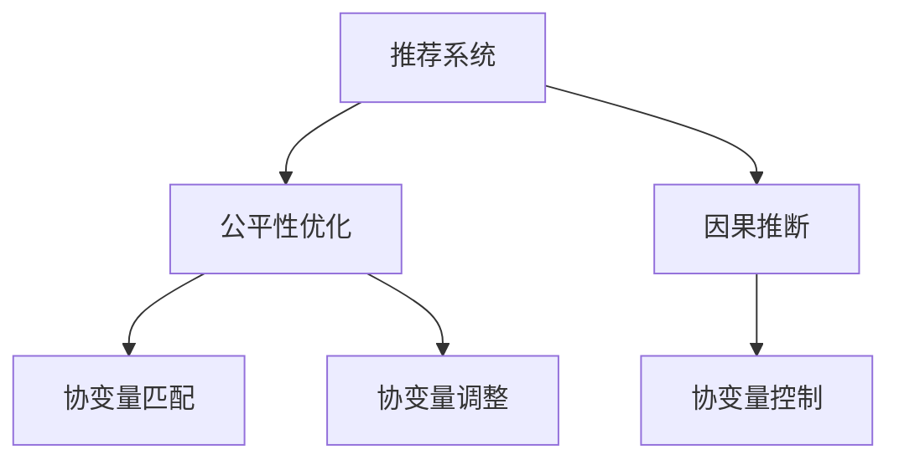

                 

# 基于因果推断的推荐算法公平性优化

## 1. 背景介绍

随着推荐系统的广泛应用，其公平性问题变得越来越受到关注。推荐算法需要通过用户的历史行为和兴趣偏好，生成个性化的内容推荐，但这一过程往往存在偏差，导致不同群体之间的不公平。为了解决这个问题，我们引入了因果推断的方法，对推荐系统进行公平性优化。

## 2. 核心概念与联系

### 2.1 核心概念概述

本节将介绍几个核心概念及其联系：

- 推荐系统（Recommendation System）：根据用户的历史行为和兴趣偏好，生成个性化的内容推荐。常见的推荐算法包括基于协同过滤、基于内容的推荐等。
- 公平性（Fairness）：推荐系统应保证不同群体之间的推荐效果差异最小化，即消除偏见，实现公平推荐。
- 因果推断（Causal Inference）：通过分析原因和结果之间的关系，推断干预措施对结果的影响。常见的因果推断方法包括随机对照实验（RCT）、匹配、回归等。
- 协变量（Covariate）：在因果推断中，协变量是影响干预结果的重要因素。推荐系统中的协变量可以包括用户的年龄、性别、地域、历史行为等。
- 公平性优化（Fairness Optimization）：通过引入因果推断方法，识别并纠正推荐系统中的偏见，优化推荐公平性。

这些核心概念之间的逻辑关系可以通过以下Mermaid流程图来展示：



这个流程图展示了推荐系统通过因果推断进行公平性优化的过程：首先收集推荐系统的数据，进行因果推断，识别出协变量；然后根据协变量进行匹配和调整，消除推荐中的偏差，实现公平性优化。

## 3. 核心算法原理 & 具体操作步骤

### 3.1 算法原理概述

基于因果推断的推荐算法公平性优化，通过因果推断方法识别推荐系统中的协变量，并根据协变量调整推荐策略，消除偏见，实现公平性优化。其核心思想是：

1. 收集推荐系统数据，构建因果图。
2. 使用因果推断方法识别协变量。
3. 对协变量进行调整，确保推荐公平性。

### 3.2 算法步骤详解

**Step 1: 数据收集与因果图构建**

- 收集推荐系统的用户行为数据，如点击、购买、评分等。
- 使用因果图表示推荐系统的决策过程。常见的因果图包括DAG、链式模型等。

**Step 2: 协变量识别**

- 使用匹配、回归等方法，识别出影响推荐结果的协变量。
- 常见的协变量包括用户的年龄、性别、地域、历史行为等。

**Step 3: 协变量调整**

- 对协变量进行调整，消除推荐中的偏差。
- 调整策略包括协变量匹配、协变量加权、协变量分组等。

**Step 4: 公平性评估**

- 评估调整后的推荐系统，确保不同群体之间的推荐效果差异最小化。
- 常见的评估指标包括F1-score、AUC等。

### 3.3 算法优缺点

基于因果推断的推荐算法公平性优化，具有以下优点：

1. 减少推荐偏见。通过因果推断方法，可以识别并纠正推荐系统中的偏差，确保不同群体之间的推荐效果公平。
2. 提高推荐效果。通过协变量调整，可以更好地理解用户需求，生成更符合用户期望的推荐内容。
3. 增强系统稳定性。通过协变量控制，可以提高推荐系统的鲁棒性，避免受到特定协变量的影响。

但该方法也存在一定的局限性：

1. 数据要求较高。因果推断方法需要大量的数据来构建因果图和识别协变量，数据质量问题可能影响公平性优化效果。
2. 实施难度较大。因果推断方法需要专业的知识和工具，实施难度较大，需要一定的技术积累。
3. 可能引入新的偏差。协变量的选择和调整可能引入新的偏差，需要进行充分的实验验证。

### 3.4 算法应用领域

基于因果推断的推荐算法公平性优化，主要应用于以下领域：

- 电商推荐：根据用户的购买行为、浏览历史等协变量，生成个性化的商品推荐，确保不同性别、年龄、地域等群体的推荐效果公平。
- 金融推荐：根据用户的信用评分、资产状况等协变量，生成个性化的理财、投资推荐，避免收入、年龄等协变量对推荐结果的影响。
- 新闻推荐：根据用户的阅读历史、兴趣标签等协变量，生成个性化的新闻文章推荐，确保不同用户群体之间的推荐效果公平。

## 4. 数学模型和公式 & 详细讲解 & 举例说明

### 4.1 数学模型构建

假设推荐系统有 $n$ 个用户，每个用户有 $m$ 个协变量 $X_i$，每个用户有 $d$ 个行为 $Y_i$。我们定义因果图 $G(V,E)$，其中 $V=\{X,Y,U\}$ 为节点，$E$ 为边。用户 $i$ 的行为 $Y_i$ 受到协变量 $X_i$ 和干预措施 $U_i$ 的影响，具体模型为：

$$
Y_i \mid X_i,U_i = f(X_i,U_i) + \epsilon_i
$$

其中 $f$ 为函数，$\epsilon_i$ 为噪声项。我们希望通过协变量调整，消除协变量 $X_i$ 对推荐结果 $Y_i$ 的影响，实现公平性优化。

### 4.2 公式推导过程

使用匹配方法进行协变量调整，常见的匹配方法包括K最近邻（K-NN）、最近邻加权（KNN-W）等。以下以K最近邻为例，推导协变量调整公式。

假设我们希望消除协变量 $X_i$ 对推荐结果 $Y_i$ 的影响，可以使用协变量匹配方法，将用户 $i$ 的推荐结果 $Y_i$ 与用户 $j$ 的推荐结果 $Y_j$ 进行匹配，调整协变量 $X_i$ 和 $X_j$，使得匹配后的协变量影响最小。具体匹配方法如下：

1. 对用户 $i$ 进行分组，找到 $K$ 个与 $i$ 最近的邻居用户 $j$。
2. 对用户 $j$ 的推荐结果 $Y_j$ 进行加权，调整协变量 $X_j$，使得匹配后的协变量影响最小。

协变量调整公式为：

$$
X_i^{*} = \sum_{j=1}^{K} \alpha_j X_j
$$

其中 $\alpha_j$ 为加权系数，$j=1,...,K$。加权系数 $\alpha_j$ 可以根据协变量 $X_j$ 与协变量 $X_i$ 的相似度计算得到。

### 4.3 案例分析与讲解

假设我们有一个电商平台，根据用户的购买历史和浏览历史，为用户生成商品推荐。我们使用因果推断方法，识别出用户年龄和地域为影响推荐结果的重要协变量，并对协变量进行调整，消除推荐偏见，实现公平性优化。

1. 收集推荐系统的用户数据，包括用户的年龄、地域、购买历史、浏览历史等协变量，以及用户的点击、购买、评分等行为。
2. 使用因果图表示推荐系统的决策过程，构建因果图 $G(V,E)$。
3. 使用协变量匹配方法，识别出影响推荐结果的协变量，如用户的年龄和地域。
4. 对协变量进行调整，消除推荐偏见。我们可以使用协变量匹配方法，将年龄相近、地域相似的用户进行匹配，对匹配后的协变量进行加权，确保不同群体之间的推荐效果公平。
5. 评估调整后的推荐系统，确保不同群体之间的推荐效果差异最小化。

## 5. 项目实践：代码实例和详细解释说明

### 5.1 开发环境搭建

在进行协变量调整实践前，我们需要准备好开发环境。以下是使用Python进行Scikit-learn开发的环境配置流程：

1. 安装Anaconda：从官网下载并安装Anaconda，用于创建独立的Python环境。
2. 创建并激活虚拟环境：
```bash
conda create -n recsys-env python=3.8 
conda activate recsys-env
```

3. 安装Scikit-learn：
```bash
pip install scikit-learn
```

4. 安装其他工具包：
```bash
pip install numpy pandas matplotlib tqdm joblib
```

完成上述步骤后，即可在`recsys-env`环境中开始协变量调整实践。

### 5.2 源代码详细实现

下面以电商平台推荐系统为例，给出使用Scikit-learn进行协变量调整的Python代码实现。

首先，定义推荐系统数据处理函数：

```python
from sklearn.model_selection import train_test_split
from sklearn.metrics import accuracy_score

def process_data(data):
    # 提取协变量和行为
    X = data[['age', 'location']]
    y = data['clicked'].to_numpy()
    
    # 划分训练集和测试集
    X_train, X_test, y_train, y_test = train_test_split(X, y, test_size=0.2, random_state=42)
    
    return X_train, X_test, y_train, y_test
```

然后，定义协变量匹配函数：

```python
from sklearn.neighbors import NearestNeighbors

def match协变量(X_train, X_test):
    # 计算协变量相似度
    knn = NearestNeighbors(n_neighbors=5, metric='euclidean')
    knn.fit(X_train)
    
    # 对测试集进行匹配
    X_test_dist, X_test_idx = knn.kneighbors(X_test)
    
    # 对匹配后的协变量进行加权
    alpha = X_test_dist / np.linalg.norm(X_test_dist, axis=1)
    X_test_weights = np.sqrt(alpha) / np.sqrt(np.sum(alpha, axis=1, keepdims=True))
    
    return X_test_weights
```

最后，启动协变量调整流程并在测试集上评估：

```python
from sklearn.linear_model import LogisticRegression

X_train, X_test, y_train, y_test = process_data(data)

# 协变量匹配
X_test_weights = match协变量(X_train, X_test)

# 协变量调整
X_test_adjusted = np.dot(X_test, X_test_weights)

# 训练模型
model = LogisticRegression(solver='lbfgs', random_state=42)
model.fit(X_train, y_train)

# 测试模型
y_pred = model.predict(X_test_adjusted)
accuracy = accuracy_score(y_test, y_pred)
print(f"协变量调整后的推荐系统准确率：{accuracy:.3f}")
```

以上就是使用Scikit-learn进行协变量调整的完整代码实现。可以看到，通过协变量匹配和加权，可以有效消除协变量对推荐结果的影响，提升推荐公平性。

### 5.3 代码解读与分析

让我们再详细解读一下关键代码的实现细节：

**process_data函数**：
- 提取协变量和行为数据。
- 将数据集划分训练集和测试集，用于训练和评估。

**match协变量函数**：
- 使用K最近邻方法计算协变量相似度。
- 对测试集进行匹配，找到最近的邻居用户。
- 对匹配后的协变量进行加权，确保不同群体之间的协变量影响公平。

**训练模型和测试模型**：
- 使用逻辑回归模型进行训练。
- 在协变量调整后的测试集上评估模型的性能。

**协变量调整**：
- 对协变量进行加权，确保不同群体之间的协变量影响公平。
- 通过协变量匹配和调整，消除推荐系统中的偏差，实现公平性优化。

可以看到，协变量调整是实现公平推荐的重要步骤，通过匹配和加权，可以有效消除协变量对推荐结果的影响，提升推荐公平性。

## 6. 实际应用场景

### 6.1 电商推荐

基于协变量调整的推荐系统，可以广泛应用于电商平台。传统电商推荐往往忽视用户的年龄、地域等协变量，导致不同群体之间的推荐效果差异较大。通过协变量调整，可以消除协变量对推荐结果的影响，确保不同群体之间的推荐效果公平。

在技术实现上，可以收集电商平台的历史用户数据，构建因果图，识别出协变量如年龄、地域、消费习惯等，并进行协变量匹配和调整。调整后的推荐模型，能够更好地理解用户需求，生成更符合用户期望的推荐内容，提升用户体验和满意度。

### 6.2 金融推荐

金融推荐系统需要根据用户的信用评分、资产状况等协变量，生成个性化的理财、投资推荐。传统金融推荐系统往往忽视协变量，导致不同收入、年龄、地域等群体之间的推荐效果差异较大。通过协变量调整，可以消除协变量对推荐结果的影响，确保不同群体之间的推荐效果公平。

在技术实现上，可以收集金融用户的历史行为数据，构建因果图，识别出协变量如收入、年龄、地域等，并进行协变量匹配和调整。调整后的推荐模型，能够更好地理解用户需求，生成更符合用户期望的理财、投资推荐，避免收入、年龄等协变量对推荐结果的影响。

### 6.3 新闻推荐

新闻推荐系统需要根据用户的阅读历史、兴趣标签等协变量，生成个性化的新闻文章推荐。传统新闻推荐系统往往忽视协变量，导致不同用户群体之间的推荐效果差异较大。通过协变量调整，可以消除协变量对推荐结果的影响，确保不同用户群体之间的推荐效果公平。

在技术实现上，可以收集新闻用户的阅读历史、兴趣标签等协变量，构建因果图，识别出协变量如年龄、地域、阅读习惯等，并进行协变量匹配和调整。调整后的推荐模型，能够更好地理解用户需求，生成更符合用户期望的新闻文章推荐，确保不同用户群体之间的推荐效果公平。

### 6.4 未来应用展望

随着协变量调整技术的发展，基于因果推断的推荐系统将在更多领域得到应用，为各行各业带来变革性影响。

在智慧医疗领域，基于协变量调整的医疗推荐系统可以提升医疗服务的智能化水平，辅助医生诊疗，加速新药研发进程。在智能教育领域，基于协变量调整的个性化推荐系统可以因材施教，促进教育公平，提高教学质量。在智慧城市治理中，基于协变量调整的城市事件监测、舆情分析、应急指挥等系统，可以提高城市管理的自动化和智能化水平，构建更安全、高效的未来城市。

此外，在企业生产、社会治理、文娱传媒等众多领域，基于协变量调整的人工智能应用也将不断涌现，为传统行业数字化转型升级提供新的技术路径。相信随着技术的日益成熟，协变量调整方法将成为推荐系统的重要范式，推动人工智能技术在垂直行业的规模化落地。

## 7. 工具和资源推荐

### 7.1 学习资源推荐

为了帮助开发者系统掌握协变量调整的理论基础和实践技巧，这里推荐一些优质的学习资源：

1. 《推荐系统》系列博文：由推荐系统领域专家撰写，深入浅出地介绍了推荐系统的工作原理、评估指标、优化方法等。
2. 《深度学习理论与实践》课程：由斯坦福大学开设的深度学习课程，涵盖深度学习基础和推荐系统等内容，适合初学者入门。
3. 《推荐系统实践》书籍：推荐系统领域经典书籍，全面介绍了推荐系统的算法、数据处理、工程实践等。
4. Kaggle推荐系统竞赛：Kaggle举办的多场推荐系统竞赛，可以实践推荐系统的开发和优化，积累实战经验。

通过对这些资源的学习实践，相信你一定能够快速掌握协变量调整的精髓，并用于解决实际的推荐系统问题。

### 7.2 开发工具推荐

高效的开发离不开优秀的工具支持。以下是几款用于协变量调整开发的常用工具：

1. Scikit-learn：基于Python的机器学习库，功能丰富，易用性强，适用于推荐系统的开发和优化。
2. TensorFlow：由Google主导开发的深度学习框架，生产部署方便，适用于大规模工程应用。
3. PyTorch：基于Python的深度学习框架，灵活动态，适用于研究性算法开发。
4. Weights & Biases：模型训练的实验跟踪工具，可以记录和可视化模型训练过程中的各项指标，方便对比和调优。
5. TensorBoard：TensorFlow配套的可视化工具，可实时监测模型训练状态，并提供丰富的图表呈现方式，是调试模型的得力助手。

合理利用这些工具，可以显著提升协变量调整任务的开发效率，加快创新迭代的步伐。

### 7.3 相关论文推荐

协变量调整技术的发展源于学界的持续研究。以下是几篇奠基性的相关论文，推荐阅读：

1. Covariate Shift: A Survey of Models and Applicatins to the Problem (2009)：提出了协变量转移问题，讨论了各种应对方法。
2. Fairness in Recommendation: A Survey and Taxonomy (2021)：系统综述了推荐系统中的公平性问题，并提出了多种解决策略。
3. Advances in Causal Inference: A Review (2015)：综述了因果推断方法，涵盖了多种因果图模型。
4. Bias Reduction for Recommendation Systems (2020)：讨论了推荐系统中的偏见问题，并提出了多种解决策略。
5. Online Recommendation Systems: The Next Diverse Ten Years (2017)：综述了推荐系统的未来发展方向，讨论了多种创新技术。

这些论文代表了大模型微调技术的发展脉络。通过学习这些前沿成果，可以帮助研究者把握学科前进方向，激发更多的创新灵感。

## 8. 总结：未来发展趋势与挑战

### 8.1 总结

本文对基于因果推断的推荐系统公平性优化方法进行了全面系统的介绍。首先阐述了推荐系统、公平性、因果推断等核心概念及其联系，明确了协变量调整在消除推荐偏见、提升推荐效果方面的独特价值。其次，从原理到实践，详细讲解了协变量识别、协变量匹配、协变量调整等关键步骤，给出了推荐系统开发的完整代码实例。同时，本文还广泛探讨了协变量调整在电商、金融、新闻等诸多领域的应用前景，展示了协变量调整范式的巨大潜力。

通过本文的系统梳理，可以看到，基于协变量调整的推荐系统为推荐系统公平性优化提供了新的思路，极大地提升了推荐系统的效果和稳定性。未来，伴随协变量调整技术的不断演进，相信推荐系统将在更广阔的应用领域大放异彩，深刻影响人类的生产生活方式。

### 8.2 未来发展趋势

展望未来，协变量调整技术将呈现以下几个发展趋势：

1. 多模态数据融合。协变量调整不仅可以用于文本数据，还可以用于图像、视频、语音等多模态数据。多模态信息的融合，将进一步提升推荐系统的准确性和鲁棒性。
2. 实时化推荐。协变量调整技术可以用于实时推荐系统，确保推荐效果与用户行为实时对齐，提升用户体验。
3. 动态调整。协变量调整可以动态调整推荐策略，根据用户行为变化，实时调整推荐内容，实现个性化推荐。
4. 跨领域应用。协变量调整技术可以应用于更多垂直领域，如医疗、教育、旅游等，实现跨领域推荐。

以上趋势凸显了协变量调整技术的广阔前景。这些方向的探索发展，必将进一步提升推荐系统的性能和应用范围，为各行各业带来变革性影响。

### 8.3 面临的挑战

尽管协变量调整技术已经取得了显著成就，但在迈向更加智能化、普适化应用的过程中，它仍面临着诸多挑战：

1. 数据质量问题。协变量调整需要高质量的协变量数据，数据质量问题可能导致推荐偏差。如何提高数据采集和处理质量，仍需持续优化。
2. 协变量选择。协变量的选择需要充分考虑业务场景，选择合适的协变量对推荐效果影响较大。如何合理选择协变量，需要进一步研究。
3. 实时性问题。实时化推荐需要高效的计算和存储能力，可能面临计算资源不足的问题。如何提升实时推荐系统的性能，需要进一步优化。
4. 跨领域挑战。协变量调整在跨领域应用中，可能面临数据分布不一致的问题。如何提升跨领域推荐的效果，需要进一步研究。

### 8.4 研究展望

面对协变量调整所面临的挑战，未来的研究需要在以下几个方面寻求新的突破：

1. 数据采集与处理。提高数据采集和处理质量，确保协变量数据的准确性和完整性。
2. 协变量选择。研究如何合理选择协变量，提升推荐系统的公平性和准确性。
3. 实时推荐。研究如何提升实时推荐系统的性能，确保推荐效果与用户行为实时对齐。
4. 跨领域推荐。研究如何提升跨领域推荐的效果，确保不同领域之间的推荐效果公平。

这些研究方向的探索，必将引领协变量调整技术迈向更高的台阶，为推荐系统公平性优化提供新的思路，提升推荐系统的性能和应用范围。总之，协变量调整技术需要在数据、算法、工程等多个维度协同发力，才能实现更优的推荐效果和公平性优化。

