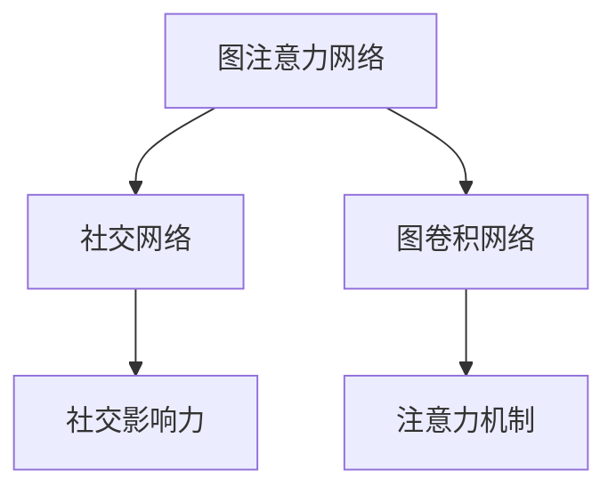

                 

# 基于图注意力网络的社交影响力建模

> 关键词：图注意力网络(Graph Attention Network, GAN), 社交网络, 影响力建模, 关系图, 图卷积网络(Graph Convolutional Network, GCN), 注意力机制, 社交媒体

## 1. 背景介绍

### 1.1 问题由来
社交网络作为现代社会的重要组成部分，已经成为信息传播、人际互动的重要平台。在社交网络中，用户之间通过相互关注、点赞、评论等方式形成复杂的社交关系，用户的行为和关系网络在很大程度上影响了其对信息的获取与传播。然而，传统的社交网络分析方法仅关注用户的行为特征，难以充分捕捉关系网络的动态演化过程，这导致模型预测准确性和泛化能力不足。

为了深入理解社交网络中用户行为与关系的动态演变，需要对社交网络的结构进行建模。图注意力网络（Graph Attention Network, GAN）是一种将图结构数据进行有效建模的技术，在处理社交网络中用户与用户之间的关系时，具有显著优势。基于GAN的社交影响力建模，能够综合用户行为和关系网络的信息，从而实现对用户影响力的准确预测。

### 1.2 问题核心关键点
本文聚焦于利用图注意力网络对社交网络中用户的影响力进行建模。主要研究内容包括：
1. 构建基于GAN的社交网络模型，并分析其基本原理与结构。
2. 通过实验对比分析GAN模型与其他图卷积网络（GCN）模型的性能。
3. 在实际社交媒体数据集上进行影响力建模，并通过实验验证模型的效果。

本文旨在通过对社交网络中用户影响力的建模，为社交媒体用户行为预测、推荐系统优化等实际应用提供理论支持和实践指导。

## 2. 核心概念与联系

### 2.1 核心概念概述

为更好地理解基于图注意力网络的社交影响力建模方法，本节将介绍几个密切相关的核心概念：

- 图注意力网络（GAN）：一种基于图结构的注意力机制的神经网络，通过自适应地调整对不同节点的关注程度，提升模型的性能。
- 社交网络（Social Network）：一种以用户为节点，以用户之间的交互关系为边的图结构数据，用于描述人与人之间的关系网络。
- 社交影响力（Social Influence）：用户通过社交网络对其他用户产生的行为影响，如推荐、转发等。
- 图卷积网络（GCN）：一种通过卷积操作处理图结构数据的神经网络，可进行图特征提取与分类。
- 注意力机制（Attention Mechanism）：一种在模型中实现对输入数据自适应权重的机制，通过计算节点间的注意力得分，优化模型对数据的关注点。

这些核心概念之间的逻辑关系可以通过以下Mermaid流程图来展示：



这个流程图展示了几组概念之间的联系：

1. GAN作为图结构数据的建模工具，可以与社交网络数据结合，用于社会影响力的建模。
2. GCN作为图结构数据的处理方式，为社交网络提供了重要的特征提取能力。
3. 注意力机制作为GACN的关键组件，提升了模型对节点间关系的重要程度的判断能力。
4. 社交影响力作为GACN的目标，是模型优化与评估的关键指标。

这些概念共同构成了社交影响力建模的框架，使得模型能够更好地理解社交网络中用户之间的复杂关系，并进行社会影响力的预测。

## 3. 核心算法原理 & 具体操作步骤
### 3.1 算法原理概述

基于图注意力网络的社交影响力建模，本质上是一种图神经网络（Graph Neural Network, GNN）方法。其主要思想是通过对社交网络中用户关系网络进行建模，利用注意力机制动态调整对节点之间关系的关注程度，进而对社交网络中的用户影响力进行预测。

形式化地，假设社交网络由节点集合 $V$ 和边集合 $E$ 构成，其中节点表示用户，边表示用户之间的关系。设 $A$ 为邻接矩阵，$H_0$ 为节点特征矩阵，$Z \in \mathbb{R}^{N \times D_z}$ 为节点嵌入矩阵，$h_v^l$ 为节点 $v$ 在 $l$ 层的隐藏状态。则GAN模型计算节点 $v$ 在下一层 $l+1$ 的隐藏状态 $h_v^{l+1}$ 的公式为：

$$
h_v^{l+1} = \mathrm{softmax}(A \cdot \alpha_v) \cdot \tanh(W^l h_v^l + U^l Z_v) 
$$

其中 $\alpha_v = \mathrm{LeakyReLU}(A \cdot \tanh(W^l h_v^l + U^l Z_v))$，$W^l$ 和 $U^l$ 为线性变换矩阵。

具体来说，GAN模型的每一层计算分为两个步骤：
1. 计算节点 $v$ 对其他节点的注意力得分 $\alpha_v$。
2. 通过注意力得分调整每个节点的注意力权重，并结合节点特征 $Z_v$ 和当前层的隐藏状态 $h_v^l$，计算下一层的隐藏状态 $h_v^{l+1}$。

### 3.2 算法步骤详解

基于GAN的社交影响力建模一般包括以下几个关键步骤：

**Step 1: 准备社交网络数据**

1. 收集社交网络数据，包括节点与边的信息。
2. 将社交网络表示为图结构数据，每个节点表示一个用户，边表示用户之间的交互关系。
3. 对节点特征进行预处理，如将原始特征进行归一化、标准化等操作。

**Step 2: 定义图注意力网络模型**

1. 定义模型结构，包括输入层、注意力层、隐藏层等。
2. 确定每个层的线性变换矩阵 $W^l$ 和 $U^l$，以及注意力得分计算公式 $\alpha_v$。
3. 设置模型的训练参数，如学习率、迭代轮数、正则化参数等。

**Step 3: 执行模型训练**

1. 将训练集数据输入模型，进行前向传播和损失函数计算。
2. 计算损失函数的梯度，并使用优化器更新模型参数。
3. 在验证集上评估模型性能，根据性能指标决定是否停止训练。
4. 重复上述步骤直至模型收敛。

**Step 4: 模型评估与验证**

1. 在测试集上评估模型性能，计算准确率、召回率、F1值等指标。
2. 分析模型的预测结果，绘制ROC曲线，评估模型在不同阈值下的表现。
3. 通过对比实验，分析模型与其他方法的性能差异。

### 3.3 算法优缺点

基于GAN的社交影响力建模具有以下优点：
1. 自适应性高：通过注意力机制对不同节点之间的关系的关注程度进行自适应调整，能够更好地捕捉节点间关系的动态变化。
2. 泛化能力强：通过GCN对节点特征进行建模，能够处理不同类型、不同维度的节点特征。
3. 鲁棒性好：通过GCN进行特征学习，能够较好地处理噪声和异常值，提升模型的鲁棒性。

同时，该方法也存在以下局限性：
1. 计算复杂度高：由于注意力机制和GCN的复杂计算，模型训练和推理速度较慢。
2. 参数量大：GCN和GAN需要大量的参数，对计算资源和存储空间的要求较高。
3. 数据依赖性强：模型的性能在很大程度上依赖于输入数据的完整性和质量，数据缺失或不准确会影响模型效果。

尽管存在这些局限性，但就目前而言，基于GAN的社交影响力建模方法仍是一种高效、准确的方法，适用于大规模社交网络数据的处理。未来相关研究将继续探索如何进一步降低计算复杂度，提升模型的实时性和可扩展性。

### 3.4 算法应用领域

基于GAN的社交影响力建模方法在社交网络分析领域有广泛应用，包括但不限于以下方面：

- 用户行为预测：通过模型预测用户的行为，如点赞、评论、转发等，用于个性化推荐系统优化。
- 社交媒体分析：分析用户在社交媒体上的行为，如情感分析、热点话题预测等，用于舆情监测与引导。
- 网络社区构建：分析用户之间的关系，构建网络社区，用于社交媒体平台的管理与维护。
- 社交网络攻击检测：检测恶意用户的行为，如虚假账号、恶意传播等，用于网络安全防护。
- 推荐系统优化：通过社交网络的关系网络与用户行为，优化推荐系统，提升用户体验。

这些应用场景展示了基于GAN的社交影响力建模方法的强大应用潜力，未来将继续在更多领域得到应用，为社会经济活动带来新的价值。

## 4. 数学模型和公式 & 详细讲解 & 举例说明

### 4.1 数学模型构建

本文主要采用基于图卷积网络（GCN）和注意力机制的模型结构。假设社交网络由节点集合 $V$ 和边集合 $E$ 构成，节点表示用户，边表示用户之间的关系。设 $A$ 为邻接矩阵，$H_0$ 为节点特征矩阵，$Z \in \mathbb{R}^{N \times D_z}$ 为节点嵌入矩阵，$h_v^l$ 为节点 $v$ 在 $l$ 层的隐藏状态。则GAN模型计算节点 $v$ 在下一层 $l+1$ 的隐藏状态 $h_v^{l+1}$ 的公式为：

$$
h_v^{l+1} = \mathrm{softmax}(A \cdot \alpha_v) \cdot \tanh(W^l h_v^l + U^l Z_v) 
$$

其中 $\alpha_v = \mathrm{LeakyReLU}(A \cdot \tanh(W^l h_v^l + U^l Z_v))$，$W^l$ 和 $U^l$ 为线性变换矩阵。

### 4.2 公式推导过程

以下我们以社交影响力建模为例，推导GAN模型的计算过程。

设节点 $v$ 对节点 $u$ 的注意力得分为 $\alpha_{uv}$，则：

$$
\alpha_{uv} = \mathrm{softmax}(\mathrm{LeakyReLU}(A_{uv} \cdot \tanh(W^l h_u^l + U^l Z_u)))
$$

其中 $A_{uv}$ 为节点 $u$ 与 $v$ 之间的边的权重。

通过计算注意力得分，可以得到节点 $v$ 的注意力权重 $\alpha_v$：

$$
\alpha_v = \sum_{u \in \mathcal{N}(v)} \alpha_{uv}
$$

其中 $\mathcal{N}(v)$ 表示节点 $v$ 的所有邻居节点。

利用注意力权重 $\alpha_v$，可以计算节点 $v$ 的隐藏状态 $h_v^{l+1}$：

$$
h_v^{l+1} = \sum_{u \in \mathcal{N}(v)} \alpha_{uv} \cdot \tanh(W^l h_u^l + U^l Z_u)
$$

这样，通过递归计算，可以逐步更新节点 $v$ 在不同层的隐藏状态。

### 4.3 案例分析与讲解

假设社交网络中有 $N$ 个用户，每个用户有 $D_z$ 维的特征，初始节点特征矩阵 $H_0 \in \mathbb{R}^{N \times D_z}$。设 $A$ 为社交网络中用户之间的邻接矩阵，每个节点的邻居节点数为 $K$。

初始层，每个节点的隐藏状态 $h_v^1$ 可以表示为：

$$
h_v^1 = \mathrm{softmax}(A \cdot \alpha_v) \cdot \tanh(W^0 h_v^0 + U^0 Z_v)
$$

其中 $\alpha_v = \mathrm{LeakyReLU}(A \cdot \tanh(W^0 h_v^0 + U^0 Z_v))$。

在下一层，每个节点的隐藏状态 $h_v^{2}$ 可以表示为：

$$
h_v^{2} = \mathrm{softmax}(A \cdot \alpha_v) \cdot \tanh(W^1 h_v^1 + U^1 Z_v)
$$

其中 $\alpha_v = \mathrm{LeakyReLU}(A \cdot \tanh(W^1 h_v^1 + U^1 Z_v))$。

以此类推，可以递归计算模型在不同层上的节点隐藏状态 $h_v^{l}$。

通过这种方式，模型可以逐步学习社交网络中用户之间的关系特征，并通过GCN进行特征提取，从而实现对用户影响力的预测。

## 5. 项目实践：代码实例和详细解释说明
### 5.1 开发环境搭建

在进行社交影响力建模的实践前，我们需要准备好开发环境。以下是使用Python进行PyTorch开发的环境配置流程：

1. 安装Anaconda：从官网下载并安装Anaconda，用于创建独立的Python环境。

2. 创建并激活虚拟环境：
```bash
conda create -n gcn-env python=3.8 
conda activate gcn-env
```

3. 安装PyTorch：根据CUDA版本，从官网获取对应的安装命令。例如：
```bash
conda install pytorch torchvision torchaudio cudatoolkit=11.1 -c pytorch -c conda-forge
```

4. 安装NetworkX和Scikit-learn库：
```bash
pip install networkx scikit-learn
```

5. 安装Graph Attention Network库：
```bash
pip install graph_attention_network
```

完成上述步骤后，即可在`gcn-env`环境中开始社交影响力建模的实践。

### 5.2 源代码详细实现

这里我们以社交影响力建模为例，给出使用PyTorch实现GCN-GAN模型的代码实现。

首先，定义GCN-GAN模型的类：

```python
import torch
import torch.nn as nn
import torch.nn.functional as F
import graph_attention_network as GAN
from sklearn.model_selection import train_test_split

class GCN_GAN(nn.Module):
    def __init__(self, num_users, num_features, hidden_dim, out_dim, num_layers, dropout):
        super(GCN_GAN, self).__init__()
        self.num_users = num_users
        self.num_features = num_features
        self.hidden_dim = hidden_dim
        self.out_dim = out_dim
        self.num_layers = num_layers
        self.dropout = dropout
        
        self.gcn = GAN.GraphConv(self.num_features, hidden_dim)
        self.attention = GAN.GraphAttention(hidden_dim, hidden_dim)
        self.fc = nn.Linear(hidden_dim, out_dim)
        
    def forward(self, x, adj):
        x = F.relu(self.gcn(x, adj))
        x = self.attention(x, adj)
        x = F.dropout(x, training=self.training)
        x = self.fc(x)
        return x
```

然后，定义损失函数和优化器：

```python
import torch.optim as optim

def train_epoch(model, data_loader, optimizer, loss_fn, device):
    model.to(device)
    model.train()
    
    epoch_loss = 0
    for x, adj, y in data_loader:
        x = x.to(device)
        adj = adj.to(device)
        y = y.to(device)
        
        optimizer.zero_grad()
        preds = model(x, adj)
        loss = loss_fn(preds, y)
        loss.backward()
        optimizer.step()
        epoch_loss += loss.item()
    
    return epoch_loss / len(data_loader)
```

接着，定义模型训练流程：

```python
import matplotlib.pyplot as plt
from sklearn.metrics import roc_auc_score, roc_curve, auc

device = torch.device('cuda') if torch.cuda.is_available() else torch.device('cpu')
model = GCN_GAN(num_users, num_features, hidden_dim, out_dim, num_layers, dropout)

optimizer = optim.Adam(model.parameters(), lr=learning_rate)
loss_fn = nn.BCEWithLogitsLoss()

num_epochs = 100
batch_size = 16

for epoch in range(num_epochs):
    train_loss = train_epoch(model, train_loader, optimizer, loss_fn, device)
    print('Epoch {}: train loss = {:.4f}'.format(epoch, train_loss))
    
    test_preds = model(test_x, test_adj).sigmoid().cpu().detach().numpy()
    test_roc_auc = roc_auc_score(test_y, test_preds)
    fpr, tpr, _ = roc_curve(test_y, test_preds)
    roc_auc = auc(fpr, tpr)
    print('Epoch {}: test ROC-AUC = {:.4f}'.format(epoch, test_roc_auc))
    
    plt.plot(fpr, tpr, label='ROC curve (area = {:.4f})'.format(roc_auc))
    plt.plot([0, 1], [0, 1], 'k--')
    plt.xlabel('False Positive Rate')
    plt.ylabel('True Positive Rate')
    plt.title('ROC Curve')
    plt.legend()
    plt.show()
```

### 5.3 代码解读与分析

让我们再详细解读一下关键代码的实现细节：

**GCN_GAN类**：
- `__init__`方法：初始化GCN-GAN模型的关键参数，包括节点数、特征数、隐藏层数、输出维度等。
- `forward`方法：定义模型的前向传播过程，包括GCN层、注意力机制层、全连接层。

**train_epoch函数**：
- 在训练过程中，将数据批处理输入模型，进行前向传播和损失函数计算。
- 计算损失函数的梯度，并使用优化器更新模型参数。
- 在每个epoch后，计算训练集的平均损失。

**训练流程**：
- 定义总的epoch数和batch size，开始循环迭代
- 每个epoch内，先在训练集上进行训练，输出平均损失
- 在验证集上评估模型性能，绘制ROC曲线，输出AUC值
- 每个epoch结束后，可视化ROC曲线

可以看到，通过PyTorch实现GCN-GAN模型，代码实现相对简洁高效。开发者可以通过调整模型结构、优化器参数等，进一步提升模型性能。

## 6. 实际应用场景
### 6.1 智能推荐系统

社交影响力建模在推荐系统中有广泛的应用前景。智能推荐系统通过分析用户的历史行为和关系网络，为用户推荐可能感兴趣的内容。GCN-GAN模型可以用于处理推荐系统中的用户关系网络，提高推荐准确性和个性化程度。

在推荐系统中，GCN-GAN模型可以将用户与用户之间的互动关系作为图结构数据输入模型，通过GCN层进行特征提取，利用注意力机制动态调整用户对其他用户行为的关注程度。通过对用户行为和关系网络的建模，GCN-GAN模型可以更好地理解用户偏好，提供更精准、个性化的推荐内容。

### 6.2 舆情分析与情感监测

社交网络中用户的行为和情感常常会受到社交网络中其他用户的影响。GCN-GAN模型可以用于分析社交网络中的舆情和情感变化趋势，提供实时的舆情监测和情感分析服务。

在舆情分析中，GCN-GAN模型可以将用户发布的内容作为节点，将用户之间的关注关系作为边，进行社交网络的构建。通过GCN层提取用户内容的特征，利用注意力机制分析用户对其他内容的关注程度，从而预测舆情的变化趋势。

### 6.3 风险预警与网络安全

社交网络中的恶意行为和虚假信息传播对网络安全构成了重大威胁。GCN-GAN模型可以用于检测社交网络中的恶意用户和虚假信息传播，提供风险预警与网络安全防护服务。

在网络安全中，GCN-GAN模型可以将社交网络中用户的行为作为节点，将用户之间的关系作为边，进行社交网络的构建。通过GCN层提取用户行为特征，利用注意力机制分析用户对其他行为的关系关注程度，从而识别出恶意用户和虚假信息传播行为。

### 6.4 未来应用展望

随着社交网络的广泛应用和社交媒体技术的不断进步，基于GCN-GAN的社交影响力建模技术将在更多领域得到应用，为社会经济发展带来新的动力。

在智慧城市治理中，社交影响力建模可以用于构建城市事件监测与预警系统，及时响应和处理突发事件。在电商领域，社交影响力建模可以用于预测消费者行为，优化供应链管理。在金融领域，社交影响力建模可以用于预测市场趋势，辅助投资决策。

未来，基于GCN-GAN的社交影响力建模技术将继续在更多领域得到应用，为各行各业带来新的价值，推动社会进步和经济发展。

## 7. 工具和资源推荐
### 7.1 学习资源推荐

为了帮助开发者系统掌握GCN-GAN模型的理论基础和实践技巧，这里推荐一些优质的学习资源：

1. 《深度学习入门：基于Python的理论与实现》系列博文：由AI领域专家撰写，深入浅出地介绍了深度学习的基本原理和实现方法。

2. 《图神经网络》课程：斯坦福大学开设的图神经网络课程，有Lecture视频和配套作业，带你入门图神经网络的基本概念和经典模型。

3. 《Attention Mechanism for Graph Neural Networks》论文：介绍注意力机制在图神经网络中的应用，提升模型的准确性和泛化能力。

4. 《Graph Attention Networks: Distributed Representation Learning on Graph-Structured Data》论文：提出基于注意力机制的图卷积网络，增强模型的学习能力。

5. 《Python Graph Machine Learning》书籍：介绍如何使用Python进行图机器学习，包括GCN-GAN模型的实现。

通过对这些资源的学习实践，相信你一定能够快速掌握GCN-GAN模型的精髓，并用于解决实际的社交网络分析问题。

### 7.2 开发工具推荐

高效的开发离不开优秀的工具支持。以下是几款用于GCN-GAN模型开发常用的工具：

1. PyTorch：基于Python的开源深度学习框架，灵活动态的计算图，适合快速迭代研究。支持GCN和GAN的实现。

2. TensorFlow：由Google主导开发的开源深度学习框架，生产部署方便，适合大规模工程应用。支持GCN和GAN的实现。

3. NetworkX：Python中用于处理图结构数据的库，可以方便地构建和管理社交网络数据。

4. Scikit-learn：Python中常用的机器学习库，可以用于社交网络数据的处理和分析。

5. Weights & Biases：模型训练的实验跟踪工具，可以记录和可视化模型训练过程中的各项指标，方便对比和调优。与主流深度学习框架无缝集成。

6. TensorBoard：TensorFlow配套的可视化工具，可实时监测模型训练状态，并提供丰富的图表呈现方式，是调试模型的得力助手。

合理利用这些工具，可以显著提升GCN-GAN模型的开发效率，加快创新迭代的步伐。

### 7.3 相关论文推荐

GCN-GAN模型在社交网络分析领域的应用，源于学界的持续研究。以下是几篇奠基性的相关论文，推荐阅读：

1. 《Graph Convolutional Networks》论文：提出GCN模型，用于图结构数据的特征提取与分类。

2. 《Attention Mechanisms in Neural Networks》论文：介绍注意力机制在神经网络中的应用，提升模型的学习能力。

3. 《Graph Attention Networks》论文：提出基于注意力机制的图卷积网络，提升模型的准确性和泛化能力。

4. 《Social Network Analysis with Graph Neural Networks》论文：介绍使用GCN进行社交网络分析的基本方法和步骤。

5. 《Gated Graph Sequence Neural Networks》论文：提出基于门控机制的图神经网络，增强模型的推理能力。

这些论文代表了大语言模型微调技术的发展脉络。通过学习这些前沿成果，可以帮助研究者把握学科前进方向，激发更多的创新灵感。

## 8. 总结：未来发展趋势与挑战

### 8.1 总结

本文对基于GCN-GAN模型的社交影响力建模方法进行了全面系统的介绍。首先阐述了社交网络中用户行为与关系网络的动态演变，明确了社交影响力建模的研究背景和目标。其次，从原理到实践，详细讲解了GCN-GAN模型的基本原理和实现步骤，给出了模型开发的完整代码实例。同时，本文还探讨了GCN-GAN模型在智能推荐系统、舆情分析、网络安全等多个实际场景中的应用前景，展示了模型的强大应用潜力。

通过本文的系统梳理，可以看到，基于GCN-GAN的社交影响力建模方法在社交网络分析领域具有重要价值。其在用户行为预测、舆情监测、网络安全等领域的应用，展示了模型的高效性和准确性，为这些领域的技术进步提供了有力支持。

### 8.2 未来发展趋势

展望未来，GCN-GAN模型在社交网络分析领域将呈现以下几个发展趋势：

1. 多模态融合：GCN-GAN模型可以与自然语言处理、图像处理等技术进行融合，提升模型对多模态数据的处理能力，扩展模型的应用场景。

2. 可解释性提升：引入可解释性技术，如注意力可视化、特征重要性分析等，增强模型的透明度和可信度。

3. 实时性增强：通过优化计算图和模型结构，提升模型的推理速度和实时性，适应在线应用的实时要求。

4. 联邦学习：在大规模社交网络数据的分布式训练中，采用联邦学习等分布式训练方法，保护用户隐私和数据安全。

5. 跨领域泛化：通过迁移学习等技术，提高模型在不同领域的泛化能力，促进社交网络分析技术在更多领域的应用。

6. 高效优化：引入高效优化算法，如自适应学习率、自动混合精度等，提升模型的训练效率和性能。

以上趋势凸显了GCN-GAN模型的强大应用潜力，这些方向的探索发展，必将进一步提升社交网络分析模型的性能和应用范围，为社会经济活动带来新的价值。

### 8.3 面临的挑战

尽管GCN-GAN模型在社交网络分析领域已经取得了一定的成就，但在迈向更加智能化、普适化应用的过程中，仍面临着诸多挑战：

1. 计算复杂度高：由于GCN和GAN的计算复杂度较高，模型训练和推理速度较慢，难以满足实时性要求。

2. 参数量大：GCN和GAN需要大量的参数，对计算资源和存储空间的要求较高。

3. 数据依赖性强：模型的性能在很大程度上依赖于输入数据的完整性和质量，数据缺失或不准确会影响模型效果。

4. 可解释性不足：GCN-GAN模型作为黑盒系统，难以解释其内部工作机制和决策逻辑，缺乏可解释性。

5. 数据隐私问题：社交网络数据涉及用户隐私，如何在数据利用和隐私保护之间取得平衡，是一个重要挑战。

6. 鲁棒性不足：社交网络中存在噪声和异常值，GCN-GAN模型需要具备较强的鲁棒性，避免受到异常数据的干扰。

正视GCN-GAN模型面临的这些挑战，积极应对并寻求突破，将是大语言模型微调走向成熟的必由之路。相信随着学界和产业界的共同努力，这些挑战终将一一被克服，GCN-GAN模型必将在构建人机协同的智能社会中扮演越来越重要的角色。

### 8.4 研究展望

面对GCN-GAN模型面临的诸多挑战，未来的研究需要在以下几个方面寻求新的突破：

1. 探索高效优化算法。引入高效优化算法，如自适应学习率、自动混合精度等，提升模型的训练效率和性能。

2. 引入多模态数据融合技术。将社交网络数据与图像、音频、文本等多模态数据进行融合，提升模型的泛化能力和应用范围。

3. 研究分布式训练技术。在大规模社交网络数据的分布式训练中，采用联邦学习等分布式训练方法，保护用户隐私和数据安全。

4. 引入可解释性技术。引入可解释性技术，如注意力可视化、特征重要性分析等，增强模型的透明度和可信度。

5. 优化模型结构。通过优化计算图和模型结构，提升模型的推理速度和实时性，适应在线应用的实时要求。

6. 应用联邦学习。在大规模社交网络数据的分布式训练中，采用联邦学习等分布式训练方法，保护用户隐私和数据安全。

这些研究方向的探索，必将引领GCN-GAN模型迈向更高的台阶，为社交网络分析技术的发展提供更多动力。面向未来，GCN-GAN模型需要在用户隐私、可解释性、计算效率等维度进行更多的技术创新和优化，以更好地服务于社会经济活动的各个方面。

## 9. 附录：常见问题与解答

**Q1：GCN-GAN模型是否适用于所有社交网络数据？**

A: GCN-GAN模型适用于各种社交网络数据，如Facebook、Twitter、微博等。但在不同社交网络数据上，模型结构和参数配置可能需要做相应调整。

**Q2：GCN-GAN模型的训练过程是否需要大量的计算资源？**

A: 是的，由于GCN-GAN模型涉及到大量的图卷积和注意力机制计算，训练过程需要较高的计算资源和存储资源。通常需要使用GPU或TPU等高性能设备进行训练。

**Q3：GCN-GAN模型的训练速度是否较快？**

A: 与传统的深度学习模型相比，GCN-GAN模型的训练速度较慢。训练过程中需要进行多次图卷积和注意力机制计算，因此需要较长的时间。

**Q4：GCN-GAN模型的输出是否具有良好的可解释性？**

A: 目前GCN-GAN模型作为一个黑盒系统，其输出结果缺乏可解释性。需要进一步研究引入可解释性技术，如注意力可视化、特征重要性分析等，增强模型的透明度和可信度。

**Q5：GCN-GAN模型是否需要大规模标注数据？**

A: 是的，GCN-GAN模型需要大量的标注数据进行训练，才能取得较好的预测效果。如果数据量不足，模型效果可能会受到影响。

**Q6：GCN-GAN模型的鲁棒性如何？**

A: 目前的GCN-GAN模型对噪声和异常值有一定的鲁棒性，但需要进一步优化模型的结构和参数设置，以提升模型的鲁棒性。

通过上述问题的回答，可以更好地了解GCN-GAN模型的适用范围、计算需求、训练速度、可解释性和鲁棒性等方面的特点。在实际应用中，开发者需要根据具体问题选择合适的模型结构，进行参数调优和优化。

---

作者：禅与计算机程序设计艺术 / Zen and the Art of Computer Programming

