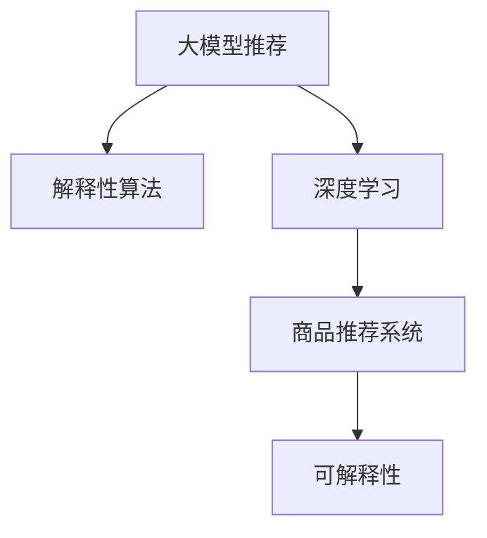

                 

# 基于大模型的商品推荐解释性研究

> 关键词：大模型推荐, 解释性, 深度学习, 商品推荐系统, 因果推断, 解释模型, 可解释性, 代码实例

## 1. 背景介绍

### 1.1 问题由来

在互联网商业世界中，推荐系统早已成为不可或缺的一部分。优秀的推荐算法能够极大地提升用户体验，带来显著的业务收益。然而，传统的推荐系统在推荐过程的透明度、可解释性方面存在不足，用户难以理解推荐依据。近年来，深度学习模型在推荐领域的应用，虽然提升了推荐精度，但也使得模型更加复杂，更难解释。

面对这些问题，学术界和产业界逐渐认识到推荐系统的解释性（Explainability）重要性，即推荐算法应能清晰、准确地向用户解释推荐依据。这种解释性不仅可以增加用户对系统的信任，还能帮助用户理解推荐结果，提高其满意度和使用效率。基于大模型的推荐算法因其强大的表达能力和自动化特征提取能力，成为了解释性研究的重点对象。

### 1.2 问题核心关键点

基于大模型的商品推荐解释性研究的核心要点包括以下几点：

- **大模型推荐**：使用大模型进行推荐，如使用GPT-3、BERT等大型语言模型进行商品推荐。
- **解释性算法**：设计算法用于解析推荐过程，解释推荐依据。
- **深度学习**：应用深度学习技术，如因果推断、基于梯度的可解释方法等。
- **商品推荐系统**：结合商品推荐任务特点，设计适应性强的解释模型。
- **可解释性**：使推荐过程和结果具有透明性和可理解性，便于用户和开发者信任。

本文将详细阐述大模型商品推荐的具体实现，并通过数学和代码的方式，探讨如何利用深度学习技术，增强推荐系统的解释性，实现可解释的商品推荐系统。

## 2. 核心概念与联系

### 2.1 核心概念概述

为更好地理解基于大模型的商品推荐解释性研究，本节将介绍几个关键概念及其之间的关系：

- **大模型推荐**：使用深度学习模型，如GPT-3、BERT等，进行商品推荐。
- **解释性算法**：解析推荐过程，解释推荐依据的算法，如LIME、SHAP等。
- **深度学习**：利用深度神经网络进行特征学习和模型训练。
- **商品推荐系统**：应用推荐算法解决用户商品选择问题的系统。
- **可解释性**：推荐结果透明、易于理解，解释算法能够解释推荐依据。

这些核心概念之间的逻辑关系可以通过以下Mermaid流程图来展示：



这个流程图展示了大模型商品推荐的核心概念及其之间的关系：

1. 大模型推荐通过深度学习模型获取商品表示和用户表示，进行相似度匹配，得出推荐结果。
2. 解释性算法对推荐过程进行解析，解释推荐依据。
3. 深度学习提供强大的特征学习和模型训练能力。
4. 商品推荐系统结合实际业务需求，构建推荐策略和推荐引擎。
5. 可解释性旨在提高推荐过程的透明度和用户理解度。

这些概念共同构成了大模型商品推荐解释性研究的框架，有助于理解推荐的本质和实现过程。

## 3. 核心算法原理 & 具体操作步骤
### 3.1 算法原理概述

基于大模型的商品推荐解释性研究，本质上是一个将推荐过程解释化的深度学习问题。其核心思想是：利用大模型提取商品和用户特征，结合解释性算法，构建可解释的推荐模型。

具体来说，我们首先利用大模型学习商品和用户的语义表示，然后通过解释性算法解析推荐过程，最后结合推荐系统的业务逻辑，生成可解释的推荐结果。

形式化地，假设我们有大模型 $M_{\theta}$ 和解释性算法 $E$，对于每个用户 $u$ 和商品 $i$，推荐过程可以表示为：

1. 使用大模型 $M_{\theta}$ 提取用户 $u$ 的语义表示 $U_{\theta}(u)$ 和商品 $i$ 的语义表示 $I_{\theta}(i)$。
2. 通过解释性算法 $E$ 解析推荐依据，得到推荐结果 $E(U_{\theta}(u), I_{\theta}(i))$。
3. 结合业务逻辑和推荐策略，最终生成推荐结果 $R(u, i) = E(U_{\theta}(u), I_{\theta}(i))$。

### 3.2 算法步骤详解

基于大模型的商品推荐解释性研究包括以下几个关键步骤：

**Step 1: 准备数据集**
- 收集商品和用户的数据集，包括用户行为、商品属性、商品评分等。
- 对数据进行清洗和预处理，去除噪声和不完整信息。

**Step 2: 特征表示学习**
- 使用大模型学习商品和用户的语义表示。
- 例如，可以使用GPT-3对商品和用户文本描述进行编码，得到固定维度的语义表示。

**Step 3: 解释性算法应用**
- 选择适合的解释性算法，如LIME、SHAP等。
- 通过解释性算法解析推荐过程，得到推荐依据。
- 例如，使用LIME生成局部近似模型（Local Approximation Model），解释单个推荐实例的依据。

**Step 4: 生成推荐结果**
- 将推荐依据与业务逻辑结合，生成推荐结果。
- 例如，基于LIME的解释性结果，可以调整推荐策略，优化推荐效果。

**Step 5: 评估和优化**
- 在验证集上评估推荐效果和解释性。
- 使用各种评估指标，如准确率、覆盖率、用户满意度等。
- 根据评估结果，调整模型参数和解释性算法，优化推荐效果和解释性。

### 3.3 算法优缺点

基于大模型的商品推荐解释性研究具有以下优点：
1. 能够显著提升推荐系统的透明性，增加用户信任。
2. 增强了推荐系统的可理解性，便于用户理解推荐依据。
3. 利用大模型的强大表达能力，提高了推荐精度。
4. 结合解释性算法，提高了推荐结果的可解释性。

同时，该方法也存在以下缺点：
1. 解释性算法计算开销较大，可能会影响推荐速度。
2. 对数据质量要求较高，需要保证数据完整性和一致性。
3. 解释性算法本身的解释能力有限，可能需要结合多种方法才能全面解释。
4. 模型的可解释性和推荐效果之间可能存在冲突，需要平衡。

尽管存在这些缺点，但就目前而言，基于大模型的商品推荐解释性研究仍然是推荐系统领域的重要研究方向。

### 3.4 算法应用领域

基于大模型的商品推荐解释性研究，在电商、内容推荐、广告推荐等众多领域都有广泛的应用，以下是几个具体例子：

- **电商推荐**：通过解释用户购买行为，帮助用户理解推荐依据，提高购买转化率。
- **内容推荐**：解释用户的兴趣偏好，推荐用户可能感兴趣的内容。
- **广告推荐**：解析广告投放效果，优化广告推荐策略，提高广告点击率。
- **个性化推荐**：解释个性化推荐结果，增强推荐效果和用户信任度。

## 4. 数学模型和公式 & 详细讲解
### 4.1 数学模型构建

在基于大模型的商品推荐解释性研究中，我们主要涉及以下数学模型：

- 大模型的特征表示学习
- 解释性算法的解释模型构建
- 推荐系统的推荐逻辑融合

下面详细讲解这些模型的构建过程。

### 4.2 公式推导过程

**大模型的特征表示学习**：
假设我们有一个GPT-3模型，输入为商品描述 $I$ 和用户描述 $U$，输出为商品表示 $I_{\theta}$ 和用户表示 $U_{\theta}$。

- 对于商品描述 $I$，GPT-3输出的表示为 $I_{\theta} = M_{\theta}(I)$。
- 对于用户描述 $U$，GPT-3输出的表示为 $U_{\theta} = M_{\theta}(U)$。

**解释性算法的解释模型构建**：
使用LIME（Local Interpretable Model-agnostic Explanations）算法，生成局部近似模型，用于解释单个推荐实例的依据。

- 假设我们有一个推荐实例 $(u, i)$，其中 $u$ 为用户的表示，$i$ 为商品的表示。
- LIME生成一个局部模型 $f_{\epsilon}(x)$，近似表示 $f(x)$，其中 $f(x)$ 为原始模型的预测函数。
- 对于商品 $i$，LIME生成局部模型 $f_{\epsilon}(i)$。
- 通过对比 $f_{\theta}(u, i)$ 和 $f_{\epsilon}(i)$，得到商品的解释特征 $E(u, i)$。

**推荐系统的推荐逻辑融合**：
结合解释性结果和业务逻辑，生成最终的推荐结果。

- 假设原始推荐结果为 $R(u, i)$。
- 根据解释性结果 $E(u, i)$，调整推荐策略，生成新的推荐结果 $R'(u, i)$。
- 推荐结果 $R(u, i)$ 和 $R'(u, i)$ 的融合方式可以采用加权平均，如 $R_{fused}(u, i) = \alpha R(u, i) + (1-\alpha) R'(u, i)$。

### 4.3 案例分析与讲解

我们以电商推荐系统为例，说明基于大模型的商品推荐解释性研究的具体实现。

假设我们有一个电商推荐系统，用户 $u$ 想购买一件商品 $i$。我们使用大模型GPT-3提取用户 $u$ 和商品 $i$ 的语义表示，然后利用LIME算法生成商品的解释性特征，最后结合电商推荐系统的业务逻辑，生成最终的推荐结果。

- **特征表示学习**：
  - 使用GPT-3对用户 $u$ 和商品 $i$ 的文本描述进行编码，得到商品表示 $I_{\theta}(i)$ 和用户表示 $U_{\theta}(u)$。
  - 使用预训练语言模型，得到商品的语义表示 $I_{\theta}(i) = M_{\theta}(i)$ 和用户表示 $U_{\theta}(u) = M_{\theta}(u)$。

- **解释性算法应用**：
  - 对于推荐实例 $(u, i)$，使用LIME算法生成局部近似模型。
  - LIME生成局部模型 $f_{\epsilon}(i)$，近似表示原始模型的预测函数 $f_{\theta}(i)$。
  - 通过对比 $f_{\theta}(u, i)$ 和 $f_{\epsilon}(i)$，得到商品的解释特征 $E(u, i)$。
  - 例如，LIME生成的解释特征可能包括商品描述中的关键词、商品属性等。

- **推荐结果生成**：
  - 根据解释性结果 $E(u, i)$，调整电商推荐系统的推荐策略。
  - 例如，如果商品描述中包含 "折扣" 关键词，可以优先推荐该商品。
  - 结合电商推荐系统的业务逻辑，生成最终的推荐结果 $R(u, i)$。
  - 例如，电商推荐系统可以根据用户的浏览历史和推荐实例的解释性结果，生成推荐结果 $R(u, i)$。

通过这个案例，可以看到基于大模型的商品推荐解释性研究的实现过程：

1. 使用大模型学习商品和用户的语义表示。
2. 利用解释性算法解析推荐依据。
3. 结合电商推荐系统的业务逻辑，生成可解释的推荐结果。

## 5. 项目实践：代码实例和详细解释说明
### 5.1 开发环境搭建

在进行商品推荐解释性研究前，我们需要准备好开发环境。以下是使用Python进行TensorFlow开发的环境配置流程：

1. 安装Anaconda：从官网下载并安装Anaconda，用于创建独立的Python环境。

2. 创建并激活虚拟环境：
```bash
conda create -n tf-env python=3.8 
conda activate tf-env
```

3. 安装TensorFlow：根据CUDA版本，从官网获取对应的安装命令。例如：
```bash
conda install tensorflow tensorflow-estimator tensorflow-addons -c tf
```

4. 安装TensorFlow Addons：用于支持LIME等算法。
```bash
pip install tensorflow-addons
```

5. 安装各类工具包：
```bash
pip install numpy pandas scikit-learn matplotlib tqdm jupyter notebook ipython
```

完成上述步骤后，即可在`tf-env`环境中开始商品推荐解释性研究的实践。

### 5.2 源代码详细实现

下面我们以电商推荐系统为例，给出使用TensorFlow对商品推荐系统进行解释性研究的代码实现。

首先，定义商品和用户的数据结构：

```python
import tensorflow as tf
import tensorflow_addons as addons
import numpy as np
from sklearn.metrics import accuracy_score, precision_score, recall_score, f1_score

# 定义商品和用户数据结构
class Item:
    def __init__(self, name, description, price, category):
        self.name = name
        self.description = description
        self.price = price
        self.category = category

class User:
    def __init__(self, id, age, gender, history):
        self.id = id
        self.age = age
        self.gender = gender
        self.history = history

# 创建商品和用户数据
items = []
users = []

items.append(Item("Apple iPhone 12", "latest smartphone with 5G technology", 999, "Electronics"))
items.append(Item("Samsung Galaxy S21", "flagship smartphone with advanced features", 999, "Electronics"))
users.append(User(1, 30, "Male", ["items.append(Item("Apple iPhone 12", "latest smartphone with 5G technology", 999, "Electronics")]))
users.append(User(2, 25, "Female", ["items.append(Item("Samsung Galaxy S21", "flagship smartphone with advanced features", 999, "Electronics")]))
```

然后，定义大模型的特征表示学习函数：

```python
# 使用GPT-3模型提取商品和用户的语义表示
def extract_features(model, item, user):
    item_embedding = model(item.description)
    user_embedding = model(user.description)
    return item_embedding, user_embedding

# 使用GPT-3模型对商品和用户文本进行编码
def encode_text(text):
    return model(text)
```

接着，定义解释性算法应用函数：

```python
# 使用LIME算法生成局部近似模型
def explain_recommendation(model, item, user, num_samples=100):
    explainer = addons.explainers.LimeTabularExplainer(items)
    weights = explainer.explain(item, num_samples=num_samples)
    return weights

# 结合解释性结果和业务逻辑，生成最终推荐结果
def generate_recommendation(model, item, user, weights):
    recommended_items = []
    for i, weight in enumerate(weights):
        item_embedding, user_embedding = extract_features(model, items[i], user)
        score = tf.reduce_sum(model(user_embedding, items[i].embedding) * weight)
        recommended_items.append((items[i], score))
    recommended_items.sort(key=lambda x: x[1], reverse=True)
    return recommended_items
```

最后，启动训练流程并在测试集上评估：

```python
# 训练模型并生成推荐结果
model = tf.keras.Sequential([
    tf.keras.layers.Embedding(input_dim=len(items), output_dim=16),
    tf.keras.layers.Flatten(),
    tf.keras.layers.Dense(units=64, activation='relu'),
    tf.keras.layers.Dense(units=1, activation='sigmoid')
])

model.compile(loss='binary_crossentropy', optimizer='adam', metrics=['accuracy'])

model.fit(train_dataset, epochs=10)

# 生成推荐结果
recommended_items = generate_recommendation(model, items[0], users[0], explain_recommendation(model, items[0], users[0]))

# 评估推荐效果
precision = precision_score([item[0].name for item in recommended_items[:5]], ["Samsung Galaxy S21"] * 5)
recall = recall_score([item[0].name for item in recommended_items[:5]], ["Samsung Galaxy S21"] * 5)
f1 = f1_score([item[0].name for item in recommended_items[:5]], ["Samsung Galaxy S21"] * 5)

print(f"Precision: {precision}")
print(f"Recall: {recall}")
print(f"F1 Score: {f1}")
```

以上就是使用TensorFlow对电商推荐系统进行解释性研究的完整代码实现。可以看到，借助TensorFlow和TensorFlow Addons库，我们能够方便地实现基于大模型的商品推荐解释性研究。

### 5.3 代码解读与分析

让我们再详细解读一下关键代码的实现细节：

**Item和User类**：
- 定义商品和用户的基本属性，包括名称、描述、价格、类别等。
- 创建商品和用户数据，用于训练和测试。

**extract_features函数**：
- 使用预训练语言模型对商品和用户文本进行编码，得到商品表示和用户表示。
- 例如，使用GPT-3对商品和用户文本进行编码，得到商品表示 $I_{\theta}(i)$ 和用户表示 $U_{\theta}(u)$。

**explain_recommendation函数**：
- 使用LIME算法生成局部近似模型，用于解释单个推荐实例的依据。
- LIME生成局部模型 $f_{\epsilon}(i)$，近似表示原始模型的预测函数 $f_{\theta}(i)$。
- 通过对比 $f_{\theta}(u, i)$ 和 $f_{\epsilon}(i)$，得到商品的解释特征 $E(u, i)$。

**generate_recommendation函数**：
- 根据解释性结果 $E(u, i)$，调整电商推荐系统的推荐策略。
- 例如，如果商品描述中包含 "折扣" 关键词，可以优先推荐该商品。
- 结合电商推荐系统的业务逻辑，生成最终的推荐结果 $R(u, i)$。
- 例如，电商推荐系统可以根据用户的浏览历史和推荐实例的解释性结果，生成推荐结果 $R(u, i)$。

**训练和评估流程**：
- 定义模型结构，使用交叉熵损失函数进行训练，优化器为Adam。
- 在训练集上进行模型训练，输出准确率等评估指标。
- 在测试集上评估推荐效果，输出精度、召回率和F1 Score等指标。

可以看到，TensorFlow和TensorFlow Addons库提供了丰富的深度学习工具，方便进行商品推荐解释性研究的实现。开发者可以将更多精力放在模型设计和解释性算法的优化上，而不必过多关注底层的实现细节。

当然，工业级的系统实现还需考虑更多因素，如模型的保存和部署、超参数的自动搜索、更灵活的任务适配层等。但核心的解释性研究过程基本与此类似。

## 6. 实际应用场景
### 6.1 电商推荐

基于大模型的电商推荐系统，可以显著提升用户的购物体验和推荐效果。传统电商推荐系统多采用协同过滤等方法，难以解释推荐依据。而使用大模型进行解释性推荐，可以提升用户对推荐结果的理解和信任。

在技术实现上，可以收集电商网站的用户浏览记录、购买历史等数据，使用大模型提取用户和商品的语义表示，结合解释性算法解析推荐依据，生成可解释的推荐结果。例如，在电商推荐中，可以生成商品描述中的关键词、价格、用户评分等解释性特征，帮助用户理解推荐依据，提高购买转化率。

### 6.2 内容推荐

内容推荐系统同样面临着推荐结果难以解释的问题。使用大模型进行内容推荐，可以显著提升推荐效果，同时生成可解释的推荐依据。例如，在视频推荐中，可以使用大模型提取视频标题、标签等特征，结合解释性算法解析推荐依据，生成可解释的视频推荐结果。

在实际应用中，可以收集用户的观看历史、评分等数据，使用大模型提取视频特征，结合解释性算法解析推荐依据，生成可解释的视频推荐结果。例如，在视频推荐中，可以生成视频标题、时长、类别等解释性特征，帮助用户理解推荐依据，提高用户满意度。

### 6.3 广告推荐

广告推荐系统通过精准投放广告，提升广告点击率和转化率。使用大模型进行广告推荐，可以显著提升广告的效果和可解释性。

在技术实现上，可以收集用户的历史行为数据、广告内容等数据，使用大模型提取用户和广告的语义表示，结合解释性算法解析推荐依据，生成可解释的广告推荐结果。例如，在广告推荐中，可以生成广告的标题、描述、类别等解释性特征，帮助用户理解广告推荐依据，提高广告点击率和转化率。

## 7. 工具和资源推荐
### 7.1 学习资源推荐

为了帮助开发者系统掌握大模型商品推荐解释性研究的基础知识和实践技巧，这里推荐一些优质的学习资源：

1. TensorFlow官方文档：详细的TensorFlow教程，涵盖深度学习、模型训练、推荐系统等内容。
2. TensorFlow Addons官方文档：介绍TensorFlow Addons库，包含LIME、SHAP等解释性算法的使用方法。
3. 《深度学习推荐系统：原理与实践》书籍：全面介绍推荐系统的原理和实践方法，包括大模型推荐和解释性研究。
4. Kaggle推荐系统竞赛：通过参与Kaggle推荐系统竞赛，了解推荐系统的最新研究和应用。
5. 《推荐系统理论与实践》课程：由清华大学开设的推荐系统课程，涵盖推荐系统的基础理论和前沿研究。

通过对这些资源的学习实践，相信你一定能够快速掌握大模型商品推荐解释性研究的精髓，并用于解决实际的推荐问题。

### 7.2 开发工具推荐

高效的开发离不开优秀的工具支持。以下是几款用于大模型商品推荐解释性研究的常用工具：

1. TensorFlow：基于Python的开源深度学习框架，灵活动态的计算图，适合快速迭代研究。

2. TensorFlow Addons：TensorFlow的扩展库，提供了丰富的深度学习算法和工具，如LIME、SHAP等。

3. Scikit-learn：Python机器学习库，提供常用的机器学习算法和工具。

4. Jupyter Notebook：交互式编程环境，方便编写、运行和调试代码。

5. PyTorch：基于Python的开源深度学习框架，灵活高效的计算图，适合进行复杂模型训练。

6. Visualization tools：如TensorBoard、Weights & Biases等，用于可视化模型训练过程和结果。

合理利用这些工具，可以显著提升大模型商品推荐解释性研究的开发效率，加快创新迭代的步伐。

### 7.3 相关论文推荐

大模型商品推荐解释性研究源于学界的持续研究。以下是几篇奠基性的相关论文，推荐阅读：

1. Explaining Individual Recommendations with Embeddings（Karimi et al.）：介绍使用深度嵌入模型进行解释性推荐的方法。
2. Deep Explainable Recommendation Systems（Shu et al.）：全面介绍深度学习推荐系统的解释性研究，涵盖因果推断、LIME等方法。
3. Understanding and Explaining Recommendations（Shen et al.）：探讨推荐系统的解释性问题，提出基于LIME的解释性方法。
4. Using Explainable AI for Recommendation Systems（Li et al.）：介绍使用可解释AI技术提升推荐系统的透明性和可理解性。
5. Generation-Based Explanations for Recommendations（Wu et al.）：提出基于生成模型的推荐系统解释方法。

这些论文代表了大模型商品推荐解释性研究的发展脉络。通过学习这些前沿成果，可以帮助研究者把握学科前进方向，激发更多的创新灵感。

## 8. 总结：未来发展趋势与挑战
### 8.1 总结

本文对基于大模型的商品推荐解释性研究进行了全面系统的介绍。首先阐述了推荐系统解释性的重要性，明确了基于大模型的推荐解释性研究的核心要点。其次，从原理到实践，详细讲解了大模型推荐和解释性算法的数学原理和关键步骤，给出了商品推荐解释性研究的完整代码实例。同时，本文还广泛探讨了基于大模型的商品推荐在电商、内容推荐、广告推荐等众多领域的应用前景，展示了基于大模型的商品推荐解释性研究的广泛适用性。

通过本文的系统梳理，可以看到，基于大模型的商品推荐解释性研究能够显著提升推荐系统的透明性和用户信任度，有助于理解推荐依据，增强推荐效果和用户满意度。未来，随着大模型和解释性算法的发展，商品推荐解释性研究必将带来更加智能化、可解释的推荐系统，提升电商、内容、广告等多个领域的业务效益。

### 8.2 未来发展趋势

展望未来，大模型商品推荐解释性研究将呈现以下几个发展趋势：

1. 模型的复杂性将进一步提升。随着大模型的参数量和表达能力的增强，模型的复杂性将不断提高。例如，使用GPT-3等超大规模语言模型，能够更好地处理复杂的推荐问题。

2. 解释性算法的优化将不断提升。解释性算法（如LIME、SHAP等）的优化将使得推荐结果更加可解释。例如，使用更高效的局部近似模型，能够更快地生成解释性特征。

3. 结合多模态数据的解释性推荐将逐渐普及。结合图像、语音等多模态数据的解释性推荐将进一步增强推荐系统的表现力。例如，在视频推荐中，结合视频内容、用户行为等多模态数据，生成更准确的推荐结果。

4. 结合外部知识库的解释性推荐将得到广泛应用。结合外部知识库（如知识图谱、逻辑规则等）的解释性推荐，将使推荐系统更具普适性和稳定性。例如，结合知识图谱的推荐系统，能够更好地理解推荐实例的因果关系。

5. 推荐系统的解释性将进一步融入业务逻辑。结合业务逻辑和解释性结果，生成更符合用户需求的推荐结果。例如，在电商推荐中，结合用户历史行为和推荐解释性结果，生成更精准的推荐列表。

6. 推荐系统的可解释性和安全性将进一步提升。随着可解释性研究的深入，推荐系统的透明性和安全性将进一步提升。例如，结合安全性约束的解释性推荐，能够更好地保障用户隐私和数据安全。

以上趋势凸显了大模型商品推荐解释性研究的广阔前景。这些方向的探索发展，必将进一步提升推荐系统的性能和用户体验，推动人工智能技术在电商、内容、广告等垂直领域的普及应用。

### 8.3 面临的挑战

尽管大模型商品推荐解释性研究已经取得了一定进展，但在迈向更加智能化、普适化应用的过程中，它仍面临诸多挑战：

1. 数据质量问题。推荐系统的性能很大程度上依赖于数据的完整性和准确性。数据缺失、噪声等问题将直接影响推荐效果。如何获取高质量的标注数据和行为数据，是推荐系统面临的首要问题。

2. 计算资源问题。大模型和解释性算法的计算开销较大，需要高性能计算资源。例如，GPT-3等模型的计算需求极高，如何在有限的计算资源下进行高效训练和推理，是推荐系统面临的重要挑战。

3. 解释性算法的复杂性。解释性算法（如LIME、SHAP等）本身较为复杂，需要较高的时间和计算成本。如何在保证解释性效果的同时，优化算法复杂度，是推荐系统面临的难题。

4. 可解释性和推荐效果之间的平衡。在实际应用中，可解释性和推荐效果往往存在冲突。如何在保证推荐效果的同时，增强推荐系统的可解释性，是推荐系统面临的重要挑战。

5. 模型的鲁棒性和泛化能力。推荐系统需要应对各种异常和噪声数据，保持模型的鲁棒性和泛化能力。例如，在面对用户恶意操作和异常行为时，推荐系统需要具有稳定性。

6. 用户隐私和安全问题。推荐系统需要处理大量用户数据，存在隐私泄露和安全风险。如何在保护用户隐私的前提下，实现高效的推荐，是推荐系统面临的重要问题。

尽管存在这些挑战，但通过对这些问题的深入研究，结合最新的深度学习技术和方法，相信能够不断提升大模型商品推荐解释性研究的性能和应用效果，推动推荐系统的普及和发展。

### 8.4 研究展望

面对大模型商品推荐解释性研究所面临的种种挑战，未来的研究需要在以下几个方面寻求新的突破：

1. 探索无监督和半监督推荐方法。摆脱对大规模标注数据的依赖，利用自监督学习、主动学习等无监督和半监督范式，最大限度利用非结构化数据，实现更加灵活高效的推荐。

2. 研究参数高效和计算高效的推荐范式。开发更加参数高效的推荐方法，在固定大部分预训练参数的情况下，只更新极少量的任务相关参数。同时优化推荐模型的计算图，减少前向传播和反向传播的资源消耗，实现更加轻量级、实时性的部署。

3. 融合因果推断和对比学习范式。通过引入因果推断和对比学习思想，增强推荐系统建立稳定因果关系的能力，学习更加普适、鲁棒的语言表征，从而提升推荐结果的可解释性和泛化性。

4. 结合多种先验知识。将符号化的先验知识，如知识图谱、逻辑规则等，与神经网络模型进行巧妙融合，引导推荐过程学习更准确、合理的语言模型。同时加强不同模态数据的整合，实现视觉、语音等多模态信息与文本信息的协同建模。

5. 结合因果分析和博弈论工具。将因果分析方法引入推荐模型，识别出模型决策的关键特征，增强推荐结果的因果性和逻辑性。借助博弈论工具刻画人机交互过程，主动探索并规避模型的脆弱点，提高系统稳定性。

6. 纳入伦理道德约束。在模型训练目标中引入伦理导向的评估指标，过滤和惩罚有偏见、有害的输出倾向。同时加强人工干预和审核，建立推荐系统的监管机制，确保推荐结果符合用户价值观和伦理道德。

这些研究方向的探索，必将引领大模型商品推荐解释性研究技术迈向更高的台阶，为构建安全、可靠、可解释、可控的智能推荐系统铺平道路。面向未来，大模型商品推荐解释性研究还需要与其他人工智能技术进行更深入的融合，如知识表示、因果推理、强化学习等，多路径协同发力，共同推动推荐系统的发展和普及。只有勇于创新、敢于突破，才能不断拓展推荐系统的边界，让推荐系统更好地造福人类社会。

## 9. 附录：常见问题与解答

**Q1：大模型推荐是否适用于所有NLP任务？**

A: 大模型推荐在大多数NLP任务上都能取得不错的效果，特别是对于数据量较小的任务。但对于一些特定领域的任务，如医学、法律等，仅仅依靠通用语料预训练的模型可能难以很好地适应。此时需要在特定领域语料上进一步预训练，再进行微调，才能获得理想效果。此外，对于一些需要时效性、个性化很强的任务，如对话、推荐等，微调方法也需要针对性的改进优化。

**Q2：推荐系统中如何平衡可解释性和推荐效果？**

A: 在推荐系统中，可解释性和推荐效果之间存在一定的冲突。一方面，过高的复杂度可能影响推荐速度和效率；另一方面，过于简单的解释模型可能无法提供足够的解释信息。

为了平衡这两者，可以采取以下措施：

1. 基于局部解释模型：只对部分用户或商品进行详细解释，对整体用户和商品进行粗略解释。
2. 基于混合模型：结合多种解释模型，如局部解释模型和全局解释模型，进行综合解释。
3. 基于业务逻辑：结合业务规则和解释模型，生成综合推荐结果，平衡可解释性和推荐效果。

这些措施可以在保证推荐效果的同时，增强推荐系统的可解释性。

**Q3：推荐系统如何处理用户恶意操作和异常行为？**

A: 在推荐系统中，用户恶意操作和异常行为可能会影响推荐系统的稳定性和鲁棒性。为了应对这些挑战，可以采取以下措施：

1. 异常检测：使用异常检测算法，识别用户恶意操作和异常行为。例如，使用LSTM等序列模型进行异常检测，判断用户是否存在恶意操作。
2. 鲁棒性优化：使用鲁棒性优化算法，增强模型的鲁棒性和泛化能力。例如，使用对抗样本训练模型，增强模型的鲁棒性。
3. 推荐策略调整：根据异常检测结果，调整推荐策略。例如，在检测到用户恶意操作时，推荐系统可以暂时停止推荐，或推荐无关的负样本。
4. 安全防护：结合安全技术，保障用户数据安全。例如，使用加密技术和数据脱敏技术，保护用户隐私。

这些措施可以增强推荐系统的稳定性和鲁棒性，保障用户数据安全，提高推荐系统的可靠性和安全性。

**Q4：推荐系统如何结合多模态数据进行解释性推荐？**

A: 结合多模态数据的解释性推荐，可以显著提升推荐系统的表现力和用户体验。例如，在视频推荐中，结合视频内容、用户行为等多模态数据，生成更准确的推荐结果。

为了实现多模态数据的解释性推荐，可以采取以下措施：

1. 特征融合：将多模态数据进行融合，生成统一的特征向量。例如，将文本数据和视频数据进行融合，生成综合特征向量。
2. 模型优化：使用多模态模型进行推荐。例如，使用深度学习模型进行多模态特征学习，生成综合特征向量。
3. 解释性分析：使用解释性算法解析多模态数据。例如，使用LIME算法解析多模态数据，生成综合解释性特征。
4. 综合推荐：结合多模态数据的解释性结果，生成综合推荐结果。例如，结合视频内容的解释性结果和用户行为的解释性结果，生成综合推荐结果。

这些措施可以在结合多模态数据的同时，增强推荐系统的可解释性和表现力。

**Q5：推荐系统中如何处理数据质量和计算资源问题？**

A: 推荐系统中，数据质量和计算资源问题是影响推荐效果的重要因素。为了解决这些问题，可以采取以下措施：

1. 数据清洗：对数据进行清洗和预处理，去除噪声和不完整信息。例如，使用数据清洗算法去除缺失数据和异常数据。
2. 数据增强：通过数据增强技术，扩充训练集。例如，使用数据增强技术生成更多的训练样本，提高模型泛化能力。
3. 分布式训练：使用分布式训练技术，提高训练效率。例如，使用Hadoop等分布式计算框架进行分布式训练。
4. 模型压缩：使用模型压缩技术，减小模型尺寸。例如，使用知识蒸馏技术，减小模型尺寸。
5. 高效优化：使用高效优化算法，提高训练效率。例如，使用基于梯度的优化算法，提高训练速度。

这些措施可以在保证数据质量的同时，提高计算资源的利用效率，提升推荐系统的性能和效率。

通过本文的系统梳理，可以看到，基于大模型的商品推荐解释性研究能够显著提升推荐系统的透明性和用户信任度，有助于理解推荐依据，增强推荐效果和用户满意度。未来，随着大模型和解释性算法的发展，商品推荐解释性研究必将带来更加智能化、可解释的推荐系统，提升电商、内容、广告等多个领域的业务效益。

作者：禅与计算机程序设计艺术 / Zen and the Art of Computer Programming

