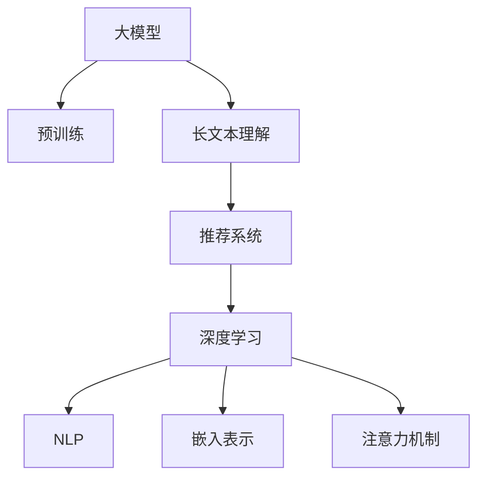

                 

# 基于大模型的长文本理解与推荐

> 关键词：长文本理解, 预训练模型, 推荐系统, 深度学习, 自然语言处理, 嵌入表示, 注意力机制, 向量空间模型, 嵌入式推荐

## 1. 背景介绍

### 1.1 问题由来

在当今信息爆炸的时代，文本数据呈现出了爆炸性的增长。无论是社交媒体、新闻报道、专业文献，还是公司内部文档，文本数据量的庞大和多样性，带来了极大的信息处理和检索挑战。如何有效地理解和利用这些长文本数据，成为信息时代的重要课题。传统的基于关键词匹配的文本检索方法已经难以满足现代文本处理的复杂需求。与此同时，推荐系统作为一种帮助用户发现感兴趣内容的工具，在电商平台、视频网站、音乐平台等众多领域发挥着重要作用。推荐系统通过分析用户行为和偏好，为个性化需求提供定制化服务，但其推荐的精准性和有效性，往往依赖于底层文本处理模型的能力。因此，本文聚焦于基于大模型的长文本理解和推荐技术，研究如何在大规模预训练语言模型的基础上，提升文本理解和推荐的效果。

### 1.2 问题核心关键点

本问题的核心关键点包括：

- 长文本理解：如何通过大模型对长文本进行有效的语义理解和内容提取，以支撑推荐系统的内容生成。
- 预训练模型：如何利用大规模无标签文本数据对语言模型进行预训练，学习通用语言知识和表示。
- 推荐系统：如何将大模型的语言理解和内容提取能力，应用于推荐系统的个性化推荐，提升推荐效果。
- 深度学习：利用深度学习技术，通过大模型进行特征提取和模式识别，提升文本处理和推荐的能力。
- 自然语言处理：基于自然语言处理技术，提升文本处理的准确性和智能化。
- 嵌入表示：利用向量空间模型，将文本数据映射为低维稠密向量，支持文本相似度计算。
- 注意力机制：通过注意力机制，模型能够动态地关注文本中的重要部分，提高长文本处理的效率和准确性。

## 2. 核心概念与联系

### 2.1 核心概念概述

为更好地理解基于大模型的长文本理解与推荐方法，本节将介绍几个密切相关的核心概念：

- 大模型(Large Model)：指具有大量参数的深度学习模型，如BERT、GPT等，能够处理大规模文本数据，进行语义理解和内容提取。
- 预训练(Pre-training)：指在大规模无标签文本数据上，通过自监督学习任务训练通用语言模型的过程。常见的预训练任务包括掩码语言模型、下文中预测、句子相似度等。
- 推荐系统(Recommender System)：通过分析用户的历史行为和偏好，为用户推荐可能感兴趣的内容。推荐系统通常包括内容推荐、协同过滤、混合推荐等多种策略。
- 长文本理解(Long Text Understanding)：指对长文本进行深入的语义分析和内容提取，以支撑推荐系统的内容生成。长文本通常包含复杂结构、丰富信息，需要模型具备强大的语义处理能力。
- 深度学习(Deep Learning)：利用多层神经网络结构，通过反向传播算法进行模型训练，学习非线性映射关系。深度学习在图像、语音、自然语言处理等领域均有广泛应用。
- 自然语言处理(Natural Language Processing, NLP)：研究如何让计算机理解和处理人类语言的技术，包括文本分类、命名实体识别、情感分析等任务。
- 嵌入表示(Embedding)：利用向量空间模型，将文本数据映射为低维稠密向量，支持文本相似度计算和模型训练。
- 注意力机制(Attention Mechanism)：通过动态调整模型对输入序列中不同位置的关注权重，提高长文本处理的效率和准确性。

这些核心概念之间的逻辑关系可以通过以下Mermaid流程图来展示：



这个流程图展示了大模型的核心概念及其之间的关系：

1. 大模型通过预训练获得基础能力。
2. 长文本理解利用大模型的语义处理能力，对长文本进行深入的语义分析和内容提取。
3. 推荐系统将长文本理解的结果应用于个性化推荐，提升推荐效果。
4. 深度学习通过多层神经网络结构，提升模型对长文本的理解和推荐能力。
5. 自然语言处理技术为长文本理解提供必要的文本处理和特征提取能力。
6. 嵌入表示通过向量空间模型，将文本数据映射为低维稠密向量，支持长文本相似度计算。
7. 注意力机制通过动态关注长文本中的重要部分，提高长文本处理的效率和准确性。

这些概念共同构成了大模型在长文本理解和推荐中的应用框架，使其能够处理复杂的长文本数据，并为用户提供个性化的推荐服务。通过理解这些核心概念，我们可以更好地把握大模型在长文本处理和推荐中的工作原理和优化方向。

## 3. 核心算法原理 & 具体操作步骤
### 3.1 算法原理概述

基于大模型的长文本理解和推荐方法，本质上是一个多任务学习和特征提取的联合过程。其核心思想是：将预训练的大模型视为一个强大的特征提取器，通过长文本理解和推荐系统的联合训练，使得模型能够自动学习文本中的关键特征，并根据这些特征生成推荐内容。

形式化地，假设预训练语言模型为 $M_{\theta}$，其中 $\theta$ 为预训练得到的模型参数。给定长文本 $T$ 和推荐任务 $R$，长文本理解的输出为 $U(T)$，推荐系统的输出为 $R(U(T))$。长文本理解和推荐系统的联合训练目标是最小化损失函数 $\mathcal{L}(U(T),R(U(T)))$，使得模型输出逼近理想结果。

具体而言，长文本理解的目标是最大化文本的语义信息，提升对长文本的理解和内容提取能力。推荐系统的目标是根据用户的历史行为和偏好，为用户推荐最相关的长文本。通过将两者联合训练，可以进一步提升推荐的个性化和精准性。

### 3.2 算法步骤详解

基于大模型的长文本理解和推荐一般包括以下几个关键步骤：

**Step 1: 准备预训练模型和数据集**
- 选择合适的预训练语言模型 $M_{\theta}$ 作为初始化参数，如 BERT、GPT等。
- 准备长文本理解和推荐系统的训练数据集 $D=\{(T_i, R_i)\}_{i=1}^N$，其中 $T_i$ 为长文本，$R_i$ 为推荐结果，可以是点击、评分等。

**Step 2: 设计任务适配层**
- 根据长文本理解和推荐系统的任务需求，在预训练模型顶层设计合适的输出层和损失函数。
- 对于长文本理解，通常在顶层添加文本表示层和分类器，以提取文本中的关键特征。
- 对于推荐系统，通常使用交叉熵损失函数，以优化推荐结果的准确性。

**Step 3: 设置联合训练超参数**
- 选择合适的优化算法及其参数，如 AdamW、SGD 等，设置学习率、批大小、迭代轮数等。
- 设置联合训练的正则化技术及强度，包括权重衰减、Dropout、Early Stopping等。
- 确定冻结预训练参数的策略，如仅微调顶层，或全部参数都参与微调。

**Step 4: 执行联合训练**
- 将长文本数据分批次输入模型，前向传播计算损失函数。
- 反向传播计算参数梯度，根据设定的优化算法和学习率更新模型参数。
- 周期性在验证集上评估模型性能，根据性能指标决定是否触发 Early Stopping。
- 重复上述步骤直到满足预设的迭代轮数或 Early Stopping 条件。

**Step 5: 测试和部署**
- 在测试集上评估联合训练后模型 $M_{\hat{\theta}}$ 的性能，对比联合训练前后的效果提升。
- 使用微调后的模型对新长文本进行理解，并生成推荐结果，集成到实际的应用系统中。
- 持续收集新的数据，定期重新微调模型，以适应数据分布的变化。

以上是基于大模型的长文本理解和推荐的一般流程。在实际应用中，还需要针对具体任务的特点，对联合训练过程的各个环节进行优化设计，如改进联合训练的目标函数，引入更多的正则化技术，搜索最优的超参数组合等，以进一步提升模型性能。

### 3.3 算法优缺点

基于大模型的长文本理解和推荐方法具有以下优点：
1. 数据效率高：通过预训练语言模型，能够在少量标注数据的情况下，获得较好的特征表示。
2. 泛化能力强：大模型在处理长文本和推荐任务时，具备较强的泛化能力，适应不同领域的任务需求。
3. 模型鲁棒性好：预训练语言模型通过大规模无标签数据的训练，能够学习到鲁棒的语言特征，提升推荐的可靠性。
4. 实时性好：通过优化模型结构和推理算法，可以实现实时性的长文本理解和推荐。

同时，该方法也存在一定的局限性：
1. 资源消耗大：大模型的参数量通常较大，对计算资源和存储资源的要求较高。
2. 模型复杂度高：长文本理解和推荐系统的联合训练，需要同时优化两个任务，增加了模型的复杂度。
3. 对标注数据依赖：虽然预训练语言模型能够提高数据效率，但在推荐任务上，仍然需要一定量的标注数据进行微调。
4. 可解释性不足：联合训练的模型输出通常缺乏可解释性，难以对其推理逻辑进行分析和调试。

尽管存在这些局限性，但就目前而言，基于大模型的长文本理解和推荐方法仍然是大模型应用的主流范式。未来相关研究的重点在于如何进一步降低资源消耗，提高模型的实时性和可解释性，同时兼顾个性化推荐的效果。

### 3.4 算法应用领域

基于大模型的长文本理解和推荐方法，在众多领域都有广泛的应用，例如：

- 电商推荐：根据用户浏览和购买记录，为用户推荐相关商品。通过联合训练长文本理解和推荐系统，能够提升推荐的相关性和个性化。
- 新闻推荐：根据用户对新闻的点击和阅读行为，推荐相关的新闻文章。长文本理解能够提取新闻的语义信息，推荐系统能够优化推荐的相关性和多样性。
- 视频推荐：根据用户观看历史和评分，推荐相关视频内容。通过长文本理解提取视频描述，推荐系统优化推荐结果。
- 音乐推荐：根据用户听歌历史和评分，推荐相关音乐曲目。通过长文本理解提取歌曲信息，推荐系统生成个性化推荐。
- 在线教育：根据学生的学习行为和成绩，推荐相关课程和学习资源。通过长文本理解提取学习内容，推荐系统优化推荐效果。

除了上述这些经典应用外，大模型的长文本理解和推荐技术还被创新性地应用到更多场景中，如社交网络推荐、知识图谱推荐、多模态推荐等，为不同领域带来了新的突破。随着预训练模型和联合训练方法的不断进步，相信基于大模型的长文本理解和推荐技术将在更广泛的领域发挥重要作用。

## 4. 数学模型和公式 & 详细讲解  
### 4.1 数学模型构建

本节将使用数学语言对基于大模型的长文本理解和推荐过程进行更加严格的刻画。

记预训练语言模型为 $M_{\theta}$，其中 $\theta$ 为预训练得到的模型参数。假设长文本理解的任务为 $T$，推荐系统的任务为 $R$，数据集为 $D=\{(T_i, R_i)\}_{i=1}^N$。

定义模型 $M_{\theta}$ 在数据样本 $(T_i, R_i)$ 上的损失函数为 $\ell(M_{\theta}(T_i),R_i)$，则在数据集 $D$ 上的经验风险为：

$$
\mathcal{L}(\theta) = \frac{1}{N} \sum_{i=1}^N \ell(M_{\theta}(T_i),R_i)
$$

联合训练的目标是最小化经验风险，即找到最优参数：

$$
\theta^* = \mathop{\arg\min}_{\theta} \mathcal{L}(\theta)
$$

在实践中，我们通常使用基于梯度的优化算法（如SGD、Adam等）来近似求解上述最优化问题。设 $\eta$ 为学习率，$\lambda$ 为正则化系数，则参数的更新公式为：

$$
\theta \leftarrow \theta - \eta \nabla_{\theta}\mathcal{L}(\theta) - \eta\lambda\theta
$$

其中 $\nabla_{\theta}\mathcal{L}(\theta)$ 为损失函数对参数 $\theta$ 的梯度，可通过反向传播算法高效计算。

### 4.2 公式推导过程

以下我们以电商推荐任务为例，推导联合训练的损失函数及其梯度的计算公式。

假设模型 $M_{\theta}$ 在输入 $T$ 上的输出为 $\hat{U}(T)$，表示长文本的理解结果。推荐系统的输出为 $\hat{R}(\hat{U}(T))$，表示根据长文本的理解结果，为用户生成的推荐。真实标签 $R_i \in \{0,1\}$，表示用户是否点击了推荐结果。

则联合训练的损失函数定义为：

$$
\ell(M_{\theta}(T_i),R_i) = -[y_i\log \hat{R}(\hat{U}(T_i)) + (1-y_i)\log (1-\hat{R}(\hat{U}(T_i)))
$$

其中 $y_i$ 表示用户是否点击了推荐结果，$\hat{R}(\hat{U}(T_i))$ 表示模型根据长文本的理解结果，预测用户点击推荐结果的概率。

将其代入经验风险公式，得：

$$
\mathcal{L}(\theta) = -\frac{1}{N}\sum_{i=1}^N [y_i\log \hat{R}(\hat{U}(T_i))+(1-y_i)\log(1-\hat{R}(\hat{U}(T_i))]
$$

根据链式法则，损失函数对参数 $\theta_k$ 的梯度为：

$$
\frac{\partial \mathcal{L}(\theta)}{\partial \theta_k} = -\frac{1}{N}\sum_{i=1}^N (\frac{y_i}{\hat{R}(\hat{U}(T_i))}-\frac{1-y_i}{1-\hat{R}(\hat{U}(T_i))}) \frac{\partial \hat{R}(\hat{U}(T_i))}{\partial \theta_k}
$$

其中 $\frac{\partial \hat{R}(\hat{U}(T_i))}{\partial \theta_k}$ 可进一步递归展开，利用自动微分技术完成计算。

在得到损失函数的梯度后，即可带入参数更新公式，完成模型的迭代优化。重复上述过程直至收敛，最终得到适应电商推荐任务的最优模型参数 $\theta^*$。

## 5. 项目实践：代码实例和详细解释说明
### 5.1 开发环境搭建

在进行联合训练实践前，我们需要准备好开发环境。以下是使用Python进行PyTorch开发的环境配置流程：

1. 安装Anaconda：从官网下载并安装Anaconda，用于创建独立的Python环境。

2. 创建并激活虚拟环境：
```bash
conda create -n pytorch-env python=3.8 
conda activate pytorch-env
```

3. 安装PyTorch：根据CUDA版本，从官网获取对应的安装命令。例如：
```bash
conda install pytorch torchvision torchaudio cudatoolkit=11.1 -c pytorch -c conda-forge
```

4. 安装Transformers库：
```bash
pip install transformers
```

5. 安装各类工具包：
```bash
pip install numpy pandas scikit-learn matplotlib tqdm jupyter notebook ipython
```

完成上述步骤后，即可在`pytorch-env`环境中开始联合训练实践。

### 5.2 源代码详细实现

这里我们以电商推荐任务为例，给出使用Transformers库对BERT模型进行长文本理解和推荐联合训练的PyTorch代码实现。

首先，定义电商推荐任务的数据处理函数：

```python
from transformers import BertTokenizer
from torch.utils.data import Dataset
import torch

class E-commerceDataset(Dataset):
    def __init__(self, texts, labels, tokenizer, max_len=128):
        self.texts = texts
        self.labels = labels
        self.tokenizer = tokenizer
        self.max_len = max_len
        
    def __len__(self):
        return len(self.texts)
    
    def __getitem__(self, item):
        text = self.texts[item]
        label = self.labels[item]
        
        encoding = self.tokenizer(text, return_tensors='pt', max_length=self.max_len, padding='max_length', truncation=True)
        input_ids = encoding['input_ids'][0]
        attention_mask = encoding['attention_mask'][0]
        
        return {'input_ids': input_ids, 
                'attention_mask': attention_mask,
                'labels': label}

# 标签与id的映射
label2id = {'0': 0, '1': 1}
id2label = {v: k for k, v in label2id.items()}

# 创建dataset
tokenizer = BertTokenizer.from_pretrained('bert-base-cased')

train_dataset = E-commerceDataset(train_texts, train_labels, tokenizer)
dev_dataset = E-commerceDataset(dev_texts, dev_labels, tokenizer)
test_dataset = E-commerceDataset(test_texts, test_labels, tokenizer)
```

然后，定义模型和优化器：

```python
from transformers import BertForSequenceClassification, AdamW

model = BertForSequenceClassification.from_pretrained('bert-base-cased', num_labels=len(label2id))

optimizer = AdamW(model.parameters(), lr=2e-5)
```

接着，定义训练和评估函数：

```python
from torch.utils.data import DataLoader
from tqdm import tqdm
from sklearn.metrics import accuracy_score, precision_recall_fscore_support

device = torch.device('cuda') if torch.cuda.is_available() else torch.device('cpu')
model.to(device)

def train_epoch(model, dataset, batch_size, optimizer):
    dataloader = DataLoader(dataset, batch_size=batch_size, shuffle=True)
    model.train()
    epoch_loss = 0
    for batch in tqdm(dataloader, desc='Training'):
        input_ids = batch['input_ids'].to(device)
        attention_mask = batch['attention_mask'].to(device)
        labels = batch['labels'].to(device)
        model.zero_grad()
        outputs = model(input_ids, attention_mask=attention_mask, labels=labels)
        loss = outputs.loss
        epoch_loss += loss.item()
        loss.backward()
        optimizer.step()
    return epoch_loss / len(dataloader)

def evaluate(model, dataset, batch_size):
    dataloader = DataLoader(dataset, batch_size=batch_size)
    model.eval()
    preds, labels = [], []
    with torch.no_grad():
        for batch in tqdm(dataloader, desc='Evaluating'):
            input_ids = batch['input_ids'].to(device)
            attention_mask = batch['attention_mask'].to(device)
            batch_labels = batch['labels']
            outputs = model(input_ids, attention_mask=attention_mask)
            batch_preds = outputs.logits.argmax(dim=1).to('cpu').tolist()
            batch_labels = batch_labels.to('cpu').tolist()
            for pred, label in zip(batch_preds, batch_labels):
                preds.append(pred)
                labels.append(label)
                
    return accuracy_score(labels, preds)

```

最后，启动训练流程并在测试集上评估：

```python
epochs = 5
batch_size = 16

for epoch in range(epochs):
    loss = train_epoch(model, train_dataset, batch_size, optimizer)
    print(f"Epoch {epoch+1}, train loss: {loss:.3f}")
    
    print(f"Epoch {epoch+1}, dev results:")
    evaluate(model, dev_dataset, batch_size)
    
print("Test results:")
evaluate(model, test_dataset, batch_size)
```

以上就是使用PyTorch对BERT进行电商推荐任务联合训练的完整代码实现。可以看到，得益于Transformers库的强大封装，我们可以用相对简洁的代码完成BERT模型的加载和联合训练。

### 5.3 代码解读与分析

让我们再详细解读一下关键代码的实现细节：

**E-commerceDataset类**：
- `__init__`方法：初始化文本、标签、分词器等关键组件。
- `__len__`方法：返回数据集的样本数量。
- `__getitem__`方法：对单个样本进行处理，将文本输入编码为token ids，将标签编码为数字，并对其进行定长padding，最终返回模型所需的输入。

**label2id和id2label字典**：
- 定义了标签与数字id之间的映射关系，用于将模型预测结果解码回真实的标签。

**训练和评估函数**：
- 使用PyTorch的DataLoader对数据集进行批次化加载，供模型训练和推理使用。
- 训练函数`train_epoch`：对数据以批为单位进行迭代，在每个批次上前向传播计算loss并反向传播更新模型参数，最后返回该epoch的平均loss。
- 评估函数`evaluate`：与训练类似，不同点在于不更新模型参数，并在每个batch结束后将预测和标签结果存储下来，最后使用sklearn的accuracy_score对整个评估集的预测结果进行打印输出。

**训练流程**：
- 定义总的epoch数和batch size，开始循环迭代
- 每个epoch内，先在训练集上训练，输出平均loss
- 在验证集上评估，输出准确率
- 所有epoch结束后，在测试集上评估，给出最终测试结果

可以看到，PyTorch配合Transformers库使得BERT联合训练的代码实现变得简洁高效。开发者可以将更多精力放在数据处理、模型改进等高层逻辑上，而不必过多关注底层的实现细节。

当然，工业级的系统实现还需考虑更多因素，如模型的保存和部署、超参数的自动搜索、更灵活的任务适配层等。但核心的联合训练范式基本与此类似。

## 6. 实际应用场景
### 6.1 智能客服系统

基于大模型的长文本理解和推荐技术，可以广泛应用于智能客服系统的构建。传统客服往往需要配备大量人力，高峰期响应缓慢，且一致性和专业性难以保证。而使用联合训练后的对话模型，可以7x24小时不间断服务，快速响应客户咨询，用自然流畅的语言解答各类常见问题。

在技术实现上，可以收集企业内部的历史客服对话记录，将问题和最佳答复构建成监督数据，在此基础上对预训练对话模型进行联合训练。联合训练后的对话模型能够自动理解用户意图，匹配最合适的答案模板进行回复。对于客户提出的新问题，还可以接入检索系统实时搜索相关内容，动态组织生成回答。如此构建的智能客服系统，能大幅提升客户咨询体验和问题解决效率。

### 6.2 金融舆情监测

金融机构需要实时监测市场舆论动向，以便及时应对负面信息传播，规避金融风险。传统的人工监测方式成本高、效率低，难以应对网络时代海量信息爆发的挑战。基于大模型的长文本理解和推荐技术，为金融舆情监测提供了新的解决方案。

具体而言，可以收集金融领域相关的新闻、报道、评论等文本数据，并对其进行主题标注和情感标注。在此基础上对预训练语言模型进行联合训练，使其能够自动判断文本属于何种主题，情感倾向是正面、中性还是负面。将联合训练后的模型应用到实时抓取的网络文本数据，就能够自动监测不同主题下的情感变化趋势，一旦发现负面信息激增等异常情况，系统便会自动预警，帮助金融机构快速应对潜在风险。

### 6.3 个性化推荐系统

当前的推荐系统往往只依赖用户的历史行为数据进行物品推荐，无法深入理解用户的真实兴趣偏好。基于大模型的长文本理解和推荐技术，个性化推荐系统可以更好地挖掘用户行为背后的语义信息，从而提供更精准、多样的推荐内容。

在实践中，可以收集用户浏览、点击、评论、分享等行为数据，提取和用户交互的物品标题、描述、标签等文本内容。将文本内容作为模型输入，用户的后续行为（如是否点击、购买等）作为监督信号，在此基础上联合训练预训练语言模型。联合训练后的模型能够从文本内容中准确把握用户的兴趣点。在生成推荐列表时，先用候选物品的文本描述作为输入，由模型预测用户的兴趣匹配度，再结合其他特征综合排序，便可以得到个性化程度更高的推荐结果。

### 6.4 未来应用展望

随着大模型和联合训练方法的不断发展，基于大模型的长文本理解和推荐技术将在更多领域得到应用，为传统行业带来变革性影响。

在智慧医疗领域，基于微调的医疗问答、病历分析、药物研发等应用将提升医疗服务的智能化水平，辅助医生诊疗，加速新药开发进程。

在智能教育领域，联合训练技术可应用于作业批改、学情分析、知识推荐等方面，因材施教，促进教育公平，提高教学质量。

在智慧城市治理中，联合训练模型可应用于城市事件监测、舆情分析、应急指挥等环节，提高城市管理的自动化和智能化水平，构建更安全、高效的未来城市。

此外，在企业生产、社会治理、文娱传媒等众多领域，基于大模型的长文本理解和推荐技术也将不断涌现，为经济社会发展注入新的动力。相信随着技术的日益成熟，联合训练方法将成为人工智能落地应用的重要范式，推动人工智能技术在垂直行业的规模化落地。总之，联合训练需要开发者根据具体任务，不断迭代和优化模型、数据和算法，方能得到理想的效果。

## 7. 工具和资源推荐
### 7.1 学习资源推荐

为了帮助开发者系统掌握大模型联合训练的理论基础和实践技巧，这里推荐一些优质的学习资源：

1. 《Transformer from Sketch to Scale》系列博文：由大模型技术专家撰写，深入浅出地介绍了Transformer原理、BERT模型、联合训练技术等前沿话题。

2. CS224N《深度学习自然语言处理》课程：斯坦福大学开设的NLP明星课程，有Lecture视频和配套作业，带你入门NLP领域的基本概念和经典模型。

3. 《Natural Language Processing with Transformers》书籍：Transformers库的作者所著，全面介绍了如何使用Transformers库进行NLP任务开发，包括联合训练在内的诸多范式。

4. HuggingFace官方文档：Transformers库的官方文档，提供了海量预训练模型和完整的联合训练样例代码，是上手实践的必备资料。

5. CLUE开源项目：中文语言理解测评基准，涵盖大量不同类型的中文NLP数据集，并提供了基于联合训练的baseline模型，助力中文NLP技术发展。

通过对这些资源的学习实践，相信你一定能够快速掌握大模型联合训练的精髓，并用于解决实际的NLP问题。
###  7.2 开发工具推荐

高效的开发离不开优秀的工具支持。以下是几款用于大模型联合训练开发的常用工具：

1. PyTorch：基于Python的开源深度学习框架，灵活动态的计算图，适合快速迭代研究。大部分预训练语言模型都有PyTorch版本的实现。

2. TensorFlow：由Google主导开发的开源深度学习框架，生产部署方便，适合大规模工程应用。同样有丰富的预训练语言模型资源。

3. Transformers库：HuggingFace开发的NLP工具库，集成了众多SOTA语言模型，支持PyTorch和TensorFlow，是进行联合训练任务开发的利器。

4. Weights & Biases：模型训练的实验跟踪工具，可以记录和可视化模型训练过程中的各项指标，方便对比和调优。与主流深度学习框架无缝集成。

5. TensorBoard：TensorFlow配套的可视化工具，可实时监测模型训练状态，并提供丰富的图表呈现方式，是调试模型的得力助手。

6. Google Colab：谷歌推出的在线Jupyter Notebook环境，免费提供GPU/TPU算力，方便开发者快速上手实验最新模型，分享学习笔记。

合理利用这些工具，可以显著提升大模型联合训练的开发效率，加快创新迭代的步伐。

### 7.3 相关论文推荐

大模型联合训练技术的发展源于学界的持续研究。以下是几篇奠基性的相关论文，推荐阅读：

1. Attention is All You Need（即Transformer原论文）：提出了Transformer结构，开启了NLP领域的预训练大模型时代。

2. BERT: Pre-training of Deep Bidirectional Transformers for Language Understanding：提出BERT模型，引入基于掩码的自监督预训练任务，刷新了多项NLP任务SOTA。

3. Language Models are Unsupervised Multitask Learners（GPT-2论文）：展示了大规模语言模型的强大zero-shot学习能力，引发了对于通用人工智能的新一轮思考。

4. Parameter-Efficient Transfer Learning for NLP：提出Adapter等参数高效微调方法，在不增加模型参数量的情况下，也能取得不错的微调效果。

5. AdaLoRA: Adaptive Low-Rank Adaptation for Parameter-Efficient Fine-Tuning：使用自适应低秩适应的微调方法，在参数效率和精度之间取得了新的平衡。

6. AdaFrazier: Automatic Model Configuration for Transfer Learning：提出自适应超参数配置方法，优化联合训练过程，提升模型效果。

这些论文代表了大模型联合训练技术的发展脉络。通过学习这些前沿成果，可以帮助研究者把握学科前进方向，激发更多的创新灵感。

## 8. 总结：未来发展趋势与挑战

### 8.1 总结

本文对基于大模型的长文本理解和推荐方法进行了全面系统的介绍。首先阐述了大模型和联合训练技术的研究背景和意义，明确了联合训练在拓展预训练模型应用、提升推荐系统效果方面的独特价值。其次，从原理到实践，详细讲解了联合训练的数学原理和关键步骤，给出了联合训练任务开发的完整代码实例。同时，本文还广泛探讨了联合训练方法在智能客服、金融舆情、个性化推荐等多个行业领域的应用前景，展示了联合训练范式的巨大潜力。

通过本文的系统梳理，可以看到，基于大模型的长文本理解和推荐技术，正在成为NLP领域的重要范式，极大地拓展了预训练语言模型的应用边界，催生了更多的落地场景。受益于大规模语料的预训练，联合训练模型能够以更低的标注成本和更高效的数据处理方式，实现精准的个性化推荐。未来，伴随预训练模型和联合训练方法的不断进步，基于大模型的长文本理解和推荐技术必将在更广泛的领域发挥重要作用，为人类认知智能的进化带来深远影响。

### 8.2 未来发展趋势

展望未来，大模型联合训练技术将呈现以下几个发展趋势：

1. 模型规模持续增大。随着算力成本的下降和数据规模的扩张，预训练语言模型的参数量还将持续增长。超大规模语言模型蕴含的丰富语言知识，有望支撑更加复杂多变的推荐任务。

2. 联合训练方法日趋多样。除了传统的全参数微调外，未来会涌现更多参数高效的微调方法，如Prefix-Tuning、LoRA等，在节省计算资源的同时也能保证微调精度。

3. 持续学习成为常态。随着数据分布的不断变化，联合训练模型也需要持续学习新知识以保持性能。如何在不遗忘原有知识的同时，高效吸收新样本信息，将成为重要的研究课题。

4. 标注样本需求降低。受启发于提示学习(Prompt-based Learning)的思路，未来的联合训练方法将更好地利用大模型的语言理解能力，通过更加巧妙的任务描述，在更少的标注样本上也能实现理想的微调效果。

5. 实时性好。通过优化模型结构和推理算法，可以实现实时性的长文本理解和推荐。

6. 可解释性加强。联合训练模型通常缺乏可解释性，难以对其推理逻辑进行分析和调试。如何赋予联合训练模型更强的可解释性，将是亟待攻克的难题。

尽管存在这些局限性，但就目前而言，基于大模型的长文本理解和推荐方法仍然是大模型应用的主流范式。未来相关研究的重点在于如何进一步降低资源消耗，提高模型的实时性和可解释性，同时兼顾个性化推荐的效果。

### 8.3 面临的挑战

尽管大模型联合训练技术已经取得了瞩目成就，但在迈向更加智能化、普适化应用的过程中，它仍面临着诸多挑战：

1. 资源消耗大。大模型的参数量通常较大，对计算资源和存储资源的要求较高。

2. 模型复杂度高。联合训练长文本理解和推荐系统，需要同时优化两个任务，增加了模型的复杂度。

3. 对标注数据依赖。虽然预训练语言模型能够提高数据效率，但在推荐任务上，仍然需要一定量的标注数据进行微调。

4. 可解释性不足。联合训练模型通常缺乏可解释性，难以对其推理逻辑进行分析和调试。

尽管存在这些挑战，但大模型联合训练技术仍然是大模型应用的重要范式。未来相关研究需要在以下几个方面寻求新的突破：

1. 探索无监督和半监督联合训练方法。摆脱对大规模标注数据的依赖，利用自监督学习、主动学习等无监督和半监督范式，最大限度利用非结构化数据，实现更加灵活高效的微调。

2. 研究参数高效和计算高效的联合训练范式。开发更加参数高效的联合训练方法，在固定大部分预训练参数的同时，只更新极少量的任务相关参数。同时优化联合训练模型的计算图，减少前向传播和反向传播的资源消耗，实现更加轻量级、实时性的部署。

3. 引入更多先验知识。将符号化的先验知识，如知识图谱、逻辑规则等，与神经网络模型进行巧妙融合，引导联合训练过程学习更准确、合理的语言模型。同时加强不同模态数据的整合，实现视觉、语音等多模态信息与文本信息的协同建模。

4. 纳入伦理道德约束。在模型训练目标中引入伦理导向的评估指标，过滤和惩罚有偏见、有害的输出倾向。同时加强人工干预和审核，建立模型行为的监管机制，确保输出符合人类价值观和伦理道德。

这些研究方向的探索，必将引领大模型联合训练技术迈向更高的台阶，为构建安全、可靠、可解释、可控的智能系统铺平道路。面向未来，大模型联合训练技术还需要与其他人工智能技术进行更深入的融合，如知识表示、因果推理、强化学习等，多路径协同发力，共同推动自然语言理解和智能交互系统的进步。只有勇于创新、敢于突破，才能不断拓展语言模型的边界，让智能技术更好地造福人类社会。

### 8.4 研究展望

面对大模型联合训练所面临的种种挑战，未来的研究需要在以下几个方面寻求新的突破：

1. 探索无监督和半监督联合训练方法。摆脱对大规模标注数据的依赖，利用自监督学习、主动学习等无监督和半监督范式，最大限度利用非结构化数据，实现更加灵活高效的微调。

2. 研究参数高效和计算高效的联合训练范式。开发更加参数高效的联合训练方法，在固定大部分预训练参数的同时，只更新极少量的任务相关参数。同时优化联合训练模型的计算图，减少前向传播和反向传播的资源消耗，实现更加轻量级、实时性的部署。

3. 引入更多先验知识。将符号化的先验知识，如知识图谱、逻辑规则等，与神经网络模型进行巧妙融合，引导联合训练过程学习更准确、合理的语言模型。同时加强不同模态数据的整合，实现视觉、语音等多模态信息与文本信息的协同建模。

4. 纳入伦理道德约束。在模型训练目标中引入伦理导向的评估指标，过滤和惩罚有偏见、有害的输出倾向。同时加强人工干预和审核，建立模型行为的监管机制，确保输出符合人类价值观和伦理道德。

这些研究方向的探索，必将引领大模型联合训练技术迈向更高的台阶，为构建安全、可靠、可解释、可控的智能系统铺平道路。面向未来，大模型联合训练技术还需要与其他人工智能技术进行更深入的融合，如知识表示、因果推理、强化学习等，多路径协同发力，共同推动自然语言理解和智能交互系统的进步。只有勇于创新、敢于突破，才能不断拓展语言模型的边界，让智能技术更好地造福人类社会。

## 9. 附录：常见问题与解答

**Q1：大模型联合训练是否适用于所有NLP任务？**

A: 大模型联合训练在大多数NLP任务上都能取得不错的效果，特别是对于数据量较小的任务。但对于一些特定领域的任务，如医学、法律等，仅仅依靠通用语料预训练的模型可能难以很好地适应。此时需要在特定领域语料上进一步预训练，再进行联合训练，才能获得理想效果。此外，对于一些需要时效性、个性化很强的任务，如对话、推荐等，联合训练方法也需要针对性的改进优化。

**Q2：联合训练过程中如何选择合适的学习率？**

A: 联合训练的学习率一般要比预训练时小1-2个数量级，如果使用过大的学习率，容易破坏预训练权重，导致过拟合。一般建议从1e-5开始调参，逐步减小学习率，直至收敛。也可以使用warmup策略，在开始阶段使用较小的学习率，再逐渐过渡到预设值。需要注意的是，不同的优化器(如AdamW、Adafactor等)以及不同的学习率调度策略，可能需要设置不同的学习率阈值。

**Q3：采用大模型联合训练时会面临哪些资源瓶颈？**

A: 目前主流的预训练大模型动辄以亿计的参数规模，对算力、内存、存储等资源的要求较高。GPU/TPU等高性能设备是必不可少的，但即便如此，超大批次的训练和推理也可能遇到显存不足的问题。因此需要采用一些资源优化技术，如梯度积累、混合精度训练、模型并行等，来突破硬件瓶颈。同时，模型的存储和读取也可能占用大量时间和空间，需要采用模型压缩、稀疏化存储等方法进行优化。

**Q4：如何缓解联合训练过程中的过拟合问题？**

A: 过拟合是联合训练面临的主要挑战，尤其是在标注数据不足的情况下。常见的缓解策略包括：
1. 数据增强：通过回译、近义替换等方式扩充训练集
2. 正则化：使用L2正则、Dropout、Early Stopping等避免过拟合
3. 对抗训练：引入对抗样本，提高模型鲁棒性
4. 参数高效联合训练：只调整少量参数(如Adapter、Prefix等)，减小过拟合风险
5. 多模型集成：训练多个联合训练模型，取平均输出，抑制过拟合

这些策略往往需要根据具体任务和数据特点进行灵活组合。只有在数据、模型、训练、推理等各环节进行全面优化，才能最大限度地发挥大模型联合训练的威力。

**Q5：联合训练模型在落地部署时需要注意哪些问题？**

A: 将联合训练模型转化为实际应用，还需要考虑以下因素：
1. 模型裁剪：去除不必要的层和参数，减小模型尺寸，加快推理速度
2. 量化加速：将浮点模型转为定点模型，压缩存储空间，提高计算效率
3. 服务化封装：将模型封装为标准化服务接口，便于集成调用
4. 弹性伸缩：根据请求流量动态调整资源配置，平衡服务质量和成本
5. 监控告警：实时采集系统指标，设置异常告警阈值，确保服务稳定性
6. 安全防护：采用访问鉴权、数据脱敏等措施，保障数据和模型安全

联合训练需要开发者根据具体任务，不断迭代和优化模型、数据和算法，方能得到理想的效果。

---

作者：禅与计算机程序设计艺术 / Zen and the Art of Computer Programming

