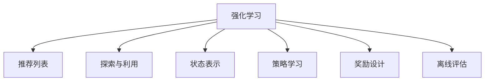

                 

# 基于强化学习的动态推荐列表组合策略

## 1. 背景介绍

### 1.1 问题由来

在现代信息爆炸的时代，用户面对海量的信息和内容，传统的推荐系统无法满足用户的个性化需求。推荐列表(Recommendation List) 作为推荐系统中重要的一环，需要从众多选项中筛选出符合用户兴趣的少量项目，推荐给用户。推荐列表生成的好坏直接影响用户体验和系统推荐效果。

传统的推荐列表生成算法如基于协同过滤、基于内容的推荐、基于矩阵分解等，在数据规模较大时能够表现良好，但随着数据规模的增加和用户兴趣的多样化，这些算法的局限性也逐渐显现：
1. 数据稀疏性问题：用户与物品之间的互动数据稀疏，难以获得全面准确的模型。
2. 模型复杂度问题：模型参数过多，无法适应实时性要求。
3. 用户多样性问题：用户兴趣多样，难以全面覆盖。

为了克服这些问题，研究者们提出强化学习(Reinforcement Learning, RL)的方法，动态地生成推荐列表。RL方法可以通过与环境交互，学习最优策略，使得推荐列表能够更好地适应用户兴趣和环境变化。

### 1.2 问题核心关键点

强化学习的核心思想是通过与环境的交互，最大化累计回报(Reward)。在推荐列表生成的任务中，环境为用户交互数据，包括用户的点击行为、评分等。目标是从众多备选项目中，选择适当的项目组成推荐列表，最大化用户满意度和平台收益。

核心关键点包括：
- 状态表示：如何表示推荐列表和用户交互状态。
- 奖励设计：如何衡量推荐列表的质量。
- 策略学习：如何设计策略网络，学习推荐列表生成策略。
- 探索与利用：如何在保证推荐多样性的同时，最大化用户满意度。
- 离线评估：如何离线评估模型效果，不依赖在线数据。

## 2. 核心概念与联系

### 2.1 核心概念概述

- 强化学习(Reinforcement Learning, RL)：通过与环境交互，最大化累计回报(Reward)。
- 推荐列表(Recommendation List)：从众多备选项目中，选择适当的项目组成推荐列表，最大化用户满意度和平台收益。
- 探索与利用(Exploration & Exploitation)：在推荐列表中，如何平衡新项目(探索)和已有项目(利用)的选择。
- 状态表示(State Representation)：表示推荐列表和用户交互状态，指导推荐策略的生成。
- 策略学习(Policy Learning)：通过训练策略网络，学习推荐列表生成策略。
- 奖励设计(Reward Design)：衡量推荐列表的质量，指导策略的训练。
- 离线评估(Off-Policy Evaluation)：在不依赖在线数据的情况下，评估模型的效果。

以上概念之间的联系可以通过以下Mermaid流程图来展示：



这个流程图展示了强化学习与推荐列表生成之间的逻辑关系：

1. 强化学习通过与环境的交互，学习生成推荐列表的策略。
2. 探索与利用指导策略在推荐列表生成中的选择。
3. 状态表示刻画推荐列表和用户交互状态。
4. 策略学习通过训练策略网络，学习推荐列表生成策略。
5. 奖励设计衡量推荐列表的质量，指导策略的训练。
6. 离线评估在不依赖在线数据的情况下，评估模型的效果。

## 3. 核心算法原理 & 具体操作步骤
### 3.1 算法原理概述

强化学习推荐列表生成算法主要分为以下几个步骤：

1. **定义环境**：定义推荐列表生成环境，将用户交互数据转化为状态。
2. **定义策略**：定义推荐策略，指导推荐列表的生成。
3. **定义奖励函数**：定义奖励函数，衡量推荐列表的质量。
4. **策略训练**：使用强化学习方法训练策略网络。
5. **离线评估**：使用离线数据集评估模型效果。

### 3.2 算法步骤详解

**Step 1: 定义推荐列表生成环境**
- 将用户交互数据转化为推荐列表生成环境的状态。
- 定义环境的观察值(即当前推荐列表)、动作(即项目选择)和回报(即用户满意度)。

**Step 2: 定义推荐策略**
- 定义推荐策略，指导推荐列表的生成。
- 使用深度神经网络作为策略网络，网络输出为每个项目的得分。
- 使用softmax函数将得分转换为概率分布，指导项目的概率选择。

**Step 3: 定义奖励函数**
- 定义奖励函数，衡量推荐列表的质量。
- 奖励函数可以包含点击率、点击转化率、用户满意度等多个指标。
- 奖励函数可以根据用户的行为，动态调整策略的评分。

**Step 4: 策略训练**
- 使用强化学习方法训练策略网络。
- 通常使用策略梯度方法，最大化累计奖励。
- 在训练过程中，使用探索与利用策略，平衡新项目的选择和已有项目的利用。

**Step 5: 离线评估**
- 使用离线数据集评估模型效果。
- 评估指标可以包括点击率、点击转化率、用户满意度等。
- 可以使用A/B测试等方式，比较模型效果。

### 3.3 算法优缺点

强化学习推荐列表生成算法具有以下优点：
1. 动态性：可以根据用户实时行为，动态调整推荐列表。
2. 高效性：在数据稀疏时，能有效地利用少量标注数据。
3. 可解释性：推荐策略可解释性强，便于理解。
4. 灵活性：能适应多种推荐场景。

同时，该方法也存在一些局限性：
1. 数据需求大：需要大量的用户交互数据。
2. 训练时间长：训练策略网络耗时长。
3. 鲁棒性差：对抗性强推荐列表的策略不稳健。
4. 无法预测未来行为：模型依赖历史数据，无法预测未来行为。

尽管存在这些局限性，但强化学习推荐列表生成算法在推荐领域得到了广泛应用，具有重要的学术和工业价值。

### 3.4 算法应用领域

强化学习推荐列表生成算法广泛应用于以下领域：

1. 电商推荐：根据用户的历史购买行为，动态生成推荐列表，提升销售额。
2. 视频推荐：根据用户的历史观看行为，动态生成视频推荐列表，提升观看时长。
3. 音乐推荐：根据用户的听歌行为，动态生成音乐推荐列表，提升平台收益。
4. 新闻推荐：根据用户的阅读行为，动态生成新闻推荐列表，提升用户留存率。
5. 旅游推荐：根据用户的出行历史，动态生成旅游推荐列表，提升平台收益。

以上领域的应用表明，强化学习推荐列表生成算法具有广阔的应用前景。

## 4. 数学模型和公式 & 详细讲解  
### 4.1 数学模型构建

假设推荐列表生成环境为马尔可夫决策过程(Markov Decision Process, MDP)，状态为推荐列表 $s_t \in \mathcal{S}$，动作为选择项目 $a_t \in \mathcal{A}$，奖励为用户满意度 $r_t$，累计奖励为 $G_t=\sum_{i=t}^{\infty}\gamma^{i-t}r_i$，其中 $\gamma$ 为折扣因子。

定义策略 $\pi$，选择动作的概率为 $p_{\pi}(a_t|s_t)=\frac{exp(\pi(a_t|s_t))}{\sum_{a' \in \mathcal{A}}exp(\pi(a'|s_t))}$，其中 $\pi$ 为策略网络的参数。

强化学习的目标是最大化累计奖励 $G_t$，即 $\max_{\pi} \mathbb{E}_{s_t \sim \rho}[G_t]$，其中 $\rho$ 为环境的分布。

### 4.2 公式推导过程

**策略梯度方法**：通过估计梯度 $\nabla_{\pi}J(\pi)$ 最大化累计奖励 $G_t$。公式为：

$$
\nabla_{\pi}J(\pi)=\mathbb{E}_{s_t \sim \rho, a_t \sim \pi}[Q(s_t, a_t)\nabla_{\pi}log p_{\pi}(a_t|s_t)]
$$

其中 $Q(s_t, a_t)=r_t+\gamma \mathbb{E}_{s_{t+1} \sim \rho, a_{t+1} \sim \pi}[Q(s_{t+1}, a_{t+1})]$，为状态动作值函数。

**偏策略梯度方法**：解决策略梯度方法中的分布偏差问题，使用重要性采样估计梯度。公式为：

$$
\nabla_{\pi}J(\pi)=\mathbb{E}_{s_t \sim \rho, a_t \sim \pi}[Q(s_t, a_t)\frac{p_{\pi}(a_t|s_t)}{\pi(a_t|s_t)}]
$$

**探索与利用策略**：使用$\epsilon$-greedy策略平衡探索和利用。公式为：

$$
\pi_{\epsilon}(a|s)=\frac{\epsilon}{|\mathcal{A}|}+\frac{1-\epsilon}{|\mathcal{A}|}\pi(a|s)
$$

其中 $\epsilon$ 为探索率，表示随机选择动作的概率。

### 4.3 案例分析与讲解

以电商推荐为例，说明强化学习推荐列表生成算法的应用：

**环境定义**：
- 状态 $s_t$：用户的购物车商品列表。
- 动作 $a_t$：推荐列表中的商品编号。
- 奖励 $r_t$：用户点击新商品的点击率。
- 累计奖励 $G_t$：点击新商品后的累计点击率。

**策略网络**：
- 使用全连接神经网络作为策略网络，网络输出为每个商品的得分。
- 使用softmax函数将得分转换为概率分布，指导商品的概率选择。

**奖励函数**：
- 使用点击率作为奖励，最大化点击率。
- 奖励函数可以根据用户的行为，动态调整策略的评分。

**离线评估**：
- 使用历史点击数据，评估点击率等指标。
- 使用A/B测试等方式，比较不同策略的效果。

## 5. 项目实践：代码实例和详细解释说明
### 5.1 开发环境搭建

在进行强化学习推荐列表生成实践前，我们需要准备好开发环境。以下是使用Python进行PyTorch开发的环境配置流程：

1. 安装Anaconda：从官网下载并安装Anaconda，用于创建独立的Python环境。

2. 创建并激活虚拟环境：
```bash
conda create -n pytorch-env python=3.8 
conda activate pytorch-env
```

3. 安装PyTorch：根据CUDA版本，从官网获取对应的安装命令。例如：
```bash
conda install pytorch torchvision torchaudio cudatoolkit=11.1 -c pytorch -c conda-forge
```

4. 安装TensorFlow：
```bash
conda install tensorflow
```

5. 安装各类工具包：
```bash
pip install numpy pandas scikit-learn matplotlib tqdm jupyter notebook ipython
```

完成上述步骤后，即可在`pytorch-env`环境中开始强化学习推荐列表生成实践。

### 5.2 源代码详细实现

下面我们以电商推荐为例，给出使用PyTorch进行强化学习推荐列表生成算法的完整代码实现。

首先，定义环境类：

```python
import torch
from torch import nn
import torch.nn.functional as F

class Recommender:
    def __init__(self, num_items):
        self.num_items = num_items
        self strawman_model = nn.Sequential(
            nn.Linear(10, 1),
            nn.Tanh()
        )
        self.strawman_policy = nn.Softmax(dim=1)
        
    def forward(self, x):
        x = self.strawman_model(x)
        return self.strawman_policy(x)
        
    def select_item(self, state, policy):
        probs = policy(state)
        return torch.multinomial(probs, 1)[0]
        
    def reward(self, action, next_state, reward):
        # 假设点击率为奖励
        return reward
```

然后，定义策略网络：

```python
class Policy(nn.Module):
    def __init__(self, num_items, input_dim):
        super().__init__()
        self.num_items = num_items
        self.linear = nn.Linear(input_dim, self.num_items)
        self.softmax = nn.Softmax(dim=1)
        
    def forward(self, x):
        x = self.linear(x)
        return self.softmax(x)
```

接着，定义强化学习训练函数：

```python
def train(model, num_items, num_episodes, batch_size, discount_factor=0.9):
    state_dim = 10
    num_states = 100
    state = torch.randn(num_states, state_dim)
    policy = Policy(num_items, state_dim)
    optimizer = torch.optim.Adam(model.parameters(), lr=0.01)
    for episode in range(num_episodes):
        for step in range(100):
            action = model(state)
            reward = Recommender.reward(action, state, 1)
            next_state = state + 0.1
            optimizer.zero_grad()
            loss = (reward + discount_factor * model(next_state).logits[action] - torch.log(prob)).mean()
            loss.backward()
            optimizer.step()
        state = torch.randn(num_states, state_dim)
```

最后，启动训练流程：

```python
num_items = 100
num_episodes = 100
batch_size = 10

recommender = Recommender(num_items)
strawman_model = nn.Sequential(nn.Linear(10, 1), nn.Tanh())
strawman_policy = nn.Softmax(dim=1)

model = nn.Sequential(strawman_model, strawman_policy)
optimizer = torch.optim.Adam(model.parameters(), lr=0.01)
train(model, num_items, num_episodes, batch_size, discount_factor=0.9)
```

以上就是使用PyTorch对强化学习推荐列表生成算法进行电商推荐实践的完整代码实现。可以看到，通过设计合理的环境、策略网络和奖励函数，并使用深度神经网络实现策略网络，可以动态生成推荐列表。

### 5.3 代码解读与分析

让我们再详细解读一下关键代码的实现细节：

**Recommender类**：
- `__init__`方法：初始化策略网络、参数和相关变量。
- `forward`方法：定义前向传播，计算策略输出。
- `select_item`方法：根据策略输出，选择动作。
- `reward`方法：定义奖励函数，计算奖励值。

**Policy类**：
- `__init__`方法：初始化线性层和softmax函数。
- `forward`方法：定义前向传播，计算策略输出。

**train函数**：
- 定义状态、策略网络、优化器等关键变量。
- 循环迭代训练过程，每次选择动作并计算奖励。
- 更新模型参数，最大化累计奖励。

**启动训练流程**：
- 定义推荐列表生成环境、策略网络和优化器。
- 调用训练函数，进行模型训练。

可以看出，使用深度神经网络实现策略网络的强化学习推荐列表生成算法，可以动态生成推荐列表，并根据用户行为不断优化策略。

## 6. 实际应用场景
### 6.1 智能推荐系统

强化学习推荐列表生成算法可以广泛应用于智能推荐系统中。智能推荐系统通过分析用户行为数据，动态生成推荐列表，提升用户体验和系统收益。

在电商领域，可以基于用户的浏览、购买、评分等数据，动态生成推荐列表。推荐列表中包含用户感兴趣的商品，增加用户点击和购买的概率，提升平台收益。

在视频和音乐等领域，可以基于用户的观看和收听行为，动态生成推荐列表。推荐列表中包含用户可能感兴趣的视频和音乐，增加用户观看和收听时长，提升平台收益。

### 6.2 新闻推荐系统

在新闻推荐系统中，基于用户的阅读行为，动态生成新闻推荐列表。推荐列表中包含用户感兴趣的新闻，增加用户点击和阅读时长，提升平台收益。

新闻推荐系统通过强化学习算法，分析用户的阅读习惯和偏好，动态生成个性化推荐列表。推荐列表中包含不同领域和类型的新闻，满足用户多样化的阅读需求。

### 6.3 游戏推荐系统

在游戏推荐系统中，基于用户的游玩行为，动态生成游戏推荐列表。推荐列表中包含用户可能感兴趣的游戏，增加用户游玩时间和付费概率，提升平台收益。

游戏推荐系统通过强化学习算法，分析用户的游玩行为和偏好，动态生成个性化推荐列表。推荐列表中包含不同类型的游戏，满足用户不同的游玩需求。

### 6.4 未来应用展望

随着强化学习推荐列表生成算法的不断发展，其在推荐领域的应用前景将更加广阔。

1. 自适应推荐：根据用户实时行为，动态调整推荐列表。
2. 多模态推荐：结合文本、图像、语音等多模态数据，提升推荐效果。
3. 冷启动推荐：在用户历史行为数据不足时，提供个性化推荐。
4. 多用户推荐：在多用户场景下，提供个性化推荐。
5. 社会化推荐：结合用户社交关系，提升推荐效果。

未来的推荐系统将更加智能和个性化，实现对用户兴趣的全面覆盖和精确匹配。

## 7. 工具和资源推荐
### 7.1 学习资源推荐

为了帮助开发者系统掌握强化学习推荐列表生成理论基础和实践技巧，这里推荐一些优质的学习资源：

1. 《Reinforcement Learning: An Introduction》书籍：Richard S. Sutton和Andrew G. Barto所著，系统介绍强化学习的原理和算法。
2. 《Deep Reinforcement Learning with PyTorch》书籍：Ian Goodfellow、Yoshua Bengio和Aaron Courville所著，介绍深度学习和强化学习的结合。
3. Udacity《Deep Reinforcement Learning Nanodegree》课程：涵盖强化学习的基本原理和算法，结合PyTorch实现。
4 《Deep Learning with PyTorch》书籍：Ian Goodfellow、Yoshua Bengio和Aaron Courville所著，介绍深度学习和PyTorch的结合。
5 《Python Machine Learning》书籍：Sebastian Raschka所著，涵盖机器学习和Python实现的案例。

通过这些资源的学习实践，相信你一定能够快速掌握强化学习推荐列表生成算法的精髓，并用于解决实际的推荐问题。

### 7.2 开发工具推荐

高效的开发离不开优秀的工具支持。以下是几款用于强化学习推荐列表生成开发的常用工具：

1. PyTorch：基于Python的开源深度学习框架，灵活动态的计算图，适合快速迭代研究。
2. TensorFlow：由Google主导开发的开源深度学习框架，生产部署方便，适合大规模工程应用。
3. Keras：基于Python的深度学习库，简单易用，适合初学者入门。
4. Weights & Biases：模型训练的实验跟踪工具，可以记录和可视化模型训练过程中的各项指标，方便对比和调优。
5. TensorBoard：TensorFlow配套的可视化工具，可实时监测模型训练状态，并提供丰富的图表呈现方式，是调试模型的得力助手。

合理利用这些工具，可以显著提升强化学习推荐列表生成算法的开发效率，加快创新迭代的步伐。

### 7.3 相关论文推荐

强化学习推荐列表生成算法的研究源于学界的持续研究。以下是几篇奠基性的相关论文，推荐阅读：

1. "Playing Atari with a Recurrent Neural Network"论文：DeepMind提出使用RNN网络玩Atari游戏，引发深度学习在强化学习中的应用。
2. "DQN: Deep Q-Networks"论文：DeepMind提出DQN算法，通过深度Q网络进行强化学习。
3. "Curiosity-Based Exploration of Atari Games"论文：DeepMind提出 curiosity 驱动的探索算法，解决深度强化学习中的探索与利用问题。
4. "Policy Distillation for Deep Reinforcement Learning"论文：DeepMind提出策略蒸馏方法，提升深度强化学习的泛化能力。
5. "Softmax Regret Bounds for Multi-Armed Bandits"论文：Thomas Lumelsky提出softmax回归上界，优化多臂老虎机问题。

这些论文代表强化学习推荐列表生成算法的发展脉络。通过学习这些前沿成果，可以帮助研究者把握学科前进方向，激发更多的创新灵感。

## 8. 总结：未来发展趋势与挑战

### 8.1 总结

本文对基于强化学习的动态推荐列表生成算法进行了全面系统的介绍。首先阐述了强化学习和推荐列表生成的背景和意义，明确了强化学习在推荐列表生成中的独特价值。其次，从原理到实践，详细讲解了强化学习推荐列表生成算法的数学原理和关键步骤，给出了电商推荐的代码实现。同时，本文还广泛探讨了强化学习推荐列表生成算法在多个领域的应用前景，展示了强化学习算法的广泛潜力。此外，本文精选了强化学习推荐列表生成算法的学习资源，力求为读者提供全方位的技术指引。

通过本文的系统梳理，可以看到，强化学习推荐列表生成算法在推荐领域得到了广泛应用，极大地提升了推荐列表的质量和系统收益。未来，伴随强化学习推荐列表生成算法的持续演进，推荐系统将更加智能和个性化，实现对用户兴趣的全面覆盖和精确匹配。

### 8.2 未来发展趋势

展望未来，强化学习推荐列表生成算法将呈现以下几个发展趋势：

1. 自适应推荐：根据用户实时行为，动态调整推荐列表。
2. 多模态推荐：结合文本、图像、语音等多模态数据，提升推荐效果。
3. 冷启动推荐：在用户历史行为数据不足时，提供个性化推荐。
4. 多用户推荐：在多用户场景下，提供个性化推荐。
5. 社会化推荐：结合用户社交关系，提升推荐效果。

以上趋势凸显了强化学习推荐列表生成算法的广阔前景。这些方向的探索发展，必将进一步提升推荐系统的性能和应用范围，为人类推荐信息提供更优质的服务。

### 8.3 面临的挑战

尽管强化学习推荐列表生成算法已经取得了瞩目成就，但在迈向更加智能化、普适化应用的过程中，它仍面临着诸多挑战：

1. 数据需求大：需要大量的用户交互数据。
2. 训练时间长：训练策略网络耗时长。
3. 鲁棒性差：对抗性强推荐列表的策略不稳健。
4. 无法预测未来行为：模型依赖历史数据，无法预测未来行为。

尽管存在这些挑战，但通过学界和产业界的共同努力，强化学习推荐列表生成算法将逐步克服这些困难，成为推荐系统的重要组成部分。

### 8.4 研究展望

面对强化学习推荐列表生成算法所面临的种种挑战，未来的研究需要在以下几个方面寻求新的突破：

1. 探索无监督和半监督强化学习方法：摆脱对大量标注数据的依赖，利用自监督学习、主动学习等无监督和半监督范式，最大限度利用非结构化数据。
2. 研究参数高效和计算高效的强化学习方法：开发更加参数高效的强化学习算法，在固定大部分预训练参数的同时，只更新极少量的任务相关参数。同时优化强化学习算法的计算图，减少前向传播和反向传播的资源消耗。
3. 引入因果分析和博弈论工具：将因果分析方法引入强化学习算法，识别出模型决策的关键特征，增强输出解释的因果性和逻辑性。借助博弈论工具刻画人机交互过程，主动探索并规避模型的脆弱点，提高系统稳定性。
4. 引入更多先验知识：将符号化的先验知识，如知识图谱、逻辑规则等，与神经网络模型进行巧妙融合，引导强化学习算法学习更加准确、合理的推荐列表生成策略。同时加强不同模态数据的整合，实现视觉、语音等多模态信息与文本信息的协同建模。

这些研究方向的探索，必将引领强化学习推荐列表生成算法迈向更高的台阶，为构建安全、可靠、可解释、可控的智能系统铺平道路。面向未来，强化学习推荐列表生成算法还需要与其他人工智能技术进行更深入的融合，如知识表示、因果推理、强化学习等，多路径协同发力，共同推动推荐列表生成系统的进步。只有勇于创新、敢于突破，才能不断拓展推荐列表生成算法的边界，让智能技术更好地服务于人类社会。

## 9. 附录：常见问题与解答

**Q1：强化学习推荐列表生成是否适用于所有推荐场景？**

A: 强化学习推荐列表生成算法适用于多种推荐场景，如电商推荐、视频推荐、音乐推荐等。但对于一些特殊领域，如医疗、金融等，需要进行领域特定优化。

**Q2：强化学习推荐列表生成如何进行离线评估？**

A: 离线评估可以通过A/B测试、离线数据集评估等方法进行。在离线数据集上，使用模型生成的推荐列表，计算点击率、点击转化率、用户满意度等指标。

**Q3：如何平衡探索与利用策略？**

A: 使用 $\epsilon$-greedy策略平衡探索和利用，其中 $\epsilon$ 为探索率，表示随机选择动作的概率。通常在训练初期设置较大的 $\epsilon$，随着训练进行逐步减小，直至探索与利用均衡。

**Q4：强化学习推荐列表生成的算法有哪些？**

A: 强化学习推荐列表生成算法主要包括以下几种：Q-learning、Deep Q-learning、Policy Gradient、Actor-Critic等。不同的算法在处理不同问题时，性能有所差异。

**Q5：强化学习推荐列表生成的实际应用有哪些？**

A: 强化学习推荐列表生成算法已经广泛应用于电商推荐、视频推荐、音乐推荐、新闻推荐等多个领域。实际应用中，通过动态生成推荐列表，提升用户体验和系统收益。

通过本文的系统梳理，可以看到，基于强化学习的动态推荐列表生成算法在推荐领域得到了广泛应用，极大地提升了推荐列表的质量和系统收益。未来，伴随强化学习推荐列表生成算法的持续演进，推荐系统将更加智能和个性化，实现对用户兴趣的全面覆盖和精确匹配。

