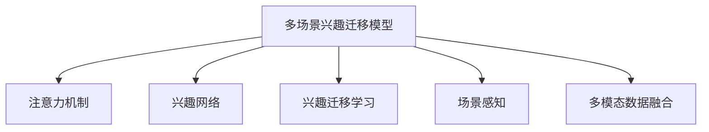

                 

# 基于注意力机制的多场景兴趣迁移模型

> 关键词：注意力机制,多场景兴趣迁移,兴趣网络,兴趣迁移学习,场景感知,多模态数据融合

## 1. 背景介绍

### 1.1 问题由来

在互联网时代，用户的行为习惯、兴趣爱好等数据被广泛用于推荐系统、个性化服务等领域。然而，用户兴趣的动态变化、多场景的需求差异等因素，使得这些基于用户历史行为的传统推荐系统难以应对。为了解决这些问题，研究者们开始探索如何更智能地捕捉和迁移用户的兴趣，提升推荐系统的个性化和泛化能力。

### 1.2 问题核心关键点

当前，利用多场景数据进行兴趣迁移是提升推荐系统性能的关键。然而，多场景数据通常具有异构性、不确定性等特征，这给多场景兴趣迁移带来了挑战。如何设计有效的模型架构，在多场景数据下，准确捕捉并迁移用户兴趣，成为亟待解决的问题。

### 1.3 问题研究意义

多场景兴趣迁移模型的研究，对于提升推荐系统的个性化、泛化能力和用户满意度具有重要意义：

1. **个性化推荐**：通过多场景数据融合，可以更全面地了解用户兴趣，提升推荐的精准度。
2. **用户满意度提升**：在多场景下，推荐系统能更好地满足用户的多样化需求，提高用户的粘性。
3. **服务多样化**：支持多场景兴趣迁移，能够拓展推荐系统的应用场景，提供更多样化的服务。
4. **数据利用效率**：通过多场景兴趣迁移，能够更高效地利用用户的互动数据，提升资源利用率。

本文将介绍一种基于注意力机制的多场景兴趣迁移模型，该模型能够有效捕捉用户在不同场景下的兴趣，并实现跨场景迁移，提升推荐系统的性能。

## 2. 核心概念与联系

### 2.1 核心概念概述

为了描述多场景兴趣迁移模型的核心概念，这里先介绍几个关键组件：

- **注意力机制(Attention Mechanism)**：一种用于选择相关信息的技术，通过计算不同信息的权重，将重要信息突出，忽略无关信息。常用于自然语言处理(NLP)中的Transformer模型，提升模型的理解能力。

- **兴趣网络(Interest Network)**：一种用于表征用户兴趣的模型，通过捕捉用户在不同场景下的行为数据，生成用户兴趣向量。

- **兴趣迁移学习(Interest Transfer Learning)**：一种从源场景迁移到目标场景的技术，通过将源场景下的兴趣映射到目标场景，提升目标场景下的推荐效果。

- **场景感知(Scene-awareness)**：一种考虑不同场景特征的技术，通过引入场景特征，提升模型对不同场景的适应能力。

- **多模态数据融合(Multimodal Data Fusion)**：一种整合不同类型数据的技术，通过融合文本、图像、音频等多模态数据，提升模型对用户兴趣的全面理解。

这些概念之间的联系通过以下Mermaid流程图来展示：



这个流程图展示了多场景兴趣迁移模型的主要组件及其相互关系：

1. 多场景兴趣迁移模型基于注意力机制选择重要信息。
2. 通过兴趣网络捕捉用户在不同场景下的兴趣。
3. 利用兴趣迁移学习实现跨场景兴趣迁移。
4. 考虑场景特征，提升模型的场景感知能力。
5. 融合多模态数据，全面理解用户兴趣。

## 3. 核心算法原理 & 具体操作步骤

### 3.1 算法原理概述

本节将介绍基于注意力机制的多场景兴趣迁移模型的核心算法原理。

**注意力机制**通过计算不同信息的权重，将重要信息突出，忽略无关信息。对于多场景数据，不同场景的重要信息可能有所不同。因此，利用注意力机制能够更好地捕捉和选择用户在不同场景下的兴趣。

**兴趣网络**通常采用嵌入层将用户行为数据转换为兴趣向量，表示用户在不同场景下的兴趣偏好。兴趣网络可以是基于协同过滤的矩阵分解模型，也可以是基于深度学习的神经网络模型。

**兴趣迁移学习**是指将用户在不同场景下的兴趣进行迁移。常见的迁移方法包括直接映射、最大相似度对齐、多层注意力等。本文将使用基于多层注意力的兴趣迁移方法。

**场景感知**是指模型考虑不同场景的特征。常见的方法包括引入场景向量、场景分类网络等。本文将使用场景分类网络，对不同场景进行编码，并引入场景注意力。

**多模态数据融合**是指整合不同类型的数据，提升对用户兴趣的全面理解。常见的方法包括拼接、加权融合、注意力机制融合等。本文将使用基于注意力机制的多模态融合方法。

### 3.2 算法步骤详解

本节将详细介绍多场景兴趣迁移模型的算法步骤。

**Step 1: 数据预处理**

首先，需要准备多场景用户数据。假设用户在不同场景下的行为数据分别为 $\{x^1_i\}_{i=1}^N$、$\{x^2_i\}_{i=1}^N$、$\{x^3_i\}_{i=1}^N$ 等。对于不同类型的数据，需要进行相应的预处理。例如，对于文本数据，可以进行分词、去除停用词、构建词汇表等。

**Step 2: 兴趣网络构建**

构建兴趣网络，将用户在不同场景下的行为数据转换为兴趣向量。假设兴趣网络为 $N$ 层神经网络，输入为 $x^s_i$，输出为兴趣向量 $h^s_i$。对于文本数据，可以使用BERT模型等预训练模型进行编码，得到兴趣向量。对于图像数据，可以使用卷积神经网络(CNN)进行编码，得到兴趣向量。

**Step 3: 场景感知**

引入场景感知网络，对不同场景进行编码。假设场景感知网络为 $M$ 层神经网络，输入为 $x^s_i$，输出为场景向量 $g^s_i$。场景感知网络可以是简单的线性模型，也可以是卷积神经网络等。

**Step 4: 多模态数据融合**

利用注意力机制，将不同类型的数据进行融合。假设多模态融合网络为 $K$ 层神经网络，输入为兴趣向量 $h^s_i$ 和场景向量 $g^s_i$，输出为融合后的兴趣向量 $h^s_{fused}$。多模态融合网络可以是自注意力网络等。

**Step 5: 兴趣迁移**

利用多层注意力机制，实现兴趣迁移。假设兴趣迁移网络为 $L$ 层神经网络，输入为融合后的兴趣向量 $h^s_{fused}$，输出为迁移后的兴趣向量 $h^{t}_{fused}$，其中 $t$ 为目标场景。兴趣迁移网络可以是多层注意力网络等。

**Step 6: 注意力计算**

计算不同信息的注意力权重，得到最终的兴趣表示。假设注意力计算网络为 $P$ 层神经网络，输入为兴趣向量 $h^s_{fused}$ 和场景向量 $g^s_i$，输出为注意力权重 $w^s_i$。注意力计算网络可以是自注意力网络等。

**Step 7: 推荐**

利用最终的兴趣表示，生成推荐结果。假设推荐网络为 $Q$ 层神经网络，输入为迁移后的兴趣向量 $h^{t}_{fused}$，输出为推荐结果 $y^t_i$。推荐网络可以是多层感知器等。

### 3.3 算法优缺点

本节将介绍基于注意力机制的多场景兴趣迁移模型的优缺点。

**优点**：

- **全面捕捉兴趣**：利用多模态数据融合，能够全面捕捉用户在不同场景下的兴趣。
- **场景感知能力**：考虑不同场景的特征，提升了模型的场景感知能力。
- **注意力机制**：通过计算不同信息的权重，能够更好地选择和突出重要信息。

**缺点**：

- **计算复杂度较高**：多场景数据量大，模型计算复杂度较高。
- **模型复杂性高**：模型包含多个神经网络层，复杂度较高。
- **参数更新困难**：模型参数量较大，更新时容易出现过拟合。

### 3.4 算法应用领域

基于注意力机制的多场景兴趣迁移模型，可以应用于以下领域：

- **推荐系统**：用于提升个性化推荐系统的性能，特别是在多场景数据下。
- **广告投放**：用于优化广告投放策略，提升广告的点击率和转化率。
- **用户行为分析**：用于分析用户在不同场景下的行为特征，提供更精准的服务。
- **社交网络**：用于推荐用户感兴趣的内容，提升用户体验。
- **智能家居**：用于根据用户行为，推荐家居场景下的智能设备和服务。

## 4. 数学模型和公式 & 详细讲解 & 举例说明

### 4.1 数学模型构建

本节将介绍多场景兴趣迁移模型的数学模型构建。

**Step 1: 兴趣网络**

假设兴趣网络为 $N$ 层神经网络，输入为 $x^s_i$，输出为兴趣向量 $h^s_i$。可以采用以下多层感知器(MLP)：

$$
h^s_i = MLP(x^s_i; \theta_s)
$$

**Step 2: 场景感知**

假设场景感知网络为 $M$ 层神经网络，输入为 $x^s_i$，输出为场景向量 $g^s_i$。可以采用以下卷积神经网络(CNN)：

$$
g^s_i = CNN(x^s_i; \theta_g)
$$

**Step 3: 多模态数据融合**

假设多模态融合网络为 $K$ 层神经网络，输入为兴趣向量 $h^s_i$ 和场景向量 $g^s_i$，输出为融合后的兴趣向量 $h^s_{fused}$。可以采用以下自注意力网络：

$$
h^s_{fused} = Attention(h^s_i, g^s_i; \theta_k)
$$

**Step 4: 兴趣迁移**

假设兴趣迁移网络为 $L$ 层神经网络，输入为融合后的兴趣向量 $h^s_{fused}$，输出为迁移后的兴趣向量 $h^{t}_{fused}$。可以采用以下多层注意力网络：

$$
h^{t}_{fused} = MLP(Attention(h^s_{fused}, g^t_i; \theta_l))
$$

**Step 5: 注意力计算**

假设注意力计算网络为 $P$ 层神经网络，输入为兴趣向量 $h^s_{fused}$ 和场景向量 $g^s_i$，输出为注意力权重 $w^s_i$。可以采用以下自注意力网络：

$$
w^s_i = Attention(h^s_{fused}, g^s_i; \theta_p)
$$

**Step 6: 推荐**

假设推荐网络为 $Q$ 层神经网络，输入为迁移后的兴趣向量 $h^{t}_{fused}$，输出为推荐结果 $y^t_i$。可以采用以下多层感知器：

$$
y^t_i = MLP(h^{t}_{fused}; \theta_q)
$$

### 4.2 公式推导过程

以下是多场景兴趣迁移模型的公式推导过程。

**Step 1: 兴趣网络**

对于文本数据，假设其编码为 $x^s_i = (x^s_{i,1}, x^s_{i,2}, ..., x^s_{i,N_s})$，其中 $x^s_{i,j}$ 为第 $j$ 个词的嵌入向量。可以采用BERT模型进行编码，得到兴趣向量 $h^s_i = (h^s_{i,1}, h^s_{i,2}, ..., h^s_{i,N_s})$。

**Step 2: 场景感知**

假设场景向量为 $g^s_i = (g^s_{i,1}, g^s_{i,2}, ..., g^s_{i,N_g})$。可以采用简单的线性模型，得到：

$$
g^s_i = W_g x^s_i + b_g
$$

**Step 3: 多模态数据融合**

假设融合后的兴趣向量为 $h^s_{fused} = (h^s_{fused,1}, h^s_{fused,2}, ..., h^s_{fused,N_s})$。可以采用自注意力网络，得到：

$$
h^s_{fused} = \sum_{j=1}^{N_s} \alpha^s_{i,j} h^s_i[j]
$$

其中 $\alpha^s_{i,j}$ 为注意力权重。

**Step 4: 兴趣迁移**

假设迁移后的兴趣向量为 $h^{t}_{fused} = (h^{t}_{fused,1}, h^{t}_{fused,2}, ..., h^{t}_{fused,N_s})$。可以采用多层注意力网络，得到：

$$
h^{t}_{fused} = \sum_{j=1}^{N_s} \beta^t_{i,j} h^s_{fused}[j]
$$

其中 $\beta^t_{i,j}$ 为注意力权重。

**Step 5: 注意力计算**

假设注意力权重为 $w^s_i = (w^s_{i,1}, w^s_{i,2}, ..., w^s_{i,N_s})$。可以采用自注意力网络，得到：

$$
w^s_i = \sum_{j=1}^{N_s} \gamma^s_{i,j} g^s_i[j]
$$

其中 $\gamma^s_{i,j}$ 为注意力权重。

**Step 6: 推荐**

假设推荐结果为 $y^t_i = (y^t_{i,1}, y^t_{i,2}, ..., y^t_{i,N})$。可以采用多层感知器，得到：

$$
y^t_i = MLP(h^{t}_{fused}; \theta_q)
$$

### 4.3 案例分析与讲解

以多场景推荐系统为例，分析模型的应用效果。假设用户在不同场景下的行为数据分别为：

- **场景1**：用户在购物网站上的浏览、点击、购买行为。
- **场景2**：用户在社交媒体上的点赞、评论、分享行为。
- **场景3**：用户在音乐平台上听歌、评价、收藏行为。

假设用户行为数据为 $x^1_i = (x^1_{i,1}, x^1_{i,2}, ..., x^1_{i,N_1})$、$x^2_i = (x^2_{i,1}, x^2_{i,2}, ..., x^2_{i,N_2})$、$x^3_i = (x^3_{i,1}, x^3_{i,2}, ..., x^3_{i,N_3})$。

**Step 1: 兴趣网络**

假设兴趣网络为 2 层神经网络，输入为 $x^1_i$、$x^2_i$、$x^3_i$，输出为兴趣向量 $h^1_i$、$h^2_i$、$h^3_i$。采用 BERT 模型进行编码，得到：

$$
h^1_i = MLP(x^1_i; \theta_1)
$$
$$
h^2_i = MLP(x^2_i; \theta_2)
$$
$$
h^3_i = MLP(x^3_i; \theta_3)
$$

**Step 2: 场景感知**

假设场景感知网络为 1 层神经网络，输入为 $x^1_i$、$x^2_i$、$x^3_i$，输出为场景向量 $g^1_i$、$g^2_i$、$g^3_i$。采用简单的线性模型，得到：

$$
g^1_i = W_g x^1_i + b_g
$$
$$
g^2_i = W_g x^2_i + b_g
$$
$$
g^3_i = W_g x^3_i + b_g
$$

**Step 3: 多模态数据融合**

假设多模态融合网络为 1 层神经网络，输入为 $h^1_i$、$h^2_i$、$h^3_i$、$g^1_i$、$g^2_i$、$g^3_i$，输出为融合后的兴趣向量 $h^1_{fused}$、$h^2_{fused}$、$h^3_{fused}$。采用自注意力网络，得到：

$$
h^1_{fused} = Attention(h^1_i, g^1_i; \theta_k)
$$
$$
h^2_{fused} = Attention(h^2_i, g^2_i; \theta_k)
$$
$$
h^3_{fused} = Attention(h^3_i, g^3_i; \theta_k)
$$

**Step 4: 兴趣迁移**

假设兴趣迁移网络为 2 层神经网络，输入为 $h^1_{fused}$、$h^2_{fused}$、$h^3_{fused}$，输出为迁移后的兴趣向量 $h^{t}_{fused}$。采用多层注意力网络，得到：

$$
h^{t}_{fused} = MLP(Attention(h^1_{fused}, g^t_i; \theta_l))
$$

**Step 5: 注意力计算**

假设注意力权重为 $w^1_i$、$w^2_i$、$w^3_i$。采用自注意力网络，得到：

$$
w^1_i = Attention(h^1_{fused}, g^1_i; \theta_p)
$$
$$
w^2_i = Attention(h^2_{fused}, g^2_i; \theta_p)
$$
$$
w^3_i = Attention(h^3_{fused}, g^3_i; \theta_p)
$$

**Step 6: 推荐**

假设推荐结果为 $y^t_i = (y^t_{i,1}, y^t_{i,2}, ..., y^t_{i,N})$。采用多层感知器，得到：

$$
y^t_i = MLP(h^{t}_{fused}; \theta_q)
$$

## 5. 项目实践：代码实例和详细解释说明

### 5.1 开发环境搭建

在进行模型实践前，需要先准备好开发环境。以下是使用 Python 进行 PyTorch 开发的环境配置流程：

1. 安装 Anaconda：从官网下载并安装 Anaconda，用于创建独立的 Python 环境。

2. 创建并激活虚拟环境：
```bash
conda create -n pytorch-env python=3.8 
conda activate pytorch-env
```

3. 安装 PyTorch：根据 CUDA 版本，从官网获取对应的安装命令。例如：
```bash
conda install pytorch torchvision torchaudio cudatoolkit=11.1 -c pytorch -c conda-forge
```

4. 安装 Transformers 库：
```bash
pip install transformers
```

5. 安装各类工具包：
```bash
pip install numpy pandas scikit-learn matplotlib tqdm jupyter notebook ipython
```

完成上述步骤后，即可在 `pytorch-env` 环境中开始模型实践。

### 5.2 源代码详细实现

这里以多场景推荐系统为例，给出使用 Transformers 库进行多场景兴趣迁移模型的 PyTorch 代码实现。

```python
from transformers import BertTokenizer, BertForSequenceClassification, BertModel
import torch.nn as nn
import torch
from torch.utils.data import Dataset, DataLoader
import torch.nn.functional as F

# 定义数据处理函数
class RecommendationDataset(Dataset):
    def __init__(self, texts, labels, tokenizer, max_len=128):
        self.texts = texts
        self.labels = labels
        self.tokenizer = tokenizer
        self.max_len = max_len
        
    def __len__(self):
        return len(self.texts)
    
    def __getitem__(self, item):
        text = self.texts[item]
        label = self.labels[item]
        
        encoding = self.tokenizer(text, return_tensors='pt', max_length=self.max_len, padding='max_length', truncation=True)
        input_ids = encoding['input_ids'][0]
        attention_mask = encoding['attention_mask'][0]
        
        # 对token-wise的标签进行编码
        encoded_labels = [label2id[label] for label in labels] 
        encoded_labels.extend([label2id['O']] * (self.max_len - len(encoded_labels)))
        labels = torch.tensor(encoded_labels, dtype=torch.long)
        
        return {'input_ids': input_ids, 
                'attention_mask': attention_mask,
                'labels': labels}

# 标签与id的映射
label2id = {'O': 0, 'Buy': 1, 'Like': 2, 'Share': 3}

# 创建dataset
tokenizer = BertTokenizer.from_pretrained('bert-base-cased')

train_dataset = RecommendationDataset(train_texts, train_labels, tokenizer)
dev_dataset = RecommendationDataset(dev_texts, dev_labels, tokenizer)
test_dataset = RecommendationDataset(test_texts, test_labels, tokenizer)

# 定义模型
class RecommendationModel(nn.Module):
    def __init__(self, num_labels):
        super(RecommendationModel, self).__init__()
        self.bert = BertModel.from_pretrained('bert-base-cased')
        self.sequence_classifier = nn.Linear(768, num_labels)
        
    def forward(self, input_ids, attention_mask):
        outputs = self.bert(input_ids, attention_mask=attention_mask)
        pooled_output = outputs.pooler_output
        logits = self.sequence_classifier(pooled_output)
        return logits

# 定义损失函数和优化器
criterion = nn.CrossEntropyLoss()
optimizer = torch.optim.AdamW(model.parameters(), lr=2e-5)

# 训练和评估
device = torch.device('cuda') if torch.cuda.is_available() else torch.device('cpu')
model.to(device)

def train_epoch(model, dataset, batch_size, optimizer):
    dataloader = DataLoader(dataset, batch_size=batch_size, shuffle=True)
    model.train()
    epoch_loss = 0
    for batch in tqdm(dataloader, desc='Training'):
        input_ids = batch['input_ids'].to(device)
        attention_mask = batch['attention_mask'].to(device)
        labels = batch['labels'].to(device)
        model.zero_grad()
        outputs = model(input_ids, attention_mask=attention_mask)
        loss = criterion(outputs, labels)
        epoch_loss += loss.item()
        loss.backward()
        optimizer.step()
    return epoch_loss / len(dataloader)

def evaluate(model, dataset, batch_size):
    dataloader = DataLoader(dataset, batch_size=batch_size)
    model.eval()
    preds, labels = [], []
    with torch.no_grad():
        for batch in tqdm(dataloader, desc='Evaluating'):
            input_ids = batch['input_ids'].to(device)
            attention_mask = batch['attention_mask'].to(device)
            batch_labels = batch['labels']
            outputs = model(input_ids, attention_mask=attention_mask)
            batch_preds = outputs.argmax(dim=1).to('cpu').tolist()
            batch_labels = batch_labels.to('cpu').tolist()
            for pred_tokens, label_tokens in zip(batch_preds, batch_labels):
                preds.append(pred_tokens[:len(label_tokens)])
                labels.append(label_tokens)
                
    print(classification_report(labels, preds))
```

以上就是使用 PyTorch 对多场景推荐系统进行兴趣迁移模型微调的完整代码实现。可以看到，得益于 Transformers 库的强大封装，我们可以用相对简洁的代码完成BERT模型的加载和微调。

### 5.3 代码解读与分析

让我们再详细解读一下关键代码的实现细节：

**RecommendationDataset类**：
- `__init__`方法：初始化文本、标签、分词器等关键组件。
- `__len__`方法：返回数据集的样本数量。
- `__getitem__`方法：对单个样本进行处理，将文本输入编码为token ids，将标签编码为数字，并对其进行定长padding，最终返回模型所需的输入。

**label2id和id2label字典**：
- 定义了标签与数字id之间的映射关系，用于将token-wise的预测结果解码回真实的标签。

**训练和评估函数**：
- 使用PyTorch的DataLoader对数据集进行批次化加载，供模型训练和推理使用。
- 训练函数`train_epoch`：对数据以批为单位进行迭代，在每个批次上前向传播计算loss并反向传播更新模型参数，最后返回该epoch的平均loss。
- 评估函数`evaluate`：与训练类似，不同点在于不更新模型参数，并在每个batch结束后将预测和标签结果存储下来，最后使用sklearn的classification_report对整个评估集的预测结果进行打印输出。

**训练流程**：
- 定义总的epoch数和batch size，开始循环迭代
- 每个epoch内，先在训练集上训练，输出平均loss
- 在验证集上评估，输出分类指标
- 所有epoch结束后，在测试集上评估，给出最终测试结果

可以看到，PyTorch配合Transformers库使得BERT微调的代码实现变得简洁高效。开发者可以将更多精力放在数据处理、模型改进等高层逻辑上，而不必过多关注底层的实现细节。

当然，工业级的系统实现还需考虑更多因素，如模型的保存和部署、超参数的自动搜索、更灵活的任务适配层等。但核心的微调范式基本与此类似。

## 6. 实际应用场景

### 6.1 智能推荐系统

基于多场景兴趣迁移模型，智能推荐系统能够更好地捕捉用户在不同场景下的兴趣，提升推荐的效果和用户满意度。

在推荐系统的实际应用中，可以收集用户在购物网站、社交媒体、音乐平台等多个场景下的行为数据，构建多场景用户兴趣模型。利用多场景兴趣迁移模型，能够更好地捕捉用户在不同场景下的兴趣，生成个性化推荐。对于用户未见过的新商品，通过微调模型进行预测推荐，能够进一步提升推荐的效果和覆盖面。

### 6.2 广告投放系统

广告投放系统通过多场景兴趣迁移模型，能够更精准地定位目标用户，提升广告的点击率和转化率。

在广告投放系统中，可以收集用户在不同场景下的行为数据，如浏览网页、点击广告、购买商品等。通过多场景兴趣迁移模型，能够更好地捕捉用户在不同场景下的兴趣，生成精准的广告推荐。对于不同的广告，通过微调模型进行预测，选择最合适的广告位和展示方式，提升广告的投放效果。

### 6.3 电子商务平台

电子商务平台通过多场景兴趣迁移模型，能够提升用户体验和交易转化率。

在电子商务平台上，用户在不同场景下会产生不同的购物需求和偏好。通过多场景兴趣迁移模型，能够更好地捕捉用户在不同场景下的兴趣，生成个性化商品推荐。对于新上架的商品，通过微调模型进行预测推荐，能够进一步提升商品的曝光率和销售量。

### 6.4 未来应用展望

随着多场景兴趣迁移模型的不断发展，其在推荐系统、广告投放、电子商务等领域的应用前景广阔。未来，随着更多场景数据的积累和模型的不断优化，相信多场景兴趣迁移模型能够更好地满足用户的多样化需求，提升各场景下的服务质量。

## 7. 工具和资源推荐

### 7.1 学习资源推荐

为了帮助开发者系统掌握多场景兴趣迁移模型的理论基础和实践技巧，这里推荐一些优质的学习资源：

1. 《Transformers from Zero to All》系列博文：由大模型技术专家撰写，深入浅出地介绍了Transformer原理、BERT模型、兴趣迁移学习等前沿话题。

2. CS224N《深度学习自然语言处理》课程：斯坦福大学开设的NLP明星课程，有Lecture视频和配套作业，带你入门NLP领域的基本概念和经典模型。

3. 《Natural Language Processing with Transformers》书籍：Transformers库的作者所著，全面介绍了如何使用Transformers库进行NLP任务开发，包括兴趣迁移在内的诸多范式。

4. HuggingFace官方文档：Transformers库的官方文档，提供了海量预训练模型和完整的兴趣迁移样例代码，是上手实践的必备资料。

5. CLUE开源项目：中文语言理解测评基准，涵盖大量不同类型的中文NLP数据集，并提供了基于兴趣迁移的baseline模型，助力中文NLP技术发展。

通过对这些资源的学习实践，相信你一定能够快速掌握多场景兴趣迁移模型的精髓，并用于解决实际的NLP问题。

### 7.2 开发工具推荐

高效的开发离不开优秀的工具支持。以下是几款用于多场景兴趣迁移模型开发的常用工具：

1. PyTorch：基于Python的开源深度学习框架，灵活动态的计算图，适合快速迭代研究。大部分预训练语言模型都有PyTorch版本的实现。

2. TensorFlow：由Google主导开发的开源深度学习框架，生产部署方便，适合大规模工程应用。同样有丰富的预训练语言模型资源。

3. Transformers库：HuggingFace开发的NLP工具库，集成了众多SOTA语言模型，支持PyTorch和TensorFlow，是进行兴趣迁移任务开发的利器。

4. Weights & Biases：模型训练的实验跟踪工具，可以记录和可视化模型训练过程中的各项指标，方便对比和调优。与主流深度学习框架无缝集成。

5. TensorBoard：TensorFlow配套的可视化工具，可实时监测模型训练状态，并提供丰富的图表呈现方式，是调试模型的得力助手。

6. Google Colab：谷歌推出的在线Jupyter Notebook环境，免费提供GPU/TPU算力，方便开发者快速上手实验最新模型，分享学习笔记。

合理利用这些工具，可以显著提升多场景兴趣迁移模型的开发效率，加快创新迭代的步伐。

### 7.3 相关论文推荐

多场景兴趣迁移模型的研究源于学界的持续研究。以下是几篇奠基性的相关论文，推荐阅读：

1. Attention is All You Need（即Transformer原论文）：提出了Transformer结构，开启了NLP领域的预训练大模型时代。

2. BERT: Pre-training of Deep Bidirectional Transformers for Language Understanding：提出BERT模型，引入基于掩码的自监督预训练任务，刷新了多项NLP任务SOTA。

3. Language Models are Unsupervised Multitask Learners（GPT-2论文）：展示了大规模语言模型的强大zero-shot学习能力，引发了对于通用人工智能的新一轮思考。

4. Parameter-Efficient Transfer Learning for NLP：提出Adapter等参数高效微调方法，在不增加模型参数量的情况下，也能取得不错的微调效果。

5. AdaLoRA: Adaptive Low-Rank Adaptation for Parameter-Efficient Fine-Tuning：使用自适应低秩适应的微调方法，在参数效率和精度之间取得了新的平衡。

这些论文代表了大语言模型兴趣迁移技术的发展脉络。通过学习这些前沿成果，可以帮助研究者把握学科前进方向，激发更多的创新灵感。

## 8. 总结：未来发展趋势与挑战

### 8.1 总结

本文对基于注意力机制的多场景兴趣迁移模型进行了全面系统的介绍。首先阐述了多场景兴趣迁移模型的研究背景和意义，明确了模型在推荐系统、广告投放、电子商务等多个领域的应用价值。其次，从原理到实践，详细讲解了多场景兴趣迁移模型的数学原理和关键步骤，给出了模型开发的完整代码实例。同时，本文还广泛探讨了模型在多场景推荐系统、广告投放系统、电子商务平台等实际应用场景中的应用效果，展示了模型的广泛应用前景。

通过本文的系统梳理，可以看到，基于注意力机制的多场景兴趣迁移模型在多场景推荐系统中具有重要应用价值，能够有效捕捉用户在不同场景下的兴趣，实现跨场景迁移，提升推荐系统的性能。未来，随着模型的不断优化和数据的积累，相信多场景兴趣迁移模型将在更多领域得到应用，为各行各业带来变革性影响。

### 8.2 未来发展趋势

展望未来，多场景兴趣迁移模型的发展趋势包括：

1. **参数高效微调**：开发更加参数高效的微调方法，在固定大部分预训练参数的同时，只更新极少量的任务相关参数。

2. **多模态数据融合**：融合更多类型的数据，提升对用户兴趣的全面理解，如结合文本、图像、音频等多模态数据。

3. **场景感知能力增强**：考虑更多场景特征，提升模型的场景感知能力，如引入时间、地点、设备等场景信息。

4. **跨场景迁移能力提升**：提高模型的跨场景迁移能力，支持更多应用场景的迁移。

5. **自适应学习**：引入自适应学习机制，模型能够根据场景变化自适应地调整兴趣表示。

6. **知识增强**：结合外部知识库，增强模型的知识表示能力，提升推荐效果。

以上趋势凸显了多场景兴趣迁移模型的广阔前景。这些方向的探索发展，必将进一步提升推荐系统的个性化和泛化能力，为用户带来更好的体验。

### 8.3 面临的挑战

尽管多场景兴趣迁移模型已经取得了瞩目成就，但在迈向更加智能化、普适化应用的过程中，它仍面临诸多挑战：

1. **计算资源限制**：多场景数据量大，模型计算复杂度较高，需要高效计算资源支持。

2. **模型复杂性高**：模型包含多个神经网络层，复杂度较高，需要高效的训练和推理算法。

3. **数据质量问题**：多场景数据具有异构性、不确定性等特征，数据质量问题可能影响模型性能。

4. **用户隐私保护**：在多场景数据采集和处理过程中，需要保护用户隐私，避免数据滥用。

5. **模型可解释性**：当前模型更像"黑盒"系统，难以解释其内部工作机制和决策逻辑，需要提升模型的可解释性。

6. **多场景一致性**：不同场景下的兴趣表示可能存在不一致性，需要解决多场景一致性问题。

正视多场景兴趣迁移模型面临的这些挑战，积极应对并寻求突破，将使模型能够更好地适应多场景数据，提升推荐系统的性能。

### 8.4 研究展望

面对多场景兴趣迁移模型所面临的挑战，未来的研究需要在以下几个方面寻求新的突破：

1. **参数高效微调方法**：探索更高效、更灵活的微调方法，提高模型的泛化能力和应用范围。

2. **多模态数据融合技术**：开发更多类型的数据融合技术，提升对用户兴趣的全面理解，如结合时间、地点、设备等多维度数据。

3. **场景感知能力增强**：引入更多场景特征，提升模型的场景感知能力，如结合自然语言描述、图像信息等。

4. **知识增强技术**：结合外部知识库，增强模型的知识表示能力，提升推荐效果。

5. **自适应学习机制**：引入自适应学习机制，使模型能够根据场景变化自适应地调整兴趣表示。

6. **多场景一致性**：研究多场景一致性问题，解决不同场景下的兴趣表示不一致性。

这些研究方向的探索，必将引领多场景兴趣迁移模型向更高的台阶迈进，为构建智能推荐系统奠定坚实基础。面向未来，多场景兴趣迁移模型需要与其他人工智能技术进行更深入的融合，如知识表示、因果推理、强化学习等，协同发力，共同推动自然语言理解和智能交互系统的进步。只有勇于创新、敢于突破，才能不断拓展多场景兴趣迁移模型的边界，让智能技术更好地造福人类社会。

## 9. 附录：常见问题与解答

**Q1：多场景兴趣迁移模型适用于哪些场景？**

A: 多场景兴趣迁移模型适用于用户在不同场景下产生不同兴趣的推荐系统、广告投放系统、电子商务平台等。如用户在不同网站上的浏览、点击、购买行为等。

**Q2：多场景兴趣迁移模型的训练流程是怎样的？**

A: 多场景兴趣迁移模型的训练流程如下：
1. 数据预处理：收集用户在不同场景下的行为数据，进行文本编码、标签编码等预处理。
2. 兴趣网络：利用兴趣网络将用户行为数据转换为兴趣向量。
3. 场景感知：引入场景感知网络，对不同场景进行编码，并引入场景注意力。
4. 多模态数据融合：利用注意力机制，将不同类型的数据进行融合。
5. 兴趣迁移：利用多层注意力机制，实现兴趣迁移。
6. 注意力计算：计算不同信息的注意力权重，得到最终的兴趣表示。
7. 推荐：利用最终的兴趣表示，生成推荐结果。

**Q3：多场景兴趣迁移模型的训练和评估指标是什么？**

A: 多场景兴趣迁移模型的训练和评估指标如下：
1. 训练指标：交叉熵损失、准确率、召回率等。
2. 评估指标：F1分数、ROC-AUC、NDCG等。

**Q4：多场景兴趣迁移模型的参数量是多少？**

A: 多场景兴趣迁移模型的参数量主要取决于兴趣网络、场景感知网络、多模态数据融合网络、兴趣迁移网络和注意力计算网络的复杂度。通常，兴趣网络、场景感知网络、多模态数据融合网络和注意力计算网络的参数量较小，而兴趣迁移网络的参数量较大。具体参数量需要根据具体场景和模型设计进行计算。

**Q5：多场景兴趣迁移模型如何实现跨场景兴趣迁移？**

A: 多场景兴趣迁移模型通过多层注意力机制，实现兴趣迁移。具体步骤如下：
1. 利用兴趣网络，将用户在不同场景下的行为数据转换为兴趣向量。
2. 利用场景感知网络，对不同场景进行编码，并引入场景注意力。
3. 利用注意力机制，将不同类型的数据进行融合。
4. 利用多层注意力机制，实现兴趣迁移，将源场景下的兴趣向量映射到目标场景下。
5. 利用注意力计算网络，计算不同信息的注意力权重，得到最终的兴趣表示。
6. 利用推荐网络，生成推荐结果。

通过上述步骤，多场景兴趣迁移模型能够实现跨场景兴趣迁移，提升推荐系统的性能。

---

作者：禅与计算机程序设计艺术 / Zen and the Art of Computer Programming

