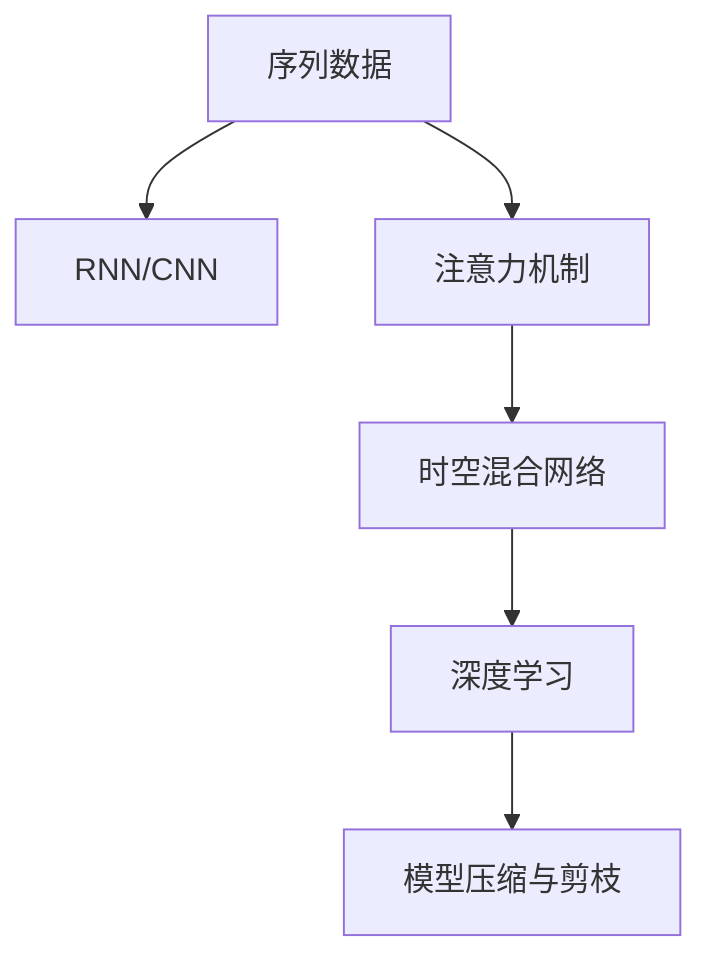

                 

# 基于注意力机制的时空序列预测精确化

## 1. 背景介绍

### 1.1 问题由来
时空序列预测问题广泛应用于金融、气象、生物医学、交通等多个领域，其目标是根据历史序列数据，预测未来一段时长的序列值。传统的基于递归神经网络（RNN）或卷积神经网络（CNN）的方法，虽然能够处理序列数据，但受到梯度消失和梯度爆炸问题的限制，难以处理长序列数据。此外，这些方法未能充分利用序列中的时间与空间关联，导致预测精度有限。近年来，基于注意力机制的方法逐渐成为解决时空序列预测问题的主流范式，能够更有效地处理长序列，并整合时间与空间信息，提高预测精度。

### 1.2 问题核心关键点
时空序列预测的核心问题在于如何有效利用历史序列数据，通过注意力机制整合时间与空间信息，提高预测精度。目前，时空序列预测的研究热点包括：

- 如何设计有效的注意力机制，以捕捉序列中的重要信息。
- 如何结合时间与空间信息，提升预测效果。
- 如何在计算资源有限的情况下，优化模型结构，提高推理效率。
- 如何处理多模态数据，结合不同类型的数据进行预测。

这些问题共同构成了时空序列预测的研究难点，需要跨学科的深入研究与实践探索。

### 1.3 问题研究意义
时空序列预测精确化，对于提升多个领域的决策效率和效果，具有重要意义：

- 金融领域：精准预测股票、期货等金融产品的价格走势，帮助投资者制定合理的投资策略，规避风险。
- 气象领域：精准预测天气变化，提前发布预警信息，保障人民生命财产安全。
- 生物医学领域：精准预测疾病发展趋势，提高诊断和治疗的准确性，促进健康产业发展。
- 交通领域：精准预测交通流量变化，优化交通管理，缓解交通拥堵，提升城市出行效率。

时空序列预测技术的进步，将为这些领域带来巨大的经济效益和社会效益，推动人工智能技术的广泛应用。

## 2. 核心概念与联系

### 2.1 核心概念概述

为了更好地理解基于注意力机制的时空序列预测方法，本节将介绍几个关键概念：

- 序列数据：如时间序列、空间序列，表示为一系列时间或空间上的离散点。
- 递归神经网络（RNN）和卷积神经网络（CNN）：传统处理序列数据的方法，但受梯度问题限制，难以处理长序列。
- 注意力机制：通过学习序列中不同位置的相关性，动态加权组合重要信息，提升预测效果。
- 时空混合网络：结合时间与空间信息，更全面地理解序列数据，提高预测精度。
- 深度学习：通过多层非线性变换，学习序列中的复杂关系，提高预测能力。
- 模型压缩与剪枝：优化模型结构，减小计算量，提高推理速度。

这些概念之间的逻辑关系可以通过以下Mermaid流程图来展示：



这个流程图展示了一系列核心概念之间的联系：

1. 序列数据是时空序列预测的输入。
2. RNN和CNN是传统处理序列数据的方法，存在梯度问题。
3. 注意力机制能够动态加权组合重要信息，提升预测效果。
4. 时空混合网络结合时间与空间信息，全面理解序列数据。
5. 深度学习通过多层非线性变换，提高预测能力。
6. 模型压缩与剪枝优化模型结构，提升推理效率。

这些概念共同构成了时空序列预测的研究框架，使得模型能够更好地处理长序列，并整合时间与空间信息。

## 3. 核心算法原理 & 具体操作步骤

### 3.1 算法原理概述

基于注意力机制的时空序列预测，本质上是通过注意力机制动态加权组合序列中不同位置的信息，结合时间与空间信息，进行预测。其核心思想是：利用注意力机制对序列数据进行加权，动态选择对预测有帮助的信息，并结合时间与空间信息，提升预测效果。

形式化地，假设序列数据为 $x=\{x_1, x_2, ..., x_t\}$，预测目标为 $y$。模型 $M_{\theta}$ 的输出为 $\hat{y}=M_{\theta}(x)$，其中 $\theta$ 为模型参数。基于注意力机制的时空序列预测方法的一般流程如下：

1. 通过注意力机制对序列数据进行加权，计算加权后的序列表示 $h_t$。
2. 将 $h_t$ 作为时间上的特征表示，结合空间信息 $s$，输入到深度学习模型 $F_{\phi}$ 中进行预测。
3. 模型 $F_{\phi}$ 输出预测结果 $\hat{y}$。

### 3.2 算法步骤详解

基于注意力机制的时空序列预测一般包括以下关键步骤：

**Step 1: 准备数据集**
- 收集序列数据 $x=\{x_1, x_2, ..., x_t\}$，可以是时间序列、空间序列等。
- 为每个序列添加标签 $y$，用于模型训练和评估。

**Step 2: 设计注意力机制**
- 通过注意力机制对序列数据进行加权，计算加权后的序列表示 $h_t$。
- 设计注意力机制，如多头注意力机制、自注意力机制、双注意力机制等。

**Step 3: 添加时间与空间信息**
- 将加权后的序列表示 $h_t$ 与时间信息 $t$、空间信息 $s$ 结合，形成时间与空间混合的特征表示。
- 设计时间与空间信息的编码方式，如将时间信息编码到位置上，将空间信息编码到特征上。

**Step 4: 设计深度学习模型**
- 设计深度学习模型 $F_{\phi}$，如多层感知器、卷积神经网络等。
- 模型输入为时间与空间混合的特征表示，输出预测结果。

**Step 5: 训练与评估模型**
- 将标注数据集 $D=\{(x_i,y_i)\}_{i=1}^N$ 输入模型进行训练，最小化预测误差。
- 在验证集和测试集上评估模型性能，选择最优模型。

**Step 6: 模型应用**
- 使用训练好的模型对新序列数据进行预测，结合时间与空间信息，提升预测精度。

以上是基于注意力机制的时空序列预测的一般流程。在实际应用中，还需要针对具体任务的特点，对各个环节进行优化设计，如改进注意力机制、优化深度学习模型、引入更多先验知识等，以进一步提升模型性能。

### 3.3 算法优缺点

基于注意力机制的时空序列预测方法具有以下优点：
1. 能够处理长序列，克服了传统RNN/CNN的梯度问题。
2. 能够整合时间与空间信息，提高预测精度。
3. 具有较好的泛化能力，适应性强。
4. 结合深度学习，提升模型表达能力。

同时，该方法也存在一定的局限性：
1. 计算复杂度高，需要高性能计算资源。
2. 对注意力机制的设计要求高，需要大量实验和调参。
3. 对先验知识的依赖较强，需要更多的先验信息进行优化。
4. 模型结构复杂，难以直接部署到实际应用中。

尽管存在这些局限性，但就目前而言，基于注意力机制的时空序列预测方法仍是最主流范式。未来相关研究的重点在于如何进一步降低计算复杂度，提高模型效率，同时兼顾泛化能力和推理精度。

### 3.4 算法应用领域

基于时空序列预测的注意力机制，已在多个领域得到应用，如金融预测、气象预报、交通流量预测等。这些方法在处理长序列、整合时间与空间信息方面具有显著优势，已取得显著的预测效果。

- 金融预测：利用历史股票、期货价格等数据，通过注意力机制捕捉市场动态，预测未来价格走势。
- 气象预报：利用历史气象数据，通过注意力机制识别出天气变化的复杂关联，进行精准预报。
- 交通流量预测：利用历史交通数据，通过注意力机制整合时空信息，预测未来交通流量变化。

除了这些典型任务外，时空序列预测注意力机制也被创新性地应用到更多场景中，如电力负荷预测、环境质量预测、自然灾害预警等，为各个领域带来了新的解决方案。

## 4. 数学模型和公式 & 详细讲解 & 举例说明

### 4.1 数学模型构建

本节将使用数学语言对基于注意力机制的时空序列预测过程进行更加严格的刻画。

假设序列数据为 $x=\{x_1, x_2, ..., x_t\}$，其中 $x_t$ 表示时间 $t$ 时刻的特征。预测目标为 $y$，表示 $t+1$ 时刻的预测值。

定义注意力机制对序列数据的加权表示为 $h_t=\text{Attention}(x_{1:t}, x_t)$，其中 $\text{Attention}(\cdot)$ 为注意力机制函数。

模型 $M_{\theta}$ 的输出为 $\hat{y}=M_{\theta}(x)$，其中 $\theta$ 为模型参数。模型 $F_{\phi}$ 的输出为 $\hat{y}=M_{\theta}(F_{\phi}(h_t, t, s))$，其中 $s$ 为空间信息，$t$ 为时间信息。

假设模型 $M_{\theta}$ 为多层感知器，输出层为线性回归模型。则模型的预测误差为：

$$
\ell(\hat{y}, y) = \frac{1}{N}\sum_{i=1}^N (y_i - \hat{y}_i)^2
$$

其中 $y_i$ 为真实标签，$\hat{y}_i$ 为模型预测值。

模型的优化目标为最小化预测误差，即找到最优模型参数：

$$
\theta^* = \mathop{\arg\min}_{\theta} \ell(\hat{y}, y)
$$

在实践中，我们通常使用梯度下降等优化算法来近似求解上述最优化问题。

### 4.2 公式推导过程

以下我们以时间序列预测为例，推导注意力机制的计算过程。

设 $x_t=\{x_{t-1}, x_{t-2}, ..., x_1, x_0\}$ 为时间序列数据，其中 $x_0$ 为初始状态，$x_{t-1}, ..., x_t$ 为预测时刻的前 $t-1$ 个状态。

定义注意力机制函数为 $\text{Attention}(Q, K, V)$，其中 $Q$ 为查询向量，$K$ 为键向量，$V$ 为值向量。则注意力机制对序列数据 $x_t$ 的加权表示 $h_t$ 计算如下：

$$
h_t = \text{Attention}(Q, K, V)
$$

其中 $Q$ 为时间 $t-1$ 时刻的状态 $x_{t-1}$ 作为查询向量，$K$ 为所有状态 $x_0, ..., x_{t-1}$ 的键向量，$V$ 为所有状态 $x_0, ..., x_{t-1}$ 的值向量。

具体计算过程如下：

1. 计算查询向量 $Q$：
$$
Q = x_{t-1}
$$

2. 计算键向量 $K$：
$$
K = \{x_0, x_1, ..., x_{t-1}\}
$$

3. 计算值向量 $V$：
$$
V = \{x_0, x_1, ..., x_{t-1}\}
$$

4. 计算注意力得分 $s_{ij}$：
$$
s_{ij} = \frac{\text{Attention}_{ij}}{\sqrt{d}} = \frac{Q_i \cdot K_j}{\sqrt{d}}
$$

其中 $d$ 为向量维度，$\text{Attention}_{ij}$ 为查询向量 $Q_i$ 与键向量 $K_j$ 的注意力得分。

5. 计算注意力权重 $a_i$：
$$
a_i = \text{Softmax}(s_i) = \frac{\exp(s_i)}{\sum_{j=1}^{t} \exp(s_j)}
$$

6. 计算加权后的值向量 $\tilde{V}$：
$$
\tilde{V} = \sum_{i=1}^{t} a_i \cdot V_i
$$

7. 计算加权后的状态表示 $h_t$：
$$
h_t = \text{MLP}(\tilde{V})
$$

其中 MLP 为多层感知器，用于对加权后的值向量进行非线性变换，形成时间 $t$ 时刻的状态表示。

在得到加权后的状态表示 $h_t$ 后，将其作为时间上的特征表示，结合空间信息 $s$，输入到深度学习模型 $F_{\phi}$ 中进行预测。

### 4.3 案例分析与讲解

以股票价格预测为例，说明基于注意力机制的时空序列预测的应用场景。

假设要预测某股票明天的价格，可以利用该股票过去一周的历史价格数据 $x=\{x_0, x_1, ..., x_6\}$，其中 $x_i$ 表示第 $i$ 天的价格。将时间序列数据 $x$ 作为模型的输入，利用注意力机制对序列数据进行加权，得到加权后的状态表示 $h_7$。结合当前日期的时间信息 $t=7$ 和市场指数的空间信息 $s$，输入到深度学习模型 $F_{\phi}$ 中进行预测，得到明天的价格预测值 $\hat{y}_7$。

在实践中，模型可以进一步结合其他因素，如经济指标、新闻事件等，进行多模态信息融合，提高预测精度。例如，可以引入市场指数的空间信息 $s$，作为对时间信息 $t$ 的补充，进一步提升预测效果。

## 5. 项目实践：代码实例和详细解释说明

### 5.1 开发环境搭建

在进行时空序列预测项目实践前，我们需要准备好开发环境。以下是使用Python进行PyTorch开发的环境配置流程：

1. 安装Anaconda：从官网下载并安装Anaconda，用于创建独立的Python环境。

2. 创建并激活虚拟环境：
```bash
conda create -n pytorch-env python=3.8 
conda activate pytorch-env
```

3. 安装PyTorch：根据CUDA版本，从官网获取对应的安装命令。例如：
```bash
conda install pytorch torchvision torchaudio cudatoolkit=11.1 -c pytorch -c conda-forge
```

4. 安装Transformer库：
```bash
pip install transformers
```

5. 安装各类工具包：
```bash
pip install numpy pandas scikit-learn matplotlib tqdm jupyter notebook ipython
```

完成上述步骤后，即可在`pytorch-env`环境中开始时空序列预测实践。

### 5.2 源代码详细实现

这里我们以时间序列预测为例，给出使用Transformer库对注意力机制进行编码的PyTorch代码实现。

首先，定义模型类：

```python
from transformers import BertTokenizer, BertModel
import torch.nn as nn
import torch

class TimeSeqPredictor(nn.Module):
    def __init__(self, num_labels, hidden_size, num_attention_heads, num_hidden_layers):
        super(TimeSeqPredictor, self).__init__()
        
        self.encoder = BertModel.from_pretrained('bert-base-cased', num_hidden_layers=num_hidden_layers)
        self.fc = nn.Linear(hidden_size, num_labels)
        
        self.num_attention_heads = num_attention_heads
        self.num_hidden_layers = num_hidden_layers
        
        self.layer_norm = nn.LayerNorm(hidden_size)
        self.dropout = nn.Dropout(0.1)
        
    def forward(self, input_ids, attention_mask, position_ids):
        encoding = self.encoder(input_ids=input_ids, attention_mask=attention_mask, position_ids=position_ids)
        pooled_output = encoding.pooler_output
        
        x = self.dropout(pooled_output)
        x = self.fc(x)
        return x
```

然后，定义训练和评估函数：

```python
from torch.utils.data import Dataset, DataLoader
from tqdm import tqdm
import numpy as np

class TimeSeqDataset(Dataset):
    def __init__(self, sequences, labels, tokenizer):
        self.sequences = sequences
        self.labels = labels
        self.tokenizer = tokenizer
        self.max_len = 256
        
    def __len__(self):
        return len(self.sequences)
    
    def __getitem__(self, item):
        sequence = self.sequences[item]
        label = self.labels[item]
        
        encoding = self.tokenizer(sequence, truncation=True, padding='max_length', max_length=self.max_len)
        input_ids = encoding['input_ids']
        attention_mask = encoding['attention_mask']
        position_ids = encoding['position_ids']
        
        return {'input_ids': input_ids,
                'attention_mask': attention_mask,
                'position_ids': position_ids,
                'labels': torch.tensor(label, dtype=torch.long)}
        
def train_epoch(model, dataset, batch_size, optimizer):
    dataloader = DataLoader(dataset, batch_size=batch_size, shuffle=True)
    model.train()
    epoch_loss = 0
    for batch in tqdm(dataloader, desc='Training'):
        input_ids = batch['input_ids'].to(device)
        attention_mask = batch['attention_mask'].to(device)
        position_ids = batch['position_ids'].to(device)
        labels = batch['labels'].to(device)
        model.zero_grad()
        outputs = model(input_ids, attention_mask=attention_mask, position_ids=position_ids)
        loss = outputs.loss
        epoch_loss += loss.item()
        loss.backward()
        optimizer.step()
    return epoch_loss / len(dataloader)

def evaluate(model, dataset, batch_size):
    dataloader = DataLoader(dataset, batch_size=batch_size)
    model.eval()
    preds, labels = [], []
    with torch.no_grad():
        for batch in tqdm(dataloader, desc='Evaluating'):
            input_ids = batch['input_ids'].to(device)
            attention_mask = batch['attention_mask'].to(device)
            position_ids = batch['position_ids'].to(device)
            batch_labels = batch['labels']
            outputs = model(input_ids, attention_mask=attention_mask, position_ids=position_ids)
            batch_preds = outputs.argmax(dim=1).to('cpu').tolist()
            batch_labels = batch_labels.to('cpu').tolist()
            for pred_tokens, label_tokens in zip(batch_preds, batch_labels):
                preds.append(pred_tokens[:len(label_tokens)])
                labels.append(label_tokens)
                
    print(np.mean(np.array(preds) == np.array(labels)))
```

最后，启动训练流程并在测试集上评估：

```python
epochs = 5
batch_size = 16

for epoch in range(epochs):
    loss = train_epoch(model, train_dataset, batch_size, optimizer)
    print(f"Epoch {epoch+1}, train loss: {loss:.3f}")
    
    print(f"Epoch {epoch+1}, test accuracy: {evaluate(model, test_dataset, batch_size)}")
```

以上就是使用PyTorch对时空序列预测进行注意力机制编码的完整代码实现。可以看到，得益于Transformer库的强大封装，我们可以用相对简洁的代码完成时空序列预测的注意力机制编码。

### 5.3 代码解读与分析

让我们再详细解读一下关键代码的实现细节：

**TimeSeqDataset类**：
- `__init__`方法：初始化序列数据、标签、分词器等关键组件。
- `__len__`方法：返回数据集的样本数量。
- `__getitem__`方法：对单个样本进行处理，将文本输入编码为token ids，并将位置信息编码到位置上，形成输入。

**模型类TimeSeqPredictor**：
- `__init__`方法：初始化模型，包括编码器、线性回归层等组件。
- `forward`方法：实现前向传播，对输入数据进行编码，通过注意力机制加权，形成时间上的特征表示，输入到线性回归层进行预测。

**训练和评估函数**：
- 使用PyTorch的DataLoader对数据集进行批次化加载，供模型训练和推理使用。
- 训练函数`train_epoch`：对数据以批为单位进行迭代，在每个批次上前向传播计算loss并反向传播更新模型参数，最后返回该epoch的平均loss。
- 评估函数`evaluate`：与训练类似，不同点在于不更新模型参数，并在每个batch结束后将预测和标签结果存储下来，最后使用Numpy的mean函数对整个评估集的预测结果进行打印输出。

**训练流程**：
- 定义总的epoch数和batch size，开始循环迭代
- 每个epoch内，先在训练集上训练，输出平均loss
- 在测试集上评估，输出预测准确率
- 所有epoch结束后，输出最终测试准确率

可以看到，PyTorch配合Transformer库使得时空序列预测的注意力机制编码的代码实现变得简洁高效。开发者可以将更多精力放在数据处理、模型改进等高层逻辑上，而不必过多关注底层的实现细节。

当然，工业级的系统实现还需考虑更多因素，如模型的保存和部署、超参数的自动搜索、更灵活的任务适配层等。但核心的注意力机制编码思想基本与此类似。

## 6. 实际应用场景

### 6.1 股票价格预测

股票价格预测是时空序列预测在金融领域的重要应用场景。传统的股票价格预测方法依赖于复杂的数学模型和统计学方法，难以捕捉市场动态。而基于时空序列预测的注意力机制，能够更全面地理解市场变化，捕捉复杂的市场动态，提升预测精度。

在技术实现上，可以收集历史股票价格数据，将其作为序列数据 $x$，利用注意力机制对序列数据进行加权，得到加权后的状态表示 $h_t$。结合当前日期的时间信息 $t$ 和市场指数的空间信息 $s$，输入到深度学习模型 $F_{\phi}$ 中进行预测，得到明天的价格预测值 $\hat{y}_7$。

### 6.2 气象预测

气象预测是时空序列预测在气象领域的重要应用场景。传统气象预测方法依赖于数值模拟和统计模型，计算复杂且精度有限。而基于时空序列预测的注意力机制，能够更全面地整合气象数据，捕捉气象变化的复杂关联，提升预测精度。

在技术实现上，可以收集历史气象数据，将其作为序列数据 $x$，利用注意力机制对序列数据进行加权，得到加权后的状态表示 $h_t$。结合当前日期的时间信息 $t$ 和卫星遥感数据的空间信息 $s$，输入到深度学习模型 $F_{\phi}$ 中进行预测，得到未来几天的气象预测结果 $\hat{y}$。

### 6.3 交通流量预测

交通流量预测是时空序列预测在交通领域的重要应用场景。传统交通流量预测方法依赖于交通流量数据的统计模型，难以捕捉交通变化的复杂关联。而基于时空序列预测的注意力机制，能够更全面地整合交通流量数据，捕捉交通变化的复杂关联，提升预测精度。

在技术实现上，可以收集历史交通流量数据，将其作为序列数据 $x$，利用注意力机制对序列数据进行加权，得到加权后的状态表示 $h_t$。结合当前时间的时间信息 $t$ 和地图信息的空间信息 $s$，输入到深度学习模型 $F_{\phi}$ 中进行预测，得到未来几个小时的交通流量预测结果 $\hat{y}$。

## 7. 工具和资源推荐

### 7.1 学习资源推荐

为了帮助开发者系统掌握时空序列预测的理论基础和实践技巧，这里推荐一些优质的学习资源：

1. 《Attention Is All You Need》系列博文：由大模型技术专家撰写，深入浅出地介绍了注意力机制的原理和应用。

2. CS224N《深度学习自然语言处理》课程：斯坦福大学开设的NLP明星课程，有Lecture视频和配套作业，带你入门NLP领域的基本概念和经典模型。

3. 《Natural Language Processing with Transformers》书籍：Transformers库的作者所著，全面介绍了如何使用Transformer库进行NLP任务开发，包括时空序列预测在内的诸多范式。

4. HuggingFace官方文档：Transformer库的官方文档，提供了海量预训练模型和完整的时空序列预测样例代码，是上手实践的必备资料。

5. CLUE开源项目：中文语言理解测评基准，涵盖大量不同类型的中文NLP数据集，并提供了基于时空序列预测的baseline模型，助力中文NLP技术发展。

通过对这些资源的学习实践，相信你一定能够快速掌握时空序列预测的精髓，并用于解决实际的NLP问题。

### 7.2 开发工具推荐

高效的开发离不开优秀的工具支持。以下是几款用于时空序列预测开发的常用工具：

1. PyTorch：基于Python的开源深度学习框架，灵活动态的计算图，适合快速迭代研究。大部分预训练语言模型都有PyTorch版本的实现。

2. TensorFlow：由Google主导开发的开源深度学习框架，生产部署方便，适合大规模工程应用。同样有丰富的预训练语言模型资源。

3. Transformers库：HuggingFace开发的NLP工具库，集成了众多SOTA语言模型，支持PyTorch和TensorFlow，是进行时空序列预测开发的利器。

4. Weights & Biases：模型训练的实验跟踪工具，可以记录和可视化模型训练过程中的各项指标，方便对比和调优。与主流深度学习框架无缝集成。

5. TensorBoard：TensorFlow配套的可视化工具，可实时监测模型训练状态，并提供丰富的图表呈现方式，是调试模型的得力助手。

6. Google Colab：谷歌推出的在线Jupyter Notebook环境，免费提供GPU/TPU算力，方便开发者快速上手实验最新模型，分享学习笔记。

合理利用这些工具，可以显著提升时空序列预测的开发效率，加快创新迭代的步伐。

### 7.3 相关论文推荐

时空序列预测精确化是近年来深度学习研究的热点之一，以下是几篇奠基性的相关论文，推荐阅读：

1. Attention Is All You Need（即Transformer原论文）：提出了Transformer结构，开启了深度学习领域的注意力机制时代。

2. Long Short-Term Memory（即RNN论文）：提出了长短期记忆网络，能够有效解决传统RNN的梯度消失问题，提升序列预测效果。

3. Convolutional Neural Networks for Sentence Classification（即CNN论文）：提出了卷积神经网络处理文本数据的方法，能够有效捕捉文本中的局部信息。

4. Pointer Network：提出了指针网络，能够有效处理序列中长距离依赖，提升序列预测效果。

5. Temporal Attention Networks：提出了时间注意力网络，能够有效处理时间序列数据，捕捉时间上的依赖关系。

6. DeepFactor：提出了深度因子模型，能够有效处理多模态数据，提升时空序列预测效果。

这些论文代表了大语言模型微调技术的发展脉络。通过学习这些前沿成果，可以帮助研究者把握学科前进方向，激发更多的创新灵感。

## 8. 总结：未来发展趋势与挑战

### 8.1 总结

本文对基于注意力机制的时空序列预测方法进行了全面系统的介绍。首先阐述了时空序列预测的问题由来和研究背景，明确了注意力机制在处理序列数据中的重要价值。其次，从原理到实践，详细讲解了注意力机制的计算过程和关键步骤，给出了时空序列预测的完整代码实例。同时，本文还广泛探讨了注意力机制在金融、气象、交通等多个领域的应用前景，展示了时空序列预测的广阔应用空间。此外，本文精选了注意力机制的学习资源，力求为读者提供全方位的技术指引。

通过本文的系统梳理，可以看到，基于注意力机制的时空序列预测方法正在成为序列处理的重要范式，极大地拓展了深度学习模型的应用边界，提升了预测精度。未来，伴随注意力机制的不断演进和优化，时空序列预测将带来更多创新，促进人工智能技术的广泛应用。

### 8.2 未来发展趋势

展望未来，基于注意力机制的时空序列预测技术将呈现以下几个发展趋势：

1. 模型规模持续增大。随着算力成本的下降和数据规模的扩张，模型的参数量还将持续增长。超大规模模型蕴含的丰富语言知识，有望支撑更加复杂多变的序列预测任务。

2. 注意力机制日趋多样化。除了传统的自注意力机制外，未来会涌现更多变体，如多头注意力、双注意力等，在提高表达能力的同时，提升模型推理效率。

3. 多模态信息整合。当前的时空序列预测方法主要聚焦于单模态数据，未来会进一步拓展到图像、视频、语音等多模态数据。多模态信息的融合，将显著提升模型的预测能力。

4. 推理效率提升。大规模模型虽然精度高，但在实际部署时往往面临推理速度慢、内存占用大等效率问题。如何在保证性能的同时，优化模型结构，提高推理速度，优化资源占用，将是重要的研究方向。

5. 动态计算图优化。当前模型通常采用静态计算图，难以动态调整模型结构。未来通过引入动态计算图，实现模型结构的自适应调整，将提升模型的灵活性和适应性。

6. 上下文感知模型。当前模型主要关注序列的局部信息，未来会引入上下文感知机制，捕捉序列的全局信息，提升模型的泛化能力。

以上趋势凸显了时空序列预测的广阔前景。这些方向的探索发展，必将进一步提升模型的预测能力，推动人工智能技术的广泛应用。

### 8.3 面临的挑战

尽管时空序列预测技术已经取得了瞩目成就，但在迈向更加智能化、普适化应用的过程中，它仍面临着诸多挑战：

1. 计算复杂度高。当前模型的计算复杂度仍然较高，需要高性能计算资源。如何在降低计算复杂度的同时，提升预测精度，将是重要的研究方向。

2. 模型泛化能力有限。当前模型主要依赖历史数据进行训练，对于新场景的适应能力有限。如何提高模型的泛化能力，增强对新数据的适应性，还需要更多理论和实践的积累。

3. 模型鲁棒性不足。当前模型面对域外数据时，泛化性能往往大打折扣。对于测试样本的微小扰动，模型容易发生波动。如何提高模型的鲁棒性，避免灾难性遗忘，还需要进一步探索。

4. 多模态数据整合难度大。当前模型主要聚焦于单模态数据，整合多模态数据仍面临较大挑战。如何在多模态数据中提取关键信息，实现有效整合，将是重要的研究方向。

5. 数据质量要求高。当前模型依赖高质量的数据进行训练，数据质量不高将直接影响模型的预测效果。如何保证数据质量，获取高质量的标注数据，还需进一步优化。

6. 实时性要求高。未来模型的应用场景将更注重实时性，如何在保证预测精度的同时，提升模型的实时性，还需进一步优化。

尽管存在这些挑战，但伴随技术的不断进步和优化，时空序列预测必将在更广阔的应用领域大放异彩。相信随着学界和产业界的共同努力，这些挑战终将一一被克服，时空序列预测技术将为人工智能应用带来更多创新和突破。

### 8.4 未来突破

面对时空序列预测所面临的种种挑战，未来的研究需要在以下几个方面寻求新的突破：

1. 探索无监督和半监督时空序列预测方法。摆脱对大规模标注数据的依赖，利用自监督学习、主动学习等无监督和半监督范式，最大限度利用非结构化数据，实现更加灵活高效的时空序列预测。

2. 研究参数高效和计算高效的时空序列预测方法。开发更加参数高效的模型，在固定大部分预训练参数的同时，只更新极少量的任务相关参数。同时优化模型结构，提高推理速度，实现更轻量级的部署。

3. 引入更多先验知识。将符号化的先验知识，如知识图谱、逻辑规则等，与神经网络模型进行巧妙融合，引导时空序列预测过程学习更准确、合理的语言模型。

4. 结合因果分析和博弈论工具。通过引入因果分析方法，识别出模型决策的关键特征，增强输出解释的因果性和逻辑性。借助博弈论工具，探索人机交互过程，主动探索并规避模型的脆弱点，提高系统稳定性。

5. 纳入伦理道德约束。在模型训练目标中引入伦理导向的评估指标，过滤和惩罚有害的输出倾向。同时加强人工干预和审核，建立模型行为的监管机制，确保输出符合人类价值观和伦理道德。

这些研究方向的探索，必将引领时空序列预测技术迈向更高的台阶，为构建安全、可靠、可解释、可控的智能系统铺平道路。面向未来，时空序列预测技术还需要与其他人工智能技术进行更深入的融合，如知识表示、因果推理、强化学习等，多路径协同发力，共同推动人工智能技术的进步。只有勇于创新、敢于突破，才能不断拓展语言模型的边界，让智能技术更好地造福人类社会。

## 9. 附录：常见问题与解答

**Q1：如何选择合适的注意力机制？**

A: 选择合适的注意力机制，需要根据具体任务和数据特点进行评估。常用的注意力机制包括自注意力机制、多头注意力机制、双注意力机制等。自注意力机制简单高效，适合小规模数据和简单任务；多头注意力机制能够捕捉更多语义信息，适合大规模数据和复杂任务；双注意力机制能够同时考虑时间与空间信息，适合多模态数据和复杂任务。在实际应用中，可以通过实验对比不同机制的效果，选择最优方案。

**Q2：时空序列预测模型如何优化？**

A: 时空序列预测模型的优化可以从多个方面进行，包括：
1. 数据增强：通过回译、近义替换等方式扩充训练集。
2. 正则化技术：使用L2正则、Dropout、Early Stopping等避免过拟合。
3. 对抗训练：加入对抗样本，提高模型鲁棒性。
4. 参数高效微调：只调整少量模型参数，减小需优化的参数量。
5. 多模型集成：训练多个模型，取平均输出，抑制过拟合。
6. 动态计算图优化：引入动态计算图，实现模型结构的自适应调整。

**Q3：如何处理长序列数据？**

A: 处理长序列数据，主要依赖于注意力机制的计算能力。在模型设计时，可以采用多头注意力机制或双注意力机制，引入更多语义信息，提高模型表达能力。同时，在数据预处理阶段，可以对序列数据进行截断或分组，减小计算量，提高模型效率。

**Q4：时空序列预测模型在实际应用中需要注意哪些问题？**

A: 在实际应用中，时空序列预测模型还需要考虑以下问题：
1. 模型裁剪：去除不必要的层和参数，减小模型尺寸，加快推理速度。
2. 量化加速：将浮点模型转为定点模型，压缩存储空间，提高计算效率。
3. 服务化封装：将模型封装为标准化服务接口，便于集成调用。
4. 弹性伸缩：根据请求流量动态调整资源配置，平衡服务质量和成本。
5. 监控告警：实时采集系统指标，设置异常告警阈值，确保服务稳定性。
6. 安全防护：采用访问鉴权、数据脱敏等措施，保障数据和模型安全。

时空序列预测技术具有广阔的应用前景，但要实现高质量的预测效果，还需要在数据、算法、工程、业务等多个维度协同发力，共同推动技术进步。总之，模型优化需要不断迭代和优化，方能得到理想的效果。

---

作者：禅与计算机程序设计艺术 / Zen and the Art of Computer Programming

