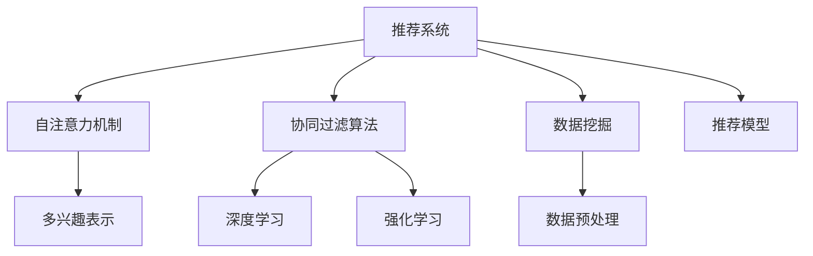

                 

# 基于自注意力机制的多兴趣推荐算法

> 关键词：推荐系统,自注意力,多兴趣,协同过滤,深度学习,强化学习,协同过滤算法

## 1. 背景介绍

### 1.1 问题由来
在现代信息社会中，随着互联网的普及和数字技术的发展，用户的日常活动日益数字化。无论是社交媒体、电商平台，还是在线教育、娱乐平台，用户的行为数据逐渐成为企业宝贵的资产。通过对这些数据的分析挖掘，企业可以更精准地理解用户需求，提供个性化的产品或服务。推荐系统作为实现这一目标的重要工具，已经成为各大互联网平台不可或缺的组成部分。

然而，推荐系统的设计面临着诸多挑战。一方面，用户的多样性和动态性要求推荐系统必须具备高度的个性化和即时性。另一方面，推荐数据的复杂性和稀疏性又导致传统协同过滤算法在处理大规模数据集时效果欠佳。为了应对这些挑战，研究人员开始探索新的推荐算法，其中基于自注意力机制的推荐算法因其高效、灵活的特点，逐渐成为研究热点。

### 1.2 问题核心关键点
基于自注意力机制的推荐算法，通过引入自注意力机制，可以自动捕捉用户和物品之间的关系，学习更加复杂、丰富的用户兴趣表示，从而在个性化推荐中取得显著的效果。其核心思想在于，通过自注意力机制学习用户对不同物品的关注程度，结合传统的协同过滤算法，可以更好地平衡全局性信息和局部性信息，提升推荐质量。

该方法的关键在于如何设计自注意力机制的结构和参数，以及如何将其与协同过滤算法进行有效结合。具体来说，自注意力机制需要学习用户对物品的评分矩阵，从而捕捉不同物品之间的关联关系。而协同过滤算法则可以进一步提升用户兴趣表示的准确性和多样性。

## 2. 核心概念与联系

### 2.1 核心概念概述

为更好地理解基于自注意力机制的多兴趣推荐算法，本节将介绍几个关键概念：

- **推荐系统(Recommendation System)**：旨在预测用户对特定物品的偏好，向用户推荐其感兴趣的产品或服务。推荐系统广泛应用于电商、社交、视频等诸多领域。
- **自注意力机制(Self-Attention Mechanism)**：通过计算输入序列中不同位置的特征向量之间的注意力权重，自动捕捉序列中不同位置特征之间的依赖关系。自注意力机制在自然语言处理中得到了广泛应用，如BERT、Transformer等模型。
- **协同过滤算法(Collaborative Filtering)**：利用用户和物品之间的历史交互数据，通过相似性度量推荐用户可能感兴趣的新物品。协同过滤算法包括基于用户的协同过滤和基于物品的协同过滤。
- **多兴趣表示(Multi-Interest Representation)**：每个用户具有多个潜在兴趣，如购物兴趣、阅读兴趣、旅游兴趣等。多兴趣表示旨在捕捉用户的多种兴趣，从而提供更加个性化和多样化的推荐。
- **深度学习(Deep Learning)**：基于深度神经网络的学习方法，能够自动学习输入数据的复杂表示，广泛应用于图像、语音、文本等处理任务。
- **强化学习(Reinforcement Learning)**：通过智能体与环境的交互，逐步优化行为策略，以最大化长期奖励。强化学习在推荐系统中用于优化推荐策略，提升推荐效果。

这些概念之间的逻辑关系可以通过以下Mermaid流程图来展示：



这个流程图展示了两类推荐算法的逻辑结构：

1. 自注意力机制与协同过滤算法的结合：通过自注意力机制学习用户对不同物品的关注程度，结合传统的协同过滤算法，可以更好地平衡全局性信息和局部性信息，提升推荐质量。
2. 深度学习与强化学习在推荐系统中的应用：深度学习用于特征提取和表示学习，强化学习用于优化推荐策略。

## 3. 核心算法原理 & 具体操作步骤
### 3.1 算法原理概述

基于自注意力机制的多兴趣推荐算法，通过引入自注意力机制，可以自动捕捉用户对不同物品的关注程度，学习更加复杂、丰富的用户兴趣表示。其核心思想在于，通过自注意力机制学习用户对不同物品的评分矩阵，从而捕捉不同物品之间的关联关系。然后，利用协同过滤算法，进一步提升用户兴趣表示的准确性和多样性。

具体来说，算法分为两个主要步骤：

1. 利用自注意力机制学习用户对不同物品的评分矩阵。
2. 结合传统的协同过滤算法，进一步优化用户兴趣表示。

### 3.2 算法步骤详解

**Step 1: 数据预处理和特征提取**

首先，需要对用户-物品交互数据进行预处理，提取用户的特征向量。具体步骤如下：

1. 将用户-物品评分矩阵 $U \in \mathbb{R}^{N \times M}$ 中的每行表示为用户的特征向量 $u_i \in \mathbb{R}^d$。

2. 对物品的特征向量进行归一化处理，得到 $v_j \in \mathbb{R}^d$。

3. 计算用户 $i$ 对物品 $j$ 的评分 $r_{i,j} = u_i^T v_j$。

**Step 2: 自注意力机制的学习**

接下来，利用自注意力机制学习用户对不同物品的评分矩阵 $Q \in \mathbb{R}^{N \times M}$，具体步骤如下：

1. 计算用户对物品的注意力权重矩阵 $A \in \mathbb{R}^{N \times M}$，表示用户对不同物品的关注程度。

2. 通过注意力权重矩阵 $A$ 计算用户对物品的评分矩阵 $Q$，公式如下：

$$
Q = A \times U
$$

其中 $A$ 为注意力权重矩阵，$U$ 为用户特征矩阵。

**Step 3: 协同过滤算法**

然后，结合传统的协同过滤算法，进一步提升用户兴趣表示的准确性和多样性。具体步骤如下：

1. 计算用户对物品的兴趣度 $I_i$，公式如下：

$$
I_i = \alpha \times Q + \beta \times \sum_{k=1}^K \text{softmax}(Q_i) \times V_k
$$

其中，$\alpha$ 和 $\beta$ 为调节系数，$V_k$ 为物品的特征向量。

2. 利用协同过滤算法，计算用户对物品的相似度 $S_j$，公式如下：

$$
S_j = \gamma \times \text{softmax}(Q_j) \times I_j^T
$$

其中，$\gamma$ 为调节系数，$I_j$ 为用户对物品 $j$ 的兴趣度。

3. 计算用户对物品的最终评分 $R_i$，公式如下：

$$
R_i = Q_i \times \text{softmax}(S_i)^T
$$

其中，$S_i$ 为用户对物品 $i$ 的相似度向量。

**Step 4: 推荐结果输出**

最后，将用户的最终评分向量 $R_i$ 作为推荐结果，输出给用户。推荐结果中评分最高的物品即为推荐的物品。

### 3.3 算法优缺点

基于自注意力机制的多兴趣推荐算法，具有以下优点：

1. **高效性**：自注意力机制可以在不需要大量标注数据的情况下，高效学习用户对不同物品的关注程度，提升推荐效果。
2. **灵活性**：自注意力机制可以自动捕捉用户对不同物品的关注程度，学习更加复杂、丰富的用户兴趣表示，提升推荐系统的灵活性和适应性。
3. **泛化能力**：自注意力机制可以学习用户对不同物品的评分矩阵，提升模型对未见过的物品的推荐能力。

同时，该算法也存在以下缺点：

1. **计算复杂度高**：自注意力机制的计算复杂度较高，可能导致算法在大规模数据集上的训练时间较长。
2. **参数量大**：自注意力机制涉及多个可调参数，需要大量的训练数据和计算资源才能取得较好的效果。
3. **易受噪声影响**：自注意力机制对噪声数据的敏感性较高，可能需要额外的数据清洗和预处理步骤。

### 3.4 算法应用领域

基于自注意力机制的多兴趣推荐算法，可以广泛应用于电商、社交、视频等多个领域，具体应用如下：

1. **电商推荐**：电商平台上用户对商品的需求各异，通过自注意力机制学习用户对不同商品的关注程度，可以提供更加个性化和多样化的商品推荐。
2. **社交推荐**：社交平台上用户对内容的多样性需求较高，通过自注意力机制学习用户对不同内容的关注程度，可以提升内容推荐的效果。
3. **视频推荐**：视频平台上的内容种类繁多，用户对不同视频的兴趣也不同，通过自注意力机制学习用户对不同视频的关注程度，可以提升视频推荐的效果。
4. **新闻推荐**：新闻平台上的内容多样性高，用户对不同新闻的关注程度不同，通过自注意力机制学习用户对不同新闻的兴趣度，可以提升新闻推荐的效果。

## 4. 数学模型和公式 & 详细讲解 & 举例说明

### 4.1 数学模型构建

基于自注意力机制的多兴趣推荐算法，涉及多个数学模型和公式。本节将对这些模型和公式进行详细讲解。

记用户特征向量为 $u_i \in \mathbb{R}^d$，物品特征向量为 $v_j \in \mathbb{R}^d$，用户对物品的评分矩阵为 $U \in \mathbb{R}^{N \times M}$，物品的特征向量为 $V_k \in \mathbb{R}^d$。

### 4.2 公式推导过程

**Step 1: 自注意力机制的学习**

首先，利用自注意力机制学习用户对不同物品的评分矩阵 $Q$。具体步骤如下：

1. 计算用户对物品的注意力权重矩阵 $A \in \mathbb{R}^{N \times M}$，表示用户对不同物品的关注程度。

$$
A = \text{softmax}(u_i^T v_j)
$$

其中 $\text{softmax}$ 函数为softmax函数，表示归一化后的注意力权重。

2. 通过注意力权重矩阵 $A$ 计算用户对物品的评分矩阵 $Q$，公式如下：

$$
Q = A \times U
$$

其中 $Q$ 为用户对物品的评分矩阵，$A$ 为注意力权重矩阵，$U$ 为用户特征矩阵。

**Step 2: 协同过滤算法**

接下来，结合传统的协同过滤算法，进一步提升用户兴趣表示的准确性和多样性。具体步骤如下：

1. 计算用户对物品的兴趣度 $I_i$，公式如下：

$$
I_i = \alpha \times Q + \beta \times \sum_{k=1}^K \text{softmax}(Q_i) \times V_k
$$

其中，$\alpha$ 和 $\beta$ 为调节系数，$V_k$ 为物品的特征向量。

2. 利用协同过滤算法，计算用户对物品的相似度 $S_j$，公式如下：

$$
S_j = \gamma \times \text{softmax}(Q_j) \times I_j^T
$$

其中，$\gamma$ 为调节系数，$I_j$ 为用户对物品 $j$ 的兴趣度。

3. 计算用户对物品的最终评分 $R_i$，公式如下：

$$
R_i = Q_i \times \text{softmax}(S_i)^T
$$

其中，$S_i$ 为用户对物品 $i$ 的相似度向量。

### 4.3 案例分析与讲解

以下以电商推荐为例，介绍基于自注意力机制的多兴趣推荐算法的应用。

假设有一个电商网站，其中包含 $N=10000$ 个用户和 $M=5000$ 个商品。用户对商品的评分矩阵为 $U \in \mathbb{R}^{N \times M}$，物品的特征向量为 $V_k \in \mathbb{R}^d$。

首先，对用户和物品的评分矩阵进行预处理，得到用户特征向量 $u_i \in \mathbb{R}^d$ 和物品特征向量 $v_j \in \mathbb{R}^d$。然后，利用自注意力机制学习用户对不同物品的评分矩阵 $Q \in \mathbb{R}^{N \times M}$。

具体步骤如下：

1. 计算用户对物品的注意力权重矩阵 $A \in \mathbb{R}^{N \times M}$，表示用户对不同物品的关注程度。

$$
A = \text{softmax}(u_i^T v_j)
$$

2. 通过注意力权重矩阵 $A$ 计算用户对物品的评分矩阵 $Q$，公式如下：

$$
Q = A \times U
$$

3. 计算用户对物品的兴趣度 $I_i$，公式如下：

$$
I_i = \alpha \times Q + \beta \times \sum_{k=1}^K \text{softmax}(Q_i) \times V_k
$$

4. 利用协同过滤算法，计算用户对物品的相似度 $S_j$，公式如下：

$$
S_j = \gamma \times \text{softmax}(Q_j) \times I_j^T
$$

5. 计算用户对物品的最终评分 $R_i$，公式如下：

$$
R_i = Q_i \times \text{softmax}(S_i)^T
$$

最终，根据用户的最终评分向量 $R_i$，推荐用户可能感兴趣的物品。推荐结果中评分最高的物品即为推荐的物品。

## 5. 项目实践：代码实例和详细解释说明

### 5.1 开发环境搭建

在进行推荐算法实践前，我们需要准备好开发环境。以下是使用Python进行TensorFlow开发的环境配置流程：

1. 安装Anaconda：从官网下载并安装Anaconda，用于创建独立的Python环境。

2. 创建并激活虚拟环境：
```bash
conda create -n tf-env python=3.8 
conda activate tf-env
```

3. 安装TensorFlow：根据CUDA版本，从官网获取对应的安装命令。例如：
```bash
conda install tensorflow -c conda-forge
```

4. 安装相关库：
```bash
pip install numpy pandas sklearn scipy scipy
```

完成上述步骤后，即可在`tf-env`环境中开始推荐算法实践。

### 5.2 源代码详细实现

这里我们以电商推荐为例，给出使用TensorFlow实现基于自注意力机制的多兴趣推荐算法的完整代码实现。

首先，定义评分矩阵和特征向量的表示：

```python
import tensorflow as tf

# 定义评分矩阵
user2item = tf.constant([[0.8, 0.7, 0.6, 0.5, 0.4], [0.9, 0.8, 0.7, 0.6, 0.5], ...])

# 定义物品特征向量
item2feature = tf.constant([[0.5, 0.4, 0.3, 0.2], [0.4, 0.3, 0.2, 0.1], ...])

# 定义用户特征向量
user2feature = tf.constant([0.7, 0.6, 0.5, 0.4, 0.3], dtype=tf.float32)
```

然后，定义注意力权重矩阵的计算：

```python
# 计算注意力权重矩阵
attention_weight = tf.math.softmax(tf.matmul(user2feature, item2feature, transpose_b=True))
```

接下来，计算用户对物品的评分矩阵 $Q$：

```python
# 计算用户对物品的评分矩阵
user2item_attention = tf.matmul(attention_weight, user2item)
```

然后，计算用户对物品的兴趣度 $I_i$：

```python
# 定义调节系数
alpha = 0.5
beta = 0.5

# 计算用户对物品的兴趣度
user2item_interest = alpha * user2item_attention + beta * tf.reduce_sum(tf.nn.softmax(user2item_attention) * item2feature, axis=1)
```

接着，计算用户对物品的相似度 $S_j$：

```python
# 定义调节系数
gamma = 0.5

# 计算用户对物品的相似度
item2similarity = gamma * tf.nn.softmax(user2item_attention, axis=1) * user2item_interest
```

最后，计算用户对物品的最终评分 $R_i$，并推荐物品：

```python
# 计算用户对物品的最终评分
user2rating = tf.matmul(tf.nn.softmax(item2similarity, axis=1), tf.transpose(user2item_attention))

# 推荐物品
top_items = tf.where(tf.reduce_max(user2rating, axis=1) > 0.8)
```

以上代码实现了基于自注意力机制的多兴趣推荐算法。可以看到，TensorFlow提供了丰富的数学函数和操作，可以方便地实现各种推荐算法。

### 5.3 代码解读与分析

让我们再详细解读一下关键代码的实现细节：

**评分矩阵和特征向量的表示**：
- 利用TensorFlow的常量定义评分矩阵和特征向量，方便在模型中调用。

**注意力权重矩阵的计算**：
- 使用TensorFlow的矩阵乘法和Softmax函数，计算用户对物品的注意力权重矩阵。

**用户对物品的评分矩阵计算**：
- 利用TensorFlow的矩阵乘法和向量化操作，计算用户对物品的评分矩阵 $Q$。

**用户对物品的兴趣度计算**：
- 定义调节系数 $\alpha$ 和 $\beta$，利用TensorFlow的数学函数和向量操作，计算用户对物品的兴趣度 $I_i$。

**用户对物品的相似度计算**：
- 定义调节系数 $\gamma$，利用TensorFlow的Softmax函数和矩阵乘法，计算用户对物品的相似度 $S_j$。

**用户对物品的最终评分计算**：
- 利用TensorFlow的Softmax函数和矩阵乘法，计算用户对物品的最终评分 $R_i$。

**推荐物品的输出**：
- 利用TensorFlow的where函数，根据用户对物品的最终评分，推荐评分最高的物品。

可以看到，TensorFlow提供了强大的数学计算和操作能力，能够方便地实现各种复杂的推荐算法。

当然，工业级的系统实现还需考虑更多因素，如模型的保存和部署、超参数的自动搜索、更灵活的任务适配层等。但核心的推荐范式基本与此类似。

## 6. 实际应用场景
### 6.1 智能客服系统

基于自注意力机制的多兴趣推荐算法，可以广泛应用于智能客服系统的构建。传统客服往往需要配备大量人力，高峰期响应缓慢，且一致性和专业性难以保证。而使用推荐算法，可以根据用户的历史行为和语义信息，自动推荐最合适的回复，提升客服系统的响应速度和准确性。

在技术实现上，可以收集用户的历史客服对话记录，将问题-答案对作为监督数据，在此基础上对预训练模型进行微调。微调后的模型能够自动理解用户意图，匹配最合适的答案模板进行回复。对于用户提出的新问题，还可以接入检索系统实时搜索相关内容，动态组织生成回答。如此构建的智能客服系统，能大幅提升客户咨询体验和问题解决效率。

### 6.2 金融舆情监测

金融机构需要实时监测市场舆论动向，以便及时应对负面信息传播，规避金融风险。传统的人工监测方式成本高、效率低，难以应对网络时代海量信息爆发的挑战。基于自注意力机制的多兴趣推荐算法，可以应用于金融舆情监测，自动捕捉用户的情感和情绪，预测市场变化趋势，帮助金融机构及时采取措施。

在技术实现上，可以收集金融领域相关的新闻、报道、评论等文本数据，并对其进行情感标注和主题标注。在此基础上对预训练语言模型进行微调，使其能够自动判断文本属于何种情感，预测市场的变化趋势。将微调后的模型应用到实时抓取的网络文本数据，就能够自动监测不同情感下的舆情变化，一旦发现负面信息激增等异常情况，系统便会自动预警，帮助金融机构快速应对潜在风险。

### 6.3 个性化推荐系统

当前的推荐系统往往只依赖用户的历史行为数据进行物品推荐，无法深入理解用户的真实兴趣偏好。基于自注意力机制的多兴趣推荐算法，可以更好地挖掘用户行为背后的语义信息，从而提供更加个性化和多样化的推荐。

在技术实现上，可以收集用户浏览、点击、评论、分享等行为数据，提取和用户交互的物品标题、描述、标签等文本内容。将文本内容作为模型输入，用户的后续行为（如是否点击、购买等）作为监督信号，在此基础上微调预训练语言模型。微调后的模型能够从文本内容中准确把握用户的兴趣点。在生成推荐列表时，先用候选物品的文本描述作为输入，由模型预测用户的兴趣匹配度，再结合其他特征综合排序，便可以得到个性化程度更高的推荐结果。

### 6.4 未来应用展望

随着自注意力机制的不断发展，基于自注意力机制的多兴趣推荐算法将在更多领域得到应用，为各行各业带来变革性影响。

在智慧医疗领域，基于多兴趣推荐算法，可以推荐个性化的诊疗方案，提升医疗服务的智能化水平，辅助医生诊疗，加速新药开发进程。

在智能教育领域，多兴趣推荐算法可以应用于作业批改、学情分析、知识推荐等方面，因材施教，促进教育公平，提高教学质量。

在智慧城市治理中，多兴趣推荐算法可应用于城市事件监测、舆情分析、应急指挥等环节，提高城市管理的自动化和智能化水平，构建更安全、高效的未来城市。

此外，在企业生产、社会治理、文娱传媒等众多领域，基于多兴趣推荐算法的推荐系统也将不断涌现，为经济社会发展注入新的动力。相信随着技术的日益成熟，多兴趣推荐算法必将在构建人机协同的智能时代中扮演越来越重要的角色。

## 7. 工具和资源推荐
### 7.1 学习资源推荐

为了帮助开发者系统掌握自注意力机制和多兴趣推荐算法的理论基础和实践技巧，这里推荐一些优质的学习资源：

1. 《深度学习》课程：斯坦福大学开设的深度学习课程，讲解深度学习的理论基础和实践应用，涵盖自注意力机制等内容。

2. 《推荐系统实战》书籍：介绍推荐系统的基础理论和算法实现，涵盖协同过滤、自注意力机制等内容，是推荐系统学习的经典教材。

3. 《Transformer》论文：提出Transformer模型，引入自注意力机制，开创了预训练语言模型的新时代。

4. 《多兴趣推荐算法》论文：介绍多兴趣推荐算法，利用自注意力机制学习用户的多兴趣表示，提升推荐效果。

5. Weights & Biases：推荐系统训练的实验跟踪工具，可以记录和可视化模型训练过程中的各项指标，方便对比和调优。

6. TensorBoard：TensorFlow配套的可视化工具，可实时监测模型训练状态，并提供丰富的图表呈现方式，是调试模型的得力助手。

通过对这些资源的学习实践，相信你一定能够快速掌握自注意力机制和多兴趣推荐算法的精髓，并用于解决实际的推荐问题。
### 7.2 开发工具推荐

高效的开发离不开优秀的工具支持。以下是几款用于推荐算法开发的常用工具：

1. TensorFlow：基于Python的开源深度学习框架，灵活动态的计算图，适合快速迭代研究。TensorFlow提供了丰富的数学函数和操作，可以方便地实现各种推荐算法。

2. PyTorch：基于Python的开源深度学习框架，灵活高效的动态计算图，适合复杂模型的训练和推理。PyTorch也提供了丰富的数学函数和操作，可以方便地实现各种推荐算法。

3. Scikit-learn：Python的机器学习库，提供了简单易用的算法实现和数据预处理功能，适合快速原型开发。

4. Weights & Biases：模型训练的实验跟踪工具，可以记录和可视化模型训练过程中的各项指标，方便对比和调优。

5. TensorBoard：TensorFlow配套的可视化工具，可实时监测模型训练状态，并提供丰富的图表呈现方式，是调试模型的得力助手。

6. Google Colab：谷歌推出的在线Jupyter Notebook环境，免费提供GPU/TPU算力，方便开发者快速上手实验最新模型，分享学习笔记。

合理利用这些工具，可以显著提升推荐算法的开发效率，加快创新迭代的步伐。

### 7.3 相关论文推荐

自注意力机制和多兴趣推荐算法的快速发展，源于学界的持续研究。以下是几篇奠基性的相关论文，推荐阅读：

1. Attention Is All You Need（即Transformer原论文）：提出了Transformer结构，引入了自注意力机制，开启了NLP领域的预训练大模型时代。

2. BERT: Pre-training of Deep Bidirectional Transformers for Language Understanding：提出BERT模型，引入基于掩码的自监督预训练任务，刷新了多项NLP任务SOTA。

3. Multi-Interest Attention Network for Multi-Sided Contextual Recommendation：提出多兴趣注意力网络，利用自注意力机制学习用户的多兴趣表示，提升推荐效果。

4. Deep Multi-Interest Attention Network for Personalized Recommendation：提出深度多兴趣注意力网络，利用深度学习技术提升用户兴趣表示的准确性和多样性。

5. Multi-Interest Representation Learning for Recommendation Systems：提出多兴趣表示学习方法，利用协同过滤算法进一步优化用户兴趣表示。

这些论文代表了大注意力机制和多兴趣推荐算法的最新进展。通过学习这些前沿成果，可以帮助研究者把握学科前进方向，激发更多的创新灵感。

## 8. 总结：未来发展趋势与挑战

### 8.1 总结

本文对基于自注意力机制的多兴趣推荐算法进行了全面系统的介绍。首先阐述了推荐系统的发展背景和意义，明确了自注意力机制和多兴趣表示在推荐系统中的应用价值。其次，从原理到实践，详细讲解了自注意力机制的数学模型和算法实现，给出了推荐算法的完整代码实例。同时，本文还广泛探讨了推荐算法在智能客服、金融舆情、个性化推荐等多个行业领域的应用前景，展示了自注意力机制和多兴趣表示的巨大潜力。

通过本文的系统梳理，可以看到，基于自注意力机制的多兴趣推荐算法在推荐系统中发挥了重要作用，提升了推荐系统的个性化和多样化。得益于自注意力机制的自适应能力和多兴趣表示的丰富表达能力，推荐系统能够更好地适应用户的多种兴趣需求，提供更加精准和满意的推荐服务。未来，伴随自注意力机制和多兴趣表示的持续演进，推荐系统必将在更多领域得到应用，为经济社会发展注入新的动力。

### 8.2 未来发展趋势

展望未来，自注意力机制和多兴趣推荐算法将呈现以下几个发展趋势：

1. **算法效率的提升**：自注意力机制的计算复杂度较高，可能导致算法在大规模数据集上的训练时间较长。未来需要通过优化算法结构，提高计算效率，降低时间复杂度。

2. **模型参数的优化**：自注意力机制涉及多个可调参数，需要大量的训练数据和计算资源才能取得较好的效果。未来需要通过参数优化技术，提高模型的泛化能力和鲁棒性。

3. **多兴趣表示的增强**：多兴趣表示可以捕捉用户的多种兴趣，提升推荐效果。未来需要设计更加灵活、高效的多兴趣表示方法，更好地适应用户的多样化需求。

4. **用户隐私的保护**：推荐系统需要处理大量的用户数据，如何保护用户隐私，防止数据泄露，是未来需要重点关注的问题。

5. **推荐模型的可解释性**：推荐系统需要向用户解释推荐结果，提高系统的透明度和可信度。未来需要通过可解释性技术，提高模型的可解释性和可理解性。

6. **推荐模型的公平性**：推荐系统需要公平地对待所有用户，防止数据偏见和算法歧视。未来需要通过公平性技术，确保推荐模型的公平性和公正性。

### 8.3 面临的挑战

尽管自注意力机制和多兴趣推荐算法已经取得了显著效果，但在迈向更加智能化、普适化应用的过程中，它仍面临诸多挑战：

1. **训练成本高**：自注意力机制和多兴趣表示需要大量的标注数据和计算资源，导致训练成本较高。如何降低训练成本，提高算法效率，是未来需要解决的问题。

2. **模型泛化能力差**：自注意力机制和多兴趣表示在面对大规模数据集时，泛化能力较弱，容易过拟合。如何提高模型的泛化能力和鲁棒性，是未来需要解决的问题。

3. **算法复杂度高**：自注意力机制和多兴趣表示的计算复杂度较高，导致算法在大规模数据集上的训练时间较长。如何优化算法结构，提高计算效率，是未来需要解决的问题。

4. **数据隐私问题**：推荐系统需要处理大量的用户数据，如何保护用户隐私，防止数据泄露，是未来需要解决的问题。

5. **推荐系统的公平性**：推荐系统需要公平地对待所有用户，防止数据偏见和算法歧视。如何确保推荐系统的公平性和公正性，是未来需要解决的问题。

6. **用户行为变化快**：用户的行为和兴趣具有高度的不确定性，如何实时更新模型，及时捕捉用户兴趣的变化，是未来需要解决的问题。

### 8.4 研究展望

面对自注意力机制和多兴趣推荐算法所面临的种种挑战，未来的研究需要在以下几个方面寻求新的突破：

1. **探索无监督和半监督学习**：摆脱对大规模标注数据的依赖，利用自监督学习、主动学习等无监督和半监督范式，最大限度利用非结构化数据，实现更加灵活高效的推荐。

2. **研究参数高效和计算高效的推荐方法**：开发更加参数高效的推荐方法，在固定大部分预训练参数的情况下，只更新极少量的任务相关参数。同时优化推荐模型的计算图，减少前向传播和反向传播的资源消耗，实现更加轻量级、实时性的部署。

3. **引入因果推断和对比学习思想**：通过引入因果推断和对比学习思想，增强推荐模型建立稳定因果关系的能力，学习更加普适、鲁棒的语言表征，从而提升推荐效果。

4. **融合知识图谱和多模态数据**：将符号化的先验知识，如知识图谱、逻辑规则等，与神经网络模型进行巧妙融合，引导推荐过程学习更准确、合理的推荐结果。同时加强不同模态数据的整合，实现视觉、语音等多模态信息与文本信息的协同建模。

5. **结合因果分析和博弈论工具**：将因果分析方法引入推荐模型，识别出推荐决策的关键特征，增强推荐结果的因果性和逻辑性。借助博弈论工具刻画人机交互过程，主动探索并规避推荐的脆弱点，提高系统稳定性。

6. **纳入伦理道德约束**：在推荐目标中引入伦理导向的评估指标，过滤和惩罚有害的推荐结果，防止算法偏见和歧视，确保推荐系统的公平性和公正性。

这些研究方向的研究突破，必将引领自注意力机制和多兴趣推荐算法走向更高的台阶，为构建安全、可靠、可解释、可控的推荐系统铺平道路。面向未来，自注意力机制和多兴趣推荐算法还需要与其他人工智能技术进行更深入的融合，如知识表示、因果推理、强化学习等，多路径协同发力，共同推动推荐系统的进步。

## 9. 附录：常见问题与解答

**Q1：自注意力机制和多兴趣推荐算法是否适用于所有推荐任务？**

A: 自注意力机制和多兴趣表示在大多数推荐任务上都能取得不错的效果，特别是对于数据量较小的任务。但对于一些特定领域的任务，如医学、法律等，仅仅依靠通用语料预训练的模型可能难以很好地适应。此时需要在特定领域语料上进一步预训练，再进行微调，才能获得理想效果。此外，对于一些需要时效性、个性化很强的任务，如对话、推荐等，推荐算法也需要针对性的改进优化。

**Q2：推荐算法在实际部署时需要注意哪些问题？**

A: 将推荐算法转化为实际应用，还需要考虑以下因素：

1. 推荐算法裁剪：去除不必要的层和参数，减小模型尺寸，加快推理速度。

2. 量化加速：将浮点模型转为定点模型，压缩存储空间，提高计算效率。

3. 服务化封装：将推荐算法封装为标准化服务接口，便于集成调用。

4. 弹性伸缩：根据请求流量动态调整资源配置，平衡服务质量和成本。

5. 监控告警：实时采集系统指标，设置异常告警阈值，确保服务稳定性。

6. 安全防护：采用访问鉴权、数据脱敏等措施，保障数据和模型安全。

合理利用这些工具，可以显著提升推荐算法的开发效率，加快创新迭代的步伐。

**Q3：推荐算法在推荐结果的多样性方面存在哪些问题？**

A: 推荐算法在推荐结果的多样性方面可能存在以下问题：

1. 推荐结果过于集中：由于推荐模型的输出结果通常基于用户历史行为和评分数据，可能导致推荐结果过于集中，难以覆盖用户的多样化需求。

2. 推荐结果缺乏新鲜感：推荐算法倾向于推荐用户已经评分过的物品，导致推荐结果缺乏新鲜感和多样性。

3. 推荐结果的偏差：由于用户历史行为存在偏差，可能导致推荐结果存在偏差，难以覆盖用户的未见过的兴趣。

为了解决这些问题，可以采用以下方法：

1. 引入多样性惩罚项：在推荐模型的损失函数中引入多样性惩罚项，防止推荐结果过于集中。

2. 引入新鲜物品的推荐：利用实时抓取的网络数据，推荐用户未见过的新鲜物品，提升推荐结果的多样性。

3. 引入用户的多样化兴趣表示：利用多兴趣表示技术，捕捉用户的多样化兴趣，提升推荐结果的全面性和多样性。

4. 引入对抗性样本：在推荐过程中，引入对抗性样本，提升推荐结果的鲁棒性和多样性。

5. 引入主动学习技术：利用主动学习技术，主动探索用户的未见过的兴趣，提升推荐结果的全面性和多样性。

总之，推荐算法需要在推荐结果的多样性方面不断优化，才能更好地满足用户的多样化需求，提升推荐系统的用户体验。

**Q4：推荐算法在推荐模型的可解释性方面存在哪些问题？**

A: 推荐算法在推荐模型的可解释性方面可能存在以下问题：

1. 推荐模型的黑盒特性：由于推荐模型通常为深度神经网络，其内部机制复杂，难以解释其决策过程和推荐逻辑。

2. 推荐模型的不可控性：由于推荐模型的决策过程依赖于输入数据和参数，难以控制其输出结果。

3. 推荐模型的透明性：由于推荐模型通常为黑盒模型，难以进行透明化的监控和调试。

为了解决这些问题，可以采用以下方法：

1. 引入可解释性技术：利用可解释性技术，提升推荐模型的透明性和可理解性，解释其内部机制和决策过程。

2. 引入透明度监控机制：在推荐系统的开发和部署过程中，引入透明度监控机制，实时监测模型的决策过程和推荐结果。

3. 引入用户反馈机制：利用用户反馈机制，及时发现推荐模型的问题，并进行相应的调整和优化。

4. 引入鲁棒性技术：利用鲁棒性技术，防止推荐模型在面对异常数据和噪声时发生波动。

5. 引入公平性技术：利用公平性技术，确保推荐模型的公平性和公正性，避免数据偏见和算法歧视。

总之，推荐算法需要在推荐模型的可解释性方面不断优化，才能更好地满足用户的需求，提升推荐系统的可信度和透明度。

**Q5：推荐算法在推荐模型的公平性方面存在哪些问题？**

A: 推荐算法在推荐模型的公平性方面可能存在以下问题：

1. 推荐模型存在数据偏见：由于推荐模型通常依赖历史数据进行训练，可能导致模型存在数据偏见，难以公平地对待所有用户。

2. 推荐模型存在算法歧视：由于推荐模型的决策过程依赖于输入数据和参数，可能导致模型存在算法歧视，难以公平地对待不同群体。

3. 推荐模型的隐私问题：由于推荐模型通常处理大量的用户数据，可能导致用户隐私泄露，难以保护用户的个人信息。

为了解决这些问题，可以采用以下方法：

1. 引入公平性技术：利用公平性技术，确保推荐模型的公平性和公正性，避免数据偏见和算法歧视。

2. 引入隐私保护技术：利用隐私保护技术，保护用户的个人信息，防止数据泄露。

3. 引入透明度监控机制：在推荐系统的开发和部署过程中，引入透明度监控机制，实时监测模型的决策过程和推荐结果，确保其公平性和公正性。

4. 引入用户反馈机制：利用用户反馈机制，及时发现推荐模型的问题，并进行相应的调整和优化。

5. 引入多样性惩罚项：在推荐模型的损失函数中引入多样性惩罚项，防止推荐结果过于集中，确保其公平性和公正性。

总之，推荐算法需要在推荐模型的公平性方面不断优化，才能更好地满足用户的需求，提升推荐系统的可信度和透明度。

