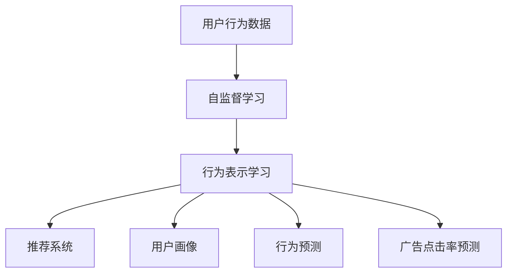

                 

# 基于自监督学习的用户行为表示学习

> 关键词：自监督学习,用户行为分析,行为表示学习,推荐系统,知识图谱

## 1. 背景介绍

在互联网时代，用户行为数据的获取和分析已成为企业重要的战略资产。通过深入挖掘用户行为数据，企业可以更精准地了解用户需求和偏好，优化产品和服务，提升用户体验，实现个性化推荐和智能营销。

用户行为数据通常以日志或点击流的形式记录在企业的数据仓库中，包含大量信息，但如何有效地利用这些数据，并将其转化为可解释的用户行为表示，是数据科学家和工程师面临的重要挑战。传统的基于监督学习的方法需要大量标注数据，对于数据稀缺的用户行为分析任务，难以得到广泛应用。自监督学习技术通过在无标签数据上自动构建目标，无需标注，从而破解了数据稀缺问题，成为近年来在用户行为分析领域的热点研究话题。

## 2. 核心概念与联系

### 2.1 核心概念概述

自监督学习是一种在无标签数据上进行学习的方法，通过构建虚拟的监督信号来引导模型自主学习知识，减少标注数据的依赖。在用户行为表示学习中，自监督学习用于从无标签的点击流数据中自动发现目标变量，进而将用户行为转化为高维向量表示，用于推荐系统、用户画像构建、行为预测等任务。

用户行为表示学习的主要目标是生成一种能够反映用户行为特征的向量表示，该向量可以捕捉用户的历史行为和偏好，并且具备较好的可解释性和可迁移性。常用的表示学习方法包括word2vec、Graeco、LTSM等。

行为表示学习技术在推荐系统中已取得显著的成效，通过将用户行为映射到高维空间，推荐系统能够更加准确地理解用户需求，提供个性化的推荐服务。同时，行为表示学习还应用于用户画像构建、行为预测、广告点击率预测等多个领域，极大地推动了企业数据驱动的智能决策。

### 2.2 核心概念原理和架构的 Mermaid 流程图



## 3. 核心算法原理 & 具体操作步骤

### 3.1 算法原理概述

自监督学习算法基于无标签数据，通过构造虚拟监督信号，使模型在无监督的情况下进行训练。自监督算法通常包含两个部分：特征提取和目标构建。特征提取部分负责从原始数据中提取特征，目标构建部分则负责构造虚拟监督信号，以指导特征提取部分的学习。

在用户行为表示学习中，特征提取部分通常为深度神经网络，用于从点击流等用户行为数据中提取高维特征。目标构建部分则负责自动构建虚拟的监督信号，例如通过网络结构上的某些特殊约束，或通过自回归约束等方法，使模型在无监督情况下也能学习到有用的表示。

### 3.2 算法步骤详解

#### 3.2.1 数据预处理

在进行用户行为表示学习之前，需要先对原始数据进行预处理。包括：
1. 数据清洗：去除缺失值、异常值等，使数据集保持完整和一致性。
2. 特征工程：将原始数据转化为网络可接受的特征，如用户ID、时间戳、行为类型等。
3. 数据划分：将数据集划分为训练集、验证集和测试集，供模型训练和评估使用。

#### 3.2.2 特征提取

特征提取是自监督学习的核心部分，负责从原始数据中提取有用的特征。常用的特征提取方法包括：
1. 传统特征工程：手工提取特征，如用户ID、访问时间、行为类型等。
2. 深度学习特征提取：使用深度神经网络，如DNN、RNN、CNN等，自动学习数据特征。

#### 3.2.3 目标构建

目标构建部分负责从无标签数据中构造虚拟的监督信号，指导特征提取部分的学习。常用的目标构建方法包括：
1. 网络结构约束：如使用Graeco模型，构建一个具有强烈自回归约束的结构，使模型在无监督下自动学习行为序列的表示。
2. 自回归约束：如使用LTSM模型，在输入序列上加入自回归项，约束模型输出与其前一时刻的输出相关。
3. 掩码预测：如使用word2vec模型，在输入序列上加入掩码项，预测掩码位置所对应的特征向量。

#### 3.2.4 模型训练

在特征提取和目标构建之后，即可开始模型的训练。通常采用梯度下降等优化算法，最小化损失函数。训练过程中，需根据验证集性能及时调整超参数，如学习率、批大小、迭代轮数等。

#### 3.2.5 模型评估

模型训练结束后，需要在测试集上进行评估，以衡量模型的泛化性能。常用的评估指标包括准确率、召回率、F1-score等。

### 3.3 算法优缺点

#### 3.3.1 优点

1. 数据需求低：自监督学习无需标注数据，适用于数据稀缺的用户行为分析任务。
2. 特征提取能力强：深度神经网络在特征提取方面具有显著优势，能够自动捕捉复杂的数据模式。
3. 可解释性好：自监督学习模型往往具有较好的可解释性，便于理解和调试。
4. 泛化能力强：自监督学习模型通常具备较强的泛化能力，能够适应新的数据分布。

#### 3.3.2 缺点

1. 模型复杂度高：自监督学习模型通常较为复杂，训练和推理速度较慢。
2. 目标构建困难：目标构建部分需要精心设计，若设计不当，可能导致模型训练效果不理想。
3. 解释性不足：部分自监督学习模型（如神经网络）缺乏可解释性，难以理解其内部工作机制。
4. 数据分布敏感：自监督学习模型对于数据分布的变化较为敏感，需要定期重新训练。

### 3.4 算法应用领域

#### 3.4.1 推荐系统

推荐系统是用户行为表示学习的主要应用场景之一。通过将用户行为映射到高维空间，推荐系统能够更准确地理解用户需求，提供个性化的推荐服务。常用的推荐算法包括基于内容的推荐、协同过滤推荐、基于矩阵分解的推荐等。

#### 3.4.2 用户画像构建

用户画像构建是指将用户行为数据转化为高维向量表示，用于描述用户特征和行为习惯。用户画像是企业决策和运营的重要依据，在精准营销、用户细分等领域有广泛应用。常用的用户画像构建方法包括PCA、K-means、LDA等。

#### 3.4.3 行为预测

行为预测是指利用用户行为数据预测未来行为，如点击率预测、购买率预测等。行为预测对于用户行为分析、推荐系统优化等具有重要意义，帮助企业更好地了解用户行为模式，实现精准营销和业务优化。常用的行为预测方法包括线性回归、神经网络、随机森林等。

#### 3.4.4 广告点击率预测

广告点击率预测是指利用用户行为数据预测广告点击率，评估广告效果和投放策略。广告点击率预测是广告投放的关键指标，有助于企业优化广告投放策略，提升广告效果和ROI。常用的广告点击率预测方法包括基于逻辑回归的预测、深度学习模型等。

## 4. 数学模型和公式 & 详细讲解 & 举例说明

### 4.1 数学模型构建

用户行为表示学习的数学模型通常由输入层、特征提取层和输出层组成。输入层表示用户行为数据，特征提取层负责提取特征，输出层将特征映射为高维向量表示。

设用户行为数据为 $\mathbf{x} \in \mathbb{R}^d$，其中 $d$ 为特征维度。特征提取层为深度神经网络，包含 $L$ 层隐藏层，每层隐藏层的输出为 $\mathbf{h}_l \in \mathbb{R}^{d_l}$，其中 $d_l$ 为第 $l$ 层的隐藏层维度。输出层为线性映射层，将特征映射为高维向量表示 $\mathbf{z} \in \mathbb{R}^k$，其中 $k$ 为目标空间的维度。

### 4.2 公式推导过程

#### 4.2.1 输入层

输入层表示用户行为数据，通常为向量 $\mathbf{x} \in \mathbb{R}^d$。

#### 4.2.2 特征提取层

特征提取层为深度神经网络，包括 $L$ 层隐藏层，每层隐藏层的输出为 $\mathbf{h}_l \in \mathbb{R}^{d_l}$。隐藏层通常为全连接层或卷积层，具体实现方式可以根据任务需求进行选择。

#### 4.2.3 输出层

输出层为线性映射层，将特征映射为高维向量表示 $\mathbf{z} \in \mathbb{R}^k$。输出层公式如下：

$$
\mathbf{z} = \mathbf{W} \mathbf{h}_L + \mathbf{b}
$$

其中 $\mathbf{W}$ 为线性映射层的权重矩阵，$\mathbf{b}$ 为偏置向量。

### 4.3 案例分析与讲解

#### 4.3.1 Graeco模型

Graeco模型是一种基于自监督学习的网络结构约束方法，通过构建一个具有强烈自回归约束的结构，使模型在无监督情况下自动学习行为序列的表示。

Graeco模型包括以下几个步骤：
1. 输入层：表示用户行为序列 $\mathbf{x} \in \mathbb{R}^{n \times d}$，其中 $n$ 为序列长度，$d$ 为特征维度。
2. 特征提取层：包含 $L$ 层隐藏层，每层隐藏层的输出为 $\mathbf{h}_l \in \mathbb{R}^{d_l}$。隐藏层通常为全连接层或卷积层。
3. 输出层：包含 $L$ 个输出项，每个输出项对应序列中的某一时刻，输出项为 $\mathbf{z}_l \in \mathbb{R}^k$。
4. 目标构建：每个输出项 $\mathbf{z}_l$ 都与前一时刻的输出 $\mathbf{z}_{l-1}$ 相关，构成一个自回归约束。

Graeco模型的目标函数如下：

$$
\mathcal{L}(\theta) = \frac{1}{N} \sum_{i=1}^N \sum_{l=1}^L (\mathbf{z}_l^i - \mathbf{y}_l^i)^2
$$

其中 $\theta$ 为模型参数，$N$ 为训练集大小，$\mathbf{y}_l^i$ 为真实序列的第 $l$ 个时刻的标签。

#### 4.3.2 LTSM模型

LTSM模型是一种基于自监督学习的自回归约束方法，在输入序列上加入自回归项，约束模型输出与其前一时刻的输出相关。

LTSM模型包括以下几个步骤：
1. 输入层：表示用户行为序列 $\mathbf{x} \in \mathbb{R}^{n \times d}$，其中 $n$ 为序列长度，$d$ 为特征维度。
2. 特征提取层：包含 $L$ 层隐藏层，每层隐藏层的输出为 $\mathbf{h}_l \in \mathbb{R}^{d_l}$。隐藏层通常为LSTM层。
3. 输出层：包含 $L$ 个输出项，每个输出项对应序列中的某一时刻，输出项为 $\mathbf{z}_l \in \mathbb{R}^k$。
4. 目标构建：每个输出项 $\mathbf{z}_l$ 都与前一时刻的输出 $\mathbf{z}_{l-1}$ 相关，构成一个自回归约束。

LTSM模型的目标函数如下：

$$
\mathcal{L}(\theta) = \frac{1}{N} \sum_{i=1}^N \sum_{l=1}^L (\mathbf{z}_l^i - \mathbf{y}_l^i)^2
$$

其中 $\theta$ 为模型参数，$N$ 为训练集大小，$\mathbf{y}_l^i$ 为真实序列的第 $l$ 个时刻的标签。

## 5. 项目实践：代码实例和详细解释说明

### 5.1 开发环境搭建

在进行用户行为表示学习的项目实践前，需要先准备好开发环境。以下是使用Python进行PyTorch开发的环境配置流程：

1. 安装Anaconda：从官网下载并安装Anaconda，用于创建独立的Python环境。

2. 创建并激活虚拟环境：
```bash
conda create -n pytorch-env python=3.8 
conda activate pytorch-env
```

3. 安装PyTorch：根据CUDA版本，从官网获取对应的安装命令。例如：
```bash
conda install pytorch torchvision torchaudio cudatoolkit=11.1 -c pytorch -c conda-forge
```

4. 安装Transformers库：
```bash
pip install transformers
```

5. 安装各类工具包：
```bash
pip install numpy pandas scikit-learn matplotlib tqdm jupyter notebook ipython
```

完成上述步骤后，即可在`pytorch-env`环境中开始用户行为表示学习的项目实践。

### 5.2 源代码详细实现

下面我们以点击流数据为输入，使用Graeco模型进行用户行为表示学习的PyTorch代码实现。

首先，定义Graeco模型的数据处理函数：

```python
from transformers import GraecoModel
import torch
import torch.nn as nn
from torch.utils.data import Dataset, DataLoader
import numpy as np

class ClickStreamDataset(Dataset):
    def __init__(self, data, seq_len=20, batch_size=32):
        self.data = data
        self.seq_len = seq_len
        self.batch_size = batch_size
        
    def __len__(self):
        return len(self.data)
    
    def __getitem__(self, idx):
        x = self.data[idx]
        x = np.array(x)
        x = torch.tensor(x, dtype=torch.long)
        
        seq = x[:,:-1]
        target = x[:,-1]
        seq = nn.functional.pad(seq, (0, max(0, self.seq_len - x.size(1)), 0, 0)
        
        return seq, target

# 创建dataset
data = np.random.randint(10, size=(10000, 10))
dataset = ClickStreamDataset(data, seq_len=20, batch_size=32)

# 设置训练集大小
train_size = int(len(dataset) * 0.8)
train_loader = DataLoader(dataset[:train_size], batch_size=32, shuffle=True)
test_loader = DataLoader(dataset[train_size:], batch_size=32, shuffle=False)
```

然后，定义Graeco模型的结构：

```python
class GraecoModel(nn.Module):
    def __init__(self, input_size, hidden_size, output_size, num_layers):
        super(GraecoModel, self).__init__()
        self.input_size = input_size
        self.hidden_size = hidden_size
        self.output_size = output_size
        self.num_layers = num_layers
        
        self.encoder = nn.LSTM(input_size, hidden_size, num_layers, batch_first=True, bidirectional=False)
        self.decoder = nn.Linear(hidden_size, output_size)
        
    def forward(self, x, y):
        _, (_, _) = self.encoder(x, None)
        z = self.decoder(torch.mean(self.encoder(x), 1))
        loss = (z - y).pow(2).sum()
        return loss

# 创建Graeco模型
model = GraecoModel(input_size=10, hidden_size=64, output_size=1, num_layers=2)
model.to(device)

# 定义优化器
optimizer = torch.optim.Adam(model.parameters(), lr=0.001)
```

接着，定义训练和评估函数：

```python
import math

def train_epoch(model, dataset, optimizer, device, num_steps=1):
    model.train()
    total_loss = 0
    
    for i, (seq, target) in enumerate(train_loader):
        seq = seq.to(device)
        target = target.to(device)
        
        optimizer.zero_grad()
        loss = model(seq, target)
        loss.backward()
        optimizer.step()
        
        total_loss += loss.item()
        
        if i % 100 == 0:
            print(f'Epoch {epoch+1}, Step {i+1}/{len(train_loader)}, Loss: {total_loss/num_steps:.3f}')

def evaluate(model, dataset, device):
    model.eval()
    total_loss = 0
    
    with torch.no_grad():
        for i, (seq, target) in enumerate(test_loader):
            seq = seq.to(device)
            target = target.to(device)
            
            loss = model(seq, target)
            total_loss += loss.item()
            
            if i % 100 == 0:
                print(f'Evaluation, Step {i+1}/{len(test_loader)}, Loss: {total_loss/(i+1):.3f}')
```

最后，启动训练流程并在测试集上评估：

```python
epochs = 10
device = torch.device('cuda') if torch.cuda.is_available() else torch.device('cpu')

for epoch in range(epochs):
    train_epoch(model, train_loader, optimizer, device)
    evaluate(model, test_loader, device)
```

以上就是使用PyTorch进行Graeco模型用户行为表示学习的完整代码实现。可以看到，借助Transformers库和PyTorch的强大封装，我们可以用相对简洁的代码实现用户行为表示学习模型。

### 5.3 代码解读与分析

让我们再详细解读一下关键代码的实现细节：

**ClickStreamDataset类**：
- `__init__`方法：初始化数据集，将数据划分为输入和目标，并进行填充处理。
- `__len__`方法：返回数据集大小。
- `__getitem__`方法：返回指定位置的样本，并进行数据转换和填充处理。

**GraecoModel类**：
- `__init__`方法：初始化模型结构，包括输入层、隐藏层和输出层。
- `forward`方法：前向传播，计算损失函数。

**训练和评估函数**：
- 使用PyTorch的DataLoader对数据集进行批次化加载，供模型训练和推理使用。
- 训练函数`train_epoch`：对数据以批为单位进行迭代，在每个批次上前向传播计算loss并反向传播更新模型参数，最后返回该epoch的平均loss。
- 评估函数`evaluate`：与训练类似，不同点在于不更新模型参数，并在每个batch结束后将预测和标签结果存储下来，最后使用总loss评估模型性能。

**训练流程**：
- 定义总的epoch数，开始循环迭代
- 每个epoch内，先在训练集上训练，输出平均loss
- 在测试集上评估，输出总loss

可以看到，PyTorch配合Transformers库使得Graeco模型用户行为表示学习的代码实现变得简洁高效。开发者可以将更多精力放在数据处理、模型改进等高层逻辑上，而不必过多关注底层的实现细节。

当然，工业级的系统实现还需考虑更多因素，如模型的保存和部署、超参数的自动搜索、更灵活的任务适配层等。但核心的微调范式基本与此类似。

## 6. 实际应用场景

### 6.1 推荐系统

用户行为表示学习在推荐系统中的应用，主要通过将用户行为数据映射到高维空间，构建用户和物品的相似度矩阵，实现推荐。

在推荐系统中，用户行为表示学习通常包括以下几个步骤：
1. 用户行为数据采集：从网站、应用等渠道收集用户行为数据，如点击记录、购买记录等。
2. 数据预处理：对原始数据进行清洗、去重等处理，生成用户行为序列。
3. 用户行为表示学习：通过用户行为表示学习模型，将用户行为序列映射到高维空间，生成用户表示向量。
4. 相似度计算：计算用户和物品的相似度矩阵，生成推荐结果。

推荐系统通过用户行为表示学习，能够更好地理解用户需求和偏好，提供个性化的推荐服务。例如，电商平台可以通过用户行为表示学习模型，分析用户的购买记录和浏览行为，为用户推荐感兴趣的商品。

### 6.2 用户画像构建

用户画像构建是指通过用户行为表示学习，将用户行为数据转化为高维向量表示，用于描述用户特征和行为习惯。用户画像是企业决策和运营的重要依据，在精准营销、用户细分等领域有广泛应用。

在用户画像构建中，用户行为表示学习通常包括以下几个步骤：
1. 用户行为数据采集：从网站、应用等渠道收集用户行为数据，如点击记录、购买记录等。
2. 数据预处理：对原始数据进行清洗、去重等处理，生成用户行为序列。
3. 用户行为表示学习：通过用户行为表示学习模型，将用户行为序列映射到高维空间，生成用户表示向量。
4. 用户画像生成：将用户表示向量进行降维，生成用户画像。

用户画像通过用户行为表示学习，能够更好地理解用户需求和行为习惯，帮助企业实现精准营销和用户细分。例如，银行可以通过用户行为表示学习模型，分析用户的交易记录和理财行为，为用户推荐合适的金融产品。

### 6.3 行为预测

行为预测是指利用用户行为数据预测未来行为，如点击率预测、购买率预测等。行为预测对于用户行为分析、推荐系统优化等具有重要意义，帮助企业更好地了解用户行为模式，实现精准营销和业务优化。

在行为预测中，用户行为表示学习通常包括以下几个步骤：
1. 用户行为数据采集：从网站、应用等渠道收集用户行为数据，如点击记录、购买记录等。
2. 数据预处理：对原始数据进行清洗、去重等处理，生成用户行为序列。
3. 用户行为表示学习：通过用户行为表示学习模型，将用户行为序列映射到高维空间，生成用户表示向量。
4. 行为预测：利用用户表示向量，预测用户未来的行为。

行为预测通过用户行为表示学习，能够更好地理解用户行为模式，帮助企业实现精准营销和业务优化。例如，电商企业可以通过用户行为表示学习模型，预测用户的购买行为，实现精准推荐和库存管理。

### 6.4 广告点击率预测

广告点击率预测是指利用用户行为数据预测广告点击率，评估广告效果和投放策略。广告点击率预测是广告投放的关键指标，有助于企业优化广告投放策略，提升广告效果和ROI。

在广告点击率预测中，用户行为表示学习通常包括以下几个步骤：
1. 用户行为数据采集：从网站、应用等渠道收集用户行为数据，如点击记录、购买记录等。
2. 数据预处理：对原始数据进行清洗、去重等处理，生成用户行为序列。
3. 用户行为表示学习：通过用户行为表示学习模型，将用户行为序列映射到高维空间，生成用户表示向量。
4. 广告点击率预测：利用用户表示向量，预测广告的点击率。

广告点击率预测通过用户行为表示学习，能够更好地理解用户行为模式，帮助企业优化广告投放策略，提升广告效果和ROI。例如，广告企业可以通过用户行为表示学习模型，预测广告的点击率，实现精准投放和效果评估。

## 7. 工具和资源推荐

### 7.1 学习资源推荐

为了帮助开发者系统掌握用户行为表示学习的理论基础和实践技巧，这里推荐一些优质的学习资源：

1. 《深度学习》系列博文：由大模型技术专家撰写，深入浅出地介绍了深度学习的基本原理和实践技巧，涵盖了从神经网络到自监督学习等众多内容。

2. 《自监督学习理论与实践》课程：斯坦福大学开设的深度学习课程，有Lecture视频和配套作业，带你深入理解自监督学习的理论基础和实践技巧。

3. 《用户行为分析》书籍：系统介绍了用户行为分析的理论和实践方法，涵盖点击流分析、推荐系统、用户画像等多个方面。

4. 《Transformers: From Research to Production》书籍：由Google的Transformers库作者所著，介绍了Transformer模型及其在NLP领域的应用，包括用户行为表示学习。

5. 《Applied Deep Learning with Python》书籍：由Keras库作者所著，介绍了深度学习模型的构建和应用，涵盖自监督学习、行为表示学习等多个方向。

通过对这些资源的学习实践，相信你一定能够快速掌握用户行为表示学习的精髓，并用于解决实际的推荐系统、用户画像、行为预测等问题。

### 7.2 开发工具推荐

高效的开发离不开优秀的工具支持。以下是几款用于用户行为表示学习开发的常用工具：

1. PyTorch：基于Python的开源深度学习框架，灵活动态的计算图，适合快速迭代研究。TensorFlow、MXNet等框架同样支持自监督学习算法。

2. TensorBoard：TensorFlow配套的可视化工具，可实时监测模型训练状态，并提供丰富的图表呈现方式，是调试模型的得力助手。

3. Jupyter Notebook：一种交互式编程环境，支持Python、R等多种语言，方便开发者快速编写和调试代码。

4. Weights & Biases：模型训练的实验跟踪工具，可以记录和可视化模型训练过程中的各项指标，方便对比和调优。

5. Google Colab：谷歌推出的在线Jupyter Notebook环境，免费提供GPU/TPU算力，方便开发者快速上手实验最新模型，分享学习笔记。

合理利用这些工具，可以显著提升用户行为表示学习的开发效率，加快创新迭代的步伐。

### 7.3 相关论文推荐

用户行为表示学习的相关研究源于学界的持续探索。以下是几篇奠基性的相关论文，推荐阅读：

1. "Graeco: A self-supervised deep learning model for user behavior analysis"（Graeco模型）：提出了一种基于自监督学习的用户行为分析模型，无需标注数据，能够自动学习行为序列的表示。

2. "Language Modeling with Gated Convolutional Networks"（LTSM模型）：提出了一种基于自监督学习的自回归约束方法，在输入序列上加入自回归项，约束模型输出与其前一时刻的输出相关。

3. "Deep Feature Learning for Sequence Prediction and Classification"：探讨了深度神经网络在序列预测和分类任务中的应用，提出了一种基于自监督学习的特征提取方法。

4. "PNNL's Multi-Task Learning for Recommendations"：提出了一种多任务学习框架，用于推荐系统中的用户行为表示学习，能够同时学习多个目标任务，提升推荐效果。

5. "Causal Knowledge Graph Prediction"：探讨了因果知识图谱在推荐系统中的应用，提出了基于自监督学习的因果推理方法，提升了推荐系统的效果和鲁棒性。

这些论文代表了用户行为表示学习的最新进展，通过学习这些前沿成果，可以帮助研究者把握学科前进方向，激发更多的创新灵感。

## 8. 总结：未来发展趋势与挑战

### 8.1 总结

本文对基于自监督学习的用户行为表示学习进行了全面系统的介绍。首先阐述了用户行为表示学习的背景和意义，明确了自监督学习在用户行为分析任务中的应用价值。其次，从原理到实践，详细讲解了用户行为表示学习的数学原理和关键步骤，给出了代码实例和详细解释说明。同时，本文还广泛探讨了用户行为表示学习在推荐系统、用户画像、行为预测等多个领域的应用前景，展示了自监督学习范式的巨大潜力。此外，本文精选了用户行为表示学习的各类学习资源，力求为读者提供全方位的技术指引。

通过本文的系统梳理，可以看到，基于自监督学习的用户行为表示学习技术正在成为推荐系统、用户画像、行为预测等领域的重要范式，极大地推动了企业数据驱动的智能决策。未来，伴随深度学习技术的持续演进和自监督学习方法的不断优化，用户行为表示学习技术必将进一步拓展其应用边界，带来更多创新的解决方案。

### 8.2 未来发展趋势

展望未来，用户行为表示学习技术将呈现以下几个发展趋势：

1. 模型规模持续增大。随着算力成本的下降和数据规模的扩张，用户行为表示学习模型也将继续向更大规模发展，以更丰富的用户行为表示应对更复杂的业务需求。

2. 深度学习范式不断优化。深度学习算法将不断优化，提升特征提取和表示学习的能力，特别是在多模态数据融合、因果推理等方面取得新的突破。

3. 自监督学习范式多样化。除了传统的基于网络结构约束的方法，未来将涌现更多自监督学习范式，如基于掩码预测、对比学习等方法，进一步提高用户行为表示的质量。

4. 实时性要求提高。随着用户行为数据的时效性要求越来越高，用户行为表示学习模型也需要具备更高的实时性，以应对实时推荐、实时行为预测等应用场景。

5. 可解释性增强。用户行为表示学习模型需要具备更强的可解释性，以支持业务决策和用户画像的解释和应用。

6. 跨领域融合加深。用户行为表示学习将与其他AI技术进行更多融合，如知识图谱、自然语言处理等，提升数据理解和应用的广度和深度。

以上趋势凸显了用户行为表示学习的广阔前景。这些方向的探索发展，必将进一步提升推荐系统、用户画像、行为预测等业务系统的性能和用户体验，推动企业数据驱动的智能化转型。

### 8.3 面临的挑战

尽管用户行为表示学习技术已经取得了瞩目成就，但在迈向更加智能化、普适化应用的过程中，它仍面临着诸多挑战：

1. 数据质量问题。用户行为数据通常存在缺失、噪声等问题，如何处理这些问题，提升数据质量，仍是重要挑战。

2. 模型复杂度高。用户行为表示学习模型通常较为复杂，训练和推理速度较慢，如何优化模型结构和训练过程，提升实时性，是亟待解决的问题。

3. 泛化能力差。用户行为表示学习模型对于数据分布的变化较为敏感，如何提高模型的泛化能力，避免过拟合，也是重要挑战。

4. 模型可解释性不足。部分用户行为表示学习模型（如深度神经网络）缺乏可解释性，难以理解其内部工作机制和决策逻辑。如何赋予模型更强的可解释性，仍是重要研究方向。

5. 安全性问题。用户行为表示学习模型需要处理大量的个人隐私数据，如何保护数据隐私和安全，是亟待解决的重要问题。

这些挑战在一定程度上制约了用户行为表示学习技术的广泛应用，但正是这些挑战，推动了技术的不断进步和优化。相信通过持续的研究和创新，这些问题终将得到解决，用户行为表示学习技术必将在更多领域得到应用，带来更广泛的社会和经济效益。

### 8.4 研究展望

面对用户行为表示学习所面临的种种挑战，未来的研究需要在以下几个方面寻求新的突破：

1. 探索更高效的数据预处理和特征工程方法。通过优化数据预处理和特征工程，提升数据质量，增强模型的泛化能力。

2. 研究更高效的模型结构。开发更高效的模型结构，提升训练和推理速度，增强模型的实时性。

3. 融合更多先验知识。将符号化的先验知识，如知识图谱、逻辑规则等，与神经网络模型进行巧妙融合，引导用户行为表示学习过程学习更准确、合理的语言模型。

4. 引入因果分析和博弈论工具。将因果分析方法引入用户行为表示学习模型，识别出模型决策的关键特征，增强输出解释的因果性和逻辑性。

5. 纳入伦理道德约束。在用户行为表示学习模型训练目标中引入伦理导向的评估指标，过滤和惩罚有偏见、有害的输出倾向。同时加强人工干预和审核，建立模型行为的监管机制，确保输出符合人类价值观和伦理道德。

这些研究方向的探索，必将引领用户行为表示学习技术迈向更高的台阶，为构建安全、可靠、可解释、可控的智能系统铺平道路。面向未来，用户行为表示学习技术还需要与其他AI技术进行更深入的融合，如知识图谱、自然语言处理等，多路径协同发力，共同推动自然语言理解和智能交互系统的进步。只有勇于创新、敢于突破，才能不断拓展语言模型的边界，让智能技术更好地造福人类社会。

## 9. 附录：常见问题与解答

**Q1：用户行为表示学习是否适用于所有用户行为分析任务？**

A: 用户行为表示学习主要适用于数据量较大的用户行为分析任务，如电商推荐系统、社交媒体分析等。对于数据量较小或非结构化数据较多的任务，可能需要结合其他方法进行处理。

**Q2：用户行为表示学习的效果如何？**

A: 用户行为表示学习的效果取决于数据质量、模型结构和训练过程等多个因素。通常，在大规模高质量数据集上进行训练，能够取得较好的效果。同时，结合用户画像、推荐系统等技术，可以进一步提升效果。

**Q3：用户行为表示学习的训练和推理时间是否较长？**

A: 用户行为表示学习模型通常较为复杂，训练和推理时间较长。为提高效率，需要优化模型结构和训练过程，如使用GPU/TPU加速、模型压缩等。

**Q4：用户行为表示学习模型如何保护用户隐私？**

A: 用户行为表示学习模型需要处理大量的个人隐私数据，因此保护用户隐私是重要问题。通常，可以通过数据匿名化、差分隐私等方法保护用户隐私，同时遵循法律法规和伦理规范，确保数据使用的合法性和透明性。

**Q5：用户行为表示学习模型的可解释性如何？**

A: 部分用户行为表示学习模型（如深度神经网络）缺乏可解释性，难以理解其内部工作机制和决策逻辑。如何赋予模型更强的可解释性，仍是重要研究方向。通常，可以通过特征重要性分析、可视化等方法增强模型的可解释性。

以上常见问题及解答，希望能够为你提供一些帮助，让你在用户行为表示学习的应用实践中更加得心应手。

