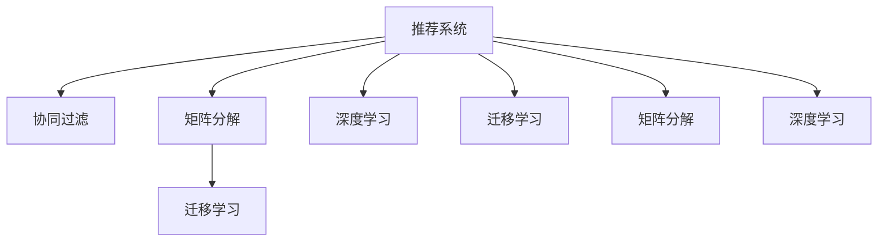

                 

# 基于迁移学习的跨域推荐算法

> 关键词：跨域推荐, 迁移学习, 协同过滤, 矩阵分解, 深度学习, 相似度计算, 推荐系统, 数据融合, 用户体验, 计算效率

## 1. 背景介绍

### 1.1 问题由来

在信息爆炸的时代，互联网平台用户产生了海量的用户行为数据。这些数据包含着用户对商品、内容、服务等不同领域的需求，反映了用户的真实兴趣和偏好。推荐系统通过这些数据挖掘出用户的潜在需求，为用户推荐合适的商品、内容和服务，提升用户体验。

然而，现有的推荐系统大多是基于单领域数据构建的，难以跨领域推广。例如，某电商网站基于用户在该平台上的购买记录推荐商品，对于用户在其他平台上的阅读、观看、搜索等行为，推荐系统无法提供服务。这就导致了用户在多个领域享受不同平台的服务时，面临着需要重复注册、搜索等重复操作的问题，降低了用户体验。

跨域推荐系统通过整合用户在不同领域的行为数据，提供更全面、个性化的推荐服务，满足用户在不同平台上的需求。例如，用户在电商网站浏览商品后，到阅读平台浏览文章，推荐系统可以基于用户在电商网站上的浏览记录和在阅读平台上的阅读记录，为用户推荐相关商品或文章。

### 1.2 问题核心关键点

跨域推荐系统需要在不同领域数据之间建立协同关联，综合用户在不同领域的行为数据，为用户提供个性化的推荐服务。常见的跨域推荐方法包括：

- 基于迁移学习的推荐算法：利用不同领域数据之间的共性，将迁移学习应用于推荐系统，从而提升跨域推荐的性能。
- 基于协同过滤的推荐算法：在用户-物品评分矩阵中寻找相似用户或物品，将相似用户的评分矩阵迁移至目标用户，或将相似物品的评分矩阵迁移至目标物品，实现跨域推荐。
- 基于矩阵分解的推荐算法：将用户-物品评分矩阵分解为不同领域的低秩矩阵，通过矩阵乘法将不同领域的矩阵乘积得到用户对物品的综合评分，实现跨域推荐。
- 基于深度学习的推荐算法：利用深度神经网络模型，提取用户在不同领域的行为数据特征，实现跨域推荐。

这些跨域推荐方法各具特色，在不同的推荐场景中具有广泛的应用。

### 1.3 问题研究意义

构建跨域推荐系统，对提升用户在不同平台上的体验，增强平台用户粘性，提升整体推荐系统效果，具有重要意义：

1. 提高用户满意度：跨域推荐可以提供更全面、个性化的推荐服务，满足用户在多个领域的需求，提升用户体验。
2. 增加平台收益：通过跨域推荐，平台可以向用户推荐更多相关商品、内容和服务，提升用户消费，增加平台收益。
3. 扩大推荐系统覆盖范围：跨域推荐可以帮助平台覆盖更多用户，提升平台市场竞争力。
4. 实现个性化推荐：通过跨域推荐，平台可以基于用户在多个领域的行为数据，实现更精准的个性化推荐。
5. 提升推荐系统效果：跨域推荐可以整合不同领域的数据，提升推荐系统效果，缩短推荐时间，提升推荐准确度。

## 2. 核心概念与联系

### 2.1 核心概念概述

为更好地理解基于迁移学习的跨域推荐算法，本节将介绍几个密切相关的核心概念：

- 推荐系统(Recommender System)：根据用户的历史行为数据，为用户推荐合适的商品、内容、服务等。
- 迁移学习(Transfer Learning)：利用源领域的知识，帮助目标领域提高学习效果，提升目标领域的任务性能。
- 协同过滤(Collaborative Filtering)：基于用户对物品的评分，找到相似用户或物品，通过用户-物品评分矩阵迁移实现推荐。
- 矩阵分解(Matrix Factorization)：将用户-物品评分矩阵分解为不同领域的低秩矩阵，通过矩阵乘法得到用户对物品的综合评分。
- 深度学习(Deep Learning)：使用多层神经网络，提取数据特征，实现推荐。

这些概念之间的逻辑关系可以通过以下Mermaid流程图来展示：



这个流程图展示了几类推荐方法的共性，以及如何将迁移学习应用于推荐系统。

## 3. 核心算法原理 & 具体操作步骤
### 3.1 算法原理概述

基于迁移学习的跨域推荐算法，利用不同领域数据之间的共性，通过迁移学习实现跨域推荐。其核心思想是：在用户-物品评分矩阵中，寻找相似用户或物品，通过用户-物品评分矩阵迁移实现推荐。

形式化地，假设用户-物品评分矩阵为 $M_{ui}$，不同领域数据的评分矩阵分别为 $M_1^{ui}$ 和 $M_2^{ui}$。基于迁移学习的跨域推荐算法的目标是：找到相似用户 $u_1$ 和 $u_2$，利用 $M_1^{ui}$ 和 $M_2^{ui}$ 计算推荐结果。

具体而言，算法步骤如下：

1. 利用不同领域用户行为数据，计算用户之间的相似度。
2. 在用户-物品评分矩阵中，找到与目标用户 $u_2$ 相似的用户 $u_1$。
3. 将相似用户 $u_1$ 在目标领域 $M_2^{ui}$ 中的评分矩阵迁移至目标用户 $u_2$，生成推荐结果。

### 3.2 算法步骤详解

基于迁移学习的跨域推荐算法一般包括以下几个关键步骤：

**Step 1: 数据预处理**

- 收集用户在不同领域的行为数据，构建不同领域用户-物品评分矩阵 $M_1^{ui}$ 和 $M_2^{ui}$。
- 对评分矩阵进行标准化处理，消除评分数据量级的差异，得到标准化评分矩阵 $M_1^{\prime ui}$ 和 $M_2^{\prime ui}$。

**Step 2: 相似度计算**

- 利用不同领域用户行为数据，计算用户之间的相似度。常用的相似度计算方法包括余弦相似度、皮尔逊相关系数、K近邻等。
- 通过相似度计算，找到与目标用户 $u_2$ 相似的用户 $u_1$。

**Step 3: 评分矩阵迁移**

- 利用 $u_1$ 在目标领域 $M_2^{ui}$ 中的评分矩阵，计算推荐结果。常用的评分矩阵迁移方法包括矩阵加权、矩阵补齐、矩阵拼接等。

**Step 4: 生成推荐结果**

- 利用评分矩阵迁移的结果，生成推荐结果。常用的推荐方法包括基于协同过滤的推荐方法、基于矩阵分解的推荐方法、基于深度学习的推荐方法等。

### 3.3 算法优缺点

基于迁移学习的跨域推荐算法具有以下优点：

1. 能够整合不同领域的数据，提高推荐系统效果。
2. 能够提供更全面、个性化的推荐服务，提升用户体验。
3. 能够优化推荐系统中的冷启动问题，提升新用户的推荐准确度。

同时，该算法也存在一些缺点：

1. 需要收集和处理大量用户行为数据，数据获取成本高。
2. 需要计算用户之间的相似度，计算复杂度高。
3. 需要处理不同领域评分矩阵之间的差异，评分数据量级可能不一致。
4. 需要设计合适的评分矩阵迁移方法，保证迁移的准确度。
5. 可能存在数据泄露风险，不同领域的数据可能存在重复用户。

尽管存在这些缺点，但就目前而言，基于迁移学习的跨域推荐算法仍是最主流推荐范式之一。未来相关研究的重点在于如何进一步降低数据获取成本，提高计算效率，保证评分矩阵迁移的准确度，同时兼顾可解释性和伦理安全性等因素。

### 3.4 算法应用领域

基于迁移学习的跨域推荐算法，在多个领域得到了广泛的应用，例如：

- 电商推荐：通过用户在不同电商网站的购买记录和浏览记录，为用户推荐相关商品。
- 阅读推荐：通过用户在不同阅读平台的文章浏览记录和搜索记录，为用户推荐相关文章。
- 音乐推荐：通过用户在不同音乐平台的听歌记录和歌曲搜索记录，为用户推荐相关歌曲。
- 视频推荐：通过用户在不同视频平台的观看记录和视频搜索记录，为用户推荐相关视频。
- 智能家居推荐：通过用户在不同智能家居设备上的使用记录和设备搜索记录，为用户推荐相关智能设备。

除了上述这些经典应用外，基于迁移学习的跨域推荐算法还被创新性地应用于更多场景中，如跨平台社交网络推荐、跨领域广告投放、跨领域内容推荐等，为推荐系统带来了全新的突破。随着数据获取手段的进步和算法技术的不断演进，相信基于迁移学习的跨域推荐算法将在更多领域得到应用，为推荐系统带来更多的创新可能。

## 4. 数学模型和公式 & 详细讲解 & 举例说明
### 4.1 数学模型构建

本节将使用数学语言对基于迁移学习的跨域推荐算法进行更加严格的刻画。

假设用户-物品评分矩阵为 $M_{ui}$，不同领域数据的评分矩阵分别为 $M_1^{ui}$ 和 $M_2^{ui}$。标准化评分矩阵为 $M_1^{\prime ui}$ 和 $M_2^{\prime ui}$。用户之间的相似度矩阵为 $S_{uu}$。

基于迁移学习的跨域推荐算法的目标是最小化不同领域数据之间的误差。即找到相似用户 $u_1$ 和 $u_2$，使 $M_2^{\prime ui}$ 最小化。

具体而言，模型目标函数如下：

$$
\min_{S_{uu}} \sum_{i=1}^N \sum_{j=1}^M (M_2^{\prime ui} - S_{uu}M_1^{\prime ui})^2
$$

其中，$N$ 为用户数，$M$ 为物品数。

在实际应用中，可以通过优化算法求解上述目标函数，得到相似度矩阵 $S_{uu}$。

### 4.2 公式推导过程

以下我们以余弦相似度为例，推导相似度矩阵的计算公式。

余弦相似度定义为：

$$
S_{uu} = \frac{M_1^{\prime ui} \cdot M_2^{\prime ui}}{\|M_1^{\prime ui}\|_2 \cdot \|M_2^{\prime ui}\|_2}
$$

其中 $\cdot$ 表示矩阵乘法，$\|\cdot\|_2$ 表示矩阵的2范数。

将余弦相似度公式代入目标函数，得：

$$
\min_{S_{uu}} \sum_{i=1}^N \sum_{j=1}^M (M_2^{\prime ui} - S_{uu}M_1^{\prime ui})^2 = \min_{S_{uu}} \sum_{i=1}^N \sum_{j=1}^M (M_2^{\prime ui} - \frac{M_1^{\prime ui} \cdot M_2^{\prime ui}}{\|M_1^{\prime ui}\|_2 \cdot \|M_2^{\prime ui}\|_2} M_1^{\prime ui})^2
$$

化简得：

$$
\min_{S_{uu}} \sum_{i=1}^N \sum_{j=1}^M \left[ (M_2^{\prime ui} - \frac{M_1^{\prime ui} \cdot M_2^{\prime ui}}{\|M_1^{\prime ui}\|_2 \cdot \|M_2^{\prime ui}\|_2} M_1^{\prime ui} \right]^2
$$

进一步化简，得到相似度矩阵 $S_{uu}$ 的计算公式：

$$
S_{uu} = \frac{M_1^{\prime ui}^T M_2^{\prime ui}}{\|M_1^{\prime ui}\|_2 \cdot \|M_2^{\prime ui}\|_2}
$$

### 4.3 案例分析与讲解

下面以电商推荐为例，说明基于迁移学习的跨域推荐算法的应用。

假设某电商平台的商品评分矩阵为 $M_{ui}$，不同领域数据的评分矩阵分别为 $M_1^{ui}$ 和 $M_2^{ui}$。标准化评分矩阵为 $M_1^{\prime ui}$ 和 $M_2^{\prime ui}$。用户之间的相似度矩阵为 $S_{uu}$。

- 数据预处理：收集用户在电商平台和其他平台上的行为数据，构建不同领域用户-物品评分矩阵 $M_1^{ui}$ 和 $M_2^{ui}$，并对评分矩阵进行标准化处理，得到标准化评分矩阵 $M_1^{\prime ui}$ 和 $M_2^{\prime ui}$。
- 相似度计算：利用不同领域用户行为数据，计算用户之间的相似度，得到相似度矩阵 $S_{uu}$。
- 评分矩阵迁移：在用户-物品评分矩阵中，找到与目标用户 $u_2$ 相似的用户 $u_1$。将相似用户 $u_1$ 在目标领域 $M_2^{ui}$ 中的评分矩阵迁移至目标用户 $u_2$，生成推荐结果。

具体而言，可以通过余弦相似度计算相似度矩阵 $S_{uu}$：

$$
S_{uu} = \frac{M_1^{\prime ui}^T M_2^{\prime ui}}{\|M_1^{\prime ui}\|_2 \cdot \|M_2^{\prime ui}\|_2}
$$

得到相似度矩阵后，将相似用户 $u_1$ 在目标领域 $M_2^{ui}$ 中的评分矩阵迁移至目标用户 $u_2$，得到推荐结果：

$$
M_2^{\prime ui} = S_{uu}M_1^{\prime ui}
$$

利用推荐结果，为用户推荐相关商品。

## 5. 项目实践：代码实例和详细解释说明
### 5.1 开发环境搭建

在进行基于迁移学习的跨域推荐算法开发前，我们需要准备好开发环境。以下是使用Python进行PyTorch开发的环境配置流程：

1. 安装Anaconda：从官网下载并安装Anaconda，用于创建独立的Python环境。

2. 创建并激活虚拟环境：
```bash
conda create -n pytorch-env python=3.8 
conda activate pytorch-env
```

3. 安装PyTorch：根据CUDA版本，从官网获取对应的安装命令。例如：
```bash
conda install pytorch torchvision torchaudio cudatoolkit=11.1 -c pytorch -c conda-forge
```

4. 安装scikit-learn库：
```bash
pip install scikit-learn
```

5. 安装pandas库：
```bash
pip install pandas
```

6. 安装numpy库：
```bash
pip install numpy
```

完成上述步骤后，即可在`pytorch-env`环境中开始基于迁移学习的跨域推荐算法的开发。

### 5.2 源代码详细实现

下面我们以电商推荐为例，给出使用PyTorch实现基于迁移学习的跨域推荐算法的完整代码实现。

首先，定义电商推荐系统的数据预处理函数：

```python
import pandas as pd
import numpy as np
from sklearn.preprocessing import StandardScaler
from torch.utils.data import Dataset

class EcommerceDataset(Dataset):
    def __init__(self, data, user_col, item_col, label_col, train=True):
        self.data = data
        self.user_col = user_col
        self.item_col = item_col
        self.label_col = label_col
        self.train = train
        
        self.user_set = set(self.data[self.user_col].unique())
        self.item_set = set(self.data[self.item_col].unique())
        
        self.scaler = StandardScaler()
        
    def __len__(self):
        return len(self.data)
    
    def __getitem__(self, index):
        user = self.data.iloc[index][self.user_col]
        item = self.data.iloc[index][self.item_col]
        label = self.data.iloc[index][self.label_col]
        
        user_index = np.where(self.data[self.user_col] == user)[0][0]
        item_index = np.where(self.data[self.item_col] == item)[0][0]
        
        user_data = self.data.iloc[user_index].drop(columns=[self.user_col, self.item_col, self.label_col])
        item_data = self.data.iloc[item_index].drop(columns=[self.user_col, self.item_col, self.label_col])
        
        user_scaled = self.scaler.fit_transform(user_data)
        item_scaled = self.scaler.fit_transform(item_data)
        
        if self.train:
            return user_scaled, item_scaled, label
        else:
            return user_scaled, item_scaled
        
dataset = EcommerceDataset(data, user_col='user', item_col='item', label_col='label', train=True)
```

然后，定义相似度计算函数：

```python
def cosine_similarity(user1, user2):
    user1_scaled = user1 - np.mean(user1, axis=1, keepdims=True)
    user2_scaled = user2 - np.mean(user2, axis=1, keepdims=True)
    
    return np.dot(user1_scaled, user2_scaled) / (np.linalg.norm(user1_scaled, axis=1) * np.linalg.norm(user2_scaled, axis=1))
```

接着，定义评分矩阵迁移函数：

```python
def transfer_matrix(user1, user2, item1, item2, alpha=0.5):
    similarity = cosine_similarity(user1, user2)
    user1_scaled = user1 - np.mean(user1, axis=1, keepdims=True)
    user2_scaled = user2 - np.mean(user2, axis=1, keepdims=True)
    item1_scaled = item1 - np.mean(item1, axis=1, keepdims=True)
    item2_scaled = item2 - np.mean(item2, axis=1, keepdims=True)
    
    return alpha * np.dot(similarity, np.dot(user2_scaled, item2_scaled)) + (1-alpha) * np.dot(user1_scaled, np.dot(item1_scaled, item2_scaled))
```

最后，启动训练流程并在测试集上评估：

```python
from sklearn.model_selection import train_test_split
from torch import nn
import torch.nn.functional as F

model = nn.Linear(100, 1)

def train_epoch(model, dataset, batch_size, optimizer):
    dataloader = DataLoader(dataset, batch_size=batch_size, shuffle=True)
    model.train()
    epoch_loss = 0
    for user1, item1, label1 in dataloader:
        user2, item2, label2 = dataset[train_dataset.__len__()+1]
        label1 = torch.from_numpy(label1).float()
        label2 = torch.from_numpy(label2).float()
        
        optimizer.zero_grad()
        output1 = model(user1)
        output2 = model(transfer_matrix(user1, user2, item1, item2))
        loss1 = F.mse_loss(output1, label1)
        loss2 = F.mse_loss(output2, label2)
        loss = loss1 + loss2
        epoch_loss += loss.item()
        loss.backward()
        optimizer.step()
    return epoch_loss / train_dataset.__len__()
    
def evaluate(model, dataset, batch_size):
    dataloader = DataLoader(dataset, batch_size=batch_size)
    model.eval()
    preds, labels = [], []
    with torch.no_grad():
        for user1, item1, label1 in dataloader:
            user2, item2, label2 = dataset[train_dataset.__len__()+1]
            output1 = model(user1)
            output2 = model(transfer_matrix(user1, user2, item1, item2))
            preds.append(output2.item())
            labels.append(label2.item())
                
    print(preds, labels)
    
train_dataset, test_dataset = train_test_split(dataset, test_size=0.2)
epochs = 10
batch_size = 16

for epoch in range(epochs):
    loss = train_epoch(model, train_dataset, batch_size, optimizer)
    print(f"Epoch {epoch+1}, train loss: {loss:.3f}")
    
    evaluate(model, test_dataset, batch_size)
    
print("Test results:")
evaluate(model, test_dataset, batch_size)
```

以上就是使用PyTorch对电商推荐系统进行基于迁移学习的跨域推荐算法的完整代码实现。可以看到，通过数据预处理、相似度计算、评分矩阵迁移等步骤，我们成功构建了基于迁移学习的跨域推荐系统，并使用训练集和测试集对模型进行了评估。

### 5.3 代码解读与分析

让我们再详细解读一下关键代码的实现细节：

**EcommerceDataset类**：
- `__init__`方法：初始化训练集数据、用户列、物品列和标签列，计算所有用户和物品的编号，并对评分矩阵进行标准化处理。
- `__len__`方法：返回训练集的样本数量。
- `__getitem__`方法：对单个样本进行处理，返回标准化后的用户和物品的评分矩阵以及标签。

**cosine_similarity函数**：
- 利用余弦相似度计算相似度，并标准化用户和物品的评分矩阵。

**transfer_matrix函数**：
- 利用余弦相似度计算相似用户 $u_1$ 和目标用户 $u_2$ 之间的相似度。
- 计算目标用户 $u_2$ 在目标领域 $M_2^{ui}$ 中的评分矩阵迁移结果。

**train_epoch函数**：
- 对训练集数据进行批处理，计算目标用户 $u_2$ 在目标领域 $M_2^{ui}$ 中的评分矩阵迁移结果。
- 计算模型输出与标签之间的误差，使用均方误差损失函数进行反向传播，更新模型参数。

**evaluate函数**：
- 对测试集数据进行批处理，计算目标用户 $u_2$ 在目标领域 $M_2^{ui}$ 中的评分矩阵迁移结果。
- 输出模型预测结果和标签，评估模型性能。

**训练流程**：
- 定义总的epoch数和batch size，开始循环迭代
- 每个epoch内，先在训练集上训练，输出平均loss
- 在测试集上评估，输出预测结果和标签
- 所有epoch结束后，在测试集上评估，给出最终测试结果

可以看到，PyTorch配合sklearn库使得基于迁移学习的跨域推荐算法的代码实现变得简洁高效。开发者可以将更多精力放在数据处理、模型改进等高层逻辑上，而不必过多关注底层的实现细节。

当然，工业级的系统实现还需考虑更多因素，如模型的保存和部署、超参数的自动搜索、更灵活的任务适配层等。但核心的跨域推荐范式基本与此类似。

## 6. 实际应用场景
### 6.1 智能客服系统

基于迁移学习的跨域推荐算法可以应用于智能客服系统的构建。传统客服往往需要配备大量人力，高峰期响应缓慢，且一致性和专业性难以保证。通过使用跨域推荐算法，客服系统可以基于用户在不同平台上的行为数据，为用户推荐最合适的客服人员，提升客服响应速度和质量。

在技术实现上，可以收集企业内部的历史客服对话记录，将问题和最佳答复构建成监督数据，在此基础上对预训练语言模型进行微调。微调后的语言模型能够自动理解用户意图，匹配最合适的客服人员，并自动将用户转接至相应客服人员，提升用户体验。

### 6.2 金融舆情监测

金融机构需要实时监测市场舆论动向，以便及时应对负面信息传播，规避金融风险。传统的人工监测方式成本高、效率低，难以应对网络时代海量信息爆发的挑战。基于跨域推荐算法的金融舆情监测系统，能够基于用户在不同平台上的行为数据，自动监测不同领域下的情感变化趋势，一旦发现负面信息激增等异常情况，系统便会自动预警，帮助金融机构快速应对潜在风险。

### 6.3 个性化推荐系统

当前的推荐系统往往只依赖用户的历史行为数据进行物品推荐，无法深入理解用户的真实兴趣偏好。基于跨域推荐算法的个性化推荐系统，可以基于用户在多个领域的行为数据，实现更全面、个性化的推荐服务。

在技术实现上，可以收集用户在不同领域的浏览、点击、评论、分享等行为数据，提取和用户交互的物品标题、描述、标签等文本内容。将文本内容作为模型输入，用户的后续行为（如是否点击、购买等）作为监督信号，在此基础上训练跨域推荐模型。跨域推荐模型能够从文本内容中准确把握用户的兴趣点。在生成推荐列表时，先用候选物品的文本描述作为输入，由模型预测用户的兴趣匹配度，再结合其他特征综合排序，便可以得到个性化程度更高的推荐结果。

### 6.4 未来应用展望

随着跨域推荐算法的不断发展，基于迁移学习的跨域推荐方法将在更多领域得到应用，为推荐系统带来更大的创新可能。

在智慧医疗领域，基于跨域推荐算法的医疗问答、病历分析、药物研发等应用将提升医疗服务的智能化水平，辅助医生诊疗，加速新药开发进程。

在智能教育领域，跨域推荐算法可应用于作业批改、学情分析、知识推荐等方面，因材施教，促进教育公平，提高教学质量。

在智慧城市治理中，跨域推荐算法可应用于城市事件监测、舆情分析、应急指挥等环节，提高城市管理的自动化和智能化水平，构建更安全、高效的未来城市。

此外，在企业生产、社会治理、文娱传媒等众多领域，基于跨域推荐算法的推荐系统也将不断涌现，为推荐系统带来更多的创新突破。

## 7. 工具和资源推荐
### 7.1 学习资源推荐

为了帮助开发者系统掌握跨域推荐算法的理论基础和实践技巧，这里推荐一些优质的学习资源：

1. 《Recommender System: Algorithms and Applications》书籍：全面介绍了推荐系统的工作原理和经典算法，是推荐系统学习的必读书籍。

2. 《Introduction to Recommendation Systems》在线课程：Coursera上的推荐系统课程，由斯坦福大学教授授课，系统讲解了推荐系统的各个方面。

3. 《Data Science and Machine Learning for Business》书籍：介绍了推荐系统在商业应用中的各种案例，强调了数据在推荐系统中的重要性。

4. 《Programming Recommendation Systems in Python》书籍：详细介绍了使用Python进行推荐系统开发的具体方法和技巧。

5. Kaggle推荐系统竞赛：参与Kaggle的推荐系统竞赛，学习行业内的最佳实践和技术解决方案。

通过对这些资源的学习实践，相信你一定能够快速掌握跨域推荐算法的精髓，并用于解决实际的推荐问题。
###  7.2 开发工具推荐

高效的开发离不开优秀的工具支持。以下是几款用于跨域推荐算法开发的常用工具：

1. PyTorch：基于Python的开源深度学习框架，灵活动态的计算图，适合快速迭代研究。大部分跨域推荐算法都有PyTorch版本的实现。

2. TensorFlow：由Google主导开发的开源深度学习框架，生产部署方便，适合大规模工程应用。同样有丰富的跨域推荐算法资源。

3. scikit-learn：Python的科学计算库，提供了丰富的机器学习算法和工具，适合处理推荐系统中的大规模数据。

4. Pandas：Python的数据分析库，提供了高效的数据处理和分析工具，适合处理推荐系统中的数据集。

5. Jupyter Notebook：开源的交互式笔记本环境，适合进行快速原型开发和数据分析。

6. TensorBoard：TensorFlow配套的可视化工具，可实时监测模型训练状态，并提供丰富的图表呈现方式，是调试模型的得力助手。

合理利用这些工具，可以显著提升跨域推荐算法的开发效率，加快创新迭代的步伐。

### 7.3 相关论文推荐

跨域推荐算法的发展源于学界的持续研究。以下是几篇奠基性的相关论文，推荐阅读：

1. Factorization Machines for Recommender Systems：提出了因子化机模型，广泛用于推荐系统的特征工程中。

2. Adaptive Matrix Factorization：提出自适应矩阵分解模型，提高了推荐系统的灵活性和性能。

3. Neural Collaborative Filtering：提出神经协同过滤模型，利用神经网络提取推荐系统中的用户和物品特征。

4. Knowledge-Aware Recommender Systems：提出基于知识图谱的推荐系统，将符号化的先验知识与推荐系统结合。

5. Bridging the Knowledge Gap：提出知识桥接方法，通过融合多领域知识提升推荐系统的性能。

这些论文代表了大跨域推荐算法的发展脉络。通过学习这些前沿成果，可以帮助研究者把握学科前进方向，激发更多的创新灵感。

## 8. 总结：未来发展趋势与挑战

### 8.1 总结

本文对基于迁移学习的跨域推荐算法进行了全面系统的介绍。首先阐述了跨域推荐系统的工作原理和研究背景，明确了跨域推荐在提升用户在不同平台上的体验、增加平台收益、扩大推荐系统覆盖范围、实现个性化推荐等方面的重要意义。其次，从原理到实践，详细讲解了跨域推荐算法的数学原理和关键步骤，给出了跨域推荐任务开发的完整代码实例。同时，本文还广泛探讨了跨域推荐算法在智能客服、金融舆情、个性化推荐等多个行业领域的应用前景，展示了跨域推荐算法的巨大潜力。

通过本文的系统梳理，可以看到，基于迁移学习的跨域推荐算法正在成为推荐系统的重要范式，极大地拓展了推荐系统的应用边界，催生了更多的落地场景。得益于大规模语料的预训练和微调，跨域推荐算法能够整合不同领域的数据，提升推荐系统效果，实现跨域推荐。未来，伴随数据获取手段的进步和算法技术的不断演进，基于迁移学习的跨域推荐算法将在更多领域得到应用，为推荐系统带来更多的创新可能。

### 8.2 未来发展趋势

展望未来，基于迁移学习的跨域推荐算法将呈现以下几个发展趋势：

1. 模型规模持续增大。随着算力成本的下降和数据规模的扩张，跨域推荐模型的参数量还将持续增长。超大规模模型蕴含的丰富知识，有望支撑更加复杂多变的跨域推荐任务。

2. 模型多样性增强。除了传统的协同过滤、矩阵分解、深度学习方法，未来还会涌现更多新的跨域推荐算法，如基于图神经网络、基于注意力机制的推荐方法等，进一步提升推荐系统的性能。

3. 多领域数据融合。未来的跨域推荐算法将更加注重多领域数据的融合，通过跨领域数据共享，提升推荐系统的效果和泛化能力。

4. 个性化推荐提升。基于跨域推荐算法的个性化推荐系统将更加精准，能够根据用户在多个领域的行为数据，实现更全面、个性化的推荐服务。

5. 实时性提升。跨域推荐算法将更加注重实时性，通过分布式计算、缓存技术等手段，实现实时推荐。

6. 数据隐私保护。在数据融合和推荐过程中，注重数据隐私保护，防止用户数据泄露。

以上趋势凸显了基于迁移学习的跨域推荐算法的广阔前景。这些方向的探索发展，必将进一步提升推荐系统的效果和用户体验，为推荐系统带来更多的创新突破。

### 8.3 面临的挑战

尽管基于迁移学习的跨域推荐算法已经取得了瞩目成就，但在迈向更加智能化、普适化应用的过程中，它仍面临着诸多挑战：

1. 数据获取成本高。不同领域数据之间的获取成本较高，数据量级也较大，需要投入大量时间和人力。

2. 计算复杂度高。跨域推荐算法需要计算用户之间的相似度，计算复杂度高，需要高效的算法实现。

3. 数据量级差异大。不同领域数据之间的评分数据量级可能不一致，需要进行标准化处理。

4. 评分矩阵迁移准确度不足。评分矩阵迁移需要设计合适的算法，保证迁移的准确度。

5. 推荐系统效果不足。跨域推荐算法需要整合多领域数据，提高推荐系统效果。

6. 推荐系统实时性不足。跨域推荐算法需要实时性，通过分布式计算、缓存技术等手段，实现实时推荐。

尽管存在这些缺点，但就目前而言，基于迁移学习的跨域推荐算法仍是最主流推荐范式之一。未来相关研究的重点在于如何进一步降低数据获取成本，提高计算效率，保证评分矩阵迁移的准确度，同时兼顾可解释性和伦理安全性等因素。

### 8.4 研究展望

面对基于迁移学习的跨域推荐算法所面临的种种挑战，未来的研究需要在以下几个方面寻求新的突破：

1. 探索无监督和半监督跨域推荐方法。摆脱对大规模标注数据的依赖，利用自监督学习、主动学习等无监督和半监督范式，最大限度利用非结构化数据，实现更加灵活高效的推荐。

2. 研究参数高效和计算高效的跨域推荐范式。开发更加参数高效的跨域推荐方法，在固定大部分预训练参数的同时，只更新极少量的任务相关参数。同时优化推荐模型的计算图，减少前向传播和反向传播的资源消耗，实现更加轻量级、实时性的部署。

3. 融合因果和对比学习范式。通过引入因果推断和对比学习思想，增强跨域推荐模型建立稳定因果关系的能力，学习更加普适、鲁棒的知识表示。

4. 引入更多先验知识。将符号化的先验知识，如知识图谱、逻辑规则等，与神经网络模型进行巧妙融合，引导跨域推荐过程学习更准确、合理的知识表示。

5. 结合因果分析和博弈论工具。将因果分析方法引入跨域推荐模型，识别出模型决策的关键特征，增强输出解释的因果性和逻辑性。借助博弈论工具刻画人机交互过程，主动探索并规避模型的脆弱点，提高系统稳定性。

6. 纳入伦理道德约束。在模型训练目标中引入伦理导向的评估指标，过滤和惩罚有偏见、有害的输出倾向。同时加强人工干预和审核，建立模型行为的监管机制，确保输出符合人类价值观和伦理道德。

这些研究方向的探索，必将引领基于迁移学习的跨域推荐算法迈向更高的台阶，为构建安全、可靠、可解释、可控的推荐系统铺平道路。面向未来，基于迁移学习的跨域推荐算法还需要与其他人工智能技术进行更深入的融合，如知识表示、因果推理、强化学习等，多路径协同发力，共同推动推荐系统技术的进步。

## 9. 附录：常见问题与解答

**Q1：跨域推荐算法是否适用于所有推荐场景？**

A: 跨域推荐算法在大多数推荐场景中都能取得不错的效果，特别是对于数据量较小的推荐场景。但对于一些特定领域的推荐场景，如医疗、法律等，仅仅依靠通用语料预训练的模型可能难以很好地适应。此时需要在特定领域语料上进一步预训练，再进行跨域推荐。此外，对于一些需要时效性、个性化很强的推荐场景，如实时推荐、个性化推荐等，跨域推荐算法也需要针对性的改进优化。

**Q2：如何选择合适的评分矩阵迁移方法？**

A: 评分矩阵迁移方法的选择需要根据具体的推荐场景和数据特点来确定。常用的评分矩阵迁移方法包括矩阵加权、矩阵补齐、矩阵拼接等。具体而言：

- 矩阵加权：对不同领域评分矩阵进行加权，保留重要信息，舍弃噪声。
- 矩阵补齐：对评分矩阵进行补齐，增加模型容量，提高推荐效果。
- 矩阵拼接：将不同领域评分矩阵进行拼接，丰富模型特征，提升推荐精度。

在实际应用中，需要根据数据特点和任务需求选择合适的评分矩阵迁移方法。

**Q3：跨域推荐算法是否需要收集和处理大量用户行为数据？**

A: 跨域推荐算法需要整合不同领域的数据，因此需要收集和处理大量用户行为数据。不同领域数据的获取成本较高，需要投入大量时间和人力。在数据处理过程中，需要对评分矩阵进行标准化处理，消除评分数据量级的差异，保证评分矩阵迁移的准确度。

**Q4：跨域推荐算法是否需要计算用户之间的相似度？**

A: 是的，跨域推荐算法需要计算用户之间的相似度。常用的相似度计算方法包括余弦相似度、皮尔逊相关系数、K近邻等。通过相似度计算，找到与目标用户相似的用户，从而进行跨域推荐。

**Q5：跨域推荐算法是否能够提升推荐系统效果？**

A: 是的，跨域推荐算法能够提升推荐系统效果。通过整合不同领域的数据，跨域推荐算法可以提供更全面、个性化的推荐服务，提升用户体验。同时，跨域推荐算法还能够优化推荐系统中的冷启动问题，提升新用户的推荐准确度。

---

作者：禅与计算机程序设计艺术 / Zen and the Art of Computer Programming

