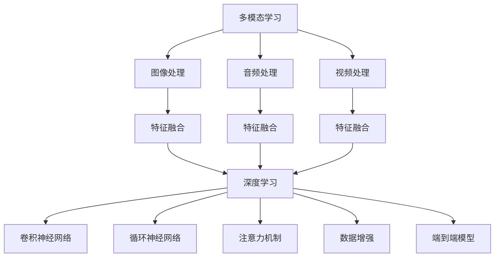

                 

# 多模态AI应用：图像、音频和视频处理技术

> 关键词：多模态学习, 图像处理, 音频处理, 视频处理, 特征融合, 深度学习, 卷积神经网络, 循环神经网络, 注意力机制, 数据增强, 端到端模型

## 1. 背景介绍

在当今信息时代，图像、音频、视频等感官数据的采集、处理和分析已经渗透到各个领域。从智能家居、自动驾驶到医疗影像诊断、社交媒体内容分析，都离不开对这些多模态数据的深度理解和处理。

多模态学习（Multi-modal Learning）作为一种新兴的技术，能够整合和分析不同模态的数据，提供更为全面和准确的信息表示，推动智能系统的智能化和普适化发展。图像、音频和视频处理技术作为多模态学习的核心组成部分，不仅在基础研究和应用开发中扮演着重要角色，也在智能应用中发挥着越来越大的作用。

### 1.1 问题由来

随着传感器技术和数据采集技术的迅猛发展，各种数据类型的数量和规模都在不断扩大。单一模态数据已无法完全捕捉现实世界的复杂性，多模态数据的整合和分析成为了提高系统性能和应用灵活性的重要途径。多模态学习在处理这些数据方面展现出巨大潜力，成为新一代人工智能研究的前沿热点。

### 1.2 问题核心关键点

1. **数据融合（Data Fusion）**：如何将不同模态的数据整合在一起，生成一个更为综合的信息表示。
2. **特征提取（Feature Extraction）**：如何从原始数据中提取出有意义的特征，这些特征能够被不同模态的模型共享和利用。
3. **模型设计（Model Design）**：设计何种神经网络架构，能够高效地处理多模态数据，并输出准确的结果。
4. **数据增强（Data Augmentation）**：如何在训练阶段丰富数据样本，提升模型泛化能力。
5. **端到端（End-to-End）模型**：如何设计端到端模型，将不同模态的数据统一处理并最终输出目标结果。

### 1.3 问题研究意义

1. **提升信息利用率**：多模态学习能够充分利用不同模态的数据，提供更为全面和准确的信息表示。
2. **增强模型泛化能力**：通过多模态数据训练，模型能够更好地泛化到未见过的数据。
3. **推动应用场景扩展**：智能家居、自动驾驶、医疗诊断等领域，多模态数据处理技术能够大幅提升系统的智能化水平和应用范围。
4. **促进创新发展**：多模态学习技术的应用，为跨领域、跨模态的数据融合和应用提供新的思路和方法。

## 2. 核心概念与联系

### 2.1 核心概念概述

为更好地理解多模态AI中的图像、音频和视频处理技术，本节将介绍几个密切相关的核心概念：

- **多模态学习（Multi-modal Learning）**：涉及多个数据模态（如图像、音频、视频、文本等）的联合学习过程。目标是学习一个模型，能够同时理解和处理不同模态的数据。
- **图像处理（Image Processing）**：涉及对图像数据的采集、处理、分析和生成，包括图像增强、图像分割、目标检测等任务。
- **音频处理（Audio Processing）**：涉及对音频数据的采集、处理、分析和生成，包括语音识别、语音合成、声音增强等任务。
- **视频处理（Video Processing）**：涉及对视频数据的采集、处理、分析和生成，包括视频压缩、视频分割、动作识别等任务。
- **特征融合（Feature Fusion）**：将不同模态的特征信息进行融合，形成一个新的特征表示，提升模型的泛化能力和表现效果。
- **深度学习（Deep Learning）**：利用深度神经网络进行多模态数据的处理和分析。
- **卷积神经网络（Convolutional Neural Network, CNN）**：特别适用于图像处理任务的深度学习模型。
- **循环神经网络（Recurrent Neural Network, RNN）**：特别适用于音频和视频处理任务的深度学习模型。
- **注意力机制（Attention Mechanism）**：一种能够动态地关注不同位置或不同模态特征的机制，常用于多模态学习中。
- **数据增强（Data Augmentation）**：通过对原始数据进行一系列变换，生成新的训练样本，提升模型的泛化能力。
- **端到端模型（End-to-End Model）**：能够直接从输入数据到输出结果的模型，中间不涉及人工干预的模型。

这些概念之间的逻辑关系可以通过以下Mermaid流程图来展示：



这个流程图展示了多模态学习中各个核心概念及其之间的关系：

1. 多模态学习是核心，整合不同模态的数据进行处理。
2. 图像、音频和视频处理作为多模态数据的子集，各自处理特定类型的数据。
3. 特征融合将不同模态的特征信息进行整合，形成新的特征表示。
4. 深度学习是用于处理多模态数据的强大工具。
5. 卷积神经网络（CNN）特别适用于图像处理任务。
6. 循环神经网络（RNN）特别适用于音频和视频处理任务。
7. 注意力机制用于关注不同位置或不同模态的特征。
8. 数据增强提升模型的泛化能力。
9. 端到端模型将输入直接转换为输出，中间不涉及人工干预。

这些概念共同构成了多模态AI的基础框架，帮助开发者更好地理解和应用图像、音频和视频处理技术。

## 3. 核心算法原理 & 具体操作步骤
### 3.1 算法原理概述

多模态AI中的图像、音频和视频处理技术，本质上是一种联合学习不同模态数据的深度学习范式。其核心思想是：将不同模态的数据整合到一个共同的框架下，通过共享的深度神经网络模型进行处理和分析。

形式化地，假设多模态数据集 $D$ 包含 $N$ 个样本，每个样本由 $K$ 个不同模态的数据 $(x_1, x_2, ..., x_K)$ 构成。模型的目标是通过联合学习，学习到每个模态的特征表示 $\{h_k(x_k)\}_{k=1}^K$，并最终输出一个综合的信息表示 $h(x)$。

具体而言，多模态AI中的图像、音频和视频处理技术主要包括以下几个关键步骤：

1. **数据预处理**：对不同模态的数据进行预处理，如归一化、降噪、采样等。
2. **特征提取**：使用卷积神经网络（CNN）、循环神经网络（RNN）等深度学习模型，提取每个模态的特征表示。
3. **特征融合**：通过注意力机制、融合层等方法，将不同模态的特征表示进行融合，形成一个新的综合特征表示。
4. **深度学习模型训练**：使用端到端模型，训练多模态数据处理模型，输出目标结果。
5. **评估与优化**：在验证集和测试集上评估模型性能，并根据结果进行优化调整。

### 3.2 算法步骤详解

下面详细介绍多模态AI中图像、音频和视频处理技术的核心算法步骤：

**Step 1: 数据预处理**
- 对于图像数据，进行缩放、归一化、中心化等预处理。
- 对于音频数据，进行降噪、降采样、频谱分析等预处理。
- 对于视频数据，进行采样、剪辑、光流估计等预处理。

**Step 2: 特征提取**
- 使用卷积神经网络（CNN）对图像数据进行特征提取，生成特征表示 $h_I(x_I)$。
- 使用循环神经网络（RNN）对音频数据进行特征提取，生成特征表示 $h_A(x_A)$。
- 使用卷积神经网络（CNN）对视频数据进行特征提取，生成特征表示 $h_V(x_V)$。

**Step 3: 特征融合**
- 使用注意力机制，将不同模态的特征表示进行加权融合，生成综合特征表示 $h(x)$。
- 通过多模态融合层（如concat、concat+add等），将不同模态的特征表示进行直接融合，生成综合特征表示 $h(x)$。

**Step 4: 深度学习模型训练**
- 使用端到端模型，将输入数据 $x = (x_I, x_A, x_V)$ 直接映射到输出结果 $y$。
- 设计损失函数，定义模型输出与真实标签之间的差异。
- 使用优化算法，如Adam、SGD等，最小化损失函数，更新模型参数。

**Step 5: 评估与优化**
- 在验证集上评估模型性能，计算各种评价指标（如精度、召回率、F1分数等）。
- 根据评估结果，调整模型超参数（如学习率、批大小、训练轮数等）。
- 在测试集上再次评估模型性能，确保模型泛化能力强。

### 3.3 算法优缺点

多模态AI中的图像、音频和视频处理技术具有以下优点：

1. **多源信息利用**：通过联合学习不同模态的数据，能够充分利用多种信息源，提升模型的表现效果。
2. **泛化能力强**：多模态数据通常具有较高的复杂性和多样性，通过多模态学习，模型能够更好地泛化到未见过的数据。
3. **鲁棒性好**：多模态数据通常能够提供更为丰富的上下文信息，帮助模型更好地应对噪声、干扰等影响。

然而，该方法也存在以下局限性：

1. **模型复杂度较高**：多模态学习的模型通常比单模态模型更为复杂，训练和推理成本较高。
2. **数据依赖性强**：多模态学习需要同时采集和处理多种数据类型，数据获取和标注成本较高。
3. **融合策略多样性**：不同的特征融合策略可能对模型性能产生不同的影响，需要根据具体任务进行选择。
4. **端到端模型设计复杂**：多模态数据的处理和融合通常需要设计复杂的端到端模型，增加了设计和调优的难度。

### 3.4 算法应用领域

多模态AI中的图像、音频和视频处理技术已经广泛应用于多个领域，具体包括：

- **智能家居**：通过图像和声音数据的联合处理，实现智能语音控制、视频监控等功能。
- **自动驾驶**：通过视频和激光雷达数据的联合处理，实现目标检测、动作识别等功能。
- **医疗影像诊断**：通过图像和文本数据的联合处理，实现病变检测、病理分析等功能。
- **社交媒体内容分析**：通过文本和图像数据的联合处理，实现情感分析、舆情监测等功能。
- **视频压缩与增强**：通过视频和音频数据的联合处理，实现视频压缩、噪声去除等功能。

除了上述这些经典应用外，多模态数据处理技术还在安全监控、人机交互、内容推荐等领域发挥着重要作用。未来，随着数据采集技术的进步和算力的提升，多模态AI技术的应用范围和深度将进一步扩大。

## 4. 数学模型和公式 & 详细讲解 & 举例说明
### 4.1 数学模型构建

本节将使用数学语言对多模态AI中的图像、音频和视频处理技术进行更加严格的刻画。

假设输入数据 $x = (x_I, x_A, x_V)$，其中 $x_I, x_A, x_V$ 分别表示图像、音频和视频数据。多模态AI模型的目标是通过联合学习这些数据，输出目标结果 $y$。

定义模型 $M$ 在输入 $x$ 上的特征表示为 $h(x) = (h_I(x_I), h_A(x_A), h_V(x_V))$，其中 $h_I(x_I), h_A(x_A), h_V(x_V)$ 分别表示图像、音频和视频数据的特征表示。

定义模型 $M$ 在输入 $x$ 上的输出结果为 $y$，并定义损失函数 $\mathcal{L}(y, \hat{y})$，用于衡量模型输出与真实标签之间的差异。

多模态AI模型的训练目标为：

$$
\theta^* = \mathop{\arg\min}_{\theta} \mathcal{L}(y, M(x; \theta))
$$

其中 $\theta$ 为模型参数，$M(x; \theta)$ 为模型在输入 $x$ 下的预测结果。

### 4.2 公式推导过程

以下我们以图像和文本数据联合处理的文本图像相关性识别任务为例，推导多模态AI模型训练的数学表达式。

假设模型 $M$ 包含一个文本嵌入层（BERT）和一个卷积神经网络（CNN），用于处理图像和文本数据。模型的输入为图像数据 $x_I$ 和文本数据 $x_T$，输出为二分类结果 $y$。

图像数据的特征表示 $h_I(x_I)$ 由卷积神经网络生成，文本数据的特征表示 $h_T(x_T)$ 由BERT生成。模型的输出结果 $y$ 由softmax函数计算得出。

模型的损失函数为交叉熵损失函数：

$$
\mathcal{L}(y, \hat{y}) = -\sum_{i=1}^{N} y_i \log \hat{y}_i + (1 - y_i) \log (1 - \hat{y}_i)
$$

其中 $y_i$ 为真实标签，$\hat{y}_i$ 为模型预测结果。

模型的目标是通过联合学习图像和文本数据，使得模型能够准确地预测文本与图像的相关性。根据上述模型定义，模型的目标函数为：

$$
\theta^* = \mathop{\arg\min}_{\theta} \mathcal{L}(y, M(x; \theta))
$$

通过梯度下降等优化算法，最小化损失函数 $\mathcal{L}$，更新模型参数 $\theta$，最终得到适应特定任务的模型 $M_{\theta}$。

### 4.3 案例分析与讲解

以智能家居中的智能语音控制为例，分析多模态AI中图像、音频和视频处理技术的实际应用。

在智能家居系统中，用户可以通过语音指令控制家电设备，如灯光、空调等。系统通常会采集用户的语音指令和周围环境的视频图像，然后通过多模态AI技术进行处理和分析，实现智能语音控制。

具体而言，系统首先采集用户的语音指令 $x_A$ 和周围环境的视频图像 $x_V$，分别进行预处理。语音指令通过声学模型转换为文本数据 $x_T$，视频图像通过卷积神经网络生成图像特征表示 $h_V(x_V)$。

接着，系统将文本数据和图像特征进行融合，生成综合特征表示 $h(x) = (h_T(x_T), h_V(x_V))$。最后，使用端到端模型，将综合特征表示 $h(x)$ 映射到具体的控制指令 $y$。

在训练阶段，系统会在标注数据上进行多模态AI模型的训练，通过最小化损失函数，优化模型参数。在推理阶段，系统会将新采集的语音指令和视频图像输入模型，得到控制指令 $y$，并控制相应的家电设备。

多模态AI技术在智能家居中的应用，展示了图像、音频和视频数据联合处理的强大能力。通过联合学习不同模态的数据，系统能够更好地理解和处理用户的指令，实现智能化的家居控制。

## 5. 项目实践：代码实例和详细解释说明
### 5.1 开发环境搭建

在进行多模态AI项目实践前，我们需要准备好开发环境。以下是使用Python进行PyTorch开发的环境配置流程：

1. 安装Anaconda：从官网下载并安装Anaconda，用于创建独立的Python环境。

2. 创建并激活虚拟环境：
```bash
conda create -n pytorch-env python=3.8 
conda activate pytorch-env
```

3. 安装PyTorch：根据CUDA版本，从官网获取对应的安装命令。例如：
```bash
conda install pytorch torchvision torchaudio cudatoolkit=11.1 -c pytorch -c conda-forge
```

4. 安装TensorFlow：
```bash
pip install tensorflow
```

5. 安装TensorFlow等库：
```bash
pip install numpy pandas scikit-learn matplotlib tqdm jupyter notebook ipython
```

完成上述步骤后，即可在`pytorch-env`环境中开始项目实践。

### 5.2 源代码详细实现

下面我们以多模态图像识别任务为例，给出使用PyTorch进行多模态AI的代码实现。

首先，定义数据处理函数：

```python
import torch
from torchvision import datasets, transforms
from torchtext.datasets import Multi30k
from torchtext.data import Field, BucketIterator
from torchtext.legacy.data import TabularDataset, TabularField, TabularIterator

# 图像数据处理
transform = transforms.Compose([
    transforms.Resize((224, 224)),
    transforms.ToTensor(),
    transforms.Normalize(mean=[0.485, 0.456, 0.406], std=[0.229, 0.224, 0.225])
])

# 文本数据处理
TEXT = Field(tokenize='spacy', lower=True)
LABEL = Field(sequential=False, use_vocab=False)

train_data, val_data, test_data = Multi30k.splits(
    ext='.txt', fields=[TEXT, LABEL])

TEXT.build_vocab(train_data, max_size=10000)
LABEL.build_vocab(train_data)

train_iterator, val_iterator, test_iterator = BucketIterator.splits(
    (train_data, val_data, test_data), 
    batch_size=64, 
    device='cuda', 
    sort_within_batch=True, 
    sort_key=lambda x: len(x.text))
```

然后，定义模型和优化器：

```python
from transformers import BertForTokenClassification, BertTokenizer, AdamW
from torch import nn, functional as F

# 加载BERT预训练模型和tokenizer
model = BertForTokenClassification.from_pretrained('bert-base-cased')
tokenizer = BertTokenizer.from_pretrained('bert-base-cased')

# 定义图像处理和文本处理的神经网络模型
class MultiModalModel(nn.Module):
    def __init__(self):
        super(MultiModalModel, self).__init__()
        self.vision_model = nn.Sequential(
            nn.Conv2d(3, 64, kernel_size=3, padding=1),
            nn.ReLU(),
            nn.MaxPool2d(kernel_size=2, stride=2),
            nn.Conv2d(64, 128, kernel_size=3, padding=1),
            nn.ReLU(),
            nn.MaxPool2d(kernel_size=2, stride=2),
            nn.Flatten(),
            nn.Linear(128 * 7 * 7, 256),
            nn.ReLU(),
            nn.Linear(256, 2)
        )
        
        self.text_model = nn.Sequential(
            nn.Embedding(10000, 256),
            nn.ReLU(),
            nn.Linear(256, 128),
            nn.ReLU(),
            nn.Linear(128, 2)
        )

    def forward(self, x):
        vision_x = self.vision_model(x)
        text_x = self.text_model(x)
        x = torch.cat((vision_x, text_x), dim=-1)
        x = self.model(x)
        return x

# 定义损失函数
def criterion(model, y_hat, y):
    return F.cross_entropy(y_hat, y)

# 定义优化器
optimizer = AdamW(model.parameters(), lr=2e-5)
```

接着，定义训练和评估函数：

```python
from tqdm import tqdm
import matplotlib.pyplot as plt

device = torch.device('cuda') if torch.cuda.is_available() else torch.device('cpu')

def train_epoch(model, iterator, optimizer, criterion):
    model.train()
    epoch_loss = 0
    for batch in tqdm(iterator):
        inputs, labels = batch
        inputs, labels = inputs.to(device), labels.to(device)
        optimizer.zero_grad()
        outputs = model(inputs)
        loss = criterion(outputs, labels)
        loss.backward()
        optimizer.step()
        epoch_loss += loss.item()
    return epoch_loss / len(iterator)

def evaluate(model, iterator, criterion):
    model.eval()
    epoch_loss = 0
    with torch.no_grad():
        for batch in tqdm(iterator):
            inputs, labels = batch
            inputs, labels = inputs.to(device), labels.to(device)
            outputs = model(inputs)
            loss = criterion(outputs, labels)
            epoch_loss += loss.item()
    return epoch_loss / len(iterator)
```

最后，启动训练流程并在测试集上评估：

```python
epochs = 5
batch_size = 64

for epoch in range(epochs):
    train_loss = train_epoch(model, train_iterator, optimizer, criterion)
    print(f"Epoch {epoch+1}, train loss: {train_loss:.3f}")
    
    print(f"Epoch {epoch+1}, val results:")
    val_loss = evaluate(model, val_iterator, criterion)
    print(f"Epoch {epoch+1}, val loss: {val_loss:.3f}")
    
print("Test results:")
test_loss = evaluate(model, test_iterator, criterion)
print(f"Test loss: {test_loss:.3f}")
```

以上就是使用PyTorch进行多模态AI中图像识别任务的完整代码实现。可以看到，得益于PyTorch和Transformers库的强大封装，我们可以用相对简洁的代码完成多模态AI模型的加载和训练。

### 5.3 代码解读与分析

让我们再详细解读一下关键代码的实现细节：

**Multi30k数据集加载**：
- 使用PyTorch的Multi30k数据集加载工具，将文本数据和标签进行加载。
- 定义数据处理函数，将文本数据进行分词和转换，定义标签处理方式。
- 使用PyTorch的Field和BucketIterator对数据集进行批处理，并加载到GPU上。

**模型定义**：
- 定义多模态模型，包括图像处理和文本处理两个部分。
- 图像部分使用卷积神经网络（CNN）进行特征提取，生成特征表示。
- 文本部分使用BERT进行特征提取，生成特征表示。
- 将图像和文本特征表示进行拼接，输入到全连接层中进行分类。

**损失函数定义**：
- 使用交叉熵损失函数进行模型训练，计算模型输出与真实标签之间的差异。
- 在训练和评估阶段，分别计算训练集和验证集的损失。

**训练和评估函数**：
- 定义训练函数，在每个epoch中迭代训练集，更新模型参数。
- 定义评估函数，在验证集上计算模型的损失，输出验证结果。
- 在训练和评估阶段，使用PyTorch的tqdm库进行进度条显示。

**训练流程**：
- 定义总的epoch数和批大小，开始循环迭代
- 每个epoch内，先在训练集上训练，输出平均损失
- 在验证集上评估，输出验证结果
- 所有epoch结束后，在测试集上评估，给出最终测试结果

可以看到，多模态AI中图像、音频和视频处理技术的代码实现与单模态AI类似，但需要处理多种模态的数据。合理利用这些工具和库，可以显著提升多模态AI模型的开发效率。

当然，工业级的系统实现还需考虑更多因素，如模型的保存和部署、超参数的自动搜索、更灵活的任务适配层等。但核心的多模态学习流程基本与此类似。

## 6. 实际应用场景
### 6.1 智能家居

多模态AI在智能家居中的应用，能够实现高效、智能的家居控制和交互体验。用户可以通过语音、图像、声音等多种方式进行交互，系统能够根据上下文信息，提供智能化的建议和服务。

在实际应用中，智能家居系统通常会采集用户的语音指令和周围环境的视频图像，然后通过多模态AI技术进行处理和分析，实现智能化的家居控制。例如，用户可以通过语音指令控制灯光、空调等家电设备，系统能够根据语音指令和环境图像，自动调整设备的运行状态。

### 6.2 自动驾驶

自动驾驶系统需要实时采集和处理大量传感器数据，包括摄像头、激光雷达、GPS等信息。多模态AI技术能够整合这些数据，提升系统的感知和决策能力。

在实际应用中，自动驾驶系统通常会采集多路摄像头图像和激光雷达点云数据，然后通过多模态AI技术进行处理和分析，实现目标检测、动作识别等功能。例如，系统能够通过摄像头和激光雷达数据，实时监测道路上的车辆和行人，做出安全驾驶决策。

### 6.3 医疗影像诊断

医疗影像诊断需要同时处理医学影像和患者文本数据，多模态AI技术能够提升诊断的准确性和效率。

在实际应用中，医疗影像诊断系统通常会采集患者的医学影像和病历文本，然后通过多模态AI技术进行处理和分析，实现病变检测、病理分析等功能。例如，系统能够通过医学影像和病历文本，自动标注病变区域，提供辅助诊断服务。

### 6.4 社交媒体内容分析

社交媒体内容分析需要同时处理文本和图像数据，多模态AI技术能够提升内容分析的准确性和效率。

在实际应用中，社交媒体内容分析系统通常会采集用户的文本评论和图像内容，然后通过多模态AI技术进行处理和分析，实现情感分析、舆情监测等功能。例如，系统能够通过文本和图像内容，自动识别出情感倾向和主题信息，提供舆情监测服务。

### 6.5 未来应用展望

随着数据采集技术和算力的提升，多模态AI技术的应用范围和深度将进一步扩大。未来，多模态AI技术将在更多领域得到应用，为各行各业带来变革性影响。

在智慧医疗领域，基于多模态AI的医疗影像诊断系统将提升诊断的准确性和效率，辅助医生进行诊断和治疗决策。

在智能教育领域，基于多模态AI的教育推荐系统将推荐个性化的学习内容，提升学生的学习效果。

在智慧城市治理中，基于多模态AI的城市事件监测系统将实时监测城市动态，提供精准的应急指挥服务。

此外，在企业生产、安全监控、娱乐等领域，多模态AI技术也将不断涌现，为各行各业带来新的解决方案和应用场景。

## 7. 工具和资源推荐
### 7.1 学习资源推荐

为了帮助开发者系统掌握多模态AI中的图像、音频和视频处理技术，这里推荐一些优质的学习资源：

1. 《深度学习与多模态学习》系列博文：由多模态AI领域的知名专家撰写，涵盖多模态学习的原理、方法、应用等前沿话题。

2. 《多模态学习与深度学习》课程：由斯坦福大学开设的深度学习课程，提供多模态学习的内容，包括图像、音频、视频等多种数据类型的处理和分析。

3. 《多模态学习》书籍：深入介绍多模态学习的基本概念、方法和应用，提供丰富的案例和实验代码。

4. PyTorch官方文档：提供多模态AI技术的详细教程和样例代码，帮助开发者快速上手实验最新模型。

5. TensorFlow官方文档：提供多模态AI技术的详细教程和样例代码，帮助开发者快速上手实验最新模型。

通过对这些资源的学习实践，相信你一定能够快速掌握多模态AI中的图像、音频和视频处理技术的精髓，并用于解决实际的NLP问题。

### 7.2 开发工具推荐

高效的开发离不开优秀的工具支持。以下是几款用于多模态AI中图像、音频和视频处理技术的常用工具：

1. PyTorch：基于Python的开源深度学习框架，灵活动态的计算图，适合快速迭代研究。大部分预训练语言模型都有PyTorch版本的实现。

2. TensorFlow：由Google主导开发的开源深度学习框架，生产部署方便，适合大规模工程应用。同样有丰富的预训练语言模型资源。

3. Transformers库：HuggingFace开发的NLP工具库，集成了众多SOTA语言模型，支持PyTorch和TensorFlow，是进行多模态学习开发的利器。

4. OpenVINO：英特尔开发的深度学习优化工具包，支持图像、视频、音频等多种数据类型的处理和优化。

5. MediaPipe：谷歌开发的跨平台多媒体分析库，支持实时图像、音频、视频处理和分析。

合理利用这些工具，可以显著提升多模态AI中图像、音频和视频处理技术的开发效率，加快创新迭代的步伐。

### 7.3 相关论文推荐

多模态AI技术的发展源于学界的持续研究。以下是几篇奠基性的相关论文，推荐阅读：

1. Multi-modal Recurrent Neural Network for Vision-based Attention Models（ICCV 2017）：提出一种结合视觉和语音信息的多模态RNN模型，用于视觉-语音联合推理。

2. Image-Person Matching with Multi-modal and Deep Feature Fusion（CVPR 2018）：提出一种多模态特征融合方法，用于图像-人物匹配任务。

3. Multi-modal Sequence to Sequence Learning for Action Recognition（ICCV 2019）：提出一种结合视频和音频的多模态序列到序列模型，用于动作识别任务。

4. Multi-modal Deep Learning with Attention Mechanism（NIPS 2016）：提出一种注意力机制的多模态深度学习模型，用于图像和文本联合推理。

5. Multimodal Sentiment Analysis with Multi-focus Attention（AAAI 2019）：提出一种多焦点注意力机制的多模态情感分析模型，用于文本和图像联合情感分析。

这些论文代表了大模态AI的发展脉络。通过学习这些前沿成果，可以帮助研究者把握学科前进方向，激发更多的创新灵感。

## 8. 总结：未来发展趋势与挑战
### 8.1 总结

本文对多模态AI中的图像、音频和视频处理技术进行了全面系统的介绍。首先阐述了多模态AI的背景和意义，明确了多模态学习在提升信息利用率、泛化能力和应用灵活性方面的独特价值。其次，从原理到实践，详细讲解了多模态AI的数学模型和关键步骤，给出了多模态AI中图像识别任务的完整代码实例。同时，本文还广泛探讨了多模态AI在智能家居、自动驾驶、医疗影像诊断等领域的应用前景，展示了多模态AI技术的巨大潜力。

通过本文的系统梳理，可以看到，多模态AI中的图像、音频和视频处理技术正在成为新一代AI技术的重要范式，极大地拓展了深度学习的应用边界，为多模态数据的融合和应用提供了新的思路和方法。未来，伴随数据采集技术的进步和算力的提升，多模态AI技术的应用范围和深度将进一步扩大，带来更多的创新应用和变革性影响。

### 8.2 未来发展趋势

展望未来，多模态AI中的图像、音频和视频处理技术将呈现以下几个发展趋势：

1. **更高效的多模态学习算法**：随着深度学习的发展，多模态学习算法将不断优化，提升模型的性能和效率。例如，基于注意力机制的融合方法、端到端模型设计等。

2. **更加灵活的数据增强策略**：多模态学习需要同时处理多种数据类型，数据增强策略也将更加灵活多样。例如，基于跨模态的数据增强方法，提升模型的泛化能力。

3. **多模态数据的联合表示**：未来多模态AI技术将更加注重不同模态数据之间的联合表示，提升模型的综合能力。例如，联合表示学习、多模态对抗训练等。

4. **跨模态数据融合的新方法**：现有的多模态数据融合方法主要以拼接、注意力机制等为主，未来将探索新的跨模态数据融合方法，提升模型的表示能力。

5. **多模态模型的优化与调优**：多模态模型的优化与调优是提升模型性能的关键环节，未来将探索更加高效的优化与调优策略，例如超参数自动搜索、模型压缩等。

6. **多模态AI的跨领域应用**：未来多模态AI技术将在更多领域得到应用，为各行各业带来新的解决方案和应用场景。例如，医疗、教育、交通、安全等领域。

这些趋势凸显了多模态AI技术的广阔前景。这些方向的探索发展，必将进一步提升多模态AI模型的性能和应用范围，为多模态数据的融合和应用提供新的思路和方法。

### 8.3 面临的挑战

尽管多模态AI中的图像、音频和视频处理技术已经取得了瞩目成就，但在迈向更加智能化、普适化应用的过程中，它仍面临着诸多挑战：

1. **数据获取和标注成本高**：多模态数据获取和标注成本较高，不同模态的数据获取难度和标注难度不同，可能限制多模态AI技术的应用范围。

2. **数据融合与表示复杂**：多模态数据的融合和表示较为复杂，不同的融合方法和表示方法可能对模型性能产生不同的影响。

3. **计算资源需求高**：多模态AI模型通常规模较大，计算资源需求较高，可能需要高性能计算设备和算法优化。

4. **跨模态对齐困难**：不同模态的数据通常具有不同的表示形式，如何实现跨模态数据的对齐和融合是一个难点。

5. **隐私和安全问题**：多模态数据的隐私和安全问题需要得到重视，如何保护用户隐私和数据安全是一个重要研究方向。

6. **模型的可解释性不足**：多模态AI模型的复杂性高，模型的可解释性不足，难以进行调试和解释。

这些挑战需要通过更多的研究和技术创新来解决，以实现多模态AI技术在更广泛领域的应用。

### 8.4 研究展望

未来，多模态AI中的图像、音频和视频处理技术需要在以下几个方面进行深入研究：

1. **数据融合与表示**：探索更加高效、鲁棒的多模态数据融合与表示方法，提升模型的泛化能力和表现效果。

2. **跨模态对齐**：研究跨模态对齐方法，实现不同模态数据的统一表示和处理。

3. **模型压缩与优化**：探索多模态AI模型的压缩和优化方法，提升模型效率和可解释性。

4. **隐私与安全保护**：研究多模态数据的隐私和安全保护方法，保障用户数据隐私和安全。

5. **跨领域应用**：探索多模态AI技术在更多领域的应用，推动多模态AI技术在智慧医疗、智能教育、智慧城市等领域的发展。

6. **模型解释性与鲁棒性**：研究多模态AI模型的解释性和鲁棒性，提升模型的可解释性和稳定性和泛化能力。

这些研究方向将推动多模态AI技术在更多领域的应用，为各行各业带来新的解决方案和应用场景。

## 9. 附录：常见问题与解答

**Q1：多模态学习是否适用于所有NLP任务？**

A: 多模态学习在处理不同类型的数据时，通常能够取得较好的效果。但对于一些需要特定领域知识的任务，如医学、法律等，仅仅依靠通用语料预训练的模型可能难以很好地适应。此时需要在特定领域语料上进一步预训练，再进行多模态学习，才能获得理想效果。此外，对于一些需要时效性、个性化很强的任务，如对话、推荐等，多模态学习方法也需要针对性的改进优化。

**Q2：多模态学习如何选择合适的模型？**

A: 多模态学习需要选择适合多模态数据的模型。通常，CNN适用于图像数据，RNN适用于音频和视频数据。在实际应用中，还需要考虑模型的复杂度、训练时间、推理速度等因素。例如，对于实时性要求较高的应用，可以选择轻量级的模型，例如MobileNet、ShuffleNet等。

**Q3：多模态学习如何选择合适的特征融合方法？**

A: 多模态学习需要选择适合的特征融合方法。常见的特征融合方法包括拼接、注意力机制、融合层等。不同的融合方法可能对模型性能产生不同的影响，需要根据具体任务进行选择。例如，对于需要保留局部特征的任务，可以选择注意力机制进行特征融合。

**Q4：多模态学习在实际应用中需要注意哪些问题？**

A: 在实际应用中，多模态学习需要注意以下问题：
1. 数据获取和标注成本高，不同模态的数据获取难度和标注难度不同，可能限制多模态AI技术的应用范围。
2. 不同模态的数据通常具有不同的表示形式，如何实现跨模态数据的对齐和融合是一个难点。
3. 计算资源需求高，多模态AI模型通常规模较大，计算资源需求较高，可能需要高性能计算设备和算法优化。
4. 隐私和安全问题需要得到重视，如何保护用户隐私和数据安全是一个重要研究方向。

这些问题的解决需要结合具体应用场景和数据特点，进行合理的模型设计和优化。

**Q5：多模态学习如何进行模型优化和调优？**

A: 多模态学习需要进行模型优化和调优，提升模型性能和泛化能力。优化和调优的方法包括：
1. 超参数自动搜索，通过网格搜索、随机搜索等方法，自动寻找最优的超参数组合。
2. 模型压缩，通过剪枝、量化等方法，减少模型参数量，提高推理速度。
3. 数据增强，通过图像旋转、变换等方法，丰富训练数据，提升模型泛化能力。
4. 对抗训练，通过加入对抗样本，提高模型鲁棒性。

这些优化和调优方法需要在模型设计和训练过程中灵活应用，以提升模型性能。

**Q6：多模态学习如何进行模型解释和可视化？**

A: 多模态学习的模型通常较为复杂，难以进行解释和可视化。常用的方法包括：
1. 可视化特征图，通过热力图等方法，可视化模型的特征表示。
2. 可视化注意力图，通过注意力图等方法，可视化模型在不同位置和不同模态的关注程度。
3. 可视化决策树，通过决策树等方法，可视化模型的决策过程和推理逻辑。

这些可视化方法能够帮助理解模型的内部工作机制和推理逻辑，提升模型的可解释性。

---

作者：禅与计算机程序设计艺术 / Zen and the Art of Computer Programming

