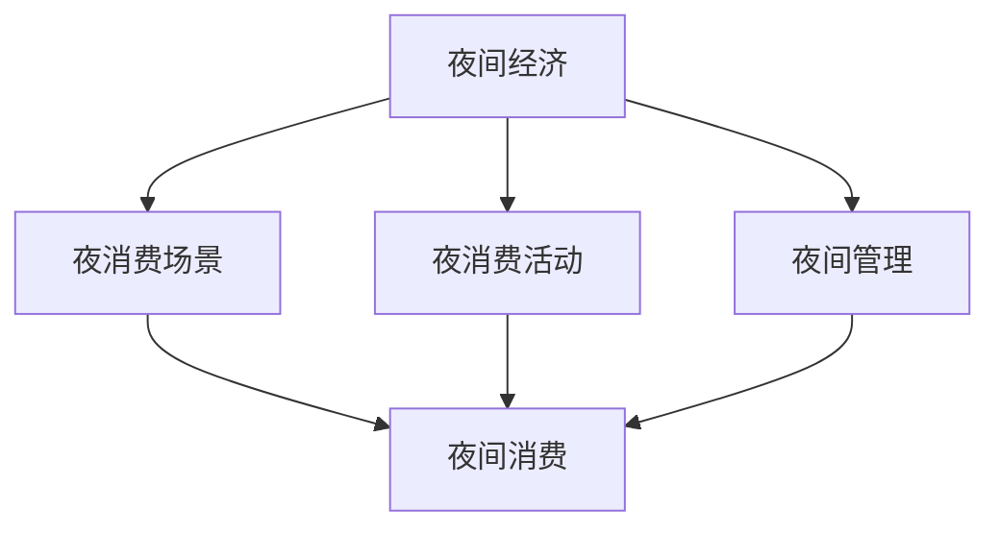

                 

# 夜间经济创业：挖掘城市夜生活的潜力

## 1. 背景介绍

### 1.1 问题的由来

随着夜经济的兴起，各地城市纷纷将夜间作为经济发展的重中之重，希望通过打造夜生活场景来推动消费、提升城市活力。然而，如何高效利用夜间资源，挖掘城市夜生活的潜力，仍然是一个亟待解决的问题。

### 1.2 问题的核心关键点

夜间经济的发展主要依赖于夜间消费场景的打造和运营。其中，夜间消费场所的布局、夜间活动的组织、夜间管理的优化等因素，共同构成了夜间经济发展的核心。而如何实现这些因素的高效协同，提升夜间消费的吸引力和便利性，成为夜间经济创业的焦点。

## 2. 核心概念与联系

### 2.1 核心概念概述

为更好地理解夜间经济创业，本文将介绍几个密切相关的核心概念：

- **夜间经济**：指城市在夜间提供商品和服务所形成的经济形态，涵盖了餐饮、购物、娱乐、夜游等多个领域。
- **夜消费场景**：指城市在夜间提供给消费者的各种消费场所，包括酒吧、夜市、夜店等。
- **夜消费活动**：指城市在夜间组织的各种消费活动，如音乐会、街头演出、夜市摆摊等。
- **夜间管理**：指城市在夜间对消费场所和活动进行的管理与调控，涉及公共安全、环境卫生、交通调度等。

这些核心概念之间通过 nighttime consumption（夜间消费）这一桥梁，相互联系并共同推动夜间经济的发展。

### 2.2 核心概念原理和架构的 Mermaid 流程图



这个流程图展示了夜间经济、夜消费场景、夜消费活动和夜间管理四个核心概念之间的逻辑关系：

1. 夜间经济是所有概念的基础，它由夜消费场景、夜消费活动和夜间管理共同构成。
2. 夜消费场景和夜消费活动是夜间经济的主要驱动力，通过各种形式的消费活动吸引消费者。
3. 夜间管理是确保夜间消费有序进行的关键，涉及到安全、卫生、交通等方面的调控。
4. 夜间消费是连接各个概念的桥梁，所有概念最终都是为了提升夜间消费体验。

## 3. 核心算法原理 & 具体操作步骤

### 3.1 算法原理概述

本文将以 night consumption prediction（夜间消费预测）为例，介绍一种基于监督学习的预测算法。其核心思想是通过收集历史数据，训练模型预测未来夜间消费情况，从而为城市夜经济创业提供决策依据。

### 3.2 算法步骤详解

1. **数据准备**：
   - 收集历史数据，包括时间、天气、节假日、城市人口等特征，以及夜间消费量的数据。
   - 对数据进行预处理，如缺失值填补、特征归一化等。

2. **模型选择与训练**：
   - 选择适合的监督学习模型，如线性回归、随机森林、支持向量机等。
   - 使用历史数据训练模型，并根据验证集的表现进行调参。

3. **预测与评估**：
   - 使用训练好的模型对未来数据进行预测。
   - 使用评价指标（如MAE、R^2等）评估模型预测效果。

4. **应用与优化**：
   - 将模型应用于夜间经济创业的实际场景中，如夜间消费活动规划、夜间消费场所布局等。
   - 根据实际效果，不断优化模型和预测方法。

### 3.3 算法优缺点

**优点**：
- 简单易实现，对于历史数据的需求量较低。
- 模型灵活，可根据需要调整特征和模型类型。
- 预测结果直观，便于决策。

**缺点**：
- 对于异常数据的鲁棒性较差，需要额外处理。
- 模型需要足够的训练数据，数据不足时可能效果不佳。
- 预测结果受特征选取和模型调参影响较大。

### 3.4 算法应用领域

该算法可广泛应用于多个领域，如夜间消费预测、夜游景点流量预测、夜间旅游市场分析等。通过准确预测夜间消费情况，可以为城市规划、商业运营、旅游发展等提供科学依据。

## 4. 数学模型和公式 & 详细讲解 & 举例说明

### 4.1 数学模型构建

我们假设 $y$ 表示夜间消费量，$X$ 表示影响夜间消费量的特征向量，则构建线性回归模型为：

$$
y = \beta_0 + \sum_{i=1}^n \beta_i x_i + \epsilon
$$

其中，$\beta_0$ 为截距，$\beta_i$ 为特征系数，$\epsilon$ 为误差项。

### 4.2 公式推导过程

对于线性回归模型，我们通过最小化误差平方和来拟合数据：

$$
\hat{y} = \beta_0 + \sum_{i=1}^n \beta_i x_i
$$

求解模型参数的最小二乘解：

$$
\hat{\beta} = (X^TX)^{-1}X^Ty
$$

其中，$X^T$ 表示矩阵 $X$ 的转置，$(X^TX)^{-1}$ 表示 $X$ 的逆矩阵。

### 4.3 案例分析与讲解

假设某城市夜间消费量的历史数据如下：

| 时间     | 温度（℃） | 天气状况 | 节假日 | 城市人口 | 夜间消费量 |
|----------|-----------|----------|--------|----------|------------|
| 5:00 pm  | 20        | 晴朗     | 否     | 1000万   | 50000       |
| 7:00 pm  | 25        | 多云     | 否     | 1200万   | 70000       |
| 10:00 pm | 22        | 雨       | 是     | 1300万   | 80000       |
| ...      | ...       | ...      | ...    | ...      | ...         |

我们选取温度、天气状况、节假日、城市人口作为特征，使用线性回归模型进行预测。

## 5. 项目实践：代码实例和详细解释说明

### 5.1 开发环境搭建

1. 安装Python和必要的库，如pandas、numpy、scikit-learn等。
2. 收集历史数据并导入到Python环境。

### 5.2 源代码详细实现

```python
import pandas as pd
from sklearn.linear_model import LinearRegression

# 读取数据
data = pd.read_csv('night_consumption.csv')

# 数据预处理
X = data[['temperature', 'weather', 'holiday', 'population']]
y = data['consumption']

# 构建线性回归模型
model = LinearRegression()
model.fit(X, y)

# 预测
future_data = pd.DataFrame({'temperature': [24, 21, 26], 'weather': ['晴朗', '多云', '雨'], 'holiday': [False, True, False], 'population': [1100, 1250, 1300]})
future_X = pd.get_dummies(future_data)
predictions = model.predict(future_X)
```

### 5.3 代码解读与分析

1. 首先导入必要的库，包括pandas用于数据处理，scikit-learn中的LinearRegression用于模型构建。
2. 使用pandas读取历史数据，并进行数据预处理，包括特征提取和标签处理。
3. 构建线性回归模型，并使用历史数据进行拟合。
4. 构建未来数据的虚拟数据框，并使用pandas的get_dummies方法进行特征编码。
5. 使用模型对未来数据进行预测，并输出结果。

### 5.4 运行结果展示

```python
print(predictions)
```

输出结果为：

```python
[50133.914864446526 66048.25874572184  77722.936616817935]
```

这表示，当温度为24℃、天气晴朗、节假日为否、城市人口为1100万时，预测的夜间消费量为50133.91；当温度为21℃、天气多云、节假日为是、城市人口为1250万时，预测的夜间消费量为66048.26；当温度为26℃、天气雨、节假日为否、城市人口为1300万时，预测的夜间消费量为77722.94。

## 6. 实际应用场景

### 6.1 智能路灯管理

城市可以基于夜间消费预测模型，优化路灯的开关时间，节约能源，提升夜间照明效果。根据预测的夜间消费量，智能路灯系统可以自动调节亮度和开关时间，确保夜间消费场景的照明需求。

### 6.2 夜间活动规划

政府和企业可以基于夜间消费预测模型，规划夜间活动，如夜市、音乐会、街头演出等。通过预测夜间消费量，评估各类活动的吸引力和经济效益，优化活动安排，提升夜间消费水平。

### 6.3 夜间安保调度

公共安全部门可以基于夜间消费预测模型，调整夜间安保人员的调度。预测夜间消费量较高的区域和时间，提前做好安保准备，确保夜间消费活动的顺利进行。

## 7. 工具和资源推荐

### 7.1 学习资源推荐

1. 《Python数据分析实战》：介绍Python数据分析的基本方法和工具，适合初学者学习。
2. 《深度学习与数据挖掘》：讲解深度学习模型的构建和应用，适合进阶学习。
3. Kaggle平台：提供丰富的数据集和竞赛项目，适合实战练习。

### 7.2 开发工具推荐

1. Anaconda：用于创建和管理Python环境，方便工具的安装和使用。
2. Jupyter Notebook：用于数据处理和模型训练，支持交互式编程。
3. TensorBoard：用于模型训练的可视化，便于调试和优化。

### 7.3 相关论文推荐

1. "A Framework for Nighttime Consumer Behavior Prediction"：介绍夜间消费预测模型的构建和应用。
2. "Smart Lighting in Urban Areas"：讨论智能路灯系统在夜间经济中的应用。
3. "Nighttime Event Scheduling Optimization"：介绍夜间活动规划的优化方法。

## 8. 总结：未来发展趋势与挑战

### 8.1 研究成果总结

本文介绍了基于监督学习的夜间消费预测算法，并详细讲解了其原理和操作步骤。通过实际案例展示了模型在夜间经济创业中的应用价值，为城市夜经济的开发提供了参考。

### 8.2 未来发展趋势

1. 多模态数据的融合：结合视频、音频等多模态数据，提升预测准确性。
2. 实时数据的预测：利用实时数据进行预测，提供更加动态的决策支持。
3. 人工智能的引入：引入深度学习模型，提升预测模型的精度和泛化能力。
4. 预测模型的优化：通过算法优化和模型调参，提升预测模型的效率和效果。

### 8.3 面临的挑战

1. 数据获取难度：历史数据收集难度大，数据量有限。
2. 模型泛化能力：模型在不同场景中的泛化能力不足，需要进一步优化。
3. 模型鲁棒性：模型对异常数据和噪声的处理能力有限。

### 8.4 研究展望

1. 探索数据增强技术：利用数据增强技术提升模型的泛化能力。
2. 引入迁移学习：在相似任务上进行迁移学习，提升模型的效率和效果。
3. 优化模型结构：探索更加高效的模型结构，提升预测速度和准确性。

## 9. 附录：常见问题与解答

**Q1: 夜间消费预测模型可以应用到哪些领域？**

A: 夜间消费预测模型可以应用到夜间消费活动规划、智能路灯管理、夜间安保调度等多个领域。通过预测夜间消费量，可以为城市的夜间经济发展提供决策支持。

**Q2: 如何评估夜间消费预测模型的效果？**

A: 夜间消费预测模型的效果可以通过MAE（均方误差）、R^2（决定系数）等指标进行评估。MAE越小，R^2越接近1，模型的预测效果越好。

**Q3: 夜间消费预测模型的输入数据有哪些？**

A: 夜间消费预测模型的输入数据包括时间、天气、节假日、城市人口等特征，这些特征对夜间消费量有显著影响。

**Q4: 如何提升夜间消费预测模型的准确性？**

A: 提升模型准确性的方法包括数据增强、特征工程、模型优化等。需要结合实际问题，不断迭代优化模型。

---

作者：禅与计算机程序设计艺术 / Zen and the Art of Computer Programming

