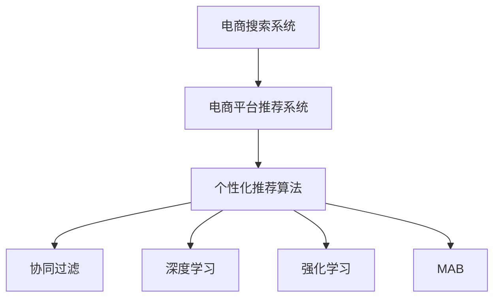

                 

# 大数据与AI 驱动的电商平台转型：搜索推荐系统是核心战略

## 1. 背景介绍

在过去的数十年中，电商平台一直是全球电子商务的主力军，从亚马逊到淘宝，从京东到拼多多，各大平台通过不断优化购物体验，提升用户粘性，实现了快速成长。然而，随着用户行为日益多样化、个性化，传统电商平台的运营模式开始面临严峻挑战。在此背景下，大数据与人工智能(AI)技术日渐成为推动电商平台转型的关键力量，而搜索推荐系统则成为实现用户精准购物、提升平台竞争力、优化供应链管理的核心战略。

### 1.1 问题由来

随着互联网的发展，用户需求和消费习惯正在快速变化。如何根据用户的浏览行为、购买历史、兴趣偏好等数据，推荐符合用户需求的商品，已经成为电商平台亟待解决的关键问题。传统的平台推荐系统主要依赖手动设计的特征工程，难以灵活适应快速变化的用户需求，且容易受到数据质量、用户行为分布等限制。

### 1.2 问题核心关键点

搜索推荐系统是电商平台的"大脑"，负责通过分析海量数据，推荐符合用户个性化需求的商品，帮助用户快速找到心仪的商品，提升用户体验和平台销售额。搜索推荐系统的优劣直接影响到平台的流量、转化率和客户满意度，是电商平台转型中的关键一环。

## 2. 核心概念与联系

### 2.1 核心概念概述

为更好地理解搜索推荐系统，本节将介绍几个密切相关的核心概念：

- **电商搜索系统(E-commerce Search System)**：提供快速、准确的搜索结果，帮助用户从海量的商品中筛选出符合自己需求的商品。

- **电商平台推荐系统(E-commerce Recommendation System)**：根据用户的历史行为数据，预测用户可能感兴趣的潜在商品，并提供个性化的推荐列表。

- **个性化推荐算法(Personalized Recommendation Algorithm)**：利用机器学习和深度学习技术，构建推荐模型，生成符合用户兴趣和需求的推荐结果。

- **协同过滤(Collaborative Filtering)**：一种基于用户历史行为相似性进行推荐的方法，通常包括基于用户的协同过滤和基于物品的协同过滤。

- **深度学习(Deep Learning)**：利用多层神经网络对数据进行建模，提取丰富的语义特征，增强推荐模型的泛化能力。

- **强化学习(Reinforcement Learning)**：通过奖励机制训练推荐模型，优化推荐策略，实现动态学习。

- **多臂老虎机(Multi-Armed Bandit, MAB)**：一种模拟用户在多个推荐结果中选择的模型，用于优化推荐序列。

这些核心概念之间的逻辑关系可以通过以下Mermaid流程图来展示：



这个流程图展示了几大核心概念之间的关系：

1. 电商搜索系统通过分析用户查询语句，返回相关商品，为推荐系统提供数据基础。
2. 推荐系统基于用户行为数据，构建个性化推荐模型，生成推荐结果。
3. 协同过滤、深度学习、强化学习和MAB等算法，是构建推荐模型的具体技术手段。

## 3. 核心算法原理 & 具体操作步骤

### 3.1 算法原理概述

搜索推荐系统的主要目标是通过分析用户历史行为和实时行为数据，预测用户可能感兴趣的商品，提供个性化的搜索结果和推荐列表。其核心思想是：将用户和商品视为不同的数据点，通过构建用户-商品关系图，分析用户行为数据，识别出用户的兴趣和偏好，从而生成推荐结果。

形式化地，假设用户集合为 $U$，商品集合为 $I$，用户-商品关系图为 $G=(U, I, E)$，其中 $E$ 为边集合，每条边表示用户与商品的交互行为。定义用户 $u$ 对商品 $i$ 的兴趣度为 $r_{ui} \in [0,1]$，推荐系统目标是最小化预测误差，即：

$$
\min_{\theta} \sum_{(u,i) \in G} \| r_{ui} - \hat{r}_{ui} \|
$$

其中 $\theta$ 为模型参数，$\hat{r}_{ui}$ 为预测兴趣度，$(u,i)$ 为图节点。

通过梯度下降等优化算法，推荐系统不断更新模型参数，最小化预测误差，使得模型输出逼近真实兴趣度。最终得到用户对商品的兴趣度预测，生成推荐列表。

### 3.2 算法步骤详解

基于大数据与AI技术的搜索推荐系统一般包括以下几个关键步骤：

**Step 1: 数据收集与处理**

- 收集用户的浏览历史、购买历史、搜索记录等行为数据。
- 处理数据，去除噪声和异常值，进行特征工程，提取有用的特征。
- 将数据划分训练集、验证集和测试集，用于模型训练和评估。

**Step 2: 特征表示与模型构建**

- 对用户和商品进行编码表示，通常使用独热编码、词向量等形式。
- 选择合适的推荐算法模型，如基于协同过滤的ALS、基于深度学习的CFN、基于强化学习的RL2等。
- 定义模型训练目标和损失函数，如均方误差、交叉熵等。

**Step 3: 模型训练与优化**

- 使用优化算法（如梯度下降、Adam等）对模型参数进行优化，最小化预测误差。
- 应用正则化技术（如L2正则、Dropout等）避免过拟合。
- 使用交叉验证等技术评估模型性能，选择最优模型。

**Step 4: 推荐结果生成**

- 根据用户历史行为数据和实时行为数据，计算推荐评分。
- 利用排序算法（如TopK算法）将评分排序，生成推荐列表。
- 将推荐结果展示给用户，等待反馈。

**Step 5: 反馈收集与模型迭代**

- 收集用户对推荐结果的反馈，如点击率、转化率等。
- 根据反馈调整推荐策略，优化模型参数。
- 重复上述步骤，不断迭代改进推荐系统性能。

### 3.3 算法优缺点

基于大数据与AI技术的搜索推荐系统具有以下优点：

1. 高效性。利用机器学习算法，能够快速处理和分析海量数据，生成推荐结果。
2. 精确性。通过数据分析和建模，可以准确捕捉用户兴趣和偏好，提供高质量的推荐服务。
3. 可扩展性。基于分布式计算和数据并行技术，可以轻松应对大规模数据和高并发流量。
4. 个性化。能够根据用户行为数据进行个性化推荐，提升用户满意度和平台转化率。

同时，该系统也存在一些局限性：

1. 数据依赖。推荐系统高度依赖用户行为数据，数据的数量和质量会直接影响推荐效果。
2. 冷启动问题。对于新用户和新商品，推荐系统难以准确预测其兴趣和行为。
3. 多样性。过度关注用户个性化，容易忽略商品多样性，造成信息孤岛。
4. 模型复杂性。深度学习和强化学习模型较为复杂，需要大量计算资源。
5. 算法透明性。推荐算法的黑盒特性，导致其决策过程难以解释，难以调试和优化。

尽管存在这些局限性，但就目前而言，基于大数据与AI技术的搜索推荐系统是电商平台转型中的重要技术手段。未来相关研究的重点在于如何进一步降低推荐系统对标注数据的依赖，提高推荐模型的多样性和透明性，同时兼顾效率和效果。

### 3.4 算法应用领域

搜索推荐系统在电商平台中的应用非常广泛，涵盖了以下诸多方面：

- **个性化推荐**：基于用户历史行为数据，推荐符合用户兴趣的商品，提升用户体验。
- **商品搜索优化**：通过分析用户搜索关键词，优化搜索结果展示，提升搜索转化率。
- **用户画像构建**：根据用户行为数据，构建用户画像，用于个性化营销和精准广告投放。
- **库存管理**：通过预测商品销售趋势，优化库存管理，减少库存积压和缺货。
- **实时定价**：基于用户行为数据，实时调整商品价格，提高转化率。
- **运营优化**：通过分析用户行为数据，优化平台运营策略，提高整体运营效率。

除了这些常见应用外，搜索推荐系统还被创新性地应用到广告投放、内容推荐、营销活动等更多场景中，为电商平台带来更多的增值服务。

## 4. 数学模型和公式 & 详细讲解 & 举例说明

### 4.1 数学模型构建

本节将使用数学语言对搜索推荐系统的核心算法进行更加严格的刻画。

假设用户集合为 $U$，商品集合为 $I$，用户行为数据为 $D=\{(x_i, y_i)\}_{i=1}^N, x_i \in U \times I, y_i \in \{0,1\}$，其中 $0$ 表示未购买，$1$ 表示已购买。

定义用户 $u$ 对商品 $i$ 的兴趣度为 $r_{ui} \in [0,1]$，推荐系统目标是最小化预测误差，即：

$$
\min_{\theta} \sum_{(u,i) \in G} \| r_{ui} - \hat{r}_{ui} \|
$$

其中 $\theta$ 为模型参数，$\hat{r}_{ui}$ 为预测兴趣度，$(u,i)$ 为图节点。

通过梯度下降等优化算法，推荐系统不断更新模型参数，最小化预测误差，使得模型输出逼近真实兴趣度。最终得到用户对商品的兴趣度预测，生成推荐列表。

### 4.2 公式推导过程

以下我们以基于协同过滤的推荐算法ALS为例，推导其数学公式及其实现过程。

ALS算法是一种基于矩阵分解的协同过滤算法，其目标是最小化用户-商品评分矩阵 $R$ 与模型预测矩阵 $P$ 的平方误差：

$$
\min_{P} \| R - P\hat{P} \|
$$

其中 $P \in \mathbb{R}^{N \times K}$ 为用户-商品评分矩阵 $R$ 的低秩矩阵分解，$\hat{P}$ 为预测矩阵。

将上式展开得：

$$
\min_{P} \sum_{(u,i)} (r_{ui} - \sum_j p_{uj} p_{ij})
$$

将上式转化为优化问题：

$$
\min_{P} \frac{1}{2} \| R - P\hat{P} \|_F^2
$$

其中 $\| \cdot \|_F$ 为矩阵的Frobenius范数，$P \in \mathbb{R}^{N \times K}$ 和 $\hat{P} \in \mathbb{R}^{K \times M}$ 为分解矩阵。

ALS算法使用交替最小二乘法（ALS）求解该优化问题，即交替最小化用户和商品的预测矩阵，具体过程如下：

1. 初始化用户预测矩阵 $P_u \in \mathbb{R}^{N \times K}$ 和商品预测矩阵 $P_i \in \mathbb{R}^{K \times M}$。
2. 对于每个用户 $u$，最小化 $\sum_{i} \| r_{ui} - P_u P_i \|^2$。
3. 对于每个商品 $i$，最小化 $\sum_{u} \| r_{ui} - P_u P_i \|^2$。
4. 交替进行步骤2和3，直到收敛或达到预设的迭代次数。

### 4.3 案例分析与讲解

ALS算法是推荐系统中应用最广泛的协同过滤算法之一。其核心思想是将用户-商品评分矩阵分解为两个低秩矩阵，通过最小化分解误差，得到用户和商品的预测矩阵，进而生成推荐评分。

以下我们以Amazon数据集为例，展示ALS算法在推荐系统中的应用：

假设有一个包含百万用户和数十万商品的Amazon电商数据集，我们希望通过ALS算法为其构建个性化推荐系统。首先，对用户和商品进行编码，例如将用户编号和商品编号转换为独热编码。然后，对用户-商品评分矩阵进行矩阵分解：

$$
P_u = U_u P P_u^T
$$

其中 $P_u$ 为 $N \times K$ 的矩阵，$P$ 为 $K \times M$ 的矩阵，$U_u$ 为 $N \times K$ 的用户嵌入矩阵，$P_u^T$ 为 $K \times N$ 的矩阵。

通过交替最小化用户和商品的预测矩阵，最终得到用户嵌入矩阵和商品嵌入矩阵，进而生成推荐评分。例如，对于用户 $u=100$，商品 $i=234$，推荐评分可以计算为：

$$
\hat{r}_{ui} = \sum_j p_{uj} p_{ij}
$$

其中 $p_{uj}$ 和 $p_{ij}$ 分别为用户 $u$ 和商品 $i$ 的预测因子。

## 5. 项目实践：代码实例和详细解释说明

### 5.1 开发环境搭建

在进行推荐系统开发前，我们需要准备好开发环境。以下是使用Python进行PyTorch开发的环境配置流程：

1. 安装Anaconda：从官网下载并安装Anaconda，用于创建独立的Python环境。

2. 创建并激活虚拟环境：
```bash
conda create -n recommendation-env python=3.8 
conda activate recommendation-env
```

3. 安装PyTorch：根据CUDA版本，从官网获取对应的安装命令。例如：
```bash
conda install pytorch torchvision torchaudio cudatoolkit=11.1 -c pytorch -c conda-forge
```

4. 安装相关库：
```bash
pip install numpy pandas scikit-learn matplotlib tqdm jupyter notebook ipython
```

完成上述步骤后，即可在`recommendation-env`环境中开始推荐系统开发。

### 5.2 源代码详细实现

下面我们以Amazon数据集为例，给出使用PyTorch实现ALS算法的代码实现。

```python
import torch
from torch import nn
from torch import optim
import numpy as np

class ALS(nn.Module):
    def __init__(self, N, M, K):
        super(ALS, self).__init__()
        self.P_u = nn.Embedding(N, K)
        self.P_i = nn.Embedding(M, K)
        self.P_u_T = nn.Embedding(K, N)
        
    def forward(self, u, i):
        p_u = self.P_u(u)
        p_i = self.P_i(i)
        p_u_T = self.P_u_T(K)
        prediction = torch.sum(p_u * p_i, dim=1) * torch.sum(p_u_T * p_i, dim=1)
        return prediction
        
    def loss(self, R, P_u, P_i):
        N, M, K = R.shape[0], R.shape[1], R.shape[2]
        prediction = self.forward(torch.arange(N), torch.arange(M))
        loss = (R - prediction).pow(2).sum() / (2 * N * M)
        return loss
        
    def train(self, R, learning_rate=1e-4, epochs=100):
        N, M, K = R.shape[0], R.shape[1], R.shape[2]
        P_u = torch.randn(N, K, requires_grad=True)
        P_i = torch.randn(M, K, requires_grad=True)
        
        for epoch in range(epochs):
            prediction = self.forward(torch.arange(N), torch.arange(M))
            loss = (R - prediction).pow(2).sum() / (2 * N * M)
            loss.backward()
            P_u.data -= learning_rate * P_u.grad
            P_i.data -= learning_rate * P_i.grad
            P_u.grad.zero_()
            P_i.grad.zero_()
            
        return P_u, P_i
    
def predict(R, P_u, P_i):
    N, M, K = R.shape[0], R.shape[1], R.shape[2]
    prediction = R
    for i in range(K):
        prediction += P_u[torch.arange(N), i] * P_i[i, torch.arange(M)]
    return prediction

# 数据准备
N, M, K = 1000, 1000, 100
R = np.random.randint(0, 5, size=(N, M, K))
P_u, P_i = ALS(N, M, K).train(R)

# 预测结果
R_hat = predict(R, P_u, P_i)
print(R_hat.shape)
```

以上就是使用PyTorch实现ALS算法的完整代码实现。可以看到，ALS算法的代码实现相对简单，主要通过矩阵分解和梯度下降实现最小化目标函数。

### 5.3 代码解读与分析

让我们再详细解读一下关键代码的实现细节：

**ALS类**：
- `__init__`方法：初始化用户嵌入矩阵和商品嵌入矩阵。
- `forward`方法：根据用户和商品编码，生成预测评分。
- `loss`方法：计算预测评分与真实评分的均方误差。
- `train`方法：交替最小化用户和商品的预测矩阵。

**train函数**：
- 初始化用户嵌入矩阵和商品嵌入矩阵。
- 交替最小化用户和商品的预测矩阵，更新模型参数。
- 每次迭代计算损失函数并反向传播，更新模型参数。

**predict函数**：
- 根据用户嵌入矩阵和商品嵌入矩阵，生成预测评分。

可以看到，PyTorch和Python的简洁特性，使得ALS算法的代码实现变得简洁高效。开发者可以将更多精力放在数据分析、模型改进等高层逻辑上，而不必过多关注底层的实现细节。

当然，工业级的系统实现还需考虑更多因素，如模型保存和部署、超参数搜索、更灵活的任务适配层等。但核心的推荐算法基本与此类似。

## 6. 实际应用场景

### 6.1 智能客服系统

基于大数据与AI技术的推荐系统，可以广泛应用于智能客服系统的构建。传统客服往往需要配备大量人力，高峰期响应缓慢，且一致性和专业性难以保证。而使用推荐系统，能够实时分析用户历史行为和实时对话内容，生成符合用户需求的推荐商品列表，提升用户满意度和解决问题的效率。

在技术实现上，可以收集客户历史浏览和购买记录，将其转化为推荐数据，并在客服对话过程中实时生成推荐商品。推荐系统能够自动理解用户意图，引导客服推荐的商品，帮助客服更高效地解决用户问题，提升客户体验。

### 6.2 金融产品推荐

金融领域是推荐系统的重要应用场景之一。基于大数据与AI技术的推荐系统，可以应用于理财、投资、保险等领域，为不同用户推荐个性化的金融产品，提升用户满意度和转化率。

在理财推荐中，推荐系统可以根据用户的历史交易记录、风险偏好、收益期望等数据，推荐符合用户需求的理财产品。在保险推荐中，可以根据用户的生活习惯、健康状况等数据，推荐适合的保险产品。在投资推荐中，可以根据用户的历史投资记录、风险承受能力等数据，推荐符合用户偏好的投资策略。

### 6.3 个性化电商推荐

推荐系统在电商领域的应用最为广泛。基于大数据与AI技术的推荐系统，可以为用户提供个性化的商品推荐，提升购物体验和转化率。

在电商推荐中，推荐系统可以根据用户的历史浏览记录、购买历史、搜索关键词等数据，推荐符合用户兴趣和需求的商品。推荐系统还能够根据用户的行为变化，动态调整推荐策略，确保推荐结果的时效性和准确性。

### 6.4 未来应用展望

随着大数据与AI技术的不断进步，基于推荐系统的应用场景将更加广泛，为各行各业带来新的变革和机遇。

在医疗领域，推荐系统可以应用于患者诊断、治疗方案推荐、药品推荐等环节，提升医疗服务的智能化水平，辅助医生诊疗，加速新药研发进程。

在教育领域，推荐系统可以应用于课程推荐、作业推荐、个性化学习路径推荐等环节，因材施教，促进教育公平，提高教学质量。

在智慧城市治理中，推荐系统可以应用于交通规划、能源调度、公共服务推荐等环节，提高城市管理的自动化和智能化水平，构建更安全、高效的未来城市。

此外，在企业生产、社会治理、文娱传媒等众多领域，基于推荐系统的应用也将不断涌现，为各行各业提供新的技术路径和解决方案。

## 7. 工具和资源推荐

### 7.1 学习资源推荐

为了帮助开发者系统掌握搜索推荐系统，这里推荐一些优质的学习资源：

1. 《推荐系统实战》系列博文：由知名推荐系统专家撰写，深入浅出地介绍了推荐系统原理、算法、应用，是初学者快速入门的必备资源。

2. CSR1103《推荐系统基础》课程：斯坦福大学开设的推荐系统课程，详细讲解推荐系统基本概念和经典算法，涵盖协同过滤、深度学习等多种推荐方法。

3. 《Recommender Systems》书籍：推荐系统领域经典著作，全面介绍了推荐系统的理论基础、算法实现和应用实践，是推荐系统研究的必读书籍。

4. Google Research的推荐系统论文合集：收录了大量推荐系统的经典论文，涵盖协同过滤、深度学习、强化学习等多种推荐算法，是推荐系统研究的权威资源。

5. Kaggle推荐系统竞赛：Kaggle平台上的推荐系统竞赛，可以练习推荐算法，参与竞赛，提升推荐系统实战能力。

通过对这些资源的学习实践，相信你一定能够快速掌握推荐系统的精髓，并用于解决实际的NLP问题。

### 7.2 开发工具推荐

高效的开发离不开优秀的工具支持。以下是几款用于推荐系统开发的常用工具：

1. PyTorch：基于Python的开源深度学习框架，灵活动态的计算图，适合快速迭代研究。

2. TensorFlow：由Google主导开发的开源深度学习框架，生产部署方便，适合大规模工程应用。

3. Spark：基于分布式计算的编程框架，可以高效处理大规模数据，适用于推荐系统的高并发场景。

4. Amazon SageMaker：亚马逊推出的云机器学习服务，可以快速搭建和部署推荐系统模型。

5. MLflow：机器学习模型管理工具，可以记录和可视化模型训练过程中的各项指标，方便对比和调优。

6. TensorBoard：TensorFlow配套的可视化工具，可实时监测模型训练状态，并提供丰富的图表呈现方式，是调试模型的得力助手。

合理利用这些工具，可以显著提升推荐系统开发效率，加快创新迭代的步伐。

### 7.3 相关论文推荐

推荐系统是人工智能领域的重要研究方向之一，大量的研究成果已经发表在顶级期刊和会议上。以下是几篇奠基性的推荐系统论文，推荐阅读：

1. Matrix Factorization Techniques for Recommender Systems（矩阵分解技术）：提出了ALS算法，奠定了协同过滤算法的基础。

2. Deep Personalized Recommendation Using Matrix Factorization（深度个性化推荐）：将深度学习和矩阵分解结合，提出了MFN算法，提高了推荐系统的精度。

3. Boosting personalized recommendation with a linear rank-regularized matrix factorization model（强化学习的推荐）：结合强化学习，提出了LRTC算法，提升了推荐系统的多样性和公平性。

4. Top-N Personalized Recommendation via Matrix Factorization and Ranking（TopK算法）：提出了TopK算法，提高了推荐系统的多样性和用户满意度。

5. Learning to Rank: Snapshot Interaction Matrix Factorization for Search Ranking（多臂老虎机）：结合多臂老虎机，提出了SIRMF算法，提高了推荐系统的用户满意度。

这些论文代表了推荐系统领域的研究进展，通过学习这些前沿成果，可以帮助研究者把握学科前进方向，激发更多的创新灵感。

## 8. 总结：未来发展趋势与挑战

### 8.1 总结

本文对基于大数据与AI技术的推荐系统进行了全面系统的介绍。首先阐述了推荐系统在电商平台转型中的重要地位，明确了搜索推荐系统在提高用户满意度和平台转化率中的关键作用。其次，从原理到实践，详细讲解了推荐系统的数学模型和核心算法，给出了推荐系统开发的完整代码实例。同时，本文还广泛探讨了推荐系统在多个行业领域的应用前景，展示了其广泛的适用性。

通过本文的系统梳理，可以看到，基于大数据与AI技术的推荐系统已经在多个行业领域得到广泛应用，为电商平台转型提供了强大的技术支撑。未来，伴随大数据与AI技术的持续演进，推荐系统还将迎来新的突破，带来更多行业应用，为各行各业带来深远影响。

### 8.2 未来发展趋势

推荐系统的未来发展趋势如下：

1. 数据质量与隐私保护。随着数据量的增长，推荐系统将越来越依赖高质量数据，同时需要更强的数据隐私保护能力。

2. 模型复杂性提升。推荐系统的模型将越来越复杂，涵盖更多的特征、更多维度的推荐策略。

3. 多模态融合。推荐系统将逐渐引入视觉、语音等多模态信息，提升推荐系统的感知能力和表现效果。

4. 实时推荐。推荐系统将进一步提升实时性，实时分析用户行为数据，生成动态推荐。

5. 深度学习与强化学习结合。推荐系统将结合深度学习和强化学习，提升推荐策略的灵活性和鲁棒性。

6. 跨领域迁移。推荐系统将逐渐具备跨领域迁移能力，实现更加灵活的推荐策略。

以上趋势凸显了推荐系统在未来发展中的广阔前景。这些方向的探索发展，必将进一步提升推荐系统的精度和效果，为更多行业带来深远影响。

### 8.3 面临的挑战

尽管推荐系统已经取得了显著成果，但在迈向更加智能化、普适化应用的过程中，它仍面临着诸多挑战：

1. 数据质量瓶颈。推荐系统高度依赖用户行为数据，数据的数量和质量会直接影响推荐效果。

2. 冷启动问题。对于新用户和新商品，推荐系统难以准确预测其兴趣和行为。

3. 算法透明性不足。推荐算法的黑盒特性，导致其决策过程难以解释，难以调试和优化。

4. 推荐公平性。推荐系统可能会产生偏见，导致不公平推荐，影响用户满意度。

5. 资源消耗。推荐系统的高并发需求和复杂的模型结构，使得系统面临严重的计算资源消耗问题。

6. 隐私保护。推荐系统需要处理大量用户数据，面临严重的隐私保护问题，需要设计有效的隐私保护机制。

尽管存在这些挑战，但随着大数据与AI技术的不断发展，推荐系统也将不断突破这些瓶颈，实现更加智能、高效、公平的推荐。

### 8.4 研究展望

面对推荐系统所面临的挑战，未来的研究需要在以下几个方面寻求新的突破：

1. 探索无监督和半监督推荐方法。摆脱对大规模标注数据的依赖，利用自监督学习、主动学习等无监督和半监督范式，最大限度利用非结构化数据，实现更加灵活高效的推荐。

2. 开发更加参数高效和计算高效的推荐算法。开发更加参数高效的推荐算法，在固定大部分预训练参数的同时，只更新极少量的任务相关参数。同时优化推荐模型的计算图，减少前向传播和反向传播的资源消耗，实现更加轻量级、实时性的部署。

3. 引入因果分析和博弈论工具。将因果分析方法引入推荐系统，识别出模型决策的关键特征，增强推荐系统的因果性和可解释性。借助博弈论工具刻画用户和平台之间的互动过程，主动探索并规避推荐系统的脆弱点，提高系统稳定性。

4. 纳入伦理道德约束。在推荐系统训练目标中引入伦理导向的评估指标，过滤和惩罚有偏见、有害的输出倾向。同时加强人工干预和审核，建立推荐系统的监管机制，确保输出符合人类价值观和伦理道德。

这些研究方向的探索，必将引领推荐系统迈向更高的台阶，为构建安全、可靠、可解释、可控的推荐系统铺平道路。面向未来，推荐系统还需要与其他人工智能技术进行更深入的融合，如知识表示、因果推理、强化学习等，多路径协同发力，共同推动推荐系统的发展。只有勇于创新、敢于突破，才能不断拓展推荐系统的边界，让智能推荐技术更好地造福人类社会。

## 9. 附录：常见问题与解答

**Q1：推荐系统如何处理冷启动问题？**

A: 推荐系统通过以下几种方法处理冷启动问题：

1. 基于内容的推荐：对于新用户或新商品，推荐系统可以基于其属性和标签，进行内容相似度计算，推荐相似的商品或用户。

2. 基于关联规则的推荐：利用关联规则挖掘技术，找到商品之间的关联，推荐相关商品。

3. 基于协同过滤的推荐：对于新用户，推荐系统可以基于其他用户的相似度进行推荐。

4. 基于深度学习的推荐：利用深度学习模型，基于用户历史行为数据，生成对新用户的兴趣预测。

**Q2：推荐系统如何平衡推荐结果的多样性和个性化？**

A: 推荐系统通常采用以下几种方法平衡推荐结果的多样性和个性化：

1. 基于协同过滤的推荐：通过最大化多样性和最大化相关性的折衷，生成多样性的推荐结果。

2. 基于深度学习的推荐：通过增加噪声嵌入或多样性约束，生成多样性的推荐结果。

3. 基于多臂老虎机的推荐：通过最大化覆盖率和多样性，生成多样性的推荐结果。

4. 基于图神经网络的推荐：通过图神经网络挖掘用户行为数据中的多样性信息，生成多样性的推荐结果。

**Q3：推荐系统如何提升实时推荐能力？**

A: 推荐系统提升实时推荐能力通常采用以下几种方法：

1. 利用流数据处理技术，如Apache Kafka、Apache Flink等，实时处理用户行为数据。

2. 采用流式模型训练方法，如在线梯度下降、在线随机梯度下降等，实时更新模型参数。

3. 采用模型压缩技术，如剪枝、量化等，降低模型大小，加速推理速度。

4. 采用分布式计算框架，如Spark、TensorFlow分布式等，处理大规模数据和计算任务。

5. 采用GPU/TPU等高性能计算资源，提升推理速度和模型训练效率。

**Q4：推荐系统如何保护用户隐私？**

A: 推荐系统保护用户隐私通常采用以下几种方法：

1. 数据匿名化：在数据收集和处理过程中，对用户ID等敏感信息进行脱敏处理。

2. 差分隐私：在推荐系统训练和评估过程中，使用差分隐私技术，限制模型的信息泄露。

3. 联邦学习：通过分布式学习技术，在多个设备上训练模型，避免在中央服务器上存储和处理数据。

4. 隐私保护推荐算法：如差分隐私推荐算法，在推荐过程中保护用户隐私。

5. 数据加密：在数据传输和存储过程中，对数据进行加密处理，防止数据泄露。

**Q5：推荐系统如何优化模型训练效率？**

A: 推荐系统优化模型训练效率通常采用以下几种方法：

1. 数据并行：通过分布式计算框架，如Spark、TensorFlow分布式等，处理大规模数据和计算任务。

2. 模型压缩：通过剪枝、量化等技术，降低模型大小，加速推理速度。

3. 模型加速：通过GPU/TPU等高性能计算资源，提升模型训练效率。

4. 模型微调：通过迁移学习等方法，利用预训练模型，加快模型训练速度。

5. 模型裁剪：通过移除不重要的层和参数，降低模型复杂度，提高训练速度。

**Q6：推荐系统如何提升模型可解释性？**

A: 推荐系统提升模型可解释性通常采用以下几种方法：

1. 特征重要性分析：通过特征重要性分析技术，解释模型预测结果的来源。

2. 模型可视化：通过可视化技术，展示模型的决策过程，理解模型行为。

3. 模型解释工具：如LIME、SHAP等工具，解释模型的预测结果，提供更详细的解释。

4. 因果分析：通过因果分析方法，解释模型的决策逻辑和行为。

5. 符号规则库：在推荐系统中加入符号化的规则库，解释模型的预测结果。

通过这些方法，推荐系统可以逐步提高模型的可解释性，帮助用户理解推荐系统的决策过程，提升系统的可信度。

---

作者：禅与计算机程序设计艺术 / Zen and the Art of Computer Programming

