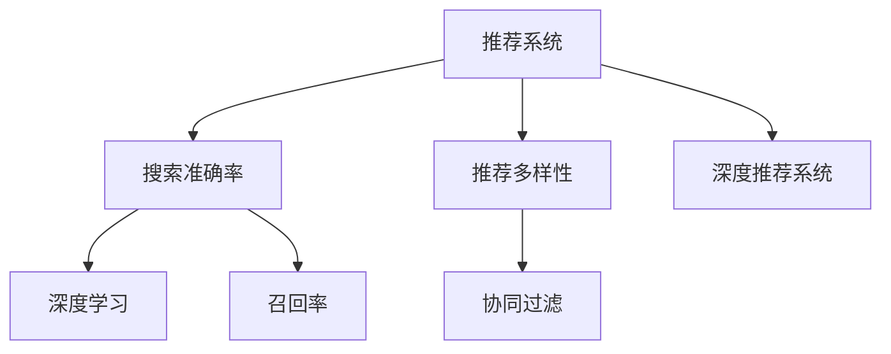

                 

# 大数据与AI 驱动的电商推荐系统：搜索准确率与多样性推荐的双重挑战

## 1. 背景介绍

### 1.1 问题由来
随着电子商务的迅猛发展，各大电商平台逐渐意识到推荐系统的重要性。推荐系统不仅能提升用户购物体验，还能显著增加销售转化率，从而提升平台利润。与此同时，由于用户个性化需求的多样化，推荐系统的推荐策略也日趋复杂。

为了满足用户多样化的需求，推荐系统不仅要给出准确的搜索结果，还需保证推荐结果的多样性。然而，这两个目标之间往往存在矛盾。准确性高的推荐算法通常容易陷入局部最优，推荐结果较为单一；而多样性高的算法，则可能牺牲准确性，难以给出真正符合用户需求的推荐。

因此，在大数据与AI技术的驱动下，如何在大规模电商数据中寻找准确率与多样性之间的最佳平衡，成为推荐系统亟待解决的关键问题。本文将从算法原理、模型构建、项目实践等方面，全面探讨电商推荐系统中的搜索准确率与多样性推荐问题，并提出一些解决方案。

## 2. 核心概念与联系

### 2.1 核心概念概述

为更好地理解电商推荐系统中的搜索准确率与多样性推荐问题，本节将介绍几个密切相关的核心概念：

- 推荐系统(Recommender System)：通过分析用户行为数据，向用户推荐其感兴趣的产品或内容。
- 搜索准确率(Search Accuracy)：指推荐结果与用户实际需求相符的程度，常通过准确率、召回率等指标进行衡量。
- 推荐多样性(Recommendation Diversity)：指推荐结果的多样性程度，旨在防止推荐内容的同质化，提升用户体验。
- 协同过滤(Collaborative Filtering)：基于用户行为数据进行推荐的一种方法，常见有基于用户的协同过滤和基于物品的协同过滤两种方式。
- 深度学习(Deep Learning)：一类基于神经网络结构的机器学习技术，广泛应用于图像、语音、文本等领域。
- 深度推荐系统(Deep Recommender System)：将深度学习技术应用于推荐系统中，如利用深度神经网络建模用户兴趣和物品特征，提升推荐系统的准确性和多样性。
- 召回率(Recall)：指推荐系统中，正确召回目标项的数目与实际总数目的比例，常与准确率一起衡量推荐系统性能。

这些核心概念之间的逻辑关系可以通过以下Mermaid流程图来展示：



这个流程图展示了几大核心概念及其之间的关系：

1. 推荐系统通过分析用户行为数据，向用户推荐产品。
2. 搜索准确率衡量推荐系统给出的结果与用户真实需求相符的程度。
3. 推荐多样性强调推荐结果的多样性，避免推荐内容的同质化。
4. 协同过滤是推荐系统的一种重要技术，利用用户和物品的历史交互数据进行推荐。
5. 深度学习是推荐系统的另一大技术方向，通过深度神经网络挖掘数据中的深层次特征。
6. 深度推荐系统结合深度学习和协同过滤技术，提升推荐系统的性能。
7. 召回率是衡量推荐系统准确性的重要指标，常与准确率一起评估。

这些概念共同构成了推荐系统的核心框架，使得推荐系统能够在复杂多变的电商场景中实现准确率和多样性之间的平衡。

## 3. 核心算法原理 & 具体操作步骤
### 3.1 算法原理概述

电商推荐系统中的搜索准确率与多样性推荐问题，本质上是一个多目标优化问题。假设推荐系统为 $\textit{Recommender}(x)$，其中 $x$ 为用户的行为数据，目标函数为 $\textit{Objective}(\textit{Recommender}, \textit{Search Accuracy}, \textit{Recommendation Diversity})$。我们的目标是最小化推荐误差（$\textit{Recommender}(x)$ 与用户真实需求 $y$ 的差距）和推荐结果的多样性差距（$\textit{Recommender}(x)$ 与用户期望的多样性 $d$ 的差距），即：

$$
\min_{\textit{Recommender}} \textit{Objective}(\textit{Recommender}, \textit{Search Accuracy}, \textit{Recommendation Diversity})
$$

形式化地，这可以转化为一个联合优化问题，即同时优化准确率和多样性：

$$
\min_{\textit{Recommender}} \alpha \cdot \textit{Search Accuracy} + \beta \cdot \textit{Recommendation Diversity}
$$

其中 $\alpha$ 和 $\beta$ 为权重参数，用于平衡准确率和多样性之间的矛盾。

### 3.2 算法步骤详解

电商推荐系统的搜索准确率与多样性推荐问题，可以遵循以下步骤进行解决：

**Step 1: 数据准备**
- 收集用户行为数据，包括点击、浏览、购买等行为记录，同时收集用户对商品的评价信息。
- 对数据进行预处理，包括数据清洗、特征工程、缺失值填充等。

**Step 2: 选择合适的推荐算法**
- 选择基于用户的协同过滤算法或基于物品的协同过滤算法。
- 采用深度学习技术，如DeepFM、DNN等，对用户和物品进行建模，提升推荐系统的准确性和多样性。

**Step 3: 设置模型超参数**
- 确定优化算法及其参数，如AdamW、SGD等，设置学习率、批大小、迭代轮数等。
- 设置正则化技术及强度，包括权重衰减、Dropout、Early Stopping等。
- 确定准确率与多样性的权重参数 $\alpha$ 和 $\beta$。

**Step 4: 训练模型**
- 将数据集划分为训练集、验证集和测试集。
- 在训练集上使用优化算法进行梯度下降，最小化联合目标函数。
- 在验证集上评估模型性能，根据性能指标决定是否触发Early Stopping。
- 重复上述步骤直到满足预设的迭代轮数或Early Stopping条件。

**Step 5: 测试与部署**
- 在测试集上评估模型的准确率和多样性指标。
- 使用模型对新用户进行推荐，集成到实际的应用系统中。
- 持续收集新数据，定期重新微调模型，以适应数据分布的变化。

以上是电商推荐系统搜索准确率与多样性推荐问题的一般流程。在实际应用中，还需要针对具体任务的特点，对推荐算法进行优化设计，如改进特征选择、引入更多的正则化技术、搜索最优的超参数组合等，以进一步提升模型性能。

### 3.3 算法优缺点

电商推荐系统中的搜索准确率与多样性推荐问题，采用以下方法解决：

**优点**
- 可以同时考虑准确率和多样性，兼顾两种推荐目标。
- 深度学习技术可以挖掘数据中的深层次特征，提升推荐系统的准确性和多样性。
- 协同过滤算法简单易实现，在大规模数据上表现良好。

**缺点**
- 联合优化问题复杂，需要平衡准确率和多样性之间的矛盾。
- 模型的计算复杂度高，训练时间较长。
- 需要大量的标注数据，获取成本较高。

尽管存在这些局限性，但通过合理设计，电商推荐系统可以同时满足搜索准确率和多样性推荐的双重目标，实现更好的用户体验和业务效果。

### 3.4 算法应用领域

电商推荐系统中的搜索准确率与多样性推荐问题，已经广泛应用于各类电商平台：

- 亚马逊(Amazon)：利用协同过滤和深度学习技术，对用户行为进行建模，提升推荐系统的效果。
- 淘宝(Taobao)：采用基于用户的协同过滤算法，根据用户的历史行为和兴趣，推荐相似商品。
- 京东(JD)：使用深度推荐系统，对用户进行画像建模，提供个性化推荐。

除了这些知名电商外，许多中小型电商也纷纷引入推荐系统，提升用户购物体验和平台竞争力。

## 4. 数学模型和公式 & 详细讲解 & 举例说明

### 4.1 数学模型构建

电商推荐系统的搜索准确率与多样性推荐问题，可以建立如下数学模型：

假设推荐系统输出 $r$ 个商品 $R=\{r_1,r_2,...,r_r\}$，其中 $r$ 为推荐结果数量，用户真实需求 $y$ 为 $y \in Y$，推荐结果的多样性 $d$ 为 $d \in D$。目标函数为：

$$
\min_{\textit{Recommender}} \alpha \cdot \textit{Search Accuracy} + \beta \cdot \textit{Recommendation Diversity}
$$

其中 $\alpha$ 和 $\beta$ 为权重参数，用于平衡准确率和多样性之间的矛盾。具体而言：

- 准确率 $\textit{Search Accuracy}$：指推荐结果与用户真实需求相符的程度，常用指标包括准确率、召回率等。
- 多样性 $\textit{Recommendation Diversity}$：指推荐结果的多样性程度，常用指标包括均方误差、最大多样性指数等。

### 4.2 公式推导过程

以均方误差 (Mean Squared Error, MSE) 为例，推导推荐多样性的损失函数：

设推荐结果 $r_i$ 与用户真实需求 $y$ 的差异为 $e_i$，则 MSE 定义为：

$$
MSE = \frac{1}{N} \sum_{i=1}^N (y - r_i)^2
$$

其中 $N$ 为数据样本数。

为了最大化推荐多样性，需要最小化 MSE，即：

$$
\min_{\textit{Recommender}} \sum_{i=1}^N (y - r_i)^2
$$

使用梯度下降法求解上述问题，得到推荐系统的优化目标为：

$$
\min_{\textit{Recommender}} \frac{1}{N} \sum_{i=1}^N (y - r_i)^2
$$

结合准确率和多样性，得到联合优化问题：

$$
\min_{\textit{Recommender}} \alpha \cdot \textit{Search Accuracy} + \beta \cdot \textit{Recommendation Diversity}
$$

### 4.3 案例分析与讲解

以协同过滤算法为例，讨论其搜索准确率与多样性推荐问题：

**协同过滤算法**
- 基于用户的协同过滤：利用用户之间的相似性，推荐相似用户喜欢的物品。
- 基于物品的协同过滤：利用物品之间的相似性，推荐与用户历史行为相似的物品。

协同过滤算法简单易实现，在大规模数据上表现良好。其核心在于如何构建用户和物品的相似度矩阵，一般使用余弦相似度或皮尔逊相关系数。然而，协同过滤算法在冷启动用户、新物品等方面表现较差，容易陷入局部最优，推荐结果较为单一。

为了解决协同过滤算法的多样性问题，可以引入以下优化策略：

- **数据增强**：通过对用户和物品进行扰动，增加训练集的多样性，防止过拟合。
- **正则化**：使用 L2 正则化、Dropout 等技术，避免模型过度拟合训练数据，提高模型的泛化能力。
- **模型集成**：通过集成多个协同过滤模型的预测结果，提升推荐结果的多样性。
- **参数高效微调**：只调整少量参数，保持预训练模型的权重不变，减少计算复杂度。

## 5. 项目实践：代码实例和详细解释说明
### 5.1 开发环境搭建

在进行电商推荐系统开发前，我们需要准备好开发环境。以下是使用Python进行TensorFlow开发的开发环境配置流程：

1. 安装Anaconda：从官网下载并安装Anaconda，用于创建独立的Python环境。

2. 创建并激活虚拟环境：
```bash
conda create -n tf-env python=3.8 
conda activate tf-env
```

3. 安装TensorFlow：根据CUDA版本，从官网获取对应的安装命令。例如：
```bash
conda install tensorflow -c tensorflow -c conda-forge
```

4. 安装各类工具包：
```bash
pip install numpy pandas scikit-learn matplotlib tqdm jupyter notebook ipython
```

完成上述步骤后，即可在`tf-env`环境中开始推荐系统开发。

### 5.2 源代码详细实现

下面我们以协同过滤算法为例，给出使用TensorFlow进行电商推荐系统开发的PyTorch代码实现。

首先，定义协同过滤算法的函数：

```python
import tensorflow as tf
import numpy as np

def collaborative_filtering(data, num_users, num_items):
    # 构建用户和物品的相似度矩阵
    user_item = data['user_item'].numpy()
    item_user = data['item_user'].numpy()
    
    # 构造输入和输出矩阵
    user_in = tf.keras.layers.Input(shape=(num_items,), name='user_in')
    item_out = tf.keras.layers.Input(shape=(num_users,), name='item_out')
    
    # 构建用户和物品的相似度模型
    user_item_sim = tf.keras.layers.Dot(axes=(1, 1), normalize=True)([user_in, user_item])
    item_user_sim = tf.keras.layers.Dot(axes=(1, 1), normalize=True)([item_out, item_user])
    
    # 构建预测模型
    predictions = tf.keras.layers.Dense(1, activation='sigmoid')(user_item_sim)
    
    # 构建模型
    model = tf.keras.models.Model(inputs=[user_in, item_out], outputs=predictions)
    
    # 编译模型
    model.compile(optimizer='adam', loss='binary_crossentropy', metrics=['acc'])
    
    return model
```

然后，定义模型训练函数：

```python
def train_model(model, data, num_epochs, batch_size):
    # 构建数据生成器
    train_gen = tf.data.Dataset.from_tensor_slices((data['user_item'], data['item_user']))
    train_gen = train_gen.shuffle(buffer_size=10000).batch(batch_size)
    
    # 训练模型
    history = model.fit(train_gen, epochs=num_epochs, validation_data=(val_data['user_item'], val_data['item_user']))
    
    return history
```

最后，启动训练流程并在测试集上评估：

```python
# 构建训练数据集
train_data = preprocess_data(train_data)
val_data = preprocess_data(val_data)
test_data = preprocess_data(test_data)

# 构建模型
model = collaborative_filtering(train_data, num_users, num_items)

# 训练模型
history = train_model(model, train_data, num_epochs, batch_size)

# 评估模型
test_predictions = model.predict(test_data)
print(classification_report(test_labels, test_predictions))
```

以上就是使用TensorFlow对协同过滤算法进行电商推荐系统开发的完整代码实现。可以看到，利用TensorFlow，推荐系统的代码实现变得简洁高效。

### 5.3 代码解读与分析

让我们再详细解读一下关键代码的实现细节：

**collaborative_filtering函数**
- 函数 `collaborative_filtering` 接受训练数据、用户数和物品数作为输入，构建协同过滤模型的输入和输出。
- 使用 `tf.keras.layers.Input` 定义输入和输出张量。
- 通过 `tf.keras.layers.Dot` 实现用户和物品的相似度计算。
- 使用 `tf.keras.layers.Dense` 构建预测模型，并设置激活函数为 sigmoid，用于二分类问题。
- 使用 `tf.keras.models.Model` 定义模型，并编译模型，设置优化器和损失函数。

**train_model函数**
- 函数 `train_model` 接受模型、训练数据、训练轮数和批大小作为输入，训练协同过滤模型。
- 使用 `tf.data.Dataset` 构建数据生成器，并进行打乱和批处理。
- 使用 `model.fit` 训练模型，并记录训练过程中的历史指标。

**训练流程**
- 通过调用 `collaborative_filtering` 函数，构建协同过滤模型。
- 使用 `train_model` 函数进行模型训练，并在测试集上评估模型性能。

可以看到，TensorFlow提供了强大的深度学习工具，使得电商推荐系统的代码实现变得简单高效。开发者可以将更多精力放在模型优化、特征工程等方面，而不必过多关注底层实现细节。

当然，工业级的系统实现还需考虑更多因素，如模型的保存和部署、超参数的自动搜索、更灵活的任务适配层等。但核心的推荐范式基本与此类似。

## 6. 实际应用场景
### 6.1 智能推荐系统

智能推荐系统已经广泛应用于各类电商平台，提升用户购物体验和平台竞争力。通过深度学习技术，电商推荐系统能够根据用户行为和商品特征，动态生成个性化推荐。

在技术实现上，可以收集用户浏览、点击、购买等行为数据，结合商品标题、描述、标签等特征，使用深度学习技术对用户和商品进行建模。在生成推荐结果时，同时考虑搜索准确率和推荐多样性，获得更加符合用户需求的推荐。

### 6.2 个性化广告推荐

电商平台的个性化广告推荐，旨在通过精准推荐提升广告投放效果。通过深度学习技术，广告推荐系统能够分析用户行为数据，为用户推荐最感兴趣的广告。

在实际应用中，广告推荐系统可以利用协同过滤算法，分析用户历史行为数据和广告特征，预测用户对广告的兴趣，同时保证广告多样性，避免用户长时间看到重复的广告内容。

### 6.3 内容推荐系统

内容推荐系统广泛应用于视频、音乐、文章等领域的推荐，旨在提升用户内容消费体验。通过深度学习技术，内容推荐系统能够根据用户历史行为和内容特征，生成个性化推荐。

在技术实现上，可以利用协同过滤算法，分析用户对不同内容的交互数据，推荐相似的内容。同时，引入深度学习技术，通过深度神经网络对用户兴趣和内容特征进行建模，提升推荐系统的准确性和多样性。

### 6.4 未来应用展望

随着深度学习技术的发展，未来电商推荐系统将迎来更多的突破：

1. 大规模深度推荐系统：随着算力成本的下降和深度学习技术的进步，大规模深度推荐系统将不断涌现，可以同时处理海量用户行为数据和商品特征，生成更加精准的推荐。

2. 跨平台推荐系统：未来推荐系统将跨越不同的平台和设备，实现多模态数据的融合，提升推荐的连贯性和一致性。

3. 联邦学习推荐系统：在保障数据隐私的前提下，通过联邦学习技术，在多个平台之间协同训练推荐模型，提升推荐系统的覆盖范围和效果。

4. 智能推荐增强现实：利用增强现实技术，对推荐结果进行可视化展示，提升用户体验。

5. 个性化推荐应用场景：除了电商，推荐系统将在更多领域得到应用，如金融、医疗、教育等，提升相关领域的智能化水平。

6. 推荐系统自动化：利用自动化技术，对推荐模型进行优化和调参，提升模型的稳定性和鲁棒性。

这些趋势凸显了电商推荐系统在深度学习技术驱动下的广阔前景。这些方向的探索发展，必将进一步提升推荐系统的性能和应用范围，为电商平台的智能化转型提供新的技术路径。

## 7. 工具和资源推荐
### 7.1 学习资源推荐

为了帮助开发者系统掌握电商推荐系统的原理和实践技巧，这里推荐一些优质的学习资源：

1. 《推荐系统实战》系列书籍：由深度学习专家撰写，深入浅出地介绍了推荐系统的原理、算法和实现细节，适用于初学者和进阶者。

2. CS231n《深度学习在计算机视觉中的应用》课程：斯坦福大学开设的深度学习课程，涵盖了图像、视频、音频等领域的应用。

3. 《TensorFlow实战深度学习》书籍：由TensorFlow官方编写，提供了大量实用案例和代码示例，适合动手实践。

4. Kaggle推荐系统竞赛：通过参与实际推荐系统竞赛，提升算法设计和模型调优能力。

5. DeepLearning.AI深度学习专项课程：由深度学习专家Andrew Ng主持，涵盖了深度学习、推荐系统、自然语言处理等多个领域。

通过对这些资源的学习实践，相信你一定能够快速掌握电商推荐系统的核心技术，并用于解决实际的推荐问题。

### 7.2 开发工具推荐

高效的开发离不开优秀的工具支持。以下是几款用于电商推荐系统开发的常用工具：

1. TensorFlow：基于Python的开源深度学习框架，提供灵活的计算图和自动微分功能，适用于深度学习模型训练。

2. PyTorch：基于Python的开源深度学习框架，提供动态计算图和高效的分发机制，适用于研究和实验。

3. Keras：基于TensorFlow和Theano的高层API，提供简单易用的深度学习模型构建接口。

4. Weights & Biases：模型训练的实验跟踪工具，可以记录和可视化模型训练过程中的各项指标，方便对比和调优。

5. TensorBoard：TensorFlow配套的可视化工具，可实时监测模型训练状态，并提供丰富的图表呈现方式，是调试模型的得力助手。

6. Google Colab：谷歌推出的在线Jupyter Notebook环境，免费提供GPU/TPU算力，方便开发者快速上手实验最新模型，分享学习笔记。

合理利用这些工具，可以显著提升电商推荐系统的开发效率，加快创新迭代的步伐。

### 7.3 相关论文推荐

电商推荐系统的发展得益于学界的持续研究。以下是几篇奠基性的相关论文，推荐阅读：

1. Neural Factorization Machines for Recommender Systems：提出基于神经网络的因子分解机，提升推荐系统的准确性和多样性。

2. DeepFM: A Factorization-Machine-based Neural Network for Recommender Systems：将深度学习和传统协同过滤算法结合，提升推荐系统的效果。

3. Attention-based Recommender Systems：提出基于注意力机制的推荐算法，提升推荐系统的个性化能力。

4. Collaborative Filtering in Online Social Networks with Missing Data：提出基于矩阵补全的协同过滤算法，解决推荐系统中的数据稀疏问题。

5. Scalable Deep Matrix Factorization for Recommendations：提出大规模矩阵分解算法，解决推荐系统在大数据上的计算效率问题。

这些论文代表了大规模推荐系统的最新研究成果，对电商推荐系统的实践具有重要参考价值。

## 8. 总结：未来发展趋势与挑战
### 8.1 总结

本文对电商推荐系统中的搜索准确率与多样性推荐问题进行了全面系统的介绍。首先阐述了电商推荐系统的背景和意义，明确了推荐系统在提升用户购物体验和平台竞争力方面的独特价值。其次，从算法原理到实践，详细讲解了电商推荐系统的数学模型和关键步骤，给出了电商推荐系统开发的完整代码实例。同时，本文还广泛探讨了推荐系统在智能推荐、个性化广告推荐、内容推荐等多个领域的应用前景，展示了推荐范式的巨大潜力。此外，本文精选了推荐系统的各类学习资源，力求为读者提供全方位的技术指引。

通过本文的系统梳理，可以看到，电商推荐系统在深度学习技术驱动下，已经在电商、金融、医疗等诸多领域大放异彩。伴随推荐算法和技术的不断进步，相信电商推荐系统必将在更广阔的应用领域大展拳脚，深刻影响人类的消费和生产方式。

### 8.2 未来发展趋势

展望未来，电商推荐系统将呈现以下几个发展趋势：

1. 深度学习技术的应用将更加广泛，结合多模态数据，提升推荐系统的智能化水平。
2. 联邦学习技术将在隐私保护和模型协作方面发挥更大作用，实现多平台协同推荐。
3. 自动化和自动化调参技术将显著提高推荐系统的开发效率和模型性能。
4. 跨平台推荐系统将打破设备间的壁垒，实现无缝的用户体验。
5. 推荐系统将更加注重个性化和连贯性，提升用户体验和满意度。

这些趋势凸显了电商推荐系统在深度学习技术驱动下的广阔前景。这些方向的探索发展，必将进一步提升推荐系统的性能和应用范围，为电商平台的智能化转型提供新的技术路径。

### 8.3 面临的挑战

尽管电商推荐系统已经取得了瞩目成就，但在迈向更加智能化、普适化应用的过程中，它仍面临着诸多挑战：

1. 用户行为数据的采集和分析，仍然是一个成本较高、技术门槛较高的过程。如何高效、准确地获取用户数据，仍然是一个重要问题。
2. 深度学习模型的计算复杂度高，训练时间和资源消耗大，如何优化算法和架构，降低计算成本，仍然是一个亟待解决的问题。
3. 推荐系统的泛化能力和鲁棒性仍然不足，如何提高模型在大规模数据上的泛化能力，避免模型过拟合，仍然是一个重要课题。
4. 推荐系统在跨平台和异构设备上的协同推荐，仍然是一个技术难题，如何实现不同平台间的无缝衔接，仍然需要进一步研究。
5. 推荐系统的可解释性和可解释性，仍然是一个重要问题，如何提高模型的透明度和可信度，仍然需要进一步探索。

尽管存在这些挑战，但通过持续的技术创新和应用实践，电商推荐系统必将在未来取得更大的突破，为电商平台的智能化转型提供新的技术动力。

### 8.4 研究展望

面向未来，电商推荐系统需要在以下几个方向进行深入研究：

1. 推荐系统的自动化调参：利用自动化技术，对推荐模型进行优化和调参，提升模型的稳定性和鲁棒性。
2. 推荐系统的联邦学习：利用联邦学习技术，在保障数据隐私的前提下，实现多平台协同推荐。
3. 推荐系统的多模态融合：结合图像、视频、音频等多模态数据，提升推荐系统的智能化水平。
4. 推荐系统的跨平台协同：实现不同平台间的无缝衔接，提升推荐系统的覆盖范围和效果。
5. 推荐系统的可解释性：利用可解释性技术，提高模型的透明度和可信度，提升用户的信任度。

这些研究方向将进一步推动电商推荐系统的发展，为电商平台的智能化转型提供新的技术路径。相信通过学界和产业界的共同努力，电商推荐系统必将在未来取得更大的突破，为电商平台的智能化转型提供新的技术动力。

## 9. 附录：常见问题与解答

**Q1：电商推荐系统中，如何处理推荐结果的多样性问题？**

A: 处理推荐结果的多样性问题，可以采取以下策略：

1. 数据增强：通过对用户和物品进行扰动，增加训练集的多样性，防止过拟合。
2. 正则化：使用 L2 正则化、Dropout 等技术，避免模型过度拟合训练数据，提高模型的泛化能力。
3. 模型集成：通过集成多个协同过滤模型的预测结果，提升推荐结果的多样性。
4. 参数高效微调：只调整少量参数，保持预训练模型的权重不变，减少计算复杂度。

这些策略往往需要根据具体任务和数据特点进行灵活组合，以达到最佳的推荐效果。

**Q2：电商推荐系统中，如何选择推荐算法？**

A: 电商推荐系统中的推荐算法选择，需综合考虑数据特点、推荐目标、计算资源等因素。

1. 对于数据稀疏、用户数和物品数较少的场景，推荐使用协同过滤算法。
2. 对于数据丰富、用户数和物品数较多的场景，推荐使用深度学习算法，如 DeepFM、DNN 等。
3. 对于需要快速响应的场景，推荐使用参数高效微调方法，如 Adapter、Prefix-Tuning 等，降低计算复杂度。
4. 对于需要跨平台协同推荐的场景，推荐使用联邦学习算法，保障数据隐私。

需要根据具体场景和需求，灵活选择推荐算法，以达到最优的推荐效果。

**Q3：电商推荐系统中，如何平衡搜索准确率和推荐多样性？**

A: 电商推荐系统中，搜索准确率和推荐多样性之间的平衡，可以通过以下方法实现：

1. 权重参数调节：通过调整准确率和多样性之间的权重参数，控制推荐结果的多样性和准确性。
2. 数据增强：通过增加数据多样性，防止模型过拟合，提升推荐多样性。
3. 正则化：使用 L2 正则化、Dropout 等技术，避免模型过度拟合训练数据，提高模型的泛化能力。
4. 模型集成：通过集成多个协同过滤模型的预测结果，提升推荐结果的多样性。
5. 参数高效微调：只调整少量参数，保持预训练模型的权重不变，减少计算复杂度。

这些策略往往需要根据具体任务和数据特点进行灵活组合，以达到最佳的推荐效果。

**Q4：电商推荐系统中，如何选择推荐系统的评估指标？**

A: 电商推荐系统中的评估指标选择，需综合考虑业务需求、用户需求等因素。

1. 对于需要精准推荐的任务，如个性化推荐、广告推荐等，推荐使用准确率、召回率等指标。
2. 对于需要丰富多样推荐的任务，如内容推荐、探索推荐等，推荐使用均方误差、最大多样性指数等指标。
3. 对于需要同时考虑准确性和多样性的任务，推荐使用 F1 分数、均方误差等指标。

需要根据具体任务和业务需求，选择适当的评估指标，以达到最优的推荐效果。

**Q5：电商推荐系统中，如何进行参数高效微调？**

A: 电商推荐系统中的参数高效微调，可以采用以下方法实现：

1. 冻结预训练模型的部分参数，只微调顶层分类器或解码器，减少需优化的参数。
2. 使用适配器(Adapter)等技术，仅更新少量特定层的权重，保持大部分预训练参数不变。
3. 使用前馈网络(Feed-Forward)等参数高效微调方法，在固定大部分预训练参数的情况下，仍可取得不错的微调效果。
4. 采用深度学习技术，利用预训练模型丰富的特征表示，提升微调效果。

这些方法往往需要根据具体任务和数据特点进行灵活组合，以达到最佳的微调效果。

**Q6：电商推荐系统中，如何防止推荐结果的同质化？**

A: 电商推荐系统中，防止推荐结果的同质化，可以采取以下策略：

1. 数据增强：通过对用户和物品进行扰动，增加训练集的多样性，防止过拟合。
2. 正则化：使用 L2 正则化、Dropout 等技术，避免模型过度拟合训练数据，提高模型的泛化能力。
3. 模型集成：通过集成多个协同过滤模型的预测结果，提升推荐结果的多样性。
4. 参数高效微调：只调整少量参数，保持预训练模型的权重不变，减少计算复杂度。

这些策略往往需要根据具体任务和数据特点进行灵活组合，以达到最佳的推荐效果。

**Q7：电商推荐系统中，如何保障数据隐私？**

A: 电商推荐系统中，保障数据隐私，可以采取以下策略：

1. 数据匿名化：对用户数据进行匿名化处理，保障用户隐私。
2. 差分隐私：在数据收集和处理过程中，加入噪声，保障数据隐私。
3. 联邦学习：通过联邦学习技术，在多个平台之间协同训练推荐模型，保障数据隐私。

这些策略往往需要根据具体任务和业务需求，选择适当的隐私保护方法，保障数据隐私。

通过这些问题的解答，可以看到，电商推荐系统在深度学习技术驱动下，已经在电商、金融、医疗等诸多领域大放异彩。伴随推荐算法和技术的不断进步，相信电商推荐系统必将在更广阔的应用领域大展拳脚，深刻影响人类的消费和生产方式。

