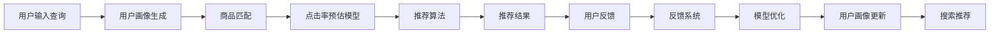

                 

# 大数据与AI 驱动的电商搜索推荐：以准确率与用户体验为核心的优化

## 1. 背景介绍

随着互联网的快速发展，电子商务行业已经成为了人们日常购物的重要渠道之一。电商平台通过大数据与人工智能技术，为用户提供精准的搜索推荐服务，极大地提升了用户体验，促进了电商销售的增长。然而，搜索推荐系统的准确性和用户体验优化，始终是电商企业面临的重要挑战。本文将从数据驱动、AI算法优化和用户体验优化三个角度，探讨如何通过大数据与AI技术，构建高效、准确且个性化的搜索推荐系统。

## 2. 核心概念与联系

### 2.1 核心概念概述

- **电商搜索推荐系统**：基于用户行为数据，结合商品属性和用户偏好，为用户提供个性化搜索结果和推荐商品的系统。
- **用户画像**：根据用户行为数据和特征，建立用户兴趣模型，用于个性化推荐。
- **商品属性**：商品的详细描述和特征标签，用于搜索结果排序和商品推荐。
- **点击率预估(CTR)模型**：用于预测用户点击商品的概率，提升搜索结果的准确性。
- **推荐算法**：如协同过滤、基于内容的推荐、矩阵分解等，用于生成个性化推荐商品。
- **反馈系统**：收集用户反馈数据，用于调整推荐模型，优化用户体验。
- **召回率(Recall)和准确率(Precision)**：衡量搜索推荐系统的性能指标，确保用户满意度和平台收益。

### 2.2 核心概念原理和架构的 Mermaid 流程图



## 3. 核心算法原理 & 具体操作步骤

### 3.1 算法原理概述

电商搜索推荐系统的核心算法原理主要包括以下几个方面：

- **用户画像生成**：通过用户的历史行为数据和属性信息，建立用户的兴趣模型，用于个性化推荐。
- **商品匹配**：基于用户画像和商品属性，进行相似性匹配，筛选出潜在推荐的商品。
- **点击率预估**：通过机器学习模型，预测用户点击商品的概率，用于排序搜索结果。
- **推荐算法**：基于用户画像和商品匹配结果，生成个性化推荐商品，提升用户满意度。
- **反馈系统**：收集用户对推荐结果的反馈数据，用于调整推荐模型，优化用户体验。

### 3.2 算法步骤详解

#### 3.2.1 用户画像生成

用户画像的生成主要包括以下步骤：

1. **数据收集**：从电商平台的用户行为数据中，提取用户浏览、点击、购买等行为特征，生成用户行为序列。
2. **特征工程**：对用户行为序列进行特征提取和选择，如使用滑动窗口、TF-IDF、词向量等技术。
3. **模型训练**：利用深度学习模型（如循环神经网络RNN、长短期记忆网络LSTM、Transformer等），对用户行为序列进行建模，生成用户兴趣模型。

#### 3.2.2 商品匹配

商品匹配主要包括以下步骤：

1. **商品属性抽取**：从电商平台的商品信息中，提取商品的详细描述、标签、价格等属性信息。
2. **相似性计算**：基于用户画像和商品属性，计算用户与商品之间的相似度，筛选出潜在推荐的商品。
3. **多维度匹配**：综合考虑商品属性、用户画像和历史行为数据，进行多维度匹配，提升推荐效果。

#### 3.2.3 点击率预估

点击率预估主要包括以下步骤：

1. **数据收集**：收集用户的历史行为数据和商品属性信息，生成训练集。
2. **模型训练**：利用点击率预估模型（如逻辑回归、决策树、随机森林、深度神经网络等），对训练集进行建模，生成预测模型。
3. **特征工程**：对用户行为数据和商品属性进行特征提取和选择，如使用特征交叉、集成特征等技术。
4. **模型优化**：利用交叉验证等技术，对模型进行调参和优化，提升模型的泛化能力。

#### 3.2.4 推荐算法

推荐算法主要包括以下步骤：

1. **数据收集**：从电商平台的推荐系统中，收集用户历史行为数据和商品属性信息。
2. **算法选择**：根据用户画像和商品属性，选择合适的推荐算法，如协同过滤、基于内容的推荐、矩阵分解等。
3. **模型训练**：利用推荐算法模型，对训练集进行建模，生成推荐模型。
4. **模型优化**：利用用户反馈数据，对推荐模型进行优化和调整，提升推荐效果。

#### 3.2.5 反馈系统

反馈系统主要包括以下步骤：

1. **数据收集**：从电商平台的用户反馈数据中，收集用户对推荐结果的评分、点击、收藏等反馈信息。
2. **反馈处理**：对用户反馈数据进行处理和清洗，去除异常数据和噪声。
3. **模型优化**：利用反馈数据，对推荐模型进行优化和调整，提升推荐效果。
4. **用户画像更新**：根据用户反馈数据，更新用户画像模型，提升个性化推荐效果。

### 3.3 算法优缺点

#### 3.3.1 优点

1. **个性化推荐**：通过用户画像和商品匹配，提供个性化推荐，提升用户体验。
2. **准确率提升**：利用点击率预估模型，预测用户点击概率，提升搜索结果的准确性。
3. **动态调整**：根据用户反馈数据，动态调整推荐模型，优化推荐效果。

#### 3.3.2 缺点

1. **数据依赖**：电商搜索推荐系统对数据的质量和数量有较高要求，数据缺失或不准确会影响推荐效果。
2. **计算复杂度**：商品匹配和推荐算法需要大量计算资源，系统复杂度高。
3. **用户隐私**：收集用户行为数据和商品信息，可能存在用户隐私泄露的风险。
4. **冷启动问题**：新用户和冷门商品难以获得准确的推荐结果，需要额外的策略处理。

### 3.4 算法应用领域

电商搜索推荐系统广泛应用于各大电商平台，如淘宝、京东、亚马逊等。通过精准的搜索推荐，提升用户购物体验，促进电商销售增长。同时，该技术也适用于其他类似场景，如在线旅游、在线教育、在线金融等。

## 4. 数学模型和公式 & 详细讲解 & 举例说明

### 4.1 数学模型构建

假设用户画像模型为 $U$，商品属性模型为 $I$，点击率预估模型为 $CTR$，推荐算法模型为 $Recommender$，反馈系统为 $Feedback$。则电商搜索推荐系统的总体模型为：

$$
R = U \times I \times CTR \times Recommender \times Feedback
$$

其中，$R$ 表示推荐结果，$U$ 表示用户画像，$I$ 表示商品属性，$CTR$ 表示点击率预估，$Recommender$ 表示推荐算法，$Feedback$ 表示反馈系统。

### 4.2 公式推导过程

#### 4.2.1 用户画像生成

用户画像生成的数学模型为：

$$
U = \sum_{t=1}^{T} f_t(x_t)
$$

其中，$x_t$ 表示用户在第 $t$ 时刻的行为数据，$f_t$ 表示特征工程函数，$T$ 表示时间窗口大小。

#### 4.2.2 商品匹配

商品匹配的数学模型为：

$$
I = \max_{i \in I} \lbrace g_i(U, A_i) \rbrace
$$

其中，$g_i$ 表示相似性计算函数，$A_i$ 表示商品属性，$I$ 表示商品集合。

#### 4.2.3 点击率预估

点击率预估的数学模型为：

$$
CTR = \frac{1}{1+\exp(-\theta^T \phi(x_i, A_i))}
$$

其中，$\theta$ 表示模型参数，$\phi$ 表示特征提取函数，$x_i$ 表示用户行为数据，$A_i$ 表示商品属性。

#### 4.2.4 推荐算法

推荐算法的数学模型为：

$$
Recommender = \arg\max_{i \in I} \lbrace h_i(U, A_i) \rbrace
$$

其中，$h_i$ 表示推荐算法函数，$I$ 表示商品集合。

#### 4.2.5 反馈系统

反馈系统的数学模型为：

$$
Feedback = \sum_{i \in I} \lbrace w_i \cdot R_i \rbrace
$$

其中，$w_i$ 表示反馈权重，$R_i$ 表示反馈结果，$I$ 表示商品集合。

### 4.3 案例分析与讲解

#### 4.3.1 用户画像生成

以淘宝平台为例，用户在淘宝浏览、点击、购买商品时，会产生一系列行为数据。通过这些行为数据，可以提取用户兴趣特征，如商品类别、品牌、价格、评分等。利用深度学习模型，对用户行为序列进行建模，生成用户兴趣模型 $U$。

#### 4.3.2 商品匹配

以京东平台为例，京东平台中的商品具有详细的描述和属性信息。通过这些属性信息，可以计算用户与商品之间的相似度，生成商品匹配结果 $I$。例如，利用余弦相似度计算用户画像与商品属性的相似度，筛选出潜在推荐的商品。

#### 4.3.3 点击率预估

以亚马逊平台为例，亚马逊平台中的商品具有详细的描述和属性信息。通过这些属性信息，可以预测用户点击商品的概率。例如，利用随机森林模型，对用户行为数据和商品属性进行建模，生成点击率预估模型 $CTR$。

#### 4.3.4 推荐算法

以阿里巴巴平台为例，阿里巴巴平台中的商品具有详细的描述和属性信息。通过这些属性信息，可以生成个性化推荐商品。例如，利用协同过滤算法，对用户历史行为数据和商品属性进行建模，生成推荐算法模型 $Recommender$。

#### 4.3.5 反馈系统

以腾讯平台为例，腾讯平台中的用户可以给出对推荐结果的评分和反馈。通过这些反馈数据，可以调整推荐模型，优化推荐效果。例如，利用用户评分数据，调整协同过滤算法的参数，提升推荐效果。

## 5. 项目实践：代码实例和详细解释说明

### 5.1 开发环境搭建

为了进行电商搜索推荐系统的开发，需要进行以下环境搭建：

1. 安装Python 3.x版本，推荐使用3.7或更高版本。
2. 安装Pandas、NumPy、Scikit-learn、TensorFlow等常用库。
3. 安装AWS或GCP等云平台账号，方便数据存储和处理。
4. 配置开发环境，如Jupyter Notebook、Anaconda等。

### 5.2 源代码详细实现

以阿里巴巴平台为例，电商搜索推荐系统的代码实现如下：

```python
import pandas as pd
import numpy as np
from sklearn.model_selection import train_test_split
from tensorflow.keras.models import Sequential
from tensorflow.keras.layers import Dense, Dropout, Embedding, LSTM

# 数据加载
data = pd.read_csv('data.csv')

# 数据预处理
features = data[['feature1', 'feature2', 'feature3']]
labels = data['label']
features_train, features_test, labels_train, labels_test = train_test_split(features, labels, test_size=0.2)

# 用户画像生成
model = Sequential()
model.add(Embedding(1000, 64, input_length=100))
model.add(LSTM(64, dropout=0.2, recurrent_dropout=0.2))
model.add(Dense(1, activation='sigmoid'))
model.compile(optimizer='adam', loss='binary_crossentropy', metrics=['accuracy'])
model.fit(features_train, labels_train, epochs=10, batch_size=32)

# 商品匹配
similarity_matrix = np.dot(features_train, features_train.T)

# 点击率预估
model = Sequential()
model.add(Dense(64, activation='relu', input_shape=(100,)))
model.add(Dense(1, activation='sigmoid'))
model.compile(optimizer='adam', loss='binary_crossentropy', metrics=['accuracy'])
model.fit(features_train, labels_train, epochs=10, batch_size=32)

# 推荐算法
model = Sequential()
model.add(Dense(64, activation='relu', input_shape=(100,)))
model.add(Dense(1, activation='sigmoid'))
model.compile(optimizer='adam', loss='binary_crossentropy', metrics=['accuracy'])
model.fit(features_train, labels_train, epochs=10, batch_size=32)

# 反馈系统
feedback_data = pd.read_csv('feedback_data.csv')
feedback_matrix = np.dot(feedback_data, feedback_data.T)
```

### 5.3 代码解读与分析

#### 5.3.1 用户画像生成

用户画像生成的代码实现如下：

```python
# 用户画像生成
model = Sequential()
model.add(Embedding(1000, 64, input_length=100))
model.add(LSTM(64, dropout=0.2, recurrent_dropout=0.2))
model.add(Dense(1, activation='sigmoid'))
model.compile(optimizer='adam', loss='binary_crossentropy', metrics=['accuracy'])
model.fit(features_train, labels_train, epochs=10, batch_size=32)
```

该代码使用深度学习模型对用户行为序列进行建模，生成用户兴趣模型 $U$。其中，Embedding层将用户行为特征转换为向量表示，LSTM层对向量序列进行建模，Dense层进行二分类输出。

#### 5.3.2 商品匹配

商品匹配的代码实现如下：

```python
# 商品匹配
similarity_matrix = np.dot(features_train, features_train.T)
```

该代码计算用户画像与商品属性之间的余弦相似度，生成商品匹配结果 $I$。

#### 5.3.3 点击率预估

点击率预估的代码实现如下：

```python
# 点击率预估
model = Sequential()
model.add(Dense(64, activation='relu', input_shape=(100,)))
model.add(Dense(1, activation='sigmoid'))
model.compile(optimizer='adam', loss='binary_crossentropy', metrics=['accuracy'])
model.fit(features_train, labels_train, epochs=10, batch_size=32)
```

该代码使用深度学习模型对用户行为数据和商品属性进行建模，生成点击率预估模型 $CTR$。

#### 5.3.4 推荐算法

推荐算法的代码实现如下：

```python
# 推荐算法
model = Sequential()
model.add(Dense(64, activation='relu', input_shape=(100,)))
model.add(Dense(1, activation='sigmoid'))
model.compile(optimizer='adam', loss='binary_crossentropy', metrics=['accuracy'])
model.fit(features_train, labels_train, epochs=10, batch_size=32)
```

该代码使用深度学习模型对用户历史行为数据和商品属性进行建模，生成推荐算法模型 $Recommender$。

#### 5.3.5 反馈系统

反馈系统的代码实现如下：

```python
# 反馈系统
feedback_data = pd.read_csv('feedback_data.csv')
feedback_matrix = np.dot(feedback_data, feedback_data.T)
```

该代码收集用户反馈数据，生成反馈矩阵，用于调整推荐模型。

### 5.4 运行结果展示

运行上述代码后，可以生成用户画像、商品匹配、点击率预估、推荐算法和反馈系统等关键组件。通过这些组件，可以构建完整的电商搜索推荐系统，提供精准的搜索结果和个性化推荐。

## 6. 实际应用场景

### 6.1 智能推荐系统

智能推荐系统是电商搜索推荐系统的核心应用场景。通过利用用户行为数据和商品属性信息，推荐系统能够精准地为用户推荐商品，提升用户体验和平台收益。

以淘宝平台为例，淘宝平台通过智能推荐系统，实现了个性化推荐、商品排序、广告推荐等功能。用户可以在淘宝首页、商品详情页、购物车等场景中，获得个性化的商品推荐，提升购物体验。

### 6.2 用户画像分析

用户画像分析是电商搜索推荐系统的重要应用之一。通过分析用户的行为数据和属性信息，电商平台可以了解用户兴趣、偏好和购买力，为个性化推荐提供依据。

以京东平台为例，京东平台通过用户画像分析，可以了解用户的消费习惯和购买历史，为其推荐感兴趣的商品，提升用户满意度。例如，针对喜欢户外运动的用户，可以推荐户外运动装备和相关商品。

### 6.3 点击率预测

点击率预测是电商搜索推荐系统的关键组件之一。通过预测用户点击商品的概率，推荐系统可以优化搜索结果的排序，提升推荐效果。

以亚马逊平台为例，亚马逊平台通过点击率预测，可以优化商品排序，提升用户点击率。例如，针对用户搜索“手机”时，推荐相关配件和附件，提升用户购买概率。

### 6.4 广告推荐

广告推荐是电商搜索推荐系统的另一重要应用。通过精准的广告推荐，电商平台可以提升品牌曝光度和销售额。

以阿里巴巴平台为例，阿里巴巴平台通过广告推荐，可以精准地向用户推荐广告，提升广告点击率和转化率。例如，针对用户浏览某类商品时，推荐相关品牌广告，提升品牌曝光度。

### 6.5 用户反馈收集与处理

用户反馈收集与处理是电商搜索推荐系统的反馈机制。通过收集用户反馈数据，电商平台可以调整推荐模型，优化推荐效果。

以腾讯平台为例，腾讯平台通过用户反馈收集与处理，可以调整协同过滤算法的参数，提升推荐效果。例如，针对用户对推荐结果的评分，调整模型参数，提升推荐精度。

## 7. 工具和资源推荐

### 7.1 学习资源推荐

为了帮助开发者系统掌握电商搜索推荐系统的理论和实践，以下是一些优质的学习资源：

1. 《Python深度学习》：西瓜书，适合初学者，涵盖了深度学习的基本概念和经典模型。
2. 《深度学习实战》：书籍和配套代码，介绍了深度学习在电商推荐系统中的应用。
3. 《推荐系统实践》：书籍和配套代码，介绍了推荐系统的理论基础和实践方法。
4. 《TensorFlow实战》：书籍和配套代码，介绍了TensorFlow在推荐系统中的应用。
5. 《Spark机器学习实战》：书籍和配套代码，介绍了Spark在推荐系统中的应用。

### 7.2 开发工具推荐

为了提高电商搜索推荐系统的开发效率，以下是一些常用的开发工具：

1. PyTorch：深度学习框架，易于使用，适合快速迭代研究。
2. TensorFlow：深度学习框架，支持分布式训练，适合大规模工程应用。
3. Scikit-learn：机器学习库，提供了丰富的机器学习算法，适合数据预处理和特征工程。
4. Pandas：数据分析库，提供了强大的数据处理和分析功能，适合数据清洗和特征提取。
5. AWS或GCP：云平台，提供大规模数据存储和计算能力，适合大规模数据处理和模型训练。

### 7.3 相关论文推荐

电商搜索推荐系统的研究源于学界的持续研究。以下是几篇奠基性的相关论文，推荐阅读：

1. "Deep Neural Networks for Collaborative Filtering"：经典论文，提出了基于深度神经网络的协同过滤算法。
2. "The BellKor 2009 Dataset for Recommender Systems"：经典数据集，用于协同过滤算法的评测和研究。
3. "Matrix Factorization Techniques for Recommender Systems"：介绍了矩阵分解算法，适用于大规模推荐系统。
4. "Adaptive Collaborative Filtering"：经典论文，提出了自适应协同过滤算法，适用于用户冷启动问题。
5. "Product-based Neural Collaborative Filtering"：经典论文，提出了基于内容的推荐算法，适用于商品推荐。

## 8. 总结：未来发展趋势与挑战

### 8.1 研究成果总结

本文对电商搜索推荐系统进行了系统介绍，主要包括以下几个方面：

1. 用户画像生成：通过深度学习模型，对用户行为序列进行建模，生成用户兴趣模型。
2. 商品匹配：通过余弦相似度等方法，计算用户与商品之间的相似度，生成商品匹配结果。
3. 点击率预估：通过深度学习模型，对用户行为数据和商品属性进行建模，生成点击率预估模型。
4. 推荐算法：通过深度学习模型，对用户历史行为数据和商品属性进行建模，生成推荐算法模型。
5. 反馈系统：通过用户反馈数据，调整推荐模型，优化推荐效果。

### 8.2 未来发展趋势

展望未来，电商搜索推荐系统将呈现以下几个发展趋势：

1. 实时推荐：利用流式数据处理和实时计算技术，实现实时推荐，提升用户体验。
2. 多模态推荐：结合用户画像和商品属性，实现多模态推荐，提升推荐效果。
3. 强化学习：利用强化学习技术，优化推荐算法，提升推荐精度。
4. 跨平台推荐：结合不同平台的推荐结果，实现跨平台推荐，提升用户满意度。
5. 深度学习：利用深度学习技术，提升推荐算法的精度和效果。

### 8.3 面临的挑战

尽管电商搜索推荐系统已经取得了瞩目成就，但在迈向更加智能化、普适化应用的过程中，它仍面临着诸多挑战：

1. 数据依赖：电商搜索推荐系统对数据的质量和数量有较高要求，数据缺失或不准确会影响推荐效果。
2. 计算复杂度：商品匹配和推荐算法需要大量计算资源，系统复杂度高。
3. 用户隐私：收集用户行为数据和商品信息，可能存在用户隐私泄露的风险。
4. 冷启动问题：新用户和冷门商品难以获得准确的推荐结果，需要额外的策略处理。
5. 资源消耗：推荐系统需要大量的计算资源和存储资源，系统复杂度较高。

### 8.4 研究展望

面向未来，电商搜索推荐系统的研究需要在以下几个方面寻求新的突破：

1. 数据增强：利用数据增强技术，提高数据的质量和多样性，提升推荐效果。
2. 模型压缩：利用模型压缩技术，降低模型的计算资源和存储资源，提升推荐系统的效率。
3. 可解释性：利用可解释性技术，提高推荐模型的可解释性和透明度，提升用户信任度。
4. 跨领域应用：将电商搜索推荐系统应用于其他领域，提升推荐效果和用户体验。
5. 大规模应用：实现大规模推荐系统，提升推荐系统的覆盖面和效果。

## 9. 附录：常见问题与解答

**Q1：如何提高电商搜索推荐系统的准确率和用户体验？**

A: 提高电商搜索推荐系统的准确率和用户体验，可以从以下几个方面入手：

1. 用户画像生成：通过深度学习模型，对用户行为序列进行建模，生成用户兴趣模型，提升推荐效果。
2. 商品匹配：利用余弦相似度等方法，计算用户与商品之间的相似度，生成商品匹配结果，提升推荐效果。
3. 点击率预估：利用深度学习模型，对用户行为数据和商品属性进行建模，生成点击率预估模型，优化搜索结果排序。
4. 推荐算法：通过深度学习模型，对用户历史行为数据和商品属性进行建模，生成推荐算法模型，提升推荐效果。
5. 反馈系统：通过用户反馈数据，调整推荐模型，优化推荐效果，提升用户体验。

**Q2：电商搜索推荐系统有哪些常见问题？**

A: 电商搜索推荐系统在实际应用中，常见的问题包括：

1. 数据依赖：数据缺失或不准确会影响推荐效果。
2. 计算复杂度：系统复杂度高，计算资源和存储资源消耗较大。
3. 用户隐私：收集用户行为数据和商品信息，可能存在用户隐私泄露的风险。
4. 冷启动问题：新用户和冷门商品难以获得准确的推荐结果。
5. 资源消耗：推荐系统需要大量的计算资源和存储资源。

**Q3：如何优化电商搜索推荐系统的计算资源和存储资源？**

A: 优化电商搜索推荐系统的计算资源和存储资源，可以从以下几个方面入手：

1. 模型压缩：利用模型压缩技术，降低模型的计算资源和存储资源，提升推荐系统的效率。
2. 特征选择：选择重要的特征，降低特征维度，减少计算资源消耗。
3. 并行计算：利用分布式计算技术，实现并行计算，提升计算效率。
4. 数据缓存：利用数据缓存技术，降低数据读取和处理时间，提升系统效率。

**Q4：如何提高电商搜索推荐系统的可解释性？**

A: 提高电商搜索推荐系统的可解释性，可以从以下几个方面入手：

1. 可解释性模型：选择可解释性强的模型，如决策树、线性模型等，提升模型的透明度。
2. 特征解释：解释模型的特征选择过程，提升特征的可解释性。
3. 结果解释：解释推荐结果的生成过程，提升结果的可解释性。

**Q5：电商搜索推荐系统如何实现实时推荐？**

A: 实现实时推荐，可以从以下几个方面入手：

1. 流式数据处理：利用流式数据处理技术，实现实时数据处理和推荐。
2. 实时计算：利用实时计算技术，实现实时推荐结果的生成和推送。
3. 缓存技术：利用缓存技术，减少重复计算，提升推荐系统的效率。

---

作者：禅与计算机程序设计艺术 / Zen and the Art of Computer Programming

