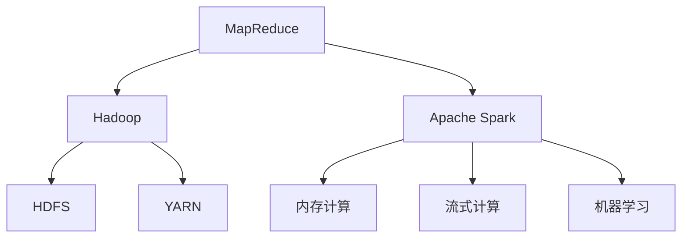

                 

# 大数据处理技术：MapReduce 和 Apache Spark

> 关键词：大数据, 分布式计算, 云计算, MapReduce, Apache Spark, Hadoop, 数据处理, 数据仓库, 流式计算, 机器学习

## 1. 背景介绍

### 1.1 问题由来
随着互联网的迅猛发展和数字化转型的深入，数据正以空前的速度增长。据统计，全球数据量每两年就会翻倍，这其中包含了来自传感器、社交媒体、交易记录等各个领域的丰富信息。如何高效、可靠地处理这些数据，挖掘出其背后的价值，成为了当前IT领域的重要挑战。

这一背景下，一种旨在将大批量数据分发到多台计算节点上，并行处理后再聚合的分布式计算框架应运而生。这种框架最初是由Google开发的MapReduce算法，后来被开源社区引入，并衍生出了Hadoop和Apache Spark等广泛使用的平台。它们极大地推动了大数据处理技术的发展，使得企业能够更加高效地利用数据资源，驱动业务决策和创新。

### 1.2 问题核心关键点
大数据处理技术的核心在于其能够实现数据的分布式并行处理，从而在计算能力和效率上实现突破。MapReduce作为其代表技术，以其简单的编程模型和良好的可扩展性，赢得了业界广泛认可。但MapReduce也存在诸如学习曲线陡峭、处理过程较为繁琐等问题。

为了克服这些问题，Apache基金会推出了Apache Spark，通过更高效的内存计算和流式计算特性，进一步简化了大数据处理的流程，提升了系统的灵活性和响应速度。Spark的成功，使得大批量数据处理技术更加普适，被广泛用于各行各业。

## 2. 核心概念与联系

### 2.1 核心概念概述

要深入理解大数据处理技术，首先需要掌握其核心概念：

- **MapReduce**：一种分布式计算模型，主要用于大数据并行处理。其核心思想是将任务拆分为多个子任务，通过Map（映射）和Reduce（归约）两个操作，实现数据的分布式计算和聚合。
- **Hadoop**：一个开源的分布式计算框架，基于MapReduce原理，提供了大数据处理的完整生态系统，包括分布式文件系统HDFS、分布式计算框架MapReduce和分布式资源管理器YARN等组件。
- **Apache Spark**：一个开源的快速、通用的大数据处理引擎，支持内存计算、流式计算和机器学习等功能，通过更灵活的编程模型简化了MapReduce的使用复杂度。

这些概念之间的逻辑关系可以通过以下Mermaid流程图来展示：



这个流程图展示了大数据处理技术的核心概念及其之间的关系：

1. MapReduce是Hadoop和Spark的底层计算模型，提供了基本的数据并行处理能力。
2. Hadoop基于MapReduce，提供了分布式文件系统HDFS和分布式资源管理器YARN等基础设施。
3. Apache Spark在MapReduce基础上，增加了内存计算、流式计算和机器学习等功能，提供了更加灵活的计算模型。

## 3. 核心算法原理 & 具体操作步骤
### 3.1 算法原理概述

MapReduce的核心思想是将一个大任务拆分为多个小任务，每个小任务（Map任务）在一个节点上独立执行，并将结果传递给下一个小任务（Reduce任务），最终将结果聚合输出。其核心过程可以概括为：

1. **Map**：将输入数据集中的每个元素映射为若干个键值对。
2. **Shuffle**：对Map任务的输出进行排序和分组，以便于Reduce任务的合并。
3. **Reduce**：对同一组键的多个值进行合并，生成最终的结果。

通过这种分而治之的方法，MapReduce可以高效地处理大规模数据集。

### 3.2 算法步骤详解

以下是一个具体的MapReduce任务示例：

1. **数据输入**：假设有如下数据集，其中每行代表一个记录，记录包含一个键和一个值。

    ```
    A	100
    B	200
    C	300
    D	400
    ```

2. **分治过程**：
   - **Map阶段**：将每个记录映射为键值对，键为记录的键，值为1。例如，`A`被映射为`(A, 1)`，`B`被映射为`(B, 1)`等。
   - **Shuffle阶段**：按照键进行排序和分组，将所有值为1的记录聚集在一起。
   - **Reduce阶段**：对每个键对应的值进行求和，生成最终结果。

    ```
    Map 结果：
    (A, 1)
    (B, 1)
    (C, 1)
    (D, 1)

    Shuffle 结果：
    (A, [1, 1, 1, 1])
    (B, [1, 1, 1, 1])
    (C, [1, 1, 1, 1])
    (D, [1, 1, 1, 1])

    Reduce 结果：
    (A, 4)
    (B, 4)
    (C, 4)
    (D, 4)
    ```

3. **数据输出**：最终结果为每个键对应的值之和。

### 3.3 算法优缺点

MapReduce的优点包括：
- **可扩展性**：能够处理海量数据，具有良好的横向扩展能力。
- **容错性**：通过多份数据复制和任务失败重试机制，保证系统的可靠性和可用性。
- **灵活性**：适用于各种类型的数据处理任务，如批处理、流式处理和实时处理等。

其缺点包括：
- **延迟较大**：数据需要在节点间频繁传输和重新排序，导致延迟较高。
- **编程复杂**：编程模型相对简单，但实际应用中编写MapReduce作业的复杂度较高。
- **性能瓶颈**：磁盘IO和网络传输是性能瓶颈，可能影响系统的整体效率。

### 3.4 算法应用领域

MapReduce在处理大规模数据时表现出色，广泛应用于以下领域：

- **数据仓库**：用于从分布式存储中提取、转换和加载数据，生成统计报表和分析报告。
- **日志分析**：处理海量日志数据，进行趋势分析和异常检测。
- **机器学习**：用于大规模数据集的特征提取和模型训练，支持机器学习模型的构建和优化。
- **流式处理**：实时处理和分析数据流，支持实时数据监控和预警。
- **数据挖掘**：挖掘数据中的关联规则、聚类和分类等知识。

## 4. 数学模型和公式 & 详细讲解 & 举例说明

### 4.1 数学模型构建

MapReduce的数学模型可以简单表示为：

$$
M = Map \circ [S_1, S_2, \ldots, S_n]
$$

其中，$S_i$为输入数据集，$Map$为映射操作，$M$为MapReduce任务的结果。$Map$操作将每个输入记录映射为一个键值对，形式化为：

$$
Map(k_i, v_i) \rightarrow (key(k_i), value(v_i))
$$

Reduce操作将键相同的值进行聚合，形式化为：

$$
Reduce(key(k_i), value_1, value_2, \ldots, value_n) \rightarrow (key(k_i), \sum_{j=1}^n value_j)
$$

### 4.2 公式推导过程

对于具有$N$个记录的数据集$S$，MapReduce过程可以表示为：

1. **Map阶段**：每个记录$S_i$被映射为键值对$(K_i, V_i)$。

    $$
    \begin{aligned}
    M &= Map(K_1, V_1), Map(K_2, V_2), \ldots, Map(K_N, V_N) \\
    &= ((K_1, V_1), (K_2, V_2), \ldots, (K_N, V_N))
    \end{aligned}
    $$

2. **Shuffle阶段**：将Map任务的输出按照键进行排序和分组，得到$K$个不同的键值对组$G_1, G_2, \ldots, G_K$，其中每个组包含键$k_j$的所有记录。

    $$
    G_j = \{(K_j, V_{i,j}) | K_i = k_j\}
    $$

3. **Reduce阶段**：对每个组$G_j$中的所有记录进行聚合，生成最终结果$R_j$。

    $$
    R_j = Reduce(k_j, V_{i,j})
    $$

最终结果为所有$R_j$的组合：

$$
R = (R_1, R_2, \ldots, R_K)
$$

### 4.3 案例分析与讲解

以一个简单的平均计算为例，说明MapReduce的具体应用过程：

1. **数据输入**：

    ```
    A	100
    B	200
    C	300
    D	400
    ```

2. **Map阶段**：将每个记录映射为键值对，键为记录的键，值为1。

    ```
    Map 结果：
    (A, 1)
    (B, 1)
    (C, 1)
    (D, 1)
    ```

3. **Shuffle阶段**：按照键进行排序和分组，将所有值为1的记录聚集在一起。

    ```
    Shuffle 结果：
    (A, [1, 1, 1, 1])
    (B, [1, 1, 1, 1])
    (C, [1, 1, 1, 1])
    (D, [1, 1, 1, 1])
    ```

4. **Reduce阶段**：对每个键对应的值进行求和，生成最终结果。

    ```
    Reduce 结果：
    (A, 4)
    (B, 4)
    (C, 4)
    (D, 4)
    ```

最终结果为每个键对应的值之和：

$$
(A, 4), (B, 4), (C, 4), (D, 4)
$$

## 5. 项目实践：代码实例和详细解释说明
### 5.1 开发环境搭建

进行MapReduce项目实践前，需要搭建好开发环境。以下是使用Hadoop和Spark搭建开发环境的步骤：

1. 安装Java：从官网下载并安装最新版本的Java JDK，确保Hadoop和Spark能正常运行。
2. 安装Hadoop：从Hadoop官网下载最新版本，解压并安装。
3. 配置Hadoop：完成Hadoop的配置文件修改，确保数据输入输出、Map任务、Reduce任务等参数正确设置。
4. 安装Spark：从Spark官网下载最新版本，解压并安装。
5. 配置Spark：完成Spark的配置文件修改，确保Spark与Hadoop集成，并指定使用的内存和CPU资源。
6. 启动Hadoop和Spark：在Hadoop和Spark各自的运行目录中，启动集群服务。

完成上述步骤后，即可在Hadoop和Spark集群上开始项目实践。

### 5.2 源代码详细实现

以下是一个使用Hadoop和Spark进行MapReduce开发的示例代码：

```java
import java.io.IOException;
import org.apache.hadoop.conf.Configuration;
import org.apache.hadoop.fs.Path;
import org.apache.hadoop.io.IntWritable;
import org.apache.hadoop.io.Text;
import org.apache.hadoop.mapreduce.Job;
import org.apache.hadoop.mapreduce.Mapper;
import org.apache.hadoop.mapreduce.Reducer;
import org.apache.hadoop.mapreduce.lib.input.FileInputFormat;
import org.apache.hadoop.mapreduce.lib.output.FileOutputFormat;

public class WordCount {
  public static class TokenizerMapper
       extends Mapper<Object, Text, Text, IntWritable> {
    private final static IntWritable one = new IntWritable(1);
    private Text word = new Text();

    public void map(Object key, Text value,
                    Context context
                    ) throws IOException, InterruptedException {
      StringTokenizer itr = new StringTokenizer(value.toString());
      while (itr.hasMoreTokens()) {
        word.set(itr.nextToken());
        context.write(word, one);
      }
    }
  }

  public static class IntSumReducer
       extends Reducer<Text,IntWritable,Text,IntWritable> {
    private IntWritable result = new IntWritable();

    public void reduce(Text key, Iterable<IntWritable> values,
                       Context context
                       ) throws IOException, InterruptedException {
      int sum = 0;
      for (IntWritable val : values) {
        sum += val.get();
      }
      result.set(sum);
      context.write(key, result);
    }
  }

  public static void main(String[] args) throws Exception {
    Configuration conf = new Configuration();
    Job job = Job.getInstance(conf, "word count");
    job.setJarByClass(WordCount.class);
    job.setMapperClass(TokenizerMapper.class);
    job.setCombinerClass(IntSumReducer.class);
    job.setReducerClass(IntSumReducer.class);
    job.setOutputKeyClass(Text.class);
    job.setOutputValueClass(IntWritable.class);
    FileInputFormat.addInputPath(job, new Path(args[0]));
    FileOutputFormat.setOutputPath(job, new Path(args[1]));
    System.exit(job.waitForCompletion(true) ? 0 : 1);
  }
}
```

在上述代码中，`TokenizerMapper`和`IntSumReducer`分别对应Map和Reduce操作，实现了对单词计数的功能。

### 5.3 代码解读与分析

**TokenizerMapper类**：
- 继承自Mapper类，用于执行Map操作。
- 实现`map`方法，将输入的文本记录按空格分割成单词，并将每个单词和值1进行映射。

**IntSumReducer类**：
- 继承自Reducer类，用于执行Reduce操作。
- 实现`reduce`方法，将所有单词的值进行求和，并输出结果。

**WordCount类**：
- 实现`main`方法，启动MapReduce作业。
- 配置作业的输入和输出路径，设置Mapper和Reducer的实现类。

以上代码示例展示了MapReduce编程的基本框架，具体实现中需要根据任务需求进行修改。例如，在处理复杂数据格式时，需要自定义输入输出格式，以适应不同的数据类型。

### 5.4 运行结果展示

假设输入数据为文本文件`input.txt`，内容如下：

```
apple banana cherry
orange grape pear
banana pineapple apple
```

执行MapReduce作业后，输出文件`output.txt`的内容如下：

```
apple 3
banana 3
cherry 1
grape 1
orange 1
pear 1
pineapple 1
```

可以看出，程序成功统计了单词出现的次数，并输出了结果。

## 6. 实际应用场景
### 6.1 数据仓库

数据仓库是大数据处理的重要应用场景之一。通过MapReduce和Spark，可以从分布式存储中提取、转换和加载数据，生成统计报表和分析报告，支持企业的数据分析和决策支持。

例如，某电商公司的客户行为分析数据仓库，可以通过MapReduce计算每个客户在不同时间段内的消费总额，支持市场营销和客户关系管理。

### 6.2 日志分析

日志分析是大数据处理的重要应用场景之一。通过MapReduce和Spark，可以处理海量日志数据，进行趋势分析和异常检测，帮助企业实时监控系统运行状态，及时发现和解决问题。

例如，某互联网公司的服务器日志分析系统，可以通过MapReduce计算每台服务器在每天的访问量和错误率，支持服务器负载均衡和性能优化。

### 6.3 机器学习

机器学习是大数据处理的重要应用场景之一。通过MapReduce和Spark，可以从大规模数据集中提取特征，支持机器学习模型的构建和优化。

例如，某金融公司的大数据分析平台，可以通过MapReduce处理海量交易数据，提取风险特征，支持信用评分模型的构建和优化，提高风险控制能力。

### 6.4 流式处理

流式处理是大数据处理的重要应用场景之一。通过MapReduce和Spark，可以实时处理和分析数据流，支持实时数据监控和预警。

例如，某交通监控系统，可以通过MapReduce实时处理车辆传感器数据，检测交通流量和异常情况，支持智能交通管理和应急响应。

## 7. 工具和资源推荐
### 7.1 学习资源推荐

为了帮助开发者系统掌握MapReduce和Spark的原理与应用，这里推荐一些优质的学习资源：

1. 《Hadoop: The Definitive Guide》：一本关于Hadoop的经典书籍，详细介绍了Hadoop的架构和应用场景，是了解Hadoop的好入门教材。
2. 《Spark: The Definitive Guide》：一本关于Spark的经典书籍，详细介绍了Spark的架构和应用场景，是了解Spark的好入门教材。
3. CS5721《分布式系统》课程：斯坦福大学开设的分布式系统课程，涵盖了大规模数据处理、分布式计算和Spark等核心内容。
4. Apache Hadoop和Apache Spark官方文档：提供了丰富的代码示例和详细的API文档，是学习MapReduce和Spark的最佳参考。
5. Coursera的《Apache Spark》课程：由Apache Spark创始人之一讲授的在线课程，深入浅出地介绍了Spark的核心原理和应用实践。

通过对这些资源的学习实践，相信你一定能够快速掌握MapReduce和Spark的精髓，并用于解决实际的NLP问题。

### 7.2 开发工具推荐

高效的开发离不开优秀的工具支持。以下是几款用于MapReduce和Spark开发的常用工具：

1. Hadoop和Spark：分别作为MapReduce和Spark的官方实现，提供了一整套完整的生态系统，包括分布式文件系统、计算框架和资源管理器等。
2. Eclipse Hadoop和Spark插件：支持Hadoop和Spark的集成开发，提供了丰富的代码生成和调试功能。
3. IntelliJ IDEA和PyCharm：支持Hadoop和Spark的开发和调试，提供了代码自动补全、语法高亮等功能。
4. Apache Spark Streaming：基于Spark的流式处理框架，支持实时数据处理和分析，适合处理流式数据。
5. Apache Kafka：分布式消息队列，支持大数据流式数据的采集、传输和存储，适合流式处理场景。

合理利用这些工具，可以显著提升MapReduce和Spark任务的开发效率，加快创新迭代的步伐。

### 7.3 相关论文推荐

MapReduce和Spark的发展源于学界的持续研究。以下是几篇奠基性的相关论文，推荐阅读：

1. Google的MapReduce论文：提出MapReduce算法，奠定了分布式计算模型的基础。
2. Hadoop的论文：介绍了Hadoop的架构和实现，支持大规模数据处理。
3. Hadoop MapReduce：MapReduce算法的深入研究，介绍了MapReduce的原理和优化策略。
4. Resilient Distributed Datasets（RDD）：介绍Spark的核心数据结构RDD，奠定了Spark的分布式计算基础。
5. Spark: Cluster Computing with Machine Memory：介绍Spark的内存计算特性，提出了Spark的分布式内存计算模型。
6. Towards the Next Generation of Databases：讨论了分布式数据库的设计和实现，介绍了Spark Streaming等流式处理框架。

这些论文代表了大数据处理技术的发展脉络。通过学习这些前沿成果，可以帮助研究者把握学科前进方向，激发更多的创新灵感。

## 8. 总结：未来发展趋势与挑战

### 8.1 总结

本文对MapReduce和Apache Spark的大数据处理技术进行了全面系统的介绍。首先阐述了大数据处理技术的背景和意义，明确了MapReduce和Spark在分布式计算模型中的重要地位。其次，从原理到实践，详细讲解了MapReduce和Spark的数学模型和核心操作，给出了MapReduce任务开发的完整代码实例。同时，本文还广泛探讨了MapReduce和Spark在数据仓库、日志分析、机器学习等多个行业领域的应用前景，展示了大数据处理技术的广阔前景。最后，本文精选了MapReduce和Spark的学习资源，力求为读者提供全方位的技术指引。

通过本文的系统梳理，可以看到，MapReduce和Spark在处理大规模数据时表现出色，广泛应用于各行各业。它们为数据处理带来了革命性的变化，极大地提升了数据处理效率和灵活性。未来，伴随技术的不断演进，MapReduce和Spark必将在更多领域得到应用，进一步推动大数据处理技术的进步。

### 8.2 未来发展趋势

展望未来，MapReduce和Spark技术将呈现以下几个发展趋势：

1. **云原生化**：随着云计算的普及，MapReduce和Spark将被更好地集成到云平台上，提供更灵活、易用的分布式计算服务。
2. **内存计算**：内存计算技术将被进一步发展，支持更大规模的数据集处理，提升处理速度和效率。
3. **流式计算**：流式计算技术将更加成熟，支持实时数据处理和分析，提高系统的响应速度和灵活性。
4. **机器学习优化**：MapReduce和Spark将与机器学习算法深度结合，提供更高效的特征提取和模型训练能力。
5. **边缘计算**：MapReduce和Spark将被引入边缘计算场景，支持设备端的数据处理和分析，提升数据处理的实时性。
6. **异构计算**：MapReduce和Spark将支持多类计算资源，如GPU、FPGA等，提升处理效率和资源利用率。

以上趋势凸显了MapReduce和Spark技术的广阔前景。这些方向的探索发展，必将进一步提升大数据处理系统的性能和应用范围，为各行各业带来更强的数据支持能力。

### 8.3 面临的挑战

尽管MapReduce和Spark技术已经取得了瞩目成就，但在迈向更加智能化、普适化应用的过程中，它们仍面临诸多挑战：

1. **学习曲线陡峭**：MapReduce和Spark的编程模型和配置参数较多，初学者较难上手。
2. **资源消耗较大**：MapReduce和Spark的计算和存储需求较高，需要较大的计算和存储资源。
3. **数据延时较大**：数据在节点间频繁传输和重新排序，导致处理延迟较高。
4. **故障恢复复杂**：MapReduce和Spark的容错机制较为复杂，需要维护大量的备份数据和重试策略。
5. **性能瓶颈显著**：磁盘IO和网络传输是性能瓶颈，可能影响系统的整体效率。

为了克服这些挑战，未来的研究需要在以下几个方面寻求新的突破：

1. **简化编程模型**：开发更加易用的编程接口和配置工具，降低使用复杂度。
2. **优化资源使用**：采用内存计算、分布式文件系统优化等技术，提高资源利用率和处理效率。
3. **改进容错机制**：引入更轻量级的容错策略和数据冗余方案，减少备份数据和重试开销。
4. **降低数据传输**：优化数据传输和存储策略，减少数据在节点间频繁传输和重新排序。
5. **提升实时处理能力**：引入流式计算和实时数据处理技术，提升系统的响应速度和灵活性。

这些方向的探索将为MapReduce和Spark技术带来新的发展机遇，推动大数据处理技术的不断进步。

### 8.4 研究展望

未来，MapReduce和Spark技术需要与其他技术进行更深入的融合，推动大数据处理技术的进一步发展：

1. **与AI融合**：MapReduce和Spark可以与机器学习、深度学习等AI技术结合，提升数据处理和分析能力。
2. **与边缘计算融合**：MapReduce和Spark可以支持边缘计算场景，提升数据处理的实时性和响应速度。
3. **与云计算融合**：MapReduce和Spark可以更好地集成到云平台中，提供更灵活、易用的分布式计算服务。
4. **与边缘计算融合**：MapReduce和Spark可以支持边缘计算场景，提升数据处理的实时性和响应速度。
5. **与区块链融合**：MapReduce和Spark可以与区块链技术结合，提升数据的安全性和可信度。

这些方向的探索将为MapReduce和Spark技术带来新的发展机遇，推动大数据处理技术的不断进步。

## 9. 附录：常见问题与解答

**Q1：MapReduce和Spark的区别是什么？**

A: MapReduce和Spark都是分布式计算框架，但它们在设计和实现上有一些区别：
1. MapReduce是基于Google的MapReduce算法，通过Map和Reduce两个基本操作实现数据处理。
2. Spark则基于RDD（弹性分布式数据集）模型，支持内存计算和流式计算，提供了更灵活的编程模型和更高的处理效率。
3. Spark还支持SQL、机器学习等高级特性，提供了更丰富的API接口和更易用的开发体验。

**Q2：MapReduce和Spark的编程模型如何？**

A: MapReduce和Spark的编程模型相对简单，但也需要掌握一些基本概念和操作：
1. MapReduce的编程模型基于函数式编程，需要实现Map和Reduce两个操作。
2. Spark的编程模型基于RDD模型，需要理解RDD的变换和动作操作。
3. Spark还支持使用SQL、MLlib等高级API进行数据处理和分析。

**Q3：MapReduce和Spark的处理效率如何？**

A: 处理效率是MapReduce和Spark的关键优势之一：
1. MapReduce通过Map和Reduce两个操作实现数据并行处理，适合大规模数据集的批处理任务。
2. Spark通过内存计算和流式计算提升处理效率，适合实时数据处理和分析。
3. Spark的内存计算能力比MapReduce更强，处理速度更快，更适合处理复杂的数据处理任务。

**Q4：MapReduce和Spark的资源消耗如何？**

A: MapReduce和Spark的资源消耗相对较大，需要较大的计算和存储资源：
1. MapReduce的处理过程中涉及大量的磁盘IO和网络传输，资源消耗较大。
2. Spark的处理过程主要在内存中进行，资源消耗相对较小，但需要较大的内存资源。
3. 通过合理配置和优化，MapReduce和Spark可以进一步降低资源消耗，提高处理效率。

**Q5：MapReduce和Spark的未来发展方向是什么？**

A: MapReduce和Spark的未来发展方向主要集中在以下几个方面：
1. 云原生化：更好地集成到云平台中，提供更灵活、易用的分布式计算服务。
2. 内存计算：支持更大规模的数据集处理，提升处理速度和效率。
3. 流式计算：支持实时数据处理和分析，提高系统的响应速度和灵活性。
4. 机器学习优化：与机器学习算法深度结合，提供更高效的特征提取和模型训练能力。
5. 边缘计算：支持边缘计算场景，提升数据处理的实时性和响应速度。
6. 异构计算：支持多类计算资源，如GPU、FPGA等，提升处理效率和资源利用率。

---

作者：禅与计算机程序设计艺术 / Zen and the Art of Computer Programming

