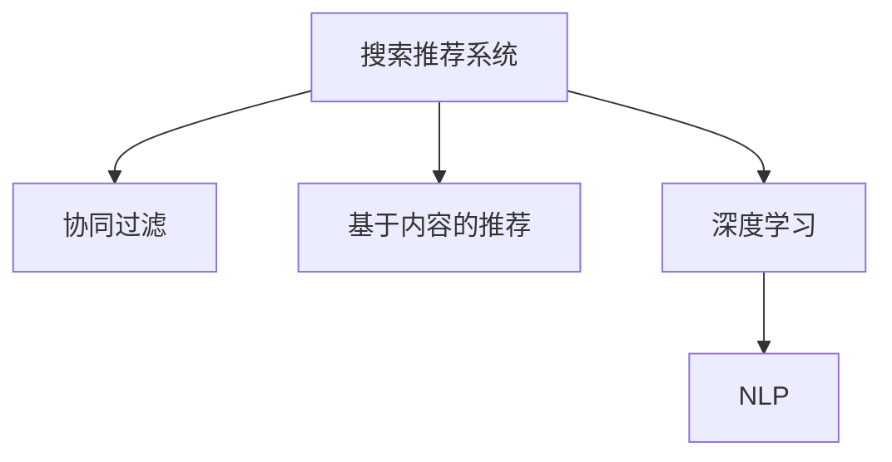

                 

# 大数据驱动的电商平台转型：搜索推荐系统是核心，AI 模型融合技术是关键

## 1. 背景介绍

随着电商市场的迅猛发展，在线购物成为越来越多人的首选购物方式。电商平台的运营方式、用户体验和用户满意度直接影响其市场竞争力。在这样一个数据驱动的商业环境中，如何利用先进技术，提升电商平台的运营效率和用户体验，成为各大电商平台亟需解决的关键问题。

### 1.1 问题由来
电商平台的搜索推荐系统（Search and Recommendation System, SRS）是其核心功能之一。通过精准的搜索推荐，电商平台可以显著提升用户满意度，增加用户粘性，提高销售转化率。传统的搜索推荐系统通常基于关键词匹配、基于内容的推荐和协同过滤等方法，难以充分理解用户行为和个性化需求。

为了解决这一问题，近年来各大电商平台纷纷引入人工智能（AI）技术，构建智能化的搜索推荐系统。通过AI模型的融合，搜索推荐系统能够更好地捕捉用户行为模式，预测用户需求，实现更精准的个性化推荐。

### 1.2 问题核心关键点
本文将重点探讨以下几个核心问题：

- 搜索推荐系统在电商平台中扮演什么角色？
- 如何利用AI模型提升搜索推荐系统的性能？
- 搜索推荐系统在实际应用中面临哪些挑战？
- 如何优化搜索推荐系统的算法和架构？
- 未来搜索推荐系统的发展方向是什么？

这些问题的解答将帮助我们更深刻地理解AI在电商平台中的应用，并探索可能的改进方案。

## 2. 核心概念与联系

### 2.1 核心概念概述

为了更好地理解搜索推荐系统的构建和优化，本文将介绍几个关键概念：

- 搜索推荐系统（Search and Recommendation System, SRS）：利用AI技术对用户搜索行为和历史数据进行分析，为用户推荐可能感兴趣的商品或内容。
- 协同过滤（Collaborative Filtering, CF）：通过用户行为数据（如浏览记录、购买记录等）发现用户之间的相似性，为相似用户推荐相似商品。
- 基于内容的推荐（Content-Based Recommendation, CB）：根据商品的属性（如类别、价格、描述等）分析用户偏好，推荐与用户过去喜欢的商品类似的内容。
- 深度学习（Deep Learning）：利用神经网络等深度学习模型对大规模数据进行建模和预测，提升推荐系统性能。
- 自然语言处理（Natural Language Processing, NLP）：通过文本分析理解用户查询意图，提升搜索准确性。

这些概念之间的联系可以通过以下Mermaid流程图来展示：



这个流程图展示了搜索推荐系统的构建逻辑：

1. 利用协同过滤和基于内容的推荐构建基础推荐模型。
2. 引入深度学习进行进一步建模和优化。
3. 结合自然语言处理技术理解用户查询意图，提升搜索准确性。

## 3. 核心算法原理 & 具体操作步骤

### 3.1 算法原理概述

搜索推荐系统的核心算法原理是协同过滤、基于内容的推荐和深度学习技术的融合。协同过滤和基于内容的推荐可以为用户提供多样化的推荐，而深度学习模型能够处理复杂的数据关系，提升推荐系统的准确性。

在实际应用中，通常采用以下步骤：

1. **数据收集**：收集用户历史行为数据、商品属性数据等。
2. **特征提取**：对用户行为和商品属性进行特征提取，构建特征向量。
3. **模型训练**：使用协同过滤、基于内容的推荐和深度学习模型进行训练，构建推荐模型。
4. **推荐生成**：根据用户输入的查询或行为数据，结合训练好的模型生成推荐结果。

### 3.2 算法步骤详解

#### 3.2.1 数据收集

数据收集是构建搜索推荐系统的第一步。以下是电商平台上常用的数据类型：

- 用户行为数据：包括浏览记录、购买记录、评价记录等。
- 商品属性数据：如商品名称、类别、价格、描述等。
- 用户属性数据：如年龄、性别、地域等。

收集数据时需要注意数据的完整性和质量，避免遗漏重要信息或引入噪声。

#### 3.2.2 特征提取

特征提取是将原始数据转化为模型可以处理的特征向量的过程。常用的特征提取方法包括：

- 嵌入式特征：将用户行为数据和商品属性数据嵌入高维向量空间，得到向量表示。
- 离散特征：将连续的特征值进行离散化处理，如将价格范围划分为多个区间。
- 文本特征：将用户搜索查询和商品描述转化为词袋模型、TF-IDF等文本特征。

特征提取需要根据具体任务和数据类型进行选择和调整。

#### 3.2.3 模型训练

模型训练是利用历史数据训练推荐模型的过程。以下是几种常用的推荐模型：

- 协同过滤模型：包括基于用户的协同过滤和基于物品的协同过滤，通过用户行为数据建立用户-用户相似性或物品-物品相似性。
- 基于内容的推荐模型：利用商品属性数据计算商品与用户偏好的匹配度。
- 深度学习模型：如基于循环神经网络（RNN）、卷积神经网络（CNN）和注意力机制（Attention）的推荐模型，通过复杂的数据关系进行建模和预测。

在模型训练过程中，需要选择合适的优化算法（如随机梯度下降）、设置合适的超参数（如学习率、正则化系数等），并进行交叉验证和模型选择。

#### 3.2.4 推荐生成

推荐生成是将用户输入的数据和训练好的推荐模型结合起来，生成推荐结果的过程。常用的推荐生成方法包括：

- 召回：从候选商品集中选取与用户匹配度高的商品。
- 排序：根据模型预测的用户评分或概率，对候选商品进行排序。

推荐生成需要考虑冷启动问题、多样性和准确性等指标。

### 3.3 算法优缺点

#### 3.3.1 协同过滤

协同过滤的优点在于能够处理用户历史行为数据，挖掘用户之间的相似性，发现潜在的商品关联。缺点是数据稀疏性问题，新用户或新商品的推荐效果差，且难以处理非线性关系。

#### 3.3.2 基于内容的推荐

基于内容的推荐能够利用商品属性数据，构建简单的推荐模型。优点是计算复杂度低，推荐效果稳定。缺点是难以处理用户偏好的动态变化，对商品属性的描述不够精确。

#### 3.3.3 深度学习模型

深度学习模型的优点在于能够处理复杂的数据关系，捕捉用户行为的非线性特征。缺点是需要大量的数据和计算资源，模型训练时间长，且难以解释模型内部机制。

### 3.4 算法应用领域

搜索推荐系统在电商平台上具有广泛的应用，包括：

- 商品推荐：根据用户浏览记录和购买历史，推荐相关商品。
- 个性化广告：根据用户行为数据和属性，推送个性化广告。
- 库存管理：通过用户历史行为数据预测商品需求，优化库存管理。
- 价格优化：根据用户购买行为数据，优化商品价格策略。

## 4. 数学模型和公式 & 详细讲解 & 举例说明

### 4.1 数学模型构建

本节将使用数学语言对搜索推荐系统的构建进行严格的刻画。

记用户为 $u$，商品为 $i$，行为数据为 $r_{ui}$。假设每个用户 $u$ 对每个商品 $i$ 的评分 $r_{ui} \in [1,5]$，评分越高表示对商品的偏好越高。

假设 $D$ 为用户的训练数据集，每个用户 $u$ 有 $n_u$ 次行为数据。对于每个用户 $u$，构建用户行为矩阵 $R_u \in \mathbb{R}^{n_u \times m}$，其中 $m$ 为商品数量。

### 4.2 公式推导过程

#### 4.2.1 协同过滤

协同过滤模型的基本思想是利用用户之间的相似性，为相似用户推荐相似商品。常用的协同过滤方法包括基于用户的协同过滤和基于物品的协同过滤。

基于用户的协同过滤方法：

$$
R_u^{\text{user-based}} = \alpha R_u + (1-\alpha) \sum_{v \in N_u} r_{uv} R_v
$$

其中 $N_u$ 为与用户 $u$ 相似的用户集合，$\alpha$ 为调节因子，$0 \leq \alpha \leq 1$。

基于物品的协同过滤方法：

$$
R_i^{\text{item-based}} = (1-\beta) R_i + \beta \sum_{j \in N_i} r_{ij} R_j
$$

其中 $N_i$ 为与商品 $i$ 相似的商品集合，$\beta$ 为调节因子，$0 \leq \beta \leq 1$。

#### 4.2.2 基于内容的推荐

基于内容的推荐方法利用商品属性数据，计算商品与用户偏好的匹配度。常用的方法包括基于TF-IDF的推荐和基于支持向量机的推荐。

基于TF-IDF的推荐：

$$
r_{ui} = \sum_{j=1}^m \text{tf}_{uj} \times \text{tf}_{i_j} \times \text{idf}_j
$$

其中 $\text{tf}_{uj}$ 为商品 $i$ 中第 $j$ 个属性在商品 $u$ 的查询中出现的次数，$\text{idf}_j$ 为属性 $j$ 的逆文档频率。

基于支持向量机的推荐：

$$
r_{ui} = \text{svm}(R_u, R_i)
$$

其中 $\text{svm}$ 为支持向量机模型，$R_u$ 和 $R_i$ 为用户的商品评分和商品的特征向量。

#### 4.2.3 深度学习模型

深度学习模型通常使用神经网络对用户行为数据和商品属性数据进行建模和预测。常用的深度学习模型包括基于RNN的推荐模型、基于CNN的推荐模型和基于注意力机制的推荐模型。

基于RNN的推荐模型：

$$
h_{ui} = \text{RNN}(r_{ui}, h_{ui-1})
$$

其中 $h_{ui}$ 为第 $i$ 个商品对用户 $u$ 的潜在兴趣表示，$h_{ui-1}$ 为前一个时刻的潜在兴趣表示。

基于CNN的推荐模型：

$$
h_{ui} = \text{CNN}(r_{ui}, h_{ui-1})
$$

其中 $h_{ui}$ 为第 $i$ 个商品对用户 $u$ 的潜在兴趣表示，$h_{ui-1}$ 为前一个时刻的潜在兴趣表示。

基于注意力机制的推荐模型：

$$
h_{ui} = \text{Attention}(r_{ui}, h_{ui-1})
$$

其中 $h_{ui}$ 为第 $i$ 个商品对用户 $u$ 的潜在兴趣表示，$h_{ui-1}$ 为前一个时刻的潜在兴趣表示。

### 4.3 案例分析与讲解

#### 4.3.1 协同过滤案例

假设电商平台上用户 $u_1$ 和 $u_2$ 的行为数据分别为：

- $u_1$：浏览商品 $i_1$、$i_2$、$i_3$ 并购买商品 $i_1$、$i_2$。
- $u_2$：浏览商品 $i_1$、$i_3$ 并购买商品 $i_1$、$i_3$。

根据基于用户的协同过滤方法，计算 $u_1$ 和 $u_2$ 的相似性矩阵 $S$：

$$
S = \frac{R_u^{\text{user-based}} \times R_v^{\text{user-based}}}{\sqrt{(n_u + 1)(n_v + 1)}}
$$

其中 $R_u^{\text{user-based}}$ 和 $R_v^{\text{user-based}}$ 分别为 $u_1$ 和 $u_2$ 的行为矩阵，$n_u$ 和 $n_v$ 分别为 $u_1$ 和 $u_2$ 的行为次数。

$$
S = \frac{1}{\sqrt{(3 + 1)(3 + 1)}}
\begin{bmatrix}
    1 & 1 \\
    1 & 1
\end{bmatrix}
= \frac{1}{4}
\begin{bmatrix}
    1 & 1 \\
    1 & 1
\end{bmatrix}
$$

计算相似度得分：

$$
\text{similarity} = S_{12} = \frac{1}{4} \times 1 = 0.25
$$

根据相似性得分，为 $u_2$ 推荐与 $u_1$ 相似的商品，推荐结果为 $i_2$ 和 $i_3$。

#### 4.3.2 基于内容的推荐案例

假设电商平台上用户 $u$ 对商品 $i$ 的评分数据如下：

- $u_1$：$r_{i_1,1} = 4, r_{i_2,1} = 3, r_{i_3,1} = 2$
- $u_2$：$r_{i_1,2} = 5, r_{i_2,2} = 4, r_{i_3,2} = 3$

假设商品的类别属性如下：

- $i_1$：类别为 $C_1$
- $i_2$：类别为 $C_1$
- $i_3$：类别为 $C_2$

根据基于TF-IDF的推荐方法，计算用户 $u_1$ 和 $u_2$ 对商品 $i_1$ 和 $i_2$ 的评分：

- $u_1$：$\text{tf}_{u_1} = [1,1,0]$
- $u_2$：$\text{tf}_{u_2} = [0,1,1]$

计算属性 $C_1$ 和 $C_2$ 的逆文档频率：

- $idf_{C_1} = \log \frac{N}{m}$
- $idf_{C_2} = \log \frac{N}{m-1}$

其中 $N$ 为总文档数，$m$ 为属性种类数。

计算用户 $u_1$ 对商品 $i_1$ 的评分：

$$
r_{i_1,1} = \text{tf}_{u_1} \times \text{tf}_{i_1} \times idf_{C_1} = [1,1,0] \times [1,1,0] \times idf_{C_1}
$$

根据基于支持向量机的推荐方法，计算用户 $u_1$ 对商品 $i_2$ 的评分：

$$
r_{i_2,1} = \text{svm}(R_u, R_i) = \text{svm}([4,3,2], [0,1,1])
$$

计算用户 $u_2$ 对商品 $i_1$ 的评分：

$$
r_{i_1,2} = \text{tf}_{u_2} \times \text{tf}_{i_1} \times idf_{C_1} = [0,1,1] \times [1,1,0] \times idf_{C_1}
$$

计算用户 $u_2$ 对商品 $i_2$ 的评分：

$$
r_{i_2,2} = \text{svm}(R_u, R_i) = \text{svm}([0,1,1], [0,1,1])
$$

## 5. 项目实践：代码实例和详细解释说明

### 5.1 开发环境搭建

在进行搜索推荐系统开发前，我们需要准备好开发环境。以下是使用Python进行TensorFlow开发的环境配置流程：

1. 安装Anaconda：从官网下载并安装Anaconda，用于创建独立的Python环境。

2. 创建并激活虚拟环境：
```bash
conda create -n tf-env python=3.8 
conda activate tf-env
```

3. 安装TensorFlow：根据CUDA版本，从官网获取对应的安装命令。例如：
```bash
conda install tensorflow==2.6 -c tensorflow
```

4. 安装各类工具包：
```bash
pip install numpy pandas scikit-learn matplotlib tqdm jupyter notebook ipython
```

完成上述步骤后，即可在`tf-env`环境中开始搜索推荐系统开发。

### 5.2 源代码详细实现

这里我们以协同过滤和深度学习模型的融合为例，给出TensorFlow中搜索推荐系统的代码实现。

首先，定义协同过滤模型：

```python
import tensorflow as tf
from tensorflow.keras.layers import Embedding, Dot, Dense

class CollaborativeFiltering(tf.keras.Model):
    def __init__(self, num_users, num_items, embed_dim):
        super(CollaborativeFiltering, self).__init__()
        self.num_users = num_users
        self.num_items = num_items
        self.embedding = Embedding(num_users, embed_dim, input_length=num_items)
        self.dot_product = Dot(axes=(2, 2), normalize=True)
        self.fc = Dense(num_items, activation='sigmoid')
    
    def call(self, u, v):
        embedded_u = self.embedding(u)
        embedded_v = self.embedding(v)
        scores = self.dot_product(embedded_u, embedded_v)
        scores = self.fc(scores)
        return scores
```

然后，定义深度学习模型：

```python
import tensorflow as tf
from tensorflow.keras.layers import LSTM, Dense

class DeepLearning(tf.keras.Model):
    def __init__(self, embed_dim, num_items):
        super(DeepLearning, self).__init__()
        self.lstm = LSTM(embed_dim, return_sequences=True)
        self.fc = Dense(num_items, activation='sigmoid')
    
    def call(self, inputs):
        outputs = self.lstm(inputs)
        scores = self.fc(outputs)
        return scores
```

接着，定义推荐系统模型：

```python
import tensorflow as tf
from tensorflow.keras.layers import Input, Concatenate

def build_model(num_users, num_items, embed_dim):
    user_input = Input(shape=(num_items,))
    item_input = Input(shape=(num_items,))
    scores = Concatenate(axis=-1)([CollaborativeFiltering(user_input, num_items, embed_dim)(), DeepLearning(tf.cast(user_input, tf.int32), num_items)])
    scores = Dense(num_items, activation='sigmoid')(scores)
    return tf.keras.Model([user_input, item_input], scores)
```

最后，定义模型训练函数：

```python
import tensorflow as tf
from tensorflow.keras.losses import BinaryCrossentropy

def train_model(model, user_data, item_data, num_items):
    model.compile(optimizer=tf.keras.optimizers.Adam(), loss=BinaryCrossentropy(from_logits=True))
    model.fit([user_data, item_data], item_data, epochs=10, batch_size=32)
```

### 5.3 代码解读与分析

让我们再详细解读一下关键代码的实现细节：

**CollaborativeFiltering类**：
- `__init__`方法：初始化协同过滤模型，定义嵌入层、点积层和全连接层。
- `call`方法：定义前向传播过程，通过嵌入层和点积层计算用户和物品的相似性得分，再通过全连接层输出预测结果。

**DeepLearning类**：
- `__init__`方法：初始化深度学习模型，定义LSTM层和全连接层。
- `call`方法：定义前向传播过程，通过LSTM层和全连接层计算预测结果。

**build_model函数**：
- 定义用户输入和物品输入，通过Concatenate层将协同过滤和深度学习模型的输出拼接在一起，再通过全连接层输出预测结果。
- 返回模型实例。

**train_model函数**：
- 使用二元交叉熵损失函数进行模型训练，优化器为Adam。
- 通过`fit`方法训练模型，并设置迭代轮数和批次大小。

可以看到，TensorFlow的Keras API使得构建和训练搜索推荐系统变得相对简洁高效。开发者可以进一步探索和优化模型结构，利用GPU/TPU等高性能设备，加速模型的训练和推理。

## 6. 实际应用场景

### 6.1 智能推荐系统

智能推荐系统是电商平台上应用最广泛的技术之一。通过个性化推荐，电商平台能够提升用户满意度，增加销售额。以下是智能推荐系统的实际应用场景：

- **商品推荐**：根据用户浏览记录和购买历史，推荐相关商品。
- **广告推荐**：根据用户行为数据和属性，推送个性化广告。
- **个性化搜索**：根据用户输入的查询，推荐最相关的搜索结果。

### 6.2 库存管理

库存管理是电商平台上重要的环节之一。通过推荐系统，电商平台能够更好地预测用户需求，优化库存管理，减少缺货和库存积压的情况。

**库存管理应用**：

- **需求预测**：利用历史数据和推荐模型，预测未来的用户需求，优化库存水平。
- **动态补货**：根据用户购买记录和推荐结果，实时调整库存，减少缺货和积压。

### 6.3 定价优化

电商平台上商品的价格策略直接影响销售转化率。通过推荐系统，电商平台能够更好地理解用户需求，优化价格策略，提高销售额。

**定价优化应用**：

- **价格推荐**：根据用户购买行为和推荐结果，推荐最优的价格策略。
- **动态定价**：根据市场需求和推荐结果，动态调整商品价格，最大化利润。

### 6.4 未来应用展望

未来，搜索推荐系统将在更多领域得到应用，为传统行业带来变革性影响。

在智慧医疗领域，搜索推荐系统能够帮助医生更好地理解患者需求，推荐相关医学资料和治疗方案。

在智能教育领域，搜索推荐系统能够根据学生的学习行为，推荐个性化的学习资源和作业。

在智慧城市治理中，搜索推荐系统能够帮助城市管理者更好地理解市民需求，推荐交通、环境等方面的解决方案。

此外，在金融、物流、文娱等众多领域，搜索推荐系统也将不断涌现，为经济社会发展注入新的动力。

## 7. 工具和资源推荐
### 7.1 学习资源推荐

为了帮助开发者系统掌握搜索推荐系统的构建和优化，这里推荐一些优质的学习资源：

1. **《深度学习实战》系列书籍**：由吴恩达教授撰写，深入浅出地介绍了深度学习在推荐系统中的应用。

2. **Coursera的《推荐系统课程》**：斯坦福大学开设的推荐系统课程，涵盖推荐系统的基本概念和经典模型。

3. **Kaggle上的推荐系统竞赛**：参与实际竞赛，积累推荐系统的实践经验。

4. **《推荐系统设计与评估》**：由周志华教授撰写，全面介绍了推荐系统的设计与评估方法。

5. **《推荐系统：理论与算法》**：由何恺明教授撰写，深入探讨了推荐系统的理论基础和算法实现。

通过对这些资源的学习实践，相信你一定能够快速掌握搜索推荐系统的精髓，并用于解决实际的推荐问题。
### 7.2 开发工具推荐

高效的开发离不开优秀的工具支持。以下是几款用于搜索推荐系统开发的常用工具：

1. **TensorFlow**：由Google主导开发的深度学习框架，支持分布式训练和推理，适合大规模工程应用。

2. **PyTorch**：由Facebook主导开发的深度学习框架，支持动态图和静态图，适合快速迭代研究。

3. **Keras**：基于TensorFlow和Theano的高级API，适合快速构建和训练推荐系统模型。

4. **Hadoop**：分布式计算平台，适合处理大规模数据集，支持并行计算。

5. **Spark**：分布式计算平台，适合处理大规模数据集，支持机器学习和数据处理。

6. **Jupyter Notebook**：支持代码和数学公式的交互式展示，适合数据探索和模型实验。

合理利用这些工具，可以显著提升搜索推荐系统的开发效率，加快创新迭代的步伐。

### 7.3 相关论文推荐

搜索推荐系统的发展源于学界的持续研究。以下是几篇奠基性的相关论文，推荐阅读：

1. **《协同过滤推荐系统》**：由Csurka等撰写，系统介绍了协同过滤推荐系统的基本原理和算法实现。

2. **《基于内容的推荐系统》**：由Koren等撰写，探讨了基于内容的推荐系统在推荐中的应用。

3. **《深度学习在推荐系统中的应用》**：由Salakhutdinov等撰写，介绍了深度学习在推荐系统中的应用。

4. **《基于注意力机制的推荐系统》**：由Zhang等撰写，探讨了注意力机制在推荐系统中的应用。

5. **《推荐系统的公平性与隐私保护》**：由Wang等撰写，探讨了推荐系统的公平性和隐私保护问题。

这些论文代表了大数据驱动的推荐系统的研究脉络。通过学习这些前沿成果，可以帮助研究者把握学科前进方向，激发更多的创新灵感。

## 8. 总结：未来发展趋势与挑战

### 8.1 总结

本文对搜索推荐系统在电商平台中的应用进行了全面系统的介绍。首先阐述了搜索推荐系统在电商平台中的重要性，明确了AI技术在推荐系统中的关键作用。其次，从原理到实践，详细讲解了搜索推荐系统的构建和优化过程，给出了TensorFlow中的代码实现。同时，本文还广泛探讨了搜索推荐系统在实际应用中的挑战和优化策略，展示了AI技术在电商领域的应用前景。

通过本文的系统梳理，可以看到，搜索推荐系统在电商平台中扮演着核心角色，AI技术的应用使得推荐系统能够更加精准地理解用户需求，提升用户体验和平台竞争力。未来，随着技术的不断发展，搜索推荐系统将进一步优化算法和架构，为电商平台的持续创新提供更加有力的技术支撑。

### 8.2 未来发展趋势

未来，搜索推荐系统将在更多领域得到应用，为传统行业带来变革性影响。

在智慧医疗领域，搜索推荐系统能够帮助医生更好地理解患者需求，推荐相关医学资料和治疗方案。

在智能教育领域，搜索推荐系统能够根据学生的学习行为，推荐个性化的学习资源和作业。

在智慧城市治理中，搜索推荐系统能够帮助城市管理者更好地理解市民需求，推荐交通、环境等方面的解决方案。

此外，在金融、物流、文娱等众多领域，搜索推荐系统也将不断涌现，为经济社会发展注入新的动力。

### 8.3 面临的挑战

尽管搜索推荐系统在电商平台上已经取得了显著成效，但在迈向更加智能化、普适化应用的过程中，它仍面临诸多挑战：

1. **数据稀疏性**：新用户或新商品的推荐效果差，需要更多数据进行冷启动。

2. **数据噪声**：用户行为数据可能包含噪声和异常值，影响模型性能。

3. **模型复杂度**：深度学习模型的计算复杂度较高，需要高性能设备支持。

4. **模型可解释性**：模型难以解释内部工作机制，需要进一步改进。

5. **用户隐私**：用户行为数据可能包含隐私信息，需要加强数据保护和隐私保护措施。

6. **算法公平性**：推荐算法可能存在偏见，需要引入公平性评估和调整措施。

这些挑战凸显了搜索推荐系统在实际应用中的复杂性。为应对这些挑战，需要研究者从数据、算法、工程、伦理等多个维度协同发力，共同推动推荐系统的不断优化和改进。

### 8.4 研究展望

未来的搜索推荐系统需要在以下几个方面进行深入研究：

1. **冷启动问题**：通过引入迁移学习、知识图谱等技术，提升新用户和新商品的推荐效果。

2. **数据噪声处理**：通过异常检测、数据清洗等技术，提高数据质量，减少噪声对模型性能的影响。

3. **模型压缩与加速**：通过剪枝、量化、分布式训练等技术，优化模型结构，提高计算效率。

4. **模型可解释性**：通过引入可解释性方法，提高模型的可理解性和可信度。

5. **隐私保护与公平性**：通过差分隐私、公平性评估等技术，增强推荐系统的隐私保护和公平性。

6. **多模态融合**：将文本、图像、语音等多种模态数据融合，提高推荐系统的准确性和多样化。

这些研究方向将推动搜索推荐系统向更加智能化、普适化、可解释化方向发展，为电商平台和更广泛的应用领域带来更大的价值。

## 9. 附录：常见问题与解答

**Q1：搜索推荐系统如何处理冷启动问题？**

A: 冷启动问题是搜索推荐系统面临的重要挑战之一。为解决这一问题，可以采用以下方法：

1. **基于内容的推荐**：利用商品属性数据，推荐与用户过去喜欢的商品相似的商品。

2. **迁移学习**：利用用户在其他平台上的行为数据，进行迁移学习，提升推荐效果。

3. **用户画像**：构建用户画像，利用用户的基本属性和行为数据进行推荐。

4. **知识图谱**：引入知识图谱，将商品和用户进行关联，推荐相关商品。

5. **多模态融合**：将文本、图像、语音等多种模态数据融合，提高推荐系统的准确性和多样化。

这些方法可以相互结合，共同解决冷启动问题。

**Q2：如何提高搜索推荐系统的准确性？**

A: 提高搜索推荐系统的准确性需要从多个方面入手：

1. **数据质量**：确保数据完整、准确，避免遗漏重要信息或引入噪声。

2. **特征工程**：选择合适的特征提取方法，提高特征的区分度和相关性。

3. **模型优化**：选择适合的推荐模型，并对其进行优化和调参，提高模型性能。

4. **算法融合**：将多种推荐算法融合，取长补短，提升推荐效果。

5. **实时更新**：根据用户行为数据实时更新推荐模型，保持推荐结果的时效性。

6. **上下文理解**：结合用户上下文信息，提升推荐系统的准确性和多样化。

**Q3：搜索推荐系统的用户隐私问题如何解决？**

A: 保护用户隐私是搜索推荐系统面临的重要挑战之一。为解决这一问题，可以采用以下方法：

1. **差分隐私**：引入差分隐私技术，保护用户行为数据的隐私。

2. **匿名化处理**：对用户数据进行匿名化处理，避免个人信息泄露。

3. **数据去重**：通过数据去重技术，去除用户行为数据的重复记录。

4. **访问控制**：对用户数据进行访问控制，限制数据的使用范围。

5. **用户同意**：在使用用户数据时，获取用户的明确同意，并告知用户数据的使用方式。

这些方法可以相互结合，共同保护用户隐私。

**Q4：如何评估搜索推荐系统的性能？**

A: 评估搜索推荐系统的性能需要从多个指标入手：

1. **准确率（Precision）**：衡量推荐结果的相关性，即推荐结果中相关商品的占比。

2. **召回率（Recall）**：衡量推荐结果的全面性，即推荐结果中正确商品的占比。

3. **F1分数（F1 Score）**：综合考虑准确率和召回率，评估推荐系统的整体性能。

4. **用户满意度（User Satisfaction）**：通过用户反馈，评估推荐系统的实际效果。

5. **覆盖率（Coverage）**：衡量推荐结果的多样性，即推荐结果中不同商品的占比。

6. **点击率（Click-Through Rate, CTR）**：衡量用户对推荐结果的点击行为，评估推荐系统的实际效果。

这些指标可以相互结合，全面评估搜索推荐系统的性能。

**Q5：如何优化搜索推荐系统的算法和架构？**

A: 优化搜索推荐系统的算法和架构需要从多个方面入手：

1. **算法优化**：选择合适的推荐算法，并进行优化和调参，提升模型性能。

2. **特征选择**：选择合适的特征提取方法，提高特征的区分度和相关性。

3. **模型压缩**：通过剪枝、量化等技术，优化模型结构，提高计算效率。

4. **分布式训练**：利用分布式计算平台，进行并行计算，提升训练速度。

5. **多模型融合**：将多种推荐模型融合，取长补短，提升推荐效果。

6. **上下文理解**：结合用户上下文信息，提升推荐系统的准确性和多样化。

通过这些优化方法，可以显著提升搜索推荐系统的性能和效率。

总之，搜索推荐系统在电商平台中的应用具有广泛的前景，AI技术的应用使得推荐系统能够更加精准地理解用户需求，提升用户体验和平台竞争力。未来，随着技术的不断发展，搜索推荐系统将进一步优化算法和架构，为电商平台和更广泛的应用领域带来更大的价值。

