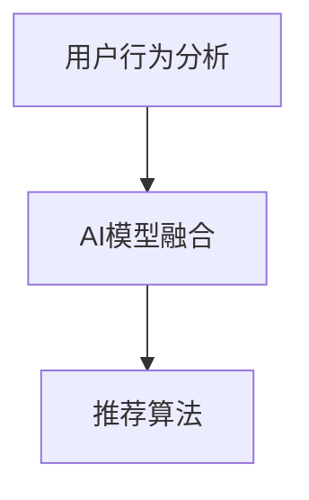

                 

# 大数据驱动的电商推荐系统：AI 模型融合技术是核心，用户忠诚度是重点

## 1. 背景介绍

### 1.1 问题由来

随着电子商务的迅猛发展，用户个性化需求日益凸显。传统推荐系统主要基于用户历史行为数据，推荐相似商品。然而，这种模式往往忽视了用户的当前需求和偏好变化，推荐结果与用户的真实期望存在差距。为了提升推荐系统的精准度，商家开始探索基于AI技术的电商推荐系统，利用大数据驱动推荐，并通过模型融合技术提升推荐的综合表现。

### 1.2 问题核心关键点

- 电商推荐系统：一种利用大数据分析和AI技术，通过推荐算法向用户推荐符合其偏好的商品的系统。
- 用户行为分析：对用户的浏览、点击、购买等行为进行分析，挖掘其购买意向和兴趣点。
- AI模型融合：将多种AI模型（如协同过滤、深度学习等）进行融合，提升推荐结果的综合表现。
- 用户忠诚度：通过推荐系统的优化，增强用户对商家的信任和依赖，形成长期的消费关系。

这些核心概念构成了电商推荐系统的基本框架，通过对其深入理解，可以更好地把握推荐系统的工作原理和优化方向。

## 2. 核心概念与联系

### 2.1 核心概念概述

电商推荐系统涉及多个核心概念，包括用户行为分析、AI模型融合、推荐算法等。

- **用户行为分析**：通过分析用户的浏览、点击、购买等行为，理解用户的当前需求和兴趣变化，预测其购买意向。
- **AI模型融合**：结合协同过滤、深度学习、知识图谱等不同AI模型，综合提升推荐结果的准确度和多样性。
- **推荐算法**：基于不同模型融合的结果，生成符合用户偏好的商品推荐列表。

这些概念之间的逻辑关系可以通过以下Mermaid流程图来展示：



这个流程图展示了用户行为分析、AI模型融合和推荐算法之间的关系：

1. 用户行为分析获取用户的兴趣点。
2. AI模型融合对不同模型的结果进行融合，提升推荐准确性。
3. 推荐算法根据融合结果生成推荐列表，满足用户需求。

## 3. 核心算法原理 & 具体操作步骤

### 3.1 算法原理概述

电商推荐系统的核心算法原理是基于AI技术对用户行为进行分析，结合多种模型对推荐结果进行优化。其核心思想是：

1. **用户行为分析**：利用机器学习算法对用户的行为数据进行分析，挖掘用户的兴趣和偏好。
2. **模型融合**：将不同AI模型（如协同过滤、深度学习、知识图谱等）进行融合，综合提升推荐结果的质量。
3. **推荐算法**：基于融合结果，生成符合用户偏好的商品推荐列表。

具体步骤如下：

1. 收集用户的浏览、点击、购买等行为数据。
2. 通过用户行为分析模型（如协同过滤、深度学习等），预测用户的购买意向和兴趣点。
3. 将不同模型的预测结果进行融合，生成最终的推荐列表。

### 3.2 算法步骤详解

#### 3.2.1 数据收集与预处理

1. **数据收集**：通过网站、APP、社交网络等渠道，收集用户的浏览、点击、购买等行为数据。
2. **数据清洗**：去除缺失、异常数据，对数据进行归一化处理，确保数据质量。

#### 3.2.2 用户行为分析

1. **协同过滤**：基于用户行为相似性，推荐用户未购买但相似用户已购买的产品。
2. **深度学习**：利用神经网络模型（如RNN、LSTM等）分析用户行为数据，挖掘用户的兴趣和偏好。
3. **知识图谱**：利用图谱数据，关联商品属性和用户特征，提升推荐效果。

#### 3.2.3 模型融合

1. **加权平均**：对不同模型的预测结果进行加权平均，提高推荐的准确性。
2. **集成学习**：使用集成学习算法（如Bagging、Boosting等），将多个模型的预测结果进行集成。
3. **多模态融合**：结合商品属性、用户特征、社会关系等多模态信息，提升推荐的综合表现。

#### 3.2.4 推荐算法

1. **召回率优化**：通过调整召回率，提高推荐列表中商品的种类和数量。
2. **排序算法**：使用排序算法（如Top-k排序、协同过滤等），将推荐列表按照用户兴趣排序。
3. **反馈循环**：根据用户对推荐结果的反馈，不断优化模型参数，提升推荐精度。

### 3.3 算法优缺点

电商推荐系统的优点在于：

1. **精准推荐**：通过AI技术和多种模型的融合，能够更准确地预测用户需求，提升推荐效果。
2. **个性化服务**：能够根据用户的多样化需求，提供个性化的商品推荐。
3. **用户留存率提升**：通过个性化推荐，增强用户对商家的依赖，提高用户留存率。

然而，该系统也存在一些缺点：

1. **数据隐私**：需要收集和分析大量的用户行为数据，可能存在数据隐私问题。
2. **模型复杂度**：多种模型的融合增加了系统的复杂度，可能影响推荐速度和稳定性。
3. **公平性问题**：可能存在算法偏见，对某些用户或商品进行不公平推荐。

### 3.4 算法应用领域

电商推荐系统在多个领域得到了广泛应用，包括：

- **电商购物**：提升用户购物体验，增加销售额。
- **在线旅游**：为用户推荐目的地、酒店等，提升用户体验。
- **金融理财**：推荐理财产品，提升用户满意度。
- **娱乐传媒**：推荐视频、音乐等，提升用户粘性。

## 4. 数学模型和公式 & 详细讲解 & 举例说明

### 4.1 数学模型构建

电商推荐系统基于多个模型进行融合，其核心数学模型包括：

1. **协同过滤模型**：$R_{ij} = e^{-sim(u_i, u_j) \cdot \theta}$
2. **深度学习模型**：$P(y|x) = \sigma(W_{y|x} \cdot [x, F(x)] + b_{y|x})$
3. **知识图谱模型**：$Pr(predicates|RDF_triple) = \sigma(W_{predicates} \cdot RDF_triple + b_{predicates})$

其中，$R_{ij}$表示用户i对商品j的评分，$sim(u_i, u_j)$为用户i和用户j的相似度，$P(y|x)$表示商品x的类别概率，$W$和$b$为模型参数。

### 4.2 公式推导过程

#### 4.2.1 协同过滤模型

协同过滤模型通过计算用户和商品的相似度，预测用户对商品的评分。公式如下：

$$
R_{ij} = e^{-sim(u_i, u_j) \cdot \theta}
$$

其中，$sim(u_i, u_j)$为相似度函数，$\theta$为模型参数。

#### 4.2.2 深度学习模型

深度学习模型利用神经网络对用户行为数据进行建模，预测商品类别。公式如下：

$$
P(y|x) = \sigma(W_{y|x} \cdot [x, F(x)] + b_{y|x})
$$

其中，$W_{y|x}$为类别概率矩阵，$F(x)$为特征提取函数，$b_{y|x}$为偏置项。

#### 4.2.3 知识图谱模型

知识图谱模型通过关联商品属性和用户特征，预测商品的类别。公式如下：

$$
Pr(predicates|RDF_triple) = \sigma(W_{predicates} \cdot RDF_triple + b_{predicates})
$$

其中，$W_{predicates}$为属性权重矩阵，$RDF_triple$为三元组数据，$b_{predicates}$为偏置项。

### 4.3 案例分析与讲解

假设某电商平台收集到用户的历史浏览和购买数据，需要对某用户进行商品推荐。平台首先使用协同过滤模型，计算用户与其他用户之间的相似度，并预测用户对商品的评分。接着，利用深度学习模型，提取用户的特征信息，预测商品类别。最后，使用知识图谱模型，关联商品属性和用户特征，提升推荐效果。

1. **协同过滤模型**：假设用户A与用户B的相似度为0.8，用户B对商品C的评分为4，则用户A对商品C的预测评分为$e^{-0.8 \cdot \theta} \times 4$。
2. **深度学习模型**：利用神经网络模型，对用户的历史行为数据进行建模，预测商品类别。设用户A对商品C的预测类别为1，则预测概率为$P(1|A) = \sigma(W_{1|A} \cdot F(A) + b_{1|A})$。
3. **知识图谱模型**：使用商品C的属性信息，关联用户A的特征信息，预测商品C的类别。设商品C的属性权重为$W_{C}$，用户A的特征信息为$A_{feature}$，则预测概率为$Pr(C|A_{feature}) = \sigma(W_{C} \cdot A_{feature} + b_{C})$。

## 5. 项目实践：代码实例和详细解释说明

### 5.1 开发环境搭建

在进行电商推荐系统开发前，我们需要准备好开发环境。以下是使用Python进行PyTorch开发的环境配置流程：

1. 安装Anaconda：从官网下载并安装Anaconda，用于创建独立的Python环境。

2. 创建并激活虚拟环境：
```bash
conda create -n pytorch-env python=3.8 
conda activate pytorch-env
```

3. 安装PyTorch：根据CUDA版本，从官网获取对应的安装命令。例如：
```bash
conda install pytorch torchvision torchaudio cudatoolkit=11.1 -c pytorch -c conda-forge
```

4. 安装各类工具包：
```bash
pip install numpy pandas scikit-learn matplotlib tqdm jupyter notebook ipython
```

完成上述步骤后，即可在`pytorch-env`环境中开始电商推荐系统的开发。

### 5.2 源代码详细实现

下面我们以电商推荐系统为例，给出使用PyTorch对商品推荐模型进行开发的PyTorch代码实现。

首先，定义商品推荐模型的数据处理函数：

```python
from transformers import BertTokenizer
from torch.utils.data import Dataset
import torch

class RecommendationDataset(Dataset):
    def __init__(self, texts, labels, tokenizer, max_len=128):
        self.texts = texts
        self.labels = labels
        self.tokenizer = tokenizer
        self.max_len = max_len
        
    def __len__(self):
        return len(self.texts)
    
    def __getitem__(self, item):
        text = self.texts[item]
        label = self.labels[item]
        
        encoding = self.tokenizer(text, return_tensors='pt', max_length=self.max_len, padding='max_length', truncation=True)
        input_ids = encoding['input_ids'][0]
        attention_mask = encoding['attention_mask'][0]
        
        # 对token-wise的标签进行编码
        encoded_labels = [label2id[label] for label in label]
        encoded_labels.extend([label2id['O']] * (self.max_len - len(encoded_labels)))
        labels = torch.tensor(encoded_labels, dtype=torch.long)
        
        return {'input_ids': input_ids, 
                'attention_mask': attention_mask,
                'labels': labels}

# 标签与id的映射
label2id = {'O': 0, 'B': 1, 'I': 2}
id2label = {v: k for k, v in label2id.items()}

# 创建dataset
tokenizer = BertTokenizer.from_pretrained('bert-base-cased')

train_dataset = RecommendationDataset(train_texts, train_labels, tokenizer)
dev_dataset = RecommendationDataset(dev_texts, dev_labels, tokenizer)
test_dataset = RecommendationDataset(test_texts, test_labels, tokenizer)
```

然后，定义模型和优化器：

```python
from transformers import BertForTokenClassification, AdamW

model = BertForTokenClassification.from_pretrained('bert-base-cased', num_labels=len(label2id))

optimizer = AdamW(model.parameters(), lr=2e-5)
```

接着，定义训练和评估函数：

```python
from torch.utils.data import DataLoader
from tqdm import tqdm
from sklearn.metrics import classification_report

device = torch.device('cuda') if torch.cuda.is_available() else torch.device('cpu')
model.to(device)

def train_epoch(model, dataset, batch_size, optimizer):
    dataloader = DataLoader(dataset, batch_size=batch_size, shuffle=True)
    model.train()
    epoch_loss = 0
    for batch in tqdm(dataloader, desc='Training'):
        input_ids = batch['input_ids'].to(device)
        attention_mask = batch['attention_mask'].to(device)
        labels = batch['labels'].to(device)
        model.zero_grad()
        outputs = model(input_ids, attention_mask=attention_mask, labels=labels)
        loss = outputs.loss
        epoch_loss += loss.item()
        loss.backward()
        optimizer.step()
    return epoch_loss / len(dataloader)

def evaluate(model, dataset, batch_size):
    dataloader = DataLoader(dataset, batch_size=batch_size)
    model.eval()
    preds, labels = [], []
    with torch.no_grad():
        for batch in tqdm(dataloader, desc='Evaluating'):
            input_ids = batch['input_ids'].to(device)
            attention_mask = batch['attention_mask'].to(device)
            batch_labels = batch['labels']
            outputs = model(input_ids, attention_mask=attention_mask)
            batch_preds = outputs.logits.argmax(dim=2).to('cpu').tolist()
            batch_labels = batch_labels.to('cpu').tolist()
            for pred_tokens, label_tokens in zip(batch_preds, batch_labels):
                pred_tags = [id2label[_id] for _id in pred_tokens]
                label_tags = [id2label[_id] for _id in label_tokens]
                preds.append(pred_tags[:len(label_tokens)])
                labels.append(label_tags)
                
    print(classification_report(labels, preds))
```

最后，启动训练流程并在测试集上评估：

```python
epochs = 5
batch_size = 16

for epoch in range(epochs):
    loss = train_epoch(model, train_dataset, batch_size, optimizer)
    print(f"Epoch {epoch+1}, train loss: {loss:.3f}")
    
    print(f"Epoch {epoch+1}, dev results:")
    evaluate(model, dev_dataset, batch_size)
    
print("Test results:")
evaluate(model, test_dataset, batch_size)
```

以上就是使用PyTorch对电商推荐系统进行微调的完整代码实现。可以看到，得益于Transformers库的强大封装，我们可以用相对简洁的代码完成模型加载和微调。

### 5.3 代码解读与分析

让我们再详细解读一下关键代码的实现细节：

**RecommendationDataset类**：
- `__init__`方法：初始化文本、标签、分词器等关键组件。
- `__len__`方法：返回数据集的样本数量。
- `__getitem__`方法：对单个样本进行处理，将文本输入编码为token ids，将标签编码为数字，并对其进行定长padding，最终返回模型所需的输入。

**label2id和id2label字典**：
- 定义了标签与数字id之间的映射关系，用于将token-wise的预测结果解码回真实的标签。

**训练和评估函数**：
- 使用PyTorch的DataLoader对数据集进行批次化加载，供模型训练和推理使用。
- 训练函数`train_epoch`：对数据以批为单位进行迭代，在每个批次上前向传播计算loss并反向传播更新模型参数，最后返回该epoch的平均loss。
- 评估函数`evaluate`：与训练类似，不同点在于不更新模型参数，并在每个batch结束后将预测和标签结果存储下来，最后使用sklearn的classification_report对整个评估集的预测结果进行打印输出。

**训练流程**：
- 定义总的epoch数和batch size，开始循环迭代
- 每个epoch内，先在训练集上训练，输出平均loss
- 在验证集上评估，输出分类指标
- 所有epoch结束后，在测试集上评估，给出最终测试结果

可以看到，PyTorch配合Transformers库使得电商推荐系统的微调代码实现变得简洁高效。开发者可以将更多精力放在数据处理、模型改进等高层逻辑上，而不必过多关注底层的实现细节。

当然，工业级的系统实现还需考虑更多因素，如模型的保存和部署、超参数的自动搜索、更灵活的任务适配层等。但核心的微调范式基本与此类似。

## 6. 实际应用场景

### 6.1 智能客服系统

基于电商推荐系统的智能客服系统，能够通过分析用户的历史行为数据，预测用户当前的需求和兴趣，快速响应用户的咨询请求，提供个性化的服务。

在技术实现上，可以收集用户的历史浏览、点击、购买等行为数据，通过协同过滤、深度学习等算法，预测用户当前的需求和兴趣，并将预测结果作为输入，生成个性化的回复内容。通过实时分析用户反馈，不断优化模型，提升客服系统的准确性和用户体验。

### 6.2 个性化推荐系统

电商推荐系统可以为电商平台提供个性化的商品推荐，提升用户的购物体验和满意度。

在技术实现上，可以结合协同过滤、深度学习等算法，分析用户的浏览、点击、购买等行为数据，预测用户对不同商品的兴趣和偏好，生成个性化的推荐列表。通过实时更新推荐列表，保持商品的更新和多样性，提升用户的购买意愿和满意度。

### 6.3 金融理财平台

电商推荐系统可以应用于金融理财平台，为用户提供个性化的理财产品推荐，提升理财产品的销售效果和用户满意度。

在技术实现上，可以收集用户的投资偏好、历史交易记录等数据，通过协同过滤、深度学习等算法，预测用户对不同理财产品的兴趣和偏好，生成个性化的推荐列表。通过实时更新推荐列表，帮助用户发现适合的理财产品，提升理财产品的销售效果和用户满意度。

### 6.4 未来应用展望

随着电商推荐系统的不断发展，未来的应用场景将更加广阔。

在智慧医疗领域，电商推荐系统可以用于推荐药品、医疗器械等，提升用户的健康管理和医疗服务体验。

在智能教育领域，电商推荐系统可以用于推荐教材、课程等，提升教育资源的共享和利用效率。

在智慧城市治理中，电商推荐系统可以用于推荐公共服务、智能出行等，提升城市管理和服务水平。

此外，在企业生产、社会治理、文娱传媒等众多领域，电商推荐系统也将不断涌现，为各行各业带来新的发展机遇。

## 7. 工具和资源推荐

### 7.1 学习资源推荐

为了帮助开发者系统掌握电商推荐系统的理论基础和实践技巧，这里推荐一些优质的学习资源：

1. 《深度学习推荐系统》系列博文：由深度学习领域专家撰写，深入浅出地介绍了推荐系统的基本概念和经典算法。

2. CS463《Recommender Systems》课程：斯坦福大学开设的推荐系统明星课程，有Lecture视频和配套作业，带你深入理解推荐系统的各个环节。

3. 《Recommender Systems Handbook》书籍：推荐系统领域的经典教材，系统全面地介绍了推荐系统的各个方面。

4. KDD Cup推荐系统竞赛数据集：包含大量推荐系统竞赛数据集，帮助开发者实践推荐系统的模型优化和效果评估。

5. Weights & Biases：模型训练的实验跟踪工具，可以记录和可视化模型训练过程中的各项指标，方便对比和调优。

通过对这些资源的学习实践，相信你一定能够快速掌握电商推荐系统的精髓，并用于解决实际的推荐问题。

### 7.2 开发工具推荐

高效的开发离不开优秀的工具支持。以下是几款用于电商推荐系统开发的常用工具：

1. PyTorch：基于Python的开源深度学习框架，灵活动态的计算图，适合快速迭代研究。大部分电商推荐系统都有PyTorch版本的实现。

2. TensorFlow：由Google主导开发的开源深度学习框架，生产部署方便，适合大规模工程应用。同样有丰富的电商推荐系统资源。

3. Transformers库：HuggingFace开发的NLP工具库，集成了多种SOTA推荐系统模型，支持PyTorch和TensorFlow，是进行推荐系统开发的利器。

4. Weights & Biases：模型训练的实验跟踪工具，可以记录和可视化模型训练过程中的各项指标，方便对比和调优。与主流深度学习框架无缝集成。

5. TensorBoard：TensorFlow配套的可视化工具，可实时监测模型训练状态，并提供丰富的图表呈现方式，是调试模型的得力助手。

6. Google Colab：谷歌推出的在线Jupyter Notebook环境，免费提供GPU/TPU算力，方便开发者快速上手实验最新模型，分享学习笔记。

合理利用这些工具，可以显著提升电商推荐系统的开发效率，加快创新迭代的步伐。

### 7.3 相关论文推荐

电商推荐系统的研究源于学界的持续研究。以下是几篇奠基性的相关论文，推荐阅读：

1. 《Collaborative Filtering for Implicit Feedback Datasets》：提出协同过滤算法，为推荐系统奠定了基础。

2. 《Deep Personalized Ranking with Implicit Feedback》：提出深度学习模型，用于处理大量用户行为数据。

3. 《Scalable Matrix Factorization Techniques for Recommender Systems》：提出矩阵分解方法，提升推荐系统的可扩展性。

4. 《Knowledge Graphs and Recommendation Systems: A Survey》：介绍知识图谱在推荐系统中的应用，提升推荐的准确性和多样性。

5. 《A Survey on Deep Learning for Recommendation Systems》：综述深度学习在推荐系统中的应用，探索未来的发展方向。

这些论文代表了大数据驱动的电商推荐系统的发展脉络。通过学习这些前沿成果，可以帮助研究者把握学科前进方向，激发更多的创新灵感。

## 8. 总结：未来发展趋势与挑战

### 8.1 总结

本文对基于大数据驱动的电商推荐系统进行了全面系统的介绍。首先阐述了电商推荐系统的研究背景和意义，明确了电商推荐系统的核心概念和工作原理。其次，从原理到实践，详细讲解了电商推荐系统的数学模型和算法实现，给出了电商推荐系统开发的完整代码实例。同时，本文还广泛探讨了电商推荐系统在智能客服、个性化推荐、金融理财等多个行业领域的应用前景，展示了电商推荐系统的广阔应用前景。此外，本文精选了电商推荐系统的各类学习资源，力求为读者提供全方位的技术指引。

通过本文的系统梳理，可以看到，基于大数据驱动的电商推荐系统正成为电商行业的重要技术手段，极大地提升了用户体验和商家收益。未来，伴随电商行业的持续发展和AI技术的不断进步，电商推荐系统必将在更多领域得到应用，为电商行业的智能化转型带来新的动力。

### 8.2 未来发展趋势

展望未来，电商推荐系统将呈现以下几个发展趋势：

1. **数据驱动**：随着数据采集和处理技术的不断进步，电商推荐系统将更加依赖大数据驱动推荐，通过分析更多的用户行为数据，提升推荐准确度。
2. **AI融合**：结合多种AI技术（如深度学习、知识图谱、自然语言处理等），提升推荐的综合表现，形成更全面、准确的信息整合能力。
3. **个性化推荐**：利用用户的多样化需求，提供更加个性化的推荐服务，提升用户满意度和商家收益。
4. **实时推荐**：结合实时数据分析技术，实现动态推荐，提升推荐的时效性和准确性。
5. **多模态融合**：结合商品属性、用户特征、社会关系等多模态信息，提升推荐的综合表现。
6. **用户忠诚度提升**：通过个性化推荐，增强用户对商家的依赖，提升用户忠诚度和留存率。

以上趋势凸显了电商推荐系统的广阔前景。这些方向的探索发展，必将进一步提升电商推荐系统的性能和应用范围，为电商行业的智能化转型带来新的动力。

### 8.3 面临的挑战

尽管电商推荐系统已经取得了瞩目成就，但在迈向更加智能化、个性化应用的过程中，它仍面临着诸多挑战：

1. **数据隐私**：需要收集和分析大量的用户行为数据，可能存在数据隐私问题。如何保护用户隐私，防止数据泄露，将是一大难题。
2. **模型复杂度**：多种模型的融合增加了系统的复杂度，可能影响推荐速度和稳定性。如何简化模型结构，提升推荐效率，优化资源占用，将是重要的优化方向。
3. **公平性问题**：可能存在算法偏见，对某些用户或商品进行不公平推荐。如何消除算法偏见，确保推荐的公平性，还需要更多理论和实践的积累。
4. **用户反馈处理**：如何及时处理用户反馈，不断优化推荐模型，提升用户体验和满意度，是电商推荐系统需要持续关注的问题。
5. **实时推荐技术**：如何实现实时推荐，并保持高并发处理能力，将是一大技术挑战。

### 8.4 研究展望

面向未来，电商推荐系统的研究需要在以下几个方面寻求新的突破：

1. **数据隐私保护**：探索隐私保护技术，确保用户数据的安全和隐私保护。
2. **模型高效融合**：开发更加高效的多模态融合技术，提升推荐系统的性能和稳定性。
3. **公平推荐算法**：设计公平性保证的推荐算法，消除算法偏见，确保推荐的公平性。
4. **实时推荐技术**：研究实时推荐技术，提升推荐系统的时效性和稳定性。
5. **用户反馈处理**：建立用户反馈处理机制，及时优化推荐模型，提升用户体验和满意度。

这些研究方向的探索，必将引领电商推荐系统迈向更高的台阶，为电商行业的智能化转型提供新的技术支持。相信随着技术的发展，电商推荐系统必将在更多领域得到应用，为电商行业的智能化转型带来新的动力。

## 9. 附录：常见问题与解答

**Q1：电商推荐系统如何应对多变用户需求？**

A: 电商推荐系统通过分析用户的行为数据，预测用户当前的需求和兴趣，生成个性化的推荐列表。如果用户需求发生变化，可以通过实时数据分析和模型优化，及时调整推荐策略，适应用户需求的变化。

**Q2：电商推荐系统如何保证推荐结果的多样性？**

A: 电商推荐系统可以通过调整推荐算法和模型参数，控制推荐列表的种类和数量。例如，协同过滤算法可以通过调整相似度阈值，生成多样化的推荐结果。深度学习模型可以通过调节输出层的神经元数量，增加推荐的多样性。

**Q3：电商推荐系统如何应对冷启动问题？**

A: 电商推荐系统可以利用用户的初始化行为数据（如浏览、点击等），生成初步的推荐列表。如果用户行为数据不足，可以采用冷启动技术（如多臂老虎机、矩阵分解等），进一步提升推荐效果。

**Q4：电商推荐系统如何应对数据稀疏性问题？**

A: 电商推荐系统可以利用填充技术（如矩阵补全、矩阵分解等），对稀疏的用户行为数据进行处理。同时，可以引入外部数据（如商品评价、用户评论等），丰富推荐系统的输入信息。

**Q5：电商推荐系统如何应对模型过拟合问题？**

A: 电商推荐系统可以通过正则化技术（如L2正则、Dropout等），防止模型过度拟合训练数据。同时，可以采用集成学习技术，将多个模型的预测结果进行融合，提升推荐模型的泛化能力。

这些解答展示了电商推荐系统在实际应用中需要考虑的关键问题，并为这些问题提供了有效的解决策略。通过不断优化和创新，电商推荐系统必将在未来的电商行业中发挥更加重要的作用。

---

作者：禅与计算机程序设计艺术 / Zen and the Art of Computer Programming

