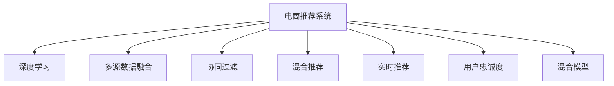

                 

# 大数据驱动的电商推荐系统：AI 模型融合是核心，提高用户忠诚度

## 1. 背景介绍

### 1.1 问题由来

随着互联网和电子商务的迅猛发展，电商平台已成为人们生活中不可或缺的一部分。通过平台，消费者可以更便捷地获取商品信息、比较价格、进行在线购物，而电商平台则能通过推荐系统，提升用户购物体验，增加销售转化率。然而，传统的基于规则或手动调参的推荐系统存在诸多局限，难以应对海量数据和复杂用户行为模式。

近年来，基于机器学习和大数据技术的推荐系统取得了长足进步。特别是深度学习模型，通过学习用户行为数据和商品特征，可以更准确地预测用户兴趣，生成个性化的推荐内容。但深度学习模型通常需要大量标注数据和复杂计算资源，难以在实际电商平台上大规模部署。

为解决这些问题，电商平台开始探索将传统推荐算法与深度学习模型进行融合，形成更高效、精准的推荐系统。本文章将详细介绍AI模型融合在电商推荐系统中的应用，并探讨其如何有效提高用户忠诚度。

### 1.2 问题核心关键点

AI模型融合在电商推荐系统中的核心关键点在于：

1. **多源数据融合**：整合用户行为数据、商品特征、用户画像等多源数据，提升推荐的准确性和全面性。
2. **深度学习与规则的结合**：将深度学习模型与基于规则的推荐算法结合，取长补短，构建更优的推荐方案。
3. **个性化推荐**：根据用户历史行为和实时反馈，生成个性化的推荐内容，提升用户体验。
4. **用户忠诚度提升**：通过精准推荐，满足用户需求，增强平台粘性，提升用户忠诚度。

## 2. 核心概念与联系

### 2.1 核心概念概述

为更好地理解AI模型融合在电商推荐系统中的应用，本节将介绍几个密切相关的核心概念：

- **电商推荐系统**：指电商平台通过数据分析和算法技术，向用户推荐可能感兴趣的商品，以提升转化率、销售额和用户满意度。

- **深度学习**：指一类基于神经网络的机器学习算法，通过多层次的特征抽象，实现对复杂数据模式的学习。

- **多源数据融合**：指将来自不同渠道的数据（如用户行为、商品属性、用户画像等）进行整合，提升数据的多样性和丰富度。

- **协同过滤**：一种基于用户行为相似性的推荐算法，通过查找相似用户的行为数据，生成推荐内容。

- **混合推荐**：将多种推荐算法（如协同过滤、内容推荐、基于内容的推荐等）结合，构建更全面、高效的推荐系统。

- **实时推荐**：指在用户进行浏览、购买等行为时，实时生成推荐内容，提升用户体验和转化率。

- **用户忠诚度**：指用户对平台的长期依赖和持续消费，是电商平台的核心目标之一。

这些核心概念之间的逻辑关系可以通过以下Mermaid流程图来展示：



这个流程图展示了大数据驱动的电商推荐系统的核心概念及其之间的关系：

1. 电商推荐系统通过深度学习模型和多种推荐算法进行技术支撑。
2. 深度学习模型在多源数据融合的基础上，学习用户行为和商品特征，生成推荐内容。
3. 协同过滤、内容推荐等算法与深度学习模型结合，提升推荐效果。
4. 实时推荐系统通过用户行为实时数据，生成个性化推荐，提升用户体验。
5. 用户忠诚度通过精准推荐、个性化服务等多方面因素综合提升。

## 3. 核心算法原理 & 具体操作步骤

### 3.1 算法原理概述

基于AI模型融合的电商推荐系统，核心算法原理可以概括为以下几个步骤：

1. **数据收集与预处理**：从电商平台收集用户行为数据、商品特征、用户画像等，并进行数据清洗和预处理。
2. **深度学习模型训练**：使用用户行为数据和商品特征，训练深度学习模型（如DNN、CNN、RNN等），学习用户兴趣和商品相关性。
3. **多源数据融合**：整合不同渠道的数据，提升推荐模型的多样性和准确性。
4. **推荐算法优化**：结合多种推荐算法（如协同过滤、内容推荐），优化推荐策略，提升推荐效果。
5. **实时推荐系统构建**：构建实时推荐系统，利用用户实时行为数据，动态调整推荐内容。
6. **用户反馈处理**：收集用户对推荐内容的反馈，更新推荐模型，提升推荐准确度。

### 3.2 算法步骤详解

下面是基于AI模型融合的电商推荐系统的详细步骤：

**Step 1: 数据收集与预处理**

电商平台的推荐系统需要收集以下几类数据：

1. **用户行为数据**：用户浏览、点击、购买、评价等行为记录。
2. **商品特征数据**：商品名称、描述、价格、分类、图片等。
3. **用户画像数据**：用户基本信息（如年龄、性别、职业等）、兴趣爱好等。

数据的预处理包括数据清洗、特征提取、缺失值处理等，以确保数据的质量和一致性。

**Step 2: 深度学习模型训练**

使用用户行为数据和商品特征数据，训练深度学习模型。以DNN为例，模型的输入为商品ID和用户ID，输出为推荐概率。

**Step 3: 多源数据融合**

将用户画像数据、用户行为数据、商品特征数据进行融合，提升推荐模型的多样性和准确性。例如，使用用户画像中的年龄段作为用户行为数据的特征，提升推荐效果。

**Step 4: 推荐算法优化**

结合协同过滤、内容推荐等算法，优化推荐策略。例如，使用基于用户相似性的协同过滤算法，推荐与当前浏览商品相似的其他商品。

**Step 5: 实时推荐系统构建**

构建实时推荐系统，利用用户实时行为数据，动态调整推荐内容。例如，当用户浏览商品时，实时计算并展示与该商品相关的其他商品。

**Step 6: 用户反馈处理**

收集用户对推荐内容的反馈，如点击、购买、评价等行为，更新推荐模型，提升推荐准确度。例如，对于经常点击某类商品的用户，增加该类商品的推荐权重。

### 3.3 算法优缺点

基于AI模型融合的电商推荐系统具有以下优点：

1. **高效性**：通过深度学习模型，能够高效地处理大规模数据，快速生成推荐内容。
2. **个性化推荐**：通过多源数据融合和多种推荐算法的结合，能够生成高度个性化的推荐内容。
3. **实时性**：利用实时数据，能够动态调整推荐内容，提升用户体验。

同时，该系统也存在一定的局限性：

1. **数据隐私**：收集和处理用户数据，需要考虑隐私保护和数据安全问题。
2. **计算资源**：深度学习模型需要大量的计算资源，部署和维护成本较高。
3. **算法复杂性**：多源数据融合和多种算法结合，增加了系统的复杂性和维护难度。

尽管存在这些局限性，但就目前而言，基于AI模型融合的推荐系统仍是在电商平台上应用最广泛、效果最佳的一种方案。未来相关研究的重点在于如何进一步降低系统复杂性、提高计算效率、保障数据安全。

### 3.4 算法应用领域

基于AI模型融合的推荐系统在电商推荐领域已得到广泛应用，覆盖了几乎所有常见应用场景，例如：

- **商品推荐**：推荐用户可能感兴趣的商品，提升用户购买意愿。
- **价格推荐**：推荐最优价格区间，帮助用户选择合适的商品。
- **库存推荐**：推荐热门商品，帮助用户快速购买。
- **个性化推荐**：推荐个性化商品，提升用户体验。
- **新用户引导**：推荐新用户可能感兴趣的商品，增加新用户粘性。

除了上述这些经典应用外，基于AI模型融合的推荐系统也被创新性地应用到更多场景中，如基于用户兴趣和行为动态调整广告投放策略、根据用户需求推荐服务等，为电商平台带来了新的商业价值。

## 4. 数学模型和公式 & 详细讲解 & 举例说明

### 4.1 数学模型构建

在本节中，我们将使用数学语言对基于AI模型融合的电商推荐系统进行更加严格的刻画。

记电商平台的推荐系统为 $R$，其中 $U$ 为所有用户的集合，$I$ 为所有商品的集合，$A$ 为所有广告的集合。假设用户对商品 $i$ 的评分（或购买概率）为 $y_{ui}$，则推荐系统的目标函数可以表示为：

$$
\min_{\theta} \sum_{i \in I} \sum_{u \in U} \ell(y_{ui}, R_\theta(u,i))
$$

其中，$\theta$ 为模型参数，$R_\theta(u,i)$ 为模型根据用户 $u$ 和商品 $i$ 生成的推荐评分。$\ell$ 为损失函数，可以是均方误差损失、交叉熵损失等。

### 4.2 公式推导过程

以DNN模型为例，推荐评分 $R_\theta(u,i)$ 的计算过程如下：

1. 输入层：输入商品ID $i$ 和用户ID $u$，生成嵌入向量 $x_u, x_i$。
2. 隐藏层：通过多层神经网络，生成用户特征表示 $h_u$ 和商品特征表示 $h_i$。
3. 输出层：将用户和商品特征表示拼接，通过线性层和激活函数，输出推荐评分 $R_\theta(u,i) = W_u^\top h_u \otimes h_i + b$。

假设推荐评分 $y_{ui}$ 服从伯努利分布，则损失函数 $\ell$ 可以表示为：

$$
\ell(y_{ui}, R_\theta(u,i)) = -y_{ui} \log R_\theta(u,i) - (1 - y_{ui}) \log (1 - R_\theta(u,i))
$$

其中，$\otimes$ 表示向量乘法。

### 4.3 案例分析与讲解

以一个简单的电商推荐系统为例，分析AI模型融合的推荐过程。

假设电商平台收集了1000个用户和2000个商品的历史购买记录。使用DNN模型，将用户和商品ID映射为高维向量，通过多层神经网络，生成用户特征和商品特征表示，最终计算推荐评分。具体步骤如下：

1. 输入层：将用户ID和商品ID分别映射为128维向量 $x_u, x_i$。
2. 隐藏层：通过3层全连接神经网络，生成用户特征表示 $h_u$ 和商品特征表示 $h_i$。
3. 输出层：将用户和商品特征表示拼接，通过线性层和sigmoid激活函数，生成推荐评分 $R_\theta(u,i)$。

假设损失函数为交叉熵损失，训练过程中，模型参数 $\theta$ 通过反向传播算法不断更新，最小化预测评分与真实评分之间的差异。训练完成后，模型可以根据用户行为数据，实时生成推荐内容。

## 5. 项目实践：代码实例和详细解释说明

### 5.1 开发环境搭建

在进行项目实践前，我们需要准备好开发环境。以下是使用Python进行TensorFlow开发的环境配置流程：

1. 安装Anaconda：从官网下载并安装Anaconda，用于创建独立的Python环境。

2. 创建并激活虚拟环境：
```bash
conda create -n tf-env python=3.8 
conda activate tf-env
```

3. 安装TensorFlow：根据CUDA版本，从官网获取对应的安装命令。例如：
```bash
pip install tensorflow==2.5
```

4. 安装Keras：Keras是一个高级神经网络API，可以方便地构建深度学习模型。
```bash
pip install keras
```

5. 安装Pandas：用于数据处理和分析。
```bash
pip install pandas
```

6. 安装NumPy：用于数值计算和矩阵运算。
```bash
pip install numpy
```

完成上述步骤后，即可在`tf-env`环境中开始项目实践。

### 5.2 源代码详细实现

下面我们以电商推荐系统为例，给出使用TensorFlow构建推荐模型的PyTorch代码实现。

首先，定义数据预处理函数：

```python
import pandas as pd
import numpy as np
from sklearn.model_selection import train_test_split

def load_data(file_path):
    df = pd.read_csv(file_path)
    X = df[['user_id', 'item_id']]
    y = df['rating']
    return X, y

def split_data(X, y, test_size=0.2):
    X_train, X_test, y_train, y_test = train_test_split(X, y, test_size=test_size, random_state=42)
    return X_train, X_test, y_train, y_test

def preprocess_data(X, y):
    X = pd.get_dummies(X)
    y = pd.get_dummies(y)
    return X, y
```

然后，定义DNN模型的构建函数：

```python
from tensorflow.keras.layers import Input, Dense, Embedding, concatenate
from tensorflow.keras.models import Model

def build_model(input_shape, hidden_units, output_units):
    input_layer = Input(shape=input_shape)
    user_embedding = Embedding(input_dim=num_users, output_dim=embedding_size, input_length=1)(input_layer)
    item_embedding = Embedding(input_dim=num_items, output_dim=embedding_size, input_length=1)(input_layer)
    user_feature = Flatten()(user_embedding)
    item_feature = Flatten()(item_embedding)
    concat_layer = concatenate([user_feature, item_feature])
    output_layer = Dense(output_units, activation='sigmoid')(concat_layer)
    model = Model(inputs=input_layer, outputs=output_layer)
    return model
```

接着，定义训练函数：

```python
from tensorflow.keras.optimizers import Adam
from tensorflow.keras.losses import binary_crossentropy
from tensorflow.keras.metrics import accuracy

def train_model(model, X_train, y_train, batch_size, epochs):
    model.compile(optimizer=Adam(learning_rate=learning_rate), loss=binary_crossentropy, metrics=[accuracy])
    model.fit(X_train, y_train, batch_size=batch_size, epochs=epochs, validation_split=0.1)
```

最后，启动训练流程并在测试集上评估：

```python
# 加载数据
X, y = load_data('data.csv')

# 数据预处理
X_train, X_test, y_train, y_test = split_data(X, y, test_size=0.2)
X_train, y_train = preprocess_data(X_train, y_train)
X_test, y_test = preprocess_data(X_test, y_test)

# 模型构建
model = build_model(input_shape=(1,), hidden_units=128, output_units=1)

# 模型训练
train_model(model, X_train, y_train, batch_size=128, epochs=10)

# 模型评估
y_pred = model.predict(X_test)
print('Test Accuracy:', accuracy_score(y_test, y_pred > 0.5))
```

以上就是使用TensorFlow对电商推荐系统进行构建和训练的完整代码实现。可以看到，通过TensorFlow和Keras库，可以非常方便地构建深度学习模型，进行数据处理和模型训练。

### 5.3 代码解读与分析

让我们再详细解读一下关键代码的实现细节：

**load_data函数**：
- 从指定路径加载数据，将用户ID和商品ID作为输入特征，将评分作为目标标签。

**split_data函数**：
- 将数据集划分为训练集和测试集，测试集占总数据的20%。

**preprocess_data函数**：
- 对输入特征进行独热编码，将目标标签进行独热编码。

**build_model函数**：
- 定义DNN模型的构建流程，包括输入层、嵌入层、隐藏层和输出层。

**train_model函数**：
- 使用Adam优化器和二元交叉熵损失函数，训练模型并输出测试集上的准确率。

可以看到，TensorFlow和Keras库使得深度学习模型的构建和训练变得异常便捷，开发者可以将更多精力放在模型优化和数据处理上，而不必过多关注底层的实现细节。

## 6. 实际应用场景

### 6.1 智能客服

智能客服系统是电商推荐系统的重要应用场景之一。通过收集用户的客服聊天记录，分析用户需求和痛点，生成个性化的推荐内容，能够提升客户满意度，增强用户忠诚度。

具体实现上，可以通过自然语言处理技术，对聊天记录进行分词、情感分析、实体识别等处理，提取出用户需求和偏好。然后，利用推荐算法，生成与用户需求相关的商品推荐内容，并通过客服系统实时推送。

### 6.2 个性化推荐

电商平台的个性化推荐系统，通过分析用户历史行为和实时反馈，生成高度个性化的推荐内容，提升用户体验和转化率。

例如，当用户浏览某类商品时，推荐相关商品、相关品牌、相关活动等。当用户点击某商品时，推荐类似商品、搭配商品、补充商品等。当用户完成购买时，推荐相关商品、相关用户评价、相关促销活动等。

### 6.3 商品推荐优化

电商平台的商品推荐系统，通过AI模型融合，能够不断优化推荐效果，提升用户满意度和平台收益。

例如，对于新商品，通过分析用户对该商品的态度和行为，生成精准的推荐内容。对于热门商品，通过分析用户的购买行为和偏好，生成个性化的推荐内容。对于冷门商品，通过分析用户的浏览和评价数据，生成潜在的推荐内容。

### 6.4 未来应用展望

随着AI模型融合技术的不断进步，未来的电商推荐系统将在以下几个方面得到进一步发展：

1. **多模态推荐**：结合图像、音频、视频等多模态数据，提升推荐系统的丰富性和多样性。
2. **实时推荐系统**：通过实时数据处理技术，实现动态推荐，提升用户体验。
3. **用户行为预测**：利用深度学习模型，预测用户未来的行为和需求，提前生成推荐内容。
4. **个性化服务**：通过个性化推荐，提供定制化的购物方案，增强用户粘性。
5. **内容生成**：利用生成对抗网络（GAN）等技术，生成高质量的推荐内容，提升用户满意度。

这些方向的发展，将进一步拓展电商推荐系统的应用边界，提升用户体验和平台收益。相信未来的电商推荐系统，将在智能化、个性化、实时化等方面取得更大的突破。

## 7. 工具和资源推荐

### 7.1 学习资源推荐

为了帮助开发者系统掌握AI模型融合在电商推荐系统中的应用，这里推荐一些优质的学习资源：

1. **《深度学习》（Ian Goodfellow, Yoshua Bengio, Aaron Courville著）**：深入浅出地介绍了深度学习的基本原理和应用。
2. **《TensorFlow实战》（François Chollet著）**：全面介绍了TensorFlow的使用方法和最佳实践。
3. **《Python深度学习》（François Chollet著）**：介绍了使用Python构建深度学习模型的过程和技巧。
4. **Kaggle**：提供了大量数据集和机器学习竞赛，可以实践和检验模型的效果。
5. **Coursera**：提供了多门深度学习相关的课程，可以系统学习深度学习算法和技术。

通过对这些资源的学习实践，相信你一定能够快速掌握AI模型融合在电商推荐系统中的应用，并用于解决实际的商业问题。

### 7.2 开发工具推荐

高效的开发离不开优秀的工具支持。以下是几款用于电商推荐系统开发的常用工具：

1. **TensorFlow**：由Google主导开发的深度学习框架，生产部署方便，适合大规模工程应用。
2. **Keras**：高级神经网络API，可以方便地构建深度学习模型。
3. **Pandas**：数据处理和分析工具，用于数据清洗和特征工程。
4. **NumPy**：用于数值计算和矩阵运算。
5. **TensorBoard**：TensorFlow配套的可视化工具，可实时监测模型训练状态，并提供丰富的图表呈现方式。

合理利用这些工具，可以显著提升电商推荐系统的开发效率，加快创新迭代的步伐。

### 7.3 相关论文推荐

AI模型融合在电商推荐系统的发展，得益于学界的持续研究。以下是几篇奠基性的相关论文，推荐阅读：

1. **《深度学习》（Ian Goodfellow, Yoshua Bengio, Aaron Courville著）**：介绍了深度学习的基本原理和应用，是深度学习领域的经典教材。
2. **《TensorFlow实战》（François Chollet著）**：全面介绍了TensorFlow的使用方法和最佳实践，是TensorFlow开发者的必备指南。
3. **《Python深度学习》（François Chollet著）**：介绍了使用Python构建深度学习模型的过程和技巧，适合初学者和进阶开发者。

这些论文代表了大规模深度学习在电商推荐系统中的应用脉络。通过学习这些前沿成果，可以帮助研究者把握学科前进方向，激发更多的创新灵感。

## 8. 总结：未来发展趋势与挑战

### 8.1 总结

本文对基于AI模型融合的电商推荐系统进行了全面系统的介绍。首先阐述了AI模型融合在电商推荐系统中的应用背景和意义，明确了模型融合在提升用户忠诚度方面的独特价值。其次，从原理到实践，详细讲解了推荐系统的数学模型和关键步骤，给出了电商推荐系统的完整代码实现。同时，本文还广泛探讨了推荐系统在智能客服、个性化推荐等多个行业领域的应用前景，展示了AI模型融合技术的巨大潜力。此外，本文精选了推荐系统的各类学习资源，力求为读者提供全方位的技术指引。

通过本文的系统梳理，可以看到，基于AI模型融合的电商推荐系统已经在电商平台上得到了广泛应用，极大地提升了用户购物体验和平台收益。未来，伴随AI技术的不断进步，推荐系统将在智能化、个性化、实时化等方面取得更大的突破，进一步推动电商行业的数字化转型。

### 8.2 未来发展趋势

展望未来，基于AI模型融合的推荐系统将呈现以下几个发展趋势：

1. **多模态推荐**：结合图像、音频、视频等多模态数据，提升推荐系统的丰富性和多样性。
2. **实时推荐系统**：通过实时数据处理技术，实现动态推荐，提升用户体验。
3. **用户行为预测**：利用深度学习模型，预测用户未来的行为和需求，提前生成推荐内容。
4. **个性化服务**：通过个性化推荐，提供定制化的购物方案，增强用户粘性。
5. **内容生成**：利用生成对抗网络（GAN）等技术，生成高质量的推荐内容，提升用户满意度。

以上趋势凸显了基于AI模型融合的推荐系统的广阔前景。这些方向的探索发展，必将进一步提升电商推荐系统的性能和应用范围，为电商平台带来更大的商业价值。

### 8.3 面临的挑战

尽管基于AI模型融合的推荐系统已经取得了长足进展，但在迈向更加智能化、普适化应用的过程中，仍面临诸多挑战：

1. **数据隐私**：收集和处理用户数据，需要考虑隐私保护和数据安全问题。
2. **计算资源**：深度学习模型需要大量的计算资源，部署和维护成本较高。
3. **算法复杂性**：多源数据融合和多种算法结合，增加了系统的复杂性和维护难度。
4. **模型可解释性**：推荐模型的决策过程缺乏可解释性，难以对其推理逻辑进行分析和调试。
5. **模型鲁棒性**：推荐模型面对域外数据时，泛化性能往往大打折扣，容易受到异常数据的影响。

尽管存在这些挑战，但未来的研究需要在以下几个方面寻求新的突破：

1. **数据隐私保护**：探索联邦学习、差分隐私等技术，保护用户数据隐私。
2. **计算资源优化**：开发轻量级模型和优化算法，降低计算资源消耗。
3. **模型可解释性增强**：引入可解释性技术，提升推荐模型的可理解性和可解释性。
4. **模型鲁棒性提升**：研究鲁棒性技术，提高推荐模型对异常数据的鲁棒性和泛化能力。
5. **推荐系统优化**：通过多种技术手段，优化推荐系统的性能和效率。

这些研究方向的探索，必将引领AI模型融合技术迈向更高的台阶，为电商推荐系统带来更大的商业价值。

### 8.4 研究展望

面对电商推荐系统所面临的种种挑战，未来的研究需要在以下几个方面寻求新的突破：

1. **联邦学习**：探索在分布式环境下进行推荐系统训练的方法，保护用户数据隐私。
2. **差分隐私**：通过添加噪声和隐私预算，保护用户数据隐私，防止数据泄露。
3. **轻量级模型**：开发轻量级推荐模型，降低计算资源消耗，提升推荐效率。
4. **可解释性增强**：引入可解释性技术，提升推荐模型的可理解性和可解释性，便于用户理解和接受。
5. **模型鲁棒性提升**：研究鲁棒性技术，提高推荐模型对异常数据的鲁棒性和泛化能力。
6. **推荐系统优化**：通过多种技术手段，优化推荐系统的性能和效率，提升用户体验和平台收益。

这些研究方向的探索，必将引领AI模型融合技术迈向更高的台阶，为电商推荐系统带来更大的商业价值。相信未来的电商推荐系统，将在智能化、个性化、实时化等方面取得更大的突破，进一步推动电商行业的数字化转型。

## 9. 附录：常见问题与解答

**Q1：电商推荐系统如何处理冷门商品？**

A: 对于冷门商品，电商推荐系统可以通过以下几种方法进行处理：

1. **推荐算法优化**：优化推荐算法，提升冷门商品的曝光率。例如，在协同过滤中，可以增加冷门商品的用户行为数据。
2. **推荐内容多样化**：推荐内容多样化，增加用户对冷门商品的曝光机会。例如，在搜索结果中，可以同时展示热门商品和冷门商品。
3. **个性化推荐**：通过个性化推荐，提升用户对冷门商品的兴趣。例如，在推荐商品时，可以结合用户兴趣和行为数据，生成冷门商品的推荐。
4. **用户行为预测**：利用深度学习模型，预测用户对冷门商品的兴趣，提前生成推荐内容。例如，在用户浏览热门商品时，可以同时推荐相关的冷门商品。

这些方法可以综合使用，提升冷门商品的曝光率和用户兴趣。

**Q2：电商推荐系统如何应对用户需求变化？**

A: 电商推荐系统通过动态更新推荐模型，应对用户需求变化。具体方法包括：

1. **实时数据更新**：利用用户实时行为数据，动态调整推荐模型。例如，当用户浏览某类商品时，推荐相关商品、相关品牌、相关活动等。
2. **用户行为预测**：利用深度学习模型，预测用户未来的行为和需求，提前生成推荐内容。例如，根据用户历史行为，预测用户未来可能感兴趣的商品。
3. **多模型融合**：结合多种推荐算法（如协同过滤、内容推荐），提升推荐效果。例如，在推荐时，同时考虑商品相关性、用户相似性等因素。
4. **个性化推荐**：通过个性化推荐，提供定制化的购物方案，增强用户粘性。例如，根据用户偏好，推荐相关商品、相关品牌、相关活动等。

通过这些方法，电商推荐系统可以及时响应用户需求变化，提升用户体验和平台收益。

**Q3：电商推荐系统如何处理异常数据？**

A: 电商推荐系统通过异常检测和鲁棒性技术，处理异常数据。具体方法包括：

1. **异常检测**：通过统计分析、机器学习等方法，检测和处理异常数据。例如，利用聚类算法，识别并删除异常用户行为数据。
2. **鲁棒性技术**：研究鲁棒性技术，提升推荐模型对异常数据的鲁棒性。例如，在协同过滤中，增加噪声和惩罚项，防止异常数据对推荐结果的影响。
3. **数据清洗**：通过数据清洗，去除异常数据和噪声。例如，利用数据预处理技术，去除缺失值、异常值等数据。
4. **模型优化**：优化推荐模型，提升对异常数据的鲁棒性。例如，在损失函数中增加正则项，防止模型过拟合异常数据。

通过这些方法，电商推荐系统可以处理异常数据，提升推荐模型的鲁棒性和准确性。

**Q4：电商推荐系统如何处理新用户？**

A: 电商推荐系统通过新用户引导，处理新用户。具体方法包括：

1. **个性化推荐**：利用个性化推荐，引导新用户快速了解平台和商品。例如，根据用户基本信息，推荐相关商品和活动。
2. **新用户引导策略**：设计新用户引导策略，提升新用户体验。例如，在新用户注册时，推荐热门商品和活动，引导新用户下单。
3. **用户行为分析**：通过用户行为分析，了解新用户需求和偏好。例如，分析新用户浏览和购买行为，生成精准的推荐内容。
4. **推荐算法优化**：优化推荐算法，提升新用户推荐效果。例如，在协同过滤中，增加新用户行为数据。

通过这些方法，电商推荐系统可以提升新用户体验，增强新用户粘性，提升新用户转化率。

---

作者：禅与计算机程序设计艺术 / Zen and the Art of Computer Programming

