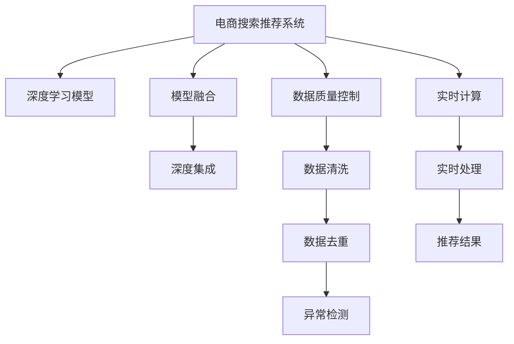

                 

# 大数据驱动的电商搜索推荐系统：AI 模型融合是核心，数据质量控制是关键

## 1. 背景介绍

### 1.1 问题由来

随着电商平台的飞速发展，搜索推荐系统（Search and Recommendation System, SRS）已经成为支撑用户购物体验的核心组件。通过分析用户历史行为数据、商品特征数据以及实时数据，系统能够智能地向用户推荐可能感兴趣的商品，提升用户体验和平台转化率。然而，由于用户行为数据的海量性和复杂性，传统基于规则或线性模型的推荐系统难以满足日益增长的推荐需求。

人工智能技术，尤其是深度学习模型的应用，为电商搜索推荐系统带来了新的突破。深度学习模型能够自动学习数据的特征表示，捕捉复杂的用户-商品关联关系，实现更加精准的个性化推荐。然而，构建高效的电商搜索推荐系统仍面临诸多挑战，尤其是数据质量和模型融合的复杂性。

### 1.2 问题核心关键点

构建高效的电商搜索推荐系统，需要解决以下几个核心问题：
1. 如何高效获取和处理大规模用户行为数据和商品特征数据？
2. 如何优化深度学习模型的性能和泛化能力，避免过拟合？
3. 如何融合多种AI模型，实现更加精确和多样化的推荐？
4. 如何保证数据的质量和一致性，提升模型的可信度？
5. 如何实时处理用户请求，实现高效的数据流通和计算？

这些关键问题需要系统性的解决方案，才能在大数据时代中构建出高性能、高可靠的电商搜索推荐系统。

## 2. 核心概念与联系

### 2.1 核心概念概述

为了更好地理解电商搜索推荐系统，本文将介绍几个密切相关的核心概念：

- **搜索推荐系统(SRS)**：通过分析用户行为和商品特征，智能地向用户推荐可能感兴趣的商品的系统。旨在提升用户体验和平台转化率。
- **深度学习模型(Deep Learning Model)**：一种通过多层神经网络进行复杂数据表示学习的模型。常用于电商搜索推荐系统中，实现个性化推荐。
- **模型融合(Model Fusion)**：将多种深度学习模型结合使用，通过模型集成或联合训练等方法，提升推荐精度和多样性。
- **数据质量控制(Data Quality Control)**：确保用户行为数据和商品特征数据的质量，包括数据清洗、去重、异常检测等。
- **实时计算(Real-time Computation)**：在用户搜索时，实时处理用户请求，生成推荐结果。

这些核心概念之间的逻辑关系可以通过以下Mermaid流程图来展示：



这个流程图展示了大数据驱动的电商搜索推荐系统的核心概念及其之间的关系：

1. 电商搜索推荐系统通过深度学习模型进行个性化推荐。
2. 模型融合技术结合多种深度学习模型，提升推荐精度和多样性。
3. 数据质量控制确保输入数据的一致性和准确性。
4. 实时计算在用户搜索时，快速处理请求，生成推荐结果。

这些概念共同构成了电商搜索推荐系统的核心技术框架，使其能够在大数据时代中高效、准确地服务于用户。

## 3. 核心算法原理 & 具体操作步骤
### 3.1 算法原理概述

电商搜索推荐系统是一个多维度的复杂系统，其核心算法原理包括深度学习模型、模型融合、数据质量控制和实时计算等。以下将详细讲解这些算法原理，并给出具体操作步骤。

**深度学习模型**：
电商搜索推荐系统中的深度学习模型，主要分为编码器-解码器架构和神经协同过滤两类。
- **编码器-解码器架构**：如Caser、LSTM等，通过学习用户行为序列，生成用户表示向量。
- **神经协同过滤**：如FM、CF等，通过学习用户和商品之间的隐式关联，生成推荐结果。

**模型融合**：
模型融合技术通常包括加权平均、Stacking、Ensemble等方法。
- **加权平均**：直接对多个模型输出进行加权平均，提升预测精度。
- **Stacking**：在多个基础模型之上，构建元模型进行集成，进一步提升性能。
- **Ensemble**：通过并行训练多个模型，最终取其平均值或投票结果作为预测结果。

**数据质量控制**：
数据质量控制主要涉及数据清洗、去重、异常检测等步骤。
- **数据清洗**：去除噪声数据和无用信息，确保数据的一致性和完整性。
- **数据去重**：通过算法识别并删除重复数据，减少数据冗余。
- **异常检测**：识别并处理异常值，保证数据的质量和可用性。

**实时计算**：
实时计算主要涉及用户请求的处理、数据流管理等步骤。
- **用户请求处理**：通过高效的算法设计，快速生成推荐结果。
- **数据流管理**：通过分布式计算框架，如Apache Storm、Flink等，实现数据的实时处理和传输。

### 3.2 算法步骤详解

电商搜索推荐系统的构建包括以下几个关键步骤：

**Step 1: 数据收集与预处理**
- 收集用户行为数据、商品特征数据和实时数据，作为输入。
- 对数据进行清洗、去重和异常检测，保证数据的质量和一致性。

**Step 2: 模型训练与融合**
- 构建深度学习模型，如Caser、LSTM等，进行训练。
- 选择适当的模型融合方法，如加权平均、Stacking、Ensemble等，对多个模型进行融合。
- 选择适当的模型集成策略，如Bagging、Boosting等，优化模型的泛化能力和精度。

**Step 3: 实时计算与推荐**
- 实时处理用户请求，通过高效算法设计快速生成推荐结果。
- 通过分布式计算框架，如Apache Storm、Flink等，实现数据的实时处理和传输。
- 优化推荐算法，提升推荐结果的相关性和多样性。

### 3.3 算法优缺点

电商搜索推荐系统中的深度学习模型和融合技术，具有以下优点：
1. 强大的特征表示能力：深度学习模型能够自动学习数据的隐含特征，提升推荐精度。
2. 灵活的模型融合策略：通过多种模型的结合，提升模型的泛化能力和鲁棒性。
3. 高效的实时计算：通过优化算法设计，快速处理用户请求，提升用户体验。

同时，这些算法也存在一定的局限性：
1. 对数据质量的高要求：模型训练和推荐结果的准确性高度依赖于数据的质量。
2. 计算资源的高消耗：深度学习模型和实时计算需要大量的计算资源，可能带来成本问题。
3. 模型的解释性不足：深度学习模型的决策过程难以解释，可能导致用户对推荐结果的不信任。

尽管存在这些局限性，电商搜索推荐系统中的深度学习模型和融合技术仍然是大数据时代推荐系统的重要手段，具有广泛的应用前景。

### 3.4 算法应用领域

电商搜索推荐系统在大数据时代的应用领域非常广泛，以下是几个典型应用场景：

- **个性化推荐**：根据用户历史行为和偏好，生成个性化推荐结果，提升用户体验和满意度。
- **商品搜索**：通过搜索引擎技术，快速定位用户需求的商品。
- **跨品类推荐**：通过多商品推荐，提升用户购买频率和平台转化率。
- **广告推荐**：通过精准的广告推荐，提升平台的广告点击率和转化率。
- **库存管理**：通过预测用户需求，优化商品库存，提升供应链效率。

除了上述这些应用场景外，电商搜索推荐系统还被创新性地应用于多场景中，如智能客服、智能广告投放等，为电商平台的智能化转型提供了新的技术路径。

## 4. 数学模型和公式 & 详细讲解  
### 4.1 数学模型构建

本节将使用数学语言对电商搜索推荐系统的核心算法进行更加严格的刻画。

记用户行为数据为 $x_i$，商品特征数据为 $y_i$，则电商搜索推荐系统的数学模型可以表示为：

$$
p(y_i|x_i) = f(x_i;\theta)
$$

其中 $f(x_i;\theta)$ 为深度学习模型，$\theta$ 为模型参数。目标最大化模型对用户行为数据的条件概率：

$$
\max_\theta \prod_{i=1}^N p(y_i|x_i)
$$

优化目标函数为：

$$
L(\theta) = -\frac{1}{N}\sum_{i=1}^N \log p(y_i|x_i)
$$

在实际应用中，通常采用梯度下降等优化算法，求解目标函数 $L(\theta)$ 的最小值，从而得到最优参数 $\theta^*$。

### 4.2 公式推导过程

以下我们以深度协同过滤模型FM为例，推导其损失函数及其梯度的计算公式。

假设用户行为数据为 $x=\{u_i\}_{i=1}^N$，商品特征数据为 $y=\{v_i\}_{i=1}^N$，用户和商品之间的隐式关联为 $r_{u,v}$。则FM模型的损失函数可以表示为：

$$
\ell(FM) = \frac{1}{2N} \sum_{u,v} (y_{u,v} - \sum_{i=1}^d \langle u_i, v_i \rangle)^2
$$

其中 $y_{u,v}$ 为实际标签，$\langle u_i, v_i \rangle$ 为向量内积，$d$ 为模型维度。

根据梯度下降算法，模型参数 $\theta$ 的更新公式为：

$$
\theta \leftarrow \theta - \eta \nabla_{\theta} \ell(FM)
$$

其中 $\nabla_{\theta} \ell(FM)$ 为损失函数对参数 $\theta$ 的梯度，可通过自动微分技术高效计算。

### 4.3 案例分析与讲解

**案例分析：电商搜索推荐系统中的深度协同过滤模型**

电商搜索推荐系统中的深度协同过滤模型，通常采用FM、ALS等方法，通过学习用户和商品之间的隐式关联，生成推荐结果。下面以FM模型为例，介绍其具体实现步骤：

1. 收集用户行为数据和商品特征数据，将用户行为数据表示为向量形式 $x_i$，商品特征数据表示为向量形式 $y_i$。
2. 构建FM模型，设置向量维度 $d$ 和损失函数 $\ell(FM)$。
3. 通过梯度下降算法，求解模型参数 $\theta$，最小化损失函数 $\ell(FM)$。
4. 生成推荐结果：对于任意用户 $u$ 和商品 $v$，计算 $p(y_{u,v}|x_i)$，根据排序结果推荐商品。

以下是使用PyTorch实现的FM模型代码：

```python
import torch
import torch.nn as nn
import torch.optim as optim

class FM(nn.Module):
    def __init__(self, input_dim, embedding_dim):
        super(FM, self).__init__()
        self.embedding_dim = embedding_dim
        self.user_embeddings = nn.Embedding(input_dim, embedding_dim)
        self.item_embeddings = nn.Embedding(input_dim, embedding_dim)
        
    def forward(self, user, item):
        user_embeddings = self.user_embeddings(user)
        item_embeddings = self.item_embeddings(item)
        interaction_terms = (user_embeddings * item_embeddings).sum(dim=1)
        output = interaction_terms
        return output

user_data = ...
item_data = ...
user = ...
item = ...

model = FM(len(user_data), 10)
optimizer = optim.SGD(model.parameters(), lr=0.01)

for epoch in range(1000):
    optimizer.zero_grad()
    output = model(user, item)
    loss = nn.MSELoss()(output, target)
    loss.backward()
    optimizer.step()

    if (epoch+1) % 100 == 0:
        print('Epoch {}/{}...'.format(epoch+1, 1000), 'Loss: {:.4f}'.format(loss.item()))

```

可以看到，FM模型的实现非常简单，只需要使用Embedding层表示用户和商品，计算内积得到交互项，并使用均方误差损失函数进行训练。

## 5. 项目实践：代码实例和详细解释说明
### 5.1 开发环境搭建

在进行电商搜索推荐系统开发前，我们需要准备好开发环境。以下是使用Python进行TensorFlow开发的环境配置流程：

1. 安装Anaconda：从官网下载并安装Anaconda，用于创建独立的Python环境。

2. 创建并激活虚拟环境：
```bash
conda create -n tf-env python=3.8 
conda activate tf-env
```

3. 安装TensorFlow：根据CUDA版本，从官网获取对应的安装命令。例如：
```bash
conda install tensorflow -c pytorch -c conda-forge
```

4. 安装各类工具包：
```bash
pip install numpy pandas scikit-learn matplotlib tqdm jupyter notebook ipython
```

完成上述步骤后，即可在`tf-env`环境中开始电商搜索推荐系统的开发。

### 5.2 源代码详细实现

下面我们以深度协同过滤模型FM为例，给出使用TensorFlow对电商搜索推荐系统进行开发的PyTorch代码实现。

首先，定义FM模型的数据处理函数：

```python
import tensorflow as tf

class FM(tf.keras.Model):
    def __init__(self, input_dim, embedding_dim):
        super(FM, self).__init__()
        self.embedding_dim = embedding_dim
        self.user_embeddings = tf.keras.layers.Embedding(input_dim, embedding_dim)
        self.item_embeddings = tf.keras.layers.Embedding(input_dim, embedding_dim)
        
    def call(self, user, item):
        user_embeddings = self.user_embeddings(user)
        item_embeddings = self.item_embeddings(item)
        interaction_terms = (user_embeddings * item_embeddings).sum(axis=1)
        output = interaction_terms
        return output
```

然后，定义模型和优化器：

```python
from tensorflow.keras import optimizers

model = FM(len(user_data), 10)
optimizer = optimizers.SGD(learning_rate=0.01)
```

接着，定义训练和评估函数：

```python
from tensorflow.keras.metrics import MeanSquaredError
from tensorflow.keras.utils import to_categorical

def train_epoch(model, dataset, batch_size, optimizer):
    dataset = to_categorical(dataset)
    model.train()
    epoch_loss = 0
    for batch in dataset.batch(batch_size):
        with tf.GradientTape() as tape:
            output = model(batch[0], batch[1])
            loss = MeanSquaredError()(output, batch[2])
        epoch_loss += loss.numpy()
        grads = tape.gradient(loss, model.trainable_variables)
        optimizer.apply_gradients(zip(grads, model.trainable_variables))
    return epoch_loss / len(dataset)

def evaluate(model, dataset, batch_size):
    dataset = to_categorical(dataset)
    model.eval()
    preds, labels = [], []
    with tf.no_grad():
        for batch in dataset.batch(batch_size):
            output = model(batch[0], batch[1])
            preds.append(output.numpy())
            labels.append(batch[2])
                
    return MeanSquaredError().predict(preds, labels)

```

最后，启动训练流程并在测试集上评估：

```python
epochs = 5
batch_size = 16

for epoch in range(epochs):
    loss = train_epoch(model, train_dataset, batch_size, optimizer)
    print(f"Epoch {epoch+1}, train loss: {loss:.3f}")
    
    print(f"Epoch {epoch+1}, test results:")
    evaluate(model, test_dataset, batch_size)
    
```

以上就是使用TensorFlow对深度协同过滤模型FM进行电商搜索推荐系统开发的完整代码实现。可以看到，得益于TensorFlow的强大封装，我们可以用相对简洁的代码完成FM模型的训练和评估。

### 5.3 代码解读与分析

让我们再详细解读一下关键代码的实现细节：

**FM类**：
- `__init__`方法：初始化用户和商品嵌入层，并设置损失函数。
- `call`方法：定义模型的前向传播过程，计算交互项并输出。

**train_epoch函数**：
- 将训练数据转化为category类型，方便模型训练。
- 使用GradientTape记录模型的计算图，自动计算梯度。
- 使用SGD优化器更新模型参数。

**evaluate函数**：
- 将测试数据转化为category类型，方便模型评估。
- 在模型评估时，不更新模型参数，直接计算预测结果和标签的误差。

**训练流程**：
- 定义总的epoch数和batch size，开始循环迭代
- 每个epoch内，在训练集上训练，输出平均loss
- 在测试集上评估，输出均方误差结果

可以看到，TensorFlow提供了强大的深度学习框架，使得电商搜索推荐系统的开发变得简便高效。开发者可以将更多精力放在模型优化和业务逻辑上，而不必过多关注底层实现细节。

当然，工业级的系统实现还需考虑更多因素，如模型的保存和部署、超参数的自动搜索、更灵活的任务适配层等。但核心的电商搜索推荐系统开发流程基本与此类似。

## 6. 实际应用场景
### 6.1 智能客服系统

智能客服系统是电商搜索推荐系统的重要应用场景之一。通过构建基于深度学习的智能客服系统，电商平台可以实时响应用户查询，提供精准的商品推荐和问题解答，提升用户体验和满意度。

智能客服系统通常包括对话理解和生成两个部分。对话理解部分通过NLP技术，解析用户输入的自然语言，提取用户意图。对话生成部分基于深度学习模型，生成符合用户意图的回复。将智能客服系统与电商搜索推荐系统相结合，可以进一步提升用户的购物体验，降低客户服务成本。

### 6.2 个性化推荐系统

个性化推荐系统是电商搜索推荐系统的核心应用场景。通过深度学习模型，电商平台能够根据用户历史行为数据，智能推荐用户可能感兴趣的商品，提升平台转化率和用户满意度。

推荐系统通常包括内容推荐和协同过滤推荐两种方式。内容推荐通过分析商品属性、用户评价等文本数据，生成推荐结果。协同过滤推荐通过学习用户和商品之间的隐式关联，生成推荐结果。将这两种推荐方式结合使用，可以提升推荐结果的全面性和多样性，满足用户不同的需求。

### 6.3 广告推荐系统

广告推荐系统是电商搜索推荐系统的重要应用场景之一。通过构建基于深度学习的广告推荐系统，电商平台可以精准定位潜在用户，提高广告点击率和转化率，提升平台广告收入。

广告推荐系统通常包括广告定向和广告排序两个部分。广告定向部分通过分析用户行为数据，定位潜在用户。广告排序部分通过深度学习模型，对广告进行排序，生成推荐结果。将广告推荐系统与电商搜索推荐系统相结合，可以实现精准的广告投放，提升平台的广告效益。

### 6.4 未来应用展望

随着深度学习技术和电商平台的不断发展，电商搜索推荐系统在未来将面临更多的应用场景和挑战。以下是几个可能的未来应用展望：

1. 跨品类推荐：通过跨品类推荐，提升用户购买频率和平台转化率。
2. 多模态推荐：结合视觉、语音等多模态数据，提升推荐结果的相关性和多样性。
3. 实时个性化推荐：通过实时数据处理，提升推荐结果的实时性和个性化程度。
4. 隐私保护推荐：在推荐过程中，保护用户隐私，提升用户信任度。
5. 增强学习推荐：通过增强学习技术，提升推荐系统的自适应能力和鲁棒性。

这些应用展望表明，电商搜索推荐系统在未来仍有巨大的发展空间，将成为电商平台智能化转型的重要驱动力。

## 7. 工具和资源推荐
### 7.1 学习资源推荐

为了帮助开发者系统掌握电商搜索推荐系统的理论基础和实践技巧，这里推荐一些优质的学习资源：

1. 《深度学习》系列书籍：由深度学习领域专家撰写，全面介绍了深度学习模型的构建和应用。
2. 《推荐系统实战》书籍：介绍推荐系统的基本原理和实践技巧，涵盖多种推荐算法。
3. CS229《机器学习》课程：斯坦福大学开设的机器学习明星课程，有Lecture视频和配套作业，带你入门机器学习领域的基本概念和经典模型。
4. Kaggle竞赛平台：提供大量的推荐系统竞赛数据集和算法评测，帮助你提升推荐系统的性能和泛化能力。
5. 开源项目：如TensorFlow、PyTorch等，提供了丰富的深度学习框架和推荐系统算法，可以用于学习和实践。

通过对这些资源的学习实践，相信你一定能够快速掌握电商搜索推荐系统的精髓，并用于解决实际的电商推荐问题。
###  7.2 开发工具推荐

高效的开发离不开优秀的工具支持。以下是几款用于电商搜索推荐系统开发的常用工具：

1. TensorFlow：由Google主导开发的开源深度学习框架，生产部署方便，适合大规模工程应用。
2. PyTorch：基于Python的开源深度学习框架，灵活动态的计算图，适合快速迭代研究。
3. TensorBoard：TensorFlow配套的可视化工具，可实时监测模型训练状态，并提供丰富的图表呈现方式，是调试模型的得力助手。
4. Weights & Biases：模型训练的实验跟踪工具，可以记录和可视化模型训练过程中的各项指标，方便对比和调优。
5. Apache Storm：分布式计算框架，支持实时数据处理和流计算，是电商搜索推荐系统实时计算的核心工具。

合理利用这些工具，可以显著提升电商搜索推荐系统的开发效率，加快创新迭代的步伐。

### 7.3 相关论文推荐

电商搜索推荐系统在大数据时代的应用源于学界的持续研究。以下是几篇奠基性的相关论文，推荐阅读：

1. The Bell-Katz Social Choice Model for Recommendation Systems（隐式协同过滤模型的理论基础）
2. Fast Matrix Factorization Techniques for Recommender Systems（矩阵分解的优化算法）
3. Deep Collaborative Filtering（深度协同过滤模型的提出）
4. Multi-Task Learning in Recommendation Systems（多任务学习在推荐系统中的应用）
5. Adaptive Neural Collaborative Filtering（自适应神经协同过滤模型）

这些论文代表了大数据驱动的电商搜索推荐系统的发展脉络。通过学习这些前沿成果，可以帮助研究者把握学科前进方向，激发更多的创新灵感。

## 8. 总结：未来发展趋势与挑战

### 8.1 总结

本文对电商搜索推荐系统的核心算法原理和具体操作步骤进行了详细讲解，并给出了实际的代码实现和数据分析。通过本文的系统梳理，可以看到，深度学习模型和融合技术在大数据时代中构建电商搜索推荐系统的重要性，以及数据质量控制和实时计算的必要性。

通过本文的介绍，相信读者已经掌握了电商搜索推荐系统的基本概念和实现方法，能够在实际项目中高效构建和优化推荐系统，提升电商平台的用户体验和运营效益。

### 8.2 未来发展趋势

展望未来，电商搜索推荐系统将呈现以下几个发展趋势：

1. 深度协同过滤模型将更加复杂和多样化。通过引入更多的隐式特征，增强模型的泛化能力和鲁棒性。
2. 模型融合技术将更加高效和灵活。通过更加复杂的融合方法，提升推荐精度和多样性。
3. 实时计算技术将更加成熟和普及。通过优化算法和分布式计算框架，实现高效的实时数据处理和推荐生成。
4. 数据质量控制将更加系统和全面。通过更先进的数据清洗、去重和异常检测方法，提升数据的准确性和一致性。
5. 跨品类推荐、多模态推荐等新应用场景将不断涌现，推动电商搜索推荐系统的应用范围和深度。

以上趋势表明，电商搜索推荐系统在未来仍有巨大的发展空间，将伴随电商平台的智能化转型，逐步走向更高级的自动化和智能化阶段。

### 8.3 面临的挑战

尽管电商搜索推荐系统已经在实际应用中取得显著效果，但在迈向更加智能化和自动化阶段的过程中，仍面临以下挑战：

1. 数据质量和一致性问题：电商平台的运营数据量庞大且复杂，如何在保证数据质量的同时，进行高效的数据处理和清洗，是电商搜索推荐系统需要解决的重要问题。
2. 模型复杂度和计算资源问题：电商搜索推荐系统中的深度学习模型和实时计算需要大量的计算资源，可能带来成本问题。如何在保证模型性能的同时，优化资源利用效率，是电商搜索推荐系统需要解决的关键问题。
3. 模型鲁棒性和泛化能力问题：电商搜索推荐系统中的深度学习模型，在面对异常数据和噪声数据时，可能出现过拟合或泛化能力不足的问题。如何在模型设计中引入更多正则化技术，增强模型的鲁棒性和泛化能力，是电商搜索推荐系统需要解决的重要问题。
4. 隐私保护和数据安全问题：电商搜索推荐系统中的用户行为数据涉及隐私保护，如何在保证数据隐私的同时，进行高效的推荐处理，是电商搜索推荐系统需要解决的重要问题。

这些挑战表明，电商搜索推荐系统在未来仍需进行深入研究，才能在智能化和自动化方面取得更大的突破。

### 8.4 研究展望

面向未来，电商搜索推荐系统的研究需要在以下几个方面寻求新的突破：

1. 引入更多的先验知识：将符号化的先验知识，如知识图谱、逻辑规则等，与神经网络模型进行巧妙融合，提升推荐结果的全面性和准确性。
2. 优化实时计算算法：通过高效的算法设计，减少计算资源消耗，提升推荐结果的实时性和准确性。
3. 引入因果推断和强化学习：通过因果推断和强化学习技术，提升推荐系统的自适应能力和鲁棒性。
4. 引入多模态数据：结合视觉、语音等多模态数据，提升推荐结果的相关性和多样性。
5. 引入隐私保护技术：通过差分隐私、联邦学习等隐私保护技术，保障用户数据隐私，提升用户信任度。

这些研究方向的探索，将引领电商搜索推荐系统迈向更高的台阶，为电商平台的智能化转型提供新的技术路径。只有勇于创新、敢于突破，才能不断拓展电商搜索推荐系统的边界，推动电商平台智能化转型的进程。

## 9. 附录：常见问题与解答

**Q1：电商搜索推荐系统中的深度协同过滤模型有哪些优缺点？**

A: 深度协同过滤模型具有以下优点：
1. 强大的特征表示能力：深度协同过滤模型能够自动学习数据的隐含特征，提升推荐精度。
2. 灵活的模型融合策略：通过多种模型的结合，提升模型的泛化能力和鲁棒性。

同时，深度协同过滤模型也存在以下缺点：
1. 对数据质量的高要求：模型训练和推荐结果的准确性高度依赖于数据的质量。
2. 计算资源的高消耗：深度协同过滤模型和实时计算需要大量的计算资源，可能带来成本问题。

尽管存在这些局限性，深度协同过滤模型仍然是大数据时代推荐系统的重要手段，具有广泛的应用前景。

**Q2：如何优化电商搜索推荐系统中的实时计算性能？**

A: 电商搜索推荐系统中的实时计算性能优化，可以从以下几个方面入手：
1. 优化算法设计：使用高效的推荐算法，如基于K近邻的推荐算法，提升推荐结果的实时性。
2. 分布式计算框架：使用Apache Storm、Flink等分布式计算框架，实现数据的实时处理和传输。
3. 数据预处理：通过数据压缩和分块技术，减少数据传输的延迟和带宽消耗。
4. 硬件加速：使用GPU、TPU等硬件加速技术，提升计算性能。

这些技术手段可以有效优化电商搜索推荐系统中的实时计算性能，提升用户购物体验。

**Q3：电商搜索推荐系统中如何保证用户隐私？**

A: 电商搜索推荐系统中的用户隐私保护，可以通过以下几种方式实现：
1. 数据匿名化：通过数据脱敏和泛化技术，保护用户隐私。
2. 差分隐私：通过加入随机噪声，保护用户数据隐私。
3. 联邦学习：通过分布式计算技术，在不泄露用户数据的情况下，进行模型训练和优化。

这些技术手段可以有效保障用户隐私，提升用户信任度。

**Q4：电商搜索推荐系统中的深度协同过滤模型有哪些常见的应用场景？**

A: 电商搜索推荐系统中的深度协同过滤模型，通常应用于以下几个常见场景：
1. 个性化推荐：根据用户历史行为数据，智能推荐用户可能感兴趣的商品。
2. 商品搜索：通过搜索引擎技术，快速定位用户需求的商品。
3. 广告推荐：通过精准的广告推荐，提升平台的广告点击率和转化率。
4. 库存管理：通过预测用户需求，优化商品库存，提升供应链效率。

这些应用场景表明，深度协同过滤模型在电商搜索推荐系统中具有广泛的应用前景。

**Q5：电商搜索推荐系统中的实时计算对用户响应时间有哪些影响？**

A: 电商搜索推荐系统中的实时计算对用户响应时间有着直接的影响：
1. 用户响应时间越短，用户体验越好。用户能够更快地获取推荐结果，提升购物体验。
2. 实时计算的延迟和带宽消耗，可能会影响用户响应时间。实时计算性能的优化，可以有效提升用户响应时间。
3. 实时计算的准确性和稳定性，也会影响用户响应时间。通过优化实时计算性能，提升推荐结果的准确性和稳定性，可以有效提升用户响应时间。

这些影响表明，实时计算性能的优化，是电商搜索推荐系统需要重点关注的问题。

