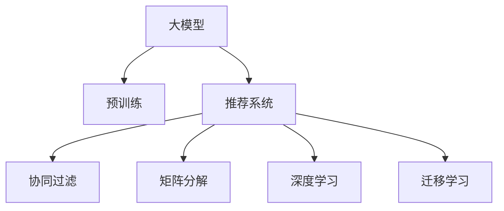

                 

# 大模型与推荐系统的融合: 微软的实践

> 关键词：大模型,推荐系统,微软,融合,应用实践

## 1. 背景介绍

### 1.1 问题由来

推荐系统是互联网时代的重要应用，从电商平台到内容平台，从搜索引擎到社交网络，都在广泛应用推荐算法为用户提供个性化服务。传统推荐算法通常依赖用户行为数据，如浏览记录、点击行为等。但这些数据需要用户长期活跃，且难以直接反映用户兴趣，因此推荐效果存在局限性。

近年来，随着深度学习技术的发展，大模型在自然语言处理(NLP)和计算机视觉等领域取得了突破性进展，被逐渐应用于推荐系统。大模型能够自动学习高层次的抽象特征，具备良好的泛化能力，能够适应多种推荐任务，提供更高的推荐精度和更好的用户体验。

### 1.2 问题核心关键点

大模型与推荐系统的融合，可以显著提升推荐系统的效果和覆盖范围。该方法的核心在于：

1. 大模型能够学习到全局语义信息，理解用户兴趣的深层次语义特征。
2. 推荐系统可以利用大模型的泛化能力，拓展推荐场景和覆盖领域。
3. 大模型的语言理解能力，可以增强推荐内容的语义相关性。
4. 大模型的可迁移性，可以在不同推荐场景和数据集上灵活应用。
5. 大模型的微调技术，可以在特定任务上优化推荐模型，提升个性化推荐效果。

本文将重点介绍微软在这方面的最新实践，探讨大模型与推荐系统融合的核心算法和具体实现。

## 2. 核心概念与联系

### 2.1 核心概念概述

为更好地理解大模型与推荐系统的融合方法，本节将介绍几个密切相关的核心概念：

- 大模型(Large Model)：如GPT、BERT等，基于大规模无标签文本数据进行预训练，具备强大的语言生成和理解能力。
- 推荐系统(Recommendation System)：通过分析用户历史行为数据，为用户推荐感兴趣的物品或内容。
- 协同过滤(Collaborative Filtering)：推荐算法中常用的一种方法，通过分析用户与物品的交互行为，预测用户未见过的物品或内容的兴趣。
- 矩阵分解(Matrix Factorization)：基于矩阵分解技术进行推荐，将用户-物品评分矩阵分解为低维用户和物品向量，进行预测。
- 深度学习(Deep Learning)：使用神经网络模型进行推荐，具备更强的非线性表达能力和泛化能力。
- 迁移学习(Transfer Learning)：利用已有的大模型在特定任务上学习到的知识，迁移应用到推荐系统，提升推荐效果。

这些核心概念之间的逻辑关系可以通过以下Mermaid流程图来展示：



这个流程图展示了大模型与推荐系统的核心概念及其之间的关系：

1. 大模型通过预训练获得基础能力。
2. 推荐系统利用大模型的泛化能力，提升推荐效果。
3. 协同过滤和矩阵分解是大模型推荐的基础算法。
4. 深度学习和大模型结合，进一步提升推荐精度。
5. 迁移学习使大模型能够灵活应用于不同推荐场景。

这些概念共同构成了大模型与推荐系统融合的理论基础，使其能够在推荐系统领域发挥重要作用。通过理解这些核心概念，我们可以更好地把握大模型与推荐系统融合的实现方法和应用场景。

## 3. 核心算法原理 & 具体操作步骤
### 3.1 算法原理概述

大模型与推荐系统的融合，主要基于迁移学习框架，具体步骤如下：

1. 使用大规模无标签数据对大模型进行预训练，学习通用语言表示。
2. 收集推荐系统用户-物品评分数据，作为微调任务的数据集。
3. 在大模型顶部设计推荐相关输出层和损失函数。
4. 使用微调任务的数据集，通过有监督学习优化模型，提升推荐效果。

### 3.2 算法步骤详解

以下详细讲解大模型与推荐系统融合的具体步骤：

**Step 1: 准备预训练模型和数据集**

- 选择合适的预训练语言模型，如GPT-3、BERT等，作为初始化参数。
- 收集推荐系统用户-物品评分数据集，划分为训练集、验证集和测试集。一般要求评分数据与预训练数据的分布不要差异过大。

**Step 2: 添加推荐任务适配层**

- 根据推荐任务类型，在预训练模型顶部设计合适的输出层和损失函数。
- 对于评分预测任务，通常在顶层添加线性回归层，并使用均方误差损失函数。
- 对于多标签分类任务，通常使用多标签分类损失函数。

**Step 3: 设置微调超参数**

- 选择合适的优化算法及其参数，如Adam、SGD等，设置学习率、批大小、迭代轮数等。
- 设置正则化技术及强度，包括权重衰减、Dropout、Early Stopping等。
- 确定冻结预训练参数的策略，如仅微调顶层，或全部参数都参与微调。

**Step 4: 执行梯度训练**

- 将训练集数据分批次输入模型，前向传播计算损失函数。
- 反向传播计算参数梯度，根据设定的优化算法和学习率更新模型参数。
- 周期性在验证集上评估模型性能，根据性能指标决定是否触发Early Stopping。
- 重复上述步骤直到满足预设的迭代轮数或Early Stopping条件。

**Step 5: 测试和部署**

- 在测试集上评估微调后模型的推荐精度，对比微调前后的效果提升。
- 使用微调后的模型对新样本进行推荐预测，集成到实际推荐系统中。
- 持续收集新的评分数据，定期重新微调模型，以适应评分数据分布的变化。

以上是基于迁移学习的大模型与推荐系统融合的一般流程。在实际应用中，还需要针对具体任务的特点，对微调过程的各个环节进行优化设计，如改进训练目标函数，引入更多的正则化技术，搜索最优的超参数组合等，以进一步提升推荐效果。

### 3.3 算法优缺点

大模型与推荐系统的融合方法具有以下优点：

1. 提升推荐效果。大模型具备强大的语言理解能力，能够提取高层次的语义特征，提升推荐系统的个性化和相关性。
2. 泛化能力强。大模型在多种推荐场景和数据集上均能表现出色，具备较强的泛化能力。
3. 快速迭代。基于迁移学习的微调方法，可以快速适应新的评分数据，加速推荐模型的优化过程。
4. 适应性强。大模型能够灵活应用于不同推荐场景，如电商推荐、内容推荐、搜索推荐等。
5. 数据需求低。相比于传统推荐系统，大模型对用户行为数据的需求较低，可以处理更稀疏的数据。

但该方法也存在一定的局限性：

1. 计算资源需求高。大模型需要高计算资源的支持，初期成本较高。
2. 数据隐私风险。大模型通常需要收集大量用户评分数据，涉及用户隐私和数据安全问题。
3. 模型复杂度较高。大模型的结构和训练过程复杂，难以解释其内部工作机制。
4. 过拟合风险。大模型可能会学习到评分数据中的噪声，导致过拟合。
5. 模型大小不可控。大模型通常参数量较大，难以进行模型裁剪和压缩。

尽管存在这些局限性，但就目前而言，基于大模型的推荐方法仍是大规模推荐系统的最佳选择之一。未来相关研究的重点在于如何进一步降低大模型对计算资源的需求，提高模型的可解释性和鲁棒性，以及增强模型对新数据的适应性。

### 3.4 算法应用领域

基于大模型与推荐系统的融合方法，已经在电商推荐、内容推荐、搜索推荐等多个领域得到了广泛的应用，如：

- 电商推荐：通过分析用户的历史购买记录，为用户推荐可能感兴趣的商品。大模型可以自动学习到商品的描述和标签，提升推荐相关性。
- 内容推荐：为用户推荐可能感兴趣的视频、文章、新闻等。大模型能够理解文本内容，提供更精准的推荐。
- 搜索推荐：在用户输入搜索词时，推荐最相关的搜索结果。大模型能够理解查询语义，提高搜索结果的相关性。
- 社交推荐：根据用户的社交网络和行为数据，推荐可能感兴趣的人或内容。大模型能够理解社交语义，增强推荐的相关性。

除了上述这些经典应用外，大模型与推荐系统的融合还在游戏推荐、音乐推荐、新闻推荐等更多场景中得到了应用，为推荐系统带来了全新的突破。随着大模型的不断演进，相信推荐系统必将在更广阔的领域中发挥更大作用。

## 4. 数学模型和公式 & 详细讲解 & 举例说明

### 4.1 数学模型构建

假设大模型为 $M_{\theta}:\mathcal{X} \rightarrow \mathcal{Y}$，其中 $\mathcal{X}$ 为用户特征，$\mathcal{Y}$ 为物品特征，$\theta$ 为模型参数。假设推荐系统用户-物品评分数据集为 $D=\{(x_i,y_i)\}_{i=1}^N, x_i \in \mathcal{X}, y_i \in \mathcal{Y}$。

定义模型 $M_{\theta}$ 在数据样本 $(x,y)$ 上的损失函数为 $\ell(M_{\theta}(x),y)$，则在数据集 $D$ 上的经验风险为：

$$
\mathcal{L}(\theta) = \frac{1}{N} \sum_{i=1}^N \ell(M_{\theta}(x_i),y_i)
$$

微调的优化目标是最小化经验风险，即找到最优参数：

$$
\theta^* = \mathop{\arg\min}_{\theta} \mathcal{L}(\theta)
$$

在实践中，我们通常使用基于梯度的优化算法（如SGD、Adam等）来近似求解上述最优化问题。设 $\eta$ 为学习率，$\lambda$ 为正则化系数，则参数的更新公式为：

$$
\theta \leftarrow \theta - \eta \nabla_{\theta}\mathcal{L}(\theta) - \eta\lambda\theta
$$

其中 $\nabla_{\theta}\mathcal{L}(\theta)$ 为损失函数对参数 $\theta$ 的梯度，可通过反向传播算法高效计算。

### 4.2 公式推导过程

以评分预测任务为例，假设计分数据集 $D=\{(x_i,y_i)\}_{i=1}^N$，其中 $x_i$ 为用户的特征向量，$y_i$ 为物品的评分。定义模型的输出为 $M_{\theta}(x_i)=\hat{y}_i$，使用均方误差损失函数，则损失函数为：

$$
\ell(\hat{y_i}, y_i) = \frac{1}{2}(\hat{y_i} - y_i)^2
$$

将损失函数代入经验风险公式，得：

$$
\mathcal{L}(\theta) = \frac{1}{N} \sum_{i=1}^N \frac{1}{2}(\hat{y_i} - y_i)^2
$$

根据链式法则，损失函数对参数 $\theta_k$ 的梯度为：

$$
\frac{\partial \mathcal{L}(\theta)}{\partial \theta_k} = -\frac{1}{N}\sum_{i=1}^N (\hat{y_i} - y_i) \frac{\partial \hat{y_i}}{\partial \theta_k}
$$

其中 $\frac{\partial \hat{y_i}}{\partial \theta_k}$ 可进一步递归展开，利用自动微分技术完成计算。

在得到损失函数的梯度后，即可带入参数更新公式，完成模型的迭代优化。重复上述过程直至收敛，最终得到适应推荐任务的最优模型参数 $\theta^*$。

### 4.3 案例分析与讲解

以电商平台推荐系统为例，假设收集到用户的历史购买记录，将用户和物品的特征向量作为输入，物品评分作为监督信号，对预训练的BERT模型进行微调。具体步骤如下：

**Step 1: 数据准备**

- 收集用户历史购买记录，提取用户ID、物品ID、购买时间、购买数量等特征。
- 使用One-hot编码将用户ID和物品ID转换为向量。
- 将用户ID和物品ID合并为一个特征向量 $x_i = [user_{id}, item_{id}]$。

**Step 2: 模型微调**

- 使用BERT模型作为初始化参数。
- 在大模型顶部添加线性回归层，并使用均方误差损失函数。
- 使用Adam优化器，设置学习率为 $2e-5$，批大小为 $256$，迭代轮数为 $10$。
- 在每个epoch结束后，在验证集上评估模型性能，使用Early Stopping策略决定是否停止训练。

**Step 3: 测试和部署**

- 在测试集上评估微调后模型的推荐精度。
- 使用微调后的模型对新用户和新物品进行推荐预测。
- 将推荐模型集成到电商平台的推荐系统中，进行实时推荐。

通过上述步骤，我们成功将BERT模型应用于电商平台推荐系统，提高了推荐的个性化和相关性。

## 5. 项目实践：代码实例和详细解释说明
### 5.1 开发环境搭建

在进行推荐系统微调实践前，我们需要准备好开发环境。以下是使用Python进行PyTorch开发的环境配置流程：

1. 安装Anaconda：从官网下载并安装Anaconda，用于创建独立的Python环境。

2. 创建并激活虚拟环境：
```bash
conda create -n pytorch-env python=3.8 
conda activate pytorch-env
```

3. 安装PyTorch：根据CUDA版本，从官网获取对应的安装命令。例如：
```bash
conda install pytorch torchvision torchaudio cudatoolkit=11.1 -c pytorch -c conda-forge
```

4. 安装TensorFlow：
```bash
pip install tensorflow==2.4.0
```

5. 安装各类工具包：
```bash
pip install numpy pandas scikit-learn matplotlib tqdm jupyter notebook ipython
```

完成上述步骤后，即可在`pytorch-env`环境中开始微调实践。

### 5.2 源代码详细实现

这里以电商平台推荐系统为例，给出使用PyTorch对BERT模型进行微调的代码实现。

首先，定义推荐任务的数据处理函数：

```python
from transformers import BertTokenizer, BertModel
from torch.utils.data import Dataset, DataLoader
import torch
import numpy as np

class RecommendationDataset(Dataset):
    def __init__(self, user_ids, item_ids, user_features, item_features, labels, tokenizer):
        self.user_ids = user_ids
        self.item_ids = item_ids
        self.user_features = user_features
        self.item_features = item_features
        self.labels = labels
        self.tokenizer = tokenizer
        
    def __len__(self):
        return len(self.user_ids)
    
    def __getitem__(self, item):
        user_id = self.user_ids[item]
        item_id = self.item_ids[item]
        user_features = self.user_features[item]
        item_features = self.item_features[item]
        label = self.labels[item]
        
        encoding = self.tokenizer(user_features, return_tensors='pt', padding='max_length', truncation=True)
        user_ids = encoding['input_ids'][0]
        attention_mask = encoding['attention_mask'][0]
        
        encoding = self.tokenizer(item_features, return_tensors='pt', padding='max_length', truncation=True)
        item_ids = encoding['input_ids'][0]
        attention_mask = encoding['attention_mask'][0]
        
        return {'user_ids': user_ids, 
                'attention_mask': attention_mask,
                'item_ids': item_ids,
                'item_attention_mask': attention_mask,
                'labels': label}

# 标签与id的映射
label2id = {'1': 1, '0': 0}

# 创建dataset
tokenizer = BertTokenizer.from_pretrained('bert-base-cased')
user_ids = np.array([user_id for user_id in train_user_ids])
item_ids = np.array([item_id for item_id in train_item_ids])
user_features = np.array([features for features in train_user_features])
item_features = np.array([features for features in train_item_features])
labels = np.array([label2id[label] for label in train_labels])

train_dataset = RecommendationDataset(user_ids, item_ids, user_features, item_features, labels, tokenizer)
dev_dataset = RecommendationDataset(dev_user_ids, dev_item_ids, dev_user_features, dev_item_features, dev_labels, tokenizer)
test_dataset = RecommendationDataset(test_user_ids, test_item_ids, test_user_features, test_item_features, test_labels, tokenizer)
```

然后，定义模型和优化器：

```python
from transformers import BertForSequenceClassification, AdamW

model = BertForSequenceClassification.from_pretrained('bert-base-cased', num_labels=2)

optimizer = AdamW(model.parameters(), lr=2e-5)
```

接着，定义训练和评估函数：

```python
from tqdm import tqdm
from sklearn.metrics import mean_squared_error

device = torch.device('cuda') if torch.cuda.is_available() else torch.device('cpu')
model.to(device)

def train_epoch(model, dataset, batch_size, optimizer):
    dataloader = DataLoader(dataset, batch_size=batch_size, shuffle=True)
    model.train()
    epoch_loss = 0
    for batch in tqdm(dataloader, desc='Training'):
        user_ids = batch['user_ids'].to(device)
        attention_mask = batch['attention_mask'].to(device)
        item_ids = batch['item_ids'].to(device)
        item_attention_mask = batch['item_attention_mask'].to(device)
        labels = batch['labels'].to(device)
        model.zero_grad()
        outputs = model(user_ids, attention_mask=attention_mask, labels=labels)
        loss = outputs.loss
        epoch_loss += loss.item()
        loss.backward()
        optimizer.step()
    return epoch_loss / len(dataloader)

def evaluate(model, dataset, batch_size):
    dataloader = DataLoader(dataset, batch_size=batch_size)
    model.eval()
    epoch_loss = 0
    epoch_mse = 0
    with torch.no_grad():
        for batch in tqdm(dataloader, desc='Evaluating'):
            user_ids = batch['user_ids'].to(device)
            attention_mask = batch['attention_mask'].to(device)
            item_ids = batch['item_ids'].to(device)
            item_attention_mask = batch['item_attention_mask'].to(device)
            labels = batch['labels'].to(device)
            outputs = model(user_ids, attention_mask=attention_mask, labels=labels)
            loss = outputs.loss
            epoch_loss += loss.item()
            predictions = outputs.logits.argmax(dim=1)
            epoch_mse += mean_squared_error(predictions, labels)
        
        print(f"Epoch MSE: {epoch_mse / len(dataloader):.3f}")
        
    print(f"Epoch Loss: {epoch_loss / len(dataloader):.3f}")
        
print("Epoch MSE:", epoch_mse / len(dataloader))
```

最后，启动训练流程并在测试集上评估：

```python
epochs = 5
batch_size = 16

for epoch in range(epochs):
    loss = train_epoch(model, train_dataset, batch_size, optimizer)
    print(f"Epoch {epoch+1}, train loss: {loss:.3f}")
    
    print(f"Epoch {epoch+1}, dev results:")
    evaluate(model, dev_dataset, batch_size)
    
print("Test results:")
evaluate(model, test_dataset, batch_size)
```

以上就是使用PyTorch对BERT进行电商平台推荐系统微调的完整代码实现。可以看到，得益于Transformers库的强大封装，我们可以用相对简洁的代码完成BERT模型的加载和微调。

### 5.3 代码解读与分析

让我们再详细解读一下关键代码的实现细节：

**RecommendationDataset类**：
- `__init__`方法：初始化用户ID、物品ID、特征向量、标签等关键组件，并使用BERT分词器进行编码。
- `__len__`方法：返回数据集的样本数量。
- `__getitem__`方法：对单个样本进行处理，将用户和物品的特征向量输入编码为token ids，并对其进行定长padding，最终返回模型所需的输入。

**label2id字典**：
- 定义了标签与数字id之间的映射关系，用于将预测结果解码回真实标签。

**训练和评估函数**：
- 使用PyTorch的DataLoader对数据集进行批次化加载，供模型训练和推理使用。
- 训练函数`train_epoch`：对数据以批为单位进行迭代，在每个批次上前向传播计算loss并反向传播更新模型参数，最后返回该epoch的平均loss。
- 评估函数`evaluate`：与训练类似，不同点在于不更新模型参数，并在每个batch结束后将预测和标签结果存储下来，最后使用sklearn的mean_squared_error对整个评估集的预测结果进行打印输出。

**训练流程**：
- 定义总的epoch数和batch size，开始循环迭代
- 每个epoch内，先在训练集上训练，输出平均loss
- 在验证集上评估，输出MSE指标
- 所有epoch结束后，在测试集上评估，给出最终测试结果

可以看到，PyTorch配合Transformers库使得BERT微调的代码实现变得简洁高效。开发者可以将更多精力放在数据处理、模型改进等高层逻辑上，而不必过多关注底层的实现细节。

当然，工业级的系统实现还需考虑更多因素，如模型的保存和部署、超参数的自动搜索、更灵活的任务适配层等。但核心的微调范式基本与此类似。

## 6. 实际应用场景
### 6.1 电商平台推荐

基于大模型与推荐系统的融合方法，可以广泛应用于电商平台推荐系统的构建。传统推荐系统通常依赖用户历史行为数据，难以捕捉用户深层次的兴趣和偏好。而使用微调后的BERT模型，可以自动学习到商品的描述和标签，提升推荐的相关性和个性化。

在技术实现上，可以收集电商平台的用户历史购买记录，将用户和物品的特征向量作为输入，物品评分作为监督信号，对预训练的BERT模型进行微调。微调后的模型能够自动理解用户的兴趣和偏好，匹配最合适的商品推荐。

### 6.2 视频推荐系统

视频推荐系统与电商平台推荐类似，都需要对用户和视频进行特征编码，并根据用户历史行为进行推荐。通过微调BERT模型，视频推荐系统可以自动学习到视频的描述和标签，提升推荐的个性化和相关性。

例如，在YouTube视频推荐中，可以收集用户历史观看记录，将用户ID和视频ID作为输入，观看时长和评分作为监督信号，对预训练的BERT模型进行微调。微调后的模型能够自动学习到视频的标题、描述、标签等特征，生成更精准的视频推荐。

### 6.3 内容推荐系统

内容推荐系统广泛应用在新闻、文章、音乐等领域，帮助用户发现感兴趣的内容。传统推荐系统通常依赖用户的行为数据，难以捕捉内容的语义信息。通过微调BERT模型，内容推荐系统可以自动学习到内容的语义特征，提升推荐的个性化和相关性。

例如，在新闻推荐中，可以收集用户历史阅读记录，将用户ID和新闻ID作为输入，阅读时长和评分作为监督信号，对预训练的BERT模型进行微调。微调后的模型能够自动学习到新闻的标题、摘要、关键词等语义特征，生成更精准的新闻推荐。

### 6.4 未来应用展望

随着大模型与推荐系统的融合技术不断发展，其在更多领域得到应用，为各行各业带来变革性影响。

在智慧医疗领域，基于大模型的推荐系统可以推荐最合适的医生、医院和医疗方案，提升医疗服务的精准性和效率。

在智能教育领域，推荐系统可以推荐最适合学生的学习内容和课程，因材施教，促进教育公平，提高教学质量。

在智慧城市治理中，推荐系统可以推荐最合适的政策、服务和建议，提升城市管理的自动化和智能化水平，构建更安全、高效的未来城市。

此外，在企业生产、社会治理、文娱传媒等众多领域，基于大模型与推荐系统的融合应用也将不断涌现，为经济社会发展注入新的动力。相信随着技术的日益成熟，大模型与推荐系统的融合必将在构建人机协同的智能时代中扮演越来越重要的角色。

## 7. 工具和资源推荐
### 7.1 学习资源推荐

为了帮助开发者系统掌握大模型与推荐系统的融合理论基础和实践技巧，这里推荐一些优质的学习资源：

1. 《Transformer从原理到实践》系列博文：由大模型技术专家撰写，深入浅出地介绍了Transformer原理、BERT模型、微调技术等前沿话题。

2. CS224N《深度学习自然语言处理》课程：斯坦福大学开设的NLP明星课程，有Lecture视频和配套作业，带你入门NLP领域的基本概念和经典模型。

3. 《Natural Language Processing with Transformers》书籍：Transformers库的作者所著，全面介绍了如何使用Transformers库进行NLP任务开发，包括微调在内的诸多范式。

4. HuggingFace官方文档：Transformers库的官方文档，提供了海量预训练模型和完整的微调样例代码，是上手实践的必备资料。

5. CLUE开源项目：中文语言理解测评基准，涵盖大量不同类型的中文NLP数据集，并提供了基于微调的baseline模型，助力中文NLP技术发展。

通过对这些资源的学习实践，相信你一定能够快速掌握大模型与推荐系统的融合精髓，并用于解决实际的推荐问题。
###  7.2 开发工具推荐

高效的开发离不开优秀的工具支持。以下是几款用于大模型与推荐系统融合开发的常用工具：

1. PyTorch：基于Python的开源深度学习框架，灵活动态的计算图，适合快速迭代研究。大部分预训练语言模型都有PyTorch版本的实现。

2. TensorFlow：由Google主导开发的开源深度学习框架，生产部署方便，适合大规模工程应用。同样有丰富的预训练语言模型资源。

3. Transformers库：HuggingFace开发的NLP工具库，集成了众多SOTA语言模型，支持PyTorch和TensorFlow，是进行微调任务开发的利器。

4. Weights & Biases：模型训练的实验跟踪工具，可以记录和可视化模型训练过程中的各项指标，方便对比和调优。与主流深度学习框架无缝集成。

5. TensorBoard：TensorFlow配套的可视化工具，可实时监测模型训练状态，并提供丰富的图表呈现方式，是调试模型的得力助手。

6. Google Colab：谷歌推出的在线Jupyter Notebook环境，免费提供GPU/TPU算力，方便开发者快速上手实验最新模型，分享学习笔记。

合理利用这些工具，可以显著提升大模型与推荐系统融合任务的开发效率，加快创新迭代的步伐。

### 7.3 相关论文推荐

大模型与推荐系统的融合技术源于学界的持续研究。以下是几篇奠基性的相关论文，推荐阅读：

1. Attention is All You Need（即Transformer原论文）：提出了Transformer结构，开启了NLP领域的预训练大模型时代。

2. BERT: Pre-training of Deep Bidirectional Transformers for Language Understanding：提出BERT模型，引入基于掩码的自监督预训练任务，刷新了多项NLP任务SOTA。

3. Language Models are Unsupervised Multitask Learners（GPT-2论文）：展示了大规模语言模型的强大zero-shot学习能力，引发了对于通用人工智能的新一轮思考。

4. Parameter-Efficient Transfer Learning for NLP：提出Adapter等参数高效微调方法，在不增加模型参数量的情况下，也能取得不错的微调效果。

5. Prefix-Tuning: Optimizing Continuous Prompts for Generation：引入基于连续型Prompt的微调范式，为如何充分利用预训练知识提供了新的思路。

6. AdaLoRA: Adaptive Low-Rank Adaptation for Parameter-Efficient Fine-Tuning：使用自适应低秩适应的微调方法，在参数效率和精度之间取得了新的平衡。

这些论文代表了大模型与推荐系统融合技术的发展脉络。通过学习这些前沿成果，可以帮助研究者把握学科前进方向，激发更多的创新灵感。

## 8. 总结：未来发展趋势与挑战

### 8.1 总结

本文对基于大模型与推荐系统融合方法进行了全面系统的介绍。首先阐述了大模型与推荐系统融合的研究背景和意义，明确了融合方法在推荐系统中的独特价值。其次，从原理到实践，详细讲解了大模型与推荐系统融合的数学原理和关键步骤，给出了融合任务开发的完整代码实例。同时，本文还广泛探讨了融合方法在电商平台、视频推荐、内容推荐等多个领域的应用前景，展示了融合技术的巨大潜力。此外，本文精选了融合技术的各类学习资源，力求为读者提供全方位的技术指引。

通过本文的系统梳理，可以看到，基于大模型的推荐系统融合方法在推荐系统领域具有广泛的应用前景，具备强大的个性化和相关性提升能力。它能够自动学习高层次语义特征，利用预训练模型的泛化能力，拓展推荐场景和覆盖领域。未来，随着大模型的不断演进和推荐算法的不断优化，大模型与推荐系统的融合必将在更多领域得到应用，为各行各业带来变革性影响。

### 8.2 未来发展趋势

展望未来，大模型与推荐系统的融合技术将呈现以下几个发展趋势：

1. 模型规模持续增大。随着算力成本的下降和数据规模的扩张，预训练语言模型的参数量还将持续增长。超大规模语言模型蕴含的丰富语言知识，有望支撑更加复杂多变的推荐任务，提升推荐系统的效果。

2. 融合方法日趋多样。除了传统的微调范式外，未来会涌现更多融合方法，如强化学习、知识图谱、因果推理等，提升推荐系统的智能化水平。

3. 自监督学习与半监督学习将被广泛应用。在大模型与推荐系统的融合中，自监督学习和半监督学习能够进一步降低数据需求，提高推荐系统的鲁棒性和泛化能力。

4. 推荐系统的应用场景将进一步扩展。基于大模型与推荐系统的融合，推荐系统将不仅限于电商、视频、内容推荐，还将在金融、医疗、教育等多个领域发挥作用。

5. 多模态融合将带来新的突破。大模型与推荐系统的融合，能够更好地处理多模态数据，提升推荐的语义相关性和个性化。

6. 推荐系统的实时性和效率将大幅提升。大模型与推荐系统的融合，能够加速推荐模型的训练和推理，提升推荐系统的实时性和效率。

以上趋势凸显了大模型与推荐系统融合技术的广阔前景。这些方向的探索发展，必将进一步提升推荐系统的效果和应用范围，为各行各业带来变革性影响。

### 8.3 面临的挑战

尽管大模型与推荐系统的融合技术已经取得了瞩目成就，但在迈向更加智能化、普适化应用的过程中，它仍面临着诸多挑战：

1. 数据隐私问题。大模型需要收集大量用户行为数据，涉及用户隐私和数据安全问题。如何在保护用户隐私的同时，实现有效的推荐，还需要进一步研究和探索。

2. 模型复杂度问题。大模型通常参数量较大，训练和推理过程复杂，需要高计算资源支持。如何在保证推荐效果的前提下，降低模型复杂度，还需要进一步优化。

3. 模型鲁棒性问题。推荐系统在大规模用户行为数据上的泛化能力有限，面对新数据和新用户，推荐效果可能下降。如何在保证推荐效果的前提下，提高模型的鲁棒性，还需要进一步研究和探索。

4. 推荐系统的公平性问题。大模型可能会学习到评分数据中的偏见，导致推荐系统存在公平性问题。如何在保证推荐效果的前提下，提升系统的公平性，还需要进一步研究和探索。

5. 推荐系统的可解释性问题。大模型与推荐系统的融合，虽然提高了推荐效果，但难以解释其内部工作机制和决策逻辑。如何在保证推荐效果的前提下，提升系统的可解释性，还需要进一步研究和探索。

6. 推荐系统的可控性问题。大模型与推荐系统的融合，虽然提高了推荐效果，但难以控制推荐结果的多样性和均衡性。如何在保证推荐效果的前提下，提升系统的可控性，还需要进一步研究和探索。

正视大模型与推荐系统融合面临的这些挑战，积极应对并寻求突破，将是大模型与推荐系统融合走向成熟的必由之路。相信随着学界和产业界的共同努力，这些挑战终将一一被克服，大模型与推荐系统的融合必将在构建人机协同的智能时代中扮演越来越重要的角色。

### 8.4 研究展望

面对大模型与推荐系统融合所面临的挑战，未来的研究需要在以下几个方面寻求新的突破：

1. 探索无监督和半监督推荐方法。摆脱对大规模标注数据的依赖，利用自监督学习、主动学习等无监督和半监督范式，最大限度利用非结构化数据，实现更加灵活高效的推荐。

2. 研究参数高效和计算高效的融合范式。开发更加参数高效的融合方法，在固定大部分预训练参数的同时，只更新极少量的推荐相关参数。同时优化融合模型的计算图，减少前向传播和反向传播的资源消耗，实现更加轻量级、实时性的部署。

3. 融合因果分析和博弈论工具。将因果分析方法引入融合模型，识别出推荐决策的关键特征，增强推荐输出的因果性和逻辑性。借助博弈论工具刻画人机交互过程，主动探索并规避推荐的脆弱点，提高系统稳定性。

4. 引入更多先验知识。将符号化的先验知识，如知识图谱、逻辑规则等，与神经网络模型进行巧妙融合，引导融合过程学习更准确、合理的推荐模型。同时加强不同模态数据的整合，实现视觉、语音等多模态信息与文本信息的协同建模。

5. 纳入伦理道德约束。在推荐模型训练目标中引入伦理导向的评估指标，过滤和惩罚有偏见、有害的推荐输出倾向。同时加强人工干预和审核，建立推荐模型的监管机制，确保推荐结果符合人类价值观和伦理道德。

这些研究方向的探索，必将引领大模型与推荐系统融合技术迈向更高的台阶，为构建安全、可靠、可解释、可控的智能推荐系统铺平道路。面向未来，大模型与推荐系统融合技术还需要与其他人工智能技术进行更深入的融合，如知识表示、因果推理、强化学习等，多路径协同发力，共同推动推荐系统的进步。只有勇于创新、敢于突破，才能不断拓展推荐系统的边界，让智能推荐技术更好地造福人类社会。

## 9. 附录：常见问题与解答

**Q1：大模型与推荐系统融合是否适用于所有推荐任务？**

A: 大模型与推荐系统的融合方法在大多数推荐任务上都能取得不错的效果，特别是对于数据量较小的任务。但对于一些特定领域的任务，如医学、法律等，仅仅依靠通用语料预训练的模型可能难以很好地适应。此时需要在特定领域语料上进一步预训练，再进行融合微调，才能获得理想效果。此外，对于一些需要时效性、个性化很强的任务，如对话推荐、实时推荐等，融合方法也需要针对性的改进优化。

**Q2：如何缓解推荐系统中的冷启动问题？**

A: 冷启动问题是推荐系统中的常见问题，即新用户或新物品没有历史数据，难以进行推荐。缓解冷启动问题的方法包括：

1. 引入显性反馈：通过用户对推荐结果的反馈，进一步调整推荐模型。例如，使用用户对推荐结果的评分作为监督信号，微调推荐模型。

2. 引入隐性反馈：利用用户的点击、浏览、收藏等隐性行为，作为推荐模型的监督信号，微调推荐模型。

3. 引入多模态数据：利用用户的多模态数据（如社交网络、行为数据、地理位置等），增强推荐模型的泛化能力，提升推荐效果。

4. 引入知识图谱：利用外部知识图谱，增强推荐模型的语义理解能力，提升推荐相关性。

5. 引入因果推理：利用因果推理方法，增强推荐模型的因果关系理解，提升推荐模型的鲁棒性和泛化能力。

**Q3：如何在推荐系统中引入用户个性化特征？**

A: 用户个性化特征是推荐系统中重要的参考因素，可以通过以下方法引入：

1. 用户画像：收集用户的个人信息、兴趣爱好、职业等特征，作为推荐模型的输入，提升推荐个性化。

2. 用户行为数据：收集用户的历史行为数据，如浏览记录、点击记录、购买记录等，作为推荐模型的输入，提升推荐相关性。

3. 用户反馈数据：收集用户的反馈数据，如评分、评价等，作为推荐模型的监督信号，微调推荐模型。

4. 用户情感数据：收集用户的情感数据，如情感分析结果、情感标签等，作为推荐模型的输入，提升推荐相关性。

5. 用户社交数据：收集用户的社交网络数据，利用社交网络信息，提升推荐个性化和相关性。

**Q4：如何在推荐系统中提高推荐的多样性和均衡性？**

A: 推荐系统中，推荐结果的多样性和均衡性至关重要。提高推荐的多样性和均衡性，可以采用以下方法：

1. 引入负样本：在推荐模型中加入负样本，限制推荐的数量，提升推荐多样性。

2. 引入约束条件：在推荐模型中加入约束条件，限制推荐的种类和数量，提升推荐均衡性。

3. 引入多目标优化：利用多目标优化方法，同时优化推荐的相关性和多样性，提升推荐均衡性。

4. 引入推荐多样性优化算法：利用推荐多样性优化算法，提升推荐多样性。

5. 引入协同过滤方法：利用协同过滤方法，提升推荐多样性和均衡性。

**Q5：推荐系统中的召回率和准确率如何平衡？**

A: 推荐系统中的召回率和准确率是两个重要的指标。提高召回率，可以增加推荐的数量，但可能会降低推荐的准确率；提高准确率，可以减少推荐的数量，但可能会降低推荐的召回率。平衡召回率和准确率，可以采用以下方法：

1. 引入阈值调整：根据用户的兴趣和需求，调整推荐结果的阈值，平衡召回率和准确率。

2. 引入多阶段优化：将推荐系统分为多个阶段，在不同阶段分别优化召回率和准确率。

3. 引入多目标优化：利用多目标优化方法，同时优化召回率和准确率。

4. 引入多样性优化算法：利用多样性优化算法，平衡召回率和准确率。

5. 引入协同过滤方法：利用协同过滤方法，平衡召回率和准确率。

---

作者：禅与计算机程序设计艺术 / Zen and the Art of Computer Programming

