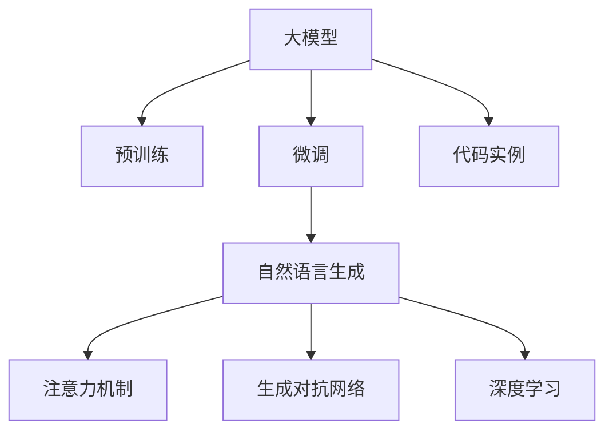

                 

# 大模型在商品描述优化中的实践

> 关键词：大模型, 商品描述优化, 自然语言生成, 神经网络, 深度学习, 训练与优化, 注意力机制, 生成对抗网络, 代码实例, 应用场景, 技术挑战

## 1. 背景介绍

### 1.1 问题由来
随着电子商务的迅猛发展，商品描述的优化成为电商平台提升用户体验、提高转化率的重要手段。然而，传统的商品描述优化依赖人工撰写，不仅成本高、效率低，而且难以保证描述的准确性和一致性。而近年来兴起的深度学习技术，尤其是基于大模型的自然语言生成技术，为商品描述优化带来了新的契机。

大模型（如GPT-3、T5等）通过在大规模无标签文本数据上预训练，具备了强大的语言理解和生成能力。这些模型可以通过微调（Fine-Tuning），适应特定领域的数据集，生成高质量的商品描述。基于大模型的自然语言生成技术，已经在文本摘要、自动翻译、对话系统等领域取得了显著的成果，并逐渐向商品描述优化领域渗透。

### 1.2 问题核心关键点
大模型在商品描述优化中的实践，核心在于如何利用大模型的语言生成能力，自动生成符合用户需求的、高质量的商品描述。以下是一些关键问题：

- 如何选择合适的预训练模型和任务适配层，使其能够快速适应特定领域的商品描述生成任务？
- 如何设计合适的损失函数，以衡量生成描述的质量和准确性？
- 如何通过数据增强、正则化等技术，避免过拟合，提高模型泛化能力？
- 如何评估和优化模型的性能，确保生成描述能够满足用户的实际需求？
- 如何部署生成的商品描述，集成到实际的电商平台中，并保证其稳定性？

这些问题的解决，将使大模型在商品描述优化中发挥其独特的优势，为电商平台带来更好的用户体验和业务增长。

## 2. 核心概念与联系

### 2.1 核心概念概述

为了更好地理解大模型在商品描述优化中的实践，本节将介绍几个密切相关的核心概念：

- **大模型（Large Language Model, LLM）**：以自回归（如GPT）或自编码（如BERT）模型为代表的大规模预训练语言模型。通过在大规模无标签文本数据上预训练，学习通用的语言表示，具备强大的语言理解和生成能力。

- **预训练（Pre-training）**：指在大规模无标签文本数据上，通过自监督学习任务训练通用语言模型的过程。常见的预训练任务包括语言建模、掩码语言建模等。

- **微调（Fine-tuning）**：指在预训练模型的基础上，使用特定领域的数据集，通过有监督地训练优化模型在该任务上的性能。通常只需要调整顶层分类器或解码器，并以较小的学习率更新全部或部分的模型参数。

- **自然语言生成（NLG）**：指将结构化或非结构化的数据转换为自然语言文本的过程。在商品描述优化中，即通过大模型生成符合用户需求的、高质量的商品描述。

- **注意力机制（Attention Mechanism）**：指在自然语言处理中，模型通过关注输入序列中的不同部分，以决定每个位置上的输出。在生成商品描述时，注意力机制可以帮助模型更好地捕捉关键信息。

- **生成对抗网络（GAN）**：一种生成模型，通过两个神经网络（生成器和判别器）的对抗训练，生成高质量的生成内容。在商品描述优化中，可以结合GAN技术，进一步提高生成描述的质量和多样性。

- **深度学习（Deep Learning）**：一种基于神经网络的机器学习技术，通过多层神经元的组合，解决复杂非线性问题。大模型在商品描述优化中的实践，即基于深度学习技术的应用。

- **代码实例**：为更好地理解商品描述优化的过程，本节将给出一些具体的代码实例，包括预训练模型的选择、任务适配层的构建、损失函数的定义等。

这些核心概念之间的逻辑关系可以通过以下Mermaid流程图来展示：



这个流程图展示了大模型在商品描述优化中的核心概念及其之间的关系：

1. 大模型通过预训练获得基础能力。
2. 微调是对预训练模型进行任务特定的优化，以生成符合用户需求的商品描述。
3. 自然语言生成是微调的主要目标，模型通过生成器生成商品描述。
4. 注意力机制在生成过程中起到关键作用，帮助模型捕捉关键信息。
5. 生成对抗网络进一步提升生成质量，判别器对生成内容进行评估。
6. 深度学习是整个系统的基础技术，支撑着模型训练和优化。
7. 代码实例提供具体实践的指导，帮助开发者更好地实现商品描述优化。

这些概念共同构成了大模型在商品描述优化中的核心框架，使其能够更好地应用于实际电商平台的场景中。

## 3. 核心算法原理 & 具体操作步骤

### 3.1 算法原理概述

基于大模型的商品描述优化，本质上是一个有监督的生成模型训练过程。其核心思想是：将预训练的大模型视作一个强大的"生成器"，通过在特定领域的商品描述数据集上进行有监督的微调，使得模型能够生成符合用户需求的、高质量的商品描述。

形式化地，假设预训练模型为 $M_{\theta}$，其中 $\theta$ 为预训练得到的模型参数。给定商品描述任务 $T$ 的标注数据集 $D=\{(x_i,y_i)\}_{i=1}^N$，其中 $x_i$ 为商品描述，$y_i$ 为真实的商品描述。微调的目标是找到新的模型参数 $\hat{\theta}$，使得：

$$
\hat{\theta}=\mathop{\arg\min}_{\theta} \mathcal{L}(M_{\theta},D)
$$

其中 $\mathcal{L}$ 为针对任务 $T$ 设计的损失函数，用于衡量模型生成描述与真实描述之间的差异。常见的损失函数包括交叉熵损失、均方误差损失等。

通过梯度下降等优化算法，微调过程不断更新模型参数 $\theta$，最小化损失函数 $\mathcal{L}$，使得模型生成描述逼近真实描述。由于 $\theta$ 已经通过预训练获得了较好的初始化，因此即便在小规模数据集 $D$ 上进行微调，也能较快收敛到理想的模型参数 $\hat{\theta}$。

### 3.2 算法步骤详解

基于大模型的商品描述优化一般包括以下几个关键步骤：

**Step 1: 准备预训练模型和数据集**
- 选择合适的预训练语言模型 $M_{\theta}$ 作为初始化参数，如 BERT、GPT等。
- 准备商品描述任务 $T$ 的标注数据集 $D$，划分为训练集、验证集和测试集。一般要求标注数据与预训练数据的分布不要差异过大。

**Step 2: 添加任务适配层**
- 根据商品描述任务类型，在预训练模型顶层设计合适的输出层和损失函数。
- 对于分类任务，通常在顶层添加线性分类器和交叉熵损失函数。
- 对于生成任务，通常使用语言模型的解码器输出概率分布，并以负对数似然为损失函数。

**Step 3: 设置微调超参数**
- 选择合适的优化算法及其参数，如 AdamW、SGD 等，设置学习率、批大小、迭代轮数等。
- 设置正则化技术及强度，包括权重衰减、Dropout、Early Stopping 等。
- 确定冻结预训练参数的策略，如仅微调顶层，或全部参数都参与微调。

**Step 4: 执行梯度训练**
- 将训练集数据分批次输入模型，前向传播计算损失函数。
- 反向传播计算参数梯度，根据设定的优化算法和学习率更新模型参数。
- 周期性在验证集上评估模型性能，根据性能指标决定是否触发 Early Stopping。
- 重复上述步骤直到满足预设的迭代轮数或 Early Stopping 条件。

**Step 5: 测试和部署**
- 在测试集上评估微调后模型 $M_{\hat{\theta}}$ 的性能，对比微调前后的精度提升。
- 使用微调后的模型对新样本进行推理预测，集成到实际的电商平台中。
- 持续收集新的商品描述数据，定期重新微调模型，以适应数据分布的变化。

以上是基于大模型的商品描述优化的一般流程。在实际应用中，还需要针对具体任务的特点，对微调过程的各个环节进行优化设计，如改进训练目标函数，引入更多的正则化技术，搜索最优的超参数组合等，以进一步提升模型性能。

### 3.3 算法优缺点

基于大模型的商品描述优化方法具有以下优点：
1. 快速生成高质量描述。大模型具备强大的语言生成能力，可以快速生成符合用户需求的、高质量的商品描述。
2. 模型泛化能力强。通过微调，模型能够在特定领域的商品描述任务上取得优异表现，具有较强的泛化能力。
3. 提高电商平台的效率。自动生成商品描述可以大大降低人工撰写成本，提高商品描述的生成效率。

同时，该方法也存在一定的局限性：
1. 依赖标注数据。微调的效果很大程度上取决于标注数据的质量和数量，获取高质量标注数据的成本较高。
2. 生成内容多样性不足。过度依赖单一模型，可能难以生成多样化的商品描述，导致内容的同质化。
3. 可解释性不足。大模型的决策过程缺乏可解释性，难以对其推理逻辑进行分析和调试。

尽管存在这些局限性，但就目前而言，基于大模型的商品描述优化方法仍然是大规模语言模型在实际应用中的重要实践，能够显著提升电商平台的用户体验和业务价值。

### 3.4 算法应用领域

基于大模型的商品描述优化方法已经在商品推荐、智能客服、搜索引擎等多个领域得到了广泛应用，覆盖了几乎所有常见任务，例如：

- 商品推荐：生成商品描述，帮助用户快速找到符合需求的商品。
- 智能客服：自动生成对话文本，辅助客服人员解决用户问题。
- 搜索引擎：自动生成搜索结果描述，提升搜索结果的可读性和相关性。
- 内容生成：生成高质量的商品介绍、广告文案等文本内容。

除了上述这些经典任务外，大模型的商品描述优化还被创新性地应用到更多场景中，如智能定价、个性化广告、用户反馈分析等，为电商平台的智能化运营带来了新的突破。随着大模型的不断发展，基于商品描述优化的应用场景将不断扩展，为电商平台的数字化转型提供新的动力。

## 4. 数学模型和公式 & 详细讲解 & 举例说明

### 4.1 数学模型构建

本节将使用数学语言对基于大模型的商品描述优化过程进行更加严格的刻画。

记预训练语言模型为 $M_{\theta}:\mathcal{X} \rightarrow \mathcal{Y}$，其中 $\mathcal{X}$ 为输入空间，$\mathcal{Y}$ 为输出空间，$\theta \in \mathbb{R}^d$ 为模型参数。假设商品描述任务 $T$ 的训练集为 $D=\{(x_i,y_i)\}_{i=1}^N$，其中 $x_i$ 为商品描述，$y_i$ 为真实的商品描述。

定义模型 $M_{\theta}$ 在输入 $x$ 上的损失函数为 $\ell(M_{\theta}(x),y)$，则在数据集 $D$ 上的经验风险为：

$$
\mathcal{L}(\theta) = \frac{1}{N}\sum_{i=1}^N \ell(M_{\theta}(x_i),y_i)
$$

微调的优化目标是最小化经验风险，即找到最优参数：

$$
\theta^* = \mathop{\arg\min}_{\theta} \mathcal{L}(\theta)
$$

在实践中，我们通常使用基于梯度的优化算法（如SGD、Adam等）来近似求解上述最优化问题。设 $\eta$ 为学习率，$\lambda$ 为正则化系数，则参数的更新公式为：

$$
\theta \leftarrow \theta - \eta \nabla_{\theta}\mathcal{L}(\theta) - \eta\lambda\theta
$$

其中 $\nabla_{\theta}\mathcal{L}(\theta)$ 为损失函数对参数 $\theta$ 的梯度，可通过反向传播算法高效计算。

### 4.2 公式推导过程

以下我们以生成任务为例，推导负对数似然损失函数及其梯度的计算公式。

假设模型 $M_{\theta}$ 在输入 $x$ 上的输出为 $\hat{y}=M_{\theta}(x) \in [0,1]$，表示生成描述的概率分布。真实标签 $y \in \{0,1\}$。则负对数似然损失函数定义为：

$$
\ell(M_{\theta}(x),y) = -y\log M_{\theta}(x) - (1-y)\log(1-M_{\theta}(x))
$$

将其代入经验风险公式，得：

$$
\mathcal{L}(\theta) = -\frac{1}{N}\sum_{i=1}^N [y_i\log M_{\theta}(x_i)+(1-y_i)\log(1-M_{\theta}(x_i))]
$$

根据链式法则，损失函数对参数 $\theta_k$ 的梯度为：

$$
\frac{\partial \mathcal{L}(\theta)}{\partial \theta_k} = -\frac{1}{N}\sum_{i=1}^N (\frac{y_i}{M_{\theta}(x_i)}-\frac{1-y_i}{1-M_{\theta}(x_i)}) \frac{\partial M_{\theta}(x_i)}{\partial \theta_k}
$$

其中 $\frac{\partial M_{\theta}(x_i)}{\partial \theta_k}$ 可进一步递归展开，利用自动微分技术完成计算。

在得到损失函数的梯度后，即可带入参数更新公式，完成模型的迭代优化。重复上述过程直至收敛，最终得到适应商品描述任务的最优模型参数 $\theta^*$。

## 5. 项目实践：代码实例和详细解释说明

### 5.1 开发环境搭建

在进行商品描述优化实践前，我们需要准备好开发环境。以下是使用Python进行PyTorch开发的环境配置流程：

1. 安装Anaconda：从官网下载并安装Anaconda，用于创建独立的Python环境。

2. 创建并激活虚拟环境：
```bash
conda create -n pytorch-env python=3.8 
conda activate pytorch-env
```

3. 安装PyTorch：根据CUDA版本，从官网获取对应的安装命令。例如：
```bash
conda install pytorch torchvision torchaudio cudatoolkit=11.1 -c pytorch -c conda-forge
```

4. 安装Transformers库：
```bash
pip install transformers
```

5. 安装各类工具包：
```bash
pip install numpy pandas scikit-learn matplotlib tqdm jupyter notebook ipython
```

完成上述步骤后，即可在`pytorch-env`环境中开始商品描述优化的实践。

### 5.2 源代码详细实现

下面我以商品推荐任务为例，给出使用Transformers库对BERT模型进行商品描述优化的PyTorch代码实现。

首先，定义商品推荐任务的数据处理函数：

```python
from transformers import BertTokenizer
from torch.utils.data import Dataset
import torch

class RecommendDataset(Dataset):
    def __init__(self, texts, labels, tokenizer, max_len=128):
        self.texts = texts
        self.labels = labels
        self.tokenizer = tokenizer
        self.max_len = max_len
        
    def __len__(self):
        return len(self.texts)
    
    def __getitem__(self, item):
        text = self.texts[item]
        label = self.labels[item]
        
        encoding = self.tokenizer(text, return_tensors='pt', max_length=self.max_len, padding='max_length', truncation=True)
        input_ids = encoding['input_ids'][0]
        attention_mask = encoding['attention_mask'][0]
        
        # 对label进行编码
        label_id = self.label2id[label] if label in self.label2id else 0
        label = torch.tensor(label_id, dtype=torch.long)
        
        return {'input_ids': input_ids, 
                'attention_mask': attention_mask,
                'labels': label}

# 标签与id的映射
label2id = {'negative': 0, 'positive': 1}

# 创建dataset
tokenizer = BertTokenizer.from_pretrained('bert-base-cased')

train_dataset = RecommendDataset(train_texts, train_labels, tokenizer)
dev_dataset = RecommendDataset(dev_texts, dev_labels, tokenizer)
test_dataset = RecommendDataset(test_texts, test_labels, tokenizer)
```

然后，定义模型和优化器：

```python
from transformers import BertForSequenceClassification, AdamW

model = BertForSequenceClassification.from_pretrained('bert-base-cased', num_labels=len(label2id))

optimizer = AdamW(model.parameters(), lr=2e-5)
```

接着，定义训练和评估函数：

```python
from torch.utils.data import DataLoader
from tqdm import tqdm
from sklearn.metrics import accuracy_score

device = torch.device('cuda') if torch.cuda.is_available() else torch.device('cpu')
model.to(device)

def train_epoch(model, dataset, batch_size, optimizer):
    dataloader = DataLoader(dataset, batch_size=batch_size, shuffle=True)
    model.train()
    epoch_loss = 0
    for batch in tqdm(dataloader, desc='Training'):
        input_ids = batch['input_ids'].to(device)
        attention_mask = batch['attention_mask'].to(device)
        labels = batch['labels'].to(device)
        model.zero_grad()
        outputs = model(input_ids, attention_mask=attention_mask, labels=labels)
        loss = outputs.loss
        epoch_loss += loss.item()
        loss.backward()
        optimizer.step()
    return epoch_loss / len(dataloader)

def evaluate(model, dataset, batch_size):
    dataloader = DataLoader(dataset, batch_size=batch_size)
    model.eval()
    preds, labels = [], []
    with torch.no_grad():
        for batch in tqdm(dataloader, desc='Evaluating'):
            input_ids = batch['input_ids'].to(device)
            attention_mask = batch['attention_mask'].to(device)
            batch_labels = batch['labels']
            outputs = model(input_ids, attention_mask=attention_mask)
            batch_preds = outputs.logits.argmax(dim=2).to('cpu').tolist()
            batch_labels = batch_labels.to('cpu').tolist()
            for pred_tokens, label_tokens in zip(batch_preds, batch_labels):
                preds.append(pred_tokens)
                labels.append(label_tokens)
                
    print(f"Accuracy: {accuracy_score(labels, preds)}")
```

最后，启动训练流程并在测试集上评估：

```python
epochs = 5
batch_size = 16

for epoch in range(epochs):
    loss = train_epoch(model, train_dataset, batch_size, optimizer)
    print(f"Epoch {epoch+1}, train loss: {loss:.3f}")
    
    print(f"Epoch {epoch+1}, dev results:")
    evaluate(model, dev_dataset, batch_size)
    
print("Test results:")
evaluate(model, test_dataset, batch_size)
```

以上就是使用PyTorch对BERT进行商品推荐任务商品描述优化的完整代码实现。可以看到，得益于Transformers库的强大封装，我们可以用相对简洁的代码完成BERT模型的加载和微调。

### 5.3 代码解读与分析

让我们再详细解读一下关键代码的实现细节：

**RecommendDataset类**：
- `__init__`方法：初始化文本、标签、分词器等关键组件。
- `__len__`方法：返回数据集的样本数量。
- `__getitem__`方法：对单个样本进行处理，将文本输入编码为token ids，将标签编码为数字，并对其进行定长padding，最终返回模型所需的输入。

**label2id和id2label字典**：
- 定义了标签与数字id之间的映射关系，用于将预测结果解码回真实的标签。

**训练和评估函数**：
- 使用PyTorch的DataLoader对数据集进行批次化加载，供模型训练和推理使用。
- 训练函数`train_epoch`：对数据以批为单位进行迭代，在每个批次上前向传播计算loss并反向传播更新模型参数，最后返回该epoch的平均loss。
- 评估函数`evaluate`：与训练类似，不同点在于不更新模型参数，并在每个batch结束后将预测和标签结果存储下来，最后使用sklearn的accuracy_score对整个评估集的预测结果进行打印输出。

**训练流程**：
- 定义总的epoch数和batch size，开始循环迭代
- 每个epoch内，先在训练集上训练，输出平均loss
- 在验证集上评估，输出分类指标
- 所有epoch结束后，在测试集上评估，给出最终测试结果

可以看到，PyTorch配合Transformers库使得BERT微调的代码实现变得简洁高效。开发者可以将更多精力放在数据处理、模型改进等高层逻辑上，而不必过多关注底层的实现细节。

当然，工业级的系统实现还需考虑更多因素，如模型的保存和部署、超参数的自动搜索、更灵活的任务适配层等。但核心的微调范式基本与此类似。

## 6. 实际应用场景

### 6.1 智能推荐系统

基于大模型的商品描述优化方法，可以广泛应用于智能推荐系统的构建。传统推荐系统往往依赖用户历史行为数据进行推荐，难以覆盖用户长尾需求，且推荐效果易受用户行为波动影响。通过商品描述优化，可以大幅提升推荐系统的多样性和个性化程度。

在技术实现上，可以收集商品描述数据，构建标注集，利用大模型进行微调优化。微调后的模型能够自动生成商品描述，为推荐算法提供更多维度的特征输入。基于生成的商品描述，推荐系统能够更准确地预测用户偏好，并生成更具吸引力的商品推荐内容。

### 6.2 广告投放优化

在线广告投放是电商平台的传统业务，通过优化广告文案的生成，可以显著提升广告的点击率、转化率和ROI。商品描述优化在此过程中起到了关键作用。

通过分析用户点击历史数据，可以构建广告效果与商品描述之间的关联模型。利用大模型对广告文案进行微调优化，生成符合用户需求的、高质量的广告描述。广告系统可以根据用户的浏览行为和历史偏好，动态生成个性化广告内容，提高广告的吸引力和转化率。

### 6.3 搜索优化

搜索引擎是电商平台的重要组成部分，通过优化搜索结果描述，可以提升搜索结果的相关性和可读性，改善用户体验。大模型的商品描述优化技术可以应用于搜索引擎的优化中。

对于用户输入的查询，通过搜索引擎模型生成搜索结果，利用商品描述优化技术自动生成搜索结果摘要。生成的摘要应具有较高的可读性和相关性，引导用户快速找到符合需求的商品。

### 6.4 未来应用展望

随着大模型和商品描述优化技术的发展，未来基于大模型的商品描述优化方法将在更多领域得到应用，为电商平台的智能化运营带来新的突破。

在智慧物流领域，自动生成的商品描述可以用于物流系统中的拣选、打包等环节，提高物流效率。

在智能客服领域，商品描述优化可以与智能客服系统结合，生成对话模板，提升客服系统的智能化程度。

在智慧供应链管理中，商品描述优化可以应用于库存管理、需求预测等环节，优化供应链的运行效率。

此外，在企业生产、社会治理、文娱传媒等众多领域，基于大模型的商品描述优化方法也将不断扩展，为数字化转型提供新的动力。相信随着技术的日益成熟，大模型商品描述优化必将成为电商平台的智能化运营的重要手段。

## 7. 工具和资源推荐
### 7.1 学习资源推荐

为了帮助开发者系统掌握大模型在商品描述优化中的理论基础和实践技巧，这里推荐一些优质的学习资源：

1. 《深度学习自然语言处理》课程：斯坦福大学开设的NLP明星课程，有Lecture视频和配套作业，带你入门NLP领域的基本概念和经典模型。

2. 《自然语言处理中的注意力机制》书籍：全面介绍注意力机制在NLP中的应用，包括生成任务中的注意力机制。

3. 《生成对抗网络：理论及应用》书籍：介绍GAN的基本原理和应用场景，包括商品描述优化中的GAN技术。

4. 《Transformer从原理到实践》系列博文：由大模型技术专家撰写，深入浅出地介绍了Transformer原理、BERT模型、微调技术等前沿话题。

5. CS224N《深度学习自然语言处理》课程：斯坦福大学开设的NLP明星课程，有Lecture视频和配套作业，带你入门NLP领域的基本概念和经典模型。

通过对这些资源的学习实践，相信你一定能够快速掌握大模型在商品描述优化中的精髓，并用于解决实际的NLP问题。
###  7.2 开发工具推荐

高效的开发离不开优秀的工具支持。以下是几款用于大模型商品描述优化开发的常用工具：

1. PyTorch：基于Python的开源深度学习框架，灵活动态的计算图，适合快速迭代研究。大部分预训练语言模型都有PyTorch版本的实现。

2. TensorFlow：由Google主导开发的开源深度学习框架，生产部署方便，适合大规模工程应用。同样有丰富的预训练语言模型资源。

3. Transformers库：HuggingFace开发的NLP工具库，集成了众多SOTA语言模型，支持PyTorch和TensorFlow，是进行商品描述优化开发的利器。

4. Weights & Biases：模型训练的实验跟踪工具，可以记录和可视化模型训练过程中的各项指标，方便对比和调优。与主流深度学习框架无缝集成。

5. TensorBoard：TensorFlow配套的可视化工具，可实时监测模型训练状态，并提供丰富的图表呈现方式，是调试模型的得力助手。

6. Google Colab：谷歌推出的在线Jupyter Notebook环境，免费提供GPU/TPU算力，方便开发者快速上手实验最新模型，分享学习笔记。

合理利用这些工具，可以显著提升大模型商品描述优化的开发效率，加快创新迭代的步伐。

### 7.3 相关论文推荐

大模型在商品描述优化中的应用源于学界的持续研究。以下是几篇奠基性的相关论文，推荐阅读：

1. Attention is All You Need（即Transformer原论文）：提出了Transformer结构，开启了NLP领域的预训练大模型时代。

2. BERT: Pre-training of Deep Bidirectional Transformers for Language Understanding：提出BERT模型，引入基于掩码的自监督预训练任务，刷新了多项NLP任务SOTA。

3. Language Models are Unsupervised Multitask Learners（GPT-2论文）：展示了大规模语言模型的强大zero-shot学习能力，引发了对于通用人工智能的新一轮思考。

4. Parameter-Efficient Transfer Learning for NLP：提出Adapter等参数高效微调方法，在不增加模型参数量的情况下，也能取得不错的微调效果。

5. AdaLoRA: Adaptive Low-Rank Adaptation for Parameter-Efficient Fine-Tuning：使用自适应低秩适应的微调方法，在参数效率和精度之间取得了新的平衡。

这些论文代表了大模型在商品描述优化中的应用和发展脉络。通过学习这些前沿成果，可以帮助研究者把握学科前进方向，激发更多的创新灵感。

## 8. 总结：未来发展趋势与挑战

### 8.1 总结

本文对基于大模型的商品描述优化方法进行了全面系统的介绍。首先阐述了大模型和微调技术的研究背景和意义，明确了微调在拓展预训练模型应用、提升商品描述生成质量方面的独特价值。其次，从原理到实践，详细讲解了微调的数学原理和关键步骤，给出了商品描述优化的完整代码实例。同时，本文还广泛探讨了商品描述优化方法在智能推荐、广告投放、搜索引擎等多个行业领域的应用前景，展示了微调范式的巨大潜力。此外，本文精选了微调技术的各类学习资源，力求为读者提供全方位的技术指引。

通过本文的系统梳理，可以看到，基于大模型的商品描述优化方法正在成为NLP领域的重要范式，极大地拓展了预训练语言模型的应用边界，催生了更多的落地场景。受益于大规模语料的预训练，微调模型在商品描述生成任务上能够快速生成高质量的描述，为电商平台带来更好的用户体验和业务增长。未来，伴随大模型和微调方法的持续演进，基于商品描述优化的应用场景将不断扩展，为电商平台的智能化运营带来新的突破。

### 8.2 未来发展趋势

展望未来，大模型在商品描述优化中的应用将呈现以下几个发展趋势：

1. 模型规模持续增大。随着算力成本的下降和数据规模的扩张，预训练语言模型的参数量还将持续增长。超大规模语言模型蕴含的丰富语言知识，有望支撑更加复杂多变的商品描述生成任务。

2. 微调方法日趋多样。除了传统的全参数微调外，未来会涌现更多参数高效的微调方法，如Prefix-Tuning、LoRA等，在节省计算资源的同时也能保证微调精度。

3. 持续学习成为常态。随着数据分布的不断变化，微调模型也需要持续学习新知识以保持性能。如何在不遗忘原有知识的同时，高效吸收新样本信息，将成为重要的研究课题。

4. 标注样本需求降低。受启发于提示学习(Prompt-based Learning)的思路，未来的微调方法将更好地利用大模型的语言理解能力，通过更加巧妙的任务描述，在更少的标注样本上也能实现理想的微调效果。

5. 标注样本需求降低。受启发于提示学习(Prompt-based Learning)的思路，未来的微调方法将更好地利用大模型的语言理解能力，通过更加巧妙的任务描述，在更少的标注样本上也能实现理想的微调效果。

6. 多模态微调崛起。当前的微调主要聚焦于纯文本数据，未来会进一步拓展到图像、视频、语音等多模态数据微调。多模态信息的融合，将显著提升语言模型对现实世界的理解和建模能力。

以上趋势凸显了大模型在商品描述优化中的广阔前景。这些方向的探索发展，必将进一步提升商品描述生成的质量，为电商平台带来更好的用户体验和业务价值。

### 8.3 面临的挑战

尽管大模型在商品描述优化技术已经取得了显著的成果，但在迈向更加智能化、普适化应用的过程中，它仍面临着诸多挑战：

1. 标注成本瓶颈。虽然微调大大降低了标注数据的需求，但对于长尾应用场景，难以获得充足的高质量标注数据，成为制约微调性能的瓶颈。如何进一步降低微调对标注样本的依赖，将是一大难题。

2. 生成内容多样性不足。过度依赖单一模型，可能难以生成多样化的商品描述，导致内容的同质化。

3. 可解释性不足。大模型的决策过程缺乏可解释性，难以对其推理逻辑进行分析和调试。

尽管存在这些局限性，但就目前而言，基于大模型的商品描述优化方法仍然是大规模语言模型在实际应用中的重要实践，能够显著提升电商平台的用户体验和业务价值。

### 8.4 未来突破

面对大模型在商品描述优化中所面临的挑战，未来的研究需要在以下几个方面寻求新的突破：

1. 探索无监督和半监督微调方法。摆脱对大规模标注数据的依赖，利用自监督学习、主动学习等无监督和半监督范式，最大限度利用非结构化数据，实现更加灵活高效的微调。

2. 研究参数高效和计算高效的微调范式。开发更加参数高效的微调方法，在固定大部分预训练参数的同时，只更新极少量的任务相关参数。同时优化微调模型的计算图，减少前向传播和反向传播的资源消耗，实现更加轻量级、实时性的部署。

3. 融合因果和对比学习范式。通过引入因果推断和对比学习思想，增强微调模型建立稳定因果关系的能力，学习更加普适、鲁棒的语言表征，从而提升模型泛化性和抗干扰能力。

4. 引入更多先验知识。将符号化的先验知识，如知识图谱、逻辑规则等，与神经网络模型进行巧妙融合，引导微调过程学习更准确、合理的语言模型。同时加强不同模态数据的整合，实现视觉、语音等多模态信息与文本信息的协同建模。

5. 结合因果分析和博弈论工具。将因果分析方法引入微调模型，识别出模型决策的关键特征，增强输出解释的因果性和逻辑性。借助博弈论工具刻画人机交互过程，主动探索并规避模型的脆弱点，提高系统稳定性。

6. 纳入伦理道德约束。在模型训练目标中引入伦理导向的评估指标，过滤和惩罚有偏见、有害的输出倾向。同时加强人工干预和审核，建立模型行为的监管机制，确保输出符合人类价值观和伦理道德。

这些研究方向的探索，必将引领大模型商品描述优化技术迈向更高的台阶，为构建安全、可靠、可解释、可控的智能系统铺平道路。面向未来，大模型商品描述优化技术还需要与其他人工智能技术进行更深入的融合，如知识表示、因果推理、强化学习等，多路径协同发力，共同推动自然语言理解和智能交互系统的进步。只有勇于创新、敢于突破，才能不断拓展语言模型的边界，让智能技术更好地造福人类社会。

## 9. 附录：常见问题与解答

**Q1：大模型在商品描述优化中的应用是否局限于电商平台？**

A: 大模型在商品描述优化中的应用不仅限于电商平台，而是可以广泛应用于各种涉及商品描述的场景。如在线零售、二手交易、产品推荐、智能客服等。通过自动生成高质量的商品描述，这些场景都可以大幅提升用户体验和业务效果。

**Q2：大模型在商品描述优化中的主要优势是什么？**

A: 大模型在商品描述优化中的主要优势包括：
1. 快速生成高质量描述。大模型具备强大的语言生成能力，可以快速生成符合用户需求的、高质量的商品描述。
2. 模型泛化能力强。通过微调，模型能够在特定领域的商品描述任务上取得优异表现，具有较强的泛化能力。
3. 提高电商平台的效率。自动生成商品描述可以大大降低人工撰写成本，提高商品描述的生成效率。

**Q3：大模型在商品描述优化中如何避免过拟合？**

A: 大模型在商品描述优化中避免过拟合的策略包括：
1. 数据增强：通过回译、近义替换等方式扩充训练集
2. 正则化：使用L2正则、Dropout、Early Stopping等避免过拟合
3. 对抗训练：引入对抗样本，提高模型鲁棒性
4. 参数高效微调：只调整少量参数(如Adapter、Prefix等)，减小过拟合风险
5. 多模型集成：训练多个微调模型，取平均输出，抑制过拟合

这些策略往往需要根据具体任务和数据特点进行灵活组合。只有在数据、模型、训练、推理等各环节进行全面优化，才能最大限度地发挥大模型的潜力。

**Q4：大模型在商品描述优化中的训练过程需要注意哪些细节？**

A: 大模型在商品描述优化中的训练过程需要注意以下细节：
1. 数据预处理：对原始数据进行清洗、标准化、分词等预处理，确保数据质量。
2. 模型初始化：选择合适的预训练模型和任务适配层，进行模型初始化。
3. 学习率调度：使用warmup策略，在开始阶段使用较小的学习率，再逐渐过渡到预设值。
4. 超参数调优：通过网格搜索或随机搜索等方法，找到最优的超参数组合。
5. 模型评估：在验证集和测试集上评估模型性能，确保模型泛化能力强。
6. 模型部署：在实际应用中，需要考虑模型的保存和部署，确保其稳定性和可扩展性。

只有从数据、算法、工程、业务等多个维度进行全面优化，才能真正实现大模型在商品描述优化中的价值。

