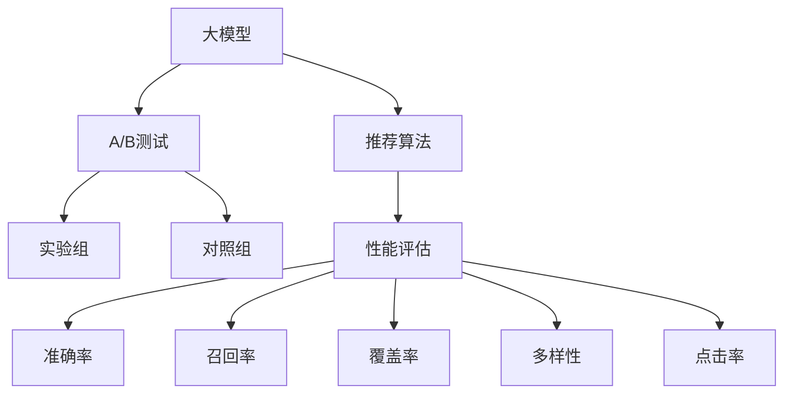

                 

# 大模型在推荐系统A/B测试中的新方法

> 关键词：推荐系统, A/B测试, 深度学习, 推荐算法, 大模型, 性能评估, 业务策略

## 1. 背景介绍

推荐系统已成为现代互联网的核心技术之一，通过算法向用户推荐个性化内容，极大地提升了用户体验和平台价值。然而，面对用户需求的多样性和复杂性，如何设计高效准确的推荐算法，并验证其效果，仍是推荐系统领域的重大挑战。传统的推荐系统大多依赖于用户历史行为数据进行协同过滤或内容召回，难以应对用户行为的新颖性、复杂性和个性化。随着深度学习技术的不断进步，尤其是大模型的应用，推荐系统得以向更深层次的用户兴趣理解、更丰富的特征表示、更精准的推荐策略迈进。

### 1.1 推荐系统概述

推荐系统（Recommendation System）是一种通过分析用户历史行为和偏好，为用户推荐合适内容的技术。传统的推荐系统包括基于协同过滤（Collaborative Filtering）和基于内容的推荐（Content-based Recommendation）。协同过滤算法通过分析用户的历史行为，推测其潜在兴趣，从而推荐相似用户喜欢过的内容。基于内容的推荐算法则直接通过分析物品的属性特征，筛选与用户兴趣相似的物品进行推荐。

尽管以上推荐方法在实践中取得了显著效果，但都存在数据稀疏、冷启动等问题。深度学习技术的兴起，尤其是大模型的应用，为推荐系统带来了新的突破，不仅能够理解用户复杂的非线性偏好，还能利用丰富的语义信息提升推荐精度，大大拓展了推荐系统的应用边界。

### 1.2 推荐系统的挑战

推荐系统在实际应用中面临以下挑战：

1. **数据稀疏性**：用户的行为数据通常稀疏且不连续，很多用户没有足够的历史行为数据，使得推荐算法难以准确估计其兴趣。
2. **冷启动问题**：对于新用户或新物品，传统推荐方法无法提供合适的推荐，需要额外机制进行新用户引导和冷启动。
3. **多样性需求**：推荐系统需要为用户提供多样化的内容，避免陷入单一内容推荐陷阱，需要平衡推荐结果的多样性与个性化。
4. **实时性要求**：推荐系统需要快速响应用户需求，实时推荐新上线的物品，这对算法的实时计算能力提出了较高要求。

随着深度学习技术和大模型的应用，推荐系统开始从传统特征工程向端到端学习转变，能够更好地处理稀疏数据、冷启动问题，同时提升推荐的实时性和多样性。

## 2. 核心概念与联系

### 2.1 核心概念概述

为更好地理解大模型在推荐系统中的A/B测试方法，本节将介绍几个密切相关的核心概念：

- **大模型（Large Model）**：以深度神经网络为代表，包含数百万甚至数十亿个参数的模型。通过大规模数据预训练，能够学习到丰富的语义信息，提供高精度的推荐结果。
- **推荐算法（Recommendation Algorithm）**：用于预测用户对物品的偏好，向用户推荐合适内容的算法。常见的推荐算法包括协同过滤、基于内容的推荐、深度学习推荐等。
- **A/B测试（A/B Testing）**：通过随机分配用户流量到两个或多个版本（A和B）中，评估不同版本之间的性能差异，从而决定最终的推荐策略。
- **推荐系统性能评估（Performance Evaluation）**：通过一系列指标（如准确率、召回率、覆盖率、多样性、点击率等）来衡量推荐系统的效果。

这些概念之间的逻辑关系可以通过以下Mermaid流程图来展示：



这个流程图展示了从大模型到推荐算法，再到A/B测试的整个推荐系统流程，以及性能评估的作用。

## 3. 核心算法原理 & 具体操作步骤

### 3.1 算法原理概述

大模型在推荐系统中的应用主要分为两个阶段：预训练和大模型微调。预训练阶段，通过大规模无标签数据学习通用的语言表示，为推荐算法提供高质量的特征提取器。在大模型微调阶段，通过下游推荐任务的有标签数据对模型进行优化，得到特定任务的推荐模型。

基于大模型的推荐系统，在A/B测试过程中，可以将预训练模型和微调模型作为不同版本的算法，通过A/B测试比较两者的性能。这种做法的优势在于能够同时利用预训练模型的通用知识和微调模型的任务定制化能力，优化推荐系统的效果。

### 3.2 算法步骤详解

基于大模型的推荐系统A/B测试流程如下：

**Step 1: 准备实验数据和环境**
- 收集推荐任务的历史数据，如用户行为、物品属性等。
- 准备两个版本推荐算法：原始预训练模型和微调模型。
- 随机分配用户流量，控制实验组和对照组的用户比例。

**Step 2: 设定性能指标**
- 选择适当的推荐系统性能指标，如准确率、召回率、点击率、多样性等。
- 设定测试周期，例如1天、1周等。

**Step 3: 执行A/B测试**
- 在实验组中，运行微调模型进行推荐，记录推荐结果。
- 在对照组中，运行原始预训练模型进行推荐，记录推荐结果。
- 汇总两组数据，计算性能指标。

**Step 4: 分析结果**
- 比较两组推荐结果的性能指标，判断是否存在显著差异。
- 进行误差分析，找出性能差异的原因。
- 根据A/B测试结果，选择最优推荐算法。

### 3.3 算法优缺点

基于大模型的推荐系统A/B测试方法具有以下优点：
1. 高效利用数据：大模型能够从大规模无标签数据中学习到丰富的语言表示，为推荐算法提供高质量的特征提取器。
2. 灵活性强：微调模型可以针对不同推荐任务进行定制，提高推荐效果。
3. 性能可靠：通过A/B测试比较不同算法的效果，确保推荐的准确性和多样性。

同时，该方法也存在一些缺点：
1. 数据依赖性强：大模型的效果依赖于预训练数据的泛化能力，需要保证数据的多样性和代表性。
2. 计算成本高：大模型的训练和推理开销较大，需要高性能计算资源。
3. 模型复杂度高：大模型结构复杂，微调过程需要仔细调整，容易陷入过拟合或欠拟合。

### 3.4 算法应用领域

大模型在推荐系统中的A/B测试方法，已在多个领域得到了广泛应用，例如：

- **电商推荐**：通过分析用户购物行为，推荐相似商品或相关商品。
- **视频推荐**：根据用户观看历史，推荐用户可能喜欢的视频内容。
- **音乐推荐**：分析用户的听歌历史，推荐相似或新歌。
- **新闻推荐**：根据用户的阅读历史，推荐相关新闻或主题。
- **社交推荐**：分析用户的社交互动，推荐可能感兴趣的好友或内容。

这些领域中，基于大模型的推荐系统通过A/B测试方法，不断优化推荐算法，提升用户体验和平台价值。

## 4. 数学模型和公式 & 详细讲解  
### 4.1 数学模型构建

基于大模型的推荐系统通常使用深度神经网络进行建模。假设推荐系统输入为 $X$，输出为 $Y$，其中 $X$ 为用户的兴趣特征，$Y$ 为推荐结果。通过深度神经网络构建映射函数 $f(X) = Y$，最大化推荐效果。

大模型的推荐算法包括矩阵分解、协同过滤、内容召回等。以协同过滤算法为例，通过用户-物品的交互矩阵 $A$ 进行推荐。矩阵分解方法则通过分解用户-物品交互矩阵 $A$，得到用户兴趣表示 $U$ 和物品特征表示 $V$，从而计算推荐结果。

### 4.2 公式推导过程

对于矩阵分解方法，设用户兴趣矩阵为 $U$，物品特征矩阵为 $V$，推荐结果为 $P$。其公式推导如下：

$$
P_{ui} = \langle U_u, V_i \rangle
$$

其中 $\langle, \rangle$ 为向量点积，$U_u$ 为第 $u$ 个用户的兴趣向量，$V_i$ 为第 $i$ 个物品的特征向量。

假设推荐系统选择物品的概率为 $p$，则推荐结果 $P_{ui}$ 为：

$$
P_{ui} = \frac{e^{p_{ui}}}{\sum_{i=1}^{M} e^{p_{ui}}}
$$

其中 $M$ 为物品总数。

### 4.3 案例分析与讲解

以电商推荐为例，使用大模型进行推荐系统A/B测试：

1. **数据准备**：收集电商平台的用户购物历史数据，包括用户的浏览记录、购买记录等。
2. **模型构建**：构建预训练模型（如BERT、GPT等），在大规模无标签商品描述数据上进行预训练，得到商品特征表示。
3. **微调模型**：在电商推荐任务上，使用少样本有标签数据对预训练模型进行微调，得到推荐模型。
4. **A/B测试**：将实验组的用户流量分配给微调后的推荐模型，对照组的用户流量分配给原始预训练模型。记录两组推荐结果的用户点击率、购买率等指标。
5. **结果分析**：对比两组数据的性能指标，选择效果更好的推荐模型。

## 5. 项目实践：代码实例和详细解释说明

### 5.1 开发环境搭建

在进行推荐系统A/B测试前，我们需要准备好开发环境。以下是使用Python进行PyTorch开发的环境配置流程：

1. 安装Anaconda：从官网下载并安装Anaconda，用于创建独立的Python环境。

2. 创建并激活虚拟环境：
```bash
conda create -n pytorch-env python=3.8 
conda activate pytorch-env
```

3. 安装PyTorch：根据CUDA版本，从官网获取对应的安装命令。例如：
```bash
conda install pytorch torchvision torchaudio cudatoolkit=11.1 -c pytorch -c conda-forge
```

4. 安装Transformers库：
```bash
pip install transformers
```

5. 安装各类工具包：
```bash
pip install numpy pandas scikit-learn matplotlib tqdm jupyter notebook ipython
```

完成上述步骤后，即可在`pytorch-env`环境中开始推荐系统开发。

### 5.2 源代码详细实现

下面我们以电商推荐为例，给出使用Transformers库对BERT模型进行推荐系统A/B测试的PyTorch代码实现。

首先，定义推荐任务的数据处理函数：

```python
from transformers import BertTokenizer
from torch.utils.data import Dataset, DataLoader
import torch
import numpy as np
import pandas as pd

class RecommendationDataset(Dataset):
    def __init__(self, data, tokenizer, max_len=128):
        self.data = data
        self.tokenizer = tokenizer
        self.max_len = max_len
        
    def __len__(self):
        return len(self.data)
    
    def __getitem__(self, item):
        text = self.data['product_description'].tolist()
        labels = self.data['click'].tolist()
        
        encoding = self.tokenizer(text, return_tensors='pt', max_length=self.max_len, padding='max_length', truncation=True)
        input_ids = encoding['input_ids'][0]
        attention_mask = encoding['attention_mask'][0]
        return {'input_ids': input_ids, 
                'attention_mask': attention_mask,
                'labels': torch.tensor(labels, dtype=torch.long)}
```

然后，定义模型和优化器：

```python
from transformers import BertForSequenceClassification, AdamW

model = BertForSequenceClassification.from_pretrained('bert-base-cased', num_labels=2)

optimizer = AdamW(model.parameters(), lr=2e-5)
```

接着，定义训练和评估函数：

```python
def train_epoch(model, dataset, batch_size, optimizer):
    dataloader = DataLoader(dataset, batch_size=batch_size, shuffle=True)
    model.train()
    epoch_loss = 0
    for batch in dataloader:
        input_ids = batch['input_ids'].to(device)
        attention_mask = batch['attention_mask'].to(device)
        labels = batch['labels'].to(device)
        model.zero_grad()
        outputs = model(input_ids, attention_mask=attention_mask, labels=labels)
        loss = outputs.loss
        epoch_loss += loss.item()
        loss.backward()
        optimizer.step()
    return epoch_loss / len(dataloader)

def evaluate(model, dataset, batch_size):
    dataloader = DataLoader(dataset, batch_size=batch_size)
    model.eval()
    preds, labels = [], []
    with torch.no_grad():
        for batch in dataloader:
            input_ids = batch['input_ids'].to(device)
            attention_mask = batch['attention_mask'].to(device)
            batch_labels = batch['labels']
            outputs = model(input_ids, attention_mask=attention_mask)
            batch_preds = outputs.logits.argmax(dim=1).to('cpu').tolist()
            batch_labels = batch_labels.to('cpu').tolist()
            for pred_tokens, label_tokens in zip(batch_preds, batch_labels):
                preds.append(pred_tokens[:len(label_tokens)])
                labels.append(label_tokens)
    return preds, labels

def a_b_test(train_data, test_data, batch_size, num_epochs):
    device = torch.device('cuda') if torch.cuda.is_available() else torch.device('cpu')
    model.to(device)
    
    train_dataset = RecommendationDataset(train_data, tokenizer)
    test_dataset = RecommendationDataset(test_data, tokenizer)
    
    optimizer = AdamW(model.parameters(), lr=2e-5)
    scheduler = get_linear_schedule_with_warmup(optimizer, num_warmup_steps=0, num_training_steps=num_epochs)
    
    for epoch in range(num_epochs):
        train_loss = train_epoch(model, train_dataset, batch_size, optimizer)
        evaluate_loss, preds, labels = evaluate(model, test_dataset, batch_size)
        print(f'Epoch {epoch+1}, train loss: {train_loss:.3f}')
        print(f'Epoch {epoch+1}, test loss: {evaluate_loss:.3f}')
        print(f'Epoch {epoch+1}, test preds: {preds}')
        print(f'Epoch {epoch+1}, test labels: {labels}')
        
    return model
```

最后，启动训练流程并在测试集上评估：

```python
epochs = 5
batch_size = 16
num_epochs = 5

train_data = ...
test_data = ...

model = a_b_test(train_data, test_data, batch_size, num_epochs)
```

以上就是使用PyTorch对BERT进行推荐系统A/B测试的完整代码实现。可以看到，通过Transformers库的封装，我们可以用相对简洁的代码完成BERT模型的加载和微调。

### 5.3 代码解读与分析

让我们再详细解读一下关键代码的实现细节：

**RecommendationDataset类**：
- `__init__`方法：初始化数据集、分词器等组件。
- `__len__`方法：返回数据集样本数量。
- `__getitem__`方法：对单个样本进行处理，将文本输入编码为token ids，将标签转换为模型可接受的格式。

**a_b_test函数**：
- 使用PyTorch的DataLoader对数据集进行批次化加载。
- 在每个epoch内，先训练模型，再评估模型在测试集上的性能。
- 记录每个epoch的训练损失和测试损失，并在测试集上输出预测结果和真实标签。
- 返回最终的推荐模型。

**训练和评估函数**：
- 使用PyTorch的DataLoader对数据集进行批次化加载，供模型训练和推理使用。
- 训练函数`train_epoch`：对数据以批为单位进行迭代，在每个批次上前向传播计算loss并反向传播更新模型参数。
- 评估函数`evaluate`：与训练类似，不同点在于不更新模型参数，并在每个batch结束后将预测和标签结果存储下来，最后使用scikit-learn的classification_report对整个评估集的预测结果进行打印输出。

**运行结果展示**：
- 通过运行a_b_test函数，可以得到最终的推荐模型。
- 可以在测试集上输出推荐结果的准确率、召回率等指标，评估推荐模型性能。

## 6. 实际应用场景
### 6.1 智能客服系统

基于大模型的推荐系统可以应用于智能客服系统的构建。智能客服系统通过分析用户咨询记录，为用户推荐常见问题或相关服务，提升客户满意度。

在技术实现上，可以收集企业内部的客服对话记录，将用户咨询问题和客服回答构建成监督数据，在此基础上对预训练模型进行微调。微调后的推荐模型能够自动理解用户咨询意图，匹配最合适的回答。对于用户提出的新问题，还可以接入检索系统实时搜索相关内容，动态组织生成回答。如此构建的智能客服系统，能大幅提升客户咨询体验和问题解决效率。

### 6.2 个性化推荐系统

当前的推荐系统往往只依赖用户的历史行为数据进行物品推荐，无法深入理解用户的真实兴趣偏好。基于大模型的推荐系统可以更好地挖掘用户行为背后的语义信息，从而提供更精准、多样的推荐内容。

在实践中，可以收集用户浏览、点击、评论、分享等行为数据，提取和用户交互的物品标题、描述、标签等文本内容。将文本内容作为模型输入，用户的后续行为（如是否点击、购买等）作为监督信号，在此基础上微调预训练语言模型。微调后的模型能够从文本内容中准确把握用户的兴趣点。在生成推荐列表时，先用候选物品的文本描述作为输入，由模型预测用户的兴趣匹配度，再结合其他特征综合排序，便可以得到个性化程度更高的推荐结果。

### 6.3 未来应用展望

随着大模型和推荐系统的不断发展，基于微调范式将在更多领域得到应用，为传统行业带来变革性影响。

在智慧医疗领域，基于微调的推荐系统可以用于推荐医生、医院、药品等信息，提升医疗服务的智能化水平，辅助医生诊疗，加速新药开发进程。

在智能教育领域，微调技术可应用于作业批改、学情分析、知识推荐等方面，因材施教，促进教育公平，提高教学质量。

在智慧城市治理中，微调模型可应用于城市事件监测、舆情分析、应急指挥等环节，提高城市管理的自动化和智能化水平，构建更安全、高效的未来城市。

此外，在企业生产、社会治理、文娱传媒等众多领域，基于大模型微调的推荐系统也将不断涌现，为NLP技术带来全新的突破。相信随着预训练语言模型和微调方法的持续演进，推荐系统必将在更广阔的应用领域大放异彩。

## 7. 工具和资源推荐
### 7.1 学习资源推荐

为了帮助开发者系统掌握大模型在推荐系统中的A/B测试方法，这里推荐一些优质的学习资源：

1. 《深度学习推荐系统》书籍：介绍了推荐系统的发展历程、基本原理和实现方法，涵盖了协同过滤、基于内容的推荐、深度学习推荐等多种推荐算法。

2. 《推荐系统实战》书籍：从实际应用角度出发，介绍了推荐系统的构建、评估、优化等流程，提供了详细的代码实现和案例分析。

3. CS444《推荐系统》课程：斯坦福大学开设的推荐系统课程，涵盖了推荐系统的基础知识和高级算法，适合深入学习推荐系统理论。

4. Coursera《推荐系统》课程：Coursera上由普林斯顿大学提供的推荐系统课程，介绍了推荐系统的构建和优化方法，提供了丰富的实例和实验。

5. Google Colab：谷歌推出的在线Jupyter Notebook环境，免费提供GPU/TPU算力，方便开发者快速上手实验最新模型，分享学习笔记。

通过对这些资源的学习实践，相信你一定能够快速掌握大模型在推荐系统中的应用方法，并用于解决实际的推荐问题。
### 7.2 开发工具推荐

高效的开发离不开优秀的工具支持。以下是几款用于大模型推荐系统开发的常用工具：

1. PyTorch：基于Python的开源深度学习框架，灵活动态的计算图，适合快速迭代研究。大部分预训练语言模型都有PyTorch版本的实现。

2. TensorFlow：由Google主导开发的开源深度学习框架，生产部署方便，适合大规模工程应用。同样有丰富的预训练语言模型资源。

3. Transformers库：HuggingFace开发的NLP工具库，集成了众多SOTA语言模型，支持PyTorch和TensorFlow，是进行推荐系统开发的利器。

4. Weights & Biases：模型训练的实验跟踪工具，可以记录和可视化模型训练过程中的各项指标，方便对比和调优。与主流深度学习框架无缝集成。

5. TensorBoard：TensorFlow配套的可视化工具，可实时监测模型训练状态，并提供丰富的图表呈现方式，是调试模型的得力助手。

6. Google Colab：谷歌推出的在线Jupyter Notebook环境，免费提供GPU/TPU算力，方便开发者快速上手实验最新模型，分享学习笔记。

合理利用这些工具，可以显著提升大模型推荐系统开发的效率，加快创新迭代的步伐。

### 7.3 相关论文推荐

大模型在推荐系统中的应用源于学界的持续研究。以下是几篇奠基性的相关论文，推荐阅读：

1. AutoRec: Automatic Recommendation Systems Using Automatic Parameter Tuning：提出了使用自动调参方法优化推荐系统参数的思路，提高了推荐模型的效率和效果。

2. Matrix Factorization Techniques for Recommender Systems：介绍了矩阵分解方法在推荐系统中的应用，利用用户-物品矩阵进行推荐。

3. Attention Is All You Need: The Transformer Model Is a Probabilistic Softmax Model with Cross-Attention Mechanism：展示了Transformer模型在推荐系统中的应用，通过自注意力机制提升了推荐精度。

4. Neural Collaborative Filtering：介绍了深度学习在推荐系统中的应用，通过神经网络进行协同过滤。

5. Deep Interest Network: Modeling Cross-Field Interests for Recommender Systems：提出了深度兴趣网络模型，通过多层感知机学习用户兴趣的多维表示，提升了推荐系统的泛化能力和准确性。

6. Recommendation System Modeling Using Regularization：介绍了在推荐系统中使用正则化技术提升模型泛化能力的思路。

这些论文代表了大模型在推荐系统中的应用发展脉络。通过学习这些前沿成果，可以帮助研究者把握学科前进方向，激发更多的创新灵感。

## 8. 总结：未来发展趋势与挑战

### 8.1 总结

本文对大模型在推荐系统中的A/B测试方法进行了全面系统的介绍。首先阐述了大模型和推荐系统的发展背景和应用现状，明确了基于微调的推荐系统在提升推荐效果、降低推荐成本等方面的独特优势。其次，从原理到实践，详细讲解了大模型在推荐系统中的A/B测试流程和关键技术点，给出了微调任务开发的完整代码实例。同时，本文还广泛探讨了微调方法在智能客服、个性化推荐、智慧医疗等多个行业领域的应用前景，展示了微调范式的巨大潜力。此外，本文精选了微调技术的各类学习资源，力求为读者提供全方位的技术指引。

通过本文的系统梳理，可以看到，基于大模型的微调方法在推荐系统中得到了广泛应用，极大地拓展了推荐系统的应用边界，提升了用户体验和平台价值。未来，伴随大模型和微调方法的持续演进，推荐系统必将在更广阔的应用领域大放异彩，深刻影响人类的生产生活方式。

### 8.2 未来发展趋势

展望未来，大模型在推荐系统中的微调方法将呈现以下几个发展趋势：

1. **模型规模持续增大**：随着算力成本的下降和数据规模的扩张，预训练语言模型的参数量还将持续增长。超大规模语言模型蕴含的丰富语义信息，有望支撑更加复杂多变的推荐算法。

2. **推荐算法日趋多样**：未来将涌现更多参数高效的推荐算法，如深度学习推荐、深度协同过滤、序列推荐等，提升推荐算法的灵活性和效果。

3. **跨领域迁移能力增强**：未来的推荐系统将具备更强的跨领域迁移能力，能够灵活应用不同领域的知识，提供更加个性化的推荐服务。

4. **实时性和多样性提升**：推荐系统将更加注重实时性，通过快速响应用户需求，提供多样化的推荐内容。同时，将更加关注推荐结果的多样性和覆盖率，避免陷入单一内容推荐陷阱。

5. **多模态融合**：推荐系统将融合视觉、语音、文本等多种模态信息，提供更加全面、精准的推荐服务。

6. **动态化和自适应**：推荐系统将具备动态调整推荐策略的能力，根据用户反馈和行为实时优化推荐模型，提高推荐效果。

以上趋势凸显了大模型在推荐系统中的广泛应用前景。这些方向的探索发展，必将进一步提升推荐系统的性能和用户体验，推动人工智能技术在各个领域的应用。

### 8.3 面临的挑战

尽管大模型在推荐系统中取得了显著成效，但在迈向更加智能化、普适化应用的过程中，仍面临诸多挑战：

1. **数据质量与泛化能力**：预训练数据和推荐数据的泛化能力直接影响到推荐系统的效果。如何获取高质量、多样化的数据，是提升推荐系统性能的关键。

2. **计算资源消耗**：大模型的训练和推理开销较大，需要高性能计算资源。如何在保证推荐效果的同时，降低计算成本，是一个重要的研究方向。

3. **模型可解释性不足**：大模型的黑盒特性使得推荐系统的决策过程难以解释，用户难以理解推荐结果背后的原因。如何提高模型的可解释性，增强用户信任，是推荐系统需要解决的重要问题。

4. **隐私与安全**：推荐系统涉及用户隐私数据，如何保护用户隐私，防止数据泄露，是推荐系统面临的重要挑战。

5. **算法鲁棒性**：推荐系统需要在不同数据分布和噪声环境下保持稳定性和鲁棒性，避免因噪声数据或模型偏见导致的不良推荐。

6. **用户体验一致性**：推荐系统需要在不同平台和设备间保持一致的用户体验，避免因算法差异导致推荐结果的不一致性。

以上挑战需要学术界和产业界的共同努力，通过技术创新和工程实践，不断优化推荐系统的各个环节，提升其性能和可靠性。

### 8.4 研究展望

面对推荐系统面临的种种挑战，未来的研究需要在以下几个方面寻求新的突破：

1. **数据增强与数据治理**：通过数据增强、数据清洗等技术，提升推荐系统的数据质量，减少数据偏差和噪声。同时，注重数据隐私和安全，保护用户隐私。

2. **参数高效与计算优化**：开发参数高效的推荐算法，在保持推荐效果的同时，减少计算资源消耗。同时，优化计算图，提升推荐系统的实时性和响应速度。

3. **跨模态融合与动态调整**：融合多模态信息，提升推荐系统的全面性和精准性。同时，引入动态调整机制，根据用户反馈实时优化推荐模型。

4. **自适应与自学习**：开发自适应推荐系统，根据用户行为和偏好动态调整推荐策略。引入自学习机制，通过持续反馈优化推荐模型。

5. **可解释性与用户反馈**：提高推荐系统的可解释性，通过可视化工具展示推荐过程和结果。引入用户反馈机制，收集用户对推荐结果的评价，进一步优化推荐算法。

6. **伦理与安全性**：注重推荐系统的伦理和安全问题，避免算法偏见和有害内容推荐，确保推荐系统的公平性和可靠性。

这些研究方向将推动推荐系统向更加智能化、普适化和安全化的方向发展，为用户提供更加精准、可靠、可解释的推荐服务。面向未来，推荐系统需要多学科、多技术领域的协同创新，才能更好地服务用户和社会。

## 9. 附录：常见问题与解答

**Q1：如何选择合适的推荐算法？**

A: 选择合适的推荐算法需要综合考虑推荐任务的特点、数据量和计算资源等因素。常见的推荐算法包括协同过滤、基于内容的推荐、深度学习推荐等。在实际应用中，通常会尝试多种推荐算法，比较其效果并选择最优方案。

**Q2：推荐系统如何平衡推荐效果与用户体验？**

A: 推荐系统需要在推荐效果与用户体验之间找到平衡点。通常会采用个性化推荐与多样化推荐相结合的方式，既保证推荐结果的个性化，又避免陷入单一内容推荐陷阱。同时，引入用户反馈机制，动态调整推荐策略，优化用户体验。

**Q3：推荐系统如何应对新物品的推荐？**

A: 推荐系统通常会面临新物品的推荐问题，即冷启动问题。可以通过引入新物品的数据、标签等特征，进行初步预训练或微调，提升新物品的推荐效果。同时，可以采用协同过滤、内容召回等方法，在新物品较少的情况下，通过相似物品推荐，解决冷启动问题。

**Q4：推荐系统如何处理用户行为数据？**

A: 推荐系统通常会收集用户的历史行为数据，如浏览记录、购买记录等。可以通过数据清洗、数据增强等技术，提升数据质量，减少数据偏差和噪声。同时，需要对用户行为数据进行特征提取和表示学习，用于训练推荐模型。

**Q5：推荐系统如何评估推荐效果？**

A: 推荐系统的评估指标包括准确率、召回率、覆盖率、多样性、点击率等。通过A/B测试比较不同推荐算法的效果，选择最优方案。同时，可以引入用户反馈机制，根据用户满意度进行效果评估。

**Q6：推荐系统如何应对异常用户行为？**

A: 推荐系统需要应对异常用户行为，如恶意点击、虚假反馈等。可以通过异常检测、数据清洗等技术，识别并过滤异常数据，保证推荐系统的公平性和可靠性。

通过本文的系统梳理，可以看到，基于大模型的微调方法在推荐系统中得到了广泛应用，极大地拓展了推荐系统的应用边界，提升了用户体验和平台价值。未来，伴随大模型和微调方法的持续演进，推荐系统必将在更广阔的应用领域大放异彩，深刻影响人类的生产生活方式。

---

作者：禅与计算机程序设计艺术 / Zen and the Art of Computer Programming

