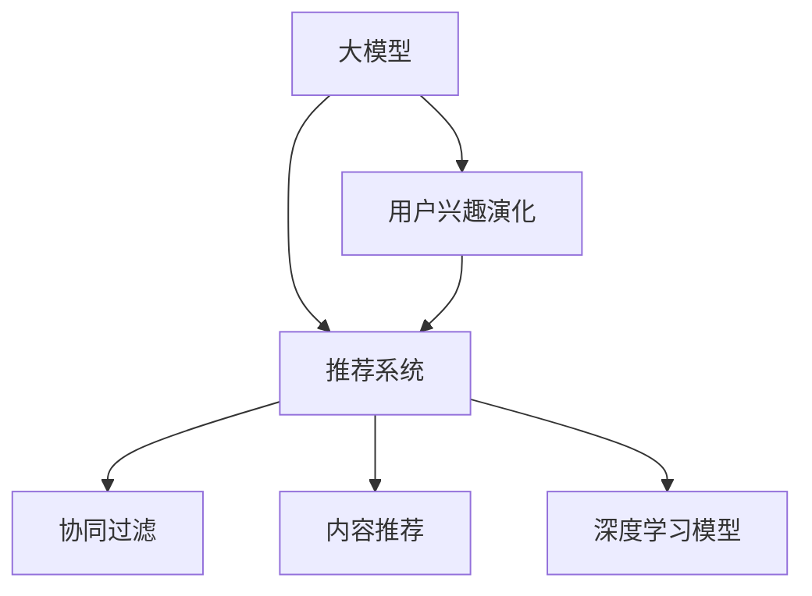

                 

# 大模型在推荐系统用户兴趣动态演化中的作用

## 1. 背景介绍

### 1.1 问题由来
在当今数字化时代，推荐系统已广泛应用于电商、社交、新闻等领域，成为了用户获取信息、发现产品和服务的重要工具。推荐系统通过分析用户的历史行为数据，预测用户未来的需求，从而提供个性化的内容和推荐，提升用户体验。然而，用户的兴趣和需求是动态变化的，受制于多种外部因素，如时间、地点、情境、社交网络等。如何在动态变化的用户兴趣中准确捕捉和预测，成为推荐系统研究的一大挑战。

### 1.2 问题核心关键点
大模型，尤其是基于深度学习的模型，近年来在自然语言处理、计算机视觉等领域取得了突破性进展。它们通过大规模数据训练，能够学习到复杂、丰富的特征表示，适用于复杂、高维度的数据处理。在推荐系统中，大模型可以用于分析用户的行为数据、评论数据、社交网络数据等，挖掘用户的兴趣演化规律，动态调整推荐策略，提高推荐效果。

## 2. 核心概念与联系

### 2.1 核心概念概述

为更好地理解大模型在推荐系统中的作用，本节将介绍几个密切相关的核心概念：

- **大模型(Large Model)**：以Transformer、BERT、GPT等为代表的大规模预训练模型。通过大规模数据训练，学习到丰富的特征表示，能够处理高维度、复杂性的数据。

- **用户兴趣演化**：用户对内容、产品、服务的偏好和兴趣是动态变化的，受多因素影响。推荐系统需要动态捕捉这些变化，及时调整推荐内容。

- **推荐系统(Recommendation System)**：通过分析用户历史行为数据，预测用户未来需求，提供个性化推荐的系统。

- **协同过滤(Collaborative Filtering)**：基于用户相似度和物品相似度进行推荐，常用于内容推荐系统。

- **内容推荐(Content-Based Filtering)**：基于用户行为和物品属性进行推荐，常用于电子商务、新闻、视频等领域。

- **深度学习模型(Deep Learning Model)**：以神经网络为代表的学习模型，通过多层非线性变换提取高维特征，适用于复杂数据处理。

这些概念之间的逻辑关系可以通过以下Mermaid流程图来展示：



这个流程图展示了大模型、用户兴趣演化、推荐系统等核心概念及其之间的关系：

1. 大模型通过分析用户历史行为数据，学习到用户兴趣的变化规律。
2. 推荐系统利用大模型学习到的用户兴趣，动态调整推荐策略。
3. 协同过滤和内容推荐是推荐系统的两种常见方式。
4. 深度学习模型是大模型在推荐系统中的一个重要应用。

## 3. 核心算法原理 & 具体操作步骤

### 3.1 算法原理概述

基于大模型的推荐系统，其核心思想是：利用大模型的预训练特征表示，动态捕捉用户兴趣的变化，实时调整推荐策略，提供个性化的推荐内容。

形式化地，假设推荐系统中的用户数据集为 $D=\{(x_i, y_i)\}_{i=1}^N$，其中 $x_i$ 为用户的兴趣表示向量，$y_i$ 为推荐结果。大模型的预训练参数为 $\theta$，则推荐函数可以表示为 $M_{\theta}(x)$。推荐系统的目标是最大化用户对推荐结果的满意度，即最大化预测准确率：

$$
\max_{\theta} \frac{1}{N} \sum_{i=1}^N y_i \log M_{\theta}(x_i) + (1-y_i) \log (1-M_{\theta}(x_i))
$$

通过优化上述目标函数，可以不断调整大模型的参数，使得推荐结果更加符合用户的兴趣需求。

### 3.2 算法步骤详解

基于大模型的推荐系统一般包括以下几个关键步骤：

**Step 1: 数据准备**
- 收集用户的历史行为数据，包括浏览记录、购买记录、评分记录等。
- 提取用户兴趣特征，如点击次数、购买频率、评论情感等，转换为向量形式。

**Step 2: 特征提取**
- 使用预训练大模型，如BERT、GPT等，对用户兴趣特征进行嵌入，得到高维特征向量。
- 使用多层的神经网络对高维特征进行非线性变换，提取更丰富的用户兴趣表示。

**Step 3: 模型训练**
- 将用户兴趣表示向量作为输入，推荐结果作为标签，训练深度学习模型。
- 使用优化算法，如Adam、SGD等，最小化预测误差。
- 引入正则化技术，防止过拟合。

**Step 4: 推荐策略调整**
- 根据实时更新的用户兴趣特征，重新训练深度学习模型，更新模型参数。
- 动态调整推荐策略，如增加热门物品的权重，调整推荐排序等。

**Step 5: 效果评估**
- 在推荐结果上计算评估指标，如准确率、召回率、F1-score等。
- 根据评估结果，进一步优化模型参数和推荐策略。

以上是基于大模型的推荐系统的一般流程。在实际应用中，还需要针对具体任务和数据特点，对各环节进行优化设计，如引入更多的正则化技术、选择适当的损失函数等。

### 3.3 算法优缺点

基于大模型的推荐系统具有以下优点：
1. 能够处理高维度、复杂性的数据，提取丰富的用户兴趣表示。
2. 动态捕捉用户兴趣变化，实时调整推荐策略。
3. 适用于多种推荐场景，包括电商、社交、新闻等。
4. 通过大规模预训练，可以获得更强的泛化能力。

同时，该方法也存在一些局限性：
1. 对标注数据的需求较高，需要大量用户行为数据进行预训练。
2. 模型计算成本高，对计算资源要求较高。
3. 模型复杂度高，可能存在过拟合问题。
4. 对实时数据处理能力要求高，需要快速计算更新推荐结果。

尽管存在这些局限性，但就目前而言，基于大模型的推荐方法已经成为推荐系统研究的主流范式。未来相关研究的重点在于如何进一步降低计算成本，提高模型泛化能力，同时兼顾实时性需求。

### 3.4 算法应用领域

基于大模型的推荐系统已经在多个领域得到了广泛应用，例如：

- 电商推荐：根据用户浏览、购买记录，推荐用户可能感兴趣的商品。
- 视频推荐：根据用户观看历史、评分数据，推荐用户可能喜欢的视频。
- 新闻推荐：根据用户阅读历史、点击数据，推荐用户感兴趣的新闻。
- 社交推荐：根据用户互动历史、兴趣爱好，推荐用户可能感兴趣的人或内容。
- 金融推荐：根据用户投资历史、交易记录，推荐用户可能感兴趣的金融产品。

除了上述这些经典应用外，大模型推荐方法还被创新性地应用到更多场景中，如健康推荐、旅游推荐、物流推荐等，为推荐系统带来了新的突破。随着大模型技术的不断发展，未来推荐系统的应用领域将更加广泛。

## 4. 数学模型和公式 & 详细讲解 & 举例说明

### 4.1 数学模型构建

本节将使用数学语言对基于大模型的推荐系统进行更加严格的刻画。

假设用户历史行为数据为 $D=\{(x_i, y_i)\}_{i=1}^N$，其中 $x_i \in \mathbb{R}^d$ 为用户兴趣表示向量，$y_i \in \{0,1\}$ 为推荐结果。大模型的预训练参数为 $\theta$，则推荐函数可以表示为 $M_{\theta}(x)$。推荐系统的目标是最大化用户对推荐结果的满意度，即最大化预测准确率：

$$
\max_{\theta} \frac{1}{N} \sum_{i=1}^N y_i \log M_{\theta}(x_i) + (1-y_i) \log (1-M_{\theta}(x_i))
$$

在实践中，我们通常使用基于梯度的优化算法（如Adam、SGD等）来近似求解上述最优化问题。设 $\eta$ 为学习率，则参数的更新公式为：

$$
\theta \leftarrow \theta - \eta \nabla_{\theta}\mathcal{L}(\theta)
$$

其中 $\nabla_{\theta}\mathcal{L}(\theta)$ 为损失函数对参数 $\theta$ 的梯度，可通过反向传播算法高效计算。

### 4.2 公式推导过程

以下我们以二分类任务为例，推导交叉熵损失函数及其梯度的计算公式。

假设模型 $M_{\theta}$ 在输入 $x$ 上的输出为 $\hat{y}=M_{\theta}(x) \in [0,1]$，表示用户对推荐结果的预测概率。真实标签 $y \in \{0,1\}$。则二分类交叉熵损失函数定义为：

$$
\ell(M_{\theta}(x),y) = -[y\log \hat{y} + (1-y)\log (1-\hat{y})]
$$

将其代入经验风险公式，得：

$$
\mathcal{L}(\theta) = -\frac{1}{N}\sum_{i=1}^N [y_i\log M_{\theta}(x_i)+(1-y_i)\log(1-M_{\theta}(x_i))]
$$

根据链式法则，损失函数对参数 $\theta_k$ 的梯度为：

$$
\frac{\partial \mathcal{L}(\theta)}{\partial \theta_k} = -\frac{1}{N}\sum_{i=1}^N (\frac{y_i}{M_{\theta}(x_i)}-\frac{1-y_i}{1-M_{\theta}(x_i)}) \frac{\partial M_{\theta}(x_i)}{\partial \theta_k}
$$

其中 $\frac{\partial M_{\theta}(x_i)}{\partial \theta_k}$ 可进一步递归展开，利用自动微分技术完成计算。

### 4.3 案例分析与讲解

以下以电商推荐系统为例，展示大模型在推荐系统中的应用。

**案例背景**：某电商网站收集了用户的浏览、购买、评价数据，并希望通过这些数据进行个性化推荐，提高用户满意度。

**数据准备**：
- 收集用户的历史行为数据，包括浏览记录、购买记录、评分记录等。
- 提取用户兴趣特征，如点击次数、购买频率、评分情感等，转换为向量形式。

**特征提取**：
- 使用BERT模型对用户兴趣特征进行嵌入，得到高维特征向量。
- 使用多层的神经网络对高维特征进行非线性变换，提取更丰富的用户兴趣表示。

**模型训练**：
- 将用户兴趣表示向量作为输入，推荐结果作为标签，训练深度学习模型。
- 使用Adam优化算法，最小化预测误差。
- 引入正则化技术，防止过拟合。

**推荐策略调整**：
- 根据实时更新的用户兴趣特征，重新训练深度学习模型，更新模型参数。
- 动态调整推荐策略，如增加热门物品的权重，调整推荐排序等。

**效果评估**：
- 在推荐结果上计算评估指标，如准确率、召回率、F1-score等。
- 根据评估结果，进一步优化模型参数和推荐策略。

以上电商推荐系统的实现流程展示了基于大模型的推荐系统的一般步骤。通过优化用户兴趣特征提取和推荐模型训练，可以实现动态捕捉用户兴趣变化，提高推荐效果。

## 5. 项目实践：代码实例和详细解释说明

### 5.1 开发环境搭建

在进行推荐系统开发前，我们需要准备好开发环境。以下是使用Python进行TensorFlow开发的环境配置流程：

1. 安装Anaconda：从官网下载并安装Anaconda，用于创建独立的Python环境。

2. 创建并激活虚拟环境：
```bash
conda create -n tf-env python=3.8 
conda activate tf-env
```

3. 安装TensorFlow：根据CUDA版本，从官网获取对应的安装命令。例如：
```bash
pip install tensorflow==2.7
```

4. 安装各类工具包：
```bash
pip install numpy pandas scikit-learn matplotlib tqdm jupyter notebook ipython
```

完成上述步骤后，即可在`tf-env`环境中开始推荐系统开发。

### 5.2 源代码详细实现

下面以电商推荐系统为例，展示使用TensorFlow进行推荐系统开发的代码实现。

首先，定义推荐系统的数据处理函数：

```python
import tensorflow as tf
from tensorflow.keras import layers

def preprocess_data(data):
    # 将数据转换为tensorflow数据格式
    data = tf.data.Dataset.from_tensor_slices(data)
    data = data.shuffle(buffer_size=10000)
    data = data.batch(batch_size=64)
    return data
```

然后，定义推荐模型的结构：

```python
model = tf.keras.Sequential([
    layers.Embedding(input_dim=vocab_size, output_dim=128, input_length=max_length),
    layers.GlobalAveragePooling1D(),
    layers.Dense(128, activation='relu'),
    layers.Dense(1, activation='sigmoid')
])
```

接着，定义模型训练函数：

```python
def train_model(model, data, epochs=10, batch_size=64):
    model.compile(loss='binary_crossentropy', optimizer='adam', metrics=['accuracy'])
    model.fit(data, epochs=epochs, batch_size=batch_size)
```

最后，启动训练流程：

```python
vocab_size = 10000
max_length = 100

# 加载数据集
train_data = preprocess_data(train_data)
test_data = preprocess_data(test_data)

# 构建模型
model = build_model(vocab_size, max_length)

# 训练模型
train_model(model, train_data, batch_size=64, epochs=10)

# 测试模型
test_loss, test_accuracy = model.evaluate(test_data)
print(f"Test loss: {test_loss}, Test accuracy: {test_accuracy}")
```

以上就是使用TensorFlow进行电商推荐系统开发的完整代码实现。可以看到，通过TensorFlow的Keras API，可以很方便地构建、训练和评估推荐模型。

### 5.3 代码解读与分析

让我们再详细解读一下关键代码的实现细节：

**preprocess_data函数**：
- 将数据转换为tensorflow数据格式，并进行批处理和随机化。

**推荐模型结构**：
- 使用Embedding层将用户兴趣特征转换为高维向量。
- 通过GlobalAveragePooling1D层对高维向量进行平均池化，提取特征。
- 使用Dense层进行非线性变换，提取更丰富的用户兴趣表示。
- 使用sigmoid激活函数进行二分类预测。

**train_model函数**：
- 使用Adam优化算法和二分类交叉熵损失函数，训练推荐模型。
- 引入accuracy作为评估指标。

**训练流程**：
- 加载数据集，并进行预处理。
- 构建推荐模型。
- 使用train_model函数训练模型，并进行测试评估。

可以看到，TensorFlow的Keras API提供了方便的高级API接口，可以极大地简化推荐模型的开发流程。开发者可以将更多精力放在模型优化和效果评估上，而不必过多关注底层的实现细节。

当然，工业级的系统实现还需考虑更多因素，如模型的保存和部署、超参数的自动搜索、更灵活的任务适配层等。但核心的推荐流程基本与此类似。

## 6. 实际应用场景

### 6.1 智能推荐系统

基于大模型的推荐系统可以广泛应用于智能推荐系统的构建。传统推荐系统往往需要配备大量人力，高峰期响应缓慢，且推荐结果的个性化程度不高。而使用大模型进行推荐，可以实时动态捕捉用户兴趣变化，提供更加个性化、精准的推荐结果。

在技术实现上，可以收集用户的历史行为数据，提取和用户交互的物品标题、描述、标签等文本内容。使用大模型对文本进行嵌入，得到高维特征向量，用于构建推荐模型。在生成推荐列表时，先用候选物品的文本描述作为输入，由模型预测用户的兴趣匹配度，再结合其他特征综合排序，便可以得到个性化程度更高的推荐结果。

### 6.2 金融产品推荐

金融行业需要实时推荐符合用户需求的产品，如理财产品、保险、基金等。传统推荐系统往往只依赖用户的历史行为数据，无法深入理解用户的真实需求。基于大模型的推荐系统可以更好地挖掘用户行为背后的语义信息，从而提供更精准、多样的金融产品推荐。

在实践中，可以收集用户浏览、点击、购买、评分等行为数据，提取和金融产品相关的文本信息。使用大模型对文本进行嵌入，得到高维特征向量，用于构建推荐模型。在生成推荐列表时，先用候选金融产品的描述作为输入，由模型预测用户的兴趣匹配度，再结合其他特征综合排序，便可以得到个性化程度更高的金融产品推荐。

### 6.3 内容推荐系统

内容推荐系统广泛应用于新闻、视频、音乐等领域，通过分析用户的历史行为数据，推荐用户可能感兴趣的内容。传统推荐系统往往只依赖用户的历史行为数据，无法深入理解用户的内容偏好。基于大模型的推荐系统可以更好地挖掘用户行为背后的语义信息，从而提供更精准、多样的内容推荐。

在实践中，可以收集用户的历史行为数据，提取和内容相关的文本信息。使用大模型对文本进行嵌入，得到高维特征向量，用于构建推荐模型。在生成推荐列表时，先用候选内容的描述作为输入，由模型预测用户的兴趣匹配度，再结合其他特征综合排序，便可以得到个性化程度更高的内容推荐。

### 6.4 未来应用展望

随着大模型和推荐技术的发展，基于大模型的推荐系统将在更多领域得到应用，为各行各业带来变革性影响。

在智慧医疗领域，基于大模型的推荐系统可以推荐符合患者需求的治疗方案、药品、手术等，提升医疗服务的个性化和精准度。

在智能教育领域，基于大模型的推荐系统可以推荐符合学生学习需求的教学资源、作业、练习等，提升教育服务的个性化和效率。

在智能家居领域，基于大模型的推荐系统可以推荐符合用户生活习惯的智能设备、家居产品等，提升用户的生活体验和便利性。

此外，在广告投放、旅游推荐、物流推荐等更多场景中，基于大模型的推荐系统也将不断涌现，为推荐系统带来新的突破。

## 7. 工具和资源推荐

### 7.1 学习资源推荐

为了帮助开发者系统掌握大模型在推荐系统中的应用，这里推荐一些优质的学习资源：

1. 《推荐系统原理与实践》系列博文：由大模型技术专家撰写，深入浅出地介绍了推荐系统的基本原理和经典算法。

2. 《Deep Learning for Recommendation Systems》课程：由Coursera提供，由斯坦福大学教授主讲，涵盖推荐系统的基础知识和深度学习在推荐中的应用。

3. 《深度推荐系统》书籍：清华大学出版社出版的推荐系统经典教材，详细介绍了推荐系统的基础知识和深度学习在推荐中的应用。

4. HuggingFace官方文档：推荐系统的知名开源库，提供了海量预训练模型和完整的推荐系统开发样例代码。

5. CLUE开源项目：中文推荐系统评测基准，涵盖大量不同类型的中文推荐数据集，并提供了基于深度学习的推荐baseline模型。

通过对这些资源的学习实践，相信你一定能够快速掌握大模型在推荐系统中的应用，并用于解决实际的推荐问题。

### 7.2 开发工具推荐

高效的开发离不开优秀的工具支持。以下是几款用于推荐系统开发的常用工具：

1. TensorFlow：基于Python的开源深度学习框架，灵活动态的计算图，适合快速迭代研究。推荐系统的大模型一般使用TensorFlow进行实现。

2. PyTorch：基于Python的开源深度学习框架，灵活高效的自动微分系统，适用于大规模工程应用。推荐系统的大模型也可以使用PyTorch进行实现。

3. Apache Spark：用于大规模数据处理和机器学习的分布式计算框架，适用于数据量大、计算密集的推荐系统开发。

4. Kubeflow：用于机器学习模型的分布式训练和推理的Kubernetes框架，支持多种深度学习框架，适用于大规模工业级推荐系统部署。

5. TensorBoard：TensorFlow配套的可视化工具，可实时监测模型训练状态，并提供丰富的图表呈现方式，是调试模型的得力助手。

合理利用这些工具，可以显著提升推荐系统的开发效率，加快创新迭代的步伐。

### 7.3 相关论文推荐

大模型在推荐系统中的应用源于学界的持续研究。以下是几篇奠基性的相关论文，推荐阅读：

1. "Neural Collaborative Filtering"：提出基于神经网络的协同过滤方法，为推荐系统提供新的深度学习范式。

2. "Deep Matrix Factorization"：提出基于深度矩阵分解的方法，为推荐系统提供新的深度学习范式。

3. "Attention is All You Need"：提出Transformer结构，开启了NLP领域的预训练大模型时代，也为推荐系统提供了新的预训练范式。

4. "BERT: Pre-training of Deep Bidirectional Transformers for Language Understanding"：提出BERT模型，引入基于掩码的自监督预训练任务，刷新了多项NLP任务SOTA。

5. "Model-Based Deep Collaborative Filtering"：提出基于模型的方法，将协同过滤和内容推荐融合，提升推荐系统的效果和泛化能力。

这些论文代表了大模型在推荐系统中的应用发展脉络。通过学习这些前沿成果，可以帮助研究者把握学科前进方向，激发更多的创新灵感。

## 8. 总结：未来发展趋势与挑战

### 8.1 总结

本文对基于大模型的推荐系统进行了全面系统的介绍。首先阐述了大模型在推荐系统中的应用背景和重要性，明确了推荐系统对用户兴趣动态演化的处理能力。其次，从原理到实践，详细讲解了大模型在推荐系统中的应用流程和数学模型，给出了推荐系统开发的完整代码实例。同时，本文还广泛探讨了大模型在电商、金融、内容推荐等多个领域的应用前景，展示了大模型在推荐系统中的巨大潜力。此外，本文精选了大模型推荐系统的学习资源，力求为读者提供全方位的技术指引。

通过本文的系统梳理，可以看到，基于大模型的推荐系统已经在推荐系统研究中占据重要地位，成为推荐系统研究的主流范式，极大地拓展了推荐系统的应用边界。利用大模型进行推荐，可以更好地动态捕捉用户兴趣变化，实时调整推荐策略，提高推荐效果。未来，伴随大模型和推荐技术的持续演进，基于大模型的推荐系统必将在更多领域得到应用，为推荐系统带来新的突破。

### 8.2 未来发展趋势

展望未来，大模型在推荐系统中的应用将呈现以下几个发展趋势：

1. 模型规模持续增大。随着算力成本的下降和数据规模的扩张，预训练语言模型的参数量还将持续增长。超大规模语言模型蕴含的丰富语言知识，有望支撑更加复杂多变的推荐场景。

2. 推荐模型更加多样化。除了传统的协同过滤和内容推荐外，未来将涌现更多基于大模型的推荐方法，如基于知识图谱的推荐、基于多模态数据的推荐等，进一步提升推荐系统的效果和泛化能力。

3. 动态推荐更加实时化。随着实时数据处理技术的发展，推荐系统可以实时捕捉用户兴趣变化，动态调整推荐策略，实现更加个性化的推荐。

4. 推荐系统更加跨领域。未来的推荐系统将不再局限于单一领域，而是通过跨领域数据融合，实现更加全面、精准的推荐。

5. 推荐系统更加人性化。未来的推荐系统将更多地考虑用户情感、心理状态等个性化因素，提供更加贴合用户需求和情感的推荐内容。

以上趋势凸显了大模型在推荐系统中的应用前景。这些方向的探索发展，必将进一步提升推荐系统的性能和应用范围，为推荐系统带来新的突破。

### 8.3 面临的挑战

尽管大模型在推荐系统中的应用取得了显著成效，但在迈向更加智能化、普适化应用的过程中，它仍面临着诸多挑战：

1. 数据标注成本高。尽管大模型可以动态捕捉用户兴趣变化，但其训练需要大量标注数据，这对标注数据量大的场景可能是一个挑战。如何降低数据标注成本，提高数据标注效率，仍然是一个亟待解决的问题。

2. 计算资源需求高。大模型在推荐系统中的应用需要大量计算资源，如何优化模型结构，降低计算成本，提升计算效率，仍然是一个重要的研究方向。

3. 模型解释性不足。当前大模型在推荐系统中的应用往往缺乏可解释性，难以解释推荐结果的决策过程。如何在保证推荐效果的同时，提高模型的可解释性，仍然是一个重要的研究方向。

4. 数据隐私和安全问题。推荐系统往往需要处理大量用户隐私数据，如何保护用户隐私，防止数据滥用，仍然是一个重要的研究方向。

5. 用户接受度问题。推荐系统是否能够满足用户需求，提高用户满意度，仍然是一个重要的研究方向。

尽管面临这些挑战，但相信通过学界和产业界的共同努力，这些挑战终将一一被克服，大模型在推荐系统中的应用必将迎来更加广泛的应用前景。

### 8.4 研究展望

面向未来，大模型在推荐系统中的应用还需要在以下几个方向进行深入研究：

1. 探索无监督和半监督推荐方法。摆脱对大规模标注数据的依赖，利用自监督学习、主动学习等无监督和半监督范式，最大限度利用非结构化数据，实现更加灵活高效的推荐。

2. 研究参数高效和计算高效的推荐范式。开发更加参数高效的推荐方法，在固定大部分预训练参数的同时，只更新极少量的任务相关参数。同时优化推荐模型的计算图，减少前向传播和反向传播的资源消耗，实现更加轻量级、实时性的部署。

3. 引入更多先验知识。将符号化的先验知识，如知识图谱、逻辑规则等，与神经网络模型进行巧妙融合，引导推荐过程学习更准确、合理的推荐知识。同时加强不同模态数据的整合，实现视觉、语音等多模态信息与文本信息的协同建模。

4. 结合因果分析和博弈论工具。将因果分析方法引入推荐模型，识别出模型决策的关键特征，增强推荐结果的因果性和逻辑性。借助博弈论工具刻画人机交互过程，主动探索并规避模型的脆弱点，提高系统稳定性。

5. 纳入伦理道德约束。在推荐系统训练目标中引入伦理导向的评估指标，过滤和惩罚有害的推荐内容，确保推荐系统的公平性和伦理性。同时加强人工干预和审核，建立推荐系统的监管机制，确保推荐内容符合用户价值观和伦理道德。

这些研究方向的探索，必将引领大模型在推荐系统中的应用走向更高的台阶，为构建安全、可靠、可解释、可控的推荐系统铺平道路。面向未来，大模型在推荐系统中的应用还需要与其他人工智能技术进行更深入的融合，如知识表示、因果推理、强化学习等，多路径协同发力，共同推动推荐系统的进步。只有勇于创新、敢于突破，才能不断拓展推荐系统的边界，让推荐技术更好地服务于人类社会。

## 9. 附录：常见问题与解答

**Q1：大模型在推荐系统中的训练需要大量标注数据吗？**

A: 大模型在推荐系统中的应用通常需要大量标注数据进行预训练和微调。然而，通过动态捕捉用户兴趣变化，大模型也可以逐步学习到用户的真实需求，从而提升推荐效果。在实际应用中，可以使用部分标注数据进行预训练，然后使用无监督学习或半监督学习的方法，在实时数据上进行微调。

**Q2：大模型推荐系统对计算资源的需求是否很高？**

A: 大模型在推荐系统中的应用需要大量计算资源，特别是当模型参数量较大时。为了降低计算成本，可以使用参数高效的推荐方法，如LoRA、AdaLoRA等，减小模型参数量，提升计算效率。此外，可以使用分布式训练、混合精度训练等技术，优化计算资源的利用。

**Q3：大模型推荐系统的计算效率如何提升？**

A: 大模型推荐系统的计算效率可以通过以下方法提升：

1. 参数高效的推荐方法：使用LoRA、AdaLoRA等方法，减小模型参数量，提升计算效率。

2. 分布式训练：使用分布式训练技术，将训练任务分配到多台机器上进行并行计算，提高计算效率。

3. 混合精度训练：使用混合精度训练技术，将模型参数和计算数据转化为低精度格式，减少计算量，提升计算效率。

4. 模型压缩：使用模型压缩技术，如知识蒸馏、剪枝等，减小模型规模，提升计算效率。

**Q4：大模型推荐系统的可解释性如何提高？**

A: 大模型推荐系统的可解释性可以通过以下方法提高：

1. 引入因果推理：使用因果推理方法，解释推荐结果的因果性，提高模型的可解释性。

2. 使用可解释模型：使用可解释模型，如规则增强的神经网络、决策树等，提高推荐过程的可解释性。

3. 引入可解释因素：在推荐系统中引入可解释因素，如用户评论、产品评价等，提高推荐结果的可解释性。

4. 使用可解释技术：使用可解释技术，如LIME、SHAP等，分析推荐结果的影响因素，提高推荐过程的可解释性。

**Q5：大模型推荐系统的数据隐私和安全问题如何解决？**

A: 大模型推荐系统的数据隐私和安全问题可以通过以下方法解决：

1. 数据加密：对用户数据进行加密处理，防止数据泄露。

2. 数据匿名化：对用户数据进行匿名化处理，保护用户隐私。

3. 数据去标识化：对用户数据进行去标识化处理，保护用户隐私。

4. 联邦学习：使用联邦学习技术，将模型训练分布在多个设备上，防止数据集中存储。

5. 数据访问控制：对用户数据进行严格的访问控制，防止数据滥用。

**Q6：大模型推荐系统的用户接受度问题如何解决？**

A: 大模型推荐系统的用户接受度问题可以通过以下方法解决：

1. 用户反馈机制：建立用户反馈机制，收集用户对推荐结果的评价，改进推荐策略。

2. 个性化推荐：根据用户反馈，个性化推荐系统，提高推荐结果的用户满意度。

3. 透明度提升：提高推荐过程的透明度，使用户了解推荐结果的生成过程，提高用户接受度。

4. 算法公平性：确保推荐系统的公平性，防止算法偏见，提高用户接受度。

5. 用户引导：引导用户使用推荐系统，提高用户对推荐结果的信任度。

这些方法可以帮助大模型推荐系统解决用户接受度问题，提高推荐结果的用户满意度。

---

作者：禅与计算机程序设计艺术 / Zen and the Art of Computer Programming

