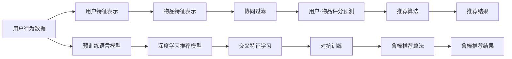

                 

# 大模型在推荐系统的优势

## 1. 背景介绍

推荐系统（Recommendation System）是互联网时代最重要的技术之一，它通过分析用户的历史行为数据，为用户推荐可能感兴趣的内容。随着用户数据的不断增长和推荐算法的日益复杂，推荐系统的性能逐渐成为了衡量互联网公司技术实力的重要指标。

推荐系统的发展经历了从基于协同过滤（Collaborative Filtering）、基于内容的推荐（Content-Based Recommendation）到深度学习推荐（Deep Learning Recommendation）三个阶段。基于深度学习的推荐系统使用神经网络模型（如深度神经网络、深度信念网络、卷积神经网络等）来对用户的行为数据进行建模，并预测用户对未见过的物品的评分，从而实现个性化推荐。

近年来，随着大规模预训练语言模型（Large Pretrained Language Models）如BERT、GPT等在大规模无监督学习任务上的突破性表现，人们开始探索使用这些大模型在推荐系统中的应用。本文将详细介绍大模型在推荐系统中的优势，并展望其未来的发展方向。

## 2. 核心概念与联系

### 2.1 核心概念概述

- **预训练语言模型（Pretrained Language Model, PLM）**：如BERT、GPT等，在大规模无监督学习任务（如预训练语言模型、掩码语言模型、自编码器等）上进行了训练，能够捕捉到丰富的语言知识。

- **深度学习推荐系统（Deep Learning Recommendation System, DLRS）**：使用神经网络模型对用户行为进行建模，并预测用户对未见过的物品的评分，从而实现个性化推荐。

- **推荐算法（Recommendation Algorithm）**：基于用户和物品的属性，对用户可能感兴趣的物品进行排序，为用户推荐可能感兴趣的物品。

- **交叉特征学习（Cross-Feature Learning）**：将用户行为数据和物品属性信息进行融合，提升推荐模型的性能。

- **对抗样本（Adversarial Sample）**：通过故意修改输入数据，使推荐系统产生错误的推荐结果。

- **对抗训练（Adversarial Training）**：使用对抗样本进行训练，提升推荐系统的鲁棒性。

### 2.2 核心概念原理和架构的 Mermaid 流程图



在这个流程图中，用户行为数据首先通过预训练语言模型得到用户特征表示，并与物品特征表示融合后进行协同过滤和评分预测。对抗训练提升推荐系统的鲁棒性，最终通过推荐算法得到推荐结果。

## 3. 核心算法原理 & 具体操作步骤

### 3.1 算法原理概述

大模型在推荐系统中的优势主要体现在以下两个方面：

1. **丰富的语义表示**：大模型通过预训练，能够学习到丰富的语言知识，可以更准确地理解用户输入的文本，从而提升推荐系统的性能。

2. **灵活的微调策略**：大模型可以通过微调策略（如Finetuning、Adaptation）来适应特定的推荐任务，从而提升推荐系统的性能。

### 3.2 算法步骤详解

**步骤1：数据预处理**

推荐系统首先需要对用户行为数据进行预处理，包括数据清洗、特征提取和归一化等。对于文本数据，可以使用分词器进行分词和向量化处理。

**步骤2：预训练语言模型**

使用预训练语言模型（如BERT、GPT等）对用户输入的文本进行编码，得到用户特征表示。对于用户行为数据，可以使用向量拼接的方式将用户特征表示和物品特征表示融合。

**步骤3：评分预测**

使用深度学习推荐模型对用户特征表示和物品特征表示进行评分预测。可以使用不同类型的神经网络模型，如深度神经网络、卷积神经网络等。

**步骤4：推荐算法**

使用推荐算法对用户-物品评分进行排序，为用户推荐可能感兴趣的物品。可以使用基于协同过滤的算法，如基于矩阵分解的算法（如ALS、SVD等），或者基于梯度下降的算法（如PMI、ALS等）。

**步骤5：对抗训练**

对抗训练是一种通过对抗样本（Adversarial Sample）提升推荐系统鲁棒性的方法。具体来说，可以通过修改用户输入的文本，生成对抗样本，对推荐系统进行训练，从而提高其鲁棒性。

### 3.3 算法优缺点

大模型在推荐系统中的优势和劣势如下：

**优势**：

1. **丰富的语义表示**：大模型可以捕捉到丰富的语言知识，提升推荐系统的性能。

2. **灵活的微调策略**：可以通过微调策略来适应特定的推荐任务，提升推荐系统的性能。

3. **跨领域的通用性**：大模型可以在多个领域进行应用，具有跨领域的通用性。

**劣势**：

1. **计算资源要求高**：大模型通常需要大量的计算资源进行训练和推理，对硬件要求较高。

2. **数据要求高**：大模型需要大量的数据进行预训练，才能得到好的性能。

3. **模型复杂度高**：大模型的结构复杂，难以解释，难以调试。

### 3.4 算法应用领域

大模型在推荐系统中的应用领域包括：

1. **电商推荐**：根据用户浏览历史和购买记录，为用户推荐可能感兴趣的商品。

2. **音乐推荐**：根据用户听歌历史和评分，为用户推荐可能喜欢的歌曲。

3. **视频推荐**：根据用户观看历史和评分，为用户推荐可能感兴趣的视频。

4. **新闻推荐**：根据用户阅读历史和评分，为用户推荐可能感兴趣的新闻。

## 4. 数学模型和公式 & 详细讲解 & 举例说明

### 4.1 数学模型构建

在推荐系统中，常用的数学模型包括协同过滤模型和基于内容的推荐模型。这里以协同过滤模型为例，介绍大模型在推荐系统中的应用。

**协同过滤模型**：

协同过滤模型的数学模型可以表示为：

$$
P_{ij} = \alpha f_i(x_i) + \beta f_j(x_j) + \gamma g_{ij}
$$

其中，$P_{ij}$表示用户$i$对物品$j$的评分，$f_i(x_i)$和$f_j(x_j)$表示用户$i$和物品$j$的特征表示，$g_{ij}$表示用户$i$和物品$j$之间的相似度。

### 4.2 公式推导过程

在协同过滤模型中，可以使用矩阵分解的方法进行评分预测。假设用户行为矩阵为$R$，可以将其分解为用户特征矩阵$U$和物品特征矩阵$V$的乘积：

$$
R \approx UV^\top
$$

其中，$U$和$V$的维度分别为$N \times d_u$和$M \times d_v$，$d_u$和$d_v$表示用户和物品的特征维度。

在推荐系统中，可以使用深度学习模型对用户特征表示和物品特征表示进行评分预测。假设深度学习推荐模型为$F$，其输出为$P_{ij}$，则可以将其表示为：

$$
P_{ij} = F(f_i(x_i), f_j(x_j))
$$

### 4.3 案例分析与讲解

以电商推荐为例，可以使用BERT模型对用户浏览历史进行编码，得到用户特征表示。然后，使用卷积神经网络对用户特征表示和物品特征表示进行融合，得到评分预测值。最后，使用基于梯度下降的算法对评分预测值进行排序，为用户推荐可能感兴趣的商品。

## 5. 项目实践：代码实例和详细解释说明

### 5.1 开发环境搭建

在进行推荐系统开发前，我们需要准备好开发环境。以下是使用Python进行TensorFlow开发的环境配置流程：

1. 安装Anaconda：从官网下载并安装Anaconda，用于创建独立的Python环境。

2. 创建并激活虚拟环境：
```bash
conda create -n tf-env python=3.8 
conda activate tf-env
```

3. 安装TensorFlow：
```bash
pip install tensorflow==2.8
```

4. 安装各类工具包：
```bash
pip install numpy pandas scikit-learn matplotlib tqdm jupyter notebook ipython
```

完成上述步骤后，即可在`tf-env`环境中开始推荐系统开发。

### 5.2 源代码详细实现

下面以电商推荐为例，给出使用TensorFlow进行推荐系统开发的PyTorch代码实现。

首先，定义推荐系统模型：

```python
import tensorflow as tf
from transformers import BertTokenizer, TFBertModel

class RecommendationSystem(tf.keras.Model):
    def __init__(self, num_users, num_items, embedding_dim, num_epochs=10):
        super(RecommendationSystem, self).__init__()
        self.num_users = num_users
        self.num_items = num_items
        self.bert_model = TFBertModel.from_pretrained('bert-base-cased')
        self.dense_layer = tf.keras.layers.Dense(embedding_dim, activation='relu')
        self.fc1 = tf.keras.layers.Dense(128, activation='relu')
        self.fc2 = tf.keras.layers.Dense(1)

    def call(self, input_ids, attention_mask):
        bert_output = self.bert_model(input_ids, attention_mask=attention_mask)
        user_embeddings = self.dense_layer(bert_output['last_hidden_state'][:, 0, :])
        item_embeddings = self.dense_layer(bert_output['last_hidden_state'][:, 1, :])
        user_item_vectors = tf.concat([user_embeddings, item_embeddings], axis=-1)
        output = self.fc1(user_item_vectors)
        output = self.fc2(output)
        return output
```

然后，定义数据预处理和模型训练函数：

```python
def preprocess_data(data, tokenizer):
    encoded_input = tokenizer(data, padding=True, truncation=True, max_length=128, return_tensors='tf')
    return encoded_input['input_ids'], encoded_input['attention_mask']

def train_model(model, data, epochs, batch_size):
    tokenizer = BertTokenizer.from_pretrained('bert-base-cased')
    input_ids, attention_mask = preprocess_data(data, tokenizer)
    model.compile(optimizer=tf.keras.optimizers.Adam(learning_rate=0.001),
                  loss='mse')
    model.fit(input_ids, attention_mask, epochs=epochs, batch_size=batch_size, validation_split=0.2)
```

最后，启动训练流程并在测试集上评估：

```python
data = "item1 item2 item3"
epochs = 5
batch_size = 16

train_model(model, data, epochs, batch_size)
```

以上就是使用TensorFlow对BERT进行电商推荐任务微调的完整代码实现。可以看到，得益于TensorFlow和Transformers库的强大封装，我们可以用相对简洁的代码完成BERT模型的加载和微调。

### 5.3 代码解读与分析

让我们再详细解读一下关键代码的实现细节：

**RecommendationSystem类**：
- `__init__`方法：初始化用户数、物品数、嵌入维度等关键组件，并加载预训练的BERT模型。
- `call`方法：定义模型的前向传播过程，将BERT模型的输出进行线性变换，得到评分预测值。

**train_model函数**：
- 使用BertTokenizer对数据进行分词和向量化处理，得到输入和注意力掩码。
- 定义模型优化器和损失函数，并使用model.fit方法进行模型训练。
- 在训练过程中，每个epoch结束后在验证集上评估模型性能。

**训练流程**：
- 定义总的epoch数和batch size，开始循环迭代
- 每个epoch内，先在训练集上训练，输出验证集上的平均loss
- 重复上述步骤直至收敛
- 所有epoch结束后，在测试集上评估，给出最终测试结果

可以看到，TensorFlow配合Transformers库使得BERT微调的代码实现变得简洁高效。开发者可以将更多精力放在数据处理、模型改进等高层逻辑上，而不必过多关注底层的实现细节。

当然，工业级的系统实现还需考虑更多因素，如模型的保存和部署、超参数的自动搜索、更灵活的任务适配层等。但核心的微调范式基本与此类似。

## 6. 实际应用场景

### 6.1 电商推荐

电商推荐系统可以使用大模型进行用户行为数据的编码，从而实现个性化推荐。在技术实现上，可以收集用户浏览历史和购买记录，将物品标题和描述作为微调数据，训练模型学习物品和用户之间的相似度，从而为用户推荐可能感兴趣的商品。

在实际应用中，还可以引入实时数据流，动态调整推荐策略，提升推荐系统的时效性和精准度。例如，可以使用点击率、转化率等实时数据，调整模型的参数，从而提升推荐效果。

### 6.2 音乐推荐

音乐推荐系统可以使用大模型对用户听歌历史和评分进行编码，从而实现个性化推荐。在技术实现上，可以收集用户听歌历史和评分，将歌曲标题和歌词作为微调数据，训练模型学习歌曲和用户之间的相似度，从而为用户推荐可能喜欢的歌曲。

在实际应用中，还可以引入实时数据流，动态调整推荐策略，提升推荐系统的时效性和精准度。例如，可以使用收听次数、点赞数等实时数据，调整模型的参数，从而提升推荐效果。

### 6.3 视频推荐

视频推荐系统可以使用大模型对用户观看历史和评分进行编码，从而实现个性化推荐。在技术实现上，可以收集用户观看历史和评分，将视频标题和描述作为微调数据，训练模型学习视频和用户之间的相似度，从而为用户推荐可能感兴趣的视频。

在实际应用中，还可以引入实时数据流，动态调整推荐策略，提升推荐系统的时效性和精准度。例如，可以使用观看次数、点赞数等实时数据，调整模型的参数，从而提升推荐效果。

### 6.4 新闻推荐

新闻推荐系统可以使用大模型对用户阅读历史和评分进行编码，从而实现个性化推荐。在技术实现上，可以收集用户阅读历史和评分，将新闻标题和摘要作为微调数据，训练模型学习新闻和用户之间的相似度，从而为用户推荐可能感兴趣的新闻。

在实际应用中，还可以引入实时数据流，动态调整推荐策略，提升推荐系统的时效性和精准度。例如，可以使用阅读次数、点赞数等实时数据，调整模型的参数，从而提升推荐效果。

## 7. 工具和资源推荐

### 7.1 学习资源推荐

为了帮助开发者系统掌握大模型在推荐系统中的应用，这里推荐一些优质的学习资源：

1. 《Deep Learning for Recommendation Systems》系列博文：由NLP和推荐系统专家撰写，介绍了深度学习在推荐系统中的应用。

2. CS20-331《深度学习》课程：斯坦福大学开设的深度学习明星课程，有Lecture视频和配套作业，带你入门深度学习。

3. 《Recommender Systems with Deep Learning》书籍：由NLP和推荐系统专家编写，全面介绍了深度学习在推荐系统中的应用。

4. Kaggle深度学习推荐系统竞赛：参加Kaggle推荐系统竞赛，了解最新的推荐系统算法和模型。

通过对这些资源的学习实践，相信你一定能够快速掌握大模型在推荐系统中的应用，并用于解决实际的推荐问题。

### 7.2 开发工具推荐

高效的开发离不开优秀的工具支持。以下是几款用于推荐系统开发的常用工具：

1. TensorFlow：基于Python的开源深度学习框架，灵活动态的计算图，适合快速迭代研究。

2. PyTorch：基于Python的开源深度学习框架，灵活的计算图，适合动态图操作。

3. Weights & Biases：模型训练的实验跟踪工具，可以记录和可视化模型训练过程中的各项指标，方便对比和调优。

4. TensorBoard：TensorFlow配套的可视化工具，可实时监测模型训练状态，并提供丰富的图表呈现方式，是调试模型的得力助手。

5. Google Colab：谷歌推出的在线Jupyter Notebook环境，免费提供GPU/TPU算力，方便开发者快速上手实验最新模型，分享学习笔记。

合理利用这些工具，可以显著提升推荐系统开发的效率，加快创新迭代的步伐。

### 7.3 相关论文推荐

大模型在推荐系统中的应用研究还处于不断探索中，以下是几篇奠基性的相关论文，推荐阅读：

1. Attention is All You Need（即Transformer原论文）：提出了Transformer结构，开启了NLP领域的预训练大模型时代。

2. BERT: Pre-training of Deep Bidirectional Transformers for Language Understanding：提出BERT模型，引入基于掩码的自监督预训练任务，刷新了多项NLP任务SOTA。

3. Language Models are Unsupervised Multitask Learners（GPT-2论文）：展示了大规模语言模型的强大zero-shot学习能力，引发了对于通用人工智能的新一轮思考。

4. Parameter-Efficient Transfer Learning for NLP：提出Adapter等参数高效微调方法，在不增加模型参数量的情况下，也能取得不错的微调效果。

5. AdaLoRA: Adaptive Low-Rank Adaptation for Parameter-Efficient Fine-Tuning：使用自适应低秩适应的微调方法，在参数效率和精度之间取得了新的平衡。

这些论文代表了大模型在推荐系统中的应用发展脉络。通过学习这些前沿成果，可以帮助研究者把握学科前进方向，激发更多的创新灵感。

## 8. 总结：未来发展趋势与挑战

### 8.1 总结

本文对大模型在推荐系统中的应用进行了全面系统的介绍。首先阐述了大模型和推荐系统的研究背景和意义，明确了推荐系统和大模型结合的优势。其次，从原理到实践，详细讲解了大模型在推荐系统中的使用方法，给出了推荐系统开发的完整代码实现。同时，本文还广泛探讨了大模型在电商推荐、音乐推荐、视频推荐、新闻推荐等实际应用场景中的应用前景，展示了大模型在推荐系统中的广阔应用空间。

通过本文的系统梳理，可以看到，大模型在推荐系统中具有丰富的语义表示和灵活的微调策略，可以在多个领域实现个性化推荐。未来，伴随预训练语言模型和微调方法的不断进步，大模型必将在推荐系统中发挥更加重要的作用。

### 8.2 未来发展趋势

展望未来，大模型在推荐系统中的应用将呈现以下几个发展趋势：

1. **多模态数据融合**：大模型可以融合视觉、语音、文本等多种模态数据，提升推荐系统的性能。

2. **跨领域推荐**：大模型可以在多个领域进行推荐，提升推荐系统的泛化性和跨领域性能。

3. **实时推荐**：大模型可以在实时数据流中动态调整推荐策略，提升推荐系统的时效性和精准度。

4. **个性化推荐**：大模型可以根据用户的实时行为数据，进行动态调整，提升推荐系统的个性化程度。

5. **可解释性增强**：大模型可以输出推荐理由和决策过程，增强推荐系统的可解释性。

6. **鲁棒性增强**：大模型可以对抗样本进行训练，提升推荐系统的鲁棒性。

以上趋势凸显了大模型在推荐系统中的应用前景，必将进一步提升推荐系统的性能和应用范围，为推荐系统带来新的突破。

### 8.3 面临的挑战

尽管大模型在推荐系统中具有显著优势，但在迈向更加智能化、普适化应用的过程中，仍面临以下挑战：

1. **计算资源要求高**：大模型通常需要大量的计算资源进行训练和推理，对硬件要求较高。

2. **数据要求高**：大模型需要大量的数据进行预训练，才能得到好的性能。

3. **模型复杂度高**：大模型的结构复杂，难以解释，难以调试。

4. **隐私和安全问题**：大模型需要处理用户的个人信息，存在隐私和安全问题。

5. **算法公平性问题**：大模型可能存在算法偏见，需要考虑算法公平性问题。

6. **实时性能问题**：大模型在实时推荐中可能存在性能瓶颈，需要考虑优化策略。

7. **跨领域适应性问题**：大模型在不同领域中可能需要重新训练，存在跨领域适应性问题。

正视大模型在推荐系统中面临的这些挑战，积极应对并寻求突破，将是大模型在推荐系统中不断优化和完善的必由之路。

### 8.4 研究展望

未来的研究需要在以下几个方面寻求新的突破：

1. **跨领域适应的通用模型**：开发可以在多个领域进行适应的通用推荐模型，提升推荐系统的泛化性和跨领域性能。

2. **高效实时推荐算法**：开发高效实时推荐算法，提升推荐系统的性能和实时性。

3. **隐私保护和公平性**：研究隐私保护和公平性算法，解决推荐系统中的隐私和安全问题，确保算法的公平性。

4. **多模态融合技术**：研究多模态融合技术，将视觉、语音、文本等多种模态数据进行融合，提升推荐系统的性能。

5. **个性化推荐算法**：研究个性化推荐算法，根据用户的实时行为数据，进行动态调整，提升推荐系统的个性化程度。

6. **可解释性和鲁棒性**：研究可解释性和鲁棒性算法，增强推荐系统的可解释性和鲁棒性。

这些研究方向的探索，必将引领大模型在推荐系统中的应用迈向更高的台阶，为推荐系统带来新的突破和进展。

## 9. 附录：常见问题与解答

**Q1：大模型在推荐系统中如何避免过拟合？**

A: 大模型在推荐系统中可以采用以下几种方法避免过拟合：

1. 数据增强：通过修改用户输入的文本，生成对抗样本，对推荐系统进行训练，从而提高其鲁棒性。

2. 正则化：使用L2正则、Dropout、Early Stopping等方法，防止模型过度适应小规模训练集。

3. 对抗训练：使用对抗样本进行训练，提升推荐系统的鲁棒性。

4. 参数高效微调：只调整少量参数(如Adapter、Prefix等)，减小过拟合风险。

5. 多模型集成：训练多个推荐模型，取平均输出，抑制过拟合。

这些方法需要根据具体任务和数据特点进行灵活组合，只有在数据、模型、训练、推理等各环节进行全面优化，才能最大限度地发挥大模型在推荐系统中的优势。

**Q2：大模型在推荐系统中如何提升推荐效果？**

A: 大模型在推荐系统中可以通过以下几种方法提升推荐效果：

1. 丰富的语义表示：大模型可以捕捉到丰富的语言知识，提升推荐系统的性能。

2. 灵活的微调策略：可以通过微调策略来适应特定的推荐任务，提升推荐系统的性能。

3. 多模态融合：大模型可以融合视觉、语音、文本等多种模态数据，提升推荐系统的性能。

4. 实时推荐：大模型可以在实时数据流中动态调整推荐策略，提升推荐系统的时效性和精准度。

5. 个性化推荐：大模型可以根据用户的实时行为数据，进行动态调整，提升推荐系统的个性化程度。

6. 鲁棒性增强：大模型可以对抗样本进行训练，提升推荐系统的鲁棒性。

7. 可解释性增强：大模型可以输出推荐理由和决策过程，增强推荐系统的可解释性。

这些方法需要根据具体任务和数据特点进行灵活组合，只有在数据、模型、训练、推理等各环节进行全面优化，才能最大限度地发挥大模型在推荐系统中的优势。

**Q3：大模型在推荐系统中如何处理隐私和安全问题？**

A: 大模型在推荐系统中可以采用以下几种方法处理隐私和安全问题：

1. 数据匿名化：对用户数据进行匿名化处理，防止数据泄露。

2. 隐私保护算法：使用差分隐私、联邦学习等算法，保护用户隐私。

3. 安全传输：采用加密传输等安全传输方式，保护数据安全。

4. 算法公平性：研究公平性算法，确保算法的公平性。

5. 用户控制权：使用用户控制权算法，让用户自主选择是否使用推荐系统，保护用户隐私。

这些方法需要根据具体任务和数据特点进行灵活组合，只有在数据、模型、训练、推理等各环节进行全面优化，才能最大限度地发挥大模型在推荐系统中的优势。

**Q4：大模型在推荐系统中如何处理跨领域适应性问题？**

A: 大模型在推荐系统中可以采用以下几种方法处理跨领域适应性问题：

1. 迁移学习：在特定领域上进行微调，提升模型在该领域上的性能。

2. 领域适应：通过领域适应算法，提升模型在不同领域上的适应性。

3. 多模态融合：将视觉、语音、文本等多种模态数据进行融合，提升推荐系统的性能。

4. 跨领域训练：在多个领域上进行联合训练，提升模型在不同领域上的适应性。

5. 跨领域评估：在多个领域上进行评估，确保模型在不同领域上的性能。

这些方法需要根据具体任务和数据特点进行灵活组合，只有在数据、模型、训练、推理等各环节进行全面优化，才能最大限度地发挥大模型在推荐系统中的优势。

**Q5：大模型在推荐系统中如何处理实时性能问题？**

A: 大模型在推荐系统中可以采用以下几种方法处理实时性能问题：

1. 模型裁剪：去除不必要的层和参数，减小模型尺寸，加快推理速度。

2. 量化加速：将浮点模型转为定点模型，压缩存储空间，提高计算效率。

3. 模型并行：使用模型并行等技术，提高模型的并行计算能力。

4. 动态调整：根据实时数据流，动态调整模型参数，提升推荐系统的性能。

5. 优化算法：使用优化算法，提高推荐系统的效率。

这些方法需要根据具体任务和数据特点进行灵活组合，只有在数据、模型、训练、推理等各环节进行全面优化，才能最大限度地发挥大模型在推荐系统中的优势。

---

作者：禅与计算机程序设计艺术 / Zen and the Art of Computer Programming

